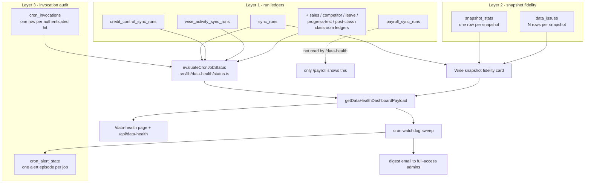
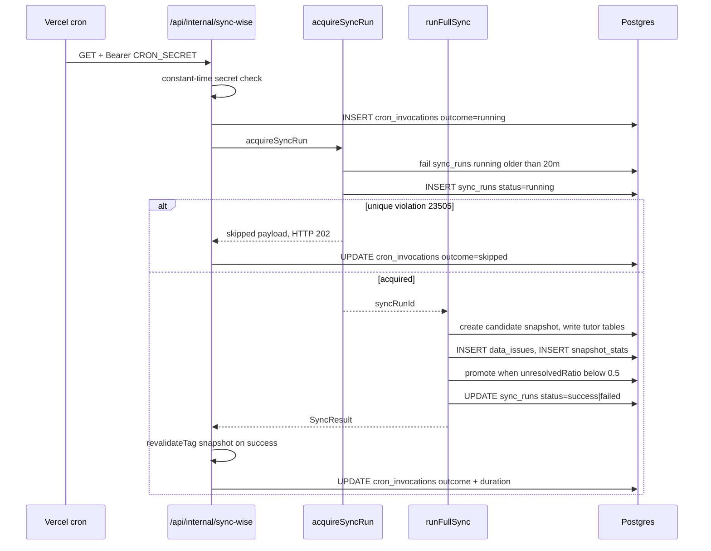
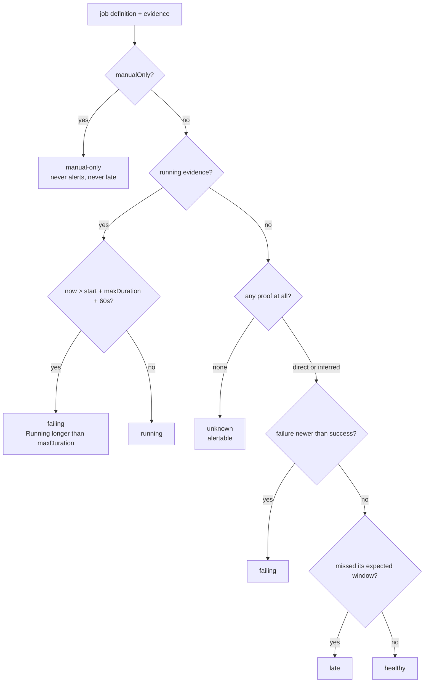
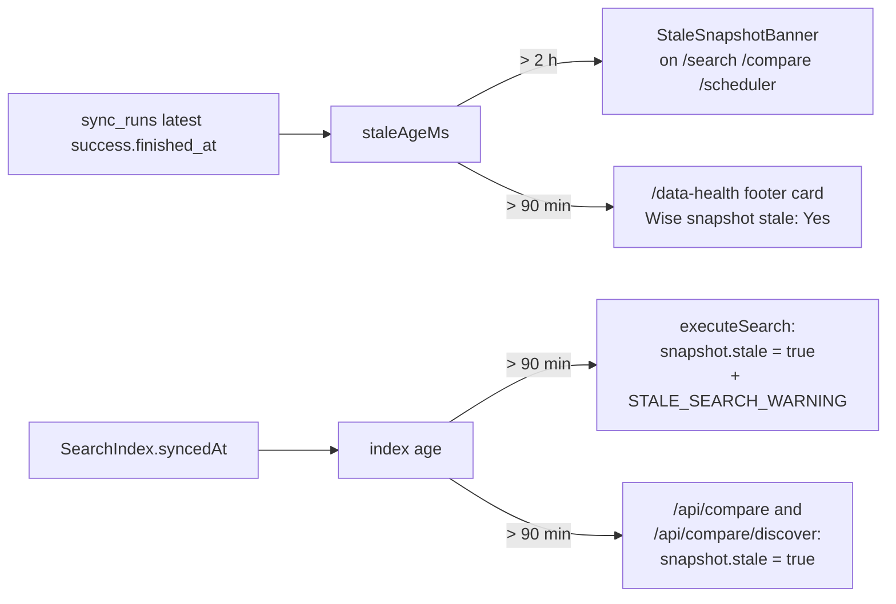

# Observability

How to tell whether BGScheduler is healthy, where the evidence physically lives, what each
failure mode looks like in the data, and how a stale snapshot gets flagged to the people using
the app.

This is the **operations** view: it explains the *mechanism* and how to read it during an
incident. Related canonical homes, which this page links to rather than restates:

- **Meaning of the Data Health workspace** — who reads it, what each card is *for*:
  [`docs/features/data-health.md`](../features/data-health.md).
- **Column-level table definitions**: [`docs/reference/database/index.md`](../reference/database/index.md)
  and [`docs/reference/database/enums.md`](../reference/database/enums.md).
- **Endpoint signatures**: [`docs/reference/api/index.md`](../reference/api/index.md).
- **The cron catalogue** — every schedule, path, auth tier:
  [`docs/reference/crons.md`](../reference/crons.md).
- **Recovery procedures**: [`docs/operations/runbook.md`](./runbook.md).

---

## 1. Three layers of evidence

Health is not stored in one place. Three independent layers answer three different questions,
and `/data-health` fuses them into one verdict per job.

| Layer | Tables | Question it answers | Durability |
|---|---|---|---|
| **Run ledgers** | `sync_runs`, `credit_control_sync_runs`, `wise_activity_sync_runs`, `payroll_sync_runs`, and ~10 sibling `*_runs` tables | *Did the pipeline do work, and did the work succeed?* | Durable — the run row outlives the snapshot it built |
| **Snapshot fidelity** | `snapshot_stats`, `data_issues` | *Is the data the pipeline produced trustworthy?* | Scoped to one `snapshot_id`; deleted when that snapshot is pruned |
| **Invocation audit** | `cron_invocations`, `cron_alert_state` | *Did Vercel actually reach the route, and has anyone been told it broke?* | Durable, independent of any feature table |


```mermaid
flowchart TB
  subgraph L3["Layer 3 - invocation audit"]
    CI["cron_invocations<br/>one row per authenticated hit"]
    CAS["cron_alert_state<br/>one alert episode per job"]
  end
  subgraph L1["Layer 1 - run ledgers"]
    SR["sync_runs"]
    CC["credit_control_sync_runs"]
    WA["wise_activity_sync_runs"]
    PR["payroll_sync_runs"]
    OTH["+ sales / competitor / leave /<br/>progress-test / post-class /<br/>classroom ledgers"]
  end
  subgraph L2["Layer 2 - snapshot fidelity"]
    SS["snapshot_stats<br/>one row per snapshot"]
    DI["data_issues<br/>N rows per snapshot"]
  end

  CI --> DERIVE["evaluateCronJobStatus<br/>src/lib/data-health/status.ts"]
  SR --> DERIVE
  CC --> DERIVE
  WA --> DERIVE
  OTH --> DERIVE
  SR --> SNAP["Wise snapshot fidelity card"]
  SS --> SNAP
  DI --> SNAP
  DERIVE --> PAYLOAD["getDataHealthDashboardPayload"]
  SNAP --> PAYLOAD
  PAYLOAD --> UI["/data-health page + /api/data-health"]
  PAYLOAD --> WD["cron watchdog sweep"]
  WD --> CAS
  WD --> MAIL["digest email to full-access admins"]
  PR -.->|not read by /data-health| X["only /payroll shows this"]
```

The two derivation entry points are `getDataHealthDashboardPayload`
(`src/lib/data-health/dashboard.ts:885`) for the human surface and `getCronJobsHealth`
(`src/lib/data-health/dashboard.ts:878`) for the watchdog — the latter is deliberately the same
status derivation with the snapshot/issue queries skipped, so an alert can never disagree with
the dashboard.

---

## 2. Layer 1 — the run ledgers

### 2.1 The shared ledger contract

Every long-running pipeline in this codebase writes the same shape, even though the tables are
independent:

1. **Fail abandoned rows first.** Any row still `running` after **20 minutes** is force-failed
   with a canned `errorSummary` before a new run is allowed. Same constant in each subsystem:
   `STALE_RUNNING_SYNC_MS` (`src/lib/sync/run-wise-sync.ts:10`),
   `STALE_RUNNING_CREDIT_CONTROL_SYNC_MS` (`src/lib/credit-control/run-sync-request.ts:9`),
   `STALE_RUNNING_MS` in Wise Activity (`src/lib/wise-activity/sync.ts:130-141`) and Payroll
   (`src/lib/payroll/sync.ts:24,125-137`).
2. **Insert a `running` row.** A **partial unique index** on `status` filtered to
   `status = 'running'` makes single-flight a database invariant, not a race-prone read-then-write:
   `sync_runs_single_running_idx` (`src/lib/db/schema.ts:473-475`),
   `ccsr_single_running_idx` (`src/lib/db/schema.ts:1177-1179`),
   `wise_activity_sync_runs_single_running_idx` (`src/lib/db/schema.ts:567-569`),
   `payroll_sync_runs_single_running_idx` (`src/lib/db/schema.ts:1773-1775`).
3. **Treat unique violation `23505` as "already running", not as an error.** Wise sync converts
   it into a `202` skipped response (`src/lib/sync/run-wise-sync.ts:42-49,106-118,149`); Wise
   Activity throws `WiseActivitySyncAlreadyRunningError`
   (`src/lib/wise-activity/sync.ts:51-54,182`), which the manual runner maps to HTTP `409`
   (`src/lib/data-health/run-job.ts:56-58`); Payroll throws `PayrollSyncAlreadyRunningError`
   (`src/lib/payroll/sync.ts:270-272`).
4. **Flip to `success` or `failed` with `finishedAt`** and, on failure, an `errorSummary` string.

The status vocabulary is one shared Postgres enum, `sync_status`, with exactly three values —
`running`, `success`, `failed` (`src/lib/db/schema.ts:21-25`). There is **no `skipped` or
`partial` status in the database**; those words only exist as derived labels in the dashboard
layer (`src/lib/data-health/dashboard.ts:112-133`).

> **Reading a ledger during an incident:** `status` tells you what the pipeline *thinks*
> happened. It does **not** tell you whether the work was published. For Wise sync those are two
> different things — see [§3.3](#33-the-promotion-gate-a-success-that-published-nothing).

### 2.2 `sync_runs` — the Wise snapshot ledger

Defined at `src/lib/db/schema.ts:462-477`. The columns that matter operationally:

| Column | Why you care |
|---|---|
| `status` | `running` / `success` / `failed` |
| `started_at` / `finished_at` | `finished_at` of the newest `success` row is the **staleness clock** |
| `snapshot_id` | the candidate snapshot this run built |
| `promoted_snapshot_id` | **null on a run that succeeded but did not promote** |
| `teacher_count` | sanity check against the previous run |
| `error_summary` | the thrown message, verbatim |
| `metadata` | `diffHookDurationMs`, `pastSessionsCapturedCount`, and a `pruning` sub-object |

Lifecycle, end to end:


```mermaid
sequenceDiagram
  participant V as Vercel cron
  participant R as /api/internal/sync-wise
  participant G as acquireSyncRun
  participant O as runFullSync
  participant DB as Postgres

  V->>R: GET + Bearer CRON_SECRET
  R->>R: constant-time secret check
  R->>DB: INSERT cron_invocations outcome=running
  R->>G: acquireSyncRun
  G->>DB: fail sync_runs running older than 20m
  G->>DB: INSERT sync_runs status=running
  alt unique violation 23505
    G-->>R: skipped payload, HTTP 202
    R->>DB: UPDATE cron_invocations outcome=skipped
  else acquired
    G-->>O: syncRunId
    O->>DB: create candidate snapshot, write tutor tables
    O->>DB: INSERT data_issues, INSERT snapshot_stats
    O->>DB: promote when unresolvedRatio below 0.5
    O->>DB: UPDATE sync_runs status=success|failed
    O-->>R: SyncResult
    R->>R: revalidateTag snapshot on success
    R->>DB: UPDATE cron_invocations outcome + duration
  end
```

Key line references: the guard and its 20-minute sweep are
`src/lib/sync/run-wise-sync.ts:51-118`; the `202` skip path is
`src/lib/sync/run-wise-sync.ts:120-150`; `revalidateTag("snapshot", { expire: 0 })` fires only
on success (`src/lib/sync/run-wise-sync.ts:160-162`); the orchestrator's success write is
`src/lib/sync/orchestrator.ts:509-518` and its failure write is
`src/lib/sync/orchestrator.ts:564-586`.

One deliberate hole to know about: if the *cleanup* update fails after a primary error, the row
stays `running` and only a `console.error` records why (REL-06,
`src/lib/sync/orchestrator.ts:573-585`). The 20-minute stale sweep is what eventually rescues
that row.

### 2.3 `credit_control_sync_runs`

`src/lib/db/schema.ts:1162-1180`. Same contract as `sync_runs`, with its own snapshot lineage
(`snapshot_id` / `promoted_snapshot_id` point at `credit_control_snapshots`) and three volume
counters: `student_count`, `package_count`, `session_count`.

The operationally interesting fact lives in the route, not the table: `maxDuration` was raised
from 300s to **800s** because successful runs were taking 372–390s, i.e. permanently over their
own limit — and a Vercel timeout kills the function mid-run and strands the `running` row until
the 20-minute sweep clears it (`src/app/api/internal/sync-credit-control/route.ts:7-14`). That
comment is the canonical worked example of the *stuck-running* failure mode described in
[§8](#8-failure-modes).

### 2.4 `wise_activity_sync_runs`

`src/lib/db/schema.ts:553-571`. Adds ingestion telemetry the other ledgers do not have:
`trigger_type` (`cron` vs `manual`), `pages_fetched`, `events_fetched`, `inserted_count`, and
the `oldest_event_timestamp` / `newest_event_timestamp` bracket of what was pulled.

`inserted_count` is the number that tells you whether the audit store is actually advancing —
`/data-health` surfaces it directly as the Wise Activity domain's record label
(`src/lib/data-health/dashboard.ts:511`). Cron and manual runs use different lookback windows
and page caps (`src/lib/wise-activity/sync.ts:158-164`), so a manual run inserting far more rows
than the cron does is expected, not a bug.

### 2.5 `payroll_sync_runs` — the ledger `/data-health` does not read

`src/lib/db/schema.ts:1760-1778`. It follows the same contract, plus:

- It is **keyed by `payroll_month`** (a `date`), with `trigger_type` defaulting to `"manual"`
  (`src/lib/db/schema.ts:1762-1764`). There is no payroll cron in `vercel.json` and no payroll
  entry in the cron registry.
- Its single-running partial index is **not scoped by month**
  (`src/lib/db/schema.ts:1773-1775`), so only one payroll month can sync at a time across the
  whole system. A second month attempted concurrently raises
  `PayrollSyncAlreadyRunningError`.
- Its `success` flip happens **inside** the `node-postgres` transaction that writes the payroll
  rows (`src/lib/payroll/sync.ts:414-425`), so unlike the neon-http ledgers, the status and the
  data it describes commit atomically.

**Where you observe it:** only `/payroll`. `getPayrollPayload` reads the newest run for the
requested month (`src/lib/payroll/data.ts:538-543`) and hands it to the payload as `lastSync`.
`payroll_sync_runs` is **absent from `fetchAllRuns`** (`src/lib/data-health/dashboard.ts:752-806`),
so a failed or stranded payroll sync never appears on `/data-health`, never colours the overall
verdict, and never reaches the watchdog email.

### 2.6 The ledgers `/data-health` does read

`fetchAllRuns` (`src/lib/data-health/dashboard.ts:752-806`) pulls the **8 most recent rows**
(`RECENT_LIMIT`, `src/lib/data-health/dashboard.ts:17`) from each of: `sync_runs`,
`wise_activity_sync_runs`, `sales_dashboard_import_runs`,
`sales_dashboard_projection_import_runs`, `competitor_sync_runs`, `credit_control_sync_runs`,
`leave_request_sync_runs`, `progress_test_sync_runs`, `progress_test_admin_digest_runs`,
`post_class_sync_runs`, `post_class_notification_runs` (32 rows — several notification kinds
share one table, so it gets `RECENT_LIMIT * 4`),
`classroom_assignment_runs`, `classroom_admin_email_runs`, plus a single newest
`room_utilization_sessions` row.

Two filters worth knowing:

- Classroom runs are narrowed to automation/cron rows only —
  `automation_batch_id IS NOT NULL OR created_by LIKE 'cron%'`
  (`src/lib/data-health/dashboard.ts:783`) — so an admin's ad-hoc room run cannot masquerade as
  the morning cron firing.
- `room_utilization_sessions` is a data table, not a ledger. The dashboard synthesises a
  `success` run from its newest row (`src/lib/data-health/dashboard.ts:320-340`).

---

## 3. Layer 2 — snapshot fidelity

### 3.1 `snapshot_stats`

`src/lib/db/schema.ts:2703-2719`. Exactly **one row per snapshot** (`ss_snapshot_idx` unique
index), written once near the end of a sync at `src/lib/sync/orchestrator.ts:458-470`. It is a
frozen census of what the sync produced: `total_wise_teachers`, `total_identity_groups`,
`resolved_groups`, `unresolved_groups`, `total_qualifications`,
`total_availability_windows`, `total_leaves`, `total_future_sessions`, `total_data_issues`, and
a pre-aggregated `issues_by_type` JSON map.

Two counting subtleties that matter when the numbers look odd:

- `resolved_groups` counts groups with no identity issue whose `entityId` matches the group's
  canonical key (`src/lib/sync/orchestrator.ts:462`).
- `unresolved_groups` is **the identity-issue count**, not a distinct group count
  (`src/lib/sync/orchestrator.ts:463`). If one group emits two identity issues, `resolved +
  unresolved` will not equal `total_identity_groups`.

`/data-health` reads this row only for the **currently active** snapshot
(`src/lib/data-health/dashboard.ts:902-936`). Historic snapshots keep their stats rows until
pruned, but nothing in the UI reads them.

### 3.2 `data_issues` by type and severity

`src/lib/db/schema.ts:2685-2699`, indexed on `snapshot_id` and on `(snapshot_id, type)`. Every
row is scoped to one snapshot; there is no cross-snapshot issue history.

`data_issue_type` has six values (`src/lib/db/schema.ts:27-34`) and `data_issue_severity` four,
defaulting to `high` (`src/lib/db/schema.ts:36-41`). What actually gets written:

| `type` | Severity used | Emitted where | Meaning |
|---|---|---|---|
| `alias` | `critical` | `src/lib/sync/orchestrator.ts:97-105` | Identity cascade could not resolve a teacher record into a group. Feeds the promotion gate. |
| `tag` | `high` | `src/lib/sync/orchestrator.ts:238-248` | A Wise tag did not map to any subject/curriculum/level/examPrep. |
| `modality` | `high` | `src/lib/sync/orchestrator.ts:339-349` | Group-level modality could not be derived. |
| `conflict_model` | `high` | `src/lib/sync/orchestrator.ts:381-392` | A future session contradicts its group's derived modality. |
| `completeness` | `high` | `src/lib/sync/orchestrator.ts:162-171`, `:249-259` | Availability could not be fetched for a teacher — missing Wise user id, or the fetch threw. |
| `completeness` | `medium` | `src/lib/sync/past-sessions-diff-hook.ts:122-130` | PAST-01 diff hook could not resolve a canonical key, so a dropped past session was not captured. |
| `sync` | — | *never emitted* | Declared in the enum; no producer exists in `src/`. |

Severity `low` is likewise declared and unused. **Severity is not a filter anywhere in the
read path** — neither the dashboard payload nor the UI queries or groups by it
(`src/lib/data-health/dashboard.ts:938-946` selects only `type`, `entity_name`, `message`).
Treat severity as documentation of intent at write time, not as a triage control.

The read path buckets issues into exactly three named lists
(`issueDetailsFromIssues`, `src/lib/data-health/dashboard.ts:413-429`):

- **Unresolved aliases** — `type = 'alias'`
- **Modality issues** — `type IN ('modality', 'conflict_model')`, merged deliberately under
  MOD-03/D-10 (`src/app/api/data-health/modality-counter.ts:1-31`)
- **Unmapped tags** — `type = 'tag'`

`completeness` issues therefore appear in the `issuesByType` badge row and in
`total_data_issues`, but have **no detail table** in the UI. To see them you must query
`data_issues` directly for the active snapshot.

### 3.3 The promotion gate: a `success` that published nothing

The single most misread signal in the system. After writing stats, the orchestrator computes:

```
unresolvedRatio = identityIssues.length / max(groups.length, 1)
shouldPromote   = unresolvedRatio < 0.5
```

(`src/lib/sync/orchestrator.ts:472-476`). If the gate blocks, the candidate snapshot is simply
never flipped to `active`, and the run is **still written as `status = 'success'`** with
`promoted_snapshot_id = null` (`src/lib/sync/orchestrator.ts:500,509-518`).

Consequences you must reason about during an incident:

- `/data-health` reports the Wise Snapshot job **healthy** — it only asks whether the run
  succeeded.
- `lastSuccessfulSync` advances, so the **staleness clock resets** even though the served data
  did not change (`src/lib/data-health/dashboard.ts:888-893,952-954`).
- The stale banner and the search `stale` warning therefore stay silent.
- The only visible tell is `Active snapshot <id>` in the page header
  (`src/components/data-health/data-health-dashboard.tsx:506`) not changing, plus a rising
  unresolved/issue count in the Wise-snapshot-fidelity card.

Snapshot promotion itself is a single atomic `UPDATE` with a bounded `WHERE`, so readers never
observe zero active snapshots (REL-01, `src/lib/sync/orchestrator.ts:480-501`).

### 3.4 Retention: fidelity evidence expires, run rows do not

After a successful promotion, `pruneOldSnapshots` keeps the **30 most recent** snapshots plus
whatever is active (`SNAPSHOT_RETENTION_COUNT`, `src/lib/sync/snapshot-pruning.ts:5,64-74`) and
deletes everything else, including that snapshot's `snapshot_stats` and `data_issues` rows
(`src/lib/sync/snapshot-pruning.ts:104-118`). `sync_runs` rows survive; their `snapshot_id` and
`promoted_snapshot_id` are nulled out first (`src/lib/sync/snapshot-pruning.ts:88-102`).

So: **the run history is long, the fidelity history is ~30 syncs deep** (about 15 hours at the
30-minute cadence). Pruning failures do not fail the sync — they are caught, logged, and
recorded into `sync_runs.metadata.pruning` (`src/lib/sync/orchestrator.ts:520-548`).

---

## 4. Layer 3 — invocation audit and alerting

### 4.1 `cron_invocations`

`src/lib/db/schema.ts:479-499`. One row per authenticated hit on an internal route, written by
`withCronInvocationAudit` (`src/lib/data-health/cron-audit.ts:144-159`): an `outcome = "running"`
row on entry (`:84-112`), updated on exit with `finished_at`, `duration_ms`, `response_status`,
`outcome`, `error_summary`, `linked_run_ids`, and the response body in `metadata` (`:114-142`).

Outcome classification (`src/lib/data-health/cron-audit.ts:61-70`), in order:

1. body `skipped === true`, or an error/message containing `"already running"` → **`skipped`**
2. body `ok === false` or `success === false` → **`failed`**
3. HTTP `202` → **`skipped`**
4. HTTP `>= 400` → **`failed`**
5. otherwise → **`success`**

This is why a single-flight collision is not an alert: the `202` from
`runWiseSyncRequest` becomes `skipped`, and `skipped` counts as success in the status
derivation (`src/lib/data-health/status.ts:227-230`).

Audit writes are best-effort. Both the insert and the update swallow failures with
`console.error` (`src/lib/data-health/cron-audit.ts:108-111,139-141`) — instrumentation must
never take down a sync.

`trigger_source` distinguishes `cron` from `admin` from `system`
(`src/lib/data-health/types.ts:11`). Manual runs launched from `/data-health` are recorded with
`triggerSource: "admin"` and the operator's email (`src/lib/data-health/run-job.ts:34-40`) —
which is how you tell "the cron fired" from "someone pressed the button".

**Every internal route is audit-wrapped except `/api/internal/student-promotions/july-1`.**
That single exclusion is deliberate and documented in the health derivation
(`src/lib/data-health/dashboard.ts:274-286`).

Reads are ranked **per `jobKey`**, 8 rows each, not by a global recency window
(`INVOCATIONS_PER_JOB`, `src/lib/data-health/dashboard.ts:808-831`) — a global limit used to let
chatty 30-minute jobs evict a daily job's only proof within hours. If the table does not exist
yet, the query degrades to `[]` with a `console.info`, and the dashboard falls back to run-table
inference (`src/lib/data-health/dashboard.ts:832-839`).

### 4.2 `cron_alert_state` and the watchdog

`src/lib/db/schema.ts:505-514` — one row per job the watchdog has alerted on, keyed by
`job_key`, tracking `episode_key`, `last_status`, `last_alert_outcome`, `last_alerted_at`,
`last_recovered_at`.

`/api/internal/cron-watchdog` runs at `7,37 * * * *` with `maxDuration = 300`
(`vercel.json`, `src/lib/data-health/cron-registry.ts:328-342`,
`src/app/api/internal/cron-watchdog/route.ts:7`). One sweep
(`src/lib/internal/cron-watchdog.ts:363-408`):

1. Derive every job's health via `getCronJobsHealth`, then append a **synthetic**
   `post_class_payout_window` entry when payout-window staleness can be evaluated
   (`src/lib/internal/cron-watchdog.ts:84-116`). That entry is not a cron route — it exists
   because the accrual cron firing on time says nothing about whether the window it was meant
   to close actually reached `published`.
2. Claim a single-flight sweep lock, itself stored as a sentinel `cron_alert_state` row keyed
   `__watchdog_sweep_lock` (`src/lib/internal/cron-watchdog.ts:47,298-323`). neon-http has no
   transactions and no advisory locks, so the lock is one conditional upsert; a crashed sweep's
   lock is reclaimable after **6 minutes** (`:50`).
3. Classify. Alertable statuses are **`failing`, `late`, `unknown`**
   (`src/lib/internal/cron-watchdog.ts:52`). Manual-only jobs and the watchdog itself are
   excluded from the sweep (`:160`). A job alerts once per **episode**; the episode closes only
   when a recovery notice goes out (`:162-169`).
4. Email one digest to **full-access admins only** — `admin_users` rows where `allowed_pages IS
   NULL`, because page-restricted users cannot open the `/data-health` link the alert points at
   (`src/lib/internal/cron-watchdog.ts:255-262`).
5. Persist episode state **only after at least one delivery succeeded**, so a total delivery
   failure is retried next sweep (`:454-457`). Partial delivery still closes the episode; the
   failed recipients are logged and not retried, a tradeoff argued in the module header
   (`:10-17`).

Fail-safes: a missing `cron_alert_state` table disables alerting entirely rather than spamming
un-deduped mail every sweep (`:376-388`); a losing lock claim returns
`skippedReason: "another sweep is in flight"` (`:391-401`); a payout-window query error degrades
to "no payout entry this sweep" rather than failing the sweep (`:118-136`).

---

## 5. How one job's status is derived

`evaluateCronJobStatus` (`src/lib/data-health/status.ts:195-363`) is a pure function over two
inputs — the latest **cron-triggered** invocation and the job's run evidence — plus the job's
registry definition. The registry (`src/lib/data-health/cron-registry.ts:46-373`) holds **21
jobs**, of which **6 are `manualOnly`** and **15 are scheduled**, matching `vercel.json` exactly;
a test asserts that mirror (`src/lib/data-health/__tests__/cron-registry.test.ts:7-19`).


```mermaid
flowchart TD
  A[job definition + evidence] --> B{manualOnly?}
  B -- yes --> MO["manual-only<br/>never alerts, never late"]
  B -- no --> C{running evidence?}
  C -- yes --> D{"now > start + maxDuration + 60s?"}
  D -- yes --> F1["failing<br/>Running longer than maxDuration"]
  D -- no --> R["running"]
  C -- no --> E{"any proof at all?"}
  E -- none --> U["unknown<br/>alertable"]
  E -- direct or inferred --> G{"failure newer than success?"}
  G -- yes --> F2["failing"]
  G -- no --> H{"missed its expected window?"}
  H -- yes --> L["late"]
  H -- no --> OK["healthy"]
```

Details that decide real incidents:

- **Proof source.** `direct` when a `cron`-triggered `cron_invocations` row exists, `inferred`
  when only a run-table row does, `none` otherwise
  (`src/lib/data-health/status.ts:218-221`). Note the derivation keys on
  `latestCronInvocation`, not `latestInvocation` — an admin's manual run does **not** count as
  the cron having fired.
- **Stuck detection.** `maxDurationSeconds` from the registry plus a 60-second buffer
  (`STUCK_BUFFER_MS`, `src/lib/data-health/status.ts:6,238-258`). This is what catches the
  Vercel-timeout-strands-a-`running`-row case *before* the ledger's own 20-minute sweep.
- **Lateness, two ways.** Interval jobs (`*/30`, `20,50`) are late when the newest evidence is
  older than `lateAfterMinutes` (`src/lib/data-health/status.ts:318-321`). Daily and weekly jobs
  are late when the *expected Bangkok window* has passed with no evidence
  (`:322-326`), using windows computed at `:111-165`. The Bangkok offset is a hard-coded `+7`
  (`:4,105-109`) — correct for Thailand, which has no DST.
- **Rollup.** The banner status is the **worst non-manual** job status by `statusRank`
  (`src/lib/data-health/dashboard.ts:842-872`, `src/lib/data-health/cron-registry.ts:381-388`:
  failing 5 > late 4 > running 3 > unknown 2 > manual-only 1 > healthy 0), with one override —
  a global `unknown` is reported as `healthy` if any job is healthy
  (`src/lib/data-health/dashboard.ts:854`).

### 5.1 Where run evidence comes from, per job

`pickJobRuns` (`src/lib/data-health/dashboard.ts:142-341`) maps each registry key to its ledger.
Three entries are deliberately given **no** run evidence, so they must stand on direct
invocation proof alone:

- `cron_watchdog` — has no domain ledger (`:306-315`).
- `student_promotions_july_1` — its run table mixes admin drafts with the cron apply, and the
  route is not audit-wrapped, so it fails closed to `unknown` rather than borrowing another
  job's evidence (`:274-286`).
- Post-class feedback runs are re-scored from `metadata.outcome` before classification, so a
  run with messy source data reports `partial` instead of poisoning `lastSuccessAt`
  (`:386-411`).

---

## 6. The `/data-health` surface

### 6.1 The route

`GET /api/data-health` (`src/app/api/data-health/route.ts:14-26`) — Auth.js session required
(`401` otherwise), delegates entirely to `getDataHealthDashboardPayload`, and maps any throw to
`500` with the error message. It takes no parameters and returns the whole payload; there is no
partial or filtered mode.

`POST /api/data-health/jobs/[jobKey]/run`
(`src/app/api/data-health/jobs/[jobKey]/run/route.ts:13-43`) triggers any registry job manually.
It requires a session, `404`s on an unknown key, requires the `access_manager` capability for
`post_class_feedback*` keys, and returns `409 Confirmation required` unless a `dangerous` job is
posted with `{ "confirmed": true }`. `maxDuration = 800` matches the heaviest sync it can
launch.

### 6.2 The payload

`DataHealthDashboardPayload` (`src/lib/data-health/types.ts:107-152`) carries:

- `overall` — status, headline, and six counters
- `cronJobs[]` — one entry per registry job, with `proof`, `lastSeenAt`, `lastSuccessAt`,
  `lastFailureAt`, `nextExpectedAt`, `lateAfterAt`, `errorSummary`, `healthDetail`, and the
  four most recent invocations (`src/lib/data-health/dashboard.ts:473`)
- `dataDomains[]` — **9** business-domain freshness cards
  (`src/lib/data-health/dashboard.ts:483-593`)
- `wiseSnapshot` — active snapshot id, last success/failure, `staleAgeMs`, `staleMinutes`, stats
- `issueSummary` (the `issues_by_type` map) and `issueDetails` (three named lists)
- `recentRuns[]` — the newest **30** runs merged across all ledgers
  (`src/lib/data-health/dashboard.ts:620-750`)
- `manualActions[]` — one entry per registry job with its confirmation label
- a block of flattened compatibility fields (`staleAgeMs`, `issuesByType`, `recentSyncs`, …)
  kept because `StaleSnapshotBanner` and older tests read them
  (`src/lib/data-health/types.ts:132-151`)

### 6.3 The page

`/data-health` is an async Server Component that renders the payload server-side and hands it to
a client shell (`src/app/(app)/data-health/page.tsx:7-13`). Sections, in render order
(`src/components/data-health/data-health-dashboard.tsx:500-585`):

| Section | What it answers |
|---|---|
| Overall banner + six counters | one-glance verdict |
| **Next expected cron** | per scheduled job: cadence, last seen, next expected |
| **Manual controls** | run any registry job now; `dangerous` jobs pop a `window.confirm` |
| **Cron control plane** | the full table: status, proof, last seen, expected, duration, error |
| **Data freshness** | the 9 domain cards with freshness label, record count, issue count |
| **Wise snapshot fidelity** | active snapshot id, the `snapshot_stats` counters, `issuesByType` badges |
| **Normalization issues** | three tables — unresolved aliases, modality issues, unmapped tags, capped at 80 rows each (`:352`) |
| **Unified run history** | the 30 merged runs |
| Three footer cards | direct-audit count, inferred count, and a yes/no "Wise snapshot stale" |

**The page does not poll.** There is no `setInterval` and no `useEffect` refresh — data is
whatever the server rendered until someone clicks Refresh, which re-fetches
`/api/data-health` (`src/components/data-health/data-health-dashboard.tsx:449-468`). Freshness
labels like `"12m ago"` are computed once at payload build time
(`src/lib/data-health/dashboard.ts:50-58`) and will silently age on a tab left open.

### 6.4 The other consumer: the home hub

`getHomeSummaryPayload` (`src/lib/home/summary.ts:187-189,244-269`) calls the same payload
builder for users with `dataHealth` access and surfaces `overall.lateCount +
overall.failingCount` as an action count plus a freshness block. Each source is wrapped so a
failure degrades to an error marker rather than blanking the hub.

---

## 7. Stale snapshots: two thresholds, four surfaces

Everything about staleness derives from one number: `now − finishedAt` of the newest
`sync_runs` row with `status = 'success'` (`src/lib/data-health/dashboard.ts:888-893,952-954`),
exposed as `staleAgeMs` / `staleMinutes`.

Two thresholds, both in `src/lib/ops/stale.ts`:

| Constant | Value | Meaning |
|---|---|---|
| `API_STALE_THRESHOLD_MS` | **90 minutes** (`src/lib/ops/stale.ts:2`) | API responses mark the snapshot `stale` and append a warning string. Sized as 30-minute cadence + recovery headroom. |
| `APP_STALE_BANNER_THRESHOLD_MS` | **2 hours** (`src/lib/ops/stale.ts:3`) | The in-app amber banner appears. |

Where each fires:


```mermaid
flowchart LR
  SR["sync_runs latest success.finished_at"] --> AGE["staleAgeMs"]
  IDX["SearchIndex.syncedAt"] --> AGE2["index age"]
  AGE2 -->|"> 90 min"| W1["executeSearch:<br/>snapshot.stale = true<br/>+ STALE_SEARCH_WARNING"]
  AGE2 -->|"> 90 min"| W2["/api/compare and<br/>/api/compare/discover:<br/>snapshot.stale = true"]
  AGE -->|"> 2 h"| B["StaleSnapshotBanner<br/>on /search /compare /scheduler"]
  AGE -->|"> 90 min"| C["/data-health footer card<br/>Wise snapshot stale: Yes"]
```

- **Search** — `executeSearch` compares the in-memory index's `syncedAt` against the 90-minute
  threshold, sets `snapshotMeta.stale`, and pushes `STALE_SEARCH_WARNING` into the response
  warnings (`src/lib/search/engine.ts:22-38`). Note this measures the **index**, not the ledger:
  if the index is stale-detected and rebuilt, the clock follows the snapshot it loaded.
- **Compare** — the same threshold, applied inline
  (`src/app/api/compare/route.ts:144,148`; `src/app/api/compare/discover/route.ts:62`).
- **The banner** — `StaleSnapshotBanner` fetches `/api/data-health`, applies
  `shouldShowStaleBanner(staleAgeMs)`, and renders only on `/search`, `/compare`, and
  `/scheduler` paths (`src/components/layout/stale-snapshot-banner.tsx:18-28,58-70`). It is
  dismissible for the session via `sessionStorage`
  (`STALE_BANNER_SESSION_KEY`, `:44,84`), and any fetch failure hides it rather than blocking
  the workspace (`:68-70`).
- **The dashboard footer card** re-implements the 90-minute comparison as a literal
  `90 * 60 * 1000` instead of importing `API_STALE_THRESHOLD_MS`
  (`src/components/data-health/data-health-dashboard.tsx:582`) — a duplicated constant that will
  drift if the threshold is ever tuned.

**Staleness is always a warning, never withheld data.** No read path refuses to serve because
the snapshot is old.

---

## 8. Failure modes

| # | Symptom | Where it shows | Underlying cause | First move |
|---|---|---|---|---|
| 1 | Job `failing`, `errorSummary` present | Cron control plane; watchdog email | The pipeline threw; the ledger row was flipped to `failed` | Read `error_summary` on the newest ledger row; prior snapshot is still serving |
| 2 | Job `failing`, detail `"Running longer than Ns maxDuration"` | Cron control plane | Vercel killed the function mid-run; the `running` row was never closed | Wait for the 20-minute stale sweep, or check whether `maxDuration` is below the real runtime — the credit-control precedent is at `src/app/api/internal/sync-credit-control/route.ts:7-14` |
| 3 | Every hit returns `202` / outcome `skipped` | Recent invocations show `skipped` | A previous run holds the single-running row | Expected under contention; only worrying if it persists past 20 minutes |
| 4 | Job `unknown` | Cron control plane; alertable | No invocation row **and** no run evidence — never ran, or the route is not audit-wrapped and has no ledger | For `student_promotions_july_1` this is by design (`src/lib/data-health/dashboard.ts:274-286`); for others, check Vercel cron delivery |
| 5 | Job `late` | Cron control plane | Newest evidence older than `lateAfterMinutes`, or the expected Bangkok window passed unfired | Compare `lastSeenAt` against `lastExpectedAt` in the same row |
| 6 | Everything healthy, but the data on screen is old | **Nothing flags it** | Sync succeeded but the promotion gate blocked: `unresolvedRatio ≥ 0.5` | Check `sync_runs.promoted_snapshot_id IS NULL` on recent successes, and the unresolved counter in the fidelity card ([§3.3](#33-the-promotion-gate-a-success-that-published-nothing)) |
| 7 | Sync `running` forever, no error | Cron control plane says `failing` after `maxDuration` | Orchestrator's cleanup update itself failed (REL-06) | `console.error` in Vercel logs names the `syncRunId`; the 20-minute sweep closes it |
| 8 | Issue counts jump after a deploy | Fidelity card, `issuesByType` badges | New detection landed — e.g. `conflict_model` under MOD-01 | Surface-of-reality, not a regression (`src/app/api/data-health/modality-counter.ts:9-11`) |
| 9 | Amber banner on `/search` | `StaleSnapshotBanner` | No successful Wise sync for 2 hours | Open `/data-health`; the Wise Snapshot job row explains why |
| 10 | Cron health looks plausible but no `cron_invocations` rows exist | Footer card "Direct audit: 0 jobs" | Table missing or unmigrated; the query degrades to `[]` | `console.info` in logs; run the migration — until then every job is `inferred` |
| 11 | Watchdog reports `checked` but `alertsSent: 0` and a `skippedReason` | Watchdog JSON response | Lock contention, missing `cron_alert_state`, no admin recipients, or total email failure | The four reasons are enumerated at `src/lib/internal/cron-watchdog.ts:387,399,429,456` |
| 12 | Payroll sync failed or is stranded | **`/payroll` only** | `payroll_sync_runs` is not in `fetchAllRuns` | Check the payroll page's last-sync block; nothing else will tell you |

---

## 9. What is deliberately *not* observed

Being explicit about the blind spots is half of observability:

- **`payroll_sync_runs`** — invisible to `/data-health` and to the watchdog ([§2.5](#25-payroll_sync_runs--the-ledger-data-health-does-not-read)).
- **The promotion gate** — no signal distinguishes "succeeded and published" from "succeeded and
  published nothing" ([§3.3](#33-the-promotion-gate-a-success-that-published-nothing)).
- **Issue severity** — written, never read.
- **`completeness` issues** — counted, but with no detail table in the UI.
- **Historic fidelity** — `snapshot_stats` and `data_issues` for pruned snapshots are gone after
  ~30 syncs; there is no trend line of issue counts over time.
- **Manual-only jobs** — the six `manualOnly` registry entries are excluded from the watchdog
  sweep entirely (`src/lib/internal/cron-watchdog.ts:160`), so a parked route that silently
  breaks stays silent.
- **No metrics/APM/tracing.** There is no logger abstraction, no metrics backend, no
  distributed tracing. Runtime observability outside these tables is bare
  `console.error` / `console.info` in Vercel function logs.

---

## 10. Tests

The observability layer is covered by:

- `src/lib/data-health/__tests__/status.test.ts` — the status ladder.
- `src/lib/data-health/__tests__/cron-registry.test.ts` — asserts the registry mirrors
  `vercel.json` exactly, plus per-job assertions such as the admissions cron's schedule and
  room-utilization's manual-only flag (`:7-36`).
- `src/lib/data-health/__tests__/migration.test.ts` — the `cron_invocations` migration creates
  the table and its dashboard indexes.
- `src/app/api/data-health/__tests__/route.test.ts` and `modality-counter.test.ts`.
- `src/components/data-health/__tests__/data-health-dashboard.test.tsx`.

---

## 11. Open questions

- **Should `payroll_sync_runs` join `fetchAllRuns`?** Payroll is manual-only and has no cron, so
  it would need a `manual-only` registry entry rather than a scheduled one — but its failures
  are currently invisible everywhere except `/payroll`.
- **The `pickJobRuns` fallback comment is now narrower than reality.** The comment at
  `src/lib/data-health/dashboard.ts:317-319` asserts "only `room_utilization` reaches this
  fallback", but four other registry keys have no explicit branch and also fall through to the
  room-utilization synthetic run: `post_class_feedback_backfill` (scheduled `23,53`),
  `admissions_notifications` (scheduled `12 1 * * *`), `post_class_feedback_payout_accrual`, and
  `line_backlog_recovery`. All four routes *are* audit-wrapped, so direct invocation proof
  normally dominates — but a stale `room_utilization_sessions` row can still contribute a
  synthetic `lastSuccessAt` to those jobs. Is that intended, or should the fallback be
  restricted to `room_utilization` by key?
- **Should the promotion gate emit its own signal?** A `data_issue`, a `sync` -typed issue (the
  enum value exists and is unused), or a distinct dashboard state would close the biggest
  observability gap in the system.
- **Should the staleness clock measure the active snapshot instead of the last successful run?**
  Measuring `snapshots.created_at` of the active row would make the banner correct in the
  blocked-promotion case.
- **Is severity worth keeping?** Four levels are written and none are read. Either wire severity
  into the dashboard's triage, or drop it to a documented single value.
- **`dataHealthSummaryIsStale`** (`src/lib/data-health/dashboard.ts:1003-1005`) is exported but
  has no caller in `src/`. Dead code, or an intended hook?

_Verified against HEAD + uncommitted WIP on 2026-05-31._
