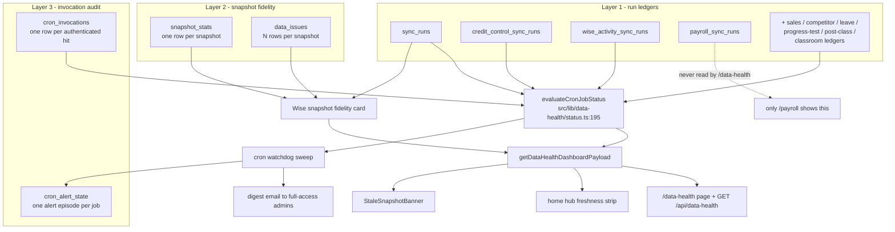
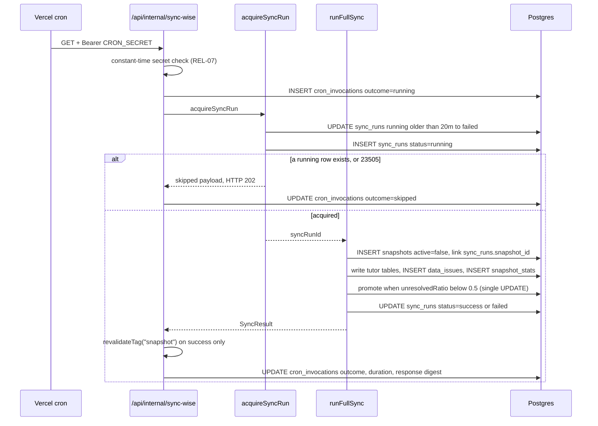
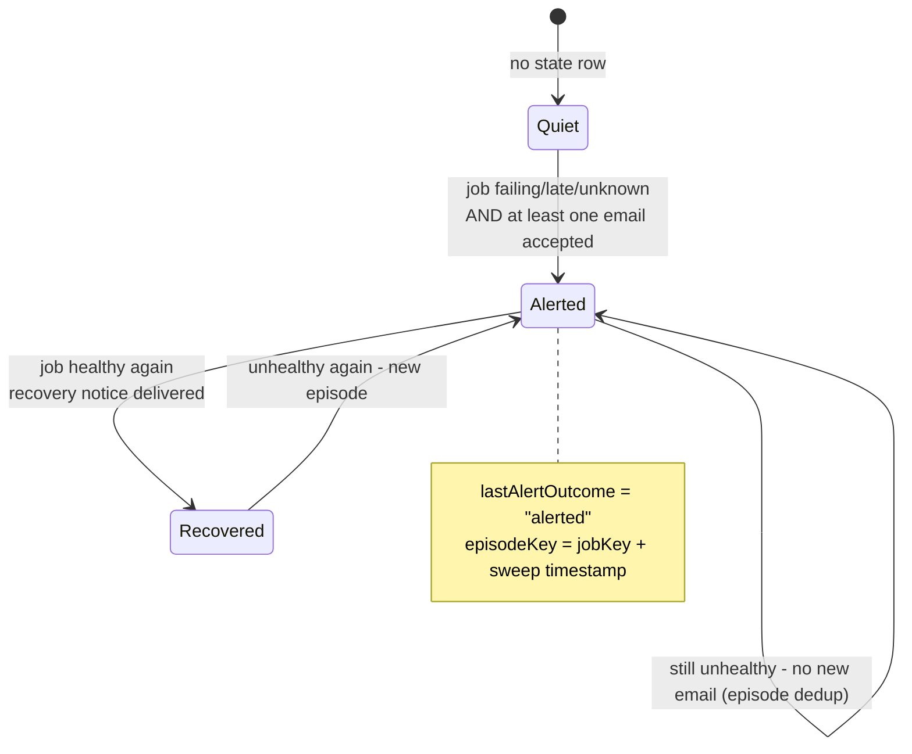
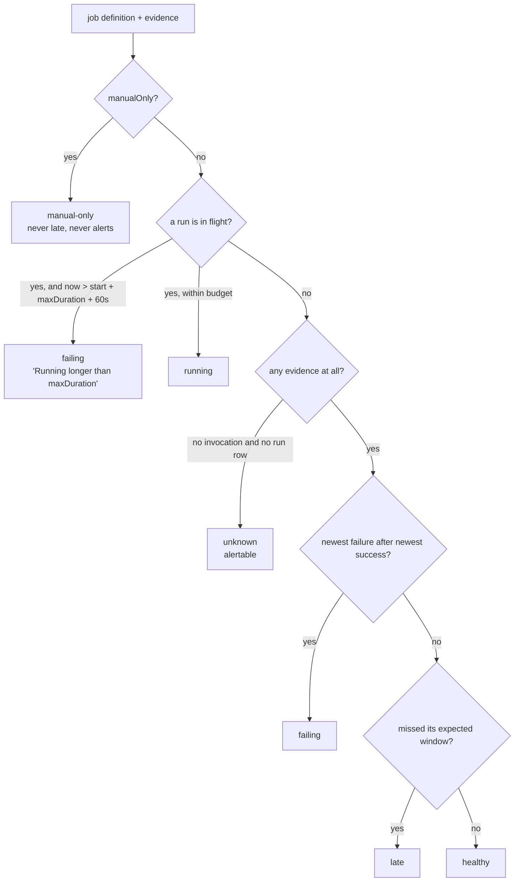

# Observability

How to tell whether BGScheduler is healthy, where the evidence physically lives, what each
failure mode looks like in the data, and how a stale snapshot reaches the people using the app.

This is the **operations** view — the mechanism, and how to read it during an incident. Canonical
homes this page links to rather than restates:

- **What the Data Health workspace is *for*** — audience, purpose, rules:
  [`docs/features/data-health.md`](../features/data-health.md) (feature status: **stable**).
- **Column-level table definitions**:
  [`docs/reference/database/erd-core.md`](../reference/database/erd-core.md) (`snapshots`,
  `sync_runs`, `cron_invocations`, `cron_alert_state`, `wise_activity_sync_runs`, `data_issues`,
  `snapshot_stats`), [`erd-credit-control.md`](../reference/database/erd-credit-control.md),
  [`erd-payroll.md`](../reference/database/erd-payroll.md), and enum value sets in
  [`enums.md`](../reference/database/enums.md).
- **Endpoint signatures**: [`docs/reference/api/misc.md`](../reference/api/misc.md) for the two
  `/api/data-health` routes; [`internal-crons.md`](../reference/api/internal-crons.md) for the
  cron routes.
- **The cron catalogue** — schedules, paths, auth: [`docs/reference/crons.md`](../reference/crons.md).
- **Recovery procedures** — clearing a stuck row, re-running a sync:
  [`runbook.md`](./runbook.md).

---

## 1. Three layers of evidence

Health is not one table. Three independent layers answer three different questions, and
`/data-health` fuses them into one verdict per job.

| Layer | Tables | Question it answers | Durability |
|---|---|---|---|
| **Run ledgers** | `sync_runs`, `credit_control_sync_runs`, `wise_activity_sync_runs`, `payroll_sync_runs`, and the sibling ledgers in [§2.6](#26-which-ledgers-data-health-reads) | *Did the pipeline do work, and did the work succeed?* | Durable — a run row outlives the snapshot it built |
| **Snapshot fidelity** | `snapshot_stats`, `data_issues` | *Is the data the pipeline produced trustworthy?* | Scoped to one `snapshot_id`; deleted when that snapshot is pruned |
| **Invocation audit** | `cron_invocations`, `cron_alert_state` | *Did Vercel actually reach the route, and has anyone been told it broke?* | Durable and feature-independent; `cron_invocations` is trimmed after 90 days |


```mermaid
flowchart TB
  subgraph L3["Layer 3 - invocation audit"]
    CI["cron_invocations<br/>one row per authenticated hit"]
    CAS["cron_alert_state<br/>one alert episode per job"]
  end
  subgraph L1["Layer 1 - run ledgers"]
    SR["sync_runs"]
    CC["credit_control_sync_runs"]
    WA["wise_activity_sync_runs"]
    PR["payroll_sync_runs"]
    OTH["+ sales / competitor / leave /<br/>progress-test / post-class /<br/>classroom ledgers"]
  end
  subgraph L2["Layer 2 - snapshot fidelity"]
    SS["snapshot_stats<br/>one row per snapshot"]
    DI["data_issues<br/>N rows per snapshot"]
  end

  CI --> DERIVE["evaluateCronJobStatus<br/>src/lib/data-health/status.ts:195"]
  SR --> DERIVE
  CC --> DERIVE
  WA --> DERIVE
  OTH --> DERIVE
  SR --> SNAP["Wise snapshot fidelity card"]
  SS --> SNAP
  DI --> SNAP
  DERIVE --> PAYLOAD["getDataHealthDashboardPayload"]
  SNAP --> PAYLOAD
  PAYLOAD --> UI["/data-health page + GET /api/data-health"]
  PAYLOAD --> HUB["home hub freshness strip"]
  PAYLOAD --> BANNER["StaleSnapshotBanner"]
  DERIVE --> WD["cron watchdog sweep"]
  WD --> CAS
  WD --> MAIL["digest email to full-access admins"]
  PR -.->|never read by /data-health| X["only /payroll shows this"]
```

Two derivation entry points share one implementation: `getDataHealthDashboardPayload`
(`src/lib/data-health/dashboard.ts:899-1015`) builds the human surface, and `getCronJobsHealth`
(`dashboard.ts:892-897`) is the same cron-status derivation with the snapshot and issue queries
skipped, used by the watchdog. An alert email therefore cannot disagree with the dashboard about
a job's status.

---

## 2. Layer 1 — the run ledgers

### 2.1 The shared ledger contract

Every ledger carries a `status` column of the shared Postgres enum `sync_status`, whose only
values are `running`, `success`, `failed` (`src/lib/db/schema.ts:21-25`). **There is no `skipped`
or `partial` value in the database** — those words exist only as derived labels in the dashboard
layer (`src/lib/data-health/dashboard.ts:112-133`, `:386-411`).

That enum is used by 15 columns. Thirteen tables also enforce single-flight with a **partial
unique index filtered to `status = 'running'`**, so "one run at a time" is a database invariant,
not a read-then-write race:

| Table | Single-running index | Scope of the guard |
|---|---|---|
| `sync_runs` | `sync_runs_single_running_idx` (`src/lib/db/schema.ts:473`) | whole table |
| `wise_activity_sync_runs` | `wise_activity_sync_runs_single_running_idx` (`:567`) | whole table |
| `sales_dashboard_import_runs` | `sdir_source_single_running_idx` (`:666`) | **per source** |
| `sales_dashboard_projection_import_runs` | `sdpir_source_single_running_idx` (`:758`) | **per source** |
| `competitor_sync_runs` | `competitor_sync_runs_single_running_idx` (`:864`) | whole table |
| `credit_control_sync_runs` | `ccsr_single_running_idx` (`:1177`) | whole table |
| `payroll_sync_runs` | `payroll_sync_runs_single_running_idx` (`:1776`) | whole table — **not per month** |
| `leave_request_sync_runs` | `leave_request_sync_runs_single_running_idx` (`:2110`) | whole table |
| `line_backlog_recovery_sync_runs` | `line_backlog_recovery_sync_runs_single_running_idx` (`:2680`) | whole table |
| `progress_test_sync_runs` | `pt_sync_runs_single_running_idx` (`:2995`) | whole table |
| `ipeds_import_runs` | `ipeds_runs_single_running_idx` (`:3019`) | **per data year** |
| `post_class_sync_runs` | `pc_sync_single_running_idx` (`:3246`) | whole table |
| `admissions_notification_runs` | `admissions_notification_runs_single_running_idx` (`:4568`) | whole table |

Around that index, every guarded pipeline runs the same four steps:

1. **Fail abandoned rows first.** Any row still `running` after **20 minutes** is force-failed
   with a canned `error_summary` before a new run is attempted. The constant is duplicated per
   subsystem rather than shared: `STALE_RUNNING_SYNC_MS` (`src/lib/sync/run-wise-sync.ts:10`,
   swept at `:51-72`), `STALE_RUNNING_CREDIT_CONTROL_SYNC_MS`
   (`src/lib/credit-control/run-sync-request.ts:9`, `:50-68`), and a local `STALE_RUNNING_MS` in
   Wise Activity (`src/lib/wise-activity/sync.ts:13`, `:130-142`), Payroll
   (`src/lib/payroll/sync.ts:24`, `:125-137`) and post-class feedback
   (`src/lib/post-class-feedback/repository.ts:262`).
2. **Insert a `running` row.**
3. **Treat unique violation `23505` as "already running", not as an error.** The Wise-snapshot and
   credit-control guards re-read the running row and return it as an HTTP `202` skipped payload
   (`src/lib/sync/run-wise-sync.ts:42-49`, `:99-117`, `:148-150`;
   `src/lib/credit-control/run-sync-request.ts:41-48`, `:117-135`). Wise Activity throws
   `WiseActivitySyncAlreadyRunningError` (`src/lib/wise-activity/sync.ts:182`) and Payroll throws
   `PayrollSyncAlreadyRunningError` (`src/lib/payroll/sync.ts:271`); their callers map it to HTTP
   `409` (`src/app/api/payroll/sync/route.ts:44-46`; the manual runner does the same at
   `src/lib/data-health/run-job.ts:56-59`).
4. **Flip to `success` or `failed` with `finished_at`**, writing `error_summary` on failure.

> **Reading a ledger during an incident:** `status` tells you what the pipeline *thinks* happened.
> It does **not** tell you whether the work was published. For the Wise snapshot those are two
> different things — see [§3.3](#33-the-promotion-gate-a-success-that-published-nothing).

### 2.2 `sync_runs` — the Wise snapshot ledger

Defined at `src/lib/db/schema.ts:462-477`. What each column tells an operator:

| Column | Why you care |
|---|---|
| `status` | `running` / `success` / `failed` |
| `started_at` / `finished_at` | `finished_at` of the newest `success` row is the dashboard's **staleness clock** ([§7](#7-stale-snapshots-two-clocks-two-thresholds)) |
| `snapshot_id` | the candidate snapshot this run built, linked as soon as the snapshot row exists (`src/lib/sync/orchestrator.ts:77-81`) |
| `promoted_snapshot_id` | **null on a run that succeeded but did not promote** |
| `teacher_count` | sanity check against the previous run |
| `error_summary` | the thrown message verbatim, or the canned 20-minute abandonment text |
| `metadata` | on success: `durationMs`, `wiseCallCount`, `wiseTopPaths`, `diffHookDurationMs`, `pastSessionsCapturedCount`, then a `pruning` sub-object (`src/lib/sync/orchestrator.ts:503-513`, `:543-548`); on failure: `durationMs` and `wiseCallCount` (`:578-581`) |

Lifecycle, end to end:


```mermaid
sequenceDiagram
  participant V as Vercel cron
  participant R as /api/internal/sync-wise
  participant G as acquireSyncRun
  participant O as runFullSync
  participant DB as Postgres

  V->>R: GET + Bearer CRON_SECRET
  R->>R: constant-time secret check (REL-07)
  R->>DB: INSERT cron_invocations outcome=running
  R->>G: acquireSyncRun
  G->>DB: UPDATE sync_runs running older than 20m to failed
  G->>DB: INSERT sync_runs status=running
  alt a running row exists, or 23505
    G-->>R: skipped payload, HTTP 202
    R->>DB: UPDATE cron_invocations outcome=skipped
  else acquired
    G-->>O: syncRunId
    O->>DB: INSERT snapshots active=false, link sync_runs.snapshot_id
    O->>DB: write tutor tables, INSERT data_issues, INSERT snapshot_stats
    O->>DB: promote when unresolvedRatio below 0.5 (single UPDATE)
    O->>DB: UPDATE sync_runs status=success or failed
    O-->>R: SyncResult
    R->>R: revalidateTag("snapshot") on success only
    R->>DB: UPDATE cron_invocations outcome, duration, response digest
  end
```

References: the route accepts `GET` with the cron secret and `POST` with either the secret or an
admin session, wrapping both in the invocation audit
(`src/app/api/internal/sync-wise/route.ts:31-76`; the constant-time comparison is `:11-29`); the
guard is `src/lib/sync/run-wise-sync.ts:88-118`; the `202` skip payload is `:120-140`, `:148-150`;
`revalidateTag("snapshot", { expire: 0 })` fires only when `result.success` (`:160-162`); the HTTP
status is `200` on success and `500` on failure (`:164-166`). Inside the orchestrator, the success
write is `src/lib/sync/orchestrator.ts:516-525` and the failure write is `:571-597`.

One deliberate hole: if the *cleanup* `UPDATE` after a primary error itself fails, the row stays
`running` and only a `console.error` naming the `syncRunId` records why (REL-06,
`src/lib/sync/orchestrator.ts:584-596`). The next invocation's 20-minute sweep rescues that row —
and before that, the stuck-run detector in [§5](#5-how-one-jobs-status-is-derived) turns it into
`failing`.

### 2.3 `credit_control_sync_runs`

`src/lib/db/schema.ts:1162-1180`. Same contract as `sync_runs`, with its own snapshot lineage
(`snapshot_id` / `promoted_snapshot_id` reference `credit_control_snapshots`) and three volume
counters: `student_count`, `package_count`, `session_count`.

Differences that matter when reading it:

- **There is no promotion gate.** Every successful run promotes its own snapshot with the same
  bounded single-`UPDATE` pattern (REL-01, `src/lib/credit-control/sync.ts:707-721`), so a
  `success` row always carries `promoted_snapshot_id = snapshot_id` (`:731-750`).
- Churn maintenance after promotion is best-effort and never rolls back the promoted snapshot
  (`:723-728`).
- The failure write **appends** a serialized error to `metadata` via a `jsonb` concatenation
  rather than replacing it (`:765-772`).

The route carries `maxDuration = 800`. Its own comment records why: successful runs were taking
372–390s against a previous 300s limit, producing recurring Vercel timeouts from 2026-06-16, and a
timeout kills the function mid-run and strands the `running` row
(`src/app/api/internal/sync-credit-control/route.ts:7-14`). That comment attributes the rescue to
"the watchdog … 30 minutes later"; in code the row is actually flipped by the **next
credit-control invocation's own 20-minute sweep** (`src/lib/credit-control/run-sync-request.ts:50-68`,
`:110`). The watchdog only alerts — it never edits a ledger.

### 2.4 `wise_activity_sync_runs`

`src/lib/db/schema.ts:553-571`. Adds ingestion telemetry the other ledgers lack: `trigger_type`,
`pages_fetched`, `events_fetched`, `inserted_count`, and the `oldest_event_timestamp` /
`newest_event_timestamp` bracket of what was pulled.

`inserted_count` is the number that says whether the audit store is advancing — `/data-health`
surfaces it as the Wise Activity domain's record label (`src/lib/data-health/dashboard.ts:511`) and
in the run history (`:640`). `metadata` records the crawl parameters (`lookbackDays`, `maxPages`,
`startPage`, `eventName`, `stopOnKnownEvents`) plus, on success, a `stoppedReason`
(`src/lib/wise-activity/sync.ts:170-179`, `:248-260`). Cron and manual runs deliberately use
different page caps and lookbacks (`:160-161`), so a manual run inserting far more rows than the
cron is expected, not a bug. This job fires four times an hour (`2,17,32,47 * * * *`).

### 2.5 `payroll_sync_runs` — the ledger `/data-health` does not read

`src/lib/db/schema.ts:1763-1780`. Same contract, plus:

- It is **keyed by `payroll_month`** (a `date`), with `trigger_type` defaulting to `"manual"`
  (`:1764-1767`); the only insert in the codebase writes `triggerType: "manual"`
  (`src/lib/payroll/sync.ts:259-268`). There is no payroll cron in `vercel.json` and no payroll
  entry in the cron registry.
- Its single-running partial index is **not scoped by month** (`:1776-1778`), so only one payroll
  month can sync at a time across the whole system; a second concurrent month raises
  `PayrollSyncAlreadyRunningError` (`src/lib/payroll/sync.ts:271`).
- Its `success` flip happens **inside** the `node-postgres` transaction that rewrites the month's
  payroll rows and resets the review to `draft` (`src/lib/payroll/sync.ts:385-425`), so unlike the
  neon-http ledgers the status and the data it describes commit atomically. The failure write is
  outside the transaction (`:438-446`).

**Where you observe it:** `/payroll` only. `getPayrollPayload` reads the newest run for the
requested month (`src/lib/payroll/data.ts:538-543`). `payroll_sync_runs` is **absent from
`fetchAllRuns`** (`src/lib/data-health/dashboard.ts:752-806`), so a failed or stranded payroll sync
never appears on `/data-health`, never colours the overall verdict, and never reaches the watchdog
email. Payroll is **stable**, but it is observed by opening its own page.

### 2.6 Which ledgers `/data-health` reads

`fetchAllRuns` (`src/lib/data-health/dashboard.ts:752-806`) pulls the **8 most recent rows**
(`RECENT_LIMIT`, `:17`) from each of: `sync_runs`, `wise_activity_sync_runs`,
`sales_dashboard_import_runs`, `sales_dashboard_projection_import_runs`, `competitor_sync_runs`,
`credit_control_sync_runs`, `leave_request_sync_runs`, `progress_test_sync_runs`,
`progress_test_admin_digest_runs`, `post_class_sync_runs`, and `post_class_notification_runs`
(32 rows — several notification kinds share that table, so it gets `RECENT_LIMIT * 4`, `:779`),
plus `classroom_assignment_runs`, `classroom_admin_email_runs`, and a single newest
`room_utilization_sessions` row (`:787`).

Two filters worth knowing:

- Classroom runs are narrowed to automation/cron rows only —
  `automation_batch_id IS NOT NULL OR created_by LIKE 'cron%'` (`:783`) — so an admin's ad-hoc room
  run cannot masquerade as the morning cron firing.
- `room_utilization_sessions` is a data table, not a ledger. The dashboard synthesises a `success`
  run from its newest row (`:320-340`).

Ledgers that exist but are **not** read here: `payroll_sync_runs`,
`line_backlog_recovery_sync_runs`, `ipeds_import_runs`, `admissions_notification_runs`,
`competitor_source_runs`, `competitor_ai_runs`. Jobs that own some of those still get a health
status — from direct invocation proof only ([§5.1](#51-where-run-evidence-comes-from-per-job)).

---

## 3. Layer 2 — snapshot fidelity

### 3.1 `snapshot_stats`

`src/lib/db/schema.ts:2706-2722`. Exactly **one row per snapshot** (`ss_snapshot_idx`, `:2721`),
written once near the end of a sync at `src/lib/sync/orchestrator.ts:458-470` — immediately
*before* the promotion decision. It is a frozen census of what the sync produced: teacher and
identity-group totals, `resolved_groups` / `unresolved_groups`, counts of qualifications,
availability windows, leaves, future sessions and data issues, and a pre-aggregated
`issues_by_type` JSON map (`:452-456`).

Two counting subtleties that matter when the numbers look odd:

- `resolved_groups` counts groups with no identity issue whose `entityId` equals the group's
  canonical key (`src/lib/sync/orchestrator.ts:462`).
- `unresolved_groups` is **the identity-issue count**, not a distinct group count (`:463`). An
  unresolvable teacher gets both a solo group *and* an `alias` issue
  (`src/lib/normalization/identity.ts:178-195`), while a nickname collision emits one issue for a
  whole multi-member group (`:159-170`) — so `resolved + unresolved` need not equal
  `total_identity_groups`.

`/data-health` reads this row only for the **currently active** snapshot
(`src/lib/data-health/dashboard.ts:916-950`). Historic snapshots keep their stats rows until
pruned, but nothing in the UI reads them.

### 3.2 `data_issues` by type and severity

`src/lib/db/schema.ts:2688-2702`, indexed on `snapshot_id` and on `(snapshot_id, type)`
(`:2700-2701`). Every row is scoped to one snapshot; there is no cross-snapshot issue history.

`data_issue_type` has six values (`:27-34`); `data_issue_severity` has four and defaults to `high`
(`:36-41`). What is actually written, and by whom:

| `type` | Severity written | Emitted at | Meaning |
|---|---|---|---|
| `alias` | `critical` | `src/lib/sync/orchestrator.ts:97-105`, from `resolveIdentities` (`src/lib/normalization/identity.ts:159-170`, `:183-189`) | A nickname matched more than a legitimate online/offline pair, or a teacher had no nickname and no alias. **Feeds the promotion gate.** |
| `completeness` | `high` | `src/lib/sync/orchestrator.ts:162-172` | Teacher record has no Wise user id, so availability could not be fetched. |
| `tag` | `high` | `src/lib/sync/orchestrator.ts:238-248` | A Wise tag did not map to any subject / curriculum / level / examPrep. |
| `completeness` | `high` | `src/lib/sync/orchestrator.ts:249-259` | The availability/leave fetch for one teacher threw. The sync continues — per-teacher error isolation. |
| `modality` | `high` | `src/lib/sync/orchestrator.ts:339-349` | Group-level modality could not be derived. |
| `conflict_model` | `high` | `src/lib/sync/orchestrator.ts:381-396` | A future session contradicts its group's derived modality (MOD-01); `metadata` carries `isOnlineVariant`, `sessionType`, `groupCanonicalKey`. |
| `completeness` | `medium` | `src/lib/sync/past-sessions-diff-hook.ts:120-130` | The PAST-01 diff hook could not resolve a canonical key, so a dropped past session was not captured. |
| `sync` | — | *never emitted* | Declared in the enum (`schema.ts:33`); no producer exists under `src/lib`. |

Severity `low` is likewise declared and unused. **Severity is not a filter anywhere in the read
path** — the dashboard selects only `type`, `entity_name`, `message`
(`src/lib/data-health/dashboard.ts:952-960`), and neither the payload nor the UI groups by it.
Treat severity as a statement of intent at write time, not as a triage control.

The read path buckets issues into exactly three named lists (`issueDetailsFromIssues`,
`src/lib/data-health/dashboard.ts:413-429`):

- **Unresolved aliases** — `type = 'alias'`
- **Modality issues** — `type IN ('modality', 'conflict_model')`, merged deliberately under
  MOD-03 / D-10 (`src/app/api/data-health/modality-counter.ts:1-31`; the same filter is duplicated
  inline at `dashboard.ts:418-424`)
- **Unmapped tags** — `type = 'tag'`

`completeness` issues therefore contribute to the `issuesByType` badge row and to
`total_data_issues`, but have **no detail table** in the UI. To see them, query `data_issues`
directly for the active snapshot.

### 3.3 The promotion gate: a `success` that published nothing

The single most misread signal in the system. After writing stats, the orchestrator computes

```
unresolvedRatio = identityIssues.length / max(groups.length, 1)
shouldPromote   = unresolvedRatio < 0.5
```

(`src/lib/sync/orchestrator.ts:472-476`). If the gate blocks, the candidate snapshot is simply
never flipped to `active`, and the run is **still written as `status = 'success'`** with
`promoted_snapshot_id = null` (`:478`, `:516-525`).

Consequences to reason about during an incident:

- `/data-health` reports the Wise Snapshot job **healthy** — it only asks whether the run succeeded.
- The dashboard's `staleAgeMs` is computed from the newest `success` row regardless of promotion
  (`src/lib/data-health/dashboard.ts:902-907`, `:966-968`), so the **banner clock resets** even
  though the served data did not change.
- The search/compare clock does **not** reset — it measures the run that promoted the *active*
  snapshot ([§7.1](#71-two-clocks)) — so `/search` responses start carrying the 90-minute stale
  warning while the dashboard still says "healthy".
- The visible tells on `/data-health` are `Active snapshot <id>` in the page header not changing
  across refreshes (`src/components/data-health/data-health-dashboard.tsx:506`), and a rising
  **Unresolved** / **Total issues** in the Wise-snapshot-fidelity card (`:289-295`).

Promotion itself is a single `UPDATE` with a bounded `WHERE`, so readers never observe zero active
snapshots (REL-01, `src/lib/sync/orchestrator.ts:480-501`).

### 3.4 Retention: fidelity evidence expires, run rows do not

After a successful promotion, `pruneOldSnapshots` keeps the **30 most recent** snapshots plus
whatever is active (`SNAPSHOT_RETENTION_COUNT`, `src/lib/sync/snapshot-pruning.ts:5`, `:64-74`) and
deletes everything else — including those snapshots' `snapshot_stats` and `data_issues` rows
(`:104-116`). `sync_runs` rows survive; their `snapshot_id` and `promoted_snapshot_id` are nulled
first (`:88-102`).

So: **the run history is long, the fidelity history is about 30 syncs deep** — roughly 15 hours at
the 30-minute cadence. Pruning failures never fail the sync: they are caught, logged, and recorded
into `sync_runs.metadata.pruning` (`src/lib/sync/orchestrator.ts:527-555`).

---

## 4. Layer 3 — invocation audit and alerting

### 4.1 `cron_invocations`

`src/lib/db/schema.ts:479-499`. One row per authenticated hit on an audit-wrapped route, written by
`withCronInvocationAudit` (`src/lib/data-health/cron-audit.ts:191-206`): an `outcome = "running"`
row on entry (`:131-159`), updated on exit with `finished_at`, `duration_ms`, `response_status`,
`outcome`, `error_summary`, `linked_run_ids`, and a **size-capped digest** of the response body in
`metadata.response` (`:161-189`). The digest keeps top-level scalars only, truncates strings at 200
characters and the whole object at 2 KB (`:61-106`) — earlier versions stored the full body, and one
chatty backfill could write megabytes a day into an append-only table. Nothing reads the digest;
health derivation uses `error_summary`, `linked_run_ids`, `duration_ms` and `response_status`.

**21 internal cron routes are audit-wrapped.** The one registry job whose route is not is
`student_promotions_july_1` — see [§5.1](#51-where-run-evidence-comes-from-per-job).

Outcome classification (`src/lib/data-health/cron-audit.ts:108-117`), in order:

1. body `skipped === true`, or an `error`/`message` containing `"already running"` → **`skipped`**
2. body `ok === false` or `success === false` → **`failed`**
3. HTTP `202` → **`skipped`**
4. HTTP `>= 400` → **`failed`**
5. otherwise → **`success`**

This is why a single-flight collision is not an alert: the `202` from `runWiseSyncRequest` becomes
`skipped`, and `skipped` counts as success in the status derivation
(`src/lib/data-health/status.ts:227-230`). If the handler *throws* instead of returning, the wrapper
synthesises a `500` and records it as `failed` (`cron-audit.ts:200-204`).

Audit writes are best-effort: both the insert and the update swallow failures with `console.error`
(`:155-158`, `:186-188`) — instrumentation must never take down a sync.

`trigger_source` distinguishes `cron` from `admin` from `system` (`src/lib/data-health/types.ts:11`).
Manual runs launched from `/data-health` record `triggerSource: "admin"` plus the operator's email
(`src/lib/data-health/run-job.ts:35-41`), as do admin-session `POST`s to the sync routes
(`src/app/api/internal/sync-wise/route.ts:45-58`). That is how you tell "the cron fired" from
"someone pressed the button" — and the derivation only accepts the former as **direct proof**
(`dashboard.ts:439`).

**Read window and retention.** The dashboard ranks invocations **per `job_key`**, keeping the newest
8 per job (`INVOCATIONS_PER_JOB`, `dashboard.ts:812`) within a 45-day lookback
(`INVOCATIONS_LOOKBACK_DAYS`, `:820`, query at `:828-854`). A global `LIMIT` used to let chatty
30-minute jobs push a daily job's only invocation out of the window within hours; per-job ranking
keeps every job's own proof visible. If the table is missing entirely, the query degrades to `[]`
with a `console.info` and the dashboard falls back to run-table inference (`:846-853`).

Retention runs inside the watchdog: `pruneCronInvocations` deletes rows that are **both** older than
90 days (`CRON_INVOCATION_RETENTION_DAYS`, `src/lib/data-health/cron-retention.ts:16`) **and**
outside the newest-8-per-job read window (`:32-55`). A job that fires once a year therefore keeps its
proof forever.

### 4.2 `cron_alert_state` and the watchdog

`src/lib/db/schema.ts:505-514`. One row per job the watchdog has alerted on, keyed by `job_key`.
`last_alert_outcome` flips between `alerted` and `recovered`; the flip back to `recovered` is what
re-arms the next alert (`src/lib/internal/cron-watchdog.ts:1-17`).

The `cron-watchdog` cron (`7,37 * * * *`, `src/app/api/internal/cron-watchdog/route.ts`) runs one
sweep:


```mermaid
stateDiagram-v2
  [*] --> Quiet: no state row
  Quiet --> Alerted: job failing/late/unknown<br/>AND at least one email accepted
  Alerted --> Alerted: still unhealthy - no new email (episode dedup)
  Alerted --> Recovered: job healthy again<br/>recovery notice delivered
  Recovered --> Alerted: unhealthy again - new episode
  note right of Alerted
    lastAlertOutcome = "alerted"
    episodeKey = jobKey + sweep timestamp
  end note
```

Mechanics worth knowing during an incident (`src/lib/internal/cron-watchdog.ts`):

- **Alertable statuses are `failing`, `late`, `unknown`** (`:53`, `:146-148`). `running` and
  `manual-only` never alert.
- **Manual-only jobs and the watchdog itself are excluded from the sweep** (`:167`).
- **Single-flight without a ledger.** The watchdog has no `*_sync_runs` table, and neon-http supports
  neither transactions nor advisory locks, so it claims a sentinel `cron_alert_state` row
  (`__watchdog_sweep_lock`) via a conditional upsert whose `setWhere` only fires when the previous
  holder released it or went stale after 6 minutes (`:48-51`, `:298-330`). A losing sweep returns
  `skippedReason: "another sweep is in flight"` (`:419-429`).
- **Missing table fails safe.** If `cron_alert_state` does not exist, alerting is disabled for that
  sweep rather than sending un-deduped mail every 30 minutes (`:278-296`, `:404-417`).
- **Episode state is written only after at least one delivery succeeded** (`:482-492`), so a total
  delivery failure is retried next sweep. Partial delivery still closes the episode — a deliberate
  tradeoff documented at `:11-17`.
- **Recipients are full-access admins only** — `admin_users` rows with `allowed_pages IS NULL`,
  because page-restricted users cannot open the `/data-health` link the email points at (`:257-269`).
- **A synthetic job rides the sweep.** `post_class_payout_window` is not a cron route: it projects
  `loadPayoutWindowStaleness` onto a `CronJobHealth` shape so an unfinalized payout window gets
  episode dedup, the digest email and the recovery notice for free (`:84-123`). A payout-side failure
  degrades to "no payout entry this sweep" and never takes the watchdog down (`:125-143`).
- **Retention rides along first**, in its own try/catch, so a failed prune can never suppress an
  alert digest (`:374-389`).

---

## 5. How one job's status is derived

`evaluateCronJobStatus` (`src/lib/data-health/status.ts:195-363`) is pure: it takes one registry
definition, `now`, up to two invocation records and up to four run records, and returns one of six
statuses (`src/lib/data-health/types.ts:1-7`). Order matters — the first matching branch wins.


```mermaid
flowchart TD
  A["job definition + evidence"] --> B{"manualOnly?"}
  B -->|yes| MO["manual-only<br/>never late, never alerts"]
  B -->|no| C{"a run is in flight?"}
  C -->|"yes, and now > start + maxDuration + 60s"| F1["failing<br/>'Running longer than maxDuration'"]
  C -->|yes, within budget| RUN["running"]
  C -->|no| D{"any evidence at all?"}
  D -->|"no invocation and no run row"| UNK["unknown<br/>alertable"]
  D -->|yes| E{"newest failure after newest success?"}
  E -->|yes| F2["failing"]
  E -->|no| G{"missed its expected window?"}
  G -->|yes| LATE["late"]
  G -->|no| OK["healthy"]
```

The pieces behind those branches:

- **Expected windows** come from the registry, not from parsing `vercel.json` at runtime
  (`expectedWindowForJob`, `status.ts:167-176`). A job with `expectedBangkokWeekday` uses the weekly
  calculation (`:137-165`), one with an `expectedBangkokMinute` or window-start uses the daily one
  (`:111-135`), and everything else expands the cron minute field into interval candidates
  (`:57-92`). Daily and weekly windows are computed in **Asia/Bangkok** via a fixed +7 offset
  (`:4`, `:94-109`).
- **Lateness** has two shapes (`:314-344`): interval jobs are late when the newest evidence is older
  than `lateAfterMinutes`; calendar jobs are late when `now` is past `lateAfterAt` and nothing has
  been seen since `lastExpectedAt`.
- **Stuck-run detection** (`:238-258`) uses the registry's `maxDurationSeconds` plus a 60-second
  buffer (`STUCK_BUFFER_MS`, `:6`). The registry value must mirror the route's
  `export const maxDuration` or a legitimate long run is reported `failing`; the credit-control entry
  carries that warning inline (`src/lib/data-health/cron-registry.ts:119-122`).
- **Proof** is `direct` when a `cron`-triggered invocation exists, `inferred` when only a run row
  does, `none` otherwise (`:220`). `none` is what produces `unknown`.
- **`skipped` counts as success** when computing `latestSuccessAt` (`:227-230`) — the single-flight
  case again.

The registry holds **24 jobs**, of which **19 are scheduled** and 5 are `manualOnly`
(`src/lib/data-health/cron-registry.ts`); the 19 match `vercel.json` one-for-one, and
`src/__tests__/vercel-crons.test.ts` pins every schedule string so a stagger regression fails
the build.

The overall verdict takes the **worst non-manual status by rank** (failing 5, late 4, running 3,
unknown 2, manual-only 1, healthy 0; `cron-registry.ts:407-414`) — with one softening rule: an
overall `unknown` is displayed as `healthy` when at least one job is healthy
(`dashboard.ts:865-868`). The watchdog is unaffected: it classifies each job individually, so an
`unknown` job still emails even while the banner reads "Operations are healthy".

### 5.1 Where run evidence comes from, per job

`pickJobRuns` (`src/lib/data-health/dashboard.ts`) maps a registry key to the ledger that
proves it. Three cases deserve attention:

- **`onsite_foot_traffic` reads only its own reconciliation ledger.** It does not borrow the stale
  `room_utilization_sessions` fallback, so Data Health cannot report a healthy foot-traffic sync
  merely because Room Capacity was refreshed at some earlier time.

- **`student_promotions_july_1` deliberately gets no run evidence** (`:274-286`). Its route is not
  audit-wrapped and its run table mixes admin drafts with the cron apply, so borrowing any fallback
  would report a dangerous write-path cron as healthy without it ever firing. It therefore sits at
  `unknown` — alertable by design.
- **`cron_watchdog` has no domain run table** (`:306-315`); its health comes solely from its own
  direct invocation rows.
- **The fallback branch** (`:317-340`) synthesises a `success` run from the newest
  `room_utilization_sessions` row. Its comment claims only `room_utilization` reaches it; in the
  code as written, `post_class_feedback_backfill`, `post_class_feedback_payout_accrual`,
  `admissions_notifications`, `line_credit_digest` and `line_backlog_recovery` also fall through to
  it, because no earlier branch names them. All five have audit-wrapped routes, so their `lastSeenAt`
  and failure detection still come from direct invocation proof — but if `cron_invocations` is empty
  or unavailable, a recent room-utilization row can stand in as their success evidence. Recorded in
  [§11](#11-open-questions).

Two ledgers are normalised before comparison rather than read raw:

- **Post-class feedback** keys its outcome on `metadata.outcome === "partial"`, which now means "this
  run could not be trusted run-wide" rather than "some session had messy data". Before that change
  every run read as `partial`, `lastSuccessAt` never matched, and the collector looked as if it had
  never succeeded (`dashboard.ts:386-411`).
- **Notification and email runs** map their own vocabularies onto the three-value contract:
  `sent` / `cancelled` → success, `pending` / `sending` → running (`:373-384`); digest runs treat a
  `skipped` run — nothing to report — as proof the job fired (`:225-233`).

---

## 6. The `/data-health` surface

### 6.1 The two endpoints

| Method + path | Auth | Purpose |
|---|---|---|
| `GET /api/data-health` | Auth.js session (`src/app/api/data-health/route.ts:15-18`) | Returns the whole dashboard payload; errors surface as `500` with the message (`:20-26`) |
| `POST /api/data-health/jobs/{jobKey}/run` | Auth.js session, plus extra gates | Runs one registry job on demand |

The run endpoint adds three checks before dispatching
(`src/app/api/data-health/jobs/[jobKey]/run/route.ts:13-43`): an unknown `jobKey` is `404`; any
`post_class_feedback*` job additionally requires the `access_manager` capability or `403`; and a job
flagged `dangerous` requires `{"confirmed": true}` in the body or `409` with the registry's
`confirmationLabel`. Dispatch goes through `runDataHealthJob`, which wraps the handler in the same
invocation audit with `triggerSource: "admin"` and the operator's email
(`src/lib/data-health/run-job.ts:29-42`). `maxDuration = 800` on that route.

### 6.2 The payload

`DataHealthDashboardPayload` (`src/lib/data-health/types.ts:107-152`) carries `checkedAt`, an
`overall` block with per-status counts and a headline, `cronJobs[]`, `dataDomains[]`, `wiseSnapshot`,
`issueSummary`, `issueDetails`, `recentRuns[]` (newest 30 across all read ledgers,
`dashboard.ts:747-749`) and `manualActions[]`. It also duplicates a compatibility block —
`lastSuccessfulSync`, `staleAgeMs`, `staleMinutes`, `activeSnapshotId`, `stats`, `issuesByType`,
`unresolvedAliases`, `unresolvedModality`, `unmappedTags`, `recentSyncs` — kept flat at the top level
for `StaleSnapshotBanner` and older tests (`types.ts:132-151`, built at `dashboard.ts:995-1013`).
When treating the payload as an API, prefer the nested `wiseSnapshot` / `issueDetails` shapes; the
flat fields are the same values.

### 6.3 The page

`/data-health` is an async Server Component that fetches the payload directly and hands it to a
client shell inside `<Suspense>` (`src/app/(app)/data-health/page.tsx:7-41`). The shell
(`src/components/data-health/data-health-dashboard.tsx`) renders, in order:

1. **Overall banner** with the six status counts (`:527-547`).
2. **Next expected cron** — one tile per scheduled job with cadence, status, last-seen and
   next-expected (`:100-149`).
3. **Manual controls** — one button per registry job; dangerous ones prompt with the
   `confirmationLabel` before POSTing (`:151-184`, `:470-498`).
4. **Cron control plane** — the full job table with status, proof, last seen, expected, duration and
   error (`:186-233`).
5. **Data freshness** — one card per domain with a freshness label, record-count label and issue
   count (`:237-273`), built from `buildDomains` (`dashboard.ts:483-593`).
6. **Wise snapshot fidelity** — `snapshot_stats` counters, last successful and last failed sync, and
   the `issuesByType` badge row (`:276-326`).
7. **Normalization issues** — three tables: unresolved aliases, modality issues, unmapped tags, each
   capped at 80 rows (`:328-384`).
8. **Unified run history** — the 30 newest runs across subsystems (`:386-436`).
9. **Three footer cards** — how many jobs have direct audit rows, how many are on run-table
   inference, and whether the Wise snapshot is stale (`:562-584`).

Refresh is manual — a button that re-fetches `GET /api/data-health` (`:449-468`). There is no
polling.

### 6.4 The other consumers

- **Home hub freshness strip.** `getHomeSummaryPayload` calls the same payload builder when the user
  can access `/data-health`, and projects `staleAgeMs`, `staleMinutes`, `overall` counts and Google
  token status into a `freshness` block (`src/lib/home/summary.ts:187-189`, `:254-279`). The
  Data Health nav badge is `lateCount + failingCount` (`:244-251`). The strip warns above **120
  minutes** of snapshot age (`src/components/home/home-hub.tsx:85`).
- **`StaleSnapshotBanner`** — see [§7.3](#73-the-surfaces).
- **The cron watchdog** — via `getCronJobsHealth`, the same derivation without the snapshot queries.

---

## 7. Stale snapshots: two clocks, two thresholds

### 7.1 Two clocks

They answer different questions and can disagree.

| Clock | Computed from | Meaning |
|---|---|---|
| **Dashboard / banner clock** | `now - finishedAt` of the newest `sync_runs` row with `status = 'success'` (`dashboard.ts:902-907`, `:966-968`) | "When did a sync last finish successfully?" — **ignores whether it promoted** |
| **Search / compare clock** | `now - index.syncedAt`, where `syncedAt` is the `finishedAt` of the newest `success` run whose `promoted_snapshot_id` is the **active** snapshot, falling back to the snapshot's `created_at` (`src/lib/search/index.ts:155-166`) | "How old is the data actually being served?" |

Under a blocked promotion gate ([§3.3](#33-the-promotion-gate-a-success-that-published-nothing))
the first clock keeps resetting while the second keeps ageing. **When the two disagree, trust the
search clock** — it is the one measuring what users see.

### 7.2 Two thresholds

Both live in `src/lib/ops/stale.ts` — the only place either number is defined:

| Constant | Value | Used for |
|---|---|---|
| `API_STALE_THRESHOLD_MS` | **90 minutes** (`:2`) | `snapshotMeta.stale` and the `STALE_SEARCH_WARNING` string on search/compare responses; `isApiSnapshotStale` (`:11-13`) |
| `APP_STALE_BANNER_THRESHOLD_MS` | **2 hours** (`:3`) | `shouldShowStaleBanner` — the in-app amber banner (`:15-17`) |

90 minutes is deliberately three cron periods of headroom over the 30-minute Wise cadence, so a
single skipped or slow run never warns. Staleness is always a **warning, never withheld data**: no
code path suppresses results because the snapshot is old.

### 7.3 The surfaces

| Surface | Threshold | Code |
|---|---|---|
| `POST /api/search` — `snapshotMeta.stale` + a warning string in `warnings[]` | 90 min | `src/lib/search/engine.ts:22-38`, called at `src/app/api/search/route.ts:55` |
| `POST /api/compare` — same two fields | 90 min | `src/app/api/compare/route.ts:141-149` |
| `GET /api/compare/discover` — `snapshotMeta.stale` | 90 min | `src/app/api/compare/discover/route.ts:62` |
| **In-app amber banner**, dismissible for the session | 2 h | `src/components/layout/stale-snapshot-banner.tsx:36-90` |
| `/data-health` footer card "Wise snapshot stale" | 90 min, **hardcoded inline** | `src/components/data-health/data-health-dashboard.tsx:582` |
| Home hub sync tile tone | 120 min, **hardcoded inline** | `src/components/home/home-hub.tsx:85` |

The banner only renders on the workspace paths `/search`, `/scheduler` and `/compare`
(`stale-snapshot-banner.tsx:18-28`), fetches `/api/data-health` itself, reads the flat `staleAgeMs`
field, and stores its dismissal in `sessionStorage` under `bgscheduler:stale-banner-dismissed`
(`src/lib/ops/stale.ts:9`). Every failure mode — non-OK response, parse error, unavailable session
storage — resolves to *not* showing the banner (`:59-70`, `:49-51`): a broken health endpoint must
not block the workspace.

Two consistency notes: the last two rows above re-derive their thresholds inline instead of importing
the constants, so changing `API_STALE_THRESHOLD_MS` will not move them; and the exported helper
`dataHealthSummaryIsStale` (`dashboard.ts:1017-1019`) has no consumer outside its own module.

---

## 8. Failure modes

| Symptom | What actually happened | Where to look | Automatic recovery |
|---|---|---|---|
| Job shows **`running`** for hours | Function timed out or was aborted mid-run; the ledger row was never flipped | `sync_runs` (or the sibling ledger) row with `status = 'running'` and an old `started_at` | The next invocation's 20-minute sweep fails it; before that, the derivation reports `failing` once `started_at + maxDuration + 60s` passes (`status.ts:238-258`) |
| Job shows **`failing`**, error is the canned 20-minute text | A previous run was force-failed by the sweep | `error_summary` matches the constant in `run-wise-sync.ts:39-40` (or the subsystem equivalent) | Yes — the next successful run clears it |
| Job shows **`unknown`** | No `cron`-triggered invocation and no run-table evidence | `cron_invocations` filtered to that `job_key` | No. Expected permanently for `student_promotions_july_1` (`dashboard.ts:274-286`) |
| Sync reports **`success`** but data never changes | Promotion gate blocked: unresolved identity ratio ≥ 0.5 | `sync_runs.promoted_snapshot_id IS NULL`; rising `unresolved_groups` in `snapshot_stats` | No — fix the aliases; see [§3.3](#33-the-promotion-gate-a-success-that-published-nothing) |
| Search warns stale, dashboard says healthy | The two clocks disagree — almost always a blocked promotion | Compare `snapshotMeta.syncedAt` from a search response against `lastSuccessfulSync` on `/api/data-health` | No |
| Repeated `202` / `skipped` outcomes | Single-flight collision — a run was already in flight | `cron_invocations.outcome = 'skipped'`; the response carries `runningStartedAt` | Yes, by design. Persistent skipping means the previous run is stuck |
| Job flips healthy but no recovery email arrived | The episode was never opened, or delivery failed | `cron_alert_state.last_alert_outcome` for that `job_key` | Recovery mail only fires for jobs whose last episode is still `alerted` (`cron-watchdog.ts:173-176`) |
| Watchdog returns `skippedReason` | Another sweep holds the lock, `cron_alert_state` is missing, or no admin recipients | The route's JSON summary; `console.error` lines in Vercel logs | Lock self-heals after 6 minutes (`cron-watchdog.ts:51`); a missing table needs the migration |
| A cron fires but `/data-health` shows nothing | The route is not audit-wrapped and its ledger is not in `fetchAllRuns` | Compare the route file against the wrapped list in [§4.1](#41-cron_invocations) | No |
| Payroll sync stuck or failed | Nothing surfaces it centrally | `/payroll` for the requested month, or query `payroll_sync_runs` | The 20-minute sweep runs only on the next payroll sync attempt (`payroll/sync.ts:125-137`, `:255`) |
| `/data-health` returns `500` | The payload builder threw — most often a missing table on an un-migrated database | The `error` string in the response body (`route.ts:23-25`) | No |

---

## 9. What is deliberately *not* observed

Knowing the blind spots is half of observability.

- **Payroll** — `payroll_sync_runs` is absent from `fetchAllRuns` ([§2.5](#25-payroll_sync_runs--the-ledger-data-health-does-not-read)).
- **Whether the crons actually fired in production** — the repository can attest the registration and
  the derivation, never the runtime fact. `cron_invocations` rows are the only evidence, and they are
  written by the app itself.
- **`data_issues` severity** — written, never read ([§3.2](#32-data_issues-by-type-and-severity)).
- **`completeness` issues** — counted, but with no detail table in the UI.
- **Historic snapshot fidelity** — `snapshot_stats` and `data_issues` for pruned snapshots are
  deleted outright; only the newest ~30 snapshots' worth survives
  ([§3.4](#34-retention-fidelity-evidence-expires-run-rows-do-not)).
- **Wise-side truth** — every counter here describes what BGScheduler ingested, not what Wise holds.
  Reconciliation against Wise is the Wise Activity Audit's job, not this dashboard's.
- **Structured logs and metrics** — there is no logger and no metrics pipeline. `console.error` /
  `console.log` into Vercel logs is the whole runtime logging story, and by convention bodies,
  secrets and env values are never logged.

---

## 10. Tests

| File | What it pins |
|---|---|
| `src/lib/data-health/__tests__/status.test.ts` | `evaluateCronJobStatus` branch order, Bangkok window maths, stuck-run detection |
| `src/lib/data-health/__tests__/cron-registry.test.ts` | Registry shape and `statusRank` ordering |
| `src/lib/data-health/__tests__/cron-audit.test.ts` | Outcome classification, response-digest capping, best-effort writes |
| `src/lib/data-health/__tests__/cron-retention.test.ts` | The two-guard prune — old **and** outside the per-job read window |
| `src/lib/data-health/__tests__/migration.test.ts` | `drizzle/0038_data_health_cron_invocations.sql` creates the table and its three indexes |
| `src/lib/internal/__tests__/cron-watchdog.test.ts` | Sweep classification, episode dedup, sweep lock, missing-table fail-safe |
| `src/lib/ops/__tests__/stale.test.ts` | The 90-minute and 2-hour thresholds |
| `src/app/api/data-health/__tests__/route.test.ts` | Auth gate and error shape |
| `src/app/api/data-health/__tests__/modality-counter.test.ts` | The merged `modality` + `conflict_model` selection |
| `src/app/api/data-health/jobs/[jobKey]/run/__tests__/route.test.ts` | Unknown job, capability gate, dangerous-job confirmation |
| `src/components/data-health/__tests__/data-health-dashboard.test.tsx` | The rendered shell |
| `src/__tests__/vercel-crons.test.ts` | Every `vercel.json` schedule string and the stagger |

---

## 11. Open questions

1. **The `pickJobRuns` fallback comment is wrong.** It states only `room_utilization` reaches the
   room-utilization fallback (`src/lib/data-health/dashboard.ts:317-319`), but
   `post_class_feedback_backfill`, `post_class_feedback_payout_accrual`, `admissions_notifications`,
   `line_credit_digest` and `line_backlog_recovery` have no earlier branch and fall through to it.
   Direct invocation proof masks the effect today; with `cron_invocations` empty it would not.
2. **`payroll_sync_runs` has no central observability.** Is that intentional (payroll is a
   human-driven monthly close) or an omission from `fetchAllRuns`?
3. **`data_issue_type = 'sync'` and `severity = 'low'` have no producer.** Should they be dropped
   from the enum, or is a producer still planned?
4. **Two hardcoded staleness thresholds** — `data-health-dashboard.tsx:582` (90 min) and
   `home-hub.tsx:85` (120 min) — do not import `src/lib/ops/stale.ts`.
5. **`dataHealthSummaryIsStale` has no consumer.** Dead export, or a surface that was never wired?
6. **The credit-control `maxDuration` comment** attributes stuck-row recovery to the watchdog; the
   watchdog never edits ledgers. Worth correcting in the source comment.

_Verified against main@0cd1e81 (clean tree) on 2026-09-02._
