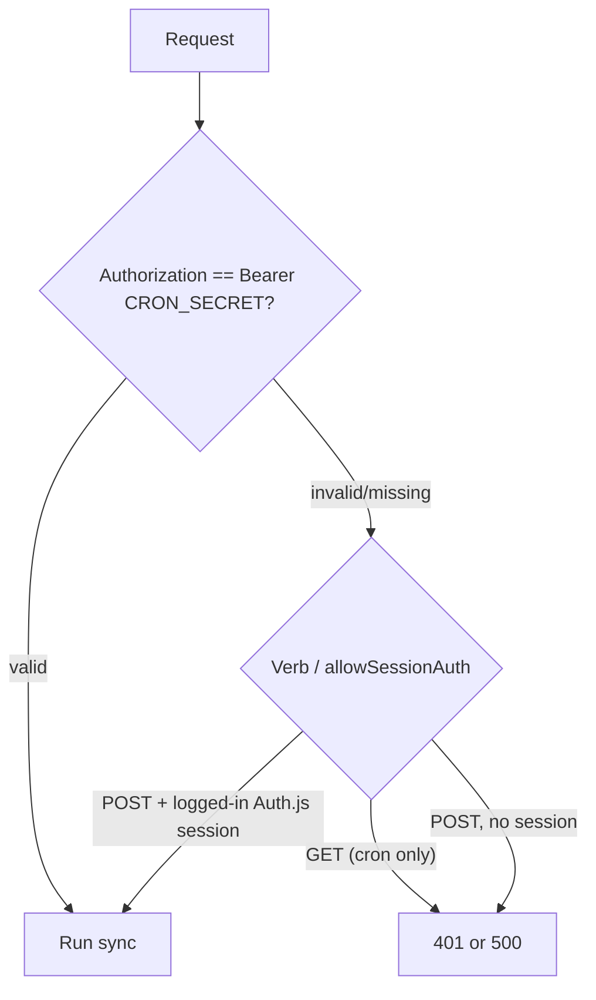
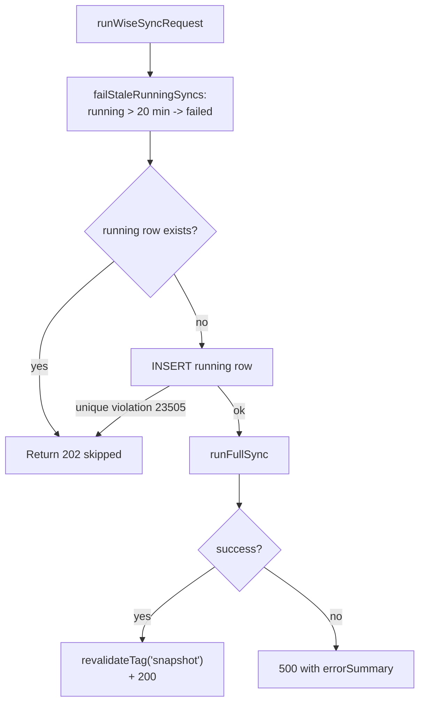
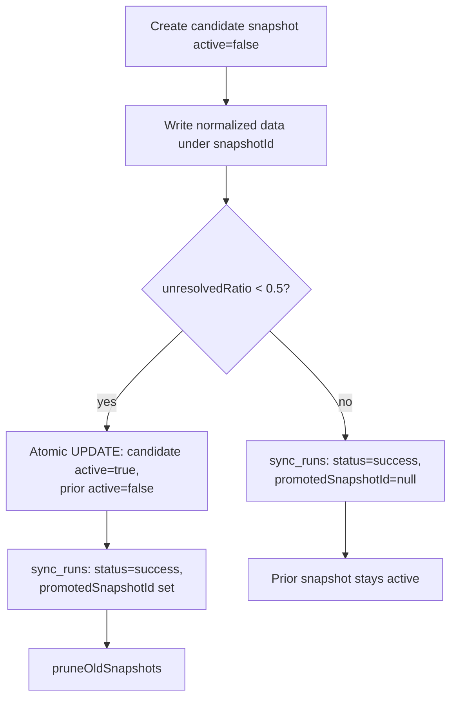

# Operations Runbook

Day-to-day operational procedures for BGScheduler: deploying, running database
scripts, manually triggering each scheduled sync, and recovering when a sync
fails. This is the page to open when something is wrong with data freshness or a
cron, or when you need to run a one-off command against production.

> Scope note. This runbook owns the **how-to** of running and recovering the
> system. For the meaning of the data-health surface (what each issue type means,
> the fail-closed rules), see [features/data-health.md](../features/data-health.md).
> Coding/style conventions live in [handbook/conventions.md](../handbook/conventions.md).

---

## 1. Quick reference

| What | Command / value |
| --- | --- |
| Production URL | `https://bgscheduler.vercel.app` |
| Deploy to production | `npm run deploy:prod` |
| Run unit tests | `npm test` |
| Generate a migration | `npm run db:generate` |
| Apply migrations | `DATABASE_URL=... npm run db:migrate` |
| Seed aliases + admins | `DATABASE_URL=... SEED_ADMIN_EMAILS=... npm run db:seed` |
| Cron auth header | `Authorization: Bearer $CRON_SECRET` |
| Sync function timeout | `maxDuration = 800` seconds (Wise sync) |
| Single-flight stale cutoff | 20 minutes (`STALE_RUNNING_SYNC_MS`) |

The full npm script list is in `package.json:5`. The required environment
variables are validated at startup in `src/lib/env.ts:3` (see
[§3](#3-environment-variables)).

---

## 2. Deploy

The app deploys to Vercel. There is no custom build configuration — `next.config.ts`
is default and `vercel.json` only declares crons (`vercel.json:1`).

### Deploy to production

```bash
npm run deploy:prod
```

`npm run deploy:prod` runs the release verification chain, refuses dirty
worktrees, refuses non-`main` branches, refuses commits that do not match
`origin/main`, and then calls `npx vercel --prod`. Before deploying anything
that touches the database schema, apply migrations first (see
[§4](#4-database-scripts)) — a deploy does **not** run migrations.

### Pre-deploy checklist

```bash
npm run typecheck   # tsc --noEmit            (package.json:10)
npm run lint        # eslint                  (package.json:9)
npm test            # vitest run --project unit (package.json:11)
npm run guard:production-route-surface
```

> Schema-affecting features must migrate before they deploy. The README is
> explicit that classroom tables and the new Wise session columns require
> `npm run db:migrate` to exist in production before the feature is used
> (`README.md:74`).

---

## 3. Environment variables

`src/lib/env.ts:20` validates `process.env` with a Zod schema **at module load**.
If any required variable is missing or malformed, `getEnv()` logs the flattened
field errors and throws `Invalid environment variables` (`src/lib/env.ts:22`),
which crashes the importing process/function. Required and optional variables:

| Variable | Required? | Notes |
| --- | --- | --- |
| `DATABASE_URL` | yes | must be a URL (`src/lib/env.ts:4`) |
| `AUTH_GOOGLE_ID` | yes | Google OAuth client id |
| `AUTH_GOOGLE_SECRET` | yes | Google OAuth client secret |
| `AUTH_SECRET` | yes | Auth.js session encryption key |
| `WISE_USER_ID` | yes | Wise API user id |
| `WISE_API_KEY` | yes | Wise API key |
| `WISE_NAMESPACE` | defaulted | defaults to `begifted-education` (`src/lib/env.ts:10`) |
| `WISE_INSTITUTE_ID` | defaulted | defaults to `696e1f4d90102225641cc413` (`src/lib/env.ts:11`) |
| `CRON_SECRET` | yes | protects every `/api/internal/*` sync (`src/lib/env.ts:12`) |
| `LINE_CHANNEL_SECRET` | optional | LINE integration |
| `LINE_CHANNEL_ACCESS_TOKEN` | optional | LINE integration |
| `ENABLE_LINE_SCHEDULER` | optional | feature flag |

The README documents additional runtime variables consumed by leave-requests and
the schedule-email Apps Script (`README.md:110`–`README.md:118`) that are **not**
part of the `src/lib/env.ts` schema — those modules read `process.env` directly,
so a missing value degrades that feature rather than crashing startup.

`CRON_SECRET` is the single most operationally important secret: rotating or
clearing it changes how every internal sync responds (see
[§6](#6-the-single-flight-guard-and-cron-auth)).

---

## 4. Database scripts

Drizzle is configured in `drizzle.config.ts:3`: schema at `./src/lib/db/schema.ts`,
migrations emitted to `./drizzle`, dialect `postgresql`, credentials from
`DATABASE_URL` (`drizzle.config.ts:8`). All three commands read `DATABASE_URL`
from the environment, so always prefix them with the target connection string.

### `npm run db:generate` — author a migration

```bash
npm run db:generate    # drizzle-kit generate  (package.json:16)
```

Diffs `src/lib/db/schema.ts` against the committed migration history in
`drizzle/` and writes a new timestamped `.sql` file plus a `meta/` snapshot.
This does **not** touch any database — review the generated SQL, then commit it.

### `npm run db:migrate` — apply migrations

```bash
DATABASE_URL='postgres://...' npm run db:migrate    # drizzle-kit migrate (package.json:17)
```

Applies any unapplied `drizzle/*.sql` files to the target database. Run this
against production **before** deploying code that depends on the new schema.

> Migration files are sequentially numbered but the directory has gaps (e.g.
> `0009`, `0010`, `0025` are absent from the committed set, and the highest at
> HEAD is `0037_payroll_rate_cards.sql`). drizzle-kit tracks applied migrations
> in its `meta` journal, not by filename arithmetic, so apply with
> `db:migrate` rather than hand-running individual files. There is **no**
> `db:push` script — never push schema directly to production.

### `npm run db:seed` — seed aliases and admins

```bash
DATABASE_URL='postgres://...' SEED_ADMIN_EMAILS='a@x.com,b@y.com' npm run db:seed
```

`src/lib/db/seed.ts:5` runs `tsx src/lib/db/seed.ts`. It is idempotent:

- Inserts four tutor aliases (`Kev→Kevin`, `Paoju→Paojuu`, `Poi→Nacha (Poi)`,
  `Sam→Samantha`) with `onConflictDoNothing` on `fromKey` (`src/lib/db/seed.ts:15`).
- Splits `SEED_ADMIN_EMAILS` on commas and inserts each into `admin_users` with
  `onConflictDoNothing` on `email` (`src/lib/db/seed.ts:31`). If the variable is
  unset it logs `No SEED_ADMIN_EMAILS set, skipping admin user seed` and seeds
  only aliases (`src/lib/db/seed.ts:41`).
- On any error it logs `Seed failed:` and exits non-zero (`src/lib/db/seed.ts:48`).

Note this seed driver uses the Neon **HTTP** client (`src/lib/db/seed.ts:1`).

### Other one-off scripts

`package.json` also defines operational `tsx` scripts outside the Drizzle set —
e.g. `credit-control:seed-admin-ownership`, `tutor-profiles:seed`,
`room-capacity:import-model`, `room-utilization:sync`, and the
`guard:sales-dashboard-scope` check (`package.json:19`–`package.json:26`). These
are feature-specific bootstrap utilities; consult the relevant feature doc before
running them.

---

## 5. Tests

| Script | Command | Purpose |
| --- | --- | --- |
| `npm test` | `vitest run --project unit` (`package.json:11`) | the default CI gate — unit suite only |
| `npm run test:watch` | `vitest --project unit` (`package.json:12`) | watch mode for the unit project |
| `npm run test:integration` | `vitest run --project integration` (`package.json:13`) | container-backed integration suite |
| `npm run test:all` | `vitest run` (`package.json:14`) | both projects |
| `npm run test:coverage` | `vitest run --project unit --coverage` (`package.json:15`) | v8 coverage of the unit project |

Two Vitest projects are configured in `vitest.config.ts:23`:

- **`unit`** — `node` environment, matches `src/**/*.test.ts(x)`, **excludes**
  `*.integration.test.ts` (`vitest.config.ts:30`). This is what `npm test` runs.
- **`integration`** — matches `src/**/*.integration.test.ts`, runs in a single
  forked worker (`fileParallelism: false`, `maxWorkers: 1`) with 60s test/hook
  timeouts (`vitest.config.ts:43`). Integration specs use
  `@testcontainers/postgresql` (a `devDependency`, `package.json:52`), so the
  integration project needs Docker available locally. The orchestrator,
  past-sessions diff hook, and snapshot-pruning all ship `*.integration.test.ts`
  suites under `src/lib/sync/__tests__/`.

---

## 6. The single-flight guard and cron auth

Every scheduled sync lives under `/api/internal/*` and is gated by a constant-time
`CRON_SECRET` comparison. The Wise snapshot sync additionally enforces a
**single-flight guard** so two runs can never overlap.

### 6.1 Cron authentication

Two equivalent constant-time check implementations exist:

- The shared helper `getCronSecretStatus` / `rejectInvalidCronSecret` in
  `src/lib/internal/cron-auth.ts:6`, used by the activity, leave-requests, and
  classroom crons.
- An inline copy `hasValidCronSecret` in
  `src/app/api/internal/sync-wise/route.ts:10`, the sales-dashboard route, the
  credit-control route, and the room-utilization route.

Both return one of three states and map them to HTTP responses:

| State | Condition | Response |
| --- | --- | --- |
| `valid` | header equals `Bearer $CRON_SECRET` | run the sync |
| `invalid` | header present but wrong | `401 Unauthorized` |
| `missing-secret` | `CRON_SECRET` env var unset | `500 Server misconfigured` |

The comparison length-pre-checks before `timingSafeEqual` to avoid the
`RangeError` that `crypto.timingSafeEqual` throws on mismatched-length buffers,
and the pre-check is O(1) so it does not leak the secret length
(`src/app/api/internal/sync-wise/route.ts:11`, `src/lib/internal/cron-auth.ts:12`).

**Operational consequence:** if you see every internal sync returning
`500 {"error":"Server misconfigured"}`, `CRON_SECRET` is unset in that
environment — fix the env var, do not touch the route code.

### 6.2 GET vs POST and session fallback

The Wise sync, sales-dashboard, and credit-control routes accept **both** verbs:



- `GET` is what Vercel cron calls; it does **not** allow session auth
  (`allowSessionAuth: false`, `src/app/api/internal/sync-wise/route.ts:57`).
- `POST` allows an authenticated Auth.js admin session as an alternative to the
  secret (`allowSessionAuth: true`, `src/app/api/internal/sync-wise/route.ts:62`).
  This is what lets a logged-in admin trigger a sync from the browser/UI without
  knowing `CRON_SECRET`.

The activity, leave-requests, classroom-morning, and classroom-admin-email routes
use `rejectInvalidCronSecret` directly and therefore require the secret on **all**
verbs (no session fallback) — e.g. `src/app/api/internal/sync-wise-activity/route.ts:12`,
`src/app/api/internal/sync-leave-requests/route.ts:9`.

There is also a dedicated admin-only trigger at `POST /api/admin/sync-wise`
(`src/app/api/admin/sync-wise/route.ts`) that requires an Auth.js session (`401`
otherwise) and then calls the same `runWiseSyncRequest()` as the cron path.

### 6.3 The single-flight guard (Wise snapshot sync)

The guard lives in `src/lib/sync/run-wise-sync.ts`. Before starting work,
`acquireSyncRun` does three things in order (`src/lib/sync/run-wise-sync.ts:88`):

1. **Fail stale runs.** `failStaleRunningSyncs` marks any `sync_runs` row still
   `status='running'` whose `started_at` is older than
   `STALE_RUNNING_SYNC_MS` (20 minutes, `src/lib/sync/run-wise-sync.ts:10`) as
   `failed`, stamping `finished_at` and the error summary
   *"Sync marked failed because it was still running after 20 minutes; likely
   timed out or the request was aborted."* (`src/lib/sync/run-wise-sync.ts:39`,
   `:51`).
2. **Check for a live run.** If a `running` row still exists after step 1, return
   a **skip** result (`src/lib/sync/run-wise-sync.ts:95`).
3. **Insert the guard row.** Otherwise insert a new `sync_runs` row with
   `status='running'` (`src/lib/sync/run-wise-sync.ts:100`).

The insert is backstopped by a **partial unique index** that allows at most one
`running` row at a time — `sync_runs_single_running_idx` on `(status) WHERE
status='running'` (`drizzle/0013_sync_run_single_flight.sql`). If two requests
race past step 2, one insert hits a `23505` unique violation; `acquireSyncRun`
catches it (`isUniqueViolation`, `src/lib/sync/run-wise-sync.ts:42`) and converts
it into the same skip result instead of erroring (`src/lib/sync/run-wise-sync.ts:107`).

When skipped, `runWiseSyncRequest` returns **HTTP 202** with a body containing
`skipped: true`, `alreadyRunning: true`, the in-flight `runningStartedAt`, and the
count of `staleRunningSyncsFailed` (`src/lib/sync/run-wise-sync.ts:148`). A 202
from a manual trigger is normal and means "a sync is already in progress" — it is
**not** an error.



On success the route calls `revalidateTag("snapshot", { expire: 0 })`
(`src/lib/sync/run-wise-sync.ts:161`) and returns 200; on failure it returns
500 with the orchestrator's `errorSummary` (`src/lib/sync/run-wise-sync.ts:164`).

> Other syncs have their own guards. Wise-activity and leave-requests throw a
> typed `…AlreadyRunningError` that their routes translate to **HTTP 409**
> (`src/app/api/internal/sync-wise-activity/route.ts:24`,
> `src/app/api/internal/sync-leave-requests/route.ts:16`). These are independent
> mechanisms from the Wise-snapshot 20-minute guard above.

### 6.4 How a fresh snapshot reaches live queries

A successful Wise sync promotes a new snapshot (see [§8](#8-snapshot-promotion-and-rollback)),
but search/compare read from an **in-memory index singleton**, not Postgres
directly. `ensureIndex` re-checks the active snapshot id on each call and rebuilds
the index when the cached `snapshotId` no longer matches the DB's `active=true`
row (`src/lib/search/index.ts:366`–`:380`). The `revalidateTag("snapshot")` call
after a successful sync invalidates the Next.js data cache so the next request
observes the new snapshot. Net effect: a promoted snapshot becomes visible to
users on the next query, without a redeploy.

---

## 7. The crons and how to trigger each manually

`vercel.json:2` registers eight crons. All scheduled entries are `GET /api/internal/*` and all
require `Authorization: Bearer $CRON_SECRET`. The schedules are staggered so the
30-minute-ish jobs do not all fire on the same minute.

| Path | Schedule (UTC) | Verb(s) accepted | maxDuration | Manual-trigger notes |
| --- | --- | --- | --- | --- |
| `/api/internal/sync-wise` | `*/30 * * * *` (`vercel.json:6`) | GET + POST(session) | 800s (`…/sync-wise/route.ts:6`) | single-flight; 202 if already running |
| `/api/internal/sync-wise-activity` | `5,35 * * * *` (`vercel.json:17`) | GET only | 800s (`…/sync-wise-activity/route.ts:7`) | 409 if already running |
| `/api/internal/sync-sales-dashboard` | `10,40 * * * *` (`vercel.json:9`) | GET + POST(session) | 800s (`…/sync-sales-dashboard/route.ts:10`) | 409 on missing Google token |
| `/api/internal/sync-leave-requests` | `15,45 * * * *` (`vercel.json:21`) | GET + POST | 800s (`…/sync-leave-requests/route.ts:6`) | 409 if already running |
| `/api/internal/sync-credit-control` | `20,50 * * * *` (`vercel.json:13`) | GET + POST(session) | 300s (`…/sync-credit-control/route.ts:6`) | — |
| `/api/internal/class-assignments/morning` | `45 23 * * *` (`vercel.json:25`) | GET only | 800s (`…/morning/route.ts:5`) | daily room-assignment automation |
| `/api/internal/class-assignments/admin-email` | `0,10,20,30 0 * * *` (`vercel.json:29`) | GET only | 300s (`…/admin-email/route.ts:5`) | retried 4x; 500 if email send failed |
| `/api/internal/student-promotions/july-1` | `5 17 30 6 *` | GET + POST | 800s (`…/student-promotions/july-1/route.ts:6`) | one-shot July 1, 2026 Bangkok guard; applies newest verified run |

> The morning/admin-email schedules (`23:45 UTC` and the four `00:xx UTC` slots)
> correspond to the README's "6:45 Bangkok" automation and "7:00–7:30 Bangkok"
> email retries (`README.md:72`–`README.md:73`); Bangkok is UTC+7.

### Manual triggers (copy/paste)

The canonical manual trigger documented in the README is the Wise sync
(`README.md:134`):

```bash
# Wise snapshot sync (POST works for both admin session and CRON_SECRET)
curl -X POST https://bgscheduler.vercel.app/api/internal/sync-wise \
  -H "Authorization: Bearer $CRON_SECRET"
```

The cron path is `GET`; to reproduce exactly what Vercel cron sends, use `-X GET`:

```bash
# Wise activity audit (GET only)
curl https://bgscheduler.vercel.app/api/internal/sync-wise-activity \
  -H "Authorization: Bearer $CRON_SECRET"

# Sales dashboard
curl -X POST https://bgscheduler.vercel.app/api/internal/sync-sales-dashboard \
  -H "Authorization: Bearer $CRON_SECRET"

# Credit control
curl -X POST https://bgscheduler.vercel.app/api/internal/sync-credit-control \
  -H "Authorization: Bearer $CRON_SECRET"

# Leave requests
curl -X POST https://bgscheduler.vercel.app/api/internal/sync-leave-requests \
  -H "Authorization: Bearer $CRON_SECRET"

# Classroom morning automation (GET only)
curl https://bgscheduler.vercel.app/api/internal/class-assignments/morning \
  -H "Authorization: Bearer $CRON_SECRET"

# Admin classroom schedule email (GET only)
curl https://bgscheduler.vercel.app/api/internal/class-assignments/admin-email \
  -H "Authorization: Bearer $CRON_SECRET"
```

### Manual Wise-activity backfill (admin session, not CRON_SECRET)

`POST /api/wise-activity/sync` (`src/app/api/wise-activity/sync/route.ts`) is the
operator backfill path. It requires an **Auth.js session** (returns 401
otherwise), not the cron secret, and accepts an optional JSON body with
`lookbackDays` (clamped 1–365, default 30) and `maxPages` (clamped 1–1000,
default 500). It returns 409 if an activity sync is already running. Use this when
the audit log needs more history than the cron's smaller default window provides.

### Room-utilization sync (no cron)

`POST /api/internal/sync-room-utilization` exists
(`src/app/api/internal/sync-room-utilization/route.ts:25`) and accepts either the
cron secret or an Auth.js session, **but it is not registered in `vercel.json`**.
It runs only when triggered manually (or via the `room-utilization:sync` npm
script, `package.json:22`). See [Open questions](#open-questions).

---

## 8. Snapshot promotion and rollback

The Wise sync is **fail-safe by construction**: a failed run never replaces the
live data, and there is no separate "rollback" step to run — rollback is implicit.

### What promotion does

`runFullSync` (`src/lib/sync/orchestrator.ts:50`) builds a *candidate* snapshot
with `active: false` (`src/lib/sync/orchestrator.ts:71`), writes all normalized
data under that `snapshotId`, then decides whether to promote:

- It computes `unresolvedRatio = identityIssues / max(groups, 1)` and only
  promotes when `unresolvedRatio < 0.5` — i.e. **>50% unresolved identity groups
  blocks promotion** (`src/lib/sync/orchestrator.ts:473`).
- Promotion is a **single atomic UPDATE**. One statement flips the new snapshot
  to `active=true` and every previously-active row to `active=false`, scoped by
  `WHERE active=true OR id=:snapshotId` (`src/lib/sync/orchestrator.ts:488`). The
  comment notes PostgreSQL MVCC guarantees readers always see exactly one active
  row — never a window with zero (`src/lib/sync/orchestrator.ts:480`).



> Subtle: even when the completeness gate blocks promotion, the run is still
> marked `status='success'` with `promotedSnapshotId=null`
> (`src/lib/sync/orchestrator.ts:509`). The candidate snapshot rows persist but
> stay `active=false`. So "success with no promotion" is a real state — check
> `promotedSnapshotId`, not just `status`, when verifying that live data actually
> advanced.

### Rollback = "a failed sync preserves the previous active snapshot"

If `runFullSync` throws anywhere before the promotion UPDATE, the `catch` block
sets the run's `sync_runs` row to `status='failed'` with the error message in
`errorSummary` and returns `success:false` / `promotedSnapshotId:null`
(`src/lib/sync/orchestrator.ts:561`). Because promotion is the **last** mutation
and the candidate was created `active=false`, the previously-active snapshot is
never touched — the live index keeps serving the last good data. There is nothing
to undo.

If the `sync_runs` cleanup UPDATE itself fails inside the catch, the error is
logged (`[sync-orchestrator] cleanup failed for syncRunId=…`) but swallowed so the
primary error is not masked (`src/lib/sync/orchestrator.ts:573`). The
consequence: a row can be left in `running` state — which is exactly what the
20-minute stale-run sweep ([§6.3](#63-the-single-flight-guard-wise-snapshot-sync))
later cleans up on the next sync attempt.

### Per-teacher error isolation

A single teacher failing to fetch does **not** abort the sync. The orchestrator
catches per-teacher errors and records a `completeness` data_issue, then continues
(`src/lib/sync/orchestrator.ts:249`). Similarly the past-sessions diff hook and
the modality-conflict pass emit data_issues without aborting
(`src/lib/sync/orchestrator.ts:407`). So a sync can be `success` and still have
many issues — that surfaces on `/data-health`, not as a failure.

### Snapshot retention / pruning

After a **promoted** run, `pruneOldSnapshots` runs (`src/lib/sync/orchestrator.ts:526`).
It keeps the most recent `SNAPSHOT_RETENTION_COUNT = 30` snapshots by `created_at`
plus the active one, and hard-deletes the rest along with all their child rows
(`src/lib/sync/snapshot-pruning.ts:5`, `:49`). Pruning is best-effort: if it
throws, the failure is logged and recorded in the run's `metadata.pruning`, but
the sync still reports success (`src/lib/sync/orchestrator.ts:527`). Manual
rollback to a snapshot older than the last 30 is therefore not generally possible
— old snapshots are physically gone.

> **Manual emergency rollback.** There is no app endpoint to re-promote a prior
> snapshot. If you must force the live snapshot back to a specific id, you would
> reproduce the orchestrator's atomic flip directly against the DB — set the
> chosen snapshot `active=true` and all others `active=false` in one transaction —
> and the in-memory index will rebuild on the next query
> ([§6.4](#64-how-a-fresh-snapshot-reaches-live-queries)). This is an unusual,
> manual operation; prefer simply re-running the sync, which self-heals from the
> last good snapshot.

---

## 9. When a sync fails: where to look

Work from the in-app surface outward to the platform logs.

### 9.1 `/data-health` (start here for the Wise snapshot sync)

`GET /api/data-health` (`src/app/api/data-health/route.ts`) requires an admin
session and returns the operational summary used by the `/data-health` page:

- `lastSuccessfulSync`, `lastFailedSync`, and **`lastFailureError`** — the
  `errorSummary` of the most recent failed run (the first thing to read).
- `staleAgeMs` / `staleMinutes` — time since the last successful finish.
- `activeSnapshotId` and `stats` (teacher / identity-group counts, total issues).
- `issuesByType`, `unresolvedAliases`, `unresolvedModality`, `unmappedTags`.
- `recentSyncs` — the last 10 `sync_runs` with `status`, timestamps,
  `teacherCount`, and `errorSummary`.

Interpretation cheat-sheet:

| Symptom on `/data-health` | Likely cause | Next step |
| --- | --- | --- |
| `staleMinutes` climbing well past 30 | crons not firing, or every run skipping | check `recentSyncs` for stuck `running` rows; check Vercel cron logs |
| recent run `failed` with an error string | exception in `runFullSync` | read `lastFailureError`; reproduce with a manual trigger |
| a run stuck `running` | a previous invocation timed out/aborted | next sync auto-fails it after 20 min ([§6.3](#63-the-single-flight-guard-wise-snapshot-sync)); or trigger a sync to sweep it now |
| `success` but `activeSnapshotId` unchanged | completeness gate blocked promotion (>50% unresolved identity) | investigate identity issues; `promotedSnapshotId` was null |
| every manual trigger returns 202 | a real sync is in flight | wait for it to finish, or check it isn't a stuck `running` row |

For what each issue type means and the fail-closed rules behind "Needs Review",
see [features/data-health.md](../features/data-health.md).

### 9.2 The HTTP response from a manual trigger

Triggering the sync by `curl` tells you a lot immediately:

| Response | Meaning | Source |
| --- | --- | --- |
| `200` + `success:true` | sync ran; check `promotedSnapshotId` | `src/lib/sync/run-wise-sync.ts:160` |
| `202` + `skipped:true` | already running — not an error | `src/lib/sync/run-wise-sync.ts:148` |
| `500` + `error:"Server misconfigured"` | `CRON_SECRET` unset in env | `src/app/api/internal/sync-wise/route.ts:49` |
| `401` + `error:"Unauthorized"` | wrong/absent secret (GET) or no session (POST) | `src/app/api/internal/sync-wise/route.ts:53` |
| `500` + `errorSummary` | `runFullSync` threw; the string is the cause | `src/lib/sync/run-wise-sync.ts:164` |
| `409` (activity / leave-requests) | that sync's own already-running guard | `…/sync-wise-activity/route.ts:24` |

### 9.3 Vercel platform logs

The sync runs as a serverless function with `maxDuration = 800`
(`src/app/api/internal/sync-wise/route.ts:6`). For failures that don't show a
clean `errorSummary` (timeouts, OOM, cold-start crashes, env-validation throws),
read the function/runtime logs in the Vercel dashboard for the
`/api/internal/sync-wise` invocation. Two log lines are emitted specifically to
aid diagnosis:

- `[sync-orchestrator] cleanup failed for syncRunId=… after primary error "…"` —
  the sync failed **and** couldn't update its own `sync_runs` row; the row may be
  stuck `running` (`src/lib/sync/orchestrator.ts:581`).
- `[sync-orchestrator] snapshot pruning failed for syncRunId=…` — promotion
  succeeded but pruning didn't; live data is fine (`src/lib/sync/orchestrator.ts:529`).

If the function exceeds 800s it is killed by the platform with no `errorSummary`
write; the `running` row then waits for the next sync's 20-minute sweep to be
marked `failed`. The README notes monitoring sync duration headroom against the
800s ceiling as an ongoing concern.

### 9.4 The database (last resort)

When the in-app surface is itself broken, query `sync_runs` directly (ordered by
`started_at desc`) to see statuses, `error_summary`, `snapshot_id`, and
`promoted_snapshot_id`; and `snapshots` to confirm exactly one row has
`active=true`. The single-flight invariant is enforced by
`sync_runs_single_running_idx` (`drizzle/0013_sync_run_single_flight.sql`), so a
manual insert of a second `running` row will be rejected by the unique index.

---

## Open questions

- **`/api/internal/sync-room-utilization` has no cron.** It lives under the
  `internal` namespace and accepts the cron secret
  (`src/app/api/internal/sync-room-utilization/route.ts:25`) but is absent from
  `vercel.json`. Is it intended to be cron-driven (a missing entry) or strictly a
  manual/admin operation invoked via the `room-utilization:sync` script?
- **Migration numbering gaps.** `drizzle/` skips `0009`, `0010`, and `0025`
  (highest at HEAD is `0037`). Were these intentionally squashed/removed, and is
  the `meta` journal authoritative for what production has applied? Confirm before
  relying on filename order during a manual recovery.
- **Per-sync guard semantics differ.** The Wise snapshot sync uses a DB
  single-flight row + 20-minute sweep, while activity/leave-requests use an
  in-process `AlreadyRunningError` → 409. Sales-dashboard and credit-control
  routes show no overlap guard in their route handlers — is overlap protection
  handled inside `importRefreshableSalesSources` /
  `runCreditControlSyncRequest`, or can those two genuinely run concurrently?
- **Emergency manual rollback is undocumented as a supported procedure.** The
  fail-closed design means re-running the sync is the intended recovery, but there
  is no first-class endpoint to re-promote a specific older snapshot. Should one
  exist, given pruning physically deletes snapshots beyond the most recent 30?

_Verified against HEAD + uncommitted WIP on 2026-05-31._
