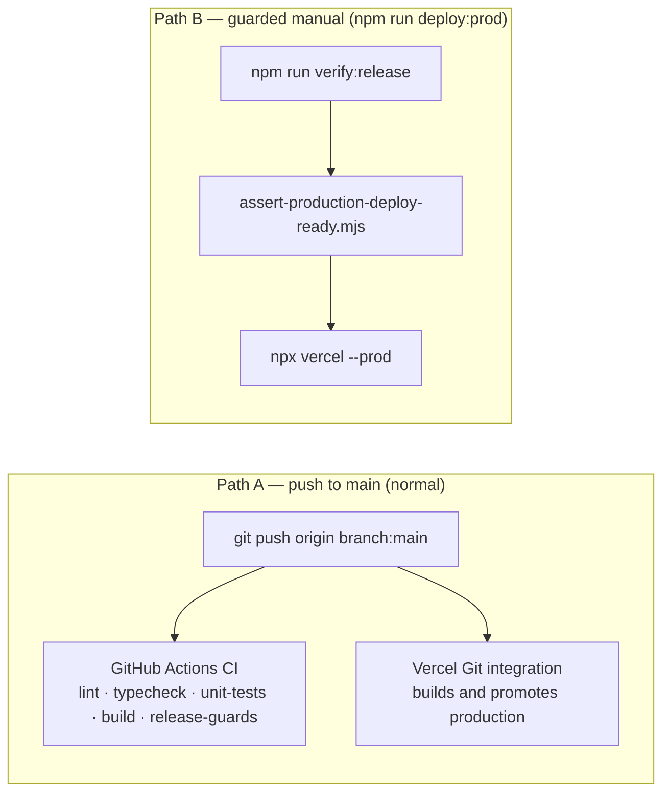
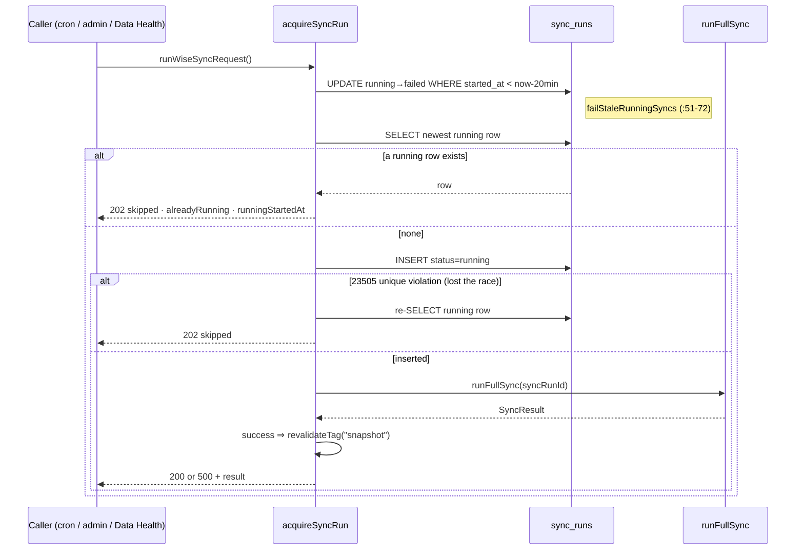
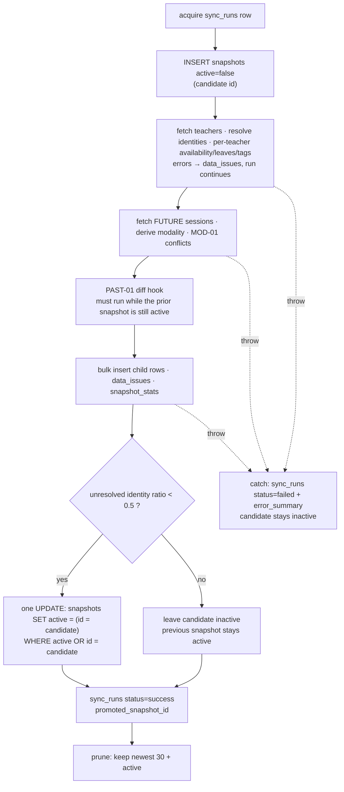
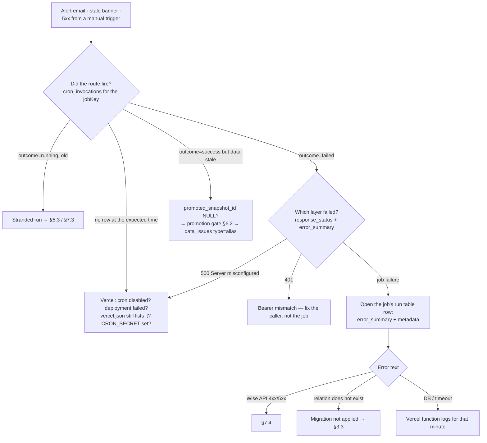

# Operations Runbook

> **Scope**: this page owns *how to operate* BGScheduler — deploying, running the npm scripts,
> firing any scheduled job by hand, recovering a stalled sync, rolling a snapshot back, and reading
> the evidence a failed sync leaves behind. Job *semantics* (what each cron does and why) live in
> [`reference/crons.md`](../reference/crons.md) and the per-feature pages under
> [`features/`](../features/); the health-evidence model is expanded in
> [`observability.md`](./observability.md); sign-in and page scoping are in
> [`auth-and-access.md`](./auth-and-access.md).

Every non-obvious claim carries a `file:line` reference. Where the repository ships **no tool** for
something — snapshot rollback, un-sticking a leave-request run — the page says so and gives the
manual procedure derived from the code path it mirrors.

---

## 1. Quick reference

| Thing | Where |
|---|---|
| Production | `https://bgscheduler.vercel.app` — Vercel region `sin1` ([`vercel.json:2`](../../vercel.json)) |
| Repository | `https://github.com/kasheesh711/bgscheduler` |
| Database | Neon Postgres over the serverless HTTP driver; `getDb()` is a `globalThis` singleton and throws when `DATABASE_URL` is unset ([`src/lib/db/index.ts:5-27`](../../src/lib/db/index.ts)) |
| Wise API | `https://api.wiseapp.live`, namespace `begifted-education`, institute `696e1f4d90102225641cc413` ([`src/lib/wise/client.ts:64`](../../src/lib/wise/client.ts), [`src/lib/env.ts:10-11`](../../src/lib/env.ts)) |
| Scheduled jobs | **19** entries in [`vercel.json`](../../vercel.json), pinned by [`src/__tests__/vercel-crons.test.ts`](../../src/__tests__/vercel-crons.test.ts) |
| Job registry | **24** definitions — 19 scheduled + 5 `manualOnly` — in [`src/lib/data-health/cron-registry.ts`](../../src/lib/data-health/cron-registry.ts) |
| Health dashboard | `/data-health`; JSON at `GET /api/data-health` ([`src/app/api/data-health/route.ts:14-26`](../../src/app/api/data-health/route.ts)) |
| Alerting | cron watchdog every 30 min, emails full-access admins ([`src/lib/internal/cron-watchdog.ts`](../../src/lib/internal/cron-watchdog.ts)) |
| Deploy | push to `main` (Vercel Git integration), or `npm run deploy:prod` from the Vercel-linked worktree ([`package.json:39`](../../package.json)) |
| Kill switches | `MAINTENANCE_MODE`, `POST_CLASS_PAYOUT_WRITES_ENABLED`, `POST_CLASS_AUTO_APPROVE_ENABLED` — [§4.6](#46-kill-switches) |

The three tables you will read most often when something is wrong:

| Table | Written by | Answers |
|---|---|---|
| `sync_runs` | the Wise snapshot ETL ([`schema.ts:462-477`](../../src/lib/db/schema.ts)) | Did the last Wise sync succeed, how long did it take, what did it promote, why did it fail |
| `cron_invocations` | every audit-wrapped cron route ([`schema.ts:479-499`](../../src/lib/db/schema.ts)) | Did Vercel actually call the route, with what outcome and HTTP status |
| `snapshots` | the promotion step of the ETL ([`schema.ts:456-460`](../../src/lib/db/schema.ts)) | Which snapshot is `active = true` right now |

---

## 2. Deploy

### 2.1 Two ways to reach production


```mermaid
flowchart LR
  subgraph A["Path A — push to main (normal)"]
    a1["git push origin branch:main"] --> a2["GitHub Actions CI<br/>lint · typecheck · unit-tests · build · release-guards"]
    a1 --> a3["Vercel Git integration<br/>builds and promotes production"]
  end
  subgraph B["Path B — guarded manual (npm run deploy:prod)"]
    b1["npm run verify:release"] --> b2["assert-production-deploy-ready.mjs"] --> b3["npx vercel --prod"]
  end
```

**Path A** is the default: the Vercel Git integration deploys whatever lands on `main`. CI runs in
parallel and does **not** gate the Vercel build — the two are independent consumers of the same push.

**Path B** is `npm run deploy:prod`, defined as
`npm run verify:release && node scripts/assert-production-deploy-ready.mjs && npx vercel --prod`
([`package.json:39`](../../package.json)). It exists so a manual production push cannot skip the
release gate or ship an unpushed commit.

### 2.2 The release gate — `verify:release`

`verify:release` runs, in order ([`package.json:38`](../../package.json)):

1. `npm run typecheck` — `tsc --noEmit` ([`:10`](../../package.json))
2. `npm test` — the Vitest **unit** project only ([`:11`](../../package.json))
3. `npm run build` — `next build` ([`:7`](../../package.json))
4. `npm run typecheck` again
5. `git diff --check` — whitespace errors
6. `npm run guard:production-route-surface` ([`:37`](../../package.json))

It does **not** run the integration tests (they need Docker — [§3.2](#32-tests)), `npm run lint`, or
`guard:sales-dashboard-scope`. CI covers `lint` in its own job.

### 2.3 The preflight — `assert-production-deploy-ready.mjs`

[`scripts/assert-production-deploy-ready.mjs`](../../scripts/assert-production-deploy-ready.mjs)
refuses to continue when:

- the current branch is not `main` — overridable with `PRODUCTION_BRANCH` ([`:5, :17-20`](../../scripts/assert-production-deploy-ready.mjs));
- `git status --porcelain=v1` is non-empty — **any** uncommitted *or untracked* file fails it ([`:22-33`](../../scripts/assert-production-deploy-ready.mjs));
- `HEAD` differs from `origin/main` — push first, then deploy the pushed commit ([`:35-41`](../../scripts/assert-production-deploy-ready.mjs)).

Untracked scratch files count as dirty. Commit, stash, or delete them first.

### 2.4 The route-surface guard

[`scripts/check-production-route-surface.mjs`](../../scripts/check-production-route-surface.mjs)
walks `src/app` for every `page.tsx` / `route.ts`, derives the URL path (dropping `(group)` and
`@slot` segments) ([`:9-45`](../../scripts/check-production-route-surface.mjs)), and compares the
result against [`docs/reference/production-route-surface.json`](../reference/production-route-surface.json):

- the discovered route count may not drop below `minSourceRouteCount` — currently **224**, matching
  the 224 entries in `sourceRoutes`;
- every entry in `sourceRoutes` and every `criticalRoutes` entry (**9**: `/leave-requests`,
  `/line-review`, `/payroll`, `/student-promotions`, `/api/data-health/jobs/[jobKey]/run`,
  `/api/internal/post-class-feedback-backfill`, `/api/internal/sync-leave-requests`,
  `/api/post-class-feedback/payout-runs`, `/api/internal/student-promotions/july-1`) must still exist.

Adding routes passes automatically. **Removing** one deliberately means regenerating the manifest in
the same change:

```bash
node scripts/check-production-route-surface.mjs --update
```

### 2.5 What CI runs

[`.github/workflows/ci.yml`](../../.github/workflows/ci.yml) fires on pull requests to `main` and
pushes to `main`, on Node 20, with placeholder env values (`DATABASE_URL`, `AUTH_*`, `WISE_*`,
`CRON_SECRET`, `ENABLE_AI_SCHEDULER=false`, `ENABLE_LINE_SCHEDULER=false`, `TZ=Asia/Bangkok`;
[`:14-26`](../../.github/workflows/ci.yml)). Five jobs:

| Job | Runs |
|---|---|
| `lint` | `npm run lint` ([`:29-39`](../../.github/workflows/ci.yml)) |
| `typecheck` | `npm run typecheck` ([`:41-51`](../../.github/workflows/ci.yml)) |
| `unit-tests` | `npm test` ([`:53-63`](../../.github/workflows/ci.yml)) |
| `build` | `npm run build`, then `npm run typecheck` ([`:65-76`](../../.github/workflows/ci.yml)) |
| `release-guards` | `guard:production-route-surface`, then `git diff --check` over the changed range ([`:78-98`](../../.github/workflows/ci.yml)) |

A second workflow, [`sales-dashboard-scope.yml`](../../.github/workflows/sales-dashboard-scope.yml),
runs [`scripts/check-sales-dashboard-scope.mjs`](../../scripts/check-sales-dashboard-scope.mjs) on
PRs. CI never runs integration tests, migrations, or seeds.

### 2.6 Worktree caveat for `vercel --prod`

The repository is worked in several git worktrees; only one carries the Vercel project link (a
`.vercel/` directory). A bare `npx vercel --prod` from an **unlinked** directory does not deploy the
existing project — it prompts to link, or creates a *new* Vercel project. Always use Path A, or run
`deploy:prod` only from the linked worktree while on `main`.

### 2.7 Migrations are not part of the deploy

Nothing in the build or deploy path applies migrations: `build` is `next build`
([`package.json:7`](../../package.json)), CI never calls `db:migrate`, and Vercel runs only the
build. Schema changes need an explicit, separate step ([§3.3](#33-database)) — normally **before**
the code that depends on them goes live.

A few readers fail soft when a table is missing — the watchdog disables alerting rather than
spamming when `cron_alert_state` is absent ([`cron-watchdog.ts:403-417`](../../src/lib/internal/cron-watchdog.ts)),
and Data Health falls back to run-table proof when `cron_invocations` is absent
([`dashboard.ts:846-853`](../../src/lib/data-health/dashboard.ts)) — but most routes do not.

`drizzle/` holds **74** forward-only SQL files (`0000_tidy_black_bolt.sql` …
`0073_funny_ego.sql`), tracked in `drizzle/meta/_journal.json`. There are no down
migrations; reverting a schema change means writing a new forward migration.

### 2.8 Rolling back a deploy

Reverting *code* is a Vercel operation (promote a previous deployment from the dashboard or CLI) and
lives outside this repository. Two things the repo does determine:

- environment-variable changes on Vercel take effect only on the **next deployment**;
- a code rollback rolls back no data. See [§6](#6-snapshot-lifecycle-and-rollback) for snapshots and
  §2.7 for migrations.

---

## 3. npm scripts

All scripts are declared in [`package.json:5-40`](../../package.json).

### 3.1 Dev, build, quality

```bash
npm run dev          # next dev
npm run build        # next build
npm run start        # next start (serve the production build)
npm run lint         # eslint
npm run typecheck    # tsc --noEmit
```

[`src/lib/env.ts`](../../src/lib/env.ts) parses the environment with Zod at **import time** and
throws on an invalid set ([`:40-49`](../../src/lib/env.ts)): 7 required (`DATABASE_URL`,
`AUTH_GOOGLE_ID`, `AUTH_GOOGLE_SECRET`, `AUTH_SECRET`, `WISE_USER_ID`, `WISE_API_KEY`,
`CRON_SECRET`), 2 defaulted (`WISE_NAMESPACE`, `WISE_INSTITUTE_ID`), 9 optional
([`:3-36`](../../src/lib/env.ts)). Only `fieldErrors` are logged — never values
([`:43`](../../src/lib/env.ts)). Copy [`.env.example`](../../.env.example) to `.env.local`. The full
inventory, including the many variables read straight from `process.env` outside this schema, is
[`reference/env.md`](../reference/env.md).

### 3.2 Tests

```bash
npm test                  # vitest run --project unit          (package.json:11)
npm run test:watch        # vitest --project unit              (:12)
npm run test:integration  # vitest run --project integration   (:13)
npm run test:all          # vitest run — both projects         (:14)
npm run test:coverage     # unit project + v8 coverage         (:15)
```

[`vitest.config.ts`](../../vitest.config.ts) sets `process.env.TZ = "Asia/Bangkok"` before anything
else loads ([`:4`](../../vitest.config.ts)), so date assertions are deterministic regardless of the
machine's zone. Two projects:

| Project | Includes | Runner shape |
|---|---|---|
| `unit` | `src/**/*.test.ts(x)`, excluding `*.integration.test.ts` ([`:26-35`](../../vitest.config.ts)) | node env, default parallelism |
| `integration` | `src/**/*.integration.test.ts` ([`:36-50`](../../vitest.config.ts)) | `pool: "forks"`, `fileParallelism: false`, `maxWorkers: 1`, 60 s test + hook timeouts |

At this revision there are **409** test files, **15** of them integration suites. The integration
project starts an ephemeral Postgres via `testcontainers` / `@testcontainers/postgresql`
([`package.json:65, :77`](../../package.json)), so **Docker must be running locally** — a missing
daemon fails every integration file at setup. Coverage uses the v8 provider and excludes
`__tests__`, `src/tests/**`, and all `src/app/**/*.tsx` ([`:13-24`](../../vitest.config.ts)).

### 3.3 Database

```bash
npm run db:generate                                            # drizzle-kit generate — writes drizzle/NNNN_*.sql; touches no database
DATABASE_URL=... npm run db:migrate                            # drizzle-kit migrate — applies pending migrations
DATABASE_URL=... SEED_ADMIN_EMAILS=a@x,b@y npm run db:seed     # tsx src/lib/db/seed.ts
```

[`drizzle.config.ts`](../../drizzle.config.ts) points `drizzle-kit` at `./src/lib/db/schema.ts`,
outputs to `./drizzle`, dialect `postgresql`, and takes the target from `DATABASE_URL`
([`:3-10`](../../drizzle.config.ts)). There is no separate migration URL — **whatever `DATABASE_URL`
is in your shell is the database you migrate.** Check it twice.

Recommended order for a schema change:

1. Edit `src/lib/db/schema.ts`, run `npm run db:generate`, and **read the generated SQL** — the
   generator can emit far more than the change warrants; trim before applying.
2. Apply the migration to the target database **before** the code that needs it is live (§2.7).
3. Push to `main`.

`db:seed` ([`src/lib/db/seed.ts`](../../src/lib/db/seed.ts)) is idempotent and does three things:
inserts four tutor aliases with `onConflictDoNothing` ([`:14-28`](../../src/lib/db/seed.ts));
inserts each comma-separated address in `SEED_ADMIN_EMAILS` into `admin_users` with
`onConflictDoNothing` ([`:31-43`](../../src/lib/db/seed.ts)) — these become **full-access** admins;
and **upserts** one hard-coded page-restricted user whose `allowedPages` is re-applied on every run
([`:45-60`](../../src/lib/db/seed.ts)). It exits non-zero when `DATABASE_URL` is unset
([`:6-9`](../../src/lib/db/seed.ts)). Because that last write is `onConflictDoUpdate`, re-running
the seed **overwrites** any manual change to that user's page scope.

### 3.4 Guards and release

```bash
npm run guard:production-route-surface   # §2.4
npm run guard:sales-dashboard-scope      # §2.5
npm run verify:release                   # §2.2
npm run deploy:prod                      # §2.1 Path B
```

### 3.5 One-off maintenance scripts

All run through `tsx`; the payout family passes `--tsconfig scripts/tsconfig.json` so Next-only
modules import outside Next.

| Script | Notes |
|---|---|
| `credit-control:seed-admin-ownership` | [`package.json:19`](../../package.json) |
| `tutor-profiles:seed` | `:20` |
| `room-capacity:import-model` | `:21` |
| `room-utilization:sync` | `:22`. Calls the same `syncRoomUtilizationSessions` the manual-only route uses. **This is how Room Capacity utilization data gets refreshed — nothing schedules it** ([`cron-registry.ts:369-383`](../../src/lib/data-health/cron-registry.ts)) |
| `ai-scheduler:evaluate`, `ai-scheduler:compare-models` | `:23-24` — offline eval harness |
| `line:test-data:cleanup` | `:25` |
| `line:find-user-ids` | `:26` — harvests LINE user IDs for the schedule-bot allowlist |
| `payout:inventory`, `payout:setup-master-tabs`, `payout:repoint-workbooks`, `payout:restore-workbooks`, `payout:derive-tutor-names`, `payout:roll-workbooks`, `payout:backfill-submitted`, `payout:remove-netted`, `payout:reconcile-sheet` | `:27-35` — Google Sheets maintenance for the post-class payout ledger; see [`features/post-class-feedback.md`](../features/post-class-feedback.md) |

`scripts/` also holds files with no npm alias. Read the header before running any of them — several
write to Google Sheets or the database.

---

## 4. Cron authentication and manual triggering

### 4.1 How the auth check works

`src/middleware.ts` treats everything under `/api/internal/` as a public route
([`middleware.ts:24`](../../src/middleware.ts)), so Auth.js never runs for cron paths and each
handler does its own check. The shared helper is
[`src/lib/internal/cron-auth.ts`](../../src/lib/internal/cron-auth.ts):

- `getCronSecretStatus(request)` compares the `Authorization` header against
  `` `Bearer ${CRON_SECRET}` `` using `timingSafeEqual` after an O(1) length pre-check — the
  pre-check exists because `timingSafeEqual` throws a `RangeError` on length-mismatched buffers —
  and returns `"valid" | "invalid" | "missing-secret"` ([`:6-17`](../../src/lib/internal/cron-auth.ts));
- `rejectInvalidCronSecret(request)` returns `null` when valid, **`500 {"error":"Server
  misconfigured"}`** when `CRON_SECRET` is unset, and **`401 {"error":"Unauthorized"}`** otherwise
  ([`:19-26`](../../src/lib/internal/cron-auth.ts)).

Six routes carry a byte-identical **inline copy** rather than importing the helper — `sync-wise`
(design ID **REL-07**, [`route.ts:11-29`](../../src/app/api/internal/sync-wise/route.ts)),
`sync-credit-control` ([`:18-31`](../../src/app/api/internal/sync-credit-control/route.ts)),
`sync-sales-dashboard` ([`:15-22`](../../src/app/api/internal/sync-sales-dashboard/route.ts)),
`sync-competitor-intelligence` ([`:11-18`](../../src/app/api/internal/sync-competitor-intelligence/route.ts)),
`sync-room-utilization` ([`:12-24`](../../src/app/api/internal/sync-room-utilization/route.ts)) and
`student-promotions/july-1` ([`:10-17`](../../src/app/api/internal/student-promotions/july-1/route.ts)).
Behaviour is identical.

Practical consequences:

- A `500 Server misconfigured` from **any** internal route means the deployment has no
  `CRON_SECRET` — every cron is failing, not just the one you called.
- A `401` means the header is wrong: missing `Bearer ` prefix, a trailing newline in the shell
  variable, or the wrong environment's secret.
- Maintenance mode never blocks these routes — `/api/internal/` is an exempt prefix
  ([`maintenance.ts:43-48`](../../src/lib/maintenance.ts)).

### 4.2 Session fallback on `POST`

Some routes accept an Auth.js session on `POST` when the bearer is absent or wrong, so an admin can
trigger them from the app. `GET` never accepts a session — Vercel Cron issues `GET`, and
`allowSessionAuth` is `false` there ([`sync-wise/route.ts:69-76`](../../src/app/api/internal/sync-wise/route.ts)).
The per-route matrix is in §4.4.

### 4.3 Invocation audit

Every internal route except `student-promotions/july-1` wraps its work in `withCronInvocationAudit`
([`cron-audit.ts:191-206`](../../src/lib/data-health/cron-audit.ts)), which:

1. inserts a `cron_invocations` row with `outcome = "running"` **before** the job runs
   ([`:131-159`](../../src/lib/data-health/cron-audit.ts)) — so a function killed by the platform
   timeout leaves a stranded `running` row rather than silence;
2. runs the handler; a thrown error becomes a synthetic `500 {error}` and is still audited
   ([`:200-205`](../../src/lib/data-health/cron-audit.ts));
3. classifies the outcome ([`:108-117`](../../src/lib/data-health/cron-audit.ts)) — body
   `skipped === true`, or an `error`/`message` containing `"already running"` → `skipped`; body
   `ok === false` or `success === false` → `failed`; HTTP `202` → `skipped`; HTTP ≥ 400 → `failed`;
   otherwise `success`;
4. updates the row with `finishedAt`, `durationMs`, `responseStatus`, `errorSummary`,
   `linkedRunIds` (e.g. `syncRunId`) and a size-capped response digest — top-level scalars only,
   strings truncated at 200 chars, serialized digest capped at 2 048 bytes
   ([`:62-64, :81-106, :161-189`](../../src/lib/data-health/cron-audit.ts)).

Audit writes are best-effort: a failed insert or update is `console.error`-logged and the job
proceeds ([`:156, :187`](../../src/lib/data-health/cron-audit.ts)). `triggerSource` records `cron`
(bearer), `admin` (session or Data Health run) or `system`
([`types.ts:11`](../../src/lib/data-health/types.ts)).

### 4.4 Every internal route, and how to fire it

Bangkok is UTC+7. `maxDuration` is the per-route Vercel function timeout (`export const
maxDuration`). "Manual auth" is what a hand-triggered call may present.

**Scheduled — 19, one row per `vercel.json` entry:**

| Path | Schedule (UTC) | Bangkok | `jobKey` | `maxDuration` | Verbs | Manual auth |
|---|---|---|---|---|---|---|
| `/api/internal/sync-wise` | `*/30 * * * *` | :00 / :30 | `wise_snapshot` | 800 ([`:7`](../../src/app/api/internal/sync-wise/route.ts)) | GET, POST | bearer; **POST also accepts any session** ([`:45-59`](../../src/app/api/internal/sync-wise/route.ts)) |
| `/api/internal/sync-wise-activity` | `2,17,32,47 * * * *` | every 15 min | `wise_activity` | 800 ([`:8`](../../src/app/api/internal/sync-wise-activity/route.ts)) | GET | bearer |
| `/api/internal/sync-sales-dashboard` | `10,40 * * * *` | :10 / :40 | `sales_dashboard` | 800 ([`:11`](../../src/app/api/internal/sync-sales-dashboard/route.ts)) | GET, POST | bearer; POST also accepts a session carrying an email ([`:28-36`](../../src/app/api/internal/sync-sales-dashboard/route.ts)) |
| `/api/internal/sync-onsite-foot-traffic` | `18 18 * * *` | 01:18 daily | `onsite_foot_traffic` | 800 | GET | bearer; reconciles the rolling 35 completed Bangkok days after the initial backfill |
| `/api/internal/sync-unearned-revenue` | `30 18 * * *` | 01:30 daily | `unearned_revenue` | 800 | GET | bearer; imports a stable published accounting snapshot |
| `/api/internal/sync-post-class-feedback` | `13,43 * * * *` | :13 / :43 | `post_class_feedback` | 800 ([`:13`](../../src/app/api/internal/sync-post-class-feedback/route.ts)) | GET | bearer |
| `/api/internal/sync-leave-requests` | `15,45 * * * *` | :15 / :45 | `leave_requests` | 800 ([`:7`](../../src/app/api/internal/sync-leave-requests/route.ts)) | GET, POST | bearer on **both** verbs — no session fallback ([`:9-11, :30-36`](../../src/app/api/internal/sync-leave-requests/route.ts)) |
| `/api/internal/sync-credit-control` | `20,50 * * * *` | :20 / :50 | `credit_control` | 800 ([`:14`](../../src/app/api/internal/sync-credit-control/route.ts)) | GET, POST | bearer; POST also accepts any session ([`:43-56`](../../src/app/api/internal/sync-credit-control/route.ts)) |
| `/api/internal/post-class-feedback-backfill` | `23,53 * * * *` | :23 / :53 | `post_class_feedback_backfill` | 800 ([`:12`](../../src/app/api/internal/post-class-feedback-backfill/route.ts)) | GET (query params) | bearer |
| `/api/internal/sync-progress-tests` | `25,55 * * * *` | :25 / :55 | `progress_tests` | **300** ([`:7`](../../src/app/api/internal/sync-progress-tests/route.ts)) | GET, POST | bearer; POST also accepts any session ([`:19-32`](../../src/app/api/internal/sync-progress-tests/route.ts)) |
| `/api/internal/post-class-feedback/payout-accrual` | `33 * * * *` | hourly at :33 | `post_class_feedback_payout_accrual` | 800 ([`:10`](../../src/app/api/internal/post-class-feedback/payout-accrual/route.ts)) | GET | bearer — **moves money when the payout flags are on** (§4.6) |
| `/api/internal/cron-watchdog` | `7,37 * * * *` | :07 / :37 | `cron_watchdog` | 300 ([`:7`](../../src/app/api/internal/cron-watchdog/route.ts)) | GET, POST | bearer ([`:9-11`](../../src/app/api/internal/cron-watchdog/route.ts)) |
| `/api/internal/class-assignments/morning` | `41 23 * * *` | 06:41 daily | `classroom_morning` | 800 ([`:6`](../../src/app/api/internal/class-assignments/morning/route.ts)) | GET | bearer — publishes rooms to Wise and emails tutors |
| `/api/internal/class-assignments/admin-email` | `4,14,24,36 0 * * *` | 07:04–07:36 daily | `classroom_admin_email` | 300 ([`:6`](../../src/app/api/internal/class-assignments/admin-email/route.ts)) | GET | bearer — sends email |
| `/api/internal/progress-tests/admin-digest` | `35 0 * * *` | 07:35 daily | `progress_tests_digest` | 300 ([`:6`](../../src/app/api/internal/progress-tests/admin-digest/route.ts)) | GET | bearer — sends email |
| `/api/internal/admissions-notifications` | `12 1 * * *` | 08:12 daily | `admissions_notifications` | 300 ([`:20`](../../src/app/api/internal/admissions-notifications/route.ts)) | GET (`?runType=`), POST (JSON `runType`) | bearer only on both verbs ([`:73-114`](../../src/app/api/internal/admissions-notifications/route.ts)) — sends email |
| `/api/internal/line-credit-digest` | `3 2 * * *` | 09:03 daily | `line_credit_digest` | 300 ([`:6`](../../src/app/api/internal/line-credit-digest/route.ts)) | GET | bearer — pushes to LINE staff groups |
| `/api/internal/sync-competitor-intelligence` | `28 18 * * 0` | Mon 01:28 weekly | `competitor_intelligence` | 800 ([`:7`](../../src/app/api/internal/sync-competitor-intelligence/route.ts)) | GET, POST | bearer; POST also accepts a session passing `requireCompetitorIntelligenceSession` ([`:31-36`](../../src/app/api/internal/sync-competitor-intelligence/route.ts)) — spends paid provider budget |
| `/api/internal/student-promotions/july-1` | `5 17 30 6 *` | 00:05 on 1 Jul, annual | `student_promotions_july_1` | 800 ([`:8`](../../src/app/api/internal/student-promotions/july-1/route.ts)) | GET, POST (POST delegates to GET, [`:46-48`](../../src/app/api/internal/student-promotions/july-1/route.ts)) | bearer only; returns **409** unless today is the Bangkok target date ([`:27-31`](../../src/app/api/internal/student-promotions/july-1/route.ts)); **not audit-wrapped** |

**Manual-only — 5, registered with `schedule: null` and no `vercel.json` entry; nothing fires them
automatically:**

| Path | `jobKey` | `maxDuration` | Verbs | Notes |
|---|---|---|---|---|
| `/api/internal/post-class-feedback/admin-digest` | `post_class_feedback_digest` | 300 ([`:7`](../../src/app/api/internal/post-class-feedback/admin-digest/route.ts)) | GET | bearer; parked, `dangerous` — emails the admin digest ([`cron-registry.ts:192-206`](../../src/lib/data-health/cron-registry.ts)) |
| `/api/internal/post-class-feedback/reminder-day-after` | `post_class_feedback_day_after` | 800 ([`:7`](../../src/app/api/internal/post-class-feedback/reminder-day-after/route.ts)) | GET | bearer; parked, `dangerous` — may email tutors; returns **503** while the checkpoint still has unreconciled Wise sessions ([`:17-23`](../../src/app/api/internal/post-class-feedback/reminder-day-after/route.ts)) |
| `/api/internal/post-class-feedback/reminder-deadline` | `post_class_feedback_deadline` | 800 ([`:7`](../../src/app/api/internal/post-class-feedback/reminder-deadline/route.ts)) | GET | as above ([`cron-registry.ts:222-236`](../../src/lib/data-health/cron-registry.ts)) |
| `/api/internal/sync-room-utilization` | `room_utilization` | 800 ([`:8`](../../src/app/api/internal/sync-room-utilization/route.ts)) | **POST only** | bearer or any session ([`:26-40`](../../src/app/api/internal/sync-room-utilization/route.ts)). POST-only is why it cannot be a Vercel cron |
| `/api/internal/line-backlog-recovery` | `line_backlog_recovery` | 300 ([`:9`](../../src/app/api/internal/line-backlog-recovery/route.ts)) | GET | bearer; runs `runLineBacklogRecovery({ dryRun: false })` ([`:19`](../../src/app/api/internal/line-backlog-recovery/route.ts)) |

The registry-vs-`vercel.json` agreement (exactly 19 entries on their pinned schedules) and the rule
that **no two crons may fire in the same UTC minute** are both enforced by
[`src/__tests__/vercel-crons.test.ts:100-126`](../../src/__tests__/vercel-crons.test.ts). If you
change a schedule, change it in **both** `vercel.json` and `cron-registry.ts`, then run `npm test`.

### 4.5 Triggering by hand with curl

The same header Vercel sends works from any shell. Use `-i` so you see the status code — it carries
meaning (§4.8).

```bash
export CRON_SECRET='…'                     # the production value, from Vercel → Settings → Environment Variables
BASE=https://bgscheduler.vercel.app

# Wise snapshot ETL — GET or POST
curl -i -X POST "$BASE/api/internal/sync-wise" -H "Authorization: Bearer $CRON_SECRET"

# The other sub-hourly syncs
curl -i "$BASE/api/internal/sync-wise-activity"        -H "Authorization: Bearer $CRON_SECRET"
curl -i "$BASE/api/internal/sync-sales-dashboard"      -H "Authorization: Bearer $CRON_SECRET"
curl -i "$BASE/api/internal/sync-post-class-feedback"  -H "Authorization: Bearer $CRON_SECRET"
curl -i "$BASE/api/internal/sync-leave-requests"       -H "Authorization: Bearer $CRON_SECRET"
curl -i "$BASE/api/internal/sync-credit-control"       -H "Authorization: Bearer $CRON_SECRET"
curl -i "$BASE/api/internal/sync-progress-tests"       -H "Authorization: Bearer $CRON_SECRET"
curl -i "$BASE/api/internal/cron-watchdog"             -H "Authorization: Bearer $CRON_SECRET"

# Post-class backfill. With no parameters it takes the oldest unreconciled window and drains
# one 50-detail batch; explicit dates/caps are the manual recovery path — detailCap ≤ 400,
# maxBatches ≤ 50, startDate/endDate must be supplied together
# (post-class-feedback-backfill/route.ts:19-30, :51-69).
curl -i "$BASE/api/internal/post-class-feedback-backfill" -H "Authorization: Bearer $CRON_SECRET"
curl -i "$BASE/api/internal/post-class-feedback-backfill?startDate=2026-08-26&endDate=2026-08-31&detailCap=400&maxBatches=10" \
  -H "Authorization: Bearer $CRON_SECRET"

# Admissions notifications — omit runType for the cron default (daily scan, plus the weekly
# digest on Bangkok Sundays); "daily" or "weekly" forces exactly one pass (route.ts:56-61).
curl -i "$BASE/api/internal/admissions-notifications?runType=daily" -H "Authorization: Bearer $CRON_SECRET"
curl -i -X POST "$BASE/api/internal/admissions-notifications" -H "Authorization: Bearer $CRON_SECRET" \
  -H "content-type: application/json" -d '{"runType":"weekly"}'

# Room utilization — POST only (manual-only; no cron fires it)
curl -i -X POST "$BASE/api/internal/sync-room-utilization" -H "Authorization: Bearer $CRON_SECRET"
```

Pause before pressing enter on the side-effecting jobs: `class-assignments/morning` publishes room
assignments to Wise and emails tutors; the three email/LINE digests send messages; the competitor
sync spends provider budget; `payout-accrual` appends real deductions to the payout ledger when the
payout flags are on (§4.6). The registry marks all of these `dangerous: true`, which is what makes
the **UI** ask for confirmation ([`cron-registry.ts`](../../src/lib/data-health/cron-registry.ts),
`dangerous` / `confirmationLabel`). curl asks for nothing.

### 4.6 Kill switches

| Variable | Effect | Code |
|---|---|---|
| `MAINTENANCE_MODE` | Exactly `"true"` returns `503` (+ `Retry-After: 3600`) for every path except `/api/internal/`, `/schedule/`, `/api/auth/` and `/login` — so the staff UI goes dark while every cron keeps running. `MAINTENANCE_BYPASS_EMAILS` (comma-separated, fail-closed when empty) lets named admins through after signing in. Fail-**open**: any other value leaves the site up. Needs a redeploy to take effect. `/api/line/webhook` **is** gated, and LINE does not redeliver — inbound OA messages during a window are lost (MAINT-04). | [`maintenance.ts:43-48, :59-61, :79-101, :120-134`](../../src/lib/maintenance.ts) |
| `POST_CLASS_PAYOUT_WRITES_ENABLED` | Only the exact string `"true"` permits appends to the payout Google Sheets; otherwise the guard throws before any external write. | [`payout-config.ts:50, :128`](../../src/lib/post-class-feedback/payout-config.ts) |
| `POST_CLASS_AUTO_APPROVE_ENABLED` | Only `"true"` lets the hourly accrual sweep approve deadline-passed deductions unattended; off means approvals stay human-only. Grace window comes from `POST_CLASS_AUTO_APPROVE_GRACE_HOURS`. | [`payout-config.ts:165, :184`](../../src/lib/post-class-feedback/payout-config.ts) |
| `POST_CLASS_PAYOUT_TARGET` | Must be `production` on a production deployment and `scratch` on a preview; anything else throws. | [`payout-config.ts:44, :112-122`](../../src/lib/post-class-feedback/payout-config.ts) |

Maturity note: the post-class payout path is **stable, with writes flag-gated by
`POST_CLASS_PAYOUT_WRITES_ENABLED` / `POST_CLASS_AUTO_APPROVE_ENABLED`**. Setting either to anything
but `"true"` is the documented way to stop money movement without a code change — but an env change
still needs a redeploy to be picked up.

### 4.7 Triggering from the UI

Two in-app paths exist, both behind an Auth.js session and both audited with
`triggerSource: "admin"`:

- **Data Health → Run.** `POST /api/data-health/jobs/{jobKey}/run`
  ([`route.ts`](../../src/app/api/data-health/jobs/%5BjobKey%5D/run/route.ts)) requires a session
  with an email ([`:13-17`](../../src/app/api/data-health/jobs/%5BjobKey%5D/run/route.ts)); returns
  `404` for an unknown key ([`:19-23`](../../src/app/api/data-health/jobs/%5BjobKey%5D/run/route.ts));
  any `post_class_feedback*` key additionally requires the `access_manager` post-class capability
  ([`:25-30`](../../src/app/api/data-health/jobs/%5BjobKey%5D/run/route.ts)); a `dangerous` job
  returns `409 Confirmation required` unless the body carries `{"confirmed": true}`
  ([`:32-41`](../../src/app/api/data-health/jobs/%5BjobKey%5D/run/route.ts)). Dispatch is
  [`run-job.ts:29-210`](../../src/lib/data-health/run-job.ts); `maxDuration` is 800
  ([`:11`](../../src/app/api/data-health/jobs/%5BjobKey%5D/run/route.ts)).

  **Gap worth knowing:** `runDataHealthJob` implements only **16** of the 24 registry keys. The
  eight with no branch — `unearned_revenue`, `progress_tests`, `progress_tests_digest`, `post_class_feedback_backfill`,
  `student_promotions_july_1`, `admissions_notifications`, `line_credit_digest`,
  `line_backlog_recovery` — fall through to `404 {"error":"Unknown job"}`
  ([`run-job.ts:207`](../../src/lib/data-health/run-job.ts)). Those must be fired with curl (§4.5).
- **Class Assignments → Sync.** `POST /api/admin/sync-wise` — session only, running the same
  `runWiseSyncRequest` as the cron ([`route.ts:8-24`](../../src/app/api/admin/sync-wise/route.ts)).
  The client then polls for a freshly promoted snapshot every 5 s for up to **12 minutes** before
  giving up ([`sync-flow.ts:3-4, :99, :110`](../../src/components/class-assignments/sync-flow.ts)).

### 4.8 Response-status decoder

| Status | Meaning | Where it comes from |
|---|---|---|
| `200` | Ran; body is the job result. For the Wise sync that is the `SyncResult` plus `staleRunningSyncsFailed`. | [`run-wise-sync.ts:155-166`](../../src/lib/sync/run-wise-sync.ts) |
| `202` | **Skipped — another run is in flight.** Body carries `skipped: true, alreadyRunning: true, runningStartedAt`. Audited as `skipped`, not failed. | Wise ([`run-wise-sync.ts:148-150`](../../src/lib/sync/run-wise-sync.ts)); credit control; progress tests; admissions when every pass skipped ([`route.ts:62-63`](../../src/app/api/internal/admissions-notifications/route.ts)) |
| `409` | Also "already running", on routes that throw a typed error instead: Wise activity ([`:28-30`](../../src/app/api/internal/sync-wise-activity/route.ts)), leave requests ([`:20-22`](../../src/app/api/internal/sync-leave-requests/route.ts)), post-class sync/backfill ([`:39-42`](../../src/app/api/internal/sync-post-class-feedback/route.ts), [`:72-74`](../../src/app/api/internal/post-class-feedback-backfill/route.ts)), competitor ([`:55-61`](../../src/app/api/internal/sync-competitor-intelligence/route.ts)). **Different 409s:** sales dashboard → the connected Google account has no Sheets token ([`:62-66`](../../src/app/api/internal/sync-sales-dashboard/route.ts)); student promotions → not the target date; Data Health run → confirmation missing. | |
| `400` | Bad query/body — backfill date/cap rules, admissions `runType`. | [`backfill/route.ts:36-41`](../../src/app/api/internal/post-class-feedback-backfill/route.ts), [`admissions-notifications/route.ts:77-86`](../../src/app/api/internal/admissions-notifications/route.ts) |
| `401` | Bearer wrong or missing (and, on POST routes with a session fallback, no session either). | [`cron-auth.ts:25`](../../src/lib/internal/cron-auth.ts) |
| `403` | Data Health run of a `post_class_feedback*` job without `access_manager`. | [`run/route.ts:25-30`](../../src/app/api/data-health/jobs/%5BjobKey%5D/run/route.ts) |
| `500` | Either `CRON_SECRET` is unset server-side (`Server misconfigured`) **or** the job failed. Read the body — a sync failure carries `success: false` and `errorSummary`. | [`cron-auth.ts:22-24`](../../src/lib/internal/cron-auth.ts), [`run-wise-sync.ts:164-166`](../../src/lib/sync/run-wise-sync.ts) |
| `503` | Post-class reminder checkpoint not ready (manual-only routes), or maintenance mode on a non-exempt path. | [`reminder-day-after/route.ts:17-23`](../../src/app/api/internal/post-class-feedback/reminder-day-after/route.ts), [`maintenance.ts:120-134`](../../src/lib/maintenance.ts) |

Three post-class routes return a **generic** error string and discard the underlying message —
`"Post-class feedback sync failed"` ([`route.ts:42`](../../src/app/api/internal/sync-post-class-feedback/route.ts)),
`"Post-class feedback backfill failed"` ([`route.ts:75-78`](../../src/app/api/internal/post-class-feedback-backfill/route.ts)),
`"Post-class payout accrual failed"` ([`route.ts:33-37`](../../src/app/api/internal/post-class-feedback/payout-accrual/route.ts)).
For those the real reason is in `post_class_sync_runs.error_summary` or the Vercel function log,
never in the HTTP body (§7.5).

---

## 5. The single-flight guard and abandoned-run recovery

### 5.1 Why it exists

A Vercel cron invocation is a plain HTTP request with a hard `maxDuration`. If a run is still going
at the next tick — a 30-minute cadence against a sync that takes minutes, or a platform timeout that
kills the function mid-write — a second invocation would race the first for the same Wise rate limit
and the same tables. The guard makes "one run at a time" a **database** property, so it holds across
Vercel instances and across scheduled and manual triggers alike.

### 5.2 How it works for the Wise snapshot sync

The reference implementation is [`run-wise-sync.ts`](../../src/lib/sync/run-wise-sync.ts); the
database half is the partial unique index
`sync_runs_single_running_idx ON sync_runs(status) WHERE status = 'running'`
([`schema.ts:473-475`](../../src/lib/db/schema.ts)) — at most one `running` row can exist.


```mermaid
sequenceDiagram
  participant C as Caller (cron / admin / Data Health)
  participant G as acquireSyncRun
  participant DB as sync_runs
  participant F as runFullSync

  C->>G: runWiseSyncRequest()
  G->>DB: UPDATE running→failed WHERE started_at < now-20min
  Note right of DB: failStaleRunningSyncs (:51-72)
  G->>DB: SELECT newest running row
  alt a running row exists
    DB-->>G: row
    G-->>C: 202 skipped · alreadyRunning · runningStartedAt
  else none
    G->>DB: INSERT status=running
    alt 23505 unique violation (lost the race)
      G->>DB: re-SELECT running row
      G-->>C: 202 skipped
    else inserted
      G->>F: runFullSync(syncRunId)
      F-->>G: SyncResult
      G->>G: success ⇒ revalidateTag("snapshot")
      G-->>C: 200 or 500 + result
    end
  end
```

Step by step ([`run-wise-sync.ts:88-118`](../../src/lib/sync/run-wise-sync.ts)):

1. **Fail stale rows.** Any `running` row older than `STALE_RUNNING_SYNC_MS = 20 min`
   ([`:10`](../../src/lib/sync/run-wise-sync.ts)) is flipped to `failed` with `finished_at = now`
   and the summary *"Sync marked failed because it was still running after 20 minutes; likely timed
   out or the request was aborted."* ([`:39-40, :51-72`](../../src/lib/sync/run-wise-sync.ts)). The
   count comes back to the caller as `staleRunningSyncsFailed`.
2. **Look for a live run.** If one remains, return the skipped shape with HTTP `202`
   ([`:120-140, :148-150`](../../src/lib/sync/run-wise-sync.ts)).
3. **Insert the guard row.** A Postgres `23505` on the partial index means another invocation won
   the race in the gap; re-read and skip ([`:42-49, :106-117`](../../src/lib/sync/run-wise-sync.ts)).
4. **Run the ETL** with that `syncRunId` ([`:152-154`](../../src/lib/sync/run-wise-sync.ts)); on
   success expire the `"snapshot"` cache tag ([`:160-162`](../../src/lib/sync/run-wise-sync.ts)).

The 20-minute window is comfortably above the route's 800 s `maxDuration` plus the 60 s stuck buffer
Data Health uses (§5.3), so a row stranded by a platform timeout is failed on the very next
invocation rather than being mistaken for a live run.

### 5.3 Abandoned-run recovery — three layers

An "abandoned" run is a row stuck at `status = 'running'` whose process is gone: function timeout,
deploy mid-run, aborted request, or a cleanup `UPDATE` that itself failed. The last case is logged
as `[sync-orchestrator] cleanup failed for syncRunId=…` under design ID **REL-06**
([`orchestrator.ts:584-596`](../../src/lib/sync/orchestrator.ts)).

| Layer | What it does | When |
|---|---|---|
| **Self-healing on next invocation** | The guard's stale sweep fails the row and proceeds (§5.2 step 1). This is the normal path — you rarely need to intervene. | at the first tick more than 20 min after the row was created |
| **Data Health / watchdog detection** | `evaluateCronJobStatus` reports `failing` with *"Running longer than Ns maxDuration."* once a `running` row (invocation or run table) is older than `maxDurationSeconds + 60 s` ([`status.ts:6, :238-258`](../../src/lib/data-health/status.ts)); the watchdog emails admins once per episode. Note it uses the **registry's** `maxDurationSeconds`, not the route export — the two are kept equal by hand ([`cron-registry.ts:119-122`](../../src/lib/data-health/cron-registry.ts)). | between `maxDuration + 60 s` and the next tick |
| **Manual clearing** | Needed only where no sweep exists (leave requests — §5.4), or when a stranded `cron_invocations` row is confusing the dashboard. SQL in §7.3. | on demand |

Two related stranded-row cases:

- **`cron_invocations` rows.** The audit inserts `outcome = 'running'` before the job and updates
  after (§4.3); a killed function leaves that row `running` forever — **nothing sweeps
  `cron_invocations` to `failed`.** Retention deletes rows older than 90 days that are also outside
  each job's newest-8 window ([`cron-retention.ts:16, :32-55`](../../src/lib/data-health/cron-retention.ts),
  [`dashboard.ts:812`](../../src/lib/data-health/dashboard.ts)). A stale `running` invocation drops
  out of the health view once 8 newer invocations exist — about four hours for a half-hourly job.
- **The watchdog's own lock** is a sentinel `cron_alert_state` row (`__watchdog_sweep_lock`) claimed
  by a conditional upsert, reclaimable 6 minutes after a crashed sweep
  ([`cron-watchdog.ts:48, :51, :305-330`](../../src/lib/internal/cron-watchdog.ts)). It never needs
  manual clearing.

### 5.4 Guard coverage across the other syncs

Every heavy job keeps its own ledger and guard; the shape varies. The **stale sweep** column is the
operationally important one — it says whether a stranded row heals itself.

| Job | Ledger (partial unique index on `running`) | Stale sweep | Concurrent-run response |
|---|---|---|---|
| Wise snapshot | `sync_runs` — `sync_runs_single_running_idx` ([`schema.ts:473-475`](../../src/lib/db/schema.ts)) | 20 min ([`run-wise-sync.ts:10, :51-72`](../../src/lib/sync/run-wise-sync.ts)) | `202 skipped` |
| Wise activity | `wise_activity_sync_runs` ([`schema.ts:567`](../../src/lib/db/schema.ts)) | 20 min, `markAbandonedRuns` ([`wise-activity/sync.ts:13, :130-146, :167`](../../src/lib/wise-activity/sync.ts)) | `409` `WiseActivitySyncAlreadyRunningError` |
| Credit control | `credit_control_sync_runs` — `ccsr_single_running_idx` ([`schema.ts:1177`](../../src/lib/db/schema.ts)) | 20 min ([`run-sync-request.ts:9, :51-57`](../../src/lib/credit-control/run-sync-request.ts)) | `202 skipped` |
| Progress tests | `progress_test_sync_runs` — `pt_sync_runs_single_running_idx` ([`schema.ts:2995`](../../src/lib/db/schema.ts)) | 20 min ([`progress-tests/config.ts:27`](../../src/lib/progress-tests/config.ts)) | `202 skipped` |
| Sales dashboard | `sales_dashboard_import_runs`, guarded **per source** ([`schema.ts:666`](../../src/lib/db/schema.ts)) | 20 min per source | skipped result per source |
| Competitor intelligence | `competitor_sync_runs` — `competitor_sync_runs_single_running_idx` ([`schema.ts:864`](../../src/lib/db/schema.ts)) | 20 min, cascading `failed` to the source/AI child runs ([`sync.ts:40-41, :83-115`](../../src/lib/competitor-intelligence/sync.ts)) | throws "already running" → `409` |
| Post-class feedback (collector + backfill) | `post_class_sync_runs` — `pc_sync_single_running_idx` ([`schema.ts:3246`](../../src/lib/db/schema.ts)) | 20 min ([`repository.ts:262, :762`](../../src/lib/post-class-feedback/repository.ts)); additionally **defers** while a payout run holds a live lease ([`:772-792`](../../src/lib/post-class-feedback/repository.ts)) | `409` `PostClassFeedbackSyncAlreadyRunningError` |
| Admissions notifications | `admissions_notification_runs` — `admissions_notification_runs_single_running_idx` ([`schema.ts:4568`](../../src/lib/db/schema.ts)) | **30** min ([`notifications.ts:73, :879-906`](../../src/lib/admissions/notifications.ts)) | pass skipped; route `202` when every pass skipped |
| **Leave requests** | `leave_request_sync_runs` — `leave_request_sync_runs_single_running_idx` ([`schema.ts:2110`](../../src/lib/db/schema.ts)) | **none** — the module only detects the unique violation and throws ([`sync.ts:21-24, :57, :385`](../../src/lib/leave-requests/sync.ts)); its own failure path marks the row `failed` ([`:448`](../../src/lib/leave-requests/sync.ts)), but a row stranded by a timeout stays `running` **until cleared by hand** (§7.3) | `409` on every tick until cleared |
| Payroll (manual, not a cron) | `payroll_sync_runs` — `payroll_sync_runs_single_running_idx` ([`schema.ts:1776`](../../src/lib/db/schema.ts)) | 20 min ([`payroll/sync.ts:24, :125-135, :255`](../../src/lib/payroll/sync.ts)) | `PayrollSyncAlreadyRunningError` |
| Payout accrual / finalize | a lease on `post_class_payout_runs` (`lease_token` / `lease_expires_at`) rather than a running row | lease expiry | `PostClassConflictError` → `200 { skipped: "<reason>" }`, retried next hour ([`payout-accrual.ts:146-150, :251-253`](../../src/lib/post-class-feedback/payout-accrual.ts)) |
| Cron watchdog | sentinel row in `cron_alert_state` | 6 min | `200` with `skippedReason: "another sweep is in flight"` ([`cron-watchdog.ts:418-428`](../../src/lib/internal/cron-watchdog.ts)) |
| Classroom morning | none of its own — **waits on `sync_runs`**: reuses a fresh Wise snapshot, else polls a running Wise sync every 5 s for up to 90 s, else triggers one and waits again ([`morning-automation.ts:25-26, :119-155`](../../src/lib/classrooms/morning-automation.ts)) | n/a | `500` with the wait-window error |
| Room utilization | none — a straight upsert | n/a | overlapping runs both write |
| LINE backlog recovery | none in code. A `line_backlog_recovery_sync_runs` table with a single-running index exists ([`schema.ts:2680`](../../src/lib/db/schema.ts)) but nothing writes it | n/a | overlapping runs both run |

---

## 6. Snapshot lifecycle and rollback

### 6.1 What "rollback" means here

The Wise snapshot ETL never edits the live data set. Each run writes a **new** snapshot
(`snapshots.active = false`) plus all of its child rows keyed by that `snapshot_id`, then flips
`active` in one statement. Readers only ever look at `active = true`. So:

- a **failed** run leaves the previous active snapshot untouched — rollback is automatic;
- an **unwanted successful** run can be undone by re-activating an older snapshot that pruning has
  not yet deleted — a manual SQL step, because the repository ships no rollback tool (§6.6).


```mermaid
flowchart TD
  A["acquire sync_runs row"] --> B["INSERT snapshots active=false<br/>(candidate id)"]
  B --> C["fetch teachers · resolve identities · per-teacher availability/leaves/tags<br/>errors → data_issues, run continues"]
  C --> D["fetch FUTURE sessions · derive modality · MOD-01 conflicts"]
  D --> E["PAST-01 diff hook<br/>must run while the prior snapshot is still active"]
  E --> F["bulk insert child rows · data_issues · snapshot_stats"]
  F --> G{"unresolved identity ratio &lt; 0.5 ?"}
  G -- yes --> H["one UPDATE: snapshots SET active = (id = candidate)<br/>WHERE active OR id = candidate"]
  G -- no --> I["leave candidate inactive<br/>previous snapshot stays active"]
  H --> J["sync_runs status=success<br/>promoted_snapshot_id"]
  I --> J
  J --> K["prune: keep newest 30 + active"]
  C -. throw .-> X["catch: sync_runs status=failed + error_summary<br/>candidate stays inactive"]
  D -. throw .-> X
  F -. throw .-> X
```

### 6.2 The promotion gate

After statistics are written the run computes `unresolvedRatio = identityIssues / max(groups, 1)`
and promotes only when it is **below 0.5** ([`orchestrator.ts:472-476`](../../src/lib/sync/orchestrator.ts)).
A run that clears the gate but has *some* issues still promotes; those issues land in `data_issues`
for `/data-health`. A run that fails the gate is still recorded as `status = 'success'`, with
`promoted_snapshot_id = NULL` ([`:478-501, :516-525`](../../src/lib/sync/orchestrator.ts)) — so
**`success` in `sync_runs` does not by itself mean new data is live. Check `promoted_snapshot_id`.**

### 6.3 The atomic promotion

```sql
-- what orchestrator.ts:488-498 executes (REL-01)
UPDATE snapshots
   SET active = (id = '<candidate>')
 WHERE active = true OR id = '<candidate>';
```

One statement, bounded to the previously-active row(s) plus the candidate, so a concurrent reader
sees either the old active row or the new one — never zero rows. A manual rollback mirrors it (§6.6).

### 6.4 The failure path

The whole ETL runs inside one `try`; any throw reaches the `catch` at
[`orchestrator.ts:568-610`](../../src/lib/sync/orchestrator.ts), which sets `sync_runs.status =
'failed'`, `finished_at`, `error_summary = <message>` and `metadata = { durationMs, wiseCallCount }`,
then returns `success: false`. The candidate snapshot row and whatever child rows were already
inserted remain as an **inactive orphan** until pruning removes them. The previous active snapshot is
never touched — the `UPDATE` in §6.3 is only reached on the success path.

Per-teacher problems are **not** failures: a Wise error fetching one teacher's availability becomes a
`completeness` data issue and the loop continues ([`:249-259`](../../src/lib/sync/orchestrator.ts)).
Only the top-level fetches (`fetchAllTeachers` at [`:84`](../../src/lib/sync/orchestrator.ts),
`fetchAllFutureSessions` at [`:263`](../../src/lib/sync/orchestrator.ts)), database errors, or bugs
abort the run.

### 6.5 Pruning and the practical retention limit

On every **promoted** run, `pruneOldSnapshots` keeps the newest **30** snapshots by `created_at` plus
whichever is `active`, deletes everything else (child tables first, then `snapshots`), and nulls the
`snapshot_id` / `promoted_snapshot_id` references on old `sync_runs` rows
([`snapshot-pruning.ts:5, :49-75`](../../src/lib/sync/snapshot-pruning.ts)). A pruning failure is
logged and recorded in `sync_runs.metadata.pruning` but does not fail the run
([`orchestrator.ts:527-555`](../../src/lib/sync/orchestrator.ts)).

At one run every 30 minutes, 30 snapshots is roughly **15 hours** of history — and failed runs also
create candidate rows, so the real window can be shorter. **You cannot roll back further than that.**

### 6.6 Manual rollback to an older snapshot

The repository ships no rollback command. The procedure below mirrors the promotion statement.

1. Find a candidate that still has its child rows:
   ```sql
   SELECT s.id, s.active, s.created_at,
          st.total_identity_groups, st.unresolved_groups, st.total_future_sessions
     FROM snapshots s
     LEFT JOIN snapshot_stats st ON st.snapshot_id = s.id
    ORDER BY s.created_at DESC
    LIMIT 30;
   ```
2. Re-activate it with the same bounded update the ETL uses:
   ```sql
   UPDATE snapshots SET active = (id = '<older-id>') WHERE active = true OR id = '<older-id>';
   ```
3. Know what does and does not follow automatically:
   - **The in-memory search index rebuilds by itself.** `ensureIndex` compares the cached
     `snapshotId` against the current `active` row and rebuilds on mismatch, coalescing concurrent
     builds behind one promise ([`search/index.ts:354-389`](../../src/lib/search/index.ts)).
   - **The Next.js `"snapshot"` cache tag is *not* expired** — only a successful sync calls
     `revalidateTag("snapshot", { expire: 0 })` ([`run-wise-sync.ts:160-162`](../../src/lib/sync/run-wise-sync.ts)).
     `getTutorList` is cached under that tag with `cacheLife("hours")`
     ([`data/tutors.ts:81-83`](../../src/lib/data/tutors.ts)), so the tutor picker can keep showing
     the rolled-back-from list until it expires or a sync succeeds.
   - `sync_runs.promoted_snapshot_id` is historical and is not rewritten; Data Health derives the
     active snapshot from `snapshots.active`, so the dashboard header reflects your change.
4. **The next successful cron run (≤ 30 min) promotes a fresh candidate and undoes the rollback.** A
   rollback buys time; it is not a pin. If the underlying problem is in Wise itself, the only way to
   hold an older snapshot is to stop the `sync-wise` cron — remove the `vercel.json` entry and
   redeploy, or disable it in the Vercel dashboard. Both are outside the app's runtime controls, and
   removing the entry fails `vercel-crons.test.ts` until the pinned schedule map is updated too.

Credit Control has the same snapshot/promotion shape on its own `credit_control_snapshots` table, so
the same procedure applies with that table name.

### 6.7 Getting fresh data in front of users

After a fix, trigger `sync-wise` (§4.5) and confirm `promotedSnapshotId` is non-null in the
response. The route has already expired the `"snapshot"` tag; the search index rebuilds on the next
query. Staleness reaches users at two thresholds ([`ops/stale.ts:2-3`](../../src/lib/ops/stale.ts)):
search API responses carry a warning once the last successful sync is more than **90 minutes** old
([`:4-5, :11-13`](../../src/lib/ops/stale.ts)), and the app shows a dismissible banner after
**2 hours** ([`:3, :15-17`](../../src/lib/ops/stale.ts)). Both are computed from the newest
`sync_runs` row with `status = 'success'` ([`dashboard.ts:966`](../../src/lib/data-health/dashboard.ts))
— so a run that succeeded **without promoting** still resets the staleness clock (§6.2).

---

## 7. When a sync fails

### 7.1 Triage order


```mermaid
flowchart TD
  S["Alert email · stale banner ·<br/>5xx from a manual trigger"] --> Q1{"Did the route fire?<br/>cron_invocations for the jobKey"}
  Q1 -- "no row at the expected time" --> V["Vercel: cron disabled? deployment failed?<br/>vercel.json still lists it? CRON_SECRET set?"]
  Q1 -- "outcome=running, old" --> ST["Stranded run → §5.3 / §7.3"]
  Q1 -- "outcome=failed" --> Q2{"Which layer failed?<br/>response_status + error_summary"}
  Q2 -- "500 Server misconfigured" --> V
  Q2 -- "401" --> AUTH["Bearer mismatch — fix the caller, not the job"]
  Q2 -- "job failure" --> RUN["Open the job's run table row:<br/>error_summary + metadata"]
  RUN --> Q3{"Error text"}
  Q3 -- "Wise API 4xx/5xx" --> W["§7.4"]
  Q3 -- "relation does not exist" --> M["Migration not applied → §3.3"]
  Q3 -- "DB / timeout" --> L["Vercel function logs for that minute"]
  Q1 -- "outcome=success but data stale" --> P["promoted_snapshot_id NULL?<br/>→ promotion gate §6.2 → data_issues type=alias"]
```

1. **Look at `/data-health` first.** Status, last success/failure, `errorSummary` and the recent
   invocations per job are all on one page, derived by the same code the watchdog uses
   ([`dashboard.ts:892-897`](../../src/lib/data-health/dashboard.ts)). The status ladder, in order,
   is: stuck-running → `failing`; in-flight → `running`; no evidence → `unknown`; latest failure
   newer than latest success → `failing`; missed window → `late`; otherwise `healthy`
   ([`status.ts:195-362`](../../src/lib/data-health/status.ts)).
2. **Separate "did not fire" from "fired and failed."** A missing `cron_invocations` row at the
   expected minute is a Vercel/config problem; a `failed` row is a job problem.
3. **Read the job's own ledger**, not just the audit row — the ledger carries the full error and the
   run metadata.
4. **Then the Vercel function log** for the exact minute, filtered by the route path.

### 7.2 The evidence map

| Question | Table / surface | Key columns |
|---|---|---|
| Did Vercel call the route, and with what result? | `cron_invocations` ([`schema.ts:479-499`](../../src/lib/db/schema.ts)) | `job_key`, `trigger_source`, `received_at`, `finished_at`, `duration_ms`, `response_status`, `outcome`, `error_summary`, `linked_run_ids` |
| Wise snapshot run outcome | `sync_runs` ([`schema.ts:462-477`](../../src/lib/db/schema.ts)) | `status`, `started_at`, `finished_at`, `snapshot_id`, `promoted_snapshot_id`, `teacher_count`, `error_summary`, `metadata` — on success `metadata` holds `durationMs`, `wiseCallCount`, `wiseTopPaths`, `diffHookDurationMs`, `pastSessionsCapturedCount`, `pruning` ([`orchestrator.ts:506-513, :546`](../../src/lib/sync/orchestrator.ts)); on failure `durationMs`, `wiseCallCount` ([`:578-581`](../../src/lib/sync/orchestrator.ts)) |
| What is live right now | `snapshots` (`active = true`) plus `snapshot_stats` for that id ([`schema.ts:456-460, :2706`](../../src/lib/db/schema.ts)) | counts of teachers, groups, resolved/unresolved, sessions, issues |
| Why a group is "Needs review" / why the gate blocked | `data_issues` for the snapshot ([`schema.ts:2688`](../../src/lib/db/schema.ts)) | `type` (`alias`, `tag`, `modality`, `conflict_model`, `completeness`), `severity`, `entity_name`, `message` |
| Other syncs | `wise_activity_sync_runs`, `credit_control_sync_runs`, `progress_test_sync_runs`, `post_class_sync_runs`, `leave_request_sync_runs`, `competitor_sync_runs`, `sales_dashboard_import_runs`, `admissions_notification_runs` | each carries `status`, `started_at`, `finished_at`, `error_summary` |
| Alerting history | `cron_alert_state` ([`schema.ts:505-514`](../../src/lib/db/schema.ts)) | `job_key`, `episode_key`, `last_status`, `last_alert_outcome` (`alerted` / `recovered` / `sweep_lock`), `last_alerted_at`, `last_recovered_at` |
| Process-level detail | Vercel → project → Logs (Functions), filtered by path | `console.error` lines: `[sync-orchestrator] …` ([`orchestrator.ts:536-539, :592-595`](../../src/lib/sync/orchestrator.ts)), `Failed to record cron invocation start/finish` ([`cron-audit.ts:156, :187`](../../src/lib/data-health/cron-audit.ts)), `Cron watchdog …`, `[payout-accrual]` / `[payout-finalize]` ([`payout-accrual.ts:121, :149, :252`](../../src/lib/post-class-feedback/payout-accrual.ts)) |

The dashboard reads only the newest **8** rows per ledger (`RECENT_LIMIT`,
[`dashboard.ts:17`](../../src/lib/data-health/dashboard.ts)) and the newest **8** invocations per job
within a 45-day lookback (`INVOCATIONS_PER_JOB`, [`:812-853`](../../src/lib/data-health/dashboard.ts)).
For anything older, query the tables directly.

### 7.3 Useful queries

```sql
-- Last 10 Wise syncs
SELECT id, status, started_at, finished_at,
       promoted_snapshot_id IS NOT NULL AS promoted,
       teacher_count, left(error_summary, 160) AS error,
       metadata->>'durationMs' AS ms, metadata->>'wiseCallCount' AS wise_calls
  FROM sync_runs ORDER BY started_at DESC LIMIT 10;

-- Every stranded "running" row across the guarded ledgers
SELECT 'sync_runs' AS t, id, started_at FROM sync_runs WHERE status = 'running'
UNION ALL SELECT 'wise_activity_sync_runs',  id, started_at FROM wise_activity_sync_runs  WHERE status = 'running'
UNION ALL SELECT 'credit_control_sync_runs', id, started_at FROM credit_control_sync_runs WHERE status = 'running'
UNION ALL SELECT 'progress_test_sync_runs',  id, started_at FROM progress_test_sync_runs  WHERE status = 'running'
UNION ALL SELECT 'post_class_sync_runs',     id, started_at FROM post_class_sync_runs     WHERE status = 'running'
UNION ALL SELECT 'leave_request_sync_runs',  id, started_at FROM leave_request_sync_runs  WHERE status = 'running'
UNION ALL SELECT 'competitor_sync_runs',     id, started_at FROM competitor_sync_runs     WHERE status = 'running';

-- Did the cron fire? Last 12 invocations for one job
SELECT received_at, trigger_source, request_method, outcome, response_status, duration_ms,
       left(error_summary, 120) AS error, linked_run_ids
  FROM cron_invocations WHERE job_key = 'wise_snapshot'
 ORDER BY received_at DESC LIMIT 12;

-- Why did the promotion gate block, and what is unresolved in the active snapshot
SELECT type, severity, count(*) FROM data_issues
 WHERE snapshot_id = (SELECT id FROM snapshots WHERE active)
 GROUP BY 1, 2 ORDER BY 3 DESC;

-- Clear a stranded leave-request run — the one ledger with no automatic sweep (§5.4).
-- Only after confirming no function is still executing (Vercel logs; started_at older than
-- the route's 800 s maxDuration).
UPDATE leave_request_sync_runs
   SET status = 'failed', finished_at = now(),
       error_summary = 'Marked failed by operator: run abandoned (function timeout/abort).'
 WHERE status = 'running' AND started_at < now() - interval '20 minutes';
```

The same `UPDATE … SET status = 'failed'` shape is safe on any ledger in the union above; for the
others it merely pre-empts what the next invocation's own sweep would do.

### 7.4 Reading a Wise API error

`WiseClient` throws `Wise API <status>: <body> (<url>)`
([`client.ts:167, :176`](../../src/lib/wise/client.ts)). Retry policy: network failures and the
allowlisted statuses **408, 429, 500, 502, 503, 504** are retried up to `maxRetries = 3` with
1 s / 2 s / 4 s backoff; **every other 4xx fails immediately**, so a `401`/`403`/`404`/`422` burns no
retry budget ([`:37-44, :66, :148-155, :164-177`](../../src/lib/wise/client.ts)). The client created
for syncs runs 15 concurrent requests ([`:214-221`](../../src/lib/wise/client.ts)).

| You see | Likely cause | Do |
|---|---|---|
| `Wise API 401` / `403` | `WISE_USER_ID` / `WISE_API_KEY` wrong or rotated, or a namespace header mismatch | Check the Vercel env vars; the client sends Basic auth + `x-api-key` + `x-wise-namespace` |
| `Wise API 429` after 3 retries | Two heavy jobs overlapped, or a manual backfill with a high `detailCap` ran alongside the scheduled syncs | Wait for the next tick; the stagger test exists to prevent *scheduled* collisions, not manual ones |
| `Wise API 5xx` after 3 retries | Wise outage | Nothing to fix here — the previous snapshot stays active and the banner appears after 2 h |
| Only `completeness` issues rose, run still promoted | Per-teacher availability fetches failed (§6.4) | Those tutors show reduced availability until the next clean run |

### 7.5 Route-specific gotchas

- **Post-class routes hide the message** (§4.8). Read `post_class_sync_runs.error_summary`, and
  remember the collector is *deferred* — reported as already-running — while a payout run holds a
  lease ([`repository.ts:772-792`](../../src/lib/post-class-feedback/repository.ts)). That is
  expected during a payout publish, not a fault.
- **`sync-sales-dashboard` 409** is a missing Google Sheets token for the connected account, not a
  concurrency skip ([`route.ts:62-66`](../../src/app/api/internal/sync-sales-dashboard/route.ts)).
- **Classroom morning failing with "Wise sync was still running after the classroom automation wait
  window"** means the 06:41 job found the 06:30 Wise sync still running after 90 s of polling
  ([`morning-automation.ts:25-26, :155`](../../src/lib/classrooms/morning-automation.ts)). It does
  not retry itself; re-run it from Data Health once the sync finishes — it is `dangerous`, because it
  publishes rooms and emails tutors.
- **`student-promotions/july-1`** leaves **no** `cron_invocations` row (it is the one scheduled route
  outside the audit wrapper) and returns `409` on every day except its Bangkok target date
  ([`route.ts:27-31`](../../src/app/api/internal/student-promotions/july-1/route.ts)). A "failed"
  reading in the Vercel cron UI on other days is by design.
- **`sync-progress-tests` has a 300 s `maxDuration`** ([`route.ts:7`](../../src/app/api/internal/sync-progress-tests/route.ts))
  while the other Wise-facing syncs have 800 s. A "Task timed out after 300 seconds" there is a
  capacity signal, not a data bug — the same failure mode that forced `sync-credit-control` from 300 s
  to 800 s ([`route.ts:7-14`](../../src/app/api/internal/sync-credit-control/route.ts)).
- **"relation … does not exist"** anywhere means a migration has not been applied to that database
  (§2.7, §3.3).

### 7.6 Where to read logs

- **Vercel → Logs** — the only destination for `console.error`; there is no log shipper. Filter by
  route path and the minute from `cron_invocations.received_at`.
- **`/data-health`** — status, last error, the newest 8 invocations per job, recent runs across
  ledgers, and unresolved alias/modality/tag issues for the active snapshot.
- **Watchdog email** — one digest per new failure episode plus one on recovery, sent to every
  `admin_users` row with `allowedPages IS NULL` (full-access admins only, because restricted users
  cannot open the `/data-health` link it carries — [`cron-watchdog.ts:262-269`](../../src/lib/internal/cron-watchdog.ts)).
  Alertable statuses are `failing`, `late` and `unknown` ([`:53`](../../src/lib/internal/cron-watchdog.ts));
  the watchdog never alerts about itself ([`:159-178`](../../src/lib/internal/cron-watchdog.ts)).
  If nobody received one, check the sender — it reuses the Apps Script schedule-email sender
  ([`:465`](../../src/lib/internal/cron-watchdog.ts)) — and `cron_alert_state` for an already-open
  episode.

---

## 8. Routine checks

| Cadence | Check | Expect |
|---|---|---|
| Daily | `/data-health` overall status | `healthy`; nothing `failing` / `late` / `unknown` |
| Daily | Newest `sync_runs` row | `success`, `promoted_snapshot_id` set, `metadata.durationMs` well under 800 000 |
| Weekly | `metadata.durationMs` trend on `sync_runs` | headroom against the 800 s timeout; investigate if it creeps past ~600 s |
| Weekly | Stranded-row union query (§7.3) | zero rows older than 20 minutes |
| Weekly | `cron_alert_state` | no long-open episodes (`last_alert_outcome = 'alerted'` with an old `last_alerted_at`) |
| After any schedule change | `npm test` | `vercel-crons.test.ts` green — count, pinned schedules, no minute collisions |
| After any route removal | `guard:production-route-surface` | manifest regenerated in the same change |
| Before a payout window closes | payout-accrual invocations + `post_class_payout_runs` | the watchdog's synthetic `post_class_payout_window` entry is `healthy` ([`cron-watchdog.ts:91-123`](../../src/lib/internal/cron-watchdog.ts)) |

---

## 9. Open questions surfaced by this pass

- **Leave-request runs cannot self-heal.** `leave_request_sync_runs` has the single-running index but
  no stale sweep; a function timeout strands the row and every later tick returns `409` until an
  operator runs the SQL in §7.3. Every other cron-driven ledger sweeps at 20 or 30 minutes. Adding a
  `markAbandonedRuns` mirror is a one-function change in `src/lib/leave-requests/sync.ts` — a path
  this documentation pass is not permitted to edit.
- **Data Health cannot run 8 of its own 24 registered jobs.** `runDataHealthJob` has no branch for
  `unearned_revenue`, `progress_tests`, `progress_tests_digest`, `post_class_feedback_backfill`,
  `student_promotions_july_1`, `admissions_notifications`, `line_credit_digest` or
  `line_backlog_recovery`; they return `404 Unknown job`
  ([`run-job.ts:207`](../../src/lib/data-health/run-job.ts)). Two of those are the only manual
  recovery levers for their features.
- **`line_backlog_recovery_sync_runs` is schema-only.** The table and its unique index exist
  ([`schema.ts:2680`](../../src/lib/db/schema.ts)) but nothing writes them, so the manual-only
  recovery route has no single-flight protection and no run history.
- **No first-class snapshot rollback.** §6.6 is a hand-derived SQL procedure: it does not expire the
  `"snapshot"` cache tag and is undone by the next successful cron.
- **Stranded `cron_invocations` rows are never closed.** Only retention removes them (90 days *and*
  outside the newest 8); until then a killed function's `running` row stays visible.
- **Registry `maxDurationSeconds` is a hand-kept mirror of each route's `maxDuration`.** They agree
  at this revision across all 24 entries, and a regression test checks the pairing because Data Health's stuck
  detection uses the registry value; a drift would otherwise misreport a legitimate long run as `failing`.
- **Cron-count drift — RESOLVED 2026-09-02; inventory refreshed 2026-09-04.** The canonical handbook was regenerated against
  code and now describes all 19 `vercel.json` entries with their current minutes, including
  `post-class-feedback/payout-accrual` and `line-credit-digest`. The matching stale "15 Vercel Crons"
  comment at [`maintenance.ts:5`](../../src/lib/maintenance.ts) and in `.env.example` was corrected
  in the same pass. `vercel.json` and `cron-registry.ts` remain the source of truth.
- **Three post-class routes return generic error strings**, forcing operators to the ledger or the
  Vercel log for the actual cause.

---

_Verified against main@0cd1e81 (clean tree) on 2026-09-02._
