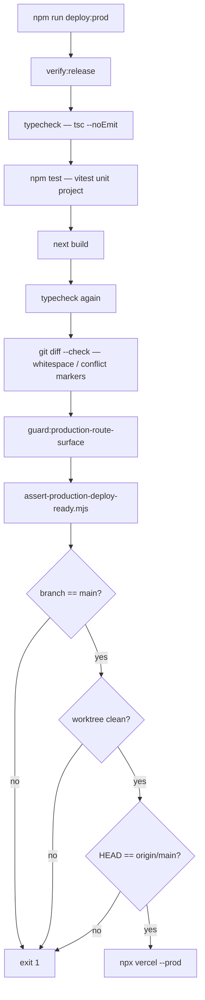
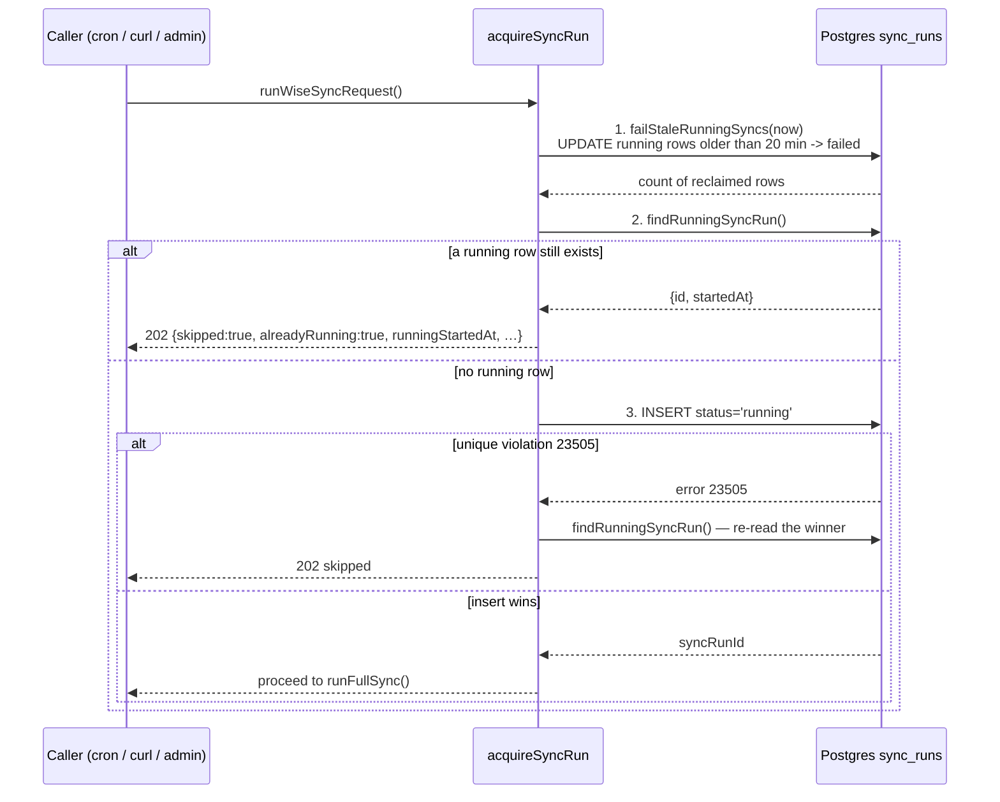
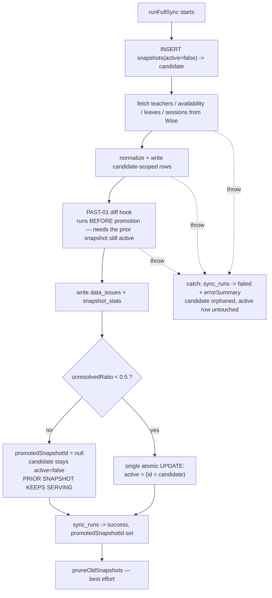
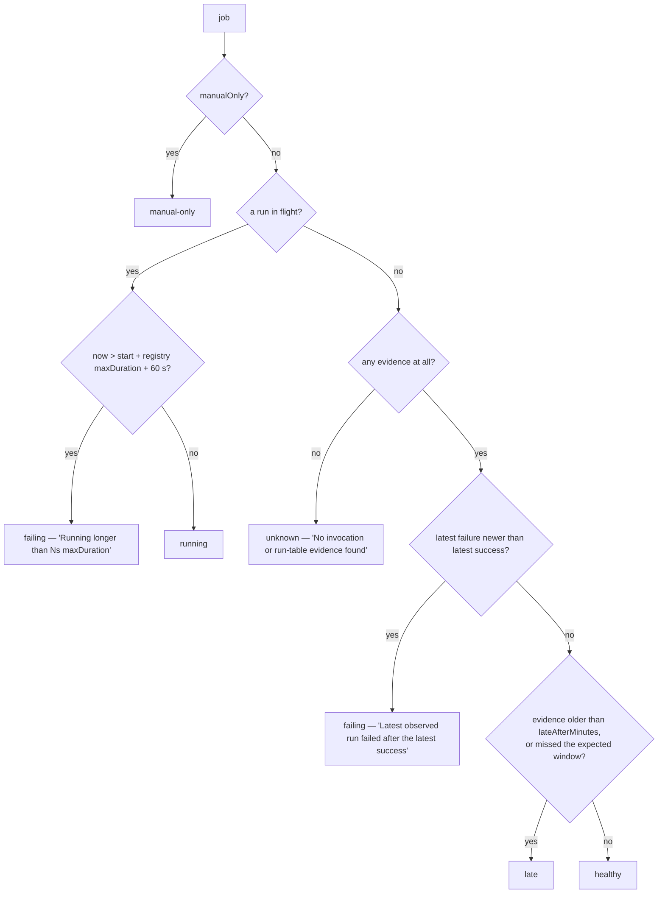
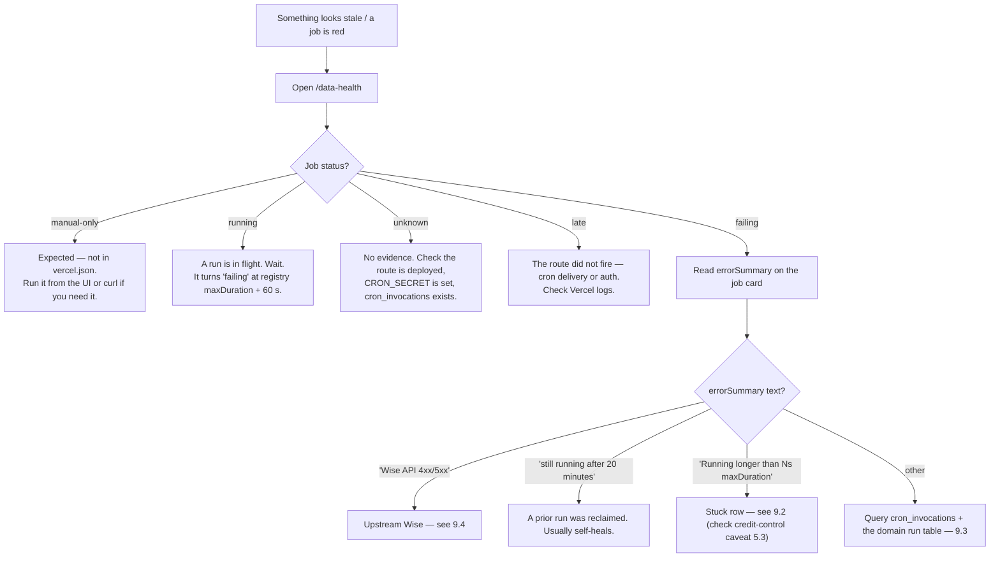

# Operations Runbook

Day-to-day procedures for running BGScheduler in production: shipping a deploy,
running the database and test scripts, triggering every scheduled job by hand,
and recovering when a sync stalls or fails. Open this page when data looks
stale, a job is red on `/data-health`, or you need to run a one-off command
against the production database.

> **Scope.** This runbook owns the *how-to*. The *what it means* lives
> elsewhere: job semantics and the fail-closed data rules in
> [`features/data-health.md`](../features/data-health.md); the mechanical cron
> registry in [`reference/crons.md`](../reference/crons.md); environment
> variables in [`reference/env.md`](../reference/env.md); endpoint signatures in
> [`reference/api/index.md`](../reference/api/index.md); table and column detail
> in [`reference/database/index.md`](../reference/database/index.md).

---

## 1. Quick reference

| What | Value / command |
| --- | --- |
| Production URL | `https://bgscheduler.vercel.app` |
| Guarded production deploy | `npm run deploy:prod` (`package.json:35`) |
| Release verification chain | `npm run verify:release` (`package.json:34`) |
| Unit tests | `npm test` (`package.json:11`) |
| Generate a migration | `npm run db:generate` (`package.json:16`) |
| Apply migrations | `DATABASE_URL=… npm run db:migrate` (`package.json:17`) |
| Seed aliases + admins | `DATABASE_URL=… SEED_ADMIN_EMAILS=… npm run db:seed` (`package.json:18`) |
| Cron auth header | `Authorization: Bearer $CRON_SECRET` (`src/lib/internal/cron-auth.ts:13`) |
| Wise sync function timeout | `maxDuration = 800` s (`src/app/api/internal/sync-wise/route.ts:7`) |
| Abandoned-run cutoff (Wise) | 20 minutes (`src/lib/sync/run-wise-sync.ts:10`) |
| Snapshot retention | 30 newest + the active one (`src/lib/sync/snapshot-pruning.ts:5`, `:64`–`:70`) |
| Scheduled crons | 15 (`vercel.json:2`–`vercel.json:63`) |
| Registered jobs (incl. manual-only) | 21 (`src/lib/data-health/cron-registry.ts:46`–`:373`) |
| Committed migrations | 66 `.sql` files in `drizzle/`, `0000_*` … `0065_line_group_settings_skip_confirm.sql` |
| Operator dashboard | `/data-health` (`src/app/(app)/data-health/page.tsx`) |

---

## 2. Deploy

There is almost no build configuration to reason about: `next.config.ts` sets
only `cacheComponents: true` (`next.config.ts:3`–`:5`), and `vercel.json`
declares nothing but the cron list (`vercel.json:2`–`:63`). `.vercelignore`
keeps `.claude`, `.planning`, `.superpowers`, `coverage`, and `*.xlsx` out of
the upload.

### 2.1 The guarded path

```bash
npm run deploy:prod
```

One script, three gates before anything reaches Vercel (`package.json:34`–`:35`):


```mermaid
flowchart TD
  A["npm run deploy:prod"] --> B["verify:release"]
  B --> B1["typecheck — tsc --noEmit"]
  B1 --> B2["npm test — vitest unit project"]
  B2 --> B3["next build"]
  B3 --> B4["typecheck again"]
  B4 --> B5["git diff --check — whitespace / conflict markers"]
  B5 --> B6["guard:production-route-surface"]
  B6 --> C["assert-production-deploy-ready.mjs"]
  C --> C1{"branch == main?"}
  C1 -- no --> X["exit 1"]
  C1 -- yes --> C2{"worktree clean?"}
  C2 -- no --> X
  C2 -- yes --> C3{"HEAD == origin/main?"}
  C3 -- no --> X
  C3 -- yes --> D["npx vercel --prod"]
```

**`verify:release`** (`package.json:34`) is
`typecheck → test → build → typecheck → git diff --check → guard:production-route-surface`.
The second `typecheck` is deliberate — `next build` rewrites
`tsconfig.tsbuildinfo`, and re-running catches a build that mutated type state.

**`guard:production-route-surface`** (`package.json:33`) walks every `page.tsx`
and `route.ts` under `src/app` (`scripts/check-production-route-surface.mjs:9`–`:45`)
and compares the result with the committed manifest at
`docs/reference/production-route-surface.json` (`:7`). It throws if the route
count drops below `minSourceRouteCount`, or if any manifest route or any of the
seven `criticalRoutes` disappeared (`:81`–`:112`). For an *intentional* route
removal, refresh the manifest in the same change:

```bash
node scripts/check-production-route-surface.mjs --update
```

**`assert-production-deploy-ready.mjs`** refuses to deploy from a branch other
than `main` (override via `PRODUCTION_BRANCH`,
`scripts/assert-production-deploy-ready.mjs:5`), from a dirty worktree (`:22`–`:33`),
or when `HEAD` does not equal `origin/main` (`:35`–`:41`). It never fetches, so
run `git fetch` yourself first — otherwise the `origin/main` ref it compares
against is whatever your last fetch left behind.

### 2.2 Deploying by pushing

Vercel's Git integration builds `main`, so the normal path is:

```bash
git push origin <branch>:main
```

This skips every local gate in §2.1. If you push directly, run
`npm run verify:release` beforehand.

### 2.3 Worktree caveat for `vercel --prod`

`npx vercel --prod` deploys the project linked in `.vercel/` **in the current
directory**. This repo checkout has no `.vercel/` directory, so a bare
`npx vercel --prod` here would prompt to link — and non-interactively it can
create a *new* Vercel project instead of deploying the existing one. Only run
`deploy:prod` from the worktree actually linked to the `bgscheduler` project.

### 2.4 Migrations are not part of the deploy

Nothing in `deploy:prod` (`package.json:35`) or the Vercel build runs
`drizzle-kit migrate`. A deploy that expects a new table will fail at runtime
until you apply migrations yourself (§3.2). **Migrate first, then deploy.**

Two tables degrade *silently* rather than loudly when their migration is
missing, which makes this easy to miss:

- `cron_invocations` — `fetchCronInvocations` catches the missing-relation error,
  logs, and returns `[]`, so every job quietly falls back to run-table inference
  (`src/lib/data-health/dashboard.ts:831`–`:838`).
- `cron_alert_state` — the watchdog disables alerting entirely with
  `skippedReason: "cron_alert_state table unavailable"` rather than spamming
  un-deduped alerts (`src/lib/internal/cron-watchdog.ts:376`–`:388`).

---

## 3. npm scripts

`package.json:5`–`:35` is the full list. The operationally relevant subset:

### 3.1 Tests

| Script | Command | Notes |
| --- | --- | --- |
| `npm test` | `vitest run --project unit` (`package.json:11`) | node env, `src/**/*.test.ts(x)`, excludes `*.integration.test.ts` (`vitest.config.ts:26`–`:35`) |
| `npm run test:watch` | `vitest --project unit` (`package.json:12`) | same project, watch mode |
| `npm run test:integration` | `vitest run --project integration` (`package.json:13`) | `*.integration.test.ts`, forks pool, `fileParallelism: false`, `maxWorkers: 1`, 60 s test/hook timeouts (`vitest.config.ts:36`–`:50`). **Needs Docker** — these suites boot ephemeral Postgres via `testcontainers`. |
| `npm run test:all` | `vitest run` (`package.json:14`) | both projects |
| `npm run test:coverage` | `vitest run --project unit --coverage` (`package.json:15`) | v8 provider, `text` + `html` reporters (`vitest.config.ts:13`–`:24`) |

`vitest.config.ts:4` pins `process.env.TZ = "Asia/Bangkok"` for every run, so
local and CI agree on midnight boundaries. Do not override `TZ`.

`npm run typecheck` (`package.json:10`) and `npm run lint` (`:9`) round out the
quality gates.

### 3.2 Database

All three Drizzle commands read `DATABASE_URL` from the environment — schema
`./src/lib/db/schema.ts`, output `./drizzle`, dialect `postgresql`
(`drizzle.config.ts:4`–`:9`). There is no environment selector: always prefix
the command with the connection string you intend to hit.

```bash
# 1. Author a migration (touches no database)
npm run db:generate

# 2. Apply pending migrations to a target database
DATABASE_URL='postgres://…' npm run db:migrate

# 3. Seed aliases + admin allowlist (idempotent)
DATABASE_URL='postgres://…' SEED_ADMIN_EMAILS='a@x.com,b@x.com' npm run db:seed
```

- **`db:generate`** diffs `schema.ts` against the committed history in `drizzle/`
  and writes a new `.sql` plus a `meta/` snapshot. Read the emitted SQL before
  committing — drizzle-kit will happily produce a large catch-up migration when
  the local `meta/` snapshot has drifted.
- **`db:migrate`** applies pending files in order. There are currently 65,
  `0000_*` through `0065_line_group_settings_skip_confirm.sql`.
- **`db:seed`** (`src/lib/db/seed.ts`) throws immediately if `DATABASE_URL` is
  unset (`:6`–`:9`). It upserts four tutor aliases with `onConflictDoNothing`
  (`:14`–`:28`), inserts every address in `SEED_ADMIN_EMAILS` into `admin_users`
  — also `onConflictDoNothing`, so it can **add** an admin but never remove one
  (`:31`–`:43`) — and upserts a hard-coded page-restricted user scoped to
  `/progress-tests` (`:47`–`:60`). With no `SEED_ADMIN_EMAILS` it logs and skips
  the admin step (`:41`–`:43`).

### 3.3 Guards and one-off maintenance scripts

`package.json:19`–`:33` registers `tsx` scripts for payout-workbook tooling,
credit-control ownership seeding, tutor-profile seeding, room-capacity model
import, room-utilization sync, AI-scheduler evaluation, LINE test-data
cleanup, and a read-only LINE user ID harvest (`npm run line:find-user-ids`,
`scripts/find-line-user-ids.ts` — prints inbound LINE DMs matching a code word
plus a paste-ready, de-duplicated `lineUserId` list), plus the two release
guards (`guard:sales-dashboard-scope`, `guard:production-route-surface`). None
are part of routine operation — read the file under `scripts/` before pointing
any of them at production.

---

## 4. Environment variables

`src/lib/env.ts:3`–`:24` validates `process.env` with Zod **at module load**. On
failure it logs `parsed.error.flatten().fieldErrors` and throws
`Invalid environment variables` (`:30`–`:33`), which crashes the importing
function — a missing variable is a hard boot failure, not a degraded mode.

Required: `DATABASE_URL` (must parse as a URL), `AUTH_GOOGLE_ID`,
`AUTH_GOOGLE_SECRET`, `AUTH_SECRET`, `WISE_USER_ID`, `WISE_API_KEY`,
`CRON_SECRET`. Defaulted: `WISE_NAMESPACE` → `begifted-education`,
`WISE_INSTITUTE_ID` → `696e1f4d90102225641cc413` (`:10`–`:11`). Optional:
`LINE_CHANNEL_SECRET`, `LINE_CHANNEL_ACCESS_TOKEN`, `ENABLE_LINE_SCHEDULER`,
`LINE_SCHEDULE_BOT_ADMIN_IDS`, `STUDENT_SCHEDULE_LINK_TTL_DAYS`, `APP_BASE_URL`
(`:13`–`:23`).

Many features read `process.env` directly rather than through this schema (leave
requests, schedule email, AI scheduler); those degrade the feature instead of
crashing the app. Full inventory in [`reference/env.md`](../reference/env.md).

`CRON_SECRET` is the highest-leverage operational secret — see §5.

### 4.1 Onboarding a new schedule-bot admin operator

Access to the `/schedule` bot is gated solely by `LINE_SCHEDULE_BOT_ADMIN_IDS`
(above) — there is no self-service enrolment, and a non-technical operator
cannot look up their own LINE user id. This is the recipe:

1. The operator adds the BeGifted LINE Official Account as a friend.
2. The operator DMs the OA one message containing the code word `BGSCHED` plus
   their name (e.g. `BGSCHED Kittiya`). Ingest writes the `line_contacts` row
   (`upsertLineContact`, `src/lib/line/data.ts:498`), then the normal non-admin
   fall-through fetches and stores their display name
   (`src/lib/line/review-service.ts:150`-`151`). The bot stays silent — that is
   the fail-closed gate working, not a failure.
3. Run `npm run line:find-user-ids` (§3.3) to print matching DMs and a
   ready-to-paste, de-duplicated `lineUserId` list. Narrow the search with
   `--match=<code>` / `--since=<days>`.
4. Append the id(s) to `LINE_SCHEDULE_BOT_ADMIN_IDS` in the production Vercel
   environment and redeploy — env vars are baked in at build time, so a
   redeploy is required before the new operator is recognised.
5. The operator verifies by DMing `/schedule help` and getting the admin help
   menu back. Silence means the id did not land.

Group chats additionally need `/schedule setup staff` (or `setup family`) once
per chat.

A trusted group chat can opt out of the per-student `YES` confirmations with
`/schedule setup instant` (GRP-BOT-07) — after that, every `/schedule` command
in that chat posts immediately, `send` verb included. The switch is per-group,
so once any allowlisted admin flips it, every admin's commands in that chat post
instantly. `/schedule setup confirm` restores the default at any time; neither
direction needs a deploy. The toggle refuses until the chat has declared its
audience.

**Reading schedule-bot latency.** Both routers emit one completion line per
handled command — filter Vercel logs for `[schedule-bot]`; the group path looks
like `chat=… sender=… outcome=sent elapsed_ms=NNN`, the DM path carries
`scope=dm`. `elapsed_ms` is the user-perceived duration from webhook handoff to
the terminal action. Two related knobs: all serverless functions are pinned to
`sin1` next to Neon (`vercel.json` `"regions"`; rollback = revert that key and
redeploy), and the bot fetches schedules with `liveSweep: "rescue"`, so a live
Wise sweep only runs when the snapshot month is empty — a
`fetchLiveMonthSessions: live sweep failed` line on the bot path therefore
implies an empty-month rescue attempt, not the normal case.

### 4.2 Taking the site offline (maintenance mode)

`MAINTENANCE_MODE` blocks the staff UI while **every cron keeps running**, so
there is no data gap to backfill on resume. Vercel's Pause Project cannot serve
this purpose: pausing blocks the production deployment, and all 15 crons target
that same deployment.

The gate lives in `src/middleware.ts`, above `isPublicRoute`, and is implemented
in `src/lib/maintenance.ts` (`MAINT-01`–`MAINT-05`).

| Surface | While on |
| --- | --- |
| The 25 `(app)` pages and their APIs | `503` |
| `/api/internal/*` — all 15 crons | runs normally |
| `/schedule/{token}` — parent links | renders normally |
| `/login`, `/api/auth/*` | reachable, so a bypass admin can sign in |
| An email in `MAINTENANCE_BYPASS_EMAILS` | full access |
| `/api/line/webhook` | `503` — see the caveat below |

**Turning it on:**

1. Set `MAINTENANCE_MODE=true` and `MAINTENANCE_BYPASS_EMAILS=<your email>` in
   the production Vercel environment.
2. Redeploy. Env vars are baked in at build time, so nothing takes effect until
   you do — the same constraint as §4.1. Using the existing build cache is fine.

**Turning it off:** set `MAINTENANCE_MODE=false` (or delete it) and redeploy.
Nothing else to undo — no stranded `running` rows, no backfill, because the
syncs never stopped.

**Verifying.** Expect `503`, `200`, `503` from:

```bash
curl -s -o /dev/null -w "%{http_code} %{url_effective}\n" \
  https://bgscheduler.vercel.app/search \
  https://bgscheduler.vercel.app/schedule/x \
  https://bgscheduler.vercel.app/api/line/webhook
```

Then confirm the crons are unaffected — this is the check that matters:

```sql
SELECT job_key, outcome, response_status, received_at
FROM cron_invocations
WHERE received_at > now() - interval '40 minutes'
ORDER BY received_at DESC LIMIT 15;
```

Every row should read `outcome = 'succeeded'` with `received_at` after the
redeploy. A `503` in `response_status` means an exempt prefix is wrong — turn
the flag off immediately and fix `MAINTENANCE_EXEMPT_PREFIXES`.

**⚠ The LINE caveat.** `/api/line/webhook` is deliberately **not** exempt. LINE
does not redeliver webhooks by default, so inbound OA messages arriving during a
maintenance window are **lost, not queued** — no thread, no contact row, no
scheduler review. After turning maintenance off:

- Read the LINE OA app manually for the window; nothing replays.
- Check the LINE Developers console — a run of failed deliveries can leave the
  endpoint flagged and needing a re-verify.

To trade that away, add `"/api/line/webhook"` to `MAINTENANCE_EXEMPT_PREFIXES`
(`src/lib/maintenance.ts`). It is a one-line change.

**Polarity.** The flag is opt-in: only the exact string `"true"` engages it.
Unset, empty, `"TRUE"`, or a typo all leave the site serving. This is the
inverse of `ENABLE_STUDENT_SCHEDULE_LIVE` on purpose — that flag defaults on and
opts out; this one defaults off and opts in, because a bad env value must never
black out production. `MAINTENANCE_BYPASS_EMAILS` runs the other way and is
fail-closed: unset means nobody bypasses.

---

## 5. Cron authentication and manual triggering

### 5.1 How the auth check works

Every internal route authenticates by comparing the **whole** `Authorization`
header against `Bearer ${CRON_SECRET}` in constant time. The shared helper is
`getCronSecretStatus` (`src/lib/internal/cron-auth.ts:6`–`:17`):

```ts
const received = Buffer.from(authHeader);
const known = Buffer.from(`Bearer ${cronSecret}`);
const valid = received.length === known.length && timingSafeEqual(received, known);
```

The length pre-check exists because `crypto.timingSafeEqual` throws a
`RangeError` on length-mismatched buffers; it is O(1) and does not leak the
secret's length by timing — the `REL-07` note at
`src/app/api/internal/sync-wise/route.ts:12`–`:15`.

Three outcomes, and the distinction matters during triage:

| Status | Response | Meaning |
| --- | --- | --- |
| `valid` | job runs | header matched |
| `invalid` | `401 {"error":"Unauthorized"}` | wrong or missing header |
| `missing-secret` | `500 {"error":"Server misconfigured"}` | `CRON_SECRET` unset **on the server** |

`rejectInvalidCronSecret` wraps that into "rejection response or `null`"
(`src/lib/internal/cron-auth.ts:19`–`:26`). A blanket `500 Server misconfigured`
from a cron path therefore means the environment variable is gone, not that the
job crashed.

Five routes predate the shared helper and inline the identical check:
`sync-wise` (`src/app/api/internal/sync-wise/route.ts:11`–`:29`),
`sync-credit-control` (`:18`–`:31`), `sync-sales-dashboard` (`:15`–`:22`),
`sync-competitor-intelligence` (`:11`–`:18`), `sync-room-utilization` (`:12`–`:24`),
and `student-promotions/july-1` (`:10`–`:17`).

### 5.2 Admin-session fallback

Some routes also accept a signed-in Auth.js session on `POST`, so an admin can
trigger them from the browser. `sync-wise` does this via
`handleSync(request, { allowSessionAuth: true })`
(`src/app/api/internal/sync-wise/route.ts:45`–`:59`, `:74`–`:76`); the invocation
is then audited with `triggerSource: "admin"` and the actor's email. Same
pattern in `sync-credit-control` (`:43`–`:56`), `sync-progress-tests` (`:19`–`:32`),
`sync-sales-dashboard` (`:28`–`:42`), `sync-competitor-intelligence` (`:24`–`:37`,
via `requireCompetitorIntelligenceSession`), and `sync-room-utilization`
(`:30`–`:40`). Everything else is cron-secret-only.

### 5.3 The scheduled crons

All 15 entries in `vercel.json` fire an HTTP **GET** carrying the bearer header.
Schedules are UTC; Bangkok is UTC+7. A unit test asserts `vercel.json` and the
registry's `SCHEDULED_CRON_JOBS` are the same list
(`src/lib/data-health/__tests__/cron-registry.test.ts:6`–`:20`).

| Path | Schedule (UTC) | Bangkok | Registry key | Route `maxDuration` | Methods |
| --- | --- | --- | --- | --- | --- |
| `/api/internal/sync-wise` | `*/30 * * * *` | :00 / :30 | `wise_snapshot` | 800 s | GET, POST¹ |
| `/api/internal/sync-wise-activity` | `5,35 * * * *` | :05 / :35 | `wise_activity` | 800 s | GET |
| `/api/internal/cron-watchdog` | `7,37 * * * *` | :07 / :37 | `cron_watchdog` | 300 s | GET, POST |
| `/api/internal/sync-sales-dashboard` | `10,40 * * * *` | :10 / :40 | `sales_dashboard` | 800 s | GET, POST¹ |
| `/api/internal/sync-post-class-feedback` | `13,43 * * * *` | :13 / :43 | `post_class_feedback` | 800 s | GET |
| `/api/internal/sync-leave-requests` | `15,45 * * * *` | :15 / :45 | `leave_requests` | 800 s | GET, POST |
| `/api/internal/sync-credit-control` | `20,50 * * * *` | :20 / :50 | `credit_control` | 800 s² | GET, POST¹ |
| `/api/internal/post-class-feedback-backfill` | `23,53 * * * *` | :23 / :53 | `post_class_feedback_backfill` | 800 s | GET |
| `/api/internal/sync-progress-tests` | `25,55 * * * *` | :25 / :55 | `progress_tests` | 300 s | GET, POST¹ |
| `/api/internal/progress-tests/admin-digest` | `35 0 * * *` | daily 07:35 | `progress_tests_digest` | 300 s | GET |
| `/api/internal/admissions-notifications` | `12 1 * * *` | daily 08:12 | `admissions_notifications` | 300 s | GET, POST |
| `/api/internal/class-assignments/morning` | `45 23 * * *` | daily 06:45 | `classroom_morning` | 800 s | GET |
| `/api/internal/class-assignments/admin-email` | `0,10,20,30 0 * * *` | daily 07:00–07:30 | `classroom_admin_email` | 300 s | GET |
| `/api/internal/sync-competitor-intelligence` | `25 18 * * 0` | Mon 01:25 | `competitor_intelligence` | 800 s | GET, POST¹ |
| `/api/internal/student-promotions/july-1` | `5 17 30 6 *` | 2026-07-01 00:05 | `student_promotions_july_1` | 800 s | GET, POST |

¹ `POST` additionally accepts an Auth.js admin session (§5.2).
² The route sets `maxDuration = 800` with an explicit comment that 300 s was
permanently under its own runtime (`src/app/api/internal/sync-credit-control/route.ts:7`–`:14`),
while the registry still records `maxDurationSeconds: 300`
(`src/lib/data-health/cron-registry.ts:118`). Data Health's "stuck" test uses the
**registry** value (`src/lib/data-health/status.ts:239`), so a credit-control run
between ~300 s and 800 s is reported as `failing` while it is still legitimately
executing. Treat that specific verdict with suspicion — check `credit_control_sync_runs`.

Minutes are deliberately staggered — 0/30, 5/35, 7/37, 10/40, 13/43, 15/45,
20/50, 23/53, 25/55 — so no two 30-minute jobs hit the Wise API or Neon in the
same minute; a test asserts the daily admissions cron avoids every used minute
(`src/__tests__/vercel-crons.test.ts:29`–`:40`).

### 5.4 Manual-only registry jobs

Six registered jobs are deliberately absent from `vercel.json`
(`manualOnly: true`). `/data-health` reports them as `manual-only` and never as
late (`src/lib/data-health/status.ts:199`–`:215`).

| Path | Registry key | Method | `dangerous` | Why parked |
| --- | --- | --- | --- | --- |
| `/api/internal/post-class-feedback/admin-digest` | `post_class_feedback_digest` | GET | yes | emails the admin digest (`cron-registry.ts:188`–`:202`) |
| `/api/internal/post-class-feedback/reminder-day-after` | `post_class_feedback_day_after` | GET | yes | may email tutors with incomplete feedback (`:203`–`:217`) |
| `/api/internal/post-class-feedback/reminder-deadline` | `post_class_feedback_deadline` | GET | yes | may email tutors whose feedback is due tonight (`:218`–`:232`) |
| `/api/internal/post-class-feedback/payout-accrual` | `post_class_feedback_payout_accrual` | GET | yes | appends real deductions to the master payout ledger (`:233`–`:247`) |
| `/api/internal/sync-room-utilization` | `room_utilization` | **POST only** | no | manual utilization refresh (`:343`–`:357`) |
| `/api/internal/line-backlog-recovery` | `line_backlog_recovery` | GET | no | one-shot LINE contact backlog recovery (`:358`–`:372`) |

### 5.5 Triggering by hand with curl

**Method matters.** Most internal routes export only `GET`; `curl -X POST`
against a GET-only route returns `405`, not a run. `sync-room-utilization` is the
inverse — POST only.

```bash
export CRON_SECRET='…'
export BASE='https://bgscheduler.vercel.app'

# Wise snapshot ETL — GET or POST
curl -s -X POST "$BASE/api/internal/sync-wise" \
  -H "Authorization: Bearer $CRON_SECRET"

# GET-only routes
curl -s "$BASE/api/internal/sync-wise-activity"          -H "Authorization: Bearer $CRON_SECRET"
curl -s "$BASE/api/internal/sync-post-class-feedback"    -H "Authorization: Bearer $CRON_SECRET"
curl -s "$BASE/api/internal/class-assignments/morning"   -H "Authorization: Bearer $CRON_SECRET"
curl -s "$BASE/api/internal/class-assignments/admin-email" -H "Authorization: Bearer $CRON_SECRET"
curl -s "$BASE/api/internal/progress-tests/admin-digest" -H "Authorization: Bearer $CRON_SECRET"
curl -s "$BASE/api/internal/line-backlog-recovery"       -H "Authorization: Bearer $CRON_SECRET"

# GET or POST
curl -s "$BASE/api/internal/sync-leave-requests"         -H "Authorization: Bearer $CRON_SECRET"
curl -s "$BASE/api/internal/sync-credit-control"         -H "Authorization: Bearer $CRON_SECRET"
curl -s "$BASE/api/internal/sync-progress-tests"         -H "Authorization: Bearer $CRON_SECRET"
curl -s "$BASE/api/internal/sync-sales-dashboard"        -H "Authorization: Bearer $CRON_SECRET"
curl -s "$BASE/api/internal/sync-competitor-intelligence" -H "Authorization: Bearer $CRON_SECRET"
curl -s "$BASE/api/internal/cron-watchdog"               -H "Authorization: Bearer $CRON_SECRET"

# POST-only route
curl -s -X POST "$BASE/api/internal/sync-room-utilization" \
  -H "Authorization: Bearer $CRON_SECRET"
```

Routes that take parameters:

```bash
# Admissions notifications — runType picks one orchestrator. Omit it for the
# cron default: the daily deadline scan, plus the weekly digest on Bangkok
# Sundays (src/app/api/internal/admissions-notifications/route.ts:56-61).
curl -s "$BASE/api/internal/admissions-notifications?runType=weekly" \
  -H "Authorization: Bearer $CRON_SECRET"

curl -s -X POST "$BASE/api/internal/admissions-notifications" \
  -H "Authorization: Bearer $CRON_SECRET" \
  -H 'content-type: application/json' \
  -d '{"runType":"daily"}'

# Post-class feedback backfill. With no parameters it picks the oldest
# unreconciled window itself and drains one 50-detail batch; explicit dates and
# higher caps are the manual recovery path (detailCap <= 400, maxBatches <= 50,
# startDate/endDate must be supplied together)
# — src/app/api/internal/post-class-feedback-backfill/route.ts:19-30, :51-69.
curl -s "$BASE/api/internal/post-class-feedback-backfill?startDate=2026-05-01&endDate=2026-05-07&detailCap=400&maxBatches=10" \
  -H "Authorization: Bearer $CRON_SECRET"
```

The July-1 promotion cron is date-gated: on any Bangkok date other than
`STUDENT_PROMOTION_TARGET_DATE` it returns `409` with
`"Student promotion cron is only allowed on July 1, 2026 Bangkok time"`
(`src/app/api/internal/student-promotions/july-1/route.ts:27`–`:31`). Its `POST`
simply delegates to `GET` (`:46`–`:48`).

### 5.6 Triggering from the UI

`/data-health` renders a **Run** control for every registry job — the payload
maps all 21 `CRON_JOBS` into `manualActions`
(`src/lib/data-health/dashboard.ts:975`). The control POSTs to
`/api/data-health/jobs/{jobKey}/run`, which:

1. requires an Auth.js session (`src/app/api/data-health/jobs/[jobKey]/run/route.ts:14`–`:17`);
2. rejects unknown keys with `404` (`:20`–`:23`);
3. requires the `access_manager` capability for any `post_class_feedback*` job (`:25`–`:30`);
4. refuses a `dangerous` job unless the body carries `confirmed: true`, returning
   `409 {"error":"Confirmation required","confirmationLabel":…}` (`:33`–`:41`).
   The UI shows a `window.confirm` with that label first
   (`src/components/data-health/data-health-dashboard.tsx:474`).

Dispatch is `runDataHealthJob` (`src/lib/data-health/run-job.ts:28`–`:198`) — the
same functions the cron routes call, wrapped in the invocation audit with
`triggerSource: "admin"`.

> **Gotcha.** `runDataHealthJob` implements 14 of the 21 registry keys. Seven
> have a Run button but fall through to `404 {"error":"Unknown job"}`
> (`src/lib/data-health/run-job.ts:195`): `progress_tests`,
> `progress_tests_digest`, `post_class_feedback_backfill`,
> `post_class_feedback_payout_accrual`, `student_promotions_july_1`,
> `admissions_notifications`, `line_backlog_recovery`. Use curl (§5.5) for those.

There is also a session-only trigger for the Wise sync alone:
`POST /api/admin/sync-wise` (`src/app/api/admin/sync-wise/route.ts:8`–`:23`),
audited as `wise_snapshot` / `admin`.

### 5.7 Response-status decoder

| Status | Meaning |
| --- | --- |
| `200` | job ran and reported success |
| `202` | **skipped** — the single-flight guard found a run already in progress (`src/lib/sync/run-wise-sync.ts:149`; also credit-control `:146`, progress-tests `:147`, admissions `route.ts:63`) |
| `400` | bad query/body (backfill dates, `runType`) |
| `401` | wrong/missing `Authorization` header, or no admin session |
| `403` | Data Health run without the `access_manager` capability |
| `404` | unknown job key, or a registry job `runDataHealthJob` does not implement |
| `405` | wrong HTTP method for that route |
| `409` | already-running conflict raised as an error (wise-activity, leave-requests, post-class, competitor), confirmation required, missing Google Sheets token (`sync-sales-dashboard/route.ts:64`), or the July-1 date gate |
| `500` | `CRON_SECRET` unset on the server, or the job threw |
| `503` | post-class reminder checkpoint still has unreconciled Wise sessions (`src/lib/data-health/run-job.ts:130`–`:136`) |

---

## 6. The single-flight guard and abandoned-run recovery

### 6.1 Why it exists

Vercel will start a second invocation of a 30-minute cron while the first is
still working, and an operator hitting the curl endpoint mid-run does the same.
Two concurrent Wise syncs would double the Wise API load and race on snapshot
promotion. The guard turns the second caller into a no-op.

### 6.2 How it works for the Wise snapshot sync

The primitive is a **partial unique index** on `sync_runs`:

```sql
CREATE UNIQUE INDEX IF NOT EXISTS "sync_runs_single_running_idx"
ON "sync_runs" ("status")
WHERE "status" = 'running';
```

(`drizzle/0013_sync_run_single_flight.sql:33`–`:35`, mirrored in
`src/lib/db/schema.ts:473`–`:475`.) At most one `sync_runs` row can be `running`
at a time; a second insert raises Postgres `23505`, which
`isUniqueViolation` detects (`src/lib/sync/run-wise-sync.ts:42`–`:49`).

`acquireSyncRun` (`src/lib/sync/run-wise-sync.ts:88`–`:118`) runs three steps:


```mermaid
sequenceDiagram
  participant C as Caller (cron / curl / admin)
  participant G as acquireSyncRun
  participant DB as Postgres sync_runs
  C->>G: runWiseSyncRequest()
  G->>DB: 1. failStaleRunningSyncs(now)<br/>UPDATE running rows older than 20 min -> failed
  DB-->>G: count of reclaimed rows
  G->>DB: 2. findRunningSyncRun()
  alt a running row still exists
    DB-->>G: {id, startedAt}
    G-->>C: 202 {skipped:true, alreadyRunning:true, runningStartedAt, …}
  else no running row
    G->>DB: 3. INSERT status='running'
    alt unique violation 23505
      DB-->>G: error 23505
      G->>DB: findRunningSyncRun() — re-read the winner
      G-->>C: 202 skipped
    else insert wins
      DB-->>G: syncRunId
      G-->>C: proceed to runFullSync()
    end
  end
```

The unique-violation branch is what makes the guard race-safe: read-then-insert
is not atomic, so two callers can both clear step 2, and the loser is caught by
the index and converted into the same `202 skipped` response (`:106`–`:117`). If
the violation fires but no running row can be found afterwards, the error is
re-thrown rather than swallowed (`:111`–`:113`).

The skipped payload is a **success-shaped** `202` carrying `skipped: true`,
`alreadyRunning: true`, the in-flight `syncRunId`, `runningStartedAt`, and
`staleRunningSyncsFailed` (`:120`–`:140`, `:149`). The audit layer classifies it
as `outcome: "skipped"`, not a failure
(`src/lib/data-health/cron-audit.ts:61`–`:70`), so a skipped run does not trip the
watchdog.

### 6.3 Abandoned-run recovery

A function killed at `maxDuration`, or an aborted request, leaves the `sync_runs`
row stuck at `running` forever — and because the index permits only one such row,
*every* subsequent sync would skip. The reclaim therefore runs first, on every
attempt (`src/lib/sync/run-wise-sync.ts:92`):

```ts
export const STALE_RUNNING_SYNC_MS = 20 * 60 * 1000;
```

(`src/lib/sync/run-wise-sync.ts:10`.) `failStaleRunningSyncs` (`:51`–`:72`) flips
any `running` row whose `startedAt` is older than 20 minutes to `failed`, sets
`finishedAt`, and writes the fixed error string:

> "Sync marked failed because it was still running after 20 minutes; likely timed
> out or the request was aborted." (`:39`–`:40`)

The number of reclaimed rows is echoed back as `staleRunningSyncsFailed` in the
response body (`:155`–`:158`), so a curl trigger tells you whether it just cleaned
up after a crash.

**Self-healing window.** The route allows 800 s but the reclaim cutoff is 1200 s,
so a genuinely timed-out sync is reclaimed automatically by a later cron tick
roughly 20 minutes after it started. You rarely need to intervene; when you do,
see §9.2.

Migration `0013` performed the same cleanup once at deploy time — failing every
stale row, then failing all but the newest duplicate `running` row — before
creating the index (`drizzle/0013_sync_run_single_flight.sql:1`–`:31`).

### 6.4 Guard coverage across the other syncs

Every domain replicates the `*_sync_runs` + partial-unique-index discipline
(`src/lib/db/schema.ts:473`, `:567`, `:666`, `:758`, `:864`, `:1177`, `:1773`,
`:2107`, `:2677`, `:2992`, `:3243`, `:4560`), but the *recovery* behaviour
differs. This is the single most useful table for incident triage:

| Domain | Run table | Stale reclaim | Skip signal |
| --- | --- | --- | --- |
| Wise snapshot | `sync_runs` | 20 min (`src/lib/sync/run-wise-sync.ts:10`) | `202` skipped payload (`:149`) |
| Credit control | `credit_control_sync_runs` | 20 min (`src/lib/credit-control/run-sync-request.ts:9`) | `202` skipped payload (`:145`–`:147`) |
| Progress tests | `progress_test_sync_runs` | 20 min (`src/lib/progress-tests/config.ts:27`) | `202` skipped payload (`run-sync-request.ts:146`–`:148`) |
| Wise activity | `wise_activity_sync_runs` | 20 min (`src/lib/wise-activity/sync.ts:13`, `:136`–`:140`) | throws `WiseActivitySyncAlreadyRunningError` (`:182`) → `409` |
| Post-class feedback | `post_class_sync_runs` | 20 min (`src/lib/post-class-feedback/repository.ts:262`, `:751`–`:757`) | throws `PostClassFeedbackSyncAlreadyRunningError` (`:786`, `:792`) → `409` |
| Competitor intelligence | `competitor_sync_runs` | 20 min (`src/lib/competitor-intelligence/sync.ts:40`–`:42`) | message contains "already running" → `409` (`route.ts:59`) |
| Sales dashboard | `sales_dashboard_import_runs`, `…_projection_import_runs` | 20 min per source (`src/lib/sales-dashboard/import-guard.ts:6`–`:9`) | per-source guard |
| Cron watchdog | `cron_alert_state` sentinel row | 6 min (`src/lib/internal/cron-watchdog.ts:50`) | `skippedReason: "another sweep is in flight"` (`:391`–`:401`) |
| **Leave requests** | `leave_request_sync_runs` | **none** | throws `LeaveRequestSyncAlreadyRunningError` (`src/lib/leave-requests/sync.ts:385`) → `409` |

**The leave-requests gap is real.** `syncLeaveRequests` inserts a run row that
defaults to `status = 'running'` and converts a unique-index violation into
`LeaveRequestSyncAlreadyRunningError` (`src/lib/leave-requests/sync.ts:372`–`:387`),
but nothing sweeps stale `running` rows in that table — no `STALE_*` constant
exists anywhere under `src/lib/leave-requests/`. A normal crash is still covered
because both terminal paths write a status, but a function killed at
`maxDuration` or a lost Neon connection strands the row, and every subsequent
leave-requests sync returns `409` until someone clears it by hand (§9.2).

The watchdog protects its own sweep with a sentinel `cron_alert_state` row
claimed by a conditional upsert whose `setWhere` fires only when the previous
holder released it or went stale (`src/lib/internal/cron-watchdog.ts:298`–`:323`).
It uses a row rather than a transaction or advisory lock because the neon-http
driver supports neither (`:41`–`:50`).

---

## 7. Snapshot lifecycle and rollback

### 7.1 What "rollback" means here

There is no rollback command, and none is needed: **a failed sync cannot damage
the live snapshot, because promotion is the last step.** `runFullSync` writes an
entire candidate snapshot with `active: false`
(`src/lib/sync/orchestrator.ts:71`–`:75`) and only flips it live after
validation. Any throw before that point leaves the previous `active = true` row
untouched.


```mermaid
flowchart TD
  A["runFullSync starts"] --> B["INSERT snapshots(active=false) -> candidate"]
  B --> C["fetch teachers / availability / leaves / sessions from Wise"]
  C --> D["normalize + write candidate-scoped rows"]
  D --> E["PAST-01 diff hook<br/>runs BEFORE promotion — needs the prior snapshot still active"]
  E --> F["write data_issues + snapshot_stats"]
  F --> G{"unresolvedRatio &lt; 0.5 ?"}
  G -- no --> H["promotedSnapshotId = null<br/>candidate stays active=false<br/>PRIOR SNAPSHOT KEEPS SERVING"]
  G -- yes --> I["single atomic UPDATE:<br/>active = (id = candidate)"]
  I --> J["sync_runs -> success, promotedSnapshotId set"]
  J --> K["pruneOldSnapshots — best effort"]
  H --> J
  C -.throw.-> X["catch: sync_runs -> failed + errorSummary<br/>candidate orphaned, active row untouched"]
  D -.throw.-> X
  E -.throw.-> X
```

### 7.2 The promotion gate

```ts
const unresolvedRatio = identityIssues.length / Math.max(groups.length, 1);
const shouldPromote = unresolvedRatio < 0.5;
```

(`src/lib/sync/orchestrator.ts:473`–`:476`.) If more than half the identity
groups failed to resolve, the candidate is written and stats recorded but the
snapshot is **not** promoted: `promotedSnapshotId` stays `null` while the sync
still reports `success: true` (`:478`–`:501`, `:550`–`:560`). That is deliberate
— the run worked; the data was judged untrustworthy. On `/data-health` it looks
like a successful sync whose active snapshot id did not change.

### 7.3 The atomic promotion

Promotion is one statement, carrying the `REL-01` design ID
(`src/lib/sync/orchestrator.ts:481`–`:498`):

```sql
UPDATE snapshots
SET active = (id = <candidate>)
WHERE active = true OR id = <candidate>;
```

Postgres MVCC plus the row locks held for one statement mean concurrent readers
see either the old active row or the new one — never a moment with zero rows
matching `active = true`. The bounded `WHERE` avoids rewriting the whole table on
every promote.

### 7.4 Failure path

The whole pipeline sits in one `try`/`catch` (`src/lib/sync/orchestrator.ts:60`,
`:561`). On throw:

1. `sync_runs` is set to `failed` with `finishedAt` and the error message
   (`:564`–`:572`).
2. If even *that* update fails, the cleanup error is logged to Vercel with the
   primary error inline so an operator can see why a row is stuck at `running` —
   the `REL-06` note at `:573`–`:585`. The cleanup error is swallowed so it
   cannot mask the real cause.
3. `runWiseSyncRequest` returns HTTP `500` because `result.success` is false
   (`src/lib/sync/run-wise-sync.ts:164`–`:166`), and `revalidateTag("snapshot")`
   is **not** called (`:160`–`:162`), so cached reads keep serving the last good
   snapshot.

The orphaned candidate rows stay in the database until pruning removes them.

### 7.5 Per-teacher error isolation

A single bad teacher does not fail the sync. Availability/leave fetch failures
are caught per teacher and recorded as `completeness` data issues
(`src/lib/sync/orchestrator.ts:249`–`:259`), as are missing Wise user ids
(`:162`–`:174`). Same for the PAST-01 diff hook, whose per-group errors become
data issues rather than aborting (`:400`–`:418`). Only a top-level failure —
Wise unreachable, database down — fails the run.

### 7.6 Pruning and the practical retention limit

After a successful promotion, `pruneOldSnapshots` keeps the 30 most recent
snapshots by `createdAt` **plus** any snapshot flagged active, then hard-deletes
the rest along with their child rows across twelve tables
(`src/lib/sync/snapshot-pruning.ts:5`, `:64`–`:74`, `:88`–`:179`). Pruning is
best-effort: a failure is logged and recorded in `sync_runs.metadata.pruning`
without failing the sync (`src/lib/sync/orchestrator.ts:520`–`:548`).

Practical consequence: **you can only "roll back" to a snapshot still inside the
retention window.** There is no supported re-promote command; doing it manually
means flipping `snapshots.active` yourself, after which the in-memory index
rebuilds from the new active snapshot on the next request (§7.7).

### 7.7 Getting fresh data in front of users

Two independent mechanisms:

- **Cache tags.** On success, `revalidateTag("snapshot", { expire: 0 })`
  (`src/lib/sync/run-wise-sync.ts:161`) invalidates the `"use cache"` entries
  tagged `snapshot` in `src/lib/data/tutors.ts:82` and `src/lib/data/filters.ts:54`.
- **In-memory index.** `ensureIndex` (`src/lib/search/index.ts:354`) compares the
  cached index's `snapshotId` and `profileVersion` against the database and
  rebuilds when either changed (`:366`–`:388`). Concurrent callers coalesce onto
  a single build promise assigned synchronously before the first `await`
  (REL-02, `:391`–`:399`), so a snapshot flip cannot cause a rebuild stampede.
  If **no** snapshot is active it returns the stale cached index rather than
  nothing (`:384`–`:386`).

If a sync promoted but the UI still looks old, suspect the in-memory index of
that particular serverless instance; a redeploy clears every instance.

---

## 8. Observability: where the evidence lives

### 8.1 `cron_invocations` — direct proof

Every audit-wrapped route writes a row *before* the handler runs and updates it
after. `withCronInvocationAudit` (`src/lib/data-health/cron-audit.ts:144`–`:159`)
inserts with `outcome: "running"` plus job key, path, schedule, trigger source,
actor email, and request method (`:84`–`:112`), then records `finishedAt`,
`durationMs`, `responseStatus`, the derived outcome, an extracted `errorSummary`,
and linked run ids (`:114`–`:142`). Table definition: `src/lib/db/schema.ts:479`–`:499`.

Outcome derivation (`:61`–`:70`), in order: body `skipped === true` or a message
containing "already running" → `skipped`; body `ok === false` or
`success === false` → `failed`; HTTP `202` → `skipped`; HTTP ≥ 400 → `failed`;
otherwise `success`. **A 200 with `success: false` in the body still counts as
failed** — exactly what an errored sync returns.

Audit writes are best-effort: a failure to record start or finish is logged with
`console.error` and never blocks the job (`:108`–`:111`, `:139`–`:141`).

One scheduled route is **not** audit-wrapped and produces no `cron_invocations`
rows at all: `/api/internal/student-promotions/july-1` — it does its own secret
check and calls the orchestrator directly
(`src/app/api/internal/student-promotions/july-1/route.ts:19`–`:44`). Data Health
compensates explicitly rather than guessing (§8.2).

### 8.2 Per-domain run tables — durable proof

`/data-health` reads the 8 most recent rows (`RECENT_LIMIT`,
`src/lib/data-health/dashboard.ts:17`) from each domain run table
(`:769`–`:786`): `sync_runs`, `wise_activity_sync_runs`,
`sales_dashboard_import_runs`, `sales_dashboard_projection_import_runs`,
`competitor_sync_runs`, `credit_control_sync_runs`, `leave_request_sync_runs`,
`progress_test_sync_runs`, `progress_test_admin_digest_runs`,
`post_class_sync_runs`, `post_class_notification_runs`,
`classroom_assignment_runs`, `classroom_admin_email_runs`, and the newest
`room_utilization_sessions` row.

`pickJobRuns` (`:142`) maps each registry key to exactly one of those tables. Two
deliberate exceptions:

- **`student_promotions_july_1` maps to no evidence at all** (`:274`–`:288`). Its
  route is not audit-wrapped and its run table mixes admin drafts with the cron
  apply, so the code fails closed to `unknown` — an alertable state — rather than
  reporting a dangerous write-path cron as healthy without it ever firing.
- **`cron_watchdog` maps to no run table** (`:306`–`:314`); its health comes only
  from its own `cron_invocations` rows.

Only `room_utilization` reaches the fallback branch, so stale utilization rows
can never stand in as another job's health proof (`:317`–`:319`).

`fetchCronInvocations` ranks the latest 8 invocations **per job key** with a
window function rather than taking a global limit (`:808`–`:830`), because a
global window let chatty 30-minute jobs push a daily job's only invocation out
within hours.

### 8.3 How a status is decided

`evaluateCronJobStatus` (`src/lib/data-health/status.ts:195`–`:363`) resolves in
strict order:


```mermaid
flowchart TD
  A["job"] --> B{"manualOnly?"}
  B -- yes --> M["manual-only"]
  B -- no --> C{"a run in flight?"}
  C -- yes --> D{"now &gt; start + registry maxDuration + 60 s?"}
  D -- yes --> F1["failing — 'Running longer than Ns maxDuration'"]
  D -- no --> R["running"]
  C -- no --> E{"any evidence at all?"}
  E -- no --> U["unknown — 'No invocation or run-table evidence found'"]
  E -- yes --> G{"latest failure newer than latest success?"}
  G -- yes --> F2["failing — 'Latest observed run failed after the latest success'"]
  G -- no --> H{"evidence older than lateAfterMinutes,<br/>or missed the expected window?"}
  H -- yes --> L["late"]
  H -- no --> OK["healthy"]
```

`STUCK_BUFFER_MS` is 60 s (`:6`) and the stuck test uses the **registry's**
`maxDurationSeconds` (`:238`–`:240`), not the route's `export const maxDuration` —
the source of the credit-control discrepancy in §5.3. `proof` is `"direct"` when
a `cron_invocations` row backs the verdict, `"inferred"` when only a run table
does (`:220`).

Expected windows are computed three ways: interval crons parse the minute field
(`:57`–`:92`), daily jobs use `expectedBangkokMinute` or the window bounds
(`:111`–`:135`), weekly jobs add `expectedBangkokWeekday` (`:137`–`:165`).

### 8.4 The watchdog

`/api/internal/cron-watchdog` sweeps every 30 minutes (`vercel.json:56`–`:57`) and
emails full-access admins when a job turns `failing`, `late`, or `unknown`
(`src/lib/internal/cron-watchdog.ts:52`, `:139`–`:141`). Key behaviours:

- **Episode dedup** — one email per job per failure episode, persisted in
  `cron_alert_state`. An episode opens on the first unhealthy sweep
  (`lastAlertOutcome = "alerted"`) and closes when a recovery notice goes out,
  which re-arms the next alert (`:152`–`:171`, `:466`–`:491`).
- **Recipients** are `admin_users` rows with `allowedPages IS NULL` —
  page-restricted users are excluded because they cannot open the `/data-health`
  link the alert points at (`:250`–`:262`).
- **Delivery-gated persistence** — episode state is written only after at least
  one recipient accepted the email, so a total delivery failure is retried next
  sweep (`:454`–`:457`). Partial delivery still closes the episode and the failed
  addresses are only logged (`:11`–`:17`, `:458`–`:464`).
- **Self-exclusion** — the watchdog never alerts about itself (`:39`, `:160`).
- **Fail-safe** — a missing `cron_alert_state` disables alerting entirely rather
  than spamming un-deduped alerts (`:376`–`:388`).
- **Synthetic payout entry** — a non-route "Payout Window Finalize" job rides the
  sweep so a payout window that never reached `published` is not silently missed
  (`:77`–`:116`); a failure evaluating it degrades to "no entry this sweep"
  (`:118`–`:136`).

### 8.5 Staleness thresholds

| Threshold | Value | Where |
| --- | --- | --- |
| API stale warning | 90 min | `src/lib/ops/stale.ts:2` |
| In-app stale banner | 2 h | `src/lib/ops/stale.ts:3` |

Both measure the age of the last **successful** `sync_runs.finishedAt`
(`src/lib/data-health/dashboard.ts:952`–`:954`). Staleness is a warning, never a
reason to withhold data.

---

## 9. When a sync fails

### 9.1 Triage order


```mermaid
flowchart TD
  A["Something looks stale / a job is red"] --> B["Open /data-health"]
  B --> C{"Job status?"}
  C -- "manual-only" --> M["Expected — not in vercel.json.<br/>Run it from the UI or curl if you need it."]
  C -- "running" --> R["A run is in flight. Wait.<br/>It turns 'failing' at registry maxDuration + 60 s."]
  C -- "unknown" --> U["No evidence. Check the route is deployed,<br/>CRON_SECRET is set, cron_invocations exists."]
  C -- "late" --> L["The route did not fire — cron delivery or auth.<br/>Check Vercel logs."]
  C -- "failing" --> F["Read errorSummary on the job card"]
  F --> F1{"errorSummary text?"}
  F1 -- "'Wise API 4xx/5xx'" --> W["Upstream Wise — see 9.4"]
  F1 -- "'still running after 20 minutes'" --> S["A prior run was reclaimed. Usually self-heals."]
  F1 -- "'Running longer than Ns maxDuration'" --> T["Stuck row — see 9.2 (check credit-control caveat 5.3)"]
  F1 -- other --> Q["Query cron_invocations + the domain run table — 9.3"]
```

### 9.2 Clearing a stuck `running` row

First confirm it is genuinely stuck rather than in flight. The Wise, credit
control, progress-test, wise-activity, post-class, competitor and sales guards
all reclaim automatically after 20 minutes (§6.4), so wait one cron tick before
intervening.

```sql
-- Wise snapshot: what is holding the lock?
SELECT id, status, started_at, now() - started_at AS age, error_summary
FROM sync_runs
WHERE status = 'running';

-- Manual reclaim (the sync itself does this after 20 minutes)
UPDATE sync_runs
SET status = 'failed',
    finished_at = now(),
    error_summary = COALESCE(error_summary, 'Manually reclaimed stuck running row')
WHERE status = 'running'
  AND started_at < now() - interval '20 minutes';
```

**Leave requests need manual intervention** — there is no automatic reclaim
(§6.4):

```sql
SELECT id, status, trigger_type, started_at, now() - started_at AS age
FROM leave_request_sync_runs
WHERE status = 'running';

UPDATE leave_request_sync_runs
SET status = 'failed',
    finished_at = now(),
    error_summary = 'Manually reclaimed stuck running row'
WHERE status = 'running'
  AND started_at < now() - interval '20 minutes';
```

The partial unique index means only one row per table can be `running`, so these
statements can never touch more than one row each.

### 9.3 Useful queries

```sql
-- Last 20 invocations across all jobs, newest first
SELECT job_key, trigger_source, actor_email, received_at, duration_ms,
       response_status, outcome, error_summary
FROM cron_invocations
ORDER BY received_at DESC
LIMIT 20;

-- Everything that failed or skipped in the last 24 hours
SELECT job_key, outcome, response_status, error_summary, received_at
FROM cron_invocations
WHERE outcome IN ('failed', 'skipped')
  AND received_at > now() - interval '24 hours'
ORDER BY received_at DESC;

-- Wise sync history, including what each run promoted
SELECT id, status, started_at, finished_at, teacher_count,
       snapshot_id, promoted_snapshot_id, error_summary
FROM sync_runs
ORDER BY started_at DESC
LIMIT 10;

-- Current active snapshot + its stats
SELECT s.id, s.created_at, st.total_wise_teachers, st.total_identity_groups,
       st.resolved_groups, st.unresolved_groups, st.total_data_issues
FROM snapshots s
LEFT JOIN snapshot_stats st ON st.snapshot_id = s.id
WHERE s.active = true;

-- Open watchdog alert episodes
SELECT job_key, last_status, last_alert_outcome, last_alerted_at,
       last_recovered_at, error_summary
FROM cron_alert_state
WHERE last_alert_outcome = 'alerted'
ORDER BY last_alerted_at DESC;
```

### 9.4 Reading a Wise API error

Errors surface as `Wise API <status>: <body> (<url>)`
(`src/lib/wise/client.ts:124`, `:133`). What the client did before giving up:

- Only `408, 429, 500, 502, 503, 504` are retried — the `RETRYABLE_STATUS_CODES`
  set at `src/lib/wise/client.ts:23`–`:30`. Permanent 4xx (401/403/404/422)
  **fail fast** with no retry budget spent (`:121`–`:125`).
- Retryable statuses and network-level failures back off `1s, 2s, 4s`
  (`:105`–`:113`, `:127`–`:133`), with `maxRetries` defaulting to 3 (`:49`).
- `createWiseClient()` raises concurrency to 15 for sync work (`:159`–`:166`);
  the constructor default is 5 (`:48`).

So `Wise API 401` means credentials, immediately — not a transient blip.
`Wise API 429` means the retry budget was exhausted against rate limiting and
the run genuinely could not complete.

### 9.5 The sync "succeeded" but the snapshot did not change

Check `promoted_snapshot_id` on the newest `sync_runs` row. If it is `null`
while `status = 'success'`, the promotion gate blocked it: more than 50 % of
identity groups were unresolved (§7.2). Look at
`snapshot_stats.unresolved_groups` for that candidate snapshot and the
`alias`-type rows in `data_issues`. The fix is data — add the missing mappings to
`tutor_aliases` — not a re-run.

### 9.6 Where to read logs

- **Vercel function logs** are the only place `console.error` output lands. High-signal
  prefixes: `[sync-orchestrator]` for pruning and cleanup failures
  (`src/lib/sync/orchestrator.ts:529`, `:543`, `:581`) and the watchdog's
  un-prefixed messages (`src/lib/internal/cron-watchdog.ts:133`, `:341`, `:428`,
  `:450`, `:455`, `:461`).
- **Never** expect request bodies, secrets, or environment values in logs — the
  logging convention forbids it.
- `/data-health` is the aggregated view; §9.3 is the raw one.

---

## 10. Routine checks

| Cadence | Check |
| --- | --- |
| Daily | `/data-health` overall status — anything `failing`, `late`, or `unknown` |
| Daily | Watchdog emails: one per job per episode; a recovery notice closes it |
| Weekly | Wise sync duration against the 800 s ceiling (`sync_runs.finished_at - started_at`) |
| Weekly | `snapshot_stats.unresolved_groups` trend — creeping toward the 50 % gate |
| Per release | `npm run verify:release` green; migrations applied **before** the deploy |
| Per migration | Confirm `cron_invocations` and `cron_alert_state` exist, or direct proof and watchdog alerting silently degrade (§2.4, §8.1, §8.4) |

---

_Verified against HEAD + uncommitted WIP on 2026-05-31._
