# Cron Schedule

> **Reference doc.** This is the canonical, code-grounded inventory of every scheduled job in BGScheduler: when it fires, which endpoint Vercel calls, what the handler does, and how it authenticates. Feature meaning (why a job exists, its product rules) lives in the per-feature docs under [`../features/`](../features/); this page owns the mechanics.

All cron schedules are declared in one place — [`vercel.json`](../../vercel.json) — and Vercel triggers each `path` with an HTTP **GET** carrying `Authorization: Bearer $CRON_SECRET`. There is no in-process scheduler: if a handler is not listed in `vercel.json`, nothing fires it automatically. Every handler verifies that secret in **constant time** before doing any work (REL-07).

## The two-source contract (and why they can't drift)

There are two representations of the cron set, and a test pins them together:

1. **`vercel.json`** (`crons: [...]`) — the *deployment* source. This is what Vercel actually schedules. **Authoritative.**
2. **`src/lib/data-health/cron-registry.ts`** (`CRON_JOBS`) — the *in-app* registry used by the Data Health page and the cron-invocation audit (labels, owning feature, expected cadence, late-after thresholds, `maxDuration`, manual-only flag). It carries one extra entry that `vercel.json` does not (`room_utilization`, marked `manualOnly: true`).

`SCHEDULED_CRON_JOBS` is the registry filtered to non-manual jobs (`cron-registry.ts:208`). Two test files enforce equality:

- `src/lib/data-health/__tests__/cron-registry.test.ts:7-20` — asserts the sorted `{path, schedule}` list of `SCHEDULED_CRON_JOBS` **deep-equals** `vercel.json.crons`. Add, remove, or re-time a cron in only one place and this test fails.
- `src/lib/data-health/__tests__/cron-registry.test.ts:22-25` — asserts `/api/internal/sync-room-utilization` is **not** in the scheduled set (it must stay manual-only).
- `src/__tests__/vercel-crons.test.ts:14-21` — independently re-checks the four staggered 30-minute schedules straight out of `vercel.json`.

Because of these tests, the table below (derived from `vercel.json`) and the registry are guaranteed identical at HEAD. Where this doc cites a field the registry adds (owning feature, Bangkok-local time, `maxDuration`), the citation points at `cron-registry.ts` or the handler file.

## All times are UTC in cron; Asia/Bangkok in product

Cron expressions in `vercel.json` are **UTC** (Vercel's scheduler timezone). The app operates in `Asia/Bangkok` (UTC+7, no DST). The daily/one-off jobs are timed so they land at a sensible Bangkok local hour — e.g. `45 23 * * *` (23:45 UTC) fires at **06:45 Bangkok**. The registry records the intended Bangkok-local time in `cadenceLabel` / `expectedBangkokMinute` for each daily job.

## Schedule overview

The five `sync-*` 30-minute jobs are deliberately **staggered at 5-minute offsets** so they never hit the Wise API or the database in the same minute. The minute-of-hour layout:

```mermaid
gantt
    title 30-minute sync jobs — minute-of-hour offsets (repeats every half hour, UTC)
    dateFormat  m
    axisFormat  :%M
    section :00 / :30
    Wise snapshot        (*/30)   :w1, 0, 1m
    section :05 / :35
    Wise Activity        (5,35)   :a1, 5, 1m
    section :10 / :40
    Sales Dashboard      (10,40)  :s1, 10, 1m
    section :15 / :45
    Leave Requests       (15,45)  :l1, 15, 1m
    section :20 / :50
    Credit Control       (20,50)  :c1, 20, 1m
    section :25 / :55
    Progress Tests       (25,55)  :p1, 25, 1m
```

> `sync-wise` runs at `*/30` (minutes :00 and :30) and shares its slot with nothing else; the other four `sync-*` jobs each occupy a distinct 5-minute offset. The daily/annual jobs (digest, classroom, promotions) run in the early-Bangkok-morning window and are described below.

## Cron inventory (10 scheduled jobs)

Source of truth: [`vercel.json`](../../vercel.json) lines 3-42. Owning feature, Bangkok-local time, audit `jobKey`, and `maxDuration` come from each handler + `cron-registry.ts`.

| Schedule (UTC) | Bangkok-local | Endpoint (GET) | `maxDuration` | Audit `jobKey` | Feature | What it does |
|---|---|---|---|---|---|---|
| `*/30 * * * *` | every :00/:30 | `/api/internal/sync-wise` | 800s | `wise_snapshot` | Tutor Search | Full Wise ETL → new snapshot → atomic promote |
| `5,35 * * * *` | every :05/:35 | `/api/internal/sync-wise-activity` | 800s | `wise_activity` | Wise Audit | Pull + persist Wise activity events |
| `10,40 * * * *` | every :10/:40 | `/api/internal/sync-sales-dashboard` | 800s | `sales_dashboard` | Sales Dashboard | Re-import refreshable sales sheets + active projection |
| `15,45 * * * *` | every :15/:45 | `/api/internal/sync-leave-requests` | 800s | `leave_requests` | Leave Requests | Import leave-form rows, match identities, compute affected sessions |
| `20,50 * * * *` | every :20/:50 | `/api/internal/sync-credit-control` | 300s | `credit_control` | Credit Control | Recompute prepaid-credit depletion + at-risk queue |
| `25,55 * * * *` | every :25/:55 | `/api/internal/sync-progress-tests` | 300s | `progress_tests` | Progress Tests | Recompute every-8-classes progress-test tracker |
| `35 0 * * *` | daily 07:35 | `/api/internal/progress-tests/admin-digest` | 300s | `progress_tests_digest` | Progress Tests | Send once-daily progress-test digest to admins |
| `45 23 * * *` | daily 06:45 | `/api/internal/class-assignments/morning` | 800s | `classroom_morning` | Class Assignments | Fresh-sync → assign rooms (7-day horizon) → publish eligible OFFLINE → tutor emails |
| `0,10,20,30 0 * * *` | daily 07:00–07:30 | `/api/internal/class-assignments/admin-email` | 300s | `classroom_admin_email` | Class Assignments | Send (or retry) the daily admin classroom summary email |
| `5 17 30 6 *` | **Jul 1 2026 00:05** | `/api/internal/student-promotions/july-1` | 800s | `student_promotions_july_1` | Student Promotions | One-time: apply verified Wise grade/course promotions |

> The last job's cron expression `5 17 30 6 *` means **17:05 UTC on June 30** — which is **00:05 on July 1 in Bangkok** (`cron-registry.ts:180-189`, `expectedBangkokMinute: 5`). It is effectively a one-time job, and the handler refuses to run on any other date (see below).

## Auth: how each handler checks `CRON_SECRET`

Every handler compares the `Authorization` header to `Bearer ${CRON_SECRET}` using `node:crypto`'s `timingSafeEqual`, guarded by a length pre-check that avoids the `RangeError` `timingSafeEqual` throws on length-mismatched buffers (and is itself O(1), so it does not leak the secret length). This is design decision **REL-07**, documented inline at `sync-wise/route.ts:11-29`.

Two shapes of this logic coexist:

- **Shared helper** — newer handlers import `getCronSecretStatus` / `rejectInvalidCronSecret` from `src/lib/internal/cron-auth.ts`. `rejectInvalidCronSecret` returns `401 Unauthorized` on a bad/absent header, `500 Server misconfigured` when `CRON_SECRET` is unset, or `null` (proceed) when valid (`cron-auth.ts:19-26`). Used by: `sync-progress-tests`, `progress-tests/admin-digest`, `sync-wise-activity`, `sync-leave-requests`, `class-assignments/morning`, `class-assignments/admin-email`.
- **Inlined copy** — older/independent handlers re-implement the identical check locally: `sync-wise` (`route.ts:11-29`), `sync-sales-dashboard` (`route.ts:15-22`), `sync-credit-control` (`route.ts:11-24`), `student-promotions/july-1` (`route.ts:10-17`), and the unwired `sync-room-utilization` (`route.ts:12-24`).

### Cron vs. admin (session) trigger

A cron `path` is also reachable from inside the app. Handlers fall into two auth shapes:

| Handler | Cron (`GET` + bearer) | Admin session | Notes |
|---|---|---|---|
| `sync-wise` | GET | POST (Auth.js) | `GET` is cron-only; `POST` also accepts an admin session or `curl` with the bearer (`route.ts:69-76`) |
| `sync-sales-dashboard` | GET | POST | same dual shape (`route.ts:71-77`) |
| `sync-credit-control` | GET | POST | same dual shape (`route.ts:58-64`) |
| `sync-progress-tests` | GET | POST | same dual shape (`route.ts:41-47`) |
| `student-promotions/july-1` | GET | POST (bearer only) | `POST` delegates to `GET`; **no** session path — bearer is mandatory (`route.ts:46-48`) |
| `sync-wise-activity` | GET | — | bearer-only (`rejectInvalidCronSecret`) |
| `sync-leave-requests` | GET / POST | — | both verbs require the bearer (`route.ts:30-36`) |
| `progress-tests/admin-digest` | GET | — | bearer-only |
| `class-assignments/morning` | GET | — | bearer-only |
| `class-assignments/admin-email` | GET | — | bearer-only |

Admin-session manual triggers for these jobs are also routed through the **Data Health** page via `runDataHealthJob()` (`src/lib/data-health/run-job.ts:20-124`), which dispatches by `jobKey` to the same business functions — including `room_utilization` (`run-job.ts:111-119`).

## Every invocation is audited

Nine of the ten handlers wrap their work in `withCronInvocationAudit({ jobKey, triggerSource, requestMethod }, handler)` (`src/lib/data-health/cron-audit.ts:144-159`). This inserts a `cron_invocations` row (`outcome: "running"`) before the handler runs and updates it afterward with `responseStatus`, `durationMs`, a derived `outcome` (`success` / `skipped` / `failed`), an `errorSummary`, and any linked run IDs parsed out of the response body (`cron-audit.ts:114-142`). `triggerSource` is `"cron"` for the bearer path and `"admin"` for session/Data-Health triggers. Outcome derivation treats HTTP 202 or an `already running` message as `"skipped"` and HTTP ≥400 (or `ok:false`/`success:false`) as `"failed"` (`cron-audit.ts:61-70`).

> `student-promotions/july-1` is the one scheduled handler that does **not** call `withCronInvocationAudit` — it responds directly (`route.ts:33-43`). Its `jobKey` (`student_promotions_july_1`) still exists in the registry for Data-Health display, but a cron run leaves no `cron_invocations` row.

## Per-job detail

### `sync-wise` — Wise snapshot ETL (`*/30 * * * *`, `wise_snapshot`)

The core data refresh. The handler delegates to `runWiseSyncRequest()` (`src/lib/sync/run-wise-sync.ts:142`), which:

1. **Single-flight guard** — `acquireSyncRun()` first fails any `sync_runs` row stuck in `running` for >20 min (`STALE_RUNNING_SYNC_MS`, `run-wise-sync.ts:10,51-72`), then refuses to start if another run is `running`, returning **HTTP 202** with `skipped: true` (`run-wise-sync.ts:120-150`). A unique-violation (`23505`) on insert is also treated as "already running" (`run-wise-sync.ts:106-117`).
2. **Full sync** — `runFullSync(db, client, instituteId, { syncRunId })` does fetch → normalize → persist → validate → atomic promote (see [`../features/tutor-search.md`](../features/tutor-search.md)).
3. **Cache bust** — on success, `revalidateTag("snapshot", { expire: 0 })` invalidates the cached server reads (`run-wise-sync.ts:160-162`). Returns 200 on success, 500 on failure, 202 when skipped.

`maxDuration = 800` (`sync-wise/route.ts:7`) — the Pro-plan ceiling, since a full sync is the longest-running job.

### `sync-wise-activity` — Wise activity audit (`5,35 * * * *`, `wise_activity`)

Calls `syncWiseActivityEvents(getDb(), createWiseClient(), instituteId, { triggerType: "cron" })` (`sync-wise-activity/route.ts:20-25`). Has its own single-flight guard: a concurrent run throws `WiseActivitySyncAlreadyRunningError`, mapped to **HTTP 409** (`route.ts:28-30`). Institute ID falls back to the hard-coded `696e1f4d90102225641cc413` if `WISE_INSTITUTE_ID` is unset (`route.ts:10,23`).

### `sync-sales-dashboard` — sales sheet re-import (`10,40 * * * *`, `sales_dashboard`)

Runs two imports in sequence: `importRefreshableSalesSources(...)` then `importActiveSalesDashboardProjectionSource(...)`, both tagged `triggerType: "cron"` (`sync-sales-dashboard/route.ts:53-60`). If the Google-Sheets OAuth token is missing it throws `MissingGoogleSheetsTokenError`, mapped to **HTTP 409**; other errors return 500 (`route.ts:62-66`). This is the only scheduled job that depends on the shared Google-Sheets access layer.

### `sync-leave-requests` — leave-form import (`15,45 * * * *`, `leave_requests`)

Calls `syncLeaveRequests(getDb(), { triggerType: "cron" })` (`sync-leave-requests/route.ts:17`). Single-flight via `LeaveRequestSyncAlreadyRunningError` → **HTTP 409** (`route.ts:20-22`). Accepts both GET and POST, both bearer-gated. (Leave Requests is the in-flight/uncommitted subsystem; the cron wiring for it is nonetheless present in `vercel.json` at HEAD.)

### `sync-credit-control` — at-risk recompute (`20,50 * * * *`, `credit_control`)

Delegates to `runCreditControlSyncRequest()` (`sync-credit-control/route.ts:5,33`), which carries the same stale-run / single-flight pattern as the Wise sync but over `credit_control_sync_runs` (`src/lib/credit-control/run-sync-request.ts:61,100,138`). `maxDuration = 300` (`route.ts:7`).

### `sync-progress-tests` — every-8-classes tracker (`25,55 * * * *`, `progress_tests`)

Delegates to `runProgressTestSyncRequest({ triggerType: "cron" })` (`sync-progress-tests/route.ts:15`), again the same single-flight discipline over `progress_test_sync_runs` (`src/lib/progress-tests/run-sync-request.ts:59,97,137`). This handler uses the shared `getCronSecretStatus` helper (`route.ts:3,10`). `maxDuration = 300`.

### `progress-tests/admin-digest` — daily admin digest (`35 0 * * *` = 07:35 Bangkok, `progress_tests_digest`)

GET-only, bearer-only. Calls `sendProgressTestAdminDigest()` (`progress-tests/admin-digest/route.ts:16`). Per its JSDoc (`admin-digest.ts:295-308`): short-circuits if a terminal digest run already exists for today (Bangkok); if there is nothing to report it records a `skipped` run and returns; otherwise it inserts the per-date run row (a **unique index serves as the single-flight guard**, `admin-digest.ts:242,301`) and sends to every `admin_users` recipient with a per-recipient idempotency key. A `failed` result status maps to HTTP 500 (`route.ts:17`).

### `class-assignments/morning` — daily room automation (`45 23 * * *` = 06:45 Bangkok, `classroom_morning`)

GET-only, bearer-only. Calls `runClassroomMorningAutomation()` (`class-assignments/morning/route.ts:16`). This is a **`dangerous: true`** job in the registry (`cron-registry.ts:153`) because it writes back to Wise. Per `morning-automation.ts:174-220`, for a 7-day horizon starting today (Bangkok), it:

1. **Ensures a fresh Wise snapshot first** — `ensureFreshWiseSyncForClassroomAutomation()` waits for / triggers a sync and throws if one is still running past the wait window (`morning-automation.ts:105-160`).
2. Runs incremental classroom assignment per date (`morning-automation.ts:195-204`).
3. **Publishes eligible OFFLINE rooms back to Wise** — `selectAutomationPublishTargetRowIds()` + `publishClassroomAssignmentRun()` (`morning-automation.ts:205-212`). This is the opt-in `location` writeback; see [`../features/classroom-assignments.md`](../features/classroom-assignments.md).
4. Sends tutor schedule emails for the start date (`morning-automation.ts:217-219`).

### `class-assignments/admin-email` — admin summary email (`0,10,20,30 0 * * *` = 07:00–07:30 Bangkok, `classroom_admin_email`)

GET-only, bearer-only. Calls `sendAdminClassroomScheduleEmail()` (`class-assignments/admin-email/route.ts:16`). It runs at **four offsets** across a half-hour window (`cron-registry.ts:171-172`, Bangkok 07:00–07:30) so a transient failure or a still-pending publish job gets retried; the function blocks/no-ops while a classroom publish job is still pending or running (`admin-schedule-email.ts:266,275`), and a `failed` status maps to HTTP 500 (`route.ts:17`). Marked `dangerous: true` because it may send mail (`cron-registry.ts:169`).

### `student-promotions/july-1` — one-time grade promotion (`5 17 30 6 *` = Jul 1 2026 00:05 Bangkok, `student_promotions_july_1`)

GET-only by cron (POST delegates to GET); **bearer is mandatory — there is no session fallback** (`student-promotions/july-1/route.ts:46-48`). Hard date guard: the handler returns **HTTP 409** unless `todayBangkok()` equals `STUDENT_PROMOTION_TARGET_DATE` (`"2026-07-01"`, `src/lib/student-promotions/rules.ts:1`; check at `route.ts:27-31`). On the target date it calls `applyVerifiedStudentPromotionRun({ trigger: "cron" })`, applying verified Wise grade/course promotion writes (`route.ts:35`). `dangerous: true` (`cron-registry.ts:186`). Unlike the other handlers it does **not** wrap in `withCronInvocationAudit`, so cron runs are not recorded in `cron_invocations`.

## Internal handlers without a cron schedule

`src/app/api/internal/` contains exactly one route handler that is **not** wired into `vercel.json` and therefore **never fires on a schedule**:

### `sync-room-utilization` — manual only

- **Path**: `/api/internal/sync-room-utilization`
- **Verb**: **POST only** — the handler exports `POST` and **no `GET`** (`sync-room-utilization/route.ts:26`). Since Vercel cron triggers via GET, this handler could not be cron-driven as written even if it were listed.
- **Registry status**: present in `CRON_JOBS` as `room_utilization` with `schedule: null`, `cadenceLabel: "Manual only"`, `manualOnly: true`, `routeMethod: "POST"` (`cron-registry.ts:191-205`). Being `manualOnly`, it is excluded from `SCHEDULED_CRON_JOBS`, and the registry test explicitly asserts it stays out of `vercel.json` (`cron-registry.test.ts:22-25`).
- **How it is actually triggered**: by an admin, two ways —
  1. The Room Capacity dashboard "sync" button POSTs to it directly (`src/components/room-capacity/room-capacity-dashboard.tsx:375`).
  2. Data Health's `runDataHealthJob("room_utilization", …)` calls the same underlying `syncRoomUtilizationSessions(getDb())` (`src/lib/data-health/run-job.ts:111-119`).
- **Auth**: accepts either a valid `CRON_SECRET` bearer **or** an Auth.js admin session (`route.ts:26-40`). It calls `syncRoomUtilizationSessions(getDb())` and returns `{ ok: true, ... }` or 500 (`route.ts:45-51`).

**Characterization: manual, not disabled.** It is fully functional and intentionally operator-triggered (the Room Capacity feature is `partial` — utilization sync feeds a live dashboard, but the month-pressure/forecast engines have no scheduled refresh). It is modeled as a "cron job" in the registry only so the Data Health page can show its last-run status and offer a manual trigger; it has no automated cadence. → see openQuestions.

> The remaining files under `src/app/api/internal/` that are not in `vercel.json` are `__tests__/*.ts` test files, not route handlers. Every non-test `route.ts` under `src/app/api/internal/` except `sync-room-utilization` is scheduled in `vercel.json`.

_Verified against HEAD `d4fe6d3` on 2026-06-05._
