# Cron Schedule

**Status:** Stable. **Authoritative source:** [`vercel.json`](../../vercel.json).

Every scheduled job in BGScheduler is a Vercel Cron entry. Vercel reads `vercel.json` at deploy time, and on each tick it issues an **HTTP `GET`** to the configured `path` with an `Authorization: Bearer $CRON_SECRET` header. There is no in-process scheduler — if a handler is not listed in `vercel.json`, nothing fires it automatically.

After cron auth succeeds, each registered handler records a best-effort `cron_invocations` row. Data Health uses those rows as direct proof that Vercel reached the route; before rows exist for a job, it falls back to the job's durable run table and labels the proof as inferred.

This page is the mechanical reference: schedule, endpoint, auth, timeout, and what each handler does. Feature meaning and data flows live in the corresponding `features/*` docs (linked per cron).

## Cron registry (authoritative)

The eight entries below are the complete contents of `vercel.json`. Schedules are UTC (Vercel Cron runs in UTC); the app's business timezone is `Asia/Bangkok` (UTC+7), which matters for the time-of-day jobs.

| # | Schedule (UTC) | Cadence | Endpoint (`GET`) | Handler file | `maxDuration` |
|---|----------------|---------|------------------|--------------|---------------|
| 1 | `*/30 * * * *` | every 30 min, on :00/:30 | `/api/internal/sync-wise` | [`route.ts:57`](../../src/app/api/internal/sync-wise/route.ts) | 800s ([:6](../../src/app/api/internal/sync-wise/route.ts)) |
| 2 | `10,40 * * * *` | every 30 min, on :10/:40 | `/api/internal/sync-sales-dashboard` | [`route.ts:60`](../../src/app/api/internal/sync-sales-dashboard/route.ts) | 800s ([:10](../../src/app/api/internal/sync-sales-dashboard/route.ts)) |
| 3 | `20,50 * * * *` | every 30 min, on :20/:50 | `/api/internal/sync-credit-control` | [`route.ts:46`](../../src/app/api/internal/sync-credit-control/route.ts) | 300s ([:6](../../src/app/api/internal/sync-credit-control/route.ts)) |
| 4 | `5,35 * * * *` | every 30 min, on :05/:35 | `/api/internal/sync-wise-activity` | [`route.ts:11`](../../src/app/api/internal/sync-wise-activity/route.ts) | 800s ([:7](../../src/app/api/internal/sync-wise-activity/route.ts)) |
| 5 | `15,45 * * * *` | every 30 min, on :15/:45 | `/api/internal/sync-leave-requests` | [`route.ts:24`](../../src/app/api/internal/sync-leave-requests/route.ts) | 800s ([:6](../../src/app/api/internal/sync-leave-requests/route.ts)) |
| 6 | `45 23 * * *` | once daily, 23:45 UTC (06:45 Bangkok) | `/api/internal/class-assignments/morning` | [`route.ts:7`](../../src/app/api/internal/class-assignments/morning/route.ts) | 800s ([:5](../../src/app/api/internal/class-assignments/morning/route.ts)) |
| 7 | `0,10,20,30 0 * * *` | 4×/day, 00:00–00:30 UTC at :00/:10/:20/:30 (07:00–07:30 Bangkok) | `/api/internal/class-assignments/admin-email` | [`route.ts:7`](../../src/app/api/internal/class-assignments/admin-email/route.ts) | 300s ([:5](../../src/app/api/internal/class-assignments/admin-email/route.ts)) |
| 8 | `5 17 30 6 *` | one-shot business event: 2026-06-30 17:05 UTC (2026-07-01 00:05 Bangkok); route hard-blocks all other Bangkok dates | `/api/internal/student-promotions/july-1` | [`route.ts`](../../src/app/api/internal/student-promotions/july-1/route.ts) | 800s |

The five `sync-*` jobs are **staggered at 5-minute offsets** across the half-hour so they never all hit the Wise API or the database in the same minute: Wise snapshot on :00/:30, activity audit on :05/:35, sales on :10/:40, leave requests on :15/:45, credit control on :20/:50.

```mermaid
gantt
    title One 30-minute window of staggered sync crons (minutes past the hour, UTC)
    dateFormat m
    axisFormat %M
    section Syncs
    sync-wise (:00)            :a1, 0, 1m
    sync-wise-activity (:05)   :a2, 5, 1m
    sync-sales-dashboard (:10) :a3, 10, 1m
    sync-leave-requests (:15)  :a4, 15, 1m
    sync-credit-control (:20)  :a5, 20, 1m
```

### Authentication (shared across all crons)

Every cron handler authenticates the inbound request by constant-time comparison of the `Authorization` header against `Bearer ${CRON_SECRET}`. The comparison length-pre-checks before `crypto.timingSafeEqual` to avoid the `RangeError` that function throws on length-mismatched buffers ([`sync-wise/route.ts:10-28`](../../src/app/api/internal/sync-wise/route.ts)). Two implementations of identical logic exist:

- **Shared helper** `rejectInvalidCronSecret(request)` — returns a `NextResponse` (401 invalid / 500 missing-secret) or `null` when valid ([`cron-auth.ts:19-26`](../../src/lib/internal/cron-auth.ts)). Used by `sync-wise-activity`, `sync-leave-requests`, `class-assignments/morning`, and `class-assignments/admin-email`.
- **Inline copies** — `sync-wise`, `sync-sales-dashboard`, `sync-credit-control`, `sync-room-utilization`, and `student-promotions/july-1` each define their own `hasValidCronSecret` with the same constant-time check rather than importing the helper.

`CRON_SECRET` is a required environment variable; when unset, handlers return **HTTP 500 `{ "error": "Server misconfigured" }`** rather than running unauthenticated ([`cron-auth.ts:22-24`](../../src/lib/internal/cron-auth.ts)).

The auth gate in [`middleware.ts:13`](../../src/middleware.ts) treats the entire `/api/internal/` prefix as a public route (no session redirect), so these endpoints rely solely on the `CRON_SECRET` bearer check for protection — there is no second session layer in front of them.

#### `GET` vs `POST` per handler

Vercel Cron always calls **`GET`**. Some handlers additionally export `POST` for manual/admin triggers or cron-secret replay; the two that wrap the snapshot/credit pipelines allow an authenticated Auth.js **session** as an alternative to `CRON_SECRET` on the `POST` path only:

| Handler | `GET` | `POST` | `POST` accepts session auth? |
|---------|-------|--------|------------------------------|
| `sync-wise` | yes | yes | yes ([`route.ts:62-63`](../../src/app/api/internal/sync-wise/route.ts)) |
| `sync-sales-dashboard` | yes | yes | yes ([`route.ts:64-65`](../../src/app/api/internal/sync-sales-dashboard/route.ts)) |
| `sync-credit-control` | yes | yes | yes ([`route.ts:50-51`](../../src/app/api/internal/sync-credit-control/route.ts)) |
| `sync-wise-activity` | yes | no (manual backfill lives at a separate route) | n/a |
| `sync-leave-requests` | yes | yes (bearer only) | no ([`route.ts:24-30`](../../src/app/api/internal/sync-leave-requests/route.ts)) |
| `class-assignments/morning` | yes | no | n/a |
| `class-assignments/admin-email` | yes | no | n/a |
| `student-promotions/july-1` | yes | yes (bearer only, replay alias) | no |

---

## 1. Wise snapshot sync — `/api/internal/sync-wise`

**Schedule:** `*/30 * * * *` (every 30 min). **Does:** runs the full Wise ETL pipeline and atomically promotes a new tutor-availability snapshot.

The handler delegates to `runWiseSyncRequest()` ([`run-wise-sync.ts:142`](../../src/lib/sync/run-wise-sync.ts)), which:

1. **Single-flight guard.** Before starting, it fails any `sync_runs` row stuck in `running` for more than **20 minutes** (`STALE_RUNNING_SYNC_MS`, [`run-wise-sync.ts:10`](../../src/lib/sync/run-wise-sync.ts)) with the message "still running after 20 minutes; likely timed out or the request was aborted" ([:39-40](../../src/lib/sync/run-wise-sync.ts)). It then checks for any live `running` row; if one exists it returns **HTTP 202** with `skipped: true, alreadyRunning: true` and does not start a second sync ([:120-140, :148-150](../../src/lib/sync/run-wise-sync.ts)). Insert races are caught via the unique-violation path ([:106-117](../../src/lib/sync/run-wise-sync.ts)).
2. **Runs the pipeline** via `runFullSync(db, client, instituteId, { syncRunId })` ([:152](../../src/lib/sync/run-wise-sync.ts)). The institute defaults to `696e1f4d90102225641cc413` when `WISE_INSTITUTE_ID` is unset ([:145](../../src/lib/sync/run-wise-sync.ts)).
3. **On success**, invalidates the cached snapshot via `revalidateTag("snapshot", { expire: 0 })` so the in-memory search index reloads ([:160-162](../../src/lib/sync/run-wise-sync.ts)), and returns HTTP 200; on failure returns HTTP 500 ([:164-166](../../src/lib/sync/run-wise-sync.ts)).

**`maxDuration = 800`** gives Pro-plan headroom for the full fetch→normalize→persist→promote pipeline ([`route.ts:6`](../../src/app/api/internal/sync-wise/route.ts)). See the sync-pipeline feature doc for the ETL stages, fail-closed rules, and promotion semantics.

## 2. Sales dashboard sync — `/api/internal/sync-sales-dashboard`

**Schedule:** `10,40 * * * *`. **Does:** refreshes Google-Sheets-backed sales dashboard sources and re-imports the active projection workbook.

The handler resolves an actor email (defaults to `cron@begifted.local` for cron-triggered runs; uses the session email on a manual `POST`) and then calls two imports in sequence ([`route.ts:25, 44-51`](../../src/app/api/internal/sync-sales-dashboard/route.ts)):

- `importRefreshableSalesSources({ triggerType: "cron", actorEmail })` — iterates every configured sales source, auto-finalizes the previous month where due, skips sources that are not yet due to refresh (`sourceShouldRefresh`), and imports the rest ([`data.ts:559-577`](../../src/lib/sales-dashboard/data.ts)).
- `importActiveSalesDashboardProjectionSource({ triggerType: "cron", actorEmail })` — re-imports the active projection workbook ([`data.ts:720`](../../src/lib/sales-dashboard/data.ts)).

**Failure mode:** a `MissingGoogleSheetsTokenError` returns **HTTP 409** (the connected Google account needs re-auth); any other error returns HTTP 500 ([`route.ts:53-56`](../../src/app/api/internal/sync-sales-dashboard/route.ts)). See the sales-dashboard feature doc for source modeling and projection logic.

## 3. Credit control sync — `/api/internal/sync-credit-control`

**Schedule:** `20,50 * * * *`. **Does:** pulls student credit/package/session data from Wise and recomputes credit-control state under its own snapshot.

Delegates to `runCreditControlSyncRequest()` ([`run-sync-request.ts:138`](../../src/lib/credit-control/run-sync-request.ts)), which mirrors the Wise-snapshot guard against the **`credit_control_sync_runs`** table: stale `running` rows older than **20 minutes** are failed (`STALE_RUNNING_CREDIT_CONTROL_SYNC_MS`, [:9](../../src/lib/credit-control/run-sync-request.ts)), a live `running` row yields **HTTP 202** `skipped` ([:145-147](../../src/lib/credit-control/run-sync-request.ts)), and unique-violation races are handled ([:124-135](../../src/lib/credit-control/run-sync-request.ts)). On a clean acquire it runs `runCreditControlSync(...)` and returns HTTP 200/500 by `result.success` ([:149-159](../../src/lib/credit-control/run-sync-request.ts)).

**`maxDuration = 300`** — shorter ceiling than the Wise snapshot sync ([`route.ts:6`](../../src/app/api/internal/sync-credit-control/route.ts)). See the credit-control feature doc.

## 4. Wise activity audit sync — `/api/internal/sync-wise-activity`

**Schedule:** `5,35 * * * *`. **Does:** read-only ingestion of newest-first Wise activity/audit events into `wise_activity_events`. This is **separate from the snapshot sync** and never writes snapshot data.

Calls `syncWiseActivityEvents(db, client, instituteId, { triggerType: "cron" })` ([`route.ts:16-21`](../../src/app/api/internal/sync-wise-activity/route.ts)). Cron-mode bounds ([`sync.ts:9-12, 147-148`](../../src/lib/wise-activity/sync.ts)):

- **lookback** `CRON_LOOKBACK_DAYS = 3` days
- **page cap** `CRON_MAX_PAGES = 20` pages of `PAGE_SIZE = 50` events
- (manual backfill, via a different route, uses 30 days / 500 pages — `MANUAL_LOOKBACK_DAYS` / `MANUAL_MAX_PAGES`, [:11-12](../../src/lib/wise-activity/sync.ts))

It pages newest-first and stops on the first of: empty page (`empty_page`), a short final page (`short_page`), reaching the lookback cutoff (`lookback_reached`), a full page of already-known event IDs (`known_events`), or the page cap (`max_pages`) ([`sync.ts:178-230`](../../src/lib/wise-activity/sync.ts)). Inserts use `onConflictDoNothing` on `eventId` for idempotency ([:209-216](../../src/lib/wise-activity/sync.ts)).

**Single-flight guard:** a partial unique index on the sync-runs table makes a concurrent `running` insert raise a unique violation, which is surfaced as `WiseActivitySyncAlreadyRunningError` → **HTTP 409** ([`route.ts:24-26`](../../src/app/api/internal/sync-wise-activity/route.ts); [`sync.ts:165-167`](../../src/lib/wise-activity/sync.ts)). Abandoned runs are reaped via `markAbandonedRuns` using a 20-minute `STALE_RUNNING_MS` ([`sync.ts:13, 151`](../../src/lib/wise-activity/sync.ts)). See the wise-activity feature doc.

## 5. Leave requests sync — `/api/internal/sync-leave-requests`

**Schedule:** `15,45 * * * *`. **Does:** ingests tutor leave requests from a Google Sheet and matches them to tutors.

Calls `syncLeaveRequests(db, { triggerType: "cron" })` ([`route.ts:13`](../../src/app/api/internal/sync-leave-requests/route.ts)). The run reads from the configured leave-requests spreadsheet/sheet, parses rows, builds a tutor matcher, and records new requests ([`sync.ts:290-313`](../../src/lib/leave-requests/sync.ts)).

**Single-flight guard:** a partial unique index `leave_request_sync_runs_single_running_idx` blocks a second concurrent run; the conflict is surfaced as `LeaveRequestSyncAlreadyRunningError` → **HTTP 409** ([`route.ts:16-18`](../../src/app/api/internal/sync-leave-requests/route.ts); [`sync.ts:46, 303`](../../src/lib/leave-requests/sync.ts)).

> Note: the `src/lib/leave-requests/**` module is documented here but is treated as in-flight source — see open questions. The route handler and schedule are stable in `vercel.json`.

## 6. Classroom morning automation — `/api/internal/class-assignments/morning`

**Schedule:** `45 23 * * *` — once daily at **23:45 UTC = 06:45 Asia/Bangkok**, just before the school day. **Does:** ensures a fresh Wise snapshot, then generates and (where eligible) publishes classroom room assignments for the next 7 Bangkok days, and emails the current day's tutor schedules.

Calls `runClassroomMorningAutomation()` ([`route.ts:12`](../../src/app/api/internal/class-assignments/morning/route.ts) → [`morning-automation.ts:172`](../../src/lib/classrooms/morning-automation.ts)). Sequence:

1. **Freshness gate.** `ensureFreshWiseSyncForClassroomAutomation` reuses the latest successful `sync_runs` row if it finished within `CLASSROOM_ASSIGNMENT_FRESHNESS_MS = 15 min` ([`data.ts:129`](../../src/lib/classrooms/data.ts); [`morning-automation.ts:94-115`](../../src/lib/classrooms/morning-automation.ts)). Otherwise it waits on an in-progress sync (polling every 5s up to `DEFAULT_SYNC_WAIT_MS = 90s`), or triggers one via `runWiseSyncRequest()` and waits for the promoted snapshot ([:24-25, :117-166](../../src/lib/classrooms/morning-automation.ts)). It throws if no fresh snapshot can be produced ([:153, :157-159](../../src/lib/classrooms/morning-automation.ts)).
2. **7-day horizon.** Iterates today + 6 following Bangkok dates ([:168-170, :192](../../src/lib/classrooms/morning-automation.ts)), running an incremental assignment per date as actor `cron@classroom-assignments` ([:26, :193-198](../../src/lib/classrooms/morning-automation.ts)).
3. **Selective publish.** Picks eligible OFFLINE rows (`selectAutomationPublishTargetRowIds`) and publishes their `location` to Wise; rows with nothing to publish record an empty summary ([:200-208](../../src/lib/classrooms/morning-automation.ts)).
4. **Tutor schedule email for the start day only**, in `failed_only` mode, as actor `cron@classroom-schedule-email` ([:27, :212-228](../../src/lib/classrooms/morning-automation.ts)).

Errors return HTTP 500 with `{ ok: false, error }` ([`route.ts:14-17`](../../src/app/api/internal/class-assignments/morning/route.ts)). See the classroom-assignments feature doc for the assignment engine and Wise writeback policy.

## 7. Classroom admin email — `/api/internal/class-assignments/admin-email`

**Schedule:** `0,10,20,30 0 * * *` — four runs at **00:00, 00:10, 00:20, 00:30 UTC = 07:00–07:30 Asia/Bangkok**, i.e. a retry ladder in the ~15–45 minutes after the morning automation. **Does:** emails the day's classroom assignment summary to all admin users, retrying until ready or the final window.

Calls `sendAdminClassroomScheduleEmail()` ([`route.ts:12`](../../src/app/api/internal/class-assignments/admin-email/route.ts) → [`admin-schedule-email.ts:340`](../../src/lib/classrooms/admin-schedule-email.ts)). Behavior:

- **Idempotency / skip.** If a terminal (`sent`/`partial`/`failed`) admin-email run already exists for the Bangkok date, it returns `status: "skipped"` and sends nothing ([:253-263, :350-361](../../src/lib/classrooms/admin-schedule-email.ts)). The DB-level idempotency key is `classroom-admin:{date}` ([:295](../../src/lib/classrooms/admin-schedule-email.ts)).
- **Retry window.** While the assignment run is missing or publish jobs are still pending/running, it returns `status: "pending"` and waits for the next cron tick — **unless** the Bangkok clock has passed `FINAL_RETRY_MINUTE = 07:30` (`7*60+30`), at which point it sends a "blocked/failure summary" email instead ([:19, :369-387](../../src/lib/classrooms/admin-schedule-email.ts)).
- **Recipients.** All `admin_users` emails ([:201-206, :407](../../src/lib/classrooms/admin-schedule-email.ts)); zero recipients is recorded as a failed run ([:421-442](../../src/lib/classrooms/admin-schedule-email.ts)). Final status is `sent` / `partial` / `failed` by per-recipient outcome ([:476](../../src/lib/classrooms/admin-schedule-email.ts)).

The handler maps a `failed` result status to HTTP 500, otherwise HTTP 200 ([`route.ts:13-14`](../../src/app/api/internal/class-assignments/admin-email/route.ts)). See the classroom-assignments feature doc.

## 8. Student promotions July 1 apply — `/api/internal/student-promotions/july-1`

**Schedule:** `5 17 30 6 *` — 17:05 UTC on June 30, which is **00:05 Asia/Bangkok on July 1**. **Does:** applies the newest verified Student Promotions run for target date `2026-07-01`.

This cron is a one-shot business event, not a recurring data sync. The Vercel expression is annual syntax, so the route adds a hard guard: it returns HTTP 409 unless the current Bangkok date is exactly `2026-07-01`. The apply service also refuses to run before `2026-07-01 00:05 Asia/Bangkok`.

The handler authenticates with `CRON_SECRET`, then calls `applyVerifiedStudentPromotionRun({ trigger: "cron" })`. Each grade and course action revalidates current Wise state before writing, and per-action drift/errors are persisted without aborting the run. See the Student Promotions feature doc and API reference for the full review/apply flow.

---

## Internal handlers without a cron schedule

These `/api/internal/*` route handlers exist on disk but are **not** listed in `vercel.json`, so Vercel Cron never invokes them. Verified by comparing the eight cron `path`s in `vercel.json` against the internal `route.ts` files under `src/app/api/internal/`.

### `/api/internal/sync-room-utilization` — manual only (no GET handler)

- **Not in `vercel.json`** → no automatic schedule.
- **Exports only `POST`** ([`route.ts:25`](../../src/app/api/internal/sync-room-utilization/route.ts)); there is no `GET`. Vercel Cron invokes endpoints via `GET` (every wired cron above exports `GET`), so even if this path were added to `vercel.json` as-is, a cron `GET` would not match the handler.
- **How it actually runs:** triggered manually from the room-capacity dashboard UI, which `fetch`es `POST /api/internal/sync-room-utilization` ([`room-capacity-dashboard.tsx:375`](../../src/components/room-capacity/room-capacity-dashboard.tsx)).
- **Auth:** accepts a valid `CRON_SECRET` bearer **or** an authenticated Auth.js session ([`route.ts:26-35`](../../src/app/api/internal/sync-room-utilization/route.ts)).
- **Does:** `syncRoomUtilizationSessions(getDb())` and returns `{ ok: true, ...result }` ([`route.ts:38-39`](../../src/app/api/internal/sync-room-utilization/route.ts)).

**Flag:** this job is **manual / not scheduled**. If it is meant to keep room-utilization data current on a cadence (like the other syncs), it is currently effectively disabled from the automation standpoint — see open questions.

> No other `/api/internal/*` handler is missing from `vercel.json`: the remaining route directories map 1:1 to the registered cron entries.

---

_Verified against HEAD + uncommitted WIP on 2026-05-31._
