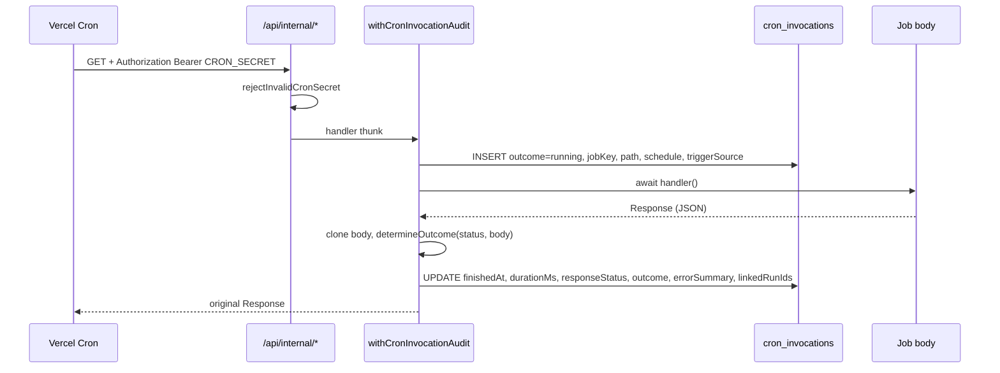
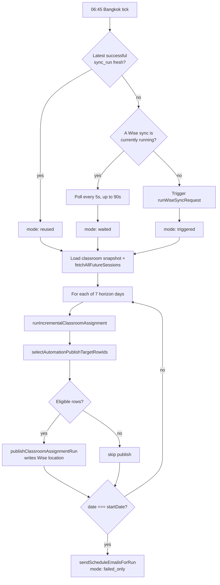

# Cron Schedule

**Status:** Stable. **Authoritative source:** [`vercel.json`](../../vercel.json).

Every scheduled job in BGScheduler is a Vercel Cron entry. Vercel reads `vercel.json` at deploy time and, on each tick, issues an **HTTP `GET`** to the configured `path` carrying `Authorization: Bearer $CRON_SECRET`. There is no in-process scheduler anywhere in the codebase — **if a handler is not listed in `vercel.json`, nothing fires it automatically.**

There are **15 cron entries** in `vercel.json` and **21 route handlers** under `src/app/api/internal/`. The 6 handlers with no entry are listed in [Internal handlers without a cron schedule](#internal-handlers-without-a-cron-schedule).

This page is the mechanical reference — schedule, endpoint, auth, timeout, guard, and what each handler does. Request/response bodies live in [`api/internal-crons.md`](api/internal-crons.md); table columns live in [`database/index.md`](database/index.md); feature meaning and data flows live in the corresponding [`features/*`](../features/) docs.

**Two files must stay in lockstep.** `vercel.json` is what the platform schedules; [`src/lib/data-health/cron-registry.ts`](../../src/lib/data-health/cron-registry.ts) is the in-app mirror that `/data-health`, the manual job runner, and the cron watchdog all read. A unit test compares `SCHEDULED_CRON_JOBS` (registry rows with `manualOnly: false`, [`cron-registry.ts:375`](../../src/lib/data-health/cron-registry.ts)) against `vercel.json`'s `crons` array by path and schedule ([`cron-registry.test.ts:7-20`](../../src/lib/data-health/__tests__/cron-registry.test.ts)). Adding a cron means editing both files.

---

## Cron registry (authoritative)

Rows are in `vercel.json` order. Schedules are **UTC**; the business timezone is `Asia/Bangkok` (UTC+7), which is what the daily and weekly jobs' health expectations are computed against.

| # | Path | Schedule (UTC) | Bangkok | Registry key | `maxDuration` | What it does |
|---|---|---|---|---|---|---|
| 1 | `/api/internal/sync-wise` | `*/30 * * * *` | :00 / :30 hourly | `wise_snapshot` | 800s | Full Wise ETL → new snapshot → atomic promote |
| 2 | `/api/internal/sync-sales-dashboard` | `10,40 * * * *` | :10 / :40 hourly | `sales_dashboard` | 800s | Re-import refreshable sales sheets + active projection |
| 3 | `/api/internal/sync-competitor-intelligence` | `25 18 * * 0` | Mon 01:25 weekly | `competitor_intelligence` | 800s | Crawl competitor sources, normalize, AI-summarize |
| 4 | `/api/internal/sync-credit-control` | `20,50 * * * *` | :20 / :50 hourly | `credit_control` | 800s | Rebuild the prepaid-credit depletion snapshot |
| 5 | `/api/internal/sync-progress-tests` | `25,55 * * * *` | :25 / :55 hourly | `progress_tests` | 300s | Recompute every-8-classes progress-test cycle state |
| 6 | `/api/internal/progress-tests/admin-digest` | `35 0 * * *` | 07:35 daily | `progress_tests_digest` | 300s | Email admins the approaching/due progress-test digest |
| 7 | `/api/internal/sync-wise-activity` | `5,35 * * * *` | :05 / :35 hourly | `wise_activity` | 800s | Pull Wise audit events into the persisted event store |
| 8 | `/api/internal/sync-post-class-feedback` | `13,43 * * * *` | :13 / :43 hourly | `post_class_feedback` | 800s | Rolling 4-day feedback collection + AI review + retries |
| 9 | `/api/internal/post-class-feedback-backfill` | `23,53 * * * *` | :23 / :53 hourly | `post_class_feedback_backfill` | 800s | Drain the oldest unreconciled feedback history window |
| 10 | `/api/internal/sync-leave-requests` | `15,45 * * * *` | :15 / :45 hourly | `leave_requests` | 800s | Pull leave-form rows from Sheets, match tutors, notify |
| 11 | `/api/internal/class-assignments/morning` | `45 23 * * *` | 06:45 daily | `classroom_morning` | 800s | Assign rooms for a 7-day horizon, publish, email tutors |
| 12 | `/api/internal/class-assignments/admin-email` | `0,10,20,30 0 * * *` | 07:00–07:30 daily | `classroom_admin_email` | 300s | Send (or retry) the daily admin classroom summary |
| 13 | `/api/internal/student-promotions/july-1` | `5 17 30 6 *` | 1 Jul 00:05 (annual) | `student_promotions_july_1` | 800s | One-shot Wise grade/course promotion writeback |
| 14 | `/api/internal/cron-watchdog` | `7,37 * * * *` | :07 / :37 hourly | `cron_watchdog` | 300s | Sweep every cron's health, email admins on new failures |
| 15 | `/api/internal/admissions-notifications` | `12 1 * * *` | 08:12 daily | `admissions_notifications` | 300s | Deadline reminders daily; weekly digest on Bangkok Sundays |
| 16 | `/api/internal/line-credit-digest` | `3 2 * * *` | 09:03 daily | `line_credit_digest` | 300s | Push the credit-runout digest (next 7 days) to registered LINE staff groups |

Schedule rows: [`vercel.json`](../../vercel.json). Registry rows with labels, cadence, and lateness budgets: [`cron-registry.ts`](../../src/lib/data-health/cron-registry.ts).

Cadence breakdown: **9** half-hourly, **5** daily, **1** weekly, **1** dated one-shot.

### Stagger

The nine half-hourly jobs are offset by minute so no two hit the Wise API or Neon in the same minute. The Wise client's concurrency limiter is per-invocation, not global, so avoiding overlap is the only lever that actually prevents contention.


```mermaid
gantt
    title Half-hourly stagger — minute offsets within each 30-minute cycle (UTC)
    dateFormat mm
    axisFormat :%M
    section Wise-facing
    Wise snapshot 00/30        :a1, 00, 3m
    Wise activity 05/35        :a2, 05, 2m
    Sales dashboard 10/40      :a3, 10, 3m
    Post-class feedback 13/43  :a4, 13, 2m
    Leave requests 15/45       :a5, 15, 3m
    Credit control 20/50       :a6, 20, 3m
    Feedback backfill 23/53    :a7, 23, 2m
    Progress tests 25/55       :a8, 25, 2m
    section Meta
    Cron watchdog 07/37        :b1, 07, 1m
```

Firing order within each half hour: `00` Wise snapshot → `05` Wise activity → `07` watchdog → `10` sales → `13` post-class feedback → `15` leave requests → `20` credit control → `23` feedback backfill → `25` progress tests; repeat at `+30`.

The daily jobs **chain** rather than stagger. Classroom morning automation (06:45 Bangkok) must finish before the admin email window (07:00–07:30 Bangkok) has anything to report, and the admin-email handler encodes that dependency explicitly — see [cron 12](#12-classroom-admin-email--apiinternalclass-assignmentsadmin-email).

---

## Shared mechanics

### 1. Authentication — `CRON_SECRET` only

`src/middleware.ts` treats the entire `/api/internal/` namespace as a public route ([`middleware.ts:18`](../../src/middleware.ts)), so Auth.js never runs for these paths and each handler does its own bearer check.

The shared helper is [`src/lib/internal/cron-auth.ts`](../../src/lib/internal/cron-auth.ts):

- `getCronSecretStatus(request)` → `"valid" | "invalid" | "missing-secret"`. Compares `Authorization` against `` `Bearer ${process.env.CRON_SECRET}` `` with `timingSafeEqual`, guarded by a length pre-check ([`cron-auth.ts:12-16`](../../src/lib/internal/cron-auth.ts)). The pre-check exists because `crypto.timingSafeEqual` throws `RangeError` on length-mismatched buffers; it is itself O(1) and does not leak secret length via timing (design ID **REL-07**, spelled out at [`sync-wise/route.ts:12-15`](../../src/app/api/internal/sync-wise/route.ts)).
- `rejectInvalidCronSecret(request)` → `null` on success, `500 Server misconfigured` when `CRON_SECRET` is unset, `401 Unauthorized` otherwise ([`cron-auth.ts:19-26`](../../src/lib/internal/cron-auth.ts)).

An unset `CRON_SECRET` fails closed as a 500 rather than silently accepting everything.

Six routes predate the shared helper and inline a byte-identical copy of the same comparison: `sync-wise` ([:11-29](../../src/app/api/internal/sync-wise/route.ts)), `sync-sales-dashboard` ([:15-22](../../src/app/api/internal/sync-sales-dashboard/route.ts)), `sync-competitor-intelligence` ([:11-18](../../src/app/api/internal/sync-competitor-intelligence/route.ts)), `sync-credit-control` ([:18-31](../../src/app/api/internal/sync-credit-control/route.ts)), `sync-room-utilization` ([:12-24](../../src/app/api/internal/sync-room-utilization/route.ts)), and `student-promotions/july-1` ([:10-17](../../src/app/api/internal/student-promotions/july-1/route.ts)). Behaviour is identical; only the import differs.

### 2. Invocation audit — `cron_invocations`

Nearly every handler wraps its work in `withCronInvocationAudit` ([`cron-audit.ts:144-159`](../../src/lib/data-health/cron-audit.ts)), which produces *direct* evidence that a route fired, independent of whatever domain run table the job writes.


```mermaid
sequenceDiagram
    participant V as Vercel Cron
    participant R as /api/internal/*
    participant A as withCronInvocationAudit
    participant DB as cron_invocations
    participant J as Job body

    V->>R: GET + Authorization Bearer CRON_SECRET
    R->>R: rejectInvalidCronSecret
    R->>A: handler thunk
    A->>DB: INSERT outcome=running, jobKey, path, schedule, triggerSource
    A->>J: await handler()
    J-->>A: Response (JSON)
    A->>A: clone body, determineOutcome(status, body)
    A->>DB: UPDATE finishedAt, durationMs, responseStatus, outcome, errorSummary, linkedRunIds
    A-->>V: original Response
```

Reading the table correctly requires knowing:

- The row is inserted **before** the job runs, so a function killed by the platform timeout leaves a stranded `outcome="running"` row rather than no evidence at all ([`cron-audit.ts:84-112`](../../src/lib/data-health/cron-audit.ts)).
- Outcome classification ([`cron-audit.ts:61-70`](../../src/lib/data-health/cron-audit.ts)): body `skipped === true` or an error message containing `"already running"` → `skipped`; body `ok === false` / `success === false` → `failed`; HTTP `202` → `skipped`; HTTP ≥ 400 → `failed`; otherwise `success`.
- A thrown handler is caught, converted to a synthetic `500 { error }`, audited as `failed`, and returned — the audit never swallows the failure and never re-throws ([`cron-audit.ts:152-158`](../../src/lib/data-health/cron-audit.ts)).
- Audit writes are best-effort; an insert/update failure is `console.error`-logged and the job proceeds ([`cron-audit.ts:108-111`](../../src/lib/data-health/cron-audit.ts), [`:139-141`](../../src/lib/data-health/cron-audit.ts)).
- `linkedRunIds` opportunistically extracts `syncRunId`, `result.syncRunId`/`result.id`, `results.length`, and `projectionResult.runId` so an invocation joins back to its domain run row ([`cron-audit.ts:37-59`](../../src/lib/data-health/cron-audit.ts)).
- Table shape and indexes: [`schema.ts:479-499`](../../src/lib/db/schema.ts).

**One scheduled route is not audit-wrapped**: `/api/internal/student-promotions/july-1` returns directly ([`student-promotions/july-1/route.ts:19-48`](../../src/app/api/internal/student-promotions/july-1/route.ts)). See [cron 13](#13-student-promotions-apply--apiinternalstudent-promotionsjuly-1) and the open questions.

### 3. Health derivation

`/data-health` runs every registry entry through `evaluateCronJobStatus` ([`src/lib/data-health/status.ts:195-363`](../../src/lib/data-health/status.ts)). Two evidence sources feed it: *direct* proof (a `cron_invocations` row) and *inferred* proof (the job's own domain run table, mapped per key at [`dashboard.ts:161-315`](../../src/lib/data-health/dashboard.ts)).

Expected-window computation branches on the registry's shape hints ([`status.ts:167-176`](../../src/lib/data-health/status.ts)):

| Registry hint | Branch | Derivation |
|---|---|---|
| `manualOnly: true` | — | No window; status forced to `manual-only` ([`status.ts:199-216`](../../src/lib/data-health/status.ts)) |
| `expectedBangkokWeekday` set | `weeklyExpectation` | Bangkok weekday + minute-of-day, ±7 days ([`status.ts:137-165`](../../src/lib/data-health/status.ts)) |
| `expectedBangkokMinute` or `…WindowStartMinute` set | `dailyExpectation` | Bangkok minute-of-day window, ±24h ([`status.ts:111-135`](../../src/lib/data-health/status.ts)) |
| neither | `intervalExpectation` | Parses the **minute field only** of the cron string (`*/N` or comma list), scans ±2h ([`status.ts:57-92`](../../src/lib/data-health/status.ts)) |

Status ladder, in evaluation order:

1. `failing` — a run has been `running` longer than `maxDurationSeconds + 60s` ([`status.ts:238-258`](../../src/lib/data-health/status.ts)). This uses the **registry's** `maxDurationSeconds`, not the route's `export const maxDuration`.
2. `running` — an in-flight invocation or run row.
3. `unknown` — no direct and no inferred proof. **Alertable.**
4. `failing` — the latest observed outcome is a failure newer than the latest success.
5. `late` — interval jobs: last evidence older than `lateAfterMinutes`. Calendar jobs: no evidence since the last expected window plus `lateAfterMinutes` ([`status.ts:314-344`](../../src/lib/data-health/status.ts)).
6. `healthy`.

`lateAfterMinutes` by job: 45 for the half-hourly set, 60 for the progress-test digest and admissions, 75 for classroom morning, 30 for the classroom admin email, 120 for competitor intelligence, 1440 for student promotions ([`cron-registry.ts:46-373`](../../src/lib/data-health/cron-registry.ts)).

### 4. The watchdog closes the loop

Cron 14 runs the same derivation every 30 minutes and emails admins. Its design ([`src/lib/internal/cron-watchdog.ts`](../../src/lib/internal/cron-watchdog.ts)):

- **Episode dedup** — one alert per job per failure episode, persisted in `cron_alert_state` ([`schema.ts:505-514`](../../src/lib/db/schema.ts)). An episode opens on `lastAlertOutcome = "alerted"` and closes on `"recovered"`, which re-arms ([`cron-watchdog.ts:152-171`](../../src/lib/internal/cron-watchdog.ts)).
- **Alertable statuses** are `failing`, `late`, `unknown` ([`cron-watchdog.ts:52`](../../src/lib/internal/cron-watchdog.ts)).
- **Self-exclusion** — never alerts on `cron_watchdog` ([`cron-watchdog.ts:39`](../../src/lib/internal/cron-watchdog.ts), [`:160`](../../src/lib/internal/cron-watchdog.ts)); skips `manualOnly` jobs entirely.
- **Single-flight without transactions** — neon-http has neither transactions nor advisory locks, so the sweep claims a sentinel `cron_alert_state` row (`__watchdog_sweep_lock`) via one conditional upsert with a `setWhere` guard; a crashed holder's lock is reclaimable after 6 minutes ([`cron-watchdog.ts:47-50`](../../src/lib/internal/cron-watchdog.ts), [`:298-323`](../../src/lib/internal/cron-watchdog.ts)).
- **Recipients** are `admin_users` rows with `allowedPages IS NULL` — full-access admins only, because page-restricted users cannot open the `/data-health` link the alert points at ([`cron-watchdog.ts:255-262`](../../src/lib/internal/cron-watchdog.ts)).
- **Delivery-gated state** — episode state is written only after at least one recipient accepted, so a total delivery failure retries next sweep ([`cron-watchdog.ts:454-457`](../../src/lib/internal/cron-watchdog.ts)); a partial delivery still closes the episode (documented tradeoff at [`cron-watchdog.ts:11-17`](../../src/lib/internal/cron-watchdog.ts)).
- **Synthetic entry** — the sweep also injects a non-route `post_class_payout_window` job derived from payout-window staleness, so a payout window that never reached `published` alerts even though the accrual cron itself is parked ([`cron-watchdog.ts:84-116`](../../src/lib/internal/cron-watchdog.ts)). A failure inside that check degrades to "no payout entry this sweep" rather than failing the sweep ([`cron-watchdog.ts:118-136`](../../src/lib/internal/cron-watchdog.ts)).
- **Missing table fails safe** — if `cron_alert_state` does not exist yet, alerting is disabled rather than sending un-deduped spam every sweep ([`cron-watchdog.ts:375-389`](../../src/lib/internal/cron-watchdog.ts)).

### 5. Single-flight guards

Vercel can overlap invocations when a slow run is still holding the function at the next tick, so every heavy job carries a guard in its own run table. The reference implementation is the Wise snapshot ([`run-wise-sync.ts:88-118`](../../src/lib/sync/run-wise-sync.ts)):

1. Fail any `running` row older than 20 minutes with an explicit "likely timed out or the request was aborted" summary ([`run-wise-sync.ts:10`](../../src/lib/sync/run-wise-sync.ts), [`:39-40`](../../src/lib/sync/run-wise-sync.ts)).
2. If a `running` row remains, return `202` with `skipped: true` — which the audit classifies as `skipped`, not `failed` ([`run-wise-sync.ts:120-150`](../../src/lib/sync/run-wise-sync.ts)).
3. Otherwise insert a `running` row; a `23505` unique violation means a racing invocation won, so re-read and skip ([`run-wise-sync.ts:106-117`](../../src/lib/sync/run-wise-sync.ts)).

Credit control and progress tests replicate this verbatim with their own 20-minute constants ([`credit-control/run-sync-request.ts:9-12`](../../src/lib/credit-control/run-sync-request.ts), [`progress-tests/run-sync-request.ts:10-11`](../../src/lib/progress-tests/run-sync-request.ts)). Wise activity, leave requests, post-class feedback, competitor intelligence, and the admissions passes each raise a typed "already running" error that the route maps to `409`.

### 6. `GET` vs `POST`, and who else may call

Vercel Cron issues **`GET`**; every scheduled route exports `GET`. Some also export `POST` for manual use, and a subset of those additionally accept an Auth.js session instead of the cron secret:

| Endpoint | `GET` | `POST` | `POST` accepts a session? |
|---|---|---|---|
| `sync-wise` | yes | yes | any signed-in session ([`route.ts:45-59`](../../src/app/api/internal/sync-wise/route.ts)) |
| `sync-sales-dashboard` | yes | yes | any session with an email ([`route.ts:29-36`](../../src/app/api/internal/sync-sales-dashboard/route.ts)) |
| `sync-credit-control` | yes | yes | any signed-in session ([`route.ts:43-56`](../../src/app/api/internal/sync-credit-control/route.ts)) |
| `sync-progress-tests` | yes | yes | any signed-in session ([`route.ts:19-32`](../../src/app/api/internal/sync-progress-tests/route.ts)) |
| `sync-competitor-intelligence` | yes | yes | only via `requireCompetitorIntelligenceSession`, which checks `allowedPages`/`role` ([`route.ts:31-36`](../../src/app/api/internal/sync-competitor-intelligence/route.ts), [`access.ts:19-30`](../../src/lib/competitor-intelligence/access.ts)) |
| `sync-leave-requests` | yes | yes | no — cron secret on both verbs ([`route.ts:30-36`](../../src/app/api/internal/sync-leave-requests/route.ts)) |
| `student-promotions/july-1` | yes | yes (`POST` delegates to `GET`) | no ([`route.ts:46-48`](../../src/app/api/internal/student-promotions/july-1/route.ts)) |
| `admissions-notifications` | yes | yes (`runType` in the body) | no ([`route.ts:91-114`](../../src/app/api/internal/admissions-notifications/route.ts)) |
| `cron-watchdog` | yes | yes | no ([`route.ts:28-34`](../../src/app/api/internal/cron-watchdog/route.ts)) |
| `sync-wise-activity`, `sync-post-class-feedback`, `post-class-feedback-backfill`, `progress-tests/admin-digest`, `class-assignments/morning`, `class-assignments/admin-email` | yes | — | n/a |

`sync-room-utilization` is the inverse — it exports **only** `POST` ([`route.ts:26`](../../src/app/api/internal/sync-room-utilization/route.ts)), which is precisely why it cannot be a Vercel cron.

---

## Per-cron detail

### 1. Wise snapshot sync — `/api/internal/sync-wise`

| | |
|---|---|
| Schedule | `*/30 * * * *` — every 30 minutes ([`vercel.json:4-6`](../../vercel.json)) |
| `maxDuration` | 800s, "Pro-plan headroom for full Wise syncs" ([`route.ts:7`](../../src/app/api/internal/sync-wise/route.ts)) |
| Job body | `runWiseSyncRequest()` → `runFullSync()` ([`run-wise-sync.ts:142-167`](../../src/lib/sync/run-wise-sync.ts)) |
| Run table | `sync_runs` |
| Feature | [Tutor Search](../features/tutor-search.md) |

The spine job. Acquires the single-flight guard, runs fetch → normalize → persist → validate → promote against `WISE_INSTITUTE_ID` (falling back to the literal `696e1f4d90102225641cc413`), and on success calls `revalidateTag("snapshot", { expire: 0 })` so cached Server Component reads pick up the new snapshot immediately ([`run-wise-sync.ts:152-166`](../../src/lib/sync/run-wise-sync.ts)). Returns `200` on success, `500` on failure, `202` when already running.

This is also the only cron another cron waits on — see [cron 11](#11-classroom-morning-automation--apiinternalclass-assignmentsmorning).

### 2. Sales dashboard sync — `/api/internal/sync-sales-dashboard`

| | |
|---|---|
| Schedule | `10,40 * * * *` ([`vercel.json:8-10`](../../vercel.json)) |
| `maxDuration` | 800s ([`route.ts:11`](../../src/app/api/internal/sync-sales-dashboard/route.ts)) |
| Job body | `importRefreshableSalesSources()` then `importActiveSalesDashboardProjectionSource()` ([`route.ts:53-60`](../../src/app/api/internal/sync-sales-dashboard/route.ts)) |
| Run tables | sales import runs + projection runs, merged for health ([`dashboard.ts:179-187`](../../src/lib/data-health/dashboard.ts)) |
| Feature | [Sales Dashboard](../features/sales-dashboard.md) |

Two imports in sequence inside one invocation. The cron actor is the literal `cron@begifted.local` ([`route.ts:26`](../../src/app/api/internal/sync-sales-dashboard/route.ts)); a session-authenticated `POST` substitutes the signed-in email.

Distinct failure mode: this job reads Google Sheets through a stored OAuth token, and a `MissingGoogleSheetsTokenError` maps to **`409`**, not `500` ([`route.ts:63-65`](../../src/app/api/internal/sync-sales-dashboard/route.ts)) — a revoked or missing connection is an operator action, not a code fault. Both statuses audit as `failed`.

### 3. Competitor intelligence sync — `/api/internal/sync-competitor-intelligence`

| | |
|---|---|
| Schedule | `25 18 * * 0` UTC = **Monday 01:25 Bangkok**, weekly ([`vercel.json:12-14`](../../vercel.json)) |
| `maxDuration` | 800s ([`route.ts:7`](../../src/app/api/internal/sync-competitor-intelligence/route.ts)) |
| Job body | `runCompetitorIntelligenceSync({ triggerType })` ([`route.ts:48-51`](../../src/app/api/internal/sync-competitor-intelligence/route.ts)) |
| Run table | `competitor_sync_runs` |
| Feature | [Competitor Intelligence](../features/competitor-intelligence.md) |

The UTC expression fires **Sunday** 18:25; +7 hours lands on **Monday** 01:25 Bangkok, which is what the registry records (`expectedBangkokWeekday: 1`, `expectedBangkokMinute: 85`, `lateAfterMinutes: 120` — [`cron-registry.ts:98-106`](../../src/lib/data-health/cron-registry.ts)). This is the only job whose health uses the weekly expectation branch.

Guard: sweep stale running rows, then reject if a `running` row survives. The thrown message contains "already running", which the route maps to `409` and the audit classifies as `skipped` rather than `failed` ([`competitor-intelligence/sync.ts:499-512`](../../src/lib/competitor-intelligence/sync.ts), [`route.ts:57-60`](../../src/app/api/internal/sync-competitor-intelligence/route.ts)). A run that completes unsuccessfully returns `500` with the result body attached ([`route.ts:52-54`](../../src/app/api/internal/sync-competitor-intelligence/route.ts)).

### 4. Credit control sync — `/api/internal/sync-credit-control`

| | |
|---|---|
| Schedule | `20,50 * * * *` ([`vercel.json:16-18`](../../vercel.json)) |
| `maxDuration` | **800s** ([`route.ts:14`](../../src/app/api/internal/sync-credit-control/route.ts)) |
| Job body | `runCreditControlSyncRequest()` → `runCreditControlSync()` ([`credit-control/sync.ts:634`](../../src/lib/credit-control/sync.ts)) |
| Run table | `credit_control_sync_runs` |
| Feature | [Credit Control](../features/credit-control.md) |

Fetches students plus a past-window and future-window session set in parallel, pairs them, then fetches per-pair credit balances ([`credit-control/sync.ts:650-660`](../../src/lib/credit-control/sync.ts)).

The `maxDuration` carries an unusually specific comment: the route sat at 300s while successful runs took **372–390s** — permanently over its own limit — producing recurring "Task timed out after 300 seconds" failures from 2026-06-16 onward, with each timeout also stranding the `running` row until the watchdog failed it 30 minutes later ([`route.ts:7-13`](../../src/app/api/internal/sync-credit-control/route.ts)). The registry still records `maxDurationSeconds: 300` for this job ([`cron-registry.ts:118`](../../src/lib/data-health/cron-registry.ts)) — see open question 2.

### 5. Progress tests sync — `/api/internal/sync-progress-tests`

| | |
|---|---|
| Schedule | `25,55 * * * *` ([`vercel.json:20-22`](../../vercel.json)) |
| `maxDuration` | 300s ([`route.ts:7`](../../src/app/api/internal/sync-progress-tests/route.ts)) |
| Job body | `runProgressTestSyncRequest({ triggerType: "cron" })` ([`route.ts:16`](../../src/app/api/internal/sync-progress-tests/route.ts)) |
| Run table | `progress_test_sync_runs` |
| Feature | [Progress Tests](../features/progress-tests.md) |

Resolves each Wise PAST session's teacher through the active snapshot's identity groups, upserts the durable ledger idempotently on `wiseSessionId + wiseStudentId`, recomputes per-enrollment cycle state, and — for enrollments newly crossing into "approaching" — generates an AI summary and emails the most-frequent tutor ([`progress-tests/sync.ts:478-493`](../../src/lib/progress-tests/sync.ts)). Thresholds: due at 8 attended-with-credit classes, teacher heads-up at 6 ([`progress-tests/config.ts:11-14`](../../src/lib/progress-tests/config.ts)).

Notification and AI failures are fail-isolated — caught, logged, and never allowed to fail the run.

### 6. Progress tests admin digest — `/api/internal/progress-tests/admin-digest`

| | |
|---|---|
| Schedule | `35 0 * * *` UTC = **07:35 Bangkok** daily ([`vercel.json:24-26`](../../vercel.json)) |
| `maxDuration` | 300s ([`route.ts:6`](../../src/app/api/internal/progress-tests/admin-digest/route.ts)) |
| Job body | `sendProgressTestAdminDigest()` ([`route.ts:16`](../../src/app/api/internal/progress-tests/admin-digest/route.ts)) |
| Feature | [Progress Tests](../features/progress-tests.md) |

`GET` only, cron secret only. Emails every `admin_users` address the approaching/due student list plus any teacher notifications stuck in `unresolved`, so an admin can fix the contact or notify the teacher manually ([`progress-tests/admin-digest.ts:75-100`](../../src/lib/progress-tests/admin-digest.ts)). `result.status === "failed"` maps to `500`; anything else to `200` ([`route.ts:17-18`](../../src/app/api/internal/progress-tests/admin-digest/route.ts)).

Health treats a `skipped` digest (nothing worth sending) as valid proof the job fired ([`dashboard.ts:225-233`](../../src/lib/data-health/dashboard.ts)) — otherwise a quiet week would read as "late".

### 7. Wise activity audit sync — `/api/internal/sync-wise-activity`

| | |
|---|---|
| Schedule | `5,35 * * * *` ([`vercel.json:28-30`](../../vercel.json)) |
| `maxDuration` | 800s ([`route.ts:8`](../../src/app/api/internal/sync-wise-activity/route.ts)) |
| Job body | `syncWiseActivityEvents(db, client, instituteId, { triggerType: "cron" })` ([`route.ts:20-25`](../../src/app/api/internal/sync-wise-activity/route.ts)) |
| Run table | `wise_activity_sync_runs` |
| Feature | [Wise Activity Audit](../features/wise-activity-audit.md) |

Cron mode is deliberately narrower than manual mode: **3 days** lookback and **20 pages** max, versus 30 days / 500 pages for a manual backfill, at a fixed page size of 50 ([`wise-activity/sync.ts:8-12`](../../src/lib/wise-activity/sync.ts), [`:160-161`](../../src/lib/wise-activity/sync.ts)). It also stops early on known events by default, so a routine tick usually fetches one or two pages. Abandoned runs are swept before a new run row is inserted; a unique violation on the running row raises `WiseActivitySyncAlreadyRunningError` → `409`.

### 8. Post-class feedback collection — `/api/internal/sync-post-class-feedback`

| | |
|---|---|
| Schedule | `13,43 * * * *` ([`vercel.json:32-34`](../../vercel.json)) |
| `maxDuration` | 800s ([`route.ts:12`](../../src/app/api/internal/sync-post-class-feedback/route.ts)) |
| Job body | `runPostClassFeedbackSync({ triggerType: "cron" })`, then `processPostClassAiReviews()` and `processDuePostClassNotificationRetries()` in parallel ([`route.ts:21-25`](../../src/app/api/internal/sync-post-class-feedback/route.ts)) |
| Run table | post-class feedback sync runs |
| Feature | [Post-class Feedback](../features/post-class-feedback.md) |

The rolling collector covers a **four-day** Bangkok window ([`post-class-feedback/sync.ts:139`](../../src/lib/post-class-feedback/sync.ts)); anything older belongs to the backfill cron ([cron 9](#9-post-class-feedback-historical-drain--apiinternalpost-class-feedback-backfill)). Cron runs hold a 50-detail batch cap so a routine tick can never monopolise the Wise API ([`sync.ts:41-49`](../../src/lib/post-class-feedback/sync.ts)).

The two follow-on passes run under `Promise.allSettled`, so an AI-review or retry failure degrades to `{ failed: true }` in the response instead of failing the whole invocation ([`route.ts:22-31`](../../src/app/api/internal/sync-post-class-feedback/route.ts)). `PostClassFeedbackSyncAlreadyRunningError` → `409`.

### 9. Post-class feedback historical drain — `/api/internal/post-class-feedback-backfill`

| | |
|---|---|
| Schedule | `23,53 * * * *` ([`vercel.json:36-38`](../../vercel.json)) |
| `maxDuration` | 800s ([`route.ts:12`](../../src/app/api/internal/post-class-feedback-backfill/route.ts)) |
| Job body | `findOldestUnreconciledBackfillWindow()` → `runPostClassBackfillJob()` ([`route.ts:51-69`](../../src/app/api/internal/post-class-feedback-backfill/route.ts)) |
| Feature | [Post-class Feedback](../features/post-class-feedback.md) |

The only cron that accepts query parameters. A Zod schema validates optional `startDate`/`endDate` (`YYYY-MM-DD`, must be supplied together and ordered), `detailCap` (1–400), and `maxBatches` (1–50) ([`route.ts:19-30`](../../src/app/api/internal/post-class-feedback-backfill/route.ts)); a parse failure returns `400` with `.error.flatten()` **before** the audit wrapper starts.

Unattended behaviour: each tick picks the oldest still-unreconciled window automatically, so repeated runs converge without anyone choosing dates by hand ([`route.ts:14-18`](../../src/app/api/internal/post-class-feedback-backfill/route.ts)). Cron defaults are deliberately small — `detailCap: 50`, `maxBatches: 1` — with the 400/50 ceilings reserved for a deliberate manual re-drain ([`route.ts:64-68`](../../src/app/api/internal/post-class-feedback-backfill/route.ts)). Nothing to do returns `200 { ok: true, skipped: "nothing-unreconciled" }`, which audits as `success` because that `skipped` value is a string, not `true`.

The drain loop stops as soon as a batch fetches fewer details than the cap, or when its batch/wall-clock budget runs out, so it can never overrun the function timeout ([`backfill-job.ts:40-52`](../../src/lib/post-class-feedback/backfill-job.ts)).

### 10. Leave requests sync — `/api/internal/sync-leave-requests`

| | |
|---|---|
| Schedule | `15,45 * * * *` ([`vercel.json:40-42`](../../vercel.json)) |
| `maxDuration` | 800s ([`route.ts:7`](../../src/app/api/internal/sync-leave-requests/route.ts)) |
| Job body | `syncLeaveRequests(getDb(), { triggerType: "cron" })` ([`route.ts:17`](../../src/app/api/internal/sync-leave-requests/route.ts)) |
| Run table | `leave_request_sync_runs` |
| Feature | [Leave Requests](../features/leave-requests.md) |

Per run: insert a run row (a running-row conflict raises `LeaveRequestSyncAlreadyRunningError` → `409`), resolve the connected Google account, fetch and parse the leave sheet, match each row to a Wise tutor identity, upsert the request, recompute affected sessions, and email admins about newly-inserted requests ([`leave-requests/sync.ts:366-420`](../../src/lib/leave-requests/sync.ts)). The spreadsheet ID and tab name are recorded in the run's `metadata`, so a mis-pointed sheet is visible from the run row alone.

### 11. Classroom morning automation — `/api/internal/class-assignments/morning`

| | |
|---|---|
| Schedule | `45 23 * * *` UTC = **06:45 Bangkok** daily ([`vercel.json:44-46`](../../vercel.json)) |
| `maxDuration` | 800s ([`route.ts:6`](../../src/app/api/internal/class-assignments/morning/route.ts)) |
| Job body | `runClassroomMorningAutomation()` ([`route.ts:16`](../../src/app/api/internal/class-assignments/morning/route.ts)) |
| Run table | classroom assignment runs ([`dashboard.ts:288-295`](../../src/lib/data-health/dashboard.ts)) |
| Feature | [Classroom Assignments](../features/classroom-assignments.md) |
| Danger | `dangerous: true` — publishes room locations to Wise and emails tutors ([`cron-registry.ts:274-275`](../../src/lib/data-health/cron-registry.ts)) |

The most involved cron, and the only one that depends on another cron's output.


```mermaid
flowchart TD
    A["06:45 Bangkok tick"] --> B{"Latest successful<br/>sync_run fresh?"}
    B -- yes --> E["mode: reused"]
    B -- no --> C{"A Wise sync is<br/>currently running?"}
    C -- yes --> D["Poll every 5s, up to 90s"]
    D --> E2["mode: waited"]
    C -- no --> F["Trigger runWiseSyncRequest"]
    F --> E3["mode: triggered"]
    E --> G["Load classroom snapshot +<br/>fetchAllFutureSessions"]
    E2 --> G
    E3 --> G
    G --> H["For each of 7 horizon days"]
    H --> I["runIncrementalClassroomAssignment"]
    I --> J["selectAutomationPublishTargetRowIds"]
    J --> K{"Eligible rows?"}
    K -- yes --> L["publishClassroomAssignmentRun<br/>writes Wise location"]
    K -- no --> M["skip publish"]
    L --> N{"date === startDate?"}
    M --> N
    N -- yes --> O["sendScheduleEmailsForRun<br/>mode: failed_only"]
    N -- no --> H
```

Specifics: the freshness gate polls at 5-second intervals for up to 90 seconds ([`morning-automation.ts:25-26`](../../src/lib/classrooms/morning-automation.ts), [`:105-131`](../../src/lib/classrooms/morning-automation.ts)); the horizon is exactly **7 Bangkok days** starting today ([`:170-172`](../../src/lib/classrooms/morning-automation.ts), [`:183-184`](../../src/lib/classrooms/morning-automation.ts)); tutor schedule emails are sent only for the first day and only in `failed_only` mode, and an email failure is captured as `scheduleEmailError` without aborting the remaining dates ([`:215-233`](../../src/lib/classrooms/morning-automation.ts)). Actors are the literals `cron@classroom-assignments` and `cron@classroom-schedule-email` ([`:27-28`](../../src/lib/classrooms/morning-automation.ts)).

### 12. Classroom admin email — `/api/internal/class-assignments/admin-email`

| | |
|---|---|
| Schedule | `0,10,20,30 0 * * *` UTC = **07:00, 07:10, 07:20, 07:30 Bangkok** ([`vercel.json:48-50`](../../vercel.json)) |
| `maxDuration` | 300s ([`route.ts:6`](../../src/app/api/internal/class-assignments/admin-email/route.ts)) |
| Job body | `sendAdminClassroomScheduleEmail()` ([`route.ts:16`](../../src/app/api/internal/class-assignments/admin-email/route.ts)) |
| Run table | classroom admin email runs ([`dashboard.ts:297-304`](../../src/lib/data-health/dashboard.ts)) |
| Feature | [Classroom Assignments](../features/classroom-assignments.md) |
| Danger | `dangerous: true` ([`cron-registry.ts:290-291`](../../src/lib/data-health/cron-registry.ts)) |

Four ticks are **one retry window**, not four emails. The handler is idempotent by date: if a terminal admin-email row already exists for today it returns `skipped` immediately ([`admin-schedule-email.ts:349-360`](../../src/lib/classrooms/admin-schedule-email.ts)). If the morning automation ([cron 11](#11-classroom-morning-automation--apiinternalclass-assignmentsmorning)) has not finished — no assignment run, or publish jobs still pending — it returns `pending` and lets the window run on ([`:368-382`](../../src/lib/classrooms/admin-schedule-email.ts)).

The 07:30 tick is the **final retry**: `FINAL_RETRY_MINUTE = 7 * 60 + 30` ([`admin-schedule-email.ts:19`](../../src/lib/classrooms/admin-schedule-email.ts)). At or after that minute the handler stops waiting and sends regardless — with a different subject, `ACTION REQUIRED: classroom assignments not ready - {date}` instead of the normal summary ([`:385-388`](../../src/lib/classrooms/admin-schedule-email.ts)). Silence is never an acceptable outcome: admins either get the schedule or get told it is missing.

Registry lateness is correspondingly tight — a 07:00–07:30 Bangkok window with `lateAfterMinutes: 30` ([`cron-registry.ts:287-293`](../../src/lib/data-health/cron-registry.ts)).

### 13. Student promotions apply — `/api/internal/student-promotions/july-1`

| | |
|---|---|
| Schedule | `5 17 30 6 *` UTC = **30 June 17:05 = 1 July 00:05 Bangkok**, annually ([`vercel.json:52-54`](../../vercel.json)) |
| `maxDuration` | 800s ([`route.ts:8`](../../src/app/api/internal/student-promotions/july-1/route.ts)) |
| Job body | `applyVerifiedStudentPromotionRun({ trigger: "cron" })` ([`route.ts:35`](../../src/app/api/internal/student-promotions/july-1/route.ts)) |
| Feature | [Student Promotions](../features/student-promotions.md) |
| Danger | `dangerous: true` — applies verified Wise grade and course writes ([`cron-registry.ts:306-308`](../../src/lib/data-health/cron-registry.ts)) |

A one-shot dressed as a recurring cron. After the secret check, the handler hard-guards the calendar date: `todayBangkok() !== STUDENT_PROMOTION_TARGET_DATE` returns **`409`** with "Student promotion cron is only allowed on July 1, 2026 Bangkok time" ([`route.ts:27-31`](../../src/app/api/internal/student-promotions/july-1/route.ts)). The target is the literal `"2026-07-01"` and the intended firing instant is pinned as `2026-06-30T17:05:00.000Z` — exactly the cron expression ([`student-promotions/rules.ts:1-2`](../../src/lib/student-promotions/rules.ts)).

Two structural quirks to know before touching this route:

- It is **not** wrapped in `withCronInvocationAudit`, so it produces no direct proof rows.
- Health deliberately gives it **no inferred evidence** either: its run table mixes admin drafts with the cron apply, so the dashboard fails closed to `unknown` rather than borrowing the room-utilization fallback and reporting a dangerous write-path cron as healthy without it ever firing ([`dashboard.ts:274-286`](../../src/lib/data-health/dashboard.ts)).

`POST` simply delegates to `GET` ([`route.ts:46-48`](../../src/app/api/internal/student-promotions/july-1/route.ts)).

### 14. Cron watchdog — `/api/internal/cron-watchdog`

| | |
|---|---|
| Schedule | `7,37 * * * *` ([`vercel.json:56-58`](../../vercel.json)) |
| `maxDuration` | 300s ([`route.ts:7`](../../src/app/api/internal/cron-watchdog/route.ts)) |
| Job body | `runCronWatchdog(getDb())` ([`route.ts:17`](../../src/app/api/internal/cron-watchdog/route.ts)) |
| Run table | none — health comes solely from its own `cron_invocations` rows ([`dashboard.ts:306-315`](../../src/lib/data-health/dashboard.ts)) |
| Feature | [Data Health](../features/data-health.md) |

Mechanics are in [Shared mechanics §4](#4-the-watchdog-closes-the-loop). The response summarizes `{ checked, unhealthy, alertsSent, recoveries, emailRecipients, skippedReason }` ([`cron-watchdog.ts:61-68`](../../src/lib/internal/cron-watchdog.ts)).

The 07/37 slot sits two minutes after the Wise activity sync and three before the sales import — the quietest part of the cycle. The sweep is read-mostly plus email sends, so it never competes for the Wise API.

### 15. Admissions notifications — `/api/internal/admissions-notifications`

| | |
|---|---|
| Schedule | `12 1 * * *` UTC = **08:12 Bangkok** daily ([`vercel.json:60-62`](../../vercel.json)) |
| `maxDuration` | 300s ([`route.ts:20`](../../src/app/api/internal/admissions-notifications/route.ts)) |
| Job body | `runDailyNotifications(now)`, plus `runWeeklyDigest(now)` on Bangkok Sundays ([`route.ts:56-61`](../../src/app/api/internal/admissions-notifications/route.ts)) |
| Run table | admissions notification runs |
| Feature | [University Admissions](../features/university-admissions.md) |
| Danger | `dangerous: true` ([`cron-registry.ts:323-324`](../../src/lib/data-health/cron-registry.ts)) |

One path, two cadences. The daily deadline scan runs on every invocation; the same invocation also runs the weekly digest when `formatBangkokDateTime(now, { weekday: "short" })` is `"Sun"` ([`route.ts:29-31`](../../src/app/api/internal/admissions-notifications/route.ts)). Digest dedupe keys of the form `digest:{caseId}:{recipient}:{today}` make same-day re-runs idempotent ([`admissions/notifications.ts:1016-1019`](../../src/lib/admissions/notifications.ts)).

An explicit `runType` (query param on `GET`, JSON body on `POST`) runs exactly one orchestrator, for manual triggers ([`route.ts:73-114`](../../src/app/api/internal/admissions-notifications/route.ts)). Every pass being skipped by the single-flight guard returns **`202`** (audited as `skipped`); otherwise `200`; a top-level orchestrator crash → `500` ([`route.ts:62-67`](../../src/app/api/internal/admissions-notifications/route.ts)).

Both orchestrators isolate per-recipient / per-case failures — logged into `errorSummary`, never aborting the run — and only a top-level crash marks the run failed ([`admissions/notifications.ts:955-966`](../../src/lib/admissions/notifications.ts), [`:1012-1023`](../../src/lib/admissions/notifications.ts)).

---

## Internal handlers without a cron schedule

Six of the 21 handlers under `src/app/api/internal/**` are **not** in `vercel.json` and therefore never fire on a timer. All six are still registered in `cron-registry.ts` with `schedule: null` and `manualOnly: true`, which makes `/data-health` render them as `manual-only` — a terminal, non-alertable status the watchdog skips ([`status.ts:199-216`](../../src/lib/data-health/status.ts), [`cron-watchdog.ts:160`](../../src/lib/internal/cron-watchdog.ts)).

| Endpoint | Registry key | Verb | `maxDuration` | Classification |
|---|---|---|---|---|
| `/api/internal/sync-room-utilization` | `room_utilization` | **POST** | 800s | **Effectively disabled** — exports no `GET`, so it is structurally un-schedulable |
| `/api/internal/line-backlog-recovery` | `line_backlog_recovery` | GET | 300s | Manual — one-off identity recovery sweep |
| `/api/internal/post-class-feedback/admin-digest` | `post_class_feedback_digest` | GET | 300s | Parked with the reminder lane |
| `/api/internal/post-class-feedback/reminder-day-after` | `post_class_feedback_day_after` | GET | 800s | Parked — emails tutors |
| `/api/internal/post-class-feedback/reminder-deadline` | `post_class_feedback_deadline` | GET | 800s | Parked — emails tutors |
| `/api/internal/post-class-feedback/payout-accrual` | `post_class_feedback_payout_accrual` | GET | 800s | Parked — writes real payout deductions |

### `/api/internal/sync-room-utilization` — manual, and structurally un-schedulable

The handler exports **only `POST`** ([`route.ts:26`](../../src/app/api/internal/sync-room-utilization/route.ts)). Vercel Cron issues `GET`, so even adding a `vercel.json` entry would produce 405s — the missing `GET` export, not the missing schedule, is the real blocker. A test pins the manual-only intent ([`cron-registry.test.ts:33-36`](../../src/lib/data-health/__tests__/cron-registry.test.ts)).

The body fetches every institute session, maps each to a utilization row, filters to `>= ROOM_UTILIZATION_HISTORY_START`, and chunk-upserts on `wiseSessionId` ([`utilization.ts:427-471`](../../src/lib/room-capacity/utilization.ts)). It accepts either the cron secret or any signed-in session ([`route.ts:27-40`](../../src/app/api/internal/sync-room-utilization/route.ts)).

**Flag: effectively disabled.** Nothing refreshes `room_utilization_sessions` automatically, so every read served by the [Room Capacity](../features/room-capacity.md) dashboard is as stale as the last manual run. That table is also the health-evidence fallback for several other registry keys ([`dashboard.ts:317-339`](../../src/lib/data-health/dashboard.ts)), which compounds the problem — see open question 4.

### `/api/internal/line-backlog-recovery` — manual

Fetches the full LINE follower roster, matches fresh display names against human-verified OA-resolver targets, and inserts suggested links ([`backlog-recovery.ts:1-20`](../../src/lib/line/backlog-recovery.ts), [`:52-61`](../../src/lib/line/backlog-recovery.ts)). The route always runs with `dryRun: false` ([`route.ts:19`](../../src/app/api/internal/line-backlog-recovery/route.ts)). Fail-closed invariant: every insert uses `status: "suggested"`, never `"verified"` (**IDENT-02**). `maxDuration` is 300s because the follower re-anchor pass is deliberately not called here ([`route.ts:7-9`](../../src/app/api/internal/line-backlog-recovery/route.ts)). Feature context: [LINE Integration](../features/line-integration.md).

### The four parked post-class routes

The registry comment states the intent plainly: outbound tutor reminders and the admin digest have no Vercel cron entry, and stay registered as manual-only so Data Health never reports them late while the routes remain runnable ([`cron-registry.ts:185-187`](../../src/lib/data-health/cron-registry.ts)). All four carry `dangerous: true` with explicit confirmation labels ([`cron-registry.ts:188-247`](../../src/lib/data-health/cron-registry.ts)):

- **Admin digest** — "Emails the admin digest. Reminders are parked; only run deliberately."
- **Day-after reminder** — "May email tutors whose post-class feedback is incomplete."
- **Deadline reminder** — "May email tutors whose feedback is due tonight."
- **Payout accrual** — "Appends real payout deductions to the master ledger."

Both reminder routes refuse to send when their checkpoint still has unreconciled Wise sessions, returning **`503`** with the result attached ([`reminder-day-after/route.ts:18-23`](../../src/app/api/internal/post-class-feedback/reminder-day-after/route.ts), [`reminder-deadline/route.ts:18-23`](../../src/app/api/internal/post-class-feedback/reminder-deadline/route.ts)) — a reminder built on incomplete data would email the wrong tutors.

The payout-accrual route documents itself as parked in-file: "no vercel.json entry… until a later, separate flip adds a schedule". It runs the accrual pass unconditionally then the finalize pass, which itself no-ops with `{ skipped: "window-not-ended" }` until the 26th-to-25th payout window has closed ([`payout-accrual/route.ts:12-32`](../../src/app/api/internal/post-class-feedback/payout-accrual/route.ts)). Because the accrual cron is parked, the watchdog compensates with the synthetic `post_class_payout_window` health entry described in [Shared mechanics §4](#4-the-watchdog-closes-the-loop).

---

## Manual invocation

### By cron secret

```bash
# GET is what Vercel sends; every scheduled route accepts it.
curl -sS "https://bgscheduler.vercel.app/api/internal/sync-wise" \
  -H "Authorization: Bearer $CRON_SECRET"

# Routes that also export POST accept it identically.
curl -sS -X POST "https://bgscheduler.vercel.app/api/internal/sync-credit-control" \
  -H "Authorization: Bearer $CRON_SECRET"

# The backfill route is the only one taking query parameters.
curl -sS "https://bgscheduler.vercel.app/api/internal/post-class-feedback-backfill?startDate=2026-03-01&endDate=2026-03-07&detailCap=200&maxBatches=10" \
  -H "Authorization: Bearer $CRON_SECRET"

# Force one admissions pass instead of the cadence default.
curl -sS "https://bgscheduler.vercel.app/api/internal/admissions-notifications?runType=weekly" \
  -H "Authorization: Bearer $CRON_SECRET"

# Room utilization is POST-only.
curl -sS -X POST "https://bgscheduler.vercel.app/api/internal/sync-room-utilization" \
  -H "Authorization: Bearer $CRON_SECRET"
```

Manual invocations are audited exactly like scheduled ones, with `triggerSource` recording `"cron"` when the secret matched and `"admin"` when a session did.

### From the Data Health job runner

`POST /api/data-health/jobs/{jobKey}/run` runs a registry job from the UI ([`route.ts:13-43`](../../src/app/api/data-health/jobs/[jobKey]/run/route.ts)). Its gates, in order:

1. Auth.js session required → else `401`.
2. Unknown `jobKey` → `404`.
3. Any `post_class_feedback*` key additionally requires the `access_manager` capability → else `403`.
4. A `dangerous: true` job requires `{ "confirmed": true }` in the body → else `409` carrying the registry's `confirmationLabel`.
5. Dispatch through `runDataHealthJob(jobKey, actorEmail)` with `triggerSource: "admin"` ([`run-job.ts:28-41`](../../src/lib/data-health/run-job.ts)).

**Coverage gap.** `runDataHealthJob` implements 14 of the 21 registry keys; the rest fall through to `404 { error: "Unknown job" }` ([`run-job.ts:195`](../../src/lib/data-health/run-job.ts)), even though the dashboard marks every job `canRunManually: true` unconditionally ([`dashboard.ts:474`](../../src/lib/data-health/dashboard.ts)).

| Runnable from Data Health (14) | Not implemented → `404` (7) |
|---|---|
| `wise_snapshot`, `wise_activity`, `sales_dashboard`, `competitor_intelligence`, `credit_control`, `post_class_feedback`, `post_class_feedback_digest`, `post_class_feedback_day_after`, `post_class_feedback_deadline`, `leave_requests`, `classroom_morning`, `classroom_admin_email`, `cron_watchdog`, `room_utilization` | `progress_tests`, `progress_tests_digest`, `post_class_feedback_backfill`, `post_class_feedback_payout_accrual`, `student_promotions_july_1`, `admissions_notifications`, `line_backlog_recovery` |

---

## Open questions

1. **Task input mismatch.** The documentation brief referenced "the spine cron data provided below" as a second authoritative source, but no such inventory was supplied. Everything on this page is derived from `vercel.json` (15 crons) and `cron-registry.ts` (21 registry entries) directly. If the intended spine inventory differs in count or naming, reconcile this page against it.

2. **`credit_control` timeout drift.** The route sets `maxDuration = 800` with a detailed comment about 372–390s runs ([`sync-credit-control/route.ts:7-14`](../../src/app/api/internal/sync-credit-control/route.ts)), but the registry still records `maxDurationSeconds: 300` ([`cron-registry.ts:118`](../../src/lib/data-health/cron-registry.ts)). Health uses the **registry** value for stuck detection (`maxDurationSeconds * 1000 + 60s`, [`status.ts:238-239`](../../src/lib/data-health/status.ts)), so the stuck threshold is `300s + 60s = 360s` and a normal 6.5-minute (372–390s) run is classified `failing` once it passes the **6-minute** mark, after which the watchdog opens an alert episode for it. The parity test only compares `path` and `schedule`, so it cannot catch this. Is 300 intentional, or should the registry follow the route to 800?

3. **Data Health cannot run 7 registered jobs.** `runDataHealthJob` has no branch for `progress_tests`, `progress_tests_digest`, `post_class_feedback_backfill`, `post_class_feedback_payout_accrual`, `student_promotions_july_1`, `admissions_notifications`, or `line_backlog_recovery` → `404 Unknown job` ([`run-job.ts:28-198`](../../src/lib/data-health/run-job.ts)), while `canRunManually` is hard-coded `true` for every job ([`dashboard.ts:474`](../../src/lib/data-health/dashboard.ts)). This contradicts the registry comment that the parked post-class routes "remain runnable from the Data Health job list" ([`cron-registry.ts:186-187`](../../src/lib/data-health/cron-registry.ts)); the payout-accrual route in particular documents itself as "Reachable only manually from Data Health" ([`payout-accrual/route.ts:12-14`](../../src/app/api/internal/post-class-feedback/payout-accrual/route.ts)) but is not dispatchable there.

4. **Health fallback comment is inaccurate.** `pickJobRuns` claims "Only room_utilization reaches this fallback" ([`dashboard.ts:317-319`](../../src/lib/data-health/dashboard.ts)), but four other keys have no branch and land there too: `post_class_feedback_backfill`, `post_class_feedback_payout_accrual`, `admissions_notifications`, and `line_backlog_recovery`. Two of those are **scheduled** crons, so a stale `room_utilization_sessions` row can stand in as their `latestSuccessfulRun` — exactly the masking the comment says is impossible. Direct `cron_invocations` proof normally wins, so practical impact is limited, but intent and code disagree.

5. **`student-promotions/july-1` will start failing annually.** The expression `5 17 30 6 *` fires every 30 June, but the handler 409s unless the Bangkok date is exactly `2026-07-01` ([`route.ts:27-31`](../../src/app/api/internal/student-promotions/july-1/route.ts), [`rules.ts:1`](../../src/lib/student-promotions/rules.ts)). From 30 June 2027 onward every firing is a guaranteed `409`. Should the entry be removed from `vercel.json` now the 2026 window has passed, or should `STUDENT_PROMOTION_TARGET_DATE` become a rolling rule?

6. **`student_promotions_july_1` has no health proof by design.** It is the only scheduled route not wrapped in `withCronInvocationAudit`, and `pickJobRuns` deliberately returns no run evidence ([`dashboard.ts:274-286`](../../src/lib/data-health/dashboard.ts)). With no evidence, `evaluateCronJobStatus` yields `unknown` ([`status.ts:278-294`](../../src/lib/data-health/status.ts)), which **is** alertable ([`cron-watchdog.ts:52`](../../src/lib/internal/cron-watchdog.ts)). Episode dedup limits this to one alert rather than a flood — but confirm a permanently-open alert episode for this job is the intended steady state.

7. **Room utilization has no refresh path.** `room_utilization_sessions` is written only by a `POST`-only, manual-only route. Is the Room Capacity dashboard expected to run on operator-triggered data indefinitely, or is adding a `GET` export plus a `vercel.json` entry the intended fix?

8. **Admissions JSDoc contradicts the schedule.** `runWeeklyDigest`'s doc comment describes a "Sunday 18:00 Asia/Bangkok slot" ([`admissions/notifications.ts:1012`](../../src/lib/admissions/notifications.ts)), but the cron fires at 08:12 Bangkok and the digest runs on Bangkok Sundays inside that daily pass ([`vercel.json:60-62`](../../vercel.json), [`admissions-notifications/route.ts:56-61`](../../src/app/api/internal/admissions-notifications/route.ts)). One of the two is stale.

9. **Session auth on snapshot-writing crons.** Four routes accept a bare "is signed in" Auth.js session on `POST` with no capability check — `sync-wise`, `sync-sales-dashboard`, `sync-credit-control`, `sync-progress-tests` — as does `sync-room-utilization`. Only `sync-competitor-intelligence` gates on `allowedPages`/`role` ([`access.ts:19-30`](../../src/lib/competitor-intelligence/access.ts)). Since `/api/internal/*` bypasses middleware page restrictions entirely ([`middleware.ts:18`](../../src/middleware.ts)), a page-restricted admin can trigger a full snapshot promotion. Confirm that is the intended blast radius.

10. **Interval health reads only the minute field.** `minutesFromSchedule` parses the first cron field and ignores hour/day/month ([`status.ts:57-69`](../../src/lib/data-health/status.ts)). This is safe today because every job with a non-`*` hour field also sets an `expectedBangkok*` hint that routes it to the daily or weekly branch. Adding an hour-scoped cron without that hint would silently produce a wrong expected window.

---

_Verified against HEAD + uncommitted WIP on 2026-05-31._
