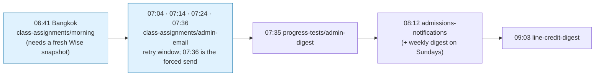
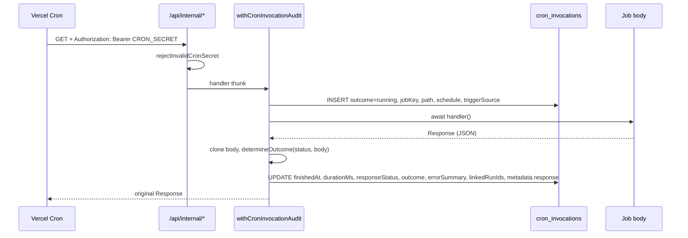
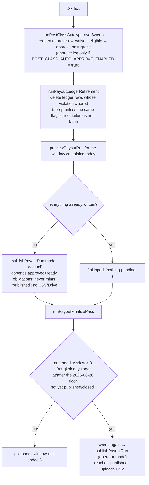
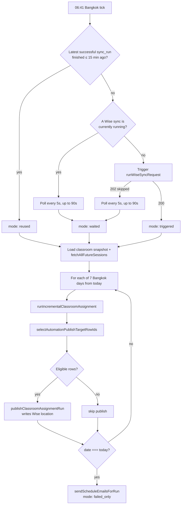

# Cron Schedule

**Status:** Stable. **Authoritative source:** [`vercel.json`](../../vercel.json).

Every scheduled job in BGScheduler is a Vercel Cron entry. Vercel reads `vercel.json` at deploy time and, on each tick, issues an HTTP request to the configured `path` carrying `Authorization: Bearer $CRON_SECRET`. The code models that request as a `GET` — every scheduled route exports `GET`, the registry records `routeMethod: "GET"` for all 17 scheduled jobs, and the Wise sync route annotates its handler "Vercel cron triggers via GET" ([`sync-wise/route.ts:68`](../../src/app/api/internal/sync-wise/route.ts)). There is no in-process scheduler anywhere in the codebase — **if a handler is not listed in `vercel.json`, nothing fires it automatically.**

There are **17 cron entries** in `vercel.json` ([`vercel.json:3-72`](../../vercel.json)) and **22 route handlers** under `src/app/api/internal/`. The 5 handlers with no entry are listed in [Internal handlers without a cron schedule](#internal-handlers-without-a-cron-schedule). The in-app registry mirrors that shape exactly: **22 entries, of which 5 carry `manualOnly: true`**, so 17 + 5 = 22 in both directions ([`cron-registry.ts:47-399`](../../src/lib/data-health/cron-registry.ts)).

`vercel.json` is 73 lines and carries exactly two keys — `regions` and `crons`. All deployments run in the `sin1` region ([`vercel.json:2`](../../vercel.json)), and there is **no `functions` block**: every timeout on this page is the route file's own `export const maxDuration`, not platform config.

This page is the mechanical reference — schedule, endpoint, auth, timeout, guard, and what each handler does. Request/response bodies live in [`api/internal-crons.md`](api/internal-crons.md); table columns live in [`database/index.md`](database/index.md); feature meaning and data flows live in the corresponding [`features/*`](../features/) docs; incident reading of the evidence tables lives in [`operations/observability.md`](../operations/observability.md).

**Two files must stay in lockstep.** `vercel.json` is what the platform schedules; [`src/lib/data-health/cron-registry.ts`](../../src/lib/data-health/cron-registry.ts) is the in-app mirror that `/data-health`, the manual job runner, and the cron watchdog all read. Three tests bind them:

- `SCHEDULED_CRON_JOBS` (registry rows with `manualOnly: false`, [`cron-registry.ts:401`](../../src/lib/data-health/cron-registry.ts)) must equal `vercel.json`'s `crons` array by path and schedule ([`cron-registry.test.ts:19-32`](../../src/lib/data-health/__tests__/cron-registry.test.ts)).
- Every registry `path` must resolve to a real `route.ts`, and every registry `maxDurationSeconds` must equal the route's exported `maxDuration` ([`cron-registry.test.ts:50-73`](../../src/lib/data-health/__tests__/cron-registry.test.ts)).
- `vercel.json` must contain exactly the 17 known paths on their pinned schedules, and no two schedules may ever fire in the same UTC minute ([`vercel-crons.test.ts:17-35`](../../src/__tests__/vercel-crons.test.ts), [`:100-127`](../../src/__tests__/vercel-crons.test.ts)).

Adding a cron therefore means editing both files and, if it can collide, moving it to a free minute.

---

## Cron registry (authoritative)

Rows are in `vercel.json` order. Schedules are **UTC**; the business timezone is `Asia/Bangkok` (UTC+7), which is what the daily and weekly jobs' health expectations are computed against.

| # | Path | Schedule (UTC) | Bangkok | Registry key | `maxDuration` | What it does |
|---|---|---|---|---|---|---|
| 1 | `/api/internal/sync-wise` | `*/30 * * * *` | :00 / :30 hourly | `wise_snapshot` | 800s | Full Wise ETL → new snapshot → atomic promote |
| 2 | `/api/internal/sync-sales-dashboard` | `10,40 * * * *` | :10 / :40 hourly | `sales_dashboard` | 800s | Re-import refreshable sales sheets + active projection |
| 3 | `/api/internal/sync-competitor-intelligence` | `28 18 * * 0` | Mon 01:28 weekly | `competitor_intelligence` | 800s | Crawl competitor sources under a budget cap, normalize, AI-summarize |
| 4 | `/api/internal/sync-credit-control` | `20,50 * * * *` | :20 / :50 hourly | `credit_control` | 800s | Rebuild the prepaid-credit depletion snapshot |
| 5 | `/api/internal/sync-progress-tests` | `25,55 * * * *` | :25 / :55 hourly | `progress_tests` | 300s | Recompute every-8-classes progress-test cycle state |
| 6 | `/api/internal/progress-tests/admin-digest` | `35 0 * * *` | 07:35 daily | `progress_tests_digest` | 300s | Email admins the approaching/due progress-test digest |
| 7 | `/api/internal/sync-wise-activity` | `2,17,32,47 * * * *` | :02/:17/:32/:47 hourly | `wise_activity` | 800s | Mirror Wise audit events into the persisted event store |
| 8 | `/api/internal/sync-post-class-feedback` | `13,43 * * * *` | :13 / :43 hourly | `post_class_feedback` | 800s | Rolling 4-day feedback collection + AI review + retries + hygiene |
| 9 | `/api/internal/post-class-feedback-backfill` | `23,53 * * * *` | :23 / :53 hourly | `post_class_feedback_backfill` | 800s | Drain the oldest unreconciled feedback history window |
| 10 | `/api/internal/post-class-feedback/payout-accrual` | `33 * * * *` | :33 hourly | `post_class_feedback_payout_accrual` | 800s | Unattended charging: sweep → retire → accrue → finalize |
| 11 | `/api/internal/sync-leave-requests` | `15,45 * * * *` | :15 / :45 hourly | `leave_requests` | 800s | Pull leave-form rows from Sheets, match tutors, notify admins |
| 12 | `/api/internal/class-assignments/morning` | `41 23 * * *` | 06:41 daily | `classroom_morning` | 800s | Assign rooms for a 7-day horizon, publish, email tutors |
| 13 | `/api/internal/class-assignments/admin-email` | `4,14,24,36 0 * * *` | 07:04–07:36 daily | `classroom_admin_email` | 300s | Send (or retry) the daily admin classroom summary |
| 14 | `/api/internal/student-promotions/july-1` | `5 17 30 6 *` | 1 Jul 00:05 (annual) | `student_promotions_july_1` | 800s | One-shot Wise grade/course promotion writeback |
| 15 | `/api/internal/cron-watchdog` | `7,37 * * * *` | :07 / :37 hourly | `cron_watchdog` | 300s | Sweep every cron's health, email admins on new failures, prune audit rows |
| 16 | `/api/internal/admissions-notifications` | `12 1 * * *` | 08:12 daily | `admissions_notifications` | 300s | Deadline reminders daily; weekly digest on Bangkok Sundays |
| 17 | `/api/internal/line-credit-digest` | `3 2 * * *` | 09:03 daily | `line_credit_digest` | 300s | Push the 7-day credit-runout digest to registered LINE staff groups |

Schedule rows: [`vercel.json`](../../vercel.json). Registry rows with labels, cadence, and lateness budgets: [`cron-registry.ts:47-399`](../../src/lib/data-health/cron-registry.ts). `maxDuration` values are read from each route file and asserted equal to the registry by test.

Cadence breakdown: **8** half-hourly, **1** every 15 minutes (Wise activity), **1** hourly (payout accrual), **5** daily, **1** weekly, **1** dated one-shot.

### Stagger

Two crons firing in the same UTC minute contend for the same Wise rate limit and Neon connection pool. The Wise client's concurrency limiter is per-invocation, not global, so keeping every job on its own minute is the only lever that prevents contention. A regression test expands every schedule field and fails on any pairwise collision ([`vercel-crons.test.ts:107-127`](../../src/__tests__/vercel-crons.test.ts)); the comment records that six such collisions existed before daily calendar jobs were moved off minutes the half-hourly syncs already owned.


```mermaid
gantt
    title One 60-minute UTC cycle — the minute each sub-daily cron may fire
    dateFormat HH:mm
    axisFormat %M
    section Wise-facing
    Wise snapshot :00 / :30              :a1, 00:00, 2m
    Wise snapshot                        :a2, 00:30, 2m
    Wise activity :02 :17 :32 :47        :b1, 00:02, 2m
    Wise activity                        :b2, 00:17, 2m
    Wise activity                        :b3, 00:32, 2m
    Wise activity                        :b4, 00:47, 2m
    Credit control :20 / :50             :c1, 00:20, 2m
    Credit control                       :c2, 00:50, 2m
    Progress tests :25 / :55             :d1, 00:25, 2m
    Progress tests                       :d2, 00:55, 2m
    Post-class collection :13 / :43      :e1, 00:13, 2m
    Post-class collection                :e2, 00:43, 2m
    Post-class backfill :23 / :53        :f1, 00:23, 2m
    Post-class backfill                  :f2, 00:53, 2m
    section Google / Sheets
    Sales dashboard :10 / :40            :g1, 00:10, 2m
    Sales dashboard                      :g2, 00:40, 2m
    Leave requests :15 / :45             :h1, 00:15, 2m
    Leave requests                       :h2, 00:45, 2m
    Payout accrual :33 hourly            :i1, 00:33, 2m
    section Meta
    Cron watchdog :07 / :37              :j1, 00:07, 2m
    Cron watchdog                        :j2, 00:37, 2m
```

Firing order within each half hour: `00` Wise snapshot → `02` Wise activity → `07` watchdog → `10` sales → `13` post-class collection → `15` leave requests → `17` Wise activity → `20` credit control → `23` post-class backfill → `25` progress tests; the second half repeats at `+30` with the payout accrual added at `33`.

**Why Wise activity runs every 15 minutes, not 30.** The activity mirror is the only source of feedback-submission timestamps, so an event written minutes before a `23:59:59.999` Bangkok deadline is mirrored the same evening instead of after midnight. This is a freshness change only — the verdict always reads the event's own immutable timestamp ([`vercel-crons.test.ts:137-146`](../../src/__tests__/vercel-crons.test.ts)). Minutes `2, 17, 32, 47` are asserted free of every other cron ([`:148-161`](../../src/__tests__/vercel-crons.test.ts)).

The five daily jobs **chain** rather than stagger. They all land in the Bangkok morning, and the classroom pair encodes an explicit dependency:


```mermaid
flowchart LR
    A["06:41 Bangkok<br/>class-assignments/morning<br/>(needs a fresh Wise snapshot)"] --> B["07:04 · 07:14 · 07:24 · 07:36<br/>class-assignments/admin-email<br/>retry window; 07:36 is the forced send"]
    C["07:35 progress-tests/admin-digest"]
    D["08:12 admissions-notifications<br/>(+ weekly digest on Sundays)"]
    E["09:03 line-credit-digest"]
    B --> C --> D --> E
    style A fill:#e0f2fe,stroke:#0369a1
    style B fill:#e0f2fe,stroke:#0369a1
```

The morning automation waits on the Wise snapshot; the admin email waits on the morning automation — see [cron 12](#12-classroom-morning-automation--apiinternalclass-assignmentsmorning) and [cron 13](#13-classroom-admin-email--apiinternalclass-assignmentsadmin-email).

---

## Shared mechanics

### 1. Authentication — `CRON_SECRET` only

`src/middleware.ts` treats the entire `/api/internal/` namespace as a public route ([`middleware.ts:24`](../../src/middleware.ts)), so Auth.js never runs for these paths and each handler does its own bearer check.

The shared helper is [`src/lib/internal/cron-auth.ts`](../../src/lib/internal/cron-auth.ts):

- `getCronSecretStatus(request)` → `"valid" | "invalid" | "missing-secret"`. Compares `Authorization` against `` `Bearer ${process.env.CRON_SECRET}` `` with `timingSafeEqual`, guarded by a length pre-check ([`cron-auth.ts:12-14`](../../src/lib/internal/cron-auth.ts)). The pre-check exists because `crypto.timingSafeEqual` throws `RangeError` on length-mismatched buffers; it is itself O(1) and does not leak secret length via timing (design ID **REL-07**, spelled out at [`sync-wise/route.ts:12-15`](../../src/app/api/internal/sync-wise/route.ts)).
- `rejectInvalidCronSecret(request)` → `null` on success, `500 Server misconfigured` when `CRON_SECRET` is unset, `401 Unauthorized` otherwise ([`cron-auth.ts:19-26`](../../src/lib/internal/cron-auth.ts)).

An unset `CRON_SECRET` fails closed as a 500 rather than silently accepting everything.

Six routes predate the shared helper and inline a byte-identical copy of the same comparison: `sync-wise` ([`:11-29`](../../src/app/api/internal/sync-wise/route.ts)), `sync-sales-dashboard` ([`:15-22`](../../src/app/api/internal/sync-sales-dashboard/route.ts)), `sync-competitor-intelligence` ([`:11-18`](../../src/app/api/internal/sync-competitor-intelligence/route.ts)), `sync-credit-control` ([`:18-31`](../../src/app/api/internal/sync-credit-control/route.ts)), `sync-room-utilization` ([`:12-24`](../../src/app/api/internal/sync-room-utilization/route.ts)), and `student-promotions/july-1` ([`:10-17`](../../src/app/api/internal/student-promotions/july-1/route.ts)). Behaviour is identical; only the import differs. `sync-progress-tests` imports `getCronSecretStatus` ([`:3`](../../src/app/api/internal/sync-progress-tests/route.ts)); every other route imports `rejectInvalidCronSecret`.

### 2. Invocation audit — `cron_invocations`

Every handler except `student-promotions/july-1` wraps its work in `withCronInvocationAudit` ([`cron-audit.ts:191-206`](../../src/lib/data-health/cron-audit.ts)), which produces *direct* evidence that a route fired, independent of whatever domain run table the job writes.


```mermaid
sequenceDiagram
    participant V as Vercel Cron
    participant R as /api/internal/*
    participant A as withCronInvocationAudit
    participant DB as cron_invocations
    participant J as Job body

    V->>R: GET + Authorization: Bearer CRON_SECRET
    R->>R: rejectInvalidCronSecret
    R->>A: handler thunk
    A->>DB: INSERT outcome=running, jobKey, path, schedule, triggerSource
    A->>J: await handler()
    J-->>A: Response (JSON)
    A->>A: clone body, determineOutcome(status, body)
    A->>DB: UPDATE finishedAt, durationMs, responseStatus, outcome, errorSummary, linkedRunIds, metadata.response
    A-->>V: original Response
```

Reading the table correctly requires knowing:

- The row is inserted **before** the job runs, so a function killed by the platform timeout leaves a stranded `outcome="running"` row rather than no evidence at all ([`cron-audit.ts:131-159`](../../src/lib/data-health/cron-audit.ts)).
- The `jobKey` must exist in the registry; an unknown key writes no row at all ([`cron-audit.ts:132-133`](../../src/lib/data-health/cron-audit.ts)).
- Outcome classification ([`cron-audit.ts:108-117`](../../src/lib/data-health/cron-audit.ts)): body `skipped === true` or an `error`/`message` containing `"already running"` → `skipped`; body `ok === false` / `success === false` → `failed`; HTTP `202` → `skipped`; HTTP ≥ 400 → `failed`; otherwise `success`. Note the `skipped` check is `=== true` — a string `skipped` value (used by the backfill and payout routes) does **not** classify as skipped.
- A thrown handler is caught, converted to a synthetic `500 { error }`, audited as `failed`, and returned — the audit never swallows the failure and never re-throws ([`cron-audit.ts:200-204`](../../src/lib/data-health/cron-audit.ts)).
- Audit writes are best-effort; an insert/update failure is `console.error`-logged and the job proceeds ([`cron-audit.ts:155-158`](../../src/lib/data-health/cron-audit.ts), [`:186-188`](../../src/lib/data-health/cron-audit.ts)).
- `linkedRunIds` opportunistically extracts `syncRunId`, `result.syncRunId`/`result.id`, `results.length`, and `projectionResult.runId`/`.id` so an invocation joins back to its domain run row ([`cron-audit.ts:37-59`](../../src/lib/data-health/cron-audit.ts)).
- `metadata.response` is a **size-capped digest**, not the body: top-level scalars only, strings truncated at 200 chars, arrays/objects collapsed to their size, whole digest capped at 2,048 bytes ([`cron-audit.ts:61-106`](../../src/lib/data-health/cron-audit.ts)). Nothing reads it — health goes through `errorSummary`, `linkedRunIds`, `durationMs`, `responseStatus`.
- Table shape and indexes: [`schema.ts:479-499`](../../src/lib/db/schema.ts).

**Retention.** The table is append-only and used to grow without bound. The watchdog now prunes it on every sweep: a row is deleted only when it is **both** older than 90 days **and** outside the newest 8 rows for its `job_key`, so an annual job keeps its proof forever ([`cron-retention.ts:16`](../../src/lib/data-health/cron-retention.ts), [`:32-55`](../../src/lib/data-health/cron-retention.ts); invoked at [`cron-watchdog.ts:380-385`](../../src/lib/internal/cron-watchdog.ts) in its own try/catch so a failed prune never suppresses an alert).

**One scheduled route is not audit-wrapped**: `/api/internal/student-promotions/july-1` returns directly ([`route.ts:19-48`](../../src/app/api/internal/student-promotions/july-1/route.ts)). See [cron 14](#14-student-promotions-apply--apiinternalstudent-promotionsjuly-1) and the open questions.

### 3. Health derivation

`/data-health` and the watchdog share one derivation ([`dashboard.ts:431-477`](../../src/lib/data-health/dashboard.ts) → [`status.ts:195-363`](../../src/lib/data-health/status.ts)). Per registry job:

1. **Evidence.** Two sources: *direct* — the newest `cron_invocations` rows for the key (only rows with `triggerSource = "cron"` count toward scheduled health, [`dashboard.ts:439`](../../src/lib/data-health/dashboard.ts)); and *inferred* — the job's own run table, picked by `pickJobRuns` ([`dashboard.ts:142-341`](../../src/lib/data-health/dashboard.ts)). Invocations are ranked per `jobKey` (newest 8, within a 45-day window) so chatty 30-minute jobs cannot push a daily job's only row out of view ([`dashboard.ts:812-826`](../../src/lib/data-health/dashboard.ts)). If `cron_invocations` does not exist yet, health silently falls back to inferred proof ([`dashboard.ts:846-853`](../../src/lib/data-health/dashboard.ts)).
2. **Expected window.** `manualOnly` → none. `expectedBangkokWeekday` set → weekly branch. `expectedBangkokMinute` or a `WindowStart/End` pair set → daily branch. Otherwise the interval branch, which parses **only the minute field** of the cron expression ([`status.ts:57-69`](../../src/lib/data-health/status.ts), [`:167-176`](../../src/lib/data-health/status.ts)).
3. **Status ladder**, in order ([`status.ts:195-363`](../../src/lib/data-health/status.ts)): `manual-only` → `failing` (a `running` invocation or run row older than `maxDurationSeconds + 60s`, [`:238-258`](../../src/lib/data-health/status.ts)) → `running` → `unknown` (no evidence at all) → `failing` (latest failure newer than latest success) → `late` (interval: last seen older than `lateAfterMinutes`; calendar: window end + `lateAfterMinutes` passed with no run since the window opened) → `healthy`.
4. A `skipped` invocation counts as success for `lastSuccessAt` ([`status.ts:227-230`](../../src/lib/data-health/status.ts)) — a single-flight skip is still proof the route fired.

Which run table each job's inferred evidence comes from ([`dashboard.ts:752-806`](../../src/lib/data-health/dashboard.ts) reads 14 sources; [`pickJobRuns`](../../src/lib/data-health/dashboard.ts) maps them):

| Registry key | Inferred evidence |
|---|---|
| `wise_snapshot` | `sync_runs` |
| `wise_activity` | `wise_activity_sync_runs` |
| `sales_dashboard` | `sales_dashboard_import_runs` ∪ `sales_dashboard_projection_import_runs`, merged by `startedAt` ([`:179-187`](../../src/lib/data-health/dashboard.ts)) |
| `competitor_intelligence` | `competitor_sync_runs` |
| `credit_control` | `credit_control_sync_runs` |
| `leave_requests` | `leave_request_sync_runs` |
| `progress_tests` | `progress_test_sync_runs` |
| `progress_tests_digest` | `progress_test_admin_digest_runs`; a `skipped` digest is success ([`:225-233`](../../src/lib/data-health/dashboard.ts)) |
| `post_class_feedback` | `post_class_sync_runs` |
| `post_class_feedback_digest` / `_day_after` / `_deadline` | `post_class_notification_runs` filtered by `kind` ([`:248-272`](../../src/lib/data-health/dashboard.ts)) |
| `student_promotions_july_1` | **none, deliberately** — fail closed to `unknown` ([`:274-286`](../../src/lib/data-health/dashboard.ts)) |
| `classroom_morning` | `classroom_assignment_runs` where `automationBatchId IS NOT NULL OR createdBy LIKE 'cron%'` ([`:780-785`](../../src/lib/data-health/dashboard.ts)) |
| `classroom_admin_email` | `classroom_admin_email_runs` |
| `cron_watchdog` | **none** — direct `cron_invocations` proof only ([`:306-315`](../../src/lib/data-health/dashboard.ts)) |
| `post_class_feedback_backfill`, `post_class_feedback_payout_accrual`, `admissions_notifications`, `line_credit_digest`, `line_backlog_recovery`, `room_utilization` | fall through to the **`room_utilization_sessions` fallback** ([`:317-340`](../../src/lib/data-health/dashboard.ts)) — see open question 4 |

### 4. The watchdog closes the loop

[`/api/internal/cron-watchdog`](../../src/app/api/internal/cron-watchdog/route.ts) runs the same derivation every 30 minutes and emails admins ([`cron-watchdog.ts`](../../src/lib/internal/cron-watchdog.ts)):

- **Alertable statuses** are `failing`, `late`, `unknown` ([`cron-watchdog.ts:53`](../../src/lib/internal/cron-watchdog.ts), [`:146-148`](../../src/lib/internal/cron-watchdog.ts)).
- **Self-exclusion** — never alerts on `cron_watchdog` and skips every `manualOnly` job ([`cron-watchdog.ts:40`](../../src/lib/internal/cron-watchdog.ts), [`:167`](../../src/lib/internal/cron-watchdog.ts)).
- **Episode dedup** — one email per job per failure episode, persisted in `cron_alert_state` ([`schema.ts:501-514`](../../src/lib/db/schema.ts)). An episode opens with `lastAlertOutcome = "alerted"` and closes when a recovery notice goes out, which re-arms the next alert ([`cron-watchdog.ts:159-178`](../../src/lib/internal/cron-watchdog.ts), [`:494-519`](../../src/lib/internal/cron-watchdog.ts)).
- **Single-flight without transactions** — neon-http has neither transactions nor advisory locks, so the sweep claims a sentinel `cron_alert_state` row (`__watchdog_sweep_lock`) via one conditional upsert with a `setWhere` guard; a crashed holder's lock is reclaimable after 6 minutes ([`cron-watchdog.ts:42-51`](../../src/lib/internal/cron-watchdog.ts), [`:305-330`](../../src/lib/internal/cron-watchdog.ts)).
- **Recipients** are `admin_users` rows with `allowedPages IS NULL` — full-access admins only, because page-restricted users cannot open the `/data-health` link the alert points at ([`cron-watchdog.ts:257-269`](../../src/lib/internal/cron-watchdog.ts)).
- **Delivery-gated state** — episode state is written only after at least one recipient accepted, so a total delivery failure retries next sweep ([`cron-watchdog.ts:482-485`](../../src/lib/internal/cron-watchdog.ts)); a partial delivery still closes the episode, a documented tradeoff ([`cron-watchdog.ts:11-17`](../../src/lib/internal/cron-watchdog.ts)).
- **Synthetic entry** — the sweep also injects a non-route `post_class_payout_window` job derived from payout-window staleness, so a payout window that never reached `published` alerts even when the accrual cron itself fires on time ([`cron-watchdog.ts:84-123`](../../src/lib/internal/cron-watchdog.ts), [`payout-window-health.ts:13-23`](../../src/lib/post-class-feedback/payout-window-health.ts), [`:50-87`](../../src/lib/post-class-feedback/payout-window-health.ts)). The check arms itself only while the accrual registry entry has a schedule ([`payout-window-health.ts:102`](../../src/lib/post-class-feedback/payout-window-health.ts)), and only for windows at or after the automation floor `2026-08-26` ([`:104-110`](../../src/lib/post-class-feedback/payout-window-health.ts)). A failure inside that check degrades to "no payout entry this sweep" rather than failing the sweep ([`cron-watchdog.ts:125-143`](../../src/lib/internal/cron-watchdog.ts)).
- **Missing table fails safe** — if `cron_alert_state` does not exist yet, alerting is disabled rather than sending un-deduped spam every sweep ([`cron-watchdog.ts:403-417`](../../src/lib/internal/cron-watchdog.ts)).
- **Retention rides along** — `pruneCronInvocations` runs first, in its own try/catch ([`cron-watchdog.ts:380-385`](../../src/lib/internal/cron-watchdog.ts)).

### 5. Single-flight guards

Vercel can overlap invocations when a slow run is still holding the function at the next tick, so every heavy job carries a guard in its own run table. The reference implementation is the Wise snapshot ([`run-wise-sync.ts:88-118`](../../src/lib/sync/run-wise-sync.ts)):

1. Fail any `running` row older than 20 minutes with an explicit "likely timed out or the request was aborted" summary ([`run-wise-sync.ts:10`](../../src/lib/sync/run-wise-sync.ts), [`:39-40`](../../src/lib/sync/run-wise-sync.ts), [`:51-72`](../../src/lib/sync/run-wise-sync.ts)).
2. If a `running` row remains, return `202` with `skipped: true` — which the audit classifies as `skipped`, not `failed` ([`run-wise-sync.ts:120-150`](../../src/lib/sync/run-wise-sync.ts)).
3. Otherwise insert a `running` row; a `23505` unique violation means a racing invocation won, so re-read and skip ([`run-wise-sync.ts:99-117`](../../src/lib/sync/run-wise-sync.ts)).

Credit control and progress tests replicate this verbatim with their own 20-minute constants ([`credit-control/run-sync-request.ts:9-12`](../../src/lib/credit-control/run-sync-request.ts), [`progress-tests/run-sync-request.ts:10-11`](../../src/lib/progress-tests/run-sync-request.ts), [`progress-tests/config.ts:27`](../../src/lib/progress-tests/config.ts)). Competitor intelligence sweeps stale rows then throws a plain `Error("... already running")` ([`competitor-intelligence/sync.ts:40`](../../src/lib/competitor-intelligence/sync.ts), [`:501-509`](../../src/lib/competitor-intelligence/sync.ts)). Wise activity, leave requests, and post-class feedback each raise a typed `…AlreadyRunningError` that the route maps to `409` ([`wise-activity/sync.ts:51`](../../src/lib/wise-activity/sync.ts), [`leave-requests/sync.ts:21-26`](../../src/lib/leave-requests/sync.ts), [`post-class-feedback/repository.ts:266`](../../src/lib/post-class-feedback/repository.ts)). Admissions notifications use a partial unique index on the running row with a 30-minute stale sweep and return `{ skipped: true }` → `202` ([`admissions/notifications.ts:73`](../../src/lib/admissions/notifications.ts), [`:893-919`](../../src/lib/admissions/notifications.ts)). The post-class admin digest takes a Postgres advisory lock inside a transaction ([`post-class-feedback/notifications.ts:1133-1134`](../../src/lib/post-class-feedback/notifications.ts)). The watchdog uses the sentinel-row lock described above.

### 6. `GET` vs `POST`, and who else may call

Every scheduled route exports `GET`. Some also export `POST` for manual use, and a subset of those additionally accept an Auth.js session instead of the cron secret:

| Endpoint | `GET` | `POST` | `POST` accepts a session? |
|---|---|---|---|
| `sync-wise` | yes | yes | any signed-in session ([`route.ts:45-59`](../../src/app/api/internal/sync-wise/route.ts)) |
| `sync-sales-dashboard` | yes | yes | any session with an email ([`route.ts:29-36`](../../src/app/api/internal/sync-sales-dashboard/route.ts)) |
| `sync-credit-control` | yes | yes | any signed-in session ([`route.ts:43-56`](../../src/app/api/internal/sync-credit-control/route.ts)) |
| `sync-progress-tests` | yes | yes | any signed-in session ([`route.ts:19-32`](../../src/app/api/internal/sync-progress-tests/route.ts)) |
| `sync-competitor-intelligence` | yes | yes | only via `requireCompetitorIntelligenceSession`, which checks `allowedPages`/`role` ([`route.ts:31-36`](../../src/app/api/internal/sync-competitor-intelligence/route.ts), [`access.ts:19-30`](../../src/lib/competitor-intelligence/access.ts)) |
| `sync-leave-requests` | yes | yes | no — cron secret on both verbs ([`route.ts:30-36`](../../src/app/api/internal/sync-leave-requests/route.ts)) |
| `student-promotions/july-1` | yes | yes (`POST` delegates to `GET`) | no ([`route.ts:46-48`](../../src/app/api/internal/student-promotions/july-1/route.ts)) |
| `admissions-notifications` | yes | yes (`runType` in the body) | no ([`route.ts:91-114`](../../src/app/api/internal/admissions-notifications/route.ts)) |
| `cron-watchdog` | yes | yes | no ([`route.ts:28-34`](../../src/app/api/internal/cron-watchdog/route.ts)) |
| `sync-wise-activity`, `sync-post-class-feedback`, `post-class-feedback-backfill`, `post-class-feedback/payout-accrual`, `progress-tests/admin-digest`, `class-assignments/morning`, `class-assignments/admin-email`, `line-credit-digest` | yes | — | n/a |

`sync-room-utilization` is the inverse — it exports **only** `POST` ([`route.ts:26`](../../src/app/api/internal/sync-room-utilization/route.ts)), which is precisely why it cannot be a Vercel cron.

When the session path is taken the audit row records `triggerSource: "admin"` plus the actor email instead of `"cron"` — and, because health only counts `"cron"` rows as direct proof, a manual run does not silence a `late` status.

---

## Per-cron detail

Maturity badges in the **Feature** rows are applied from the documentation maturity map, not inferred from code; no `@deprecated` or status marker exists in source.

### 1. Wise snapshot sync — `/api/internal/sync-wise`

| | |
|---|---|
| Schedule | `*/30 * * * *` — every 30 minutes ([`vercel.json:4-7`](../../vercel.json)) |
| `maxDuration` | 800s, "Pro-plan headroom for full Wise syncs" ([`route.ts:7`](../../src/app/api/internal/sync-wise/route.ts)) |
| Job body | `runWiseSyncRequest()` → `runFullSync()` ([`run-wise-sync.ts:142-167`](../../src/lib/sync/run-wise-sync.ts)) |
| Run table | `sync_runs` |
| Feature | [Tutor Search](../features/tutor-search.md) — **stable** |

The spine job. Acquires the single-flight guard, runs fetch → normalize → persist → validate → promote against `WISE_INSTITUTE_ID` (falling back to the literal `696e1f4d90102225641cc413`, [`run-wise-sync.ts:145`](../../src/lib/sync/run-wise-sync.ts)), and on success calls `revalidateTag("snapshot", { expire: 0 })` so cached Server Component reads pick up the new snapshot immediately ([`run-wise-sync.ts:160-162`](../../src/lib/sync/run-wise-sync.ts)). Returns `200` on success, `500` on failure, `202` when already running ([`:148-150`](../../src/lib/sync/run-wise-sync.ts), [`:164-166`](../../src/lib/sync/run-wise-sync.ts)). The promotion gate refuses to activate a candidate snapshot when ≥ 50% of identity groups are unresolved, but the run still records `success` ([`orchestrator.ts:472-476`](../../src/lib/sync/orchestrator.ts)).

This is also the only cron another cron waits on — see [cron 12](#12-classroom-morning-automation--apiinternalclass-assignmentsmorning).

### 2. Sales dashboard sync — `/api/internal/sync-sales-dashboard`

| | |
|---|---|
| Schedule | `10,40 * * * *` ([`vercel.json:8-11`](../../vercel.json)) |
| `maxDuration` | 800s ([`route.ts:11`](../../src/app/api/internal/sync-sales-dashboard/route.ts)) |
| Job body | `importRefreshableSalesSources()` then `importActiveSalesDashboardProjectionSource()` ([`route.ts:53-60`](../../src/app/api/internal/sync-sales-dashboard/route.ts)) |
| Run tables | sales import runs + projection import runs, merged for health ([`dashboard.ts:179-187`](../../src/lib/data-health/dashboard.ts)) |
| Feature | [Sales Dashboard](../features/sales-dashboard.md) — **stable** |

Two imports in sequence inside one invocation. "Refreshable" is a lifecycle rule, not a flag: the current Bangkok month always refreshes; the previous month refreshes only through the 7th and is **auto-finalized** from the 8th; archived and finalized months never refresh ([`lifecycle.ts:8-19`](../../src/lib/sales-dashboard/lifecycle.ts), [`:35-42`](../../src/lib/sales-dashboard/lifecycle.ts), applied at [`data.ts:567-585`](../../src/lib/sales-dashboard/data.ts)). The projection import runs only when an active projection source exists ([`data.ts:728-735`](../../src/lib/sales-dashboard/data.ts)).

The cron actor is the literal `cron@begifted.local` ([`route.ts:26`](../../src/app/api/internal/sync-sales-dashboard/route.ts)); a session-authenticated `POST` substitutes the signed-in email but still passes `triggerType: "cron"` to both imports ([`route.ts:53-60`](../../src/app/api/internal/sync-sales-dashboard/route.ts)).

Distinct failure mode: this job reads Google Sheets through a stored OAuth token, and a `MissingGoogleSheetsTokenError` maps to **`409`**, not `500` ([`route.ts:63-65`](../../src/app/api/internal/sync-sales-dashboard/route.ts), [`google-oauth.ts:34-39`](../../src/lib/sales-dashboard/google-oauth.ts)) — a revoked or missing connection is an operator action, not a code fault. Both statuses audit as `failed`.

### 3. Competitor intelligence sync — `/api/internal/sync-competitor-intelligence`

| | |
|---|---|
| Schedule | `28 18 * * 0` UTC = **Monday 01:28 Bangkok**, weekly ([`vercel.json:12-15`](../../vercel.json)) |
| `maxDuration` | 800s ([`route.ts:7`](../../src/app/api/internal/sync-competitor-intelligence/route.ts)) |
| Job body | `runCompetitorIntelligenceSync({ triggerType })` ([`route.ts:48-51`](../../src/app/api/internal/sync-competitor-intelligence/route.ts)) |
| Run table | `competitor_sync_runs` |
| Feature | [Competitor Intelligence](../features/competitor-intelligence.md) — **stable** |

The UTC expression fires **Sunday** 18:28; +7 hours lands on **Monday** 01:28 Bangkok, which is what the registry records (`expectedBangkokWeekday: 1`, `expectedBangkokMinute: 88`, `lateAfterMinutes: 120` — [`cron-registry.ts:93-109`](../../src/lib/data-health/cron-registry.ts)). This is the only job whose health uses the weekly expectation branch ([`status.ts:137-165`](../../src/lib/data-health/status.ts)).

Per run: seed default entities/sources, then for every active non-SERP source insert a `competitor_source_runs` row, check the monthly vendor budget, fetch, record vendor usage, and store normalized evidence items; then repeat for active SERP keywords ([`competitor-intelligence/sync.ts:536-640`](../../src/lib/competitor-intelligence/sync.ts)). A source whose estimated cost would breach its cap is recorded as `success` with `skippedReason: "Monthly vendor budget cap reached"` rather than failed ([`:555-569`](../../src/lib/competitor-intelligence/sync.ts)); the cap is `COMPETITOR_<PROVIDER>_MONTHLY_CAP_USD`, else `COMPETITOR_INTEL_MONTHLY_CAP_USD`, else 250 USD (0 for website/manual sources) ([`budget.ts:18-25`](../../src/lib/competitor-intelligence/budget.ts)). Per-source failures are isolated into the run's error list, never abort the run ([`:614-626`](../../src/lib/competitor-intelligence/sync.ts)). The cron actor is `cron@begifted.local` ([`:500`](../../src/lib/competitor-intelligence/sync.ts)).

Guard: sweep stale running rows, then reject if a `running` row survives. The thrown message contains "already running", which the route maps to `409` and the audit classifies as `skipped` rather than `failed` ([`route.ts:57-60`](../../src/app/api/internal/sync-competitor-intelligence/route.ts)). A run that completes with `status !== "success"` returns `500` with the result body attached ([`route.ts:52-54`](../../src/app/api/internal/sync-competitor-intelligence/route.ts)).

### 4. Credit control sync — `/api/internal/sync-credit-control`

| | |
|---|---|
| Schedule | `20,50 * * * *` ([`vercel.json:16-19`](../../vercel.json)) |
| `maxDuration` | 800s ([`route.ts:14`](../../src/app/api/internal/sync-credit-control/route.ts)); registry mirrors 800 ([`cron-registry.ts:119-122`](../../src/lib/data-health/cron-registry.ts)) |
| Job body | `runCreditControlSyncRequest()` → `runCreditControlSync()` ([`credit-control/sync.ts:641`](../../src/lib/credit-control/sync.ts)) |
| Run table | `credit_control_sync_runs` |
| Feature | [Credit Control](../features/credit-control.md) — **stable** |

Fetches students plus a 120-day past window and a 180-day future window of sessions in parallel, pairs them, then fetches per-pair credit balances ([`credit-control/sync.ts:61-63`](../../src/lib/credit-control/sync.ts), [`:657-666`](../../src/lib/credit-control/sync.ts)); writes an inactive candidate snapshot and flips `active` in a single `UPDATE` ([`:668-685`](../../src/lib/credit-control/sync.ts), [`:715`](../../src/lib/credit-control/sync.ts)).

The `maxDuration` carries an unusually specific comment: the route sat at 300s while successful runs took **372–390s** — permanently over its own limit — producing recurring "Task timed out after 300 seconds" failures from 2026-06-16 onward, with each timeout also stranding the `running` row until the watchdog failed it ([`route.ts:7-13`](../../src/app/api/internal/sync-credit-control/route.ts)). The registry entry was later brought into line and now documents why the mirror matters ([`cron-registry.ts:119-121`](../../src/lib/data-health/cron-registry.ts)); the parity test prevents a recurrence ([`cron-registry.test.ts:58-73`](../../src/lib/data-health/__tests__/cron-registry.test.ts)).

### 5. Progress tests sync — `/api/internal/sync-progress-tests`

| | |
|---|---|
| Schedule | `25,55 * * * *` ([`vercel.json:20-23`](../../vercel.json)) |
| `maxDuration` | 300s ([`route.ts:7`](../../src/app/api/internal/sync-progress-tests/route.ts)) |
| Job body | `runProgressTestSyncRequest({ triggerType: "cron" })` ([`route.ts:15`](../../src/app/api/internal/sync-progress-tests/route.ts)) |
| Run table | `progress_test_sync_runs` |
| Feature | [Progress Tests](../features/progress-tests.md) — **stable** |

Loads attended-with-credit sessions from the active credit-control snapshot, resolves each session's teacher through the active Wise snapshot's identity groups, upserts the durable ledger idempotently on `wiseSessionId + wiseStudentId`, recomputes per-enrollment cycle state, and — for enrollments newly crossing into "approaching" — generates an AI summary and emails the most-frequent tutor ([`progress-tests/sync.ts:474-493`](../../src/lib/progress-tests/sync.ts)). Thresholds: due at 8 attended-with-credit classes, teacher heads-up at 6; counting starts 2026-03-01 Bangkok ([`progress-tests/config.ts:8-14`](../../src/lib/progress-tests/config.ts)). On success it sweeps the `progress-tests` cache tag ([`sync.ts:599`](../../src/lib/progress-tests/sync.ts)).

Notification and AI failures are fail-isolated — caught, logged, and never allowed to fail the run ([`sync.ts:484-487`](../../src/lib/progress-tests/sync.ts)). Because this job reads the credit-control snapshot, it is scheduled five minutes after that sync's slot.

### 6. Progress tests admin digest — `/api/internal/progress-tests/admin-digest`

| | |
|---|---|
| Schedule | `35 0 * * *` UTC = **07:35 Bangkok** daily ([`vercel.json:24-27`](../../vercel.json)) |
| `maxDuration` | 300s ([`route.ts:6`](../../src/app/api/internal/progress-tests/admin-digest/route.ts)) |
| Job body | `sendProgressTestAdminDigest()` ([`route.ts:16`](../../src/app/api/internal/progress-tests/admin-digest/route.ts)) |
| Run table | `progress_test_admin_digest_runs` |
| Feature | [Progress Tests](../features/progress-tests.md) — **stable** |

`GET` only, cron secret only. Emails every `admin_users` address the approaching/due student list plus an "Action needed" section of teacher heads-up emails that could not be resolved ([`progress-tests/admin-digest.ts:1-16`](../../src/lib/progress-tests/admin-digest.ts)). Once-per-day idempotency: a terminal run row for today's Bangkok date short-circuits a re-run; nothing to report records a terminal `skipped` row without sending ([`admin-digest.ts:309-358`](../../src/lib/progress-tests/admin-digest.ts)). `result.status === "failed"` maps to `500`; anything else to `200` ([`route.ts:17-18`](../../src/app/api/internal/progress-tests/admin-digest/route.ts)).

Health treats a `skipped` digest as valid proof the job fired ([`dashboard.ts:225-233`](../../src/lib/data-health/dashboard.ts)) — otherwise a quiet week would read as "late".

### 7. Wise activity audit sync — `/api/internal/sync-wise-activity`

| | |
|---|---|
| Schedule | `2,17,32,47 * * * *` — every 15 minutes ([`vercel.json:28-31`](../../vercel.json)) |
| `maxDuration` | 800s ([`route.ts:8`](../../src/app/api/internal/sync-wise-activity/route.ts)) |
| Job body | `syncWiseActivityEvents(db, client, instituteId, { triggerType: "cron" })` ([`route.ts:20-25`](../../src/app/api/internal/sync-wise-activity/route.ts)) |
| Run table | `wise_activity_sync_runs` |
| Feature | [Wise Activity Audit](../features/wise-activity-audit.md) — **stable** |

Cron mode is deliberately narrower than manual mode: **3 days** lookback and **20 pages** max, versus 30 days / 500 pages for a manual backfill, at a fixed page size of 50 ([`wise-activity/sync.ts:8-12`](../../src/lib/wise-activity/sync.ts), [`:160-161`](../../src/lib/wise-activity/sync.ts)). It also stops early on a page that contains only already-persisted events by default (`stopOnKnownEvents`), so a routine tick usually fetches one or two pages; the stop reason (`short_page`, `lookback_reached`, `known_events`, `max_pages`) is recorded in run metadata ([`:234-245`](../../src/lib/wise-activity/sync.ts), [`:258`](../../src/lib/wise-activity/sync.ts)). Abandoned runs are swept before a new run row is inserted; a unique violation on the running row raises `WiseActivitySyncAlreadyRunningError` → `409` ([`:167`](../../src/lib/wise-activity/sync.ts), [`:182`](../../src/lib/wise-activity/sync.ts), [`route.ts:28-30`](../../src/app/api/internal/sync-wise-activity/route.ts)).

The 15-minute cadence exists for the post-class feedback deadline verdicts (see [Stagger](#stagger)).

### 8. Post-class feedback collection — `/api/internal/sync-post-class-feedback`

| | |
|---|---|
| Schedule | `13,43 * * * *` ([`vercel.json:32-35`](../../vercel.json)) |
| `maxDuration` | 800s ([`route.ts:13`](../../src/app/api/internal/sync-post-class-feedback/route.ts)) |
| Job body | `runPostClassFeedbackSync({ triggerType: "cron" })`, then `processPostClassAiReviews()`, `processDuePostClassNotificationRetries()`, and `runPostClassDeductionHygiene()` under `Promise.allSettled` ([`route.ts:22-30`](../../src/app/api/internal/sync-post-class-feedback/route.ts)) |
| Run table | `post_class_sync_runs` |
| Feature | [Post-class Feedback](../features/post-class-feedback.md) — **stable** |

The rolling collector covers a **four-day** Bangkok window ([`post-class-feedback/sync.ts:49`](../../src/lib/post-class-feedback/sync.ts), [`:139-145`](../../src/lib/post-class-feedback/sync.ts)); anything older belongs to the backfill cron ([cron 9](#9-post-class-feedback-historical-drain--apiinternalpost-class-feedback-backfill)). Cron runs hold a 50-detail batch cap so a routine tick can never monopolise the Wise API; only an explicit manual backfill may go to 400 ([`sync.ts:40-47`](../../src/lib/post-class-feedback/sync.ts)). `WISE_INSTITUTE_ID` is required — no literal fallback here ([`sync.ts:1053-1054`](../../src/lib/post-class-feedback/sync.ts)).

The three follow-on passes run under `Promise.allSettled`, so any one failing degrades to `{ failed: true }` in the response instead of failing the invocation ([`route.ts:23-37`](../../src/app/api/internal/sync-post-class-feedback/route.ts)):

- **AI review** — up to 10 pending reviews per tick, hard-capped at 25 ([`ai.ts:119-123`](../../src/lib/post-class-feedback/ai.ts)).
- **Notification retries** — up to 50 due `pending`/`failed`/stale-`sending` deliveries ([`notifications.ts:1090-1125`](../../src/lib/post-class-feedback/notifications.ts)).
- **Deduction hygiene** — the safety-restoring half of the auto-approval sweep, with **no approve leg**: reopen `approved` deductions that lost proof, then waive `pending_review` deductions whose session is no longer eligible (e.g. cancelled in Wise). It releases claims only and never approves, which is why it is not behind the auto-approve flag ([`auto-approval.ts:259-282`](../../src/lib/post-class-feedback/auto-approval.ts), route comment at [`route.ts:26-28`](../../src/app/api/internal/sync-post-class-feedback/route.ts)).

`PostClassFeedbackSyncAlreadyRunningError` → `409`; any other sync error → a generic `500` that discards the message ([`route.ts:39-42`](../../src/app/api/internal/sync-post-class-feedback/route.ts)).

### 9. Post-class feedback historical drain — `/api/internal/post-class-feedback-backfill`

| | |
|---|---|
| Schedule | `23,53 * * * *` ([`vercel.json:36-39`](../../vercel.json)) |
| `maxDuration` | 800s ([`route.ts:12`](../../src/app/api/internal/post-class-feedback-backfill/route.ts)) |
| Job body | `findOldestUnreconciledBackfillWindow()` → `runPostClassBackfillJob()` ([`route.ts:51-69`](../../src/app/api/internal/post-class-feedback-backfill/route.ts)) |
| Run table | `post_class_sync_runs` (shared with cron 8); health falls to the room-utilization fallback — see open question 4 |
| Feature | [Post-class Feedback](../features/post-class-feedback.md) — **stable** |

The only cron that accepts query parameters. A Zod schema validates optional `startDate`/`endDate` (`YYYY-MM-DD`, must be supplied together and ordered), `detailCap` (1–400), and `maxBatches` (1–50) ([`route.ts:19-30`](../../src/app/api/internal/post-class-feedback-backfill/route.ts)); a parse failure returns `400` with `.error.flatten()` **before** the audit wrapper starts ([`route.ts:36-41`](../../src/app/api/internal/post-class-feedback-backfill/route.ts)).

Unattended behaviour: each tick picks the oldest still-unreconciled window automatically — the Bangkok date of the oldest eligible session whose source is not yet `ready`, plus four days, clamped to today — so repeated runs converge without anyone choosing dates by hand ([`backfill-window.ts:9-17`](../../src/lib/post-class-feedback/backfill-window.ts), [`:32-54`](../../src/lib/post-class-feedback/backfill-window.ts)). Cron defaults are deliberately small — `detailCap: 50`, `maxBatches: 1` — with the 400/50 ceilings reserved for a deliberate manual re-drain ([`route.ts:64-68`](../../src/app/api/internal/post-class-feedback-backfill/route.ts)). Nothing to do returns `200 { ok: true, skipped: "nothing-unreconciled" }` ([`route.ts:54-59`](../../src/app/api/internal/post-class-feedback-backfill/route.ts)), which audits as `success` because that `skipped` value is a string, not `true`.

The drain loop stops as soon as a batch fetches fewer details than the cap, or when its batch/wall-clock budget (default 8 batches / 9 minutes) runs out, so it can never overrun the function timeout ([`backfill-job.ts:7-8`](../../src/lib/post-class-feedback/backfill-job.ts), [`:40-52`](../../src/lib/post-class-feedback/backfill-job.ts)).

### 10. Post-class payout accrual — `/api/internal/post-class-feedback/payout-accrual`

| | |
|---|---|
| Schedule | `33 * * * *` — hourly ([`vercel.json:40-43`](../../vercel.json)); pinned by test as "armed for unattended charging" ([`vercel-crons.test.ts:188-192`](../../src/__tests__/vercel-crons.test.ts)) |
| `maxDuration` | 800s ([`route.ts:10`](../../src/app/api/internal/post-class-feedback/payout-accrual/route.ts)) |
| Job body | `runPayoutAccrualPass()` then `runPayoutFinalizePass()` ([`route.ts:30-31`](../../src/app/api/internal/post-class-feedback/payout-accrual/route.ts)) |
| Run table | none read by health — see open question 4; the watchdog's synthetic `post_class_payout_window` entry covers window closure |
| Feature | [Post-class Feedback](../features/post-class-feedback.md) → payout runs — **stable (writes flag-gated by `POST_CLASS_PAYOUT_WRITES_ENABLED` / `POST_CLASS_AUTO_APPROVE_ENABLED`)** |
| Danger | `dangerous: true` — "Appends real payout deductions to the master ledger." ([`cron-registry.ts:254-255`](../../src/lib/data-health/cron-registry.ts)) |

This route moves money, and it was re-armed after incident INC-260829, in which an armed accrual cron converted the entire pending-review backlog into sheet writes with no human decision ([`payout-config.ts:150-156`](../../src/lib/post-class-feedback/payout-config.ts)). The registry comment describes each tick ([`cron-registry.ts:239-244`](../../src/lib/data-health/cron-registry.ts)); the code does this:


```mermaid
flowchart TD
    T[":33 tick"] --> S1["runPostClassAutoApprovalSweep<br/>reopen unproven → waive ineligible → approve past-grace<br/>(approve leg only if POST_CLASS_AUTO_APPROVE_ENABLED = true)"]
    S1 --> R["runPayoutLedgerRetirement<br/>delete ledger rows whose violation cleared<br/>(no-op unless the same flag is true; failure is non-fatal)"]
    R --> P["previewPayoutRun for the window containing today"]
    P --> Q{"everything already written?"}
    Q -- yes --> N["{ skipped: 'nothing-pending' }"]
    Q -- no --> A["publishPayoutRun mode: 'accrual'<br/>appends approved+ready obligations; never mints 'published'; no CSV/Drive"]
    A --> F["runPayoutFinalizePass"]
    N --> F
    F --> W{"an ended window ≥ 3 Bangkok days ago,<br/>at/after the 2026-08-26 floor,<br/>not yet published/closed?"}
    W -- no --> X["{ skipped: 'window-not-ended' }"]
    W -- yes --> Y["sweep again → publishPayoutRun (operator mode)<br/>reaches 'published', uploads CSV"]
```

Key mechanics:

- **Every write still goes through `publishPayoutRun`** under a system actor `system:post-class-payout-accrual`, so it produces the same audited run/line/exception rows a human publish would ([`payout-accrual.ts:29-47`](../../src/lib/post-class-feedback/payout-accrual.ts)).
- **The approve sweep** only touches `pending_review` deductions on `live`-enforced, source-`ready` sessions whose deadline passed at least the grace period ago (default 24h; an explicit `POST_CLASS_AUTO_APPROVE_GRACE_HOURS=0` is charge-at-deadline mode), and only inside the unattended scope — the later of the `2026-08-26` policy floor and the start of the last-ended window ([`auto-approval.ts:43-57`](../../src/lib/post-class-feedback/auto-approval.ts), [`:59-110`](../../src/lib/post-class-feedback/auto-approval.ts), [`payout-config.ts:158-205`](../../src/lib/post-class-feedback/payout-config.ts)). With `POST_CLASS_AUTO_APPROVE_ENABLED` anything but the exact string `"true"`, it approves nothing ([`auto-approval.ts:73`](../../src/lib/post-class-feedback/auto-approval.ts)) and the pass only writes rows a human already approved ([`payout-repository.ts:131-139`](../../src/lib/post-class-feedback/payout-repository.ts)).
- **Retirement** (auto-un-charge by row deletion) is wholly gated on the same flag; with it off, written rows are only ever released by an operator ([`payout-retirement.ts:166-175`](../../src/lib/post-class-feedback/payout-retirement.ts)). A retirement failure is logged and the tick continues ([`payout-accrual.ts:101-122`](../../src/lib/post-class-feedback/payout-accrual.ts)).
- **Sheet writes** additionally require `POST_CLASS_PAYOUT_WRITES_ENABLED === "true"`, enforced at the Google-target boundary ([`payout-config.ts:48-51`](../../src/lib/post-class-feedback/payout-config.ts), [`:125-130`](../../src/lib/post-class-feedback/payout-config.ts)). Flipping either flag off instantly restores human-only money movement.
- **Windows run 26th → 25th**, anchored to the month containing the 25th ([`payout-window.ts:11-12`](../../src/lib/post-class-feedback/payout-window.ts), [`:44-52`](../../src/lib/post-class-feedback/payout-window.ts)). Finalize waits a **3-Bangkok-day settlement lag** after `windowEnd` because the last classes of a window can still produce proven violations through the 27th ([`payout-accrual.ts:49-58`](../../src/lib/post-class-feedback/payout-accrual.ts)), and targets the *oldest* un-finalized ended window rather than the current calendar month so a failed finalize is retried in M+1 instead of falling back to a manual publish ([`:156-197`](../../src/lib/post-class-feedback/payout-accrual.ts), [`:199-222`](../../src/lib/post-class-feedback/payout-accrual.ts)).
- **Conflicts skip, never fail**: a lease already held, a source sync holding its lane, or a stale preview token/version returns `{ skipped: <message> }` for the next tick ([`payout-accrual.ts:145-153`](../../src/lib/post-class-feedback/payout-accrual.ts), [`:250-256`](../../src/lib/post-class-feedback/payout-accrual.ts)). Any other throw → generic `500` ([`route.ts:33-38`](../../src/app/api/internal/post-class-feedback/payout-accrual/route.ts)).

The rule for the pre-automation backlog is fixed in code: the INC-260829-era 2026-08 window and everything earlier stay a human decision in the review UI; unattended charging begins with the window that starts `2026-08-26` ([`payout-config.ts:199-205`](../../src/lib/post-class-feedback/payout-config.ts)).

### 11. Leave requests sync — `/api/internal/sync-leave-requests`

| | |
|---|---|
| Schedule | `15,45 * * * *` ([`vercel.json:44-47`](../../vercel.json)) |
| `maxDuration` | 800s ([`route.ts:7`](../../src/app/api/internal/sync-leave-requests/route.ts)) |
| Job body | `syncLeaveRequests(getDb(), { triggerType: "cron" })` ([`route.ts:17`](../../src/app/api/internal/sync-leave-requests/route.ts)) |
| Run table | `leave_request_sync_runs` |
| Feature | [Leave Requests](../features/leave-requests.md) — **stable** |

Per run: insert a run row (a running-row conflict on `leave_request_sync_runs_single_running_idx` raises `LeaveRequestSyncAlreadyRunningError` → `409`), resolve the connected Google account, fetch and parse the leave sheet, match each row to a Wise tutor identity on the active snapshot, upsert the request, recompute affected sessions, and email all admins about newly-inserted requests ([`leave-requests/sync.ts:55-58`](../../src/lib/leave-requests/sync.ts), [`:366-434`](../../src/lib/leave-requests/sync.ts), [`:316-324`](../../src/lib/leave-requests/sync.ts)). The spreadsheet ID and tab name are recorded in the run's `metadata` ([`:377-380`](../../src/lib/leave-requests/sync.ts)), so a mis-pointed sheet is visible from the run row alone. Defaults come from `LEAVE_REQUESTS_SPREADSHEET_ID` / `LEAVE_REQUESTS_SHEET_NAME`, read directly from `process.env` ([`leave-requests/config.ts:1-5`](../../src/lib/leave-requests/config.ts)).

Both verbs pass `triggerType: "cron"` — an operator's `POST` is persisted as cron-triggered ([`route.ts:9-36`](../../src/app/api/internal/sync-leave-requests/route.ts)).

### 12. Classroom morning automation — `/api/internal/class-assignments/morning`

| | |
|---|---|
| Schedule | `41 23 * * *` UTC = **06:41 Bangkok** daily ([`vercel.json:48-51`](../../vercel.json)) |
| `maxDuration` | 800s ([`route.ts:6`](../../src/app/api/internal/class-assignments/morning/route.ts)) |
| Job body | `runClassroomMorningAutomation()` ([`route.ts:16`](../../src/app/api/internal/class-assignments/morning/route.ts)) |
| Run table | `classroom_assignment_runs` (automation rows only, [`dashboard.ts:780-785`](../../src/lib/data-health/dashboard.ts)) |
| Feature | [Classroom Assignments](../features/classroom-assignments.md) — **stable** |
| Danger | `dangerous: true` — "Runs assignment automation, publishes eligible rooms, and sends tutor schedule emails." ([`cron-registry.ts:284-285`](../../src/lib/data-health/cron-registry.ts)) |

The most involved cron, and the only one that depends on another cron's output.


```mermaid
flowchart TD
    A["06:41 Bangkok tick"] --> B{"Latest successful sync_run<br/>finished ≤ 15 min ago?"}
    B -- yes --> E["mode: reused"]
    B -- no --> C{"A Wise sync is<br/>currently running?"}
    C -- yes --> D["Poll every 5s, up to 90s"]
    D --> E2["mode: waited"]
    C -- no --> F["Trigger runWiseSyncRequest"]
    F -- 202 skipped --> D2["Poll every 5s, up to 90s"]
    D2 --> E2
    F -- 200 --> E3["mode: triggered"]
    E --> G["Load classroom snapshot +<br/>fetchAllFutureSessions"]
    E2 --> G
    E3 --> G
    G --> H["For each of 7 Bangkok days from today"]
    H --> I["runIncrementalClassroomAssignment"]
    I --> J["selectAutomationPublishTargetRowIds"]
    J --> K{"Eligible rows?"}
    K -- yes --> L["publishClassroomAssignmentRun<br/>writes Wise location"]
    K -- no --> M["skip publish"]
    L --> N{"date === today?"}
    M --> N
    N -- yes --> O["sendScheduleEmailsForRun<br/>mode: failed_only"]
    N -- no --> H
```

Specifics: a snapshot is fresh if its sync finished within `CLASSROOM_ASSIGNMENT_FRESHNESS_MS` = 15 minutes ([`classrooms/data.ts:134`](../../src/lib/classrooms/data.ts), [`morning-automation.ts:96-99`](../../src/lib/classrooms/morning-automation.ts)); the wait loop polls at 5-second intervals for up to 90 seconds ([`morning-automation.ts:25-26`](../../src/lib/classrooms/morning-automation.ts), [`:105-168`](../../src/lib/classrooms/morning-automation.ts)); a sync that fails, or that is still running after the wait window, or that completes without a fresh promoted snapshot, throws and fails the whole automation ([`:138-140`](../../src/lib/classrooms/morning-automation.ts), [`:155`](../../src/lib/classrooms/morning-automation.ts), [`:159-161`](../../src/lib/classrooms/morning-automation.ts)). The horizon is exactly **7 Bangkok days** starting today ([`:170-172`](../../src/lib/classrooms/morning-automation.ts), [`:183-184`](../../src/lib/classrooms/morning-automation.ts)); tutor schedule emails are sent only for the first day and only in `failed_only` mode, and an email failure is captured as `scheduleEmailError` without aborting the remaining dates ([`:217-233`](../../src/lib/classrooms/morning-automation.ts)). Actors are the literals `cron@classroom-assignments` and `cron@classroom-schedule-email` ([`:27-28`](../../src/lib/classrooms/morning-automation.ts)).

Timing: the 06:41 slot sits 11 minutes after the 06:30 Wise snapshot tick, so on a normal morning the `reused` branch is taken and no extra Wise sync is triggered.

### 13. Classroom admin email — `/api/internal/class-assignments/admin-email`

| | |
|---|---|
| Schedule | `4,14,24,36 0 * * *` UTC = **07:04, 07:14, 07:24, 07:36 Bangkok** ([`vercel.json:52-55`](../../vercel.json)) |
| `maxDuration` | 300s ([`route.ts:6`](../../src/app/api/internal/class-assignments/admin-email/route.ts)) |
| Job body | `sendAdminClassroomScheduleEmail()` ([`route.ts:16`](../../src/app/api/internal/class-assignments/admin-email/route.ts)) |
| Run table | `classroom_admin_email_runs` |
| Feature | [Classroom Assignments](../features/classroom-assignments.md) — **stable** |
| Danger | `dangerous: true` — "May send or retry the daily admin classroom summary email." ([`cron-registry.ts:300-301`](../../src/lib/data-health/cron-registry.ts)) |

Four ticks are **one retry window**, not four emails. The handler is idempotent by date: if a terminal admin-email row already exists for today it returns `skipped` immediately ([`admin-schedule-email.ts:355-366`](../../src/lib/classrooms/admin-schedule-email.ts)). If the morning automation ([cron 12](#12-classroom-morning-automation--apiinternalclass-assignmentsmorning)) has not finished — no assignment run, or publish jobs still pending — it returns `pending` and lets the window run on ([`:374-387`](../../src/lib/classrooms/admin-schedule-email.ts)).

The 07:36 tick is the **final retry**: `FINAL_RETRY_MINUTE = 7 * 60 + 36`, with a comment tying it to the cron expression ([`admin-schedule-email.ts:19-24`](../../src/lib/classrooms/admin-schedule-email.ts)). At or after that minute the handler stops waiting and sends regardless — with a different subject, `ACTION REQUIRED: classroom assignments not ready - {date}` instead of the normal summary ([`:389-392`](../../src/lib/classrooms/admin-schedule-email.ts)). Silence is never an acceptable outcome: admins either get the schedule or get told it is missing. A concurrent creation race returns `skipped` ([`:399-410`](../../src/lib/classrooms/admin-schedule-email.ts)); `result.status === "failed"` → `500`, else `200` ([`route.ts:17-18`](../../src/app/api/internal/class-assignments/admin-email/route.ts)).

Registry lateness is correspondingly tight — a 07:04–07:36 Bangkok window with `lateAfterMinutes: 30` ([`cron-registry.ts:295-303`](../../src/lib/data-health/cron-registry.ts)). The minutes `4, 14, 24, 36` (rather than a clean `0,10,20,30`) exist so the window never shares a UTC minute with the half-hourly syncs.

### 14. Student promotions apply — `/api/internal/student-promotions/july-1`

| | |
|---|---|
| Schedule | `5 17 30 6 *` UTC = **30 June 17:05 = 1 July 00:05 Bangkok**, annually ([`vercel.json:56-59`](../../vercel.json)) |
| `maxDuration` | 800s ([`route.ts:8`](../../src/app/api/internal/student-promotions/july-1/route.ts)) |
| Job body | `applyVerifiedStudentPromotionRun({ trigger: "cron" })` ([`route.ts:35`](../../src/app/api/internal/student-promotions/july-1/route.ts)) |
| Run table | none read by health — deliberately no evidence ([`dashboard.ts:274-286`](../../src/lib/data-health/dashboard.ts)) |
| Feature | [Student Promotions](../features/student-promotions.md) — **stable** |
| Danger | `dangerous: true` — "Applies verified Wise student grade and course promotion writes." ([`cron-registry.ts:317-318`](../../src/lib/data-health/cron-registry.ts)) |

A one-shot dressed as a recurring cron. After the secret check, the handler hard-guards the calendar date: `todayBangkok() !== STUDENT_PROMOTION_TARGET_DATE` returns **`409`** with "Student promotion cron is only allowed on July 1, 2026 Bangkok time" ([`route.ts:27-31`](../../src/app/api/internal/student-promotions/july-1/route.ts)). The target is the literal `"2026-07-01"` and the intended firing instant is pinned as `2026-06-30T17:05:00.000Z` — exactly the cron expression ([`student-promotions/rules.ts:1-2`](../../src/lib/student-promotions/rules.ts)). Inside the library a second guard refuses to apply before that instant unless `allowBeforeTarget` is set ([`data.ts:2063-2065`](../../src/lib/student-promotions/data.ts), [`:2289-2291`](../../src/lib/student-promotions/data.ts)).

The apply itself picks the latest **verified** run, returns it unchanged if already `applied`/`applied_with_errors`, asserts the run is fresh and still covers every live accepted Wise student, then marks it `applying` and executes the pending grade, course, and graduation actions against Wise under a request-rate gate ([`data.ts:2286-2326`](../../src/lib/student-promotions/data.ts)). Library errors matching "cannot / only / must be / before July 1" map to `400`; everything else `500` ([`api.ts:29-55`](../../src/lib/student-promotions/api.ts)).

Two structural quirks to know before touching this route:

- It is **not** wrapped in `withCronInvocationAudit`, so it produces no direct proof rows.
- Health deliberately gives it **no inferred evidence** either: its run table mixes admin drafts with the cron apply, so the dashboard fails closed to `unknown` rather than borrowing the room-utilization fallback and reporting a dangerous write-path cron as healthy without it ever firing ([`dashboard.ts:274-286`](../../src/lib/data-health/dashboard.ts)). `unknown` is alertable, so the watchdog holds an open episode for it.

`POST` simply delegates to `GET` ([`route.ts:46-48`](../../src/app/api/internal/student-promotions/july-1/route.ts)). The 2026 window has passed; see open question 5.

### 15. Cron watchdog — `/api/internal/cron-watchdog`

| | |
|---|---|
| Schedule | `7,37 * * * *` ([`vercel.json:60-63`](../../vercel.json)) |
| `maxDuration` | 300s ([`route.ts:7`](../../src/app/api/internal/cron-watchdog/route.ts)) |
| Job body | `runCronWatchdog(getDb())` ([`route.ts:17`](../../src/app/api/internal/cron-watchdog/route.ts)) |
| Run table | none — health comes solely from its own `cron_invocations` rows ([`dashboard.ts:306-315`](../../src/lib/data-health/dashboard.ts)) |
| Feature | [Data Health](../features/data-health.md) — **stable** |

Mechanics are in [Shared mechanics §4](#4-the-watchdog-closes-the-loop). The response summarizes `{ checked, unhealthy, alertsSent, recoveries, emailRecipients, skippedReason, invocationsPruned }` ([`cron-watchdog.ts:62-71`](../../src/lib/internal/cron-watchdog.ts)); a `skippedReason` of `"another sweep is in flight"`, `"cron_alert_state table unavailable"`, `"no admin recipients"`, or `"email delivery failed"` explains a sweep that alerted nothing ([`:415`](../../src/lib/internal/cron-watchdog.ts), [`:427`](../../src/lib/internal/cron-watchdog.ts), [`:457`](../../src/lib/internal/cron-watchdog.ts), [`:484`](../../src/lib/internal/cron-watchdog.ts)).

The 07/37 slot sits between the Wise activity mirror (:02) and the sales import (:10). The sweep is read-mostly plus email sends and one bounded `DELETE`, so it never competes for the Wise API.

### 16. Admissions notifications — `/api/internal/admissions-notifications`

| | |
|---|---|
| Schedule | `12 1 * * *` UTC = **08:12 Bangkok** daily ([`vercel.json:64-67`](../../vercel.json)); pinned by test ([`vercel-crons.test.ts:163-167`](../../src/__tests__/vercel-crons.test.ts)) |
| `maxDuration` | 300s ([`route.ts:20`](../../src/app/api/internal/admissions-notifications/route.ts)) |
| Job body | `runDailyNotifications(now)`, plus `runWeeklyDigest(now)` on Bangkok Sundays ([`route.ts:56-61`](../../src/app/api/internal/admissions-notifications/route.ts)) |
| Run table | `admissions_notification_runs` (exists but is **not** read by health — see open question 4) |
| Feature | [University Admissions](../features/university-admissions.md) — **stable (parity-hardening code unmerged on `origin/codex/admissions-parity-hardening`; schema landed)** |
| Danger | `dangerous: true` — "Sends deadline reminder emails (and the weekly digest on Sundays) to admissions case members." ([`cron-registry.ts:333-334`](../../src/lib/data-health/cron-registry.ts)) |

One path, two cadences. The daily deadline scan (T-7d / T-48h reminders with the CM-111 interrupt cap) runs on every invocation; the same invocation also runs the weekly digest when `formatBangkokDateTime(now, { weekday: "short" }, "en-US")` is `"Sun"` ([`route.ts:29-31`](../../src/app/api/internal/admissions-notifications/route.ts), [`admissions/notifications.ts:955-968`](../../src/lib/admissions/notifications.ts)). Digest dedupe keys of the form `digest:{caseId}:{recipient}:{today}` make same-day re-runs idempotent ([`admissions/notifications.ts:1055`](../../src/lib/admissions/notifications.ts)).

An explicit `runType` (query param on `GET`, JSON body on `POST`) runs exactly one orchestrator, for manual triggers ([`route.ts:73-114`](../../src/app/api/internal/admissions-notifications/route.ts)); an invalid value → `400`. Every pass being skipped by the single-flight guard returns **`202`** (audited as `skipped`); otherwise `200`; a top-level orchestrator crash → `500` ([`route.ts:62-67`](../../src/app/api/internal/admissions-notifications/route.ts)).

Both orchestrators isolate per-recipient / per-case failures — logged into `errorSummary`, never aborting the run — and only a top-level crash marks the run failed ([`admissions/notifications.ts:969-1009`](../../src/lib/admissions/notifications.ts), [`:1024-1064`](../../src/lib/admissions/notifications.ts)).

### 17. LINE credit digest — `/api/internal/line-credit-digest`

| | |
|---|---|
| Schedule | `3 2 * * *` UTC = **09:03 Bangkok** daily ([`vercel.json:68-71`](../../vercel.json)); pinned by test ([`vercel-crons.test.ts:169-186`](../../src/__tests__/vercel-crons.test.ts)) |
| `maxDuration` | 300s ([`route.ts:6`](../../src/app/api/internal/line-credit-digest/route.ts)) |
| Job body | `sendLineCreditDigest()` ([`route.ts:16`](../../src/app/api/internal/line-credit-digest/route.ts)) |
| Run table | `line_credit_digest_runs` (exists but is **not** read by health — see open question 4) |
| Feature | [Credit Control](../features/credit-control.md) (registry `feature: "Credit Control"`) via the LINE credit bot in [LINE Integration](../features/line-integration.md) — **stable** |
| Danger | `dangerous: true` — "Pushes the credit-runout digest to registered LINE staff groups." ([`cron-registry.ts:349-350`](../../src/lib/data-health/cron-registry.ts)) |

Computes, per package on the active credit-control snapshot, which students **run out** within the next 7 days (walking upcoming sessions and deducting `durationMinutes/60` each) or are **already out** with classes still scheduled, then pushes one sectioned-per-admin message into every staff group that opted in via `/credit setup` ([`line/credit-digest.ts:1-30`](../../src/lib/line/credit-digest.ts), [`:57`](../../src/lib/line/credit-digest.ts)). Balances are raw Wise `remainingCredits`, deliberately not the dashboard's adjusted figure ([`:13-16`](../../src/lib/line/credit-digest.ts)).

Expected states never throw — they return `skipped` so the route stays `200` and the audit trail explains itself ([`:235-240`](../../src/lib/line/credit-digest.ts)): LINE disabled (`ENABLE_LINE_SCHEDULER === "false"` or missing channel credentials, [`line/client.ts:19-23`](../../src/lib/line/client.ts)); a terminal run row already exists for today; no active credit-control snapshot (no terminal row is written, so a later manual re-run can still send); no staff group enabled (a terminal `skipped` row is written) ([`:261-338`](../../src/lib/line/credit-digest.ts)). Group targeting is re-checked at send time — `audience = "staff"` and `creditDigestEnabled = true` — so a chat later flipped to a family audience drops off the list (**CRED-BOT-G1**, [`:306-314`](../../src/lib/line/credit-digest.ts)). The per-(date, group) deterministic push retry key makes a webhook-level retry a no-op even without the run row ([`:23-26`](../../src/lib/line/credit-digest.ts)). `result.status === "failed"` → `500` ([`route.ts:17-18`](../../src/app/api/internal/line-credit-digest/route.ts)).

---

## Internal handlers without a cron schedule

Five of the 22 handlers under `src/app/api/internal/**` are **not** in `vercel.json` and therefore never fire on a timer. All five are still registered in `cron-registry.ts` with `schedule: null` and `manualOnly: true`, which makes `/data-health` render them as `manual-only` — a terminal, non-alertable status the watchdog skips ([`status.ts:199-216`](../../src/lib/data-health/status.ts), [`cron-watchdog.ts:167`](../../src/lib/internal/cron-watchdog.ts)). A manual-only job is therefore never alerted on, even when its last run failed.

| Endpoint | Registry key | Verb | `maxDuration` | Classification |
|---|---|---|---|---|
| `/api/internal/sync-room-utilization` | `room_utilization` | **POST** | 800s | **Manual / effectively disabled** — exports no `GET`, so it is structurally un-schedulable; refreshed only from the Room Capacity dashboard button or a CLI script |
| `/api/internal/line-backlog-recovery` | `line_backlog_recovery` | GET | 300s | **Manual** — one-off identity recovery sweep; not dispatchable from Data Health |
| `/api/internal/post-class-feedback/admin-digest` | `post_class_feedback_digest` | GET | 300s | **Parked** — emails admins; `dangerous: true` |
| `/api/internal/post-class-feedback/reminder-day-after` | `post_class_feedback_day_after` | GET | 800s | **Parked** — emails tutors; `dangerous: true` |
| `/api/internal/post-class-feedback/reminder-deadline` | `post_class_feedback_deadline` | GET | 800s | **Parked** — emails tutors; `dangerous: true` |

All five appear in the production route-surface manifest's `sourceRoutes` inventory ([`production-route-surface.json:86-107`](production-route-surface.json)), which `npm run guard:production-route-surface` — a step of `verify:release` ([`package.json:37-38`](../../package.json)) — fails on if any listed route disappears from the tree ([`check-production-route-surface.mjs:88-109`](../../scripts/check-production-route-surface.mjs)). Deleting one of these handlers therefore requires editing the manifest in the same PR. The guard additionally refuses any change that drops the total route count below `minSourceRouteCount` (211) ([`:93-97`](../../scripts/check-production-route-surface.mjs)).

### `/api/internal/sync-room-utilization` — manual, and structurally un-schedulable

The handler exports **only `POST`** ([`route.ts:26`](../../src/app/api/internal/sync-room-utilization/route.ts)). Every scheduled cron in this codebase is modelled as a `GET`, so even adding a `vercel.json` entry would not work as written — the missing `GET` export, not the missing schedule, is the real blocker. The registry is the only entry with `routeMethod: "POST"` ([`cron-registry.ts:382`](../../src/lib/data-health/cron-registry.ts)), and a test pins the manual-only intent ([`cron-registry.test.ts:45-48`](../../src/lib/data-health/__tests__/cron-registry.test.ts)).

The body requires `WISE_INSTITUTE_ID` (no literal fallback), fetches every institute session, maps each to a utilization row, filters to `>= ROOM_UTILIZATION_HISTORY_START` (`2026-03-01`), and chunk-upserts on `wiseSessionId` ([`utilization.ts:20`](../../src/lib/room-capacity/utilization.ts), [`:427-472`](../../src/lib/room-capacity/utilization.ts)). It accepts either the cron secret or any signed-in session, auditing `triggerSource` accordingly ([`route.ts:27-43`](../../src/app/api/internal/sync-room-utilization/route.ts)).

Three manual paths exist: the Room Capacity dashboard's "sync" action, which `POST`s to this route with the browser session ([`room-capacity-dashboard.tsx:371-384`](../../src/components/room-capacity/room-capacity-dashboard.tsx)); the Data Health job runner (`room_utilization` is dispatchable, [`run-job.ts:197-205`](../../src/lib/data-health/run-job.ts)); and the CLI [`scripts/sync-room-utilization.ts`](../../scripts/sync-room-utilization.ts), which calls the library directly with an optional `--start-date`.

**Flag: effectively disabled as a pipeline.** Nothing refreshes `room_utilization_sessions` automatically, so every read served by the [Room Capacity](../features/room-capacity.md) dashboard (**stable (utilization); forecast/month engines have no UI caller; sync is manualOnly**) is as stale as the last operator-triggered run. That table is also the health-evidence fallback for five other registry keys ([`dashboard.ts:317-340`](../../src/lib/data-health/dashboard.ts)), which compounds the problem — see open questions 4 and 6.

### `/api/internal/line-backlog-recovery` — manual

Fetches the full LINE follower roster, matches fresh display names against human-verified OA-resolver targets, and inserts suggested links (**IDENT-07**, [`backlog-recovery.ts:1-20`](../../src/lib/line/backlog-recovery.ts), [`:52-74`](../../src/lib/line/backlog-recovery.ts)). The route always runs with `dryRun: false` ([`route.ts:19`](../../src/app/api/internal/line-backlog-recovery/route.ts)). Fail-closed invariant: every insert uses `status: "suggested"`, never `"verified"` (**IDENT-02**, [`backlog-recovery.ts:18`](../../src/lib/line/backlog-recovery.ts), [`:138`](../../src/lib/line/backlog-recovery.ts)). `maxDuration` is 300s because the follower re-anchor pass is deliberately not called here ([`route.ts:7-9`](../../src/app/api/internal/line-backlog-recovery/route.ts)).

Reachability: cron secret only via curl, or the CLI [`scripts/backlog-recovery-dry-run.ts`](../../scripts/backlog-recovery-dry-run.ts) (dry-run by default, `--live` to write). It is **not** dispatchable from Data Health ([`run-job.ts`](../../src/lib/data-health/run-job.ts) has no branch for it). Feature context: [LINE Integration](../features/line-integration.md) — **stable (scheduler write-path flag-gated)**.

### The three parked post-class routes

The registry comment states the intent plainly: outbound tutor reminders and the admin digest have no Vercel cron entry, and stay registered as manual-only so Data Health never reports them late while the routes remain runnable from the Data Health job list ([`cron-registry.ts:189-191`](../../src/lib/data-health/cron-registry.ts)). All three carry `dangerous: true` with explicit confirmation labels ([`cron-registry.ts:192-236`](../../src/lib/data-health/cron-registry.ts)):

- **Admin digest** — "Emails the admin digest. Reminders are parked; only run deliberately." Establishes a per-Bangkok-day run under an advisory lock, creates one delivery per active digest recipient with a per-recipient idempotency key, cancels deliveries to recipients no longer active, and attempts each send ([`notifications.ts:1127-1218`](../../src/lib/post-class-feedback/notifications.ts)).
- **Day-after reminder** — "May email tutors whose post-class feedback is incomplete."
- **Deadline reminder** — "May email tutors whose feedback is due tonight."

Both reminder routes first drain their checkpoint through repeated 50-detail sync batches (default 8 batches / 9 minutes) and refuse to send while unreconciled Wise sessions remain, returning **`503`** with the result attached ([`reminder-job.ts:42-128`](../../src/lib/post-class-feedback/reminder-job.ts), [`reminder-day-after/route.ts:17-23`](../../src/app/api/internal/post-class-feedback/reminder-day-after/route.ts), [`reminder-deadline/route.ts:17-23`](../../src/app/api/internal/post-class-feedback/reminder-deadline/route.ts)) — a reminder built on incomplete data would email the wrong tutors. Unlike the two manual routes above, all three **are** dispatchable from Data Health, behind the `access_manager` capability and a confirmation body ([`run-job.ts:121-139`](../../src/lib/data-health/run-job.ts)). Feature meaning: [Post-class Feedback → Parked tutor reminders and admin digest](../features/post-class-feedback.md#parked-tutor-reminders-and-admin-digest).

---

## Manual invocation

### By cron secret

```bash
# GET is what the code models Vercel as sending; every scheduled route accepts it.
curl -sS "https://bgscheduler.vercel.app/api/internal/sync-wise" \
  -H "Authorization: Bearer $CRON_SECRET"

# Routes that also export POST accept it identically.
curl -sS -X POST "https://bgscheduler.vercel.app/api/internal/sync-credit-control" \
  -H "Authorization: Bearer $CRON_SECRET"

# The backfill route is the only one taking query parameters.
curl -sS "https://bgscheduler.vercel.app/api/internal/post-class-feedback-backfill?startDate=2026-03-01&endDate=2026-03-07&detailCap=200&maxBatches=10" \
  -H "Authorization: Bearer $CRON_SECRET"

# Force one admissions pass instead of the cadence default.
curl -sS "https://bgscheduler.vercel.app/api/internal/admissions-notifications?runType=weekly" \
  -H "Authorization: Bearer $CRON_SECRET"

# Room utilization is POST-only.
curl -sS -X POST "https://bgscheduler.vercel.app/api/internal/sync-room-utilization" \
  -H "Authorization: Bearer $CRON_SECRET"
```

Manual invocations are audited exactly like scheduled ones, with `triggerSource` recording `"cron"` when the secret matched and `"admin"` when a session did. Response-status meanings: `200` ran; `202` skipped by a single-flight guard; `400` bad query/body; `401` bad secret; `409` already running / not the promotion date / Sheets token missing; `500` failed or `CRON_SECRET` unset; `503` reminder checkpoint not ready.

### From the Data Health job runner

`POST /api/data-health/jobs/{jobKey}/run` runs a registry job from the UI ([`route.ts:13-44`](../../src/app/api/data-health/jobs/[jobKey]/run/route.ts), `maxDuration = 800` at [`:11`](../../src/app/api/data-health/jobs/[jobKey]/run/route.ts)). It does **not** call the `/api/internal/*` URL — it re-invokes the same library function in-process. Its gates, in order:

1. Auth.js session with an email required → else `401`.
2. Unknown `jobKey` → `404`.
3. Any `post_class_feedback*` key additionally requires the `access_manager` capability → else `403`.
4. A `dangerous: true` job requires `{ "confirmed": true }` in the body → else `409` carrying the registry's `confirmationLabel`.
5. Dispatch through `runDataHealthJob(jobKey, actorEmail)` with `triggerSource: "admin"` ([`run-job.ts:29-41`](../../src/lib/data-health/run-job.ts)).

**Coverage gap.** `runDataHealthJob` implements 15 of the 22 registry keys; the rest fall through to `404 { error: "Unknown job" }` ([`run-job.ts:207`](../../src/lib/data-health/run-job.ts)), even though the dashboard marks every job `canRunManually: true` unconditionally ([`dashboard.ts:474`](../../src/lib/data-health/dashboard.ts)).

| Runnable from Data Health (15) | Not implemented → `404` (7) |
|---|---|
| `wise_snapshot`, `wise_activity`, `sales_dashboard`, `competitor_intelligence`, `credit_control`, `post_class_feedback`, `post_class_feedback_digest`, `post_class_feedback_day_after`, `post_class_feedback_deadline`, `post_class_feedback_payout_accrual`, `leave_requests`, `classroom_morning`, `classroom_admin_email`, `cron_watchdog`, `room_utilization` | `progress_tests`, `progress_tests_digest`, `post_class_feedback_backfill`, `student_promotions_july_1`, `admissions_notifications`, `line_backlog_recovery`, `line_credit_digest` |

Two behavioural differences from the cron path when run this way: `post_class_feedback` runs the sync and notification retries but **not** the AI review or deduction hygiene passes ([`run-job.ts:104-119`](../../src/lib/data-health/run-job.ts)), and `wise_activity` runs in `manual` mode — 30 days / 500 pages ([`run-job.ts:47-63`](../../src/lib/data-health/run-job.ts)).

---

## Open questions

1. **Task input mismatch.** The documentation brief referenced "the spine cron data provided below" as a second authoritative source, but no such inventory was supplied. Everything on this page is derived from `vercel.json` (17 crons) and `cron-registry.ts` (22 registry entries) directly. If the intended spine inventory differs in count or naming, reconcile this page against it.

2. **Sibling reference pages are stale on schedules.** [`api/internal-crons.md`](api/internal-crons.md) lists competitor intelligence at `25 18 * * 0` (now `28 18 * * 0`), shows `payout-accrual` as "not scheduled", says the job runner dispatches "14 of the 21" keys, and omits six scheduled paths from its schedule table; [`../OPEN-QUESTIONS.md`](../OPEN-QUESTIONS.md) OPS-1 / OPS-3 / OPS-8 carry the same 15/21 counts and describe payout accrual as parked. Both need regeneration against `main@0cd1e81`; this page deliberately links to the API page's file, not its per-route anchors.

3. **Data Health cannot run 7 registered jobs.** `runDataHealthJob` has no branch for `progress_tests`, `progress_tests_digest`, `post_class_feedback_backfill`, `student_promotions_july_1`, `admissions_notifications`, `line_backlog_recovery`, or `line_credit_digest` → `404 Unknown job` ([`run-job.ts:29-210`](../../src/lib/data-health/run-job.ts)), while `canRunManually` is hard-coded `true` for every job ([`dashboard.ts:474`](../../src/lib/data-health/dashboard.ts)). The registry comment that the parked post-class routes "remain runnable from the Data Health job list" is true for those three but the UI promises the same for the seven that 404.

4. **Health fallback comment is inaccurate, and two run tables go unread.** `pickJobRuns` claims "Only room_utilization reaches this fallback" ([`dashboard.ts:317-319`](../../src/lib/data-health/dashboard.ts)), but six keys have no branch and land there: `post_class_feedback_backfill`, `post_class_feedback_payout_accrual`, `admissions_notifications`, `line_credit_digest`, `line_backlog_recovery`, `room_utilization`. **Four of those are scheduled**, so a stale `room_utilization_sessions` row can stand in as their `latestSuccessfulRun` — exactly the masking the comment says is impossible. `admissions_notification_runs` and `line_credit_digest_runs` exist but are absent from `fetchAllRuns` ([`dashboard.ts:752-806`](../../src/lib/data-health/dashboard.ts)). Direct `cron_invocations` proof normally wins, so practical impact is limited, but intent and code disagree.

5. **`student-promotions/july-1` will start failing annually.** The expression `5 17 30 6 *` fires every 30 June, but the handler 409s unless the Bangkok date is exactly `2026-07-01` ([`route.ts:27-31`](../../src/app/api/internal/student-promotions/july-1/route.ts), [`rules.ts:1`](../../src/lib/student-promotions/rules.ts)). From 30 June 2027 onward every firing is a guaranteed `409`. It is also the only scheduled route not audit-wrapped and is given no inferred evidence, so it sits permanently at `unknown` — an alertable status — and is listed as a `criticalRoute` in [`production-route-surface.json`](production-route-surface.json). Should the entry be removed from `vercel.json` now the 2026 window has passed, should `STUDENT_PROMOTION_TARGET_DATE` become a rolling rule, and is a permanently-open watchdog episode the intended steady state?

6. **Room utilization has no refresh path.** `room_utilization_sessions` is written only by a `POST`-only, manual-only route, the dashboard button, and a CLI script. Is the Room Capacity dashboard expected to run on operator-triggered data indefinitely, or is adding a `GET` export plus a `vercel.json` stagger slot the intended fix?

7. **`line-backlog-recovery` is curl-only.** It is registered manual-only but not dispatchable from Data Health, and its only in-repo caller is a dry-run CLI script. Its header describes a one-off IDENT-07 recovery. Is the route still needed, or should it be retired from both the tree and the route-surface manifest?

8. **Three parked post-class routes — ship or retire?** The admin digest and both tutor reminders have been manual-only since the reminder lane was parked. If they are never going to be scheduled, the `dangerous: true` + confirm gate is the only thing preventing an accidental tutor email from the Data Health UI.

9. **Session auth on snapshot-writing crons.** Four routes accept a bare "is signed in" Auth.js session on `POST` with no capability or `allowedPages` check — `sync-wise`, `sync-sales-dashboard`, `sync-credit-control`, `sync-progress-tests` — as does `sync-room-utilization`. Only `sync-competitor-intelligence` gates on `allowedPages`/`role` ([`access.ts:19-30`](../../src/lib/competitor-intelligence/access.ts)). Since `/api/internal/*` bypasses middleware page restrictions entirely ([`middleware.ts:24`](../../src/middleware.ts)), a page-restricted admin can trigger a full snapshot promotion. Confirm that is the intended blast radius.

10. **Trigger-source mislabelling.** `sync-leave-requests` hard-codes `triggerType: "cron"` on both verbs ([`route.ts:17`](../../src/app/api/internal/sync-leave-requests/route.ts)), so operator reruns are persisted as cron-triggered in `leave_request_sync_runs`. A session-authenticated `POST /api/internal/sync-sales-dashboard` records `triggerSource: "admin"` on the audit row but still passes `triggerType: "cron"` to both imports ([`route.ts:53-60`](../../src/app/api/internal/sync-sales-dashboard/route.ts)).

11. **Admissions JSDoc contradicts the schedule.** `runWeeklyDigest`'s doc comment describes a "Sunday 18:00 Asia/Bangkok slot" ([`admissions/notifications.ts:1012`](../../src/lib/admissions/notifications.ts)), but the cron fires at 08:12 Bangkok and the digest runs on Bangkok Sundays inside that daily pass. One of the two is stale.

12. **Six routes duplicate the REL-07 secret check.** `sync-wise`, `sync-sales-dashboard`, `sync-credit-control`, `sync-room-utilization`, `sync-competitor-intelligence`, and `student-promotions/july-1` each declare a local `hasValidCronSecret` instead of importing `cron-auth.ts`. Behaviour is identical today, but this is security-critical code duplicated six ways with no test binding the copies together.

13. **Interval health reads only the minute field.** `minutesFromSchedule` parses the first cron field and ignores hour/day/month ([`status.ts:57-69`](../../src/lib/data-health/status.ts)). This is safe today because every job with a non-`*` hour field also sets an `expectedBangkok*` hint that routes it to the daily or weekly branch. Adding an hour-scoped cron without that hint would silently produce a wrong expected window.

14. **The watchdog is itself unmonitored.** `sweepCronJobs` excludes `cron_watchdog` ([`cron-watchdog.ts:167`](../../src/lib/internal/cron-watchdog.ts)) and nothing else checks it, so a silently dead watchdog is indistinguishable from a healthy system. An external heartbeat is the obvious gap.

15. **`sync-progress-tests` keeps a 300s ceiling.** It is the only Wise-fetching sync left at 300s ([`route.ts:7`](../../src/app/api/internal/sync-progress-tests/route.ts)) while it pulls all Wise PAST sessions since 2026-03-01 plus all teachers on every tick ([`progress-tests/sync.ts:503-507`](../../src/lib/progress-tests/sync.ts)). Given the credit-control history (372–390s runs against a 300s limit), confirm current run durations leave headroom, or raise both the route and the registry mirror.

16. **"Vercel invokes via GET" is a code assertion, not a verified platform fact.** The routes, the registry's `routeMethod`, and the `sync-wise` comment all model the cron request as `GET`; nothing in the repository can attest what the platform actually sends.

---

_Verified against main@0cd1e81 (clean tree) on 2026-09-02._
