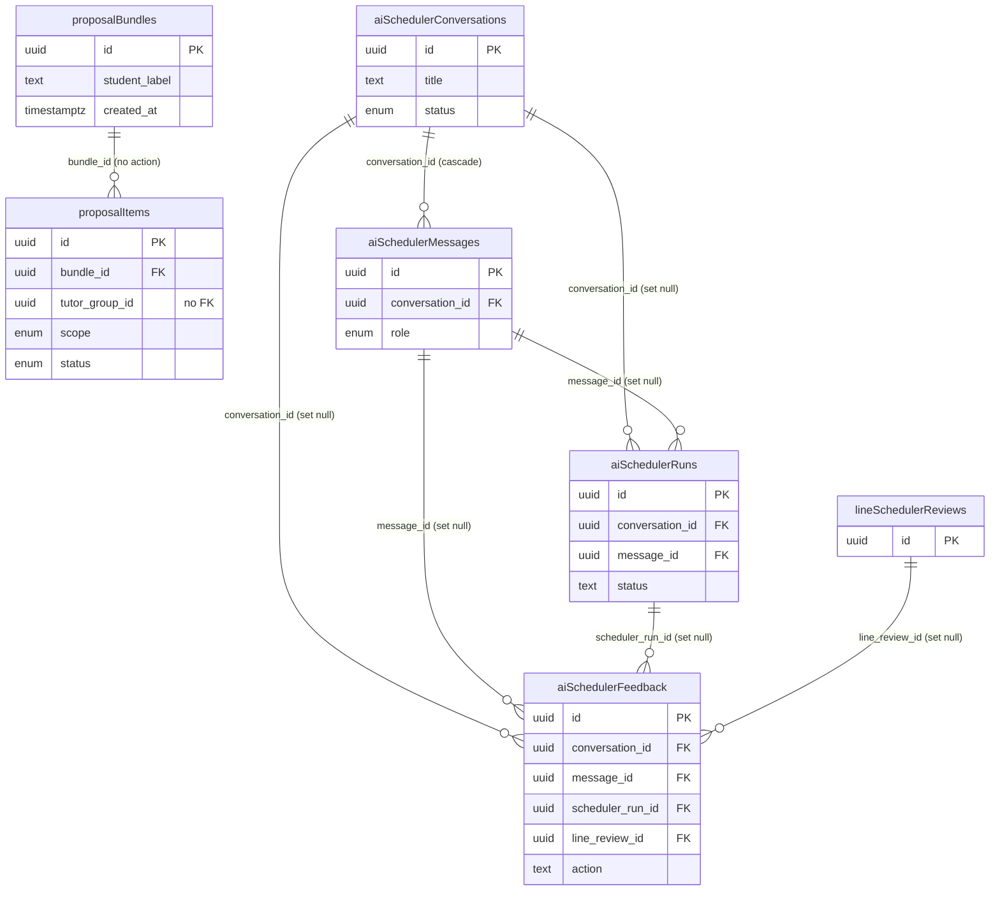

# Database Reference — AI Scheduler & Proposals

This document covers the six tables that back two related features: the **tutor proposal** flow (a bundle of provisional tutor slots held for a student, with per-slot confirm/release/expire lifecycle) and the **AI scheduler** (an assistant chat that drafts tutor schedules, plus the run audit and feedback trail used to evaluate it). The two sets are documented together because the AI scheduler is the producer side and proposals are one of the downstream artifacts an admin acts on.

All tables are defined in `src/lib/db/schema.ts`. Line ranges are cited per table below. Enum value sets are defined at `src/lib/db/schema.ts:83-106`.

For the full column-by-column listing (types, defaults, indexes) see the database [index](./index.md). This page documents grain, keys, and relationships only — it does not restate every column.

## ER Diagram

The proposals tables carry **no foreign key** to any core table — `proposalItems.tutorGroupId` is a plain uuid column with no FK constraint (`schema.ts:1407`), and tutors/subjects are denormalized as text (`tutor_canonical_key`, `tutor_display_name`, `subject`, etc.), so no core stub nodes are drawn for them. The one cross-domain reference is `aiSchedulerFeedback.lineReviewId` → `lineSchedulerReviews`, which is owned by the LINE domain and shown here as a stub node.

## Tables

### `proposalBundles` (schema.ts:1392-1403)

One row per proposal bundle — a named group of provisional tutor slots being offered for a single student. Keyed by `id` (uuid). Identified loosely by `student_label` (free text, not a FK to any student record), with optional `notes` and a creator block (`created_by_email`/`created_by_name`). Carries `created_at`/`updated_at`; the only index is on `created_at` (`proposal_bundles_created_at_idx`) for recency listing. Parent of `proposalItems`.

### `proposalItems` (schema.ts:1404-1435)

One row per proposed tutor slot within a bundle — the unit an admin confirms or releases. References `proposalBundles.id` via `bundle_id` (`proposal_items_bundle_idx`); the FK declares no `onDelete`, so deletes default to no action (a bundle cannot be deleted while items reference it). The tutor is denormalized: `tutor_canonical_key` and `tutor_display_name` are required text, while `tutor_group_id` is an **unconstrained uuid** (no FK to the core identity-group table). The slot itself is `scope` (the `proposal_scope` enum: `recurring` | `one_time`), `weekday`, optional `proposal_date`, and `start_minute`/`end_minute`, plus optional `subject`/`curriculum`/`level`. Lifecycle is driven by `status` (the `proposal_status` enum: `pending` | `confirmed` | `released` | `expired` | `auto_resolved`, default `pending`) together with the timestamp set `expires_at` / `confirmed_at` / `released_at` / `auto_resolved_at` and a last-action audit block (`last_action_by_email`/`last_action_by_name`/`last_action_at`). The composite index `proposal_items_active_lookup_idx` on `(tutor_canonical_key, status, weekday)` supports checking whether a tutor already has an active hold on a given weekday; a separate index covers `proposal_date`.

### `aiSchedulerConversations` (schema.ts:1436-1456)

One row per AI scheduler chat session. Keyed by `id` (uuid). `title` defaults to `"Untitled scheduler chat"` and `status` is the `ai_scheduler_conversation_status` enum (`active` | `archived`, default `active`). Holds the customer context the chat is about (`customer_parent_name`, `customer_student_name`, `customer_contact`), free-text `notes` (default `""`), and an `extracted_state` jsonb (default `{}`) that accumulates the assistant's structured understanding of the request. A creator block plus `archived_at`, `last_message_at` (default now, used for inbox sorting), and `created_at`/`updated_at` complete it. Indexes cover `(status, last_message_at)`, `(created_by_email, last_message_at)`, and `last_message_at`. Parent (cascade) of `aiSchedulerMessages`, and the soft parent (set null) of `aiSchedulerRuns` and `aiSchedulerFeedback`.

### `aiSchedulerMessages` (schema.ts:1457-1474)

One row per message in a scheduler conversation. References `aiSchedulerConversations.id` via `conversation_id` with **cascade** delete (`ai_scheduler_messages_conversation_idx` on `(conversation_id, created_at)`). `role` is the `ai_scheduler_message_role` enum (`admin` | `parent` | `assistant` | `system`). Stores the rendered `content` text plus an optional `structured_payload` jsonb (nullable) for machine-readable assistant output, with `model` and `latency_ms` capturing which LLM produced it and how long it took, and a creator block. Referenced (set null) by `aiSchedulerRuns.messageId` and `aiSchedulerFeedback.messageId`.

### `aiSchedulerRuns` (schema.ts:1475-1498)

One row per AI scheduler inference run — the audit/observability record for a single solver invocation. Both parent links are nullable and **set null** on delete: `conversation_id` → `aiSchedulerConversations.id` and `message_id` → `aiSchedulerMessages.id` (so a run survives deletion of either). `status` is required free text (not an enum) and `input_preview_redacted` is a required redacted snapshot of the prompt. Versioning and timing live in `model`, `latency_ms`, `scheduler_version`, `prompt_version`, and the `latency_breakdown` jsonb; the pipeline payloads are captured in `parsed_payload` and `solver_payload` jsonb, with a `warnings` string array (default `[]`) and an optional `error_message`. Indexed on `conversation_id`, `message_id`, `created_at`, and `status`. Referenced (set null) by `aiSchedulerFeedback.schedulerRunId`.

### `aiSchedulerFeedback` (schema.ts:1499-1525)

One row per human feedback event on an AI scheduler suggestion — the labeled-outcome trail used to evaluate the scheduler. All four parent links are nullable and **set null** on delete: `conversation_id` → `aiSchedulerConversations.id`, `message_id` → `aiSchedulerMessages.id`, `scheduler_run_id` → `aiSchedulerRuns.id`, and the cross-domain `line_review_id` → `lineSchedulerReviews.id` (owned by the LINE domain; this is the only FK reaching outside the two feature sets on this page). `action` is required free text describing the outcome. The decision detail is captured in `selected_tutor_ids` / `rejected_tutor_ids` (string-array jsonb, default `[]`), `edited_parent_draft`, `rejection_reason`, and `staff_correction`, alongside evaluation signals `classifier_confidence` (double precision) and `time_to_review_ms`, plus a creator block. Indexes cover `message_id`, `scheduler_run_id`, `created_at`, `action`, and `line_review_id`.

_Verified against HEAD + uncommitted WIP on 2026-05-31._
