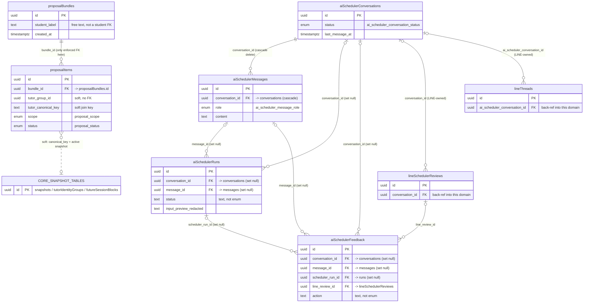

# Database Reference — AI Scheduler & Proposals (ER Diagram)

Scope: the 6 tables backing two related admin features — **Proposals / Admin Holds** (**experimental**) and the **AI Scheduler** (**experimental**).

They share a page because they sit on the same side of the same line: neither writes to Wise. The proposal block carries that rule as a schema comment — these rows "intentionally do not write to Wise; Wise remains the source of truth for actual bookings" (`src/lib/db/schema.ts:2299-2302`) — and the AI scheduler's own tables are a conversation store plus an audit trail, never a booking ledger. The model proposes; deterministic search proves; a human decides.

Full column-by-column detail (types, defaults, every index) lives in [`./index.md`](./index.md); enum value sets live in [`./enums.md`](./enums.md). This page covers grain, keys, and relationships only. For purpose, business rules, and flows see [`../../features/proposals.md`](../../features/proposals.md) and [`../../features/ai-scheduler.md`](../../features/ai-scheduler.md).

## Scope

Exactly 6 tables (Drizzle export — Postgres table — `src/lib/db/schema.ts` line range):

| Table (varName) | Postgres table | Lines | Grain scope |
|---|---|---|---|
| `proposalBundles` | `proposal_bundles` | 2303–2314 | one row per parent offer (a set of holds) |
| `proposalItems` | `proposal_items` | 2315–2346 | one row per held tutor + weekday + time window |
| `aiSchedulerConversations` | `ai_scheduler_conversations` | 2347–2367 | one row per scheduler chat workspace |
| `aiSchedulerMessages` | `ai_scheduler_messages` | 2368–2385 | one row per message turn in a conversation |
| `aiSchedulerRuns` | `ai_scheduler_runs` | 2386–2409 | one row per parse+solve execution (audit) |
| `aiSchedulerFeedback` | `ai_scheduler_feedback` | 2410–2436 | one row per human verdict on a run/message |

**None of the six carries a `snapshotId` column**, so none is scoped to a Wise snapshot and none is rewritten by the ETL — they survive snapshot rotation intact. Where the domain does need snapshot data (proposal auto-resolution), it joins the *active* snapshot at query time rather than holding an FK; see [Soft references](#soft-references-no-fk).

Four enums are used here, all declared together at `src/lib/db/schema.ts:85-108`:

| Enum | Values | Used by |
|---|---|---|
| `proposal_scope` | `recurring`, `one_time` | `proposalItems.scope` |
| `proposal_status` | `pending`, `confirmed`, `released`, `expired`, `auto_resolved` | `proposalItems.status` |
| `ai_scheduler_conversation_status` | `active`, `archived` | `aiSchedulerConversations.status` |
| `ai_scheduler_message_role` | `admin`, `parent`, `assistant`, `system` | `aiSchedulerMessages.role` |

Two status-like columns here are **plain `text`, not enums**: `aiSchedulerRuns.status` (`schema.ts:2391`) and `aiSchedulerFeedback.action` (`schema.ts:2415`). Their value sets are constrained only in TypeScript — `"solved" | "needs_clarification" | "failed"` for a run (`src/lib/ai/scheduler-data.ts:495`) and `"accept" | "edit" | "reject" | "dismiss"` for feedback (`src/lib/ai/scheduler-data.ts:71`).

## ER Diagram

Two things the diagram makes explicit.

First, the proposal side has exactly **one** enforced foreign key (`proposalItems.bundleId`). The tutor a hold is placed on is denormalized as text (`tutor_canonical_key`, `tutor_display_name`), and `tutorGroupId` is a bare `uuid("tutor_group_id")` with no `.references(...)` (`schema.ts:2318`) — so core snapshot tables appear as one stub node joined softly, never as an FK target.

Second, the AI scheduler and the LINE domain are **mutually** linked. `aiSchedulerFeedback.lineReviewId` points at `lineSchedulerReviews` (`schema.ts:2421`), and `lineSchedulerReviews` points back at all three scheduler tables (`schema.ts:2554-2559`), as does `lineThreads.aiSchedulerConversationId` (`schema.ts:2459-2460`). Both LINE tables are owned by the LINE domain ([`./erd-line.md`](./erd-line.md)) and appear here as stubs.

```mermaid
erDiagram
    proposalBundles {
        uuid id PK
        text student_label "free text, not a student FK"
        timestamptz created_at
    }

    proposalItems {
        uuid id PK
        uuid bundle_id FK "-> proposalBundles.id"
        uuid tutor_group_id "soft, no FK"
        text tutor_canonical_key "soft join key"
        enum scope "proposal_scope"
        enum status "proposal_status"
    }

    aiSchedulerConversations {
        uuid id PK
        enum status "ai_scheduler_conversation_status"
        timestamptz last_message_at
    }

    aiSchedulerMessages {
        uuid id PK
        uuid conversation_id FK "-> conversations (cascade)"
        enum role "ai_scheduler_message_role"
        text content
    }

    aiSchedulerRuns {
        uuid id PK
        uuid conversation_id FK "-> conversations (set null)"
        uuid message_id FK "-> messages (set null)"
        text status "text, not enum"
        text input_preview_redacted
    }

    aiSchedulerFeedback {
        uuid id PK
        uuid conversation_id FK "-> conversations (set null)"
        uuid message_id FK "-> messages (set null)"
        uuid scheduler_run_id FK "-> runs (set null)"
        uuid line_review_id FK "-> lineSchedulerReviews"
        text action "text, not enum"
    }

    lineSchedulerReviews {
        uuid id PK
        uuid conversation_id FK "back-ref into this domain"
    }

    lineThreads {
        uuid id PK
        uuid ai_scheduler_conversation_id FK "back-ref into this domain"
    }

    CORE_SNAPSHOT_TABLES {
        uuid id PK "snapshots / tutorIdentityGroups / futureSessionBlocks"
    }

    proposalBundles ||--o{ proposalItems : "bundle_id (only enforced FK here)"
    proposalItems }o..o| CORE_SNAPSHOT_TABLES : "soft: canonical_key + active snapshot"

    aiSchedulerConversations ||--o{ aiSchedulerMessages : "conversation_id (cascade delete)"
    aiSchedulerConversations |o--o{ aiSchedulerRuns : "conversation_id (set null)"
    aiSchedulerMessages |o--o{ aiSchedulerRuns : "message_id (set null)"
    aiSchedulerConversations |o--o{ aiSchedulerFeedback : "conversation_id (set null)"
    aiSchedulerMessages |o--o{ aiSchedulerFeedback : "message_id (set null)"
    aiSchedulerRuns |o--o{ aiSchedulerFeedback : "scheduler_run_id (set null)"

    lineSchedulerReviews |o--o{ aiSchedulerFeedback : "line_review_id"
    aiSchedulerConversations |o--o{ lineSchedulerReviews : "conversation_id (LINE-owned)"
    aiSchedulerConversations |o--o{ lineThreads : "ai_scheduler_conversation_id (LINE-owned)"
```

## Relationship model

**Enforced foreign keys inside the domain.** Every `.references(...)` declared in the six line ranges:

| From | Column | To | On delete |
|---|---|---|---|
| `proposalItems` | `bundle_id` | `proposalBundles.id` | *(unspecified — default)* |
| `aiSchedulerMessages` | `conversation_id` | `aiSchedulerConversations.id` | `cascade` |
| `aiSchedulerRuns` | `conversation_id` | `aiSchedulerConversations.id` | `set null` |
| `aiSchedulerRuns` | `message_id` | `aiSchedulerMessages.id` | `set null` |
| `aiSchedulerFeedback` | `conversation_id` | `aiSchedulerConversations.id` | `set null` |
| `aiSchedulerFeedback` | `message_id` | `aiSchedulerMessages.id` | `set null` |
| `aiSchedulerFeedback` | `scheduler_run_id` | `aiSchedulerRuns.id` | `set null` |
| `aiSchedulerFeedback` | `line_review_id` | `lineSchedulerReviews.id` (LINE domain) | `set null` |

The delete policy encodes an intent worth naming: **the transcript is disposable, the audit is not**. Deleting a conversation cascades away its messages (`schema.ts:2370-2372`) but only nulls the parent pointers on runs and feedback (`schema.ts:2388-2389`, `2412-2414`) — an accept/reject verdict and its latency/version metadata outlive the chat it came from.

**Inbound foreign keys from other domains.** Three, all LINE-owned and all `set null` — `lineThreads.aiSchedulerConversationId` (`schema.ts:2459-2460`) plus `lineSchedulerReviews.conversationId` / `.schedulerMessageId` / `.schedulerRunId` (`schema.ts:2554-2559`). The link is bidirectional: `aiSchedulerFeedback.lineReviewId` closes the loop back (`schema.ts:2421`).

### Soft references (no FK)

- `proposalItems.tutorGroupId` — bare `uuid` (`schema.ts:2318`); the durable join key is `tutorCanonicalKey` (text), matching the codebase-wide preference for `canonical_key` over snapshot-scoped ids.
- `proposalBundles.studentLabel` — free text (`schema.ts:2305`). There is no student entity to point at; a bundle is labelled, not linked.
- Auto-resolution reads core snapshot data at query time rather than holding a reference: `autoResolveConfirmedProposalItems` selects the row where `snapshots.active = true`, then joins `futureSessionBlocks` to `tutorIdentityGroups` and matches on `canonicalKey` + weekday + minute window (`src/lib/proposals/data.ts:188-251`).

## Tables

### `proposalBundles` — `proposal_bundles` (2303–2314)

One row per **parent offer**: the set of tentative holds an admin puts together for one student before anything is booked in Wise. Grain is the offer, not the slot.

Key columns: `id` (uuid PK, `defaultRandom()`), `studentLabel` (required free text — the only identification of who the offer is for), `notes`, and the `createdByEmail` / `createdByName` actor pair. One index, on `createdAt` — the list view is chronological.

Relationships: parent of `proposalItems` via `bundleId`; nothing references a bundle from outside the domain. The bundle also acts as a **transaction boundary for the items**: confirming one item releases every other *pending* item in the same bundle (`src/lib/proposals/data.ts:429-442`), which is the schema's way of saying an offer is a menu and the parent picks one.

### `proposalItems` — `proposal_items` (2315–2346)

One row per **held slot**: a tutor, a weekday, and a start/end minute window inside one bundle. This is the only table in the domain with a real lifecycle.

Key columns: `bundleId` (FK); the denormalized tutor triple `tutorGroupId` (soft) / `tutorCanonicalKey` / `tutorDisplayName`; `scope` (`proposal_scope`) paired with `weekday` + `proposalDate` — a `one_time` hold stores the date, a `recurring` hold stores `null` (`data.ts:342`); the minute-of-day window `startMinute` / `endMinute`; the teaching triple `subject` / `curriculum` / `level`; `status` (`proposal_status`, defaults `pending`); and one timestamp per terminal transition — `expiresAt`, `confirmedAt`, `releasedAt`, `autoResolvedAt` — plus the `lastActionBy*` / `lastActionAt` actor trail.

Three indexes: `bundle_id`; the active-hold lookup `(tutor_canonical_key, status, weekday)`, which is the shape the search page uses to overlay existing holds on a tutor's grid; and `proposal_date`.

Lifecycle, all driven from `src/lib/proposals/data.ts`: a hold is created `pending` with `expiresAt = now + 48h` (`PENDING_HOLD_MS`, `data.ts:21`, `data.ts:317`). `confirm` clears `expiresAt` and stamps `confirmedAt`; `release` stamps `releasedAt`; `extend` pushes `expiresAt` out another 48h and is legal only from `pending` (`data.ts:386-465`). Two sweeps run on read via `reconcileProposalState`: stale `pending` rows past `expiresAt` flip to `expired` (`data.ts:170-186`), and `confirmed` rows whose slot now has a real blocking session in the active snapshot flip to `auto_resolved` (`data.ts:188-251`) — the hold retires itself once Wise catches up.

### `aiSchedulerConversations` — `ai_scheduler_conversations` (2347–2367)

One row per **scheduler chat workspace** — an admin's working session against one parent enquiry.

Key columns: `title` (defaults `"Untitled scheduler chat"`), `status` (`active` / `archived`), the customer triple `customerParentName` / `customerStudentName` / `customerContact` (all free text, none an FK), `notes`, and `extractedState` — a `jsonb` `Record<string, unknown>` defaulting `{}` that holds the requirements parsed out of the conversation so far. `lastMessageAt` is maintained as a denormalized sort key and backs all three indexes: `(status, last_message_at)`, `(created_by_email, last_message_at)`, and `last_message_at` alone.

Relationships: parent of `aiSchedulerMessages` (cascade), and a nullable parent of runs and feedback. It is also the join point to LINE — a `lineThread` and a `lineSchedulerReview` can each adopt a conversation.

### `aiSchedulerMessages` — `ai_scheduler_messages` (2368–2385)

One row per **turn** in a conversation. Append-only in practice: the table has `createdAt` but no `updatedAt`.

Key columns: `conversationId` (FK, cascade), `role` (`admin` / `parent` / `assistant` / `system`), `content` (required text), `structuredPayload` (nullable `jsonb` — the machine-readable form of an assistant turn), plus the per-turn model observations `model` and `latencyMs` and the `createdBy*` actor pair. Two indexes: `(conversation_id, created_at)` for transcript replay and `created_at` for global recency.

Relationships: child of a conversation; referenced (nullably) by `aiSchedulerRuns.messageId`, `aiSchedulerFeedback.messageId`, and LINE's `lineSchedulerReviews.schedulerMessageId`.

### `aiSchedulerRuns` — `ai_scheduler_runs` (2386–2409)

One row per **execution** of the parse-then-solve pipeline — the audit record for a single model call plus the deterministic availability solve that follows it. Written by `recordSchedulerRun` (`src/lib/ai/scheduler-data.ts:510-527`).

Key columns: nullable `conversationId` and `messageId` (both `set null`, so a run survives the chat); `status` as plain text carrying `solved` / `needs_clarification` / `failed` (`scheduler-data.ts:495`); `inputPreviewRedacted` — a **required** column whose name is the policy, the raw parent text is never stored here; `model`, `latencyMs`, and `latencyBreakdown` (`jsonb`); the reproducibility pair `schedulerVersion` + `promptVersion`, which the metrics page groups on and defaults to `"unknown"` when absent (`src/lib/ai/scheduler-metrics.ts:93-98`); the two payload snapshots `parsedPayload` (what the model extracted) and `solverPayload` (what deterministic search returned); `warnings` (`jsonb` string array, defaults `[]`); and `errorMessage`. Four indexes: `conversation_id`, `message_id`, `created_at`, `status`.

That `parsedPayload` / `solverPayload` split is the feature's core invariant made durable — the model's reading of the request and the system's proof of availability are stored as two separate columns, so a wrong suggestion can always be attributed to one side or the other.

### `aiSchedulerFeedback` — `ai_scheduler_feedback` (2410–2436)

One row per **human verdict** on a suggestion. This is the training/QA signal, and it is deliberately the most loosely-coupled table in the domain: all four of its parents are nullable `set null` references.

Key columns: `conversationId`, `messageId`, `schedulerRunId`, and `lineReviewId` (the cross-domain link to `lineSchedulerReviews`); `action` as plain text carrying `accept` / `edit` / `reject` / `dismiss` (`scheduler-data.ts:71`); the outcome detail `selectedTutorIds` and `rejectedTutorIds` (`jsonb` string arrays, default `[]`), `editedParentDraft`, `rejectionReason`, and `staffCorrection`; and two measurement columns — `classifierConfidence` (`double precision`, carried over from the LINE classifier) and `timeToReviewMs`. Five indexes: `message_id`, `scheduler_run_id`, `created_at`, `action`, `line_review_id`.

Consumers: `getSchedulerFeedback` for the accept/edit/reject metrics readout (`scheduler-data.ts:555-560` writes, `:167` reads), and the correction-telemetry query that pairs `action` with `classifierConfidence` and `timeToReviewMs` (`src/lib/ai/correction-telemetry.ts:50-55`).

## Open questions

- **No FK enforces the proposal → tutor link.** `tutorCanonicalKey` is a text column with no constraint, so a hold can outlive (or typo past) any tutor identity group. This is consistent with the codebase's cross-snapshot pattern, but nothing in the schema prevents an orphan hold; whether that has occurred in production is a data question this repo cannot answer.
- **`proposalItems.bundleId` declares no `onDelete`** (`schema.ts:2317`), unlike every other FK in the domain. Deleting a bundle with items would therefore be restricted by Postgres' default rather than cascading — but no code path in `src/lib/proposals/data.ts` deletes a bundle, so the behaviour is untested in practice.
- **`aiSchedulerRuns.status` and `aiSchedulerFeedback.action` are `text`, not `pgEnum`**, while four neighbouring columns in the same 130-line block do use enums. The value sets exist only as TypeScript unions, so a bad write from outside those helpers would be accepted by the database. Whether this is deliberate (churn-prone experimental vocabularies) or drift is not recorded in the schema.
- **Proposal reconciliation has no scheduled driver.** `reconcileProposalState` runs on read (`data.ts:253-256`) — `listActiveProposalHolds` calls it unless the caller passes `reconcile: false` (`data.ts:263-265`), so `expired` / `auto_resolved` transitions only happen when someone opens the view. There is no `proposal_*` cron entry; see [`../crons.md`](../crons.md).

_Verified against main@0cd1e81 (clean tree) on 2026-09-02._
