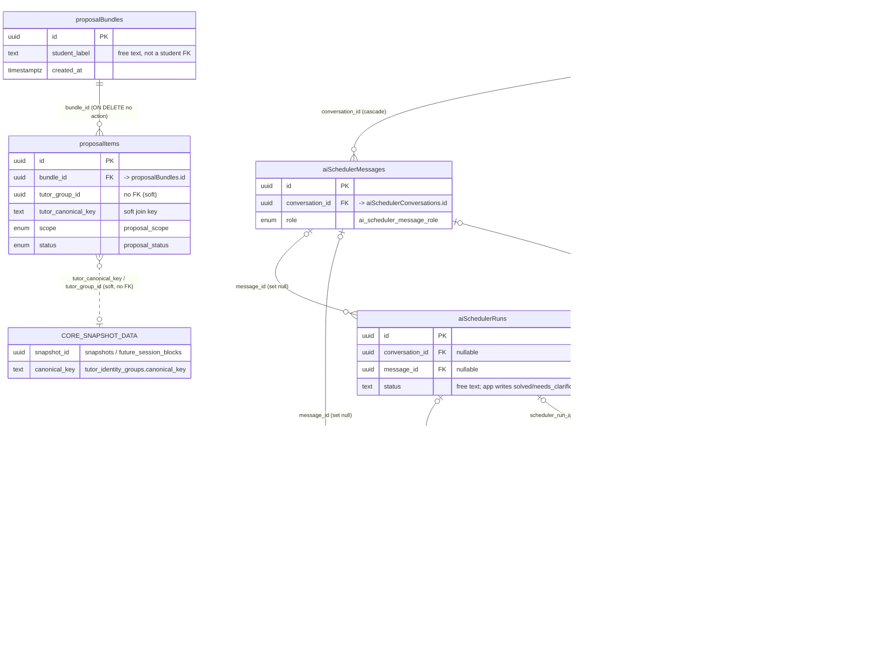

# Database Reference — AI Scheduler & Proposals

Scope: the six tables behind two related admin features — **admin proposal holds** (`proposalBundles`, `proposalItems`: local-only tentative tutor/time holds offered to a parent) and the **AI scheduler** (`aiSchedulerConversations`, `aiSchedulerMessages`, `aiSchedulerRuns`, `aiSchedulerFeedback`: the chat workspace plus its run-audit and human-feedback trail). They share a page because the scheduler produces the suggestions an admin turns into holds, and because both are non-authoritative relative to Wise — the proposal block carries the schema comment that these rows "intentionally do not write to Wise; Wise remains the source of truth for actual bookings" (`src/lib/db/schema.ts:2296-2299`).

| Table (varName) | SQL name | schema.ts lines |
|---|---|---|
| `proposalBundles` | `proposal_bundles` | 2300–2310 |
| `proposalItems` | `proposal_items` | 2312–2340 |
| `aiSchedulerConversations` | `ai_scheduler_conversations` | 2344–2363 |
| `aiSchedulerMessages` | `ai_scheduler_messages` | 2365–2381 |
| `aiSchedulerRuns` | `ai_scheduler_runs` | 2383–2405 |
| `aiSchedulerFeedback` | `ai_scheduler_feedback` | 2407–2430 |

Full column lists (types, defaults, every index) live in [docs/reference/database/index.md](./index.md); enum value sets live in [enums.md](./enums.md). This page covers grain, key columns, and relationships only. Feature meaning and rules live in [features/proposals.md](../../features/proposals.md) and [features/ai-scheduler.md](../../features/ai-scheduler.md).

The four enums used here are declared at `src/lib/db/schema.ts:85-108`: `proposal_scope` (`recurring`, `one_time`), `proposal_status` (`pending`, `confirmed`, `released`, `expired`, `auto_resolved`), `ai_scheduler_conversation_status` (`active`, `archived`), and `ai_scheduler_message_role` (`admin`, `parent`, `assistant`, `system`).

None of the six tables carries a `snapshotId` column, so none is scoped to a Wise snapshot; they survive snapshot rotation intact.

## ER Diagram

Two things the diagram makes explicit. First, **no table in this domain declares a foreign key to core snapshot data**: `proposalItems.tutorGroupId` is a bare `uuid("tutor_group_id")` with no `.references(...)` (`src/lib/db/schema.ts:2315`), and the tutor is otherwise denormalized as text (`tutor_canonical_key`, `tutor_display_name`). Core tables are therefore drawn as one stub node joined softly. Second, the LINE domain and the AI scheduler are **mutually** linked: `aiSchedulerFeedback.lineReviewId` points at `lineSchedulerReviews` (`src/lib/db/schema.ts:2418`), and `lineSchedulerReviews` points back at all three scheduler tables (`src/lib/db/schema.ts:2551-2556`), as does `lineThreads.aiSchedulerConversationId` (`src/lib/db/schema.ts:2456-2457`). Both LINE tables are owned by the LINE domain ([erd-line.md](./erd-line.md)) and appear here as stubs.

```mermaid
erDiagram
    proposalBundles {
        uuid id PK
        text student_label "free text, not a student FK"
        timestamptz created_at
    }

    proposalItems {
        uuid id PK
        uuid bundle_id FK "-> proposalBundles.id"
        uuid tutor_group_id "no FK (soft)"
        text tutor_canonical_key "soft join key"
        enum scope "proposal_scope"
        enum status "proposal_status"
    }

    aiSchedulerConversations {
        uuid id PK
        text title
        enum status "ai_scheduler_conversation_status"
        timestamptz last_message_at "list ordering"
    }

    aiSchedulerMessages {
        uuid id PK
        uuid conversation_id FK "-> aiSchedulerConversations.id"
        enum role "ai_scheduler_message_role"
    }

    aiSchedulerRuns {
        uuid id PK
        uuid conversation_id FK "nullable"
        uuid message_id FK "nullable"
        text status "free text; app writes solved/needs_clarification/failed"
    }

    aiSchedulerFeedback {
        uuid id PK
        uuid conversation_id FK "nullable"
        uuid message_id FK "nullable"
        uuid scheduler_run_id FK "nullable"
        uuid line_review_id FK "cross-domain, nullable"
        text action "free text; app writes accept/edit/reject/dismiss"
    }

    LINE_DOMAIN {
        uuid id "line_scheduler_reviews / line_threads"
        uuid conversation_id "points back into this domain"
    }

    CORE_SNAPSHOT_DATA {
        uuid snapshot_id "snapshots / future_session_blocks"
        text canonical_key "tutor_identity_groups.canonical_key"
    }

    proposalBundles ||--o{ proposalItems : "bundle_id (ON DELETE no action)"
    proposalItems }o..o| CORE_SNAPSHOT_DATA : "tutor_canonical_key / tutor_group_id (soft, no FK)"

    aiSchedulerConversations ||--o{ aiSchedulerMessages : "conversation_id (cascade)"
    aiSchedulerConversations |o--o{ aiSchedulerRuns : "conversation_id (set null)"
    aiSchedulerMessages |o--o{ aiSchedulerRuns : "message_id (set null)"
    aiSchedulerConversations |o--o{ aiSchedulerFeedback : "conversation_id (set null)"
    aiSchedulerMessages |o--o{ aiSchedulerFeedback : "message_id (set null)"
    aiSchedulerRuns |o--o{ aiSchedulerFeedback : "scheduler_run_id (set null)"

    LINE_DOMAIN |o--o{ aiSchedulerFeedback : "line_review_id (set null)"
    aiSchedulerConversations |o--o{ LINE_DOMAIN : "line_threads / line_scheduler_reviews (set null)"
    aiSchedulerMessages |o--o{ LINE_DOMAIN : "scheduler_message_id (set null)"
    aiSchedulerRuns |o--o{ LINE_DOMAIN : "scheduler_run_id (set null)"
```

## Tables

### `proposalBundles` — `proposal_bundles`

Source: `src/lib/db/schema.ts:2300-2310`.

**Grain**: one row per proposal bundle — the set of tentative slots offered to a single student in one admin action. A bundle is inserted once per `createProposalBundle` call (`src/lib/proposals/data.ts:318-328`); there is no upsert path and no uniqueness constraint beyond the surrogate `id`.

**Key columns**:
- `id` — `uuid` primary key, `defaultRandom()` (line 2301).
- `studentLabel` — `text`, `notNull` (line 2302). Free text, trimmed and required non-empty by `validateCreateInput` (`src/lib/proposals/data.ts:272-274`); it is **not** a foreign key to any student record.
- `notes` — nullable `text` (line 2303).
- `createdByEmail` / `createdByName` — nullable `text` (lines 2304-2305). The creator block lives here, not on the item: hold listings read the actor off the joined bundle row (`src/lib/proposals/data.ts:152-153`).
- `createdAt` / `updatedAt` — timezone-aware `timestamp`, `notNull`, `defaultNow()` (lines 2306-2307). `updatedAt` is bumped on the parent bundle whenever any child item is patched (`src/lib/proposals/data.ts:468-471`).

**Indexes**: `proposal_bundles_created_at_idx` on `createdAt` (line 2309) — the only index, supporting recency listing.

**Relationships**: parent of `proposalItems` via `proposalItems.bundleId`. Deletes are effectively blocked by the child FK (see below); the single delete in the codebase is a compensating rollback when the item insert fails immediately after the bundle insert (`src/lib/proposals/data.ts:361-364`) — a hand-rolled substitute for a transaction, since the Neon HTTP driver does not provide one.

### `proposalItems` — `proposal_items`

Source: `src/lib/db/schema.ts:2312-2340`.

**Grain**: one row per proposed tutor/time hold inside a bundle — the unit an admin confirms, releases, or extends. Items are written as one multi-row insert, one row per requested slot (`src/lib/proposals/data.ts:332-357`).

**Key columns**:
- `id` — `uuid` primary key, `defaultRandom()` (line 2313).
- `bundleId` — `uuid`, `notNull`, `references(() => proposalBundles.id)` (line 2314). No `onDelete` is declared, so the migration emits `ON DELETE no action` (`drizzle/0006_admin_proposal_holds.sql:40`) — a bundle cannot be deleted while items reference it.
- `tutorGroupId` — nullable `uuid` with **no** `.references(...)` (line 2315). A denormalized identifier only; nothing constrains it to a live snapshot, which is why the row survives snapshot rotation.
- `tutorCanonicalKey` / `tutorDisplayName` — `text`, `notNull` (lines 2316-2317). `tutorCanonicalKey` is the real join key used for overlap exclusion and auto-resolution against Wise sessions; it corresponds to `tutorIdentityGroups.canonicalKey` (`src/lib/db/schema.ts:1519`).
- `scope` — `proposalScopeEnum`, `notNull` (line 2318): `recurring` (weekly) or `one_time` (a specific `proposalDate`). `one_time` items are validated to require a date (`src/lib/proposals/data.ts:286-288`), and only then is `proposalDate` populated (`src/lib/proposals/data.ts:342`).
- `weekday` / `startMinute` / `endMinute` — `integer`, `notNull` (lines 2319, 2321-2322); minute-of-day offsets, Bangkok-local.
- `proposalDate` — nullable `date` in `{ mode: "string" }` (line 2320); set only for `one_time` scope.
- `subject` / `curriculum` / `level` — nullable `text` (lines 2323-2325).
- `status` — `proposalStatusEnum`, `notNull`, default `pending` (line 2326).
- Lifecycle timestamps `expiresAt`, `confirmedAt`, `releasedAt`, `autoResolvedAt` (lines 2327-2330), the audit block `lastActionByEmail` / `lastActionByName` / `lastActionAt` (lines 2331-2333), and `createdAt` / `updatedAt` (lines 2334-2335).

**Indexes**: `proposal_items_bundle_idx` on `bundleId`; the composite `proposal_items_active_lookup_idx` on `(tutorCanonicalKey, status, weekday)` for "does this tutor already hold this weekday"; `proposal_items_date_idx` on `proposalDate` (lines 2337-2339).

**Constraints that exist in Postgres but not in the Drizzle schema.** `drizzle/0006_admin_proposal_holds.sql` adds three CHECKs — `proposal_items_time_order_chk` (`end_minute > start_minute`), `proposal_items_weekday_chk` (`0..6`), and `proposal_items_pending_expiry_chk` (`status <> 'pending' OR expires_at IS NOT NULL`) at lines 41-43 — plus two `EXCLUDE USING gist` constraints that make overlapping *active* holds impossible at the database level:

- `proposal_items_no_recurring_overlap` on `(tutor_canonical_key WITH =, weekday WITH =, int4range(start_minute, end_minute, '[)') WITH &&)` where `status IN ('pending','confirmed') AND scope = 'recurring'` (lines 48-52);
- `proposal_items_no_one_time_overlap`, the same shape keyed on `proposal_date` instead of `weekday`, for `scope = 'one_time'` (lines 53-57).

Both depend on `CREATE EXTENSION IF NOT EXISTS "btree_gist"` at line 1 of that migration. Because `schema.ts` does not model any of these, they are invisible to `drizzle-kit`; application code recognises a violation by SQLSTATE `23P01` or by constraint name and re-raises it as a `ProposalConflictError` (`src/lib/proposals/data.ts:68-83`, `366-373`).

**Lifecycle**, as implemented in `src/lib/proposals/data.ts`: items are inserted `pending` with `expiresAt = now + 48h` (`PENDING_HOLD_MS`, lines 21, 85-87, 317, 348-349). `expireStaleProposalItems` flips `pending` rows past `expiresAt` to `expired` (lines 171-188). `autoResolveConfirmedProposalItems` compares `confirmed` holds against blocking `futureSessionBlocks` of the **active snapshot**, joined through `tutorIdentityGroups.canonicalKey`, and flips matches to `auto_resolved` (lines 198-251) — the only place this domain reads core snapshot tables. Confirming one item releases every other still-`pending` item in the same bundle (lines 429-442). Only `pending` and `confirmed` count as active (`ACTIVE_PROPOSAL_STATUSES`, `src/lib/proposals/overlap.ts:9`).

**Write/read paths**: `POST /api/proposals` creates a bundle plus items (`src/app/api/proposals/route.ts:96`); `PATCH /api/proposals/items/[itemId]` applies confirm/release/extend (`src/app/api/proposals/items/[itemId]/route.ts:42`); `GET /api/proposals/active` lists active holds (`src/app/api/proposals/active/route.ts:13`). Active holds also block slots in range search alongside real Wise sessions (`src/lib/search/range-search.ts:116`, `144-167`) and are loaded by the AI scheduler service (`src/lib/ai/scheduler-service.ts:63`).

**Relationships**: child of `proposalBundles` (enforced FK). Correlated to core tutor/snapshot data only through `tutorCanonicalKey` (and the unconstrained `tutorGroupId`), resolved in application code — never by a database foreign key.

### `aiSchedulerConversations` — `ai_scheduler_conversations`

Source: `src/lib/db/schema.ts:2344-2363`.

**Grain**: one row per AI scheduler chat — a single customer request thread an admin is working. Created explicitly by `createSchedulerConversation` (`src/lib/ai/scheduler-data.ts:348-359`); there is no per-customer uniqueness constraint, so one parent can have several conversations.

**Key columns**:
- `id` — `uuid` primary key, `defaultRandom()` (line 2345).
- `title` — `text`, `notNull`, default `"Untitled scheduler chat"` (line 2346); the same fallback is re-applied on write when the trimmed input is empty (`src/lib/ai/scheduler-data.ts:351`, `412`).
- `status` — `aiSchedulerConversationStatusEnum`, `notNull`, default `active` (line 2347).
- `customerParentName` / `customerStudentName` / `customerContact` — nullable `text` (lines 2348-2350); the customer context, and part of what the free-text list filter searches (`src/lib/ai/scheduler-data.ts:280-286`).
- `notes` — `text`, `notNull`, default `""` (line 2351).
- `extractedState` — `jsonb` typed `Record<string, unknown>`, `notNull`, default `{}` (line 2352). The accumulated structured understanding of the request; read back as `SchedulerExtractedState` (`src/lib/ai/scheduler-data.ts:136`) and also read directly by the LINE review service (`src/lib/line/review-service.ts:158-160`).
- `createdByEmail` / `createdByName` — nullable `text` (lines 2353-2354). The email is trimmed and lower-cased before write (`src/lib/ai/scheduler-data.ts:186-191`) and drives both the "mine only" filter and the per-admin facet counts (lines 288-307).
- `archivedAt` — nullable timestamp (line 2355); set to now when `status` moves to `archived`, reset to `null` otherwise (`src/lib/ai/scheduler-data.ts:418-421`).
- `lastMessageAt` — `notNull`, `defaultNow()` (line 2356); bumped by `touchSchedulerConversationAfterMessage` (`src/lib/ai/scheduler-data.ts:442-445`) and used as the list sort key under a hard `limit(200)` (lines 204-215).
- `createdAt` / `updatedAt` (lines 2357-2358).

**Indexes**: `(status, lastMessageAt)`, `(createdByEmail, lastMessageAt)`, and `lastMessageAt` alone (lines 2360-2362) — all three shaped for the same recency-ordered list.

**Relationships**: parent of `aiSchedulerMessages` with `onDelete: "cascade"`; soft parent (`set null`) of `aiSchedulerRuns` and `aiSchedulerFeedback`. It is also the target of `lineThreads.aiSchedulerConversationId` (`src/lib/db/schema.ts:2456-2457`) and `lineSchedulerReviews.conversationId` (`src/lib/db/schema.ts:2551-2552`); the existence of review rows for a conversation is what marks it as LINE-sourced rather than manual in the list payload (`src/lib/ai/scheduler-data.ts:218-231`, `248-253`).

### `aiSchedulerMessages` — `ai_scheduler_messages`

Source: `src/lib/db/schema.ts:2365-2381`.

**Grain**: one row per message in a scheduler conversation, in either direction. Written by `createSchedulerMessage` (`src/lib/ai/scheduler-data.ts:473-485`) and read back ordered by `createdAt` ascending (lines 383-387).

**Key columns**:
- `id` — `uuid` primary key, `defaultRandom()` (line 2366).
- `conversationId` — `uuid`, `notNull`, `references(() => aiSchedulerConversations.id, { onDelete: "cascade" })` (lines 2367-2369). The only cascading delete in this domain.
- `role` — `aiSchedulerMessageRoleEnum`, `notNull` (line 2370): `admin` | `parent` | `assistant` | `system`.
- `content` — `text`, `notNull` (line 2371); the rendered message text.
- `structuredPayload` — nullable `jsonb` (line 2372); machine-readable assistant output when there is any.
- `model` / `latencyMs` — nullable `text` / `integer` (lines 2373-2374); per-message provenance for assistant turns.
- `createdByEmail` / `createdByName` — nullable `text` (lines 2375-2376); `createdAt` (line 2377).

**Indexes**: `(conversationId, createdAt)` and `createdAt` (lines 2379-2380).

**Relationships**: child of `aiSchedulerConversations` (cascade). Referenced with `set null` by `aiSchedulerRuns.messageId` and `aiSchedulerFeedback.messageId`, and cross-domain by `lineSchedulerReviews.schedulerMessageId` (`src/lib/db/schema.ts:2553-2554`). Because those references are `set null` while the parent link cascades, deleting a conversation deletes its messages but leaves run and feedback rows in place with null links. The LINE review UI replays a review's conversation by reading these rows directly (`src/lib/line/data.ts:1094-1103`).

### `aiSchedulerRuns` — `ai_scheduler_runs`

Source: `src/lib/db/schema.ts:2383-2405`.

**Grain**: one row per AI scheduler inference attempt — the observability record for a single parse/solve pass. Writes are **best effort**: `logSchedulerRun` wraps the insert in try/catch, logs failure with `console.error`, and returns the sentinel string `"unlogged"` rather than throwing (`src/lib/ai/scheduler-data.ts:508-532`), so a message can exist with no corresponding run row.

**Key columns**:
- `id` — `uuid` primary key, `defaultRandom()` (line 2384).
- `conversationId` / `messageId` — both nullable, both `onDelete: "set null"` (lines 2385-2386). Nullable by design: the public search-assistant route logs runs with no conversation at all (`src/app/api/search/assistant/route.ts:176`, `191`).
- `createdByEmail` — nullable `text` (line 2387).
- `status` — `text`, `notNull` (line 2388). Free text in SQL, **not** an enum; the writer's type union is `"solved" | "needs_clarification" | "failed"` (`src/lib/ai/scheduler-data.ts:495`) and the metrics reader counts exactly those three values (`src/lib/ai/scheduler-metrics.ts:105-107`).
- `inputPreviewRedacted` — `text`, `notNull` (line 2389). A redacted preview of the inbound text — the only inbound content this table retains — surfaced verbatim in the failure list on the metrics page (`src/lib/ai/scheduler-metrics.ts:121-128`).
- `model` / `latencyMs` / `schedulerVersion` / `promptVersion` (lines 2390-2393). The two version columns were added later by `drizzle/0021_ai_scheduler_observability.sql` and are grouped into `(schedulerVersion, promptVersion)` counts that fall back to the literal `"unknown"` when null (`src/lib/ai/scheduler-metrics.ts:93-101`).
- `latencyBreakdown` — nullable `jsonb` (line 2394, also added in migration 0021). Written from a `{ totalMs, dbMs, modelMs, searchMs }` shape (`src/lib/ai/scheduler-data.ts:64-69`, `521`) and read back for the per-stage averages.
- `parsedPayload` / `solverPayload` — nullable `jsonb` (lines 2395-2396). `solverPayload.constraintLedger` is inspected to count solved runs that still carry a `needs_clarification` constraint (`src/lib/ai/scheduler-metrics.ts:50-59`, `108-111`).
- `warnings` — `jsonb` typed `string[]`, `notNull`, default `[]` (line 2397); `errorMessage` — nullable `text` (line 2398); `createdAt` (line 2399).

**Indexes**: `conversationId`, `messageId`, `createdAt`, and `status` (lines 2401-2404). The metrics query reads only the most recent 500 rows by `createdAt` (`src/lib/ai/scheduler-metrics.ts:66-81`), so `/scheduler/metrics` is a rolling window, not a lifetime aggregate.

**Relationships**: nullable child of both `aiSchedulerConversations` and `aiSchedulerMessages`; referenced with `set null` by `aiSchedulerFeedback.schedulerRunId` and cross-domain by `lineSchedulerReviews.schedulerRunId` (`src/lib/db/schema.ts:2555-2556`), which the LINE payload uses to look up run latency (`src/lib/line/data.ts:1192-1194`).

### `aiSchedulerFeedback` — `ai_scheduler_feedback`

Source: `src/lib/db/schema.ts:2407-2430`.

**Grain**: one row per human review action on a scheduler suggestion — the labelled-outcome trail used to evaluate the assistant. Inserted by `createSchedulerFeedback` (`src/lib/ai/scheduler-data.ts:554-572`); nothing enforces one feedback row per message, so repeated actions append.

**Key columns**:
- `id` — `uuid` primary key, `defaultRandom()` (line 2408).
- `conversationId` / `messageId` / `schedulerRunId` — all nullable, all `onDelete: "set null"` (lines 2409-2411).
- `action` — `text`, `notNull` (line 2412). Free text in SQL; the writer's union is `"accept" | "edit" | "reject" | "dismiss"` (`src/lib/ai/scheduler-data.ts:71`), and the telemetry reader buckets exactly those four while counting anything else only in `total` (`src/lib/ai/correction-telemetry.ts:33-38`).
- `selectedTutorIds` / `rejectedTutorIds` — `jsonb` typed `string[]`, `notNull`, default `[]` (lines 2413-2414).
- `editedParentDraft` / `rejectionReason` / `staffCorrection` — nullable `text` (lines 2415-2417); each is trimmed and coerced to `null` when empty on write (`src/lib/ai/scheduler-data.ts:563-565`).
- `lineReviewId` — nullable `uuid` referencing `lineSchedulerReviews.id` with `onDelete: "set null"` (line 2418). The only foreign key that leaves this domain; added together with the two telemetry columns below by `drizzle/0030_scheduler_feedback_telemetry.sql`.
- `classifierConfidence` — nullable `doublePrecision` (line 2419); bucketed into high/medium/low/unknown bands for the correction report (`src/lib/ai/correction-telemetry.ts:64`).
- `timeToReviewMs` — nullable `integer` (line 2420); feeds mean and p50 review latency (`src/lib/ai/correction-telemetry.ts:68`, `86-87`).
- `createdByEmail` / `createdByName` (lines 2421-2422), `createdAt` (line 2423).

**Indexes**: `messageId`, `schedulerRunId`, `createdAt`, `action`, and `lineReviewId` (lines 2425-2429). There is **no** index on `conversationId` even though the column carries an FK. The telemetry query reads the most recent 5000 rows by `createdAt` (`src/lib/ai/correction-telemetry.ts:48-56`) — again a rolling window.

**Write paths**: `POST /api/ai-scheduler/messages/[messageId]/feedback` for admin actions in the scheduler workspace (`src/app/api/ai-scheduler/messages/[messageId]/feedback/route.ts:64`), and four call sites in the LINE review service covering send/edit/reject/dismiss outcomes (`src/lib/line/review-service.ts:517`, `548`, `592`, `627`).

**Relationships**: nullable child of `aiSchedulerConversations`, `aiSchedulerMessages`, and `aiSchedulerRuns`, plus the cross-domain link to `lineSchedulerReviews`. Nothing references this table. Because every inbound link is nullable, cleanup routines must delete in dependency order explicitly — the LINE test-data cleanup removes feedback first, then runs, then conversations, and relies on the cascade for messages (`src/lib/line/test-data-cleanup.ts:232-259`).

_Verified against HEAD + uncommitted WIP on 2026-05-31._
