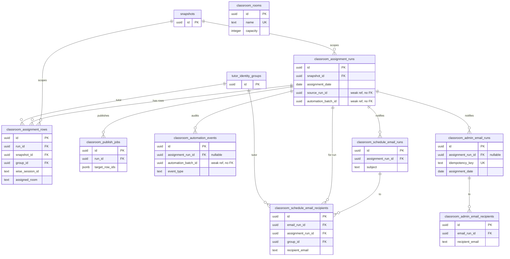

# Database Reference — Classrooms & Assignments

Mechanical reference for the 9 tables that power the classroom room catalog, the per-date room-assignment engine, Wise publish writeback, automation auditing, and the schedule/admin email notification pipeline.

This page is the canonical home for the **structure** of these tables (grain, keys, relationships). Full column-by-column listings live in [the database index](./index.md) — this page does not duplicate them. Feature-level meaning (assignment rules, publish eligibility, automation flow) lives under `docs/features/`, which links here.

All tables are defined in `src/lib/db/schema.ts` (line ranges cited per table below). Enum values are quoted from the `pgEnum` declarations at `src/lib/db/schema.ts:48-81`.

## Scope

The 9 tables documented here:

| varName | Postgres table | schema.ts lines |
|---|---|---|
| `classroomRooms` | `classroom_rooms` | 741-755 |
| `classroomAssignmentRuns` | `classroom_assignment_runs` | 756-781 |
| `classroomAssignmentRows` | `classroom_assignment_rows` | 782-830 |
| `classroomPublishJobs` | `classroom_publish_jobs` | 1016-1037 |
| `classroomAutomationEvents` | `classroom_automation_events` | 1038-1056 |
| `classroomScheduleEmailRuns` | `classroom_schedule_email_runs` | 1110-1125 |
| `classroomScheduleEmailRecipients` | `classroom_schedule_email_recipients` | 1126-1144 |
| `classroomAdminEmailRuns` | `classroom_admin_email_runs` | 1145-1166 |
| `classroomAdminEmailRecipients` | `classroom_admin_email_recipients` | 1167-1184 |

Core tables referenced by foreign key (`snapshots`, `tutor_identity_groups`) are shown as stub nodes in the diagram and documented in full elsewhere in [the database index](./index.md).

## ER Diagram

Notes on the diagram:

- `classroom_rooms` has **no** foreign keys — it is a standalone reference catalog and connects to nothing in this schema (`src/lib/db/schema.ts:741-755`). Assignment rows store the chosen room as the free-text `assigned_room`/`override_room`/`preferred_room` strings, not as a FK to `classroom_rooms`.
- "weak ref, no FK" marks uuid columns that correlate rows logically but carry no Drizzle `.references()` constraint: `classroom_assignment_runs.source_run_id` / `.automation_batch_id`, `classroom_assignment_rows.source_row_id`, and `classroom_automation_events.automation_batch_id` (notNull) / `.source_row_id` / `.target_row_id`.

## Table Reference

### `classroomRooms` — room catalog
`src/lib/db/schema.ts:741-755`

One row per physical/virtual classroom in the room catalog. Standalone reference table with no foreign keys; seeded from the BeGifted room list. Key columns: `name` (unique via `classroom_rooms_name_idx`), `capacity`, `hasTv`, `category`, `active` (indexed), `sortOrder`. `category` is `classroomRoomCategoryEnum` with values `standard` | `overflow_only` | `online_only` (`src/lib/db/schema.ts:48-52`). Relationships: none enforced — the assignment engine references rooms by name string, not by FK.

### `classroomAssignmentRuns` — per-date assignment run
`src/lib/db/schema.ts:756-781`

One row per room-assignment run for a given Bangkok date (`assignmentDate`, `date` mode `"string"`). Each run is the parent of a batch of assignment rows and carries aggregate counts. Key columns: `assignmentDate` (indexed `car_date_idx`), `status` (`classroomAssignmentRunStatusEnum`: `completed` | `published` | `partial` | `failed`, `src/lib/db/schema.ts:54-59`), `forceReassign`, `reconciliationMode`, `changeSummary` (jsonb), and count columns `totalSessions` / `assignedCount` / `needsReviewCount` / `noRoomCount` / `remoteCount` / `publishedCount` / `failedPublishCount`. Relationships: FK `snapshotId → snapshots.id` (indexed `car_snapshot_idx`). `sourceRunId` (prior run this one was reconciled from) and `automationBatchId` (indexed `car_automation_batch_idx`) are uuid columns with **no** FK constraint.

### `classroomAssignmentRows` — denormalized session assignment row
`src/lib/db/schema.ts:782-830`

One row per Wise session within a run — the denormalized session-to-room assignment record (unique on `(runId, wiseSessionId)` via `car_rows_run_session_idx`). Carries the session's Wise identifiers, timing, student/subject metadata, the computed assignment, and per-row publish state. Key columns: `tutorDisplayName`, `wiseTeacherId`, `wiseSessionId`, `wiseClassId`, `startTime`/`endTime` plus `weekday`/`startMinute`/`endMinute`, `minCapacity`/`needsTv`/`preferredRoom`/`overrideRoom`/`assignedRoom` (assignment inputs and result), `status` (`classroomAssignmentRowStatusEnum`: `assigned` | `needs_review` | `no_room` | `remote`, `src/lib/db/schema.ts:61-65`), `changeType`, `assignmentFingerprint`, `warnings`/`ruleTrace` (jsonb arrays), and publish fields `publishStatus` (`classroomPublishStatusEnum`: `not_published` | `skipped` | `success` | `failed`, `src/lib/db/schema.ts:68-72`) / `publishError` / `publishedAt`. Relationships: FK `runId → classroomAssignmentRuns.id` (indexed `car_rows_run_idx`), FK `snapshotId → snapshots.id` (indexed `car_rows_snapshot_idx`), FK `groupId → tutorIdentityGroups.id`. `sourceRowId` is a uuid with no FK (indexed `car_rows_source_row_idx`).

### `classroomPublishJobs` — Wise publish job
`src/lib/db/schema.ts:1016-1037`

One row per attempt to publish a run's room assignments back to Wise. Key columns: `status` (`classroomPublishJobStatusEnum`: `pending` | `running` | `succeeded` | `partial` | `failed`, `src/lib/db/schema.ts:75-81`), `targetRowIds` (nullable jsonb string array — the subset of rows targeted, or null for all), count columns `totalCount` / `eligibleCount` / `completedCount` / `successCount` / `failedCount` / `skippedCount`, `lastError`, and lifecycle timestamps `startedAt` / `finishedAt`. Relationships: FK `runId → classroomAssignmentRuns.id` (indexed `classroom_publish_jobs_run_idx`); `status` also indexed (`classroom_publish_jobs_status_idx`).

### `classroomAutomationEvents` — automation audit log
`src/lib/db/schema.ts:1038-1056`

One row per automation event emitted while an automated assignment batch runs — an append-only audit trail keyed by `automationBatchId`. Key columns: `automationBatchId` (notNull, indexed `cae_batch_idx`), `assignmentDate` (indexed `cae_date_idx`), `eventType` (free text, indexed `cae_type_idx`), `message`, and `metadata` (jsonb). `wiseSessionId`, `sourceRowId`, and `targetRowId` are nullable correlation columns with no FK. Relationships: nullable FK `assignmentRunId → classroomAssignmentRuns.id` (indexed `cae_run_idx`). Note `automationBatchId` here has no FK and is not a primary key elsewhere — it is the shared logical batch identifier linking events to the originating run's `automationBatchId`.

### `classroomScheduleEmailRuns` — tutor schedule email send
`src/lib/db/schema.ts:1110-1125`

One row per batch send of per-tutor schedule emails for an assignment run. Key columns: `status` (free-text, default `pending`), `subject`, and count columns `attemptedCount` / `successCount` / `failedCount` / `blockedCount`. Relationships: FK `assignmentRunId → classroomAssignmentRuns.id` (indexed `cser_assignment_run_idx`). Parent of `classroomScheduleEmailRecipients`.

### `classroomScheduleEmailRecipients` — tutor schedule email recipient
`src/lib/db/schema.ts:1126-1144`

One row per tutor recipient within a schedule-email run — the per-tutor delivery record. Key columns: `canonicalKey`, `tutorDisplayName`, `recipientEmail` (nullable), `status` (free-text, default `pending`), `resendEmailId` (Resend provider message id), `error`. Relationships: FK `emailRunId → classroomScheduleEmailRuns.id` (indexed `cser_recipients_email_run_idx`), FK `assignmentRunId → classroomAssignmentRuns.id` (indexed `cser_recipients_assignment_run_idx`), FK `groupId → tutorIdentityGroups.id` (indexed `cser_recipients_group_idx`).

### `classroomAdminEmailRuns` — admin notification email send
`src/lib/db/schema.ts:1145-1166`

One row per admin-notification email send for an assignment date — deduplicated by `idempotencyKey` (unique via `caer_idempotency_idx`). Key columns: `assignmentDate` (indexed `caer_date_idx`), `status` (free-text, default `pending`), `subject`, `idempotencyKey` (notNull unique), `triggerKind` (default `ready`), count columns `attemptedCount` / `successCount` / `failedCount`, `lastError`, and `sentAt`. Relationships: nullable FK `assignmentRunId → classroomAssignmentRuns.id` (indexed `caer_assignment_run_idx`) — admin emails can be tied to a date without a specific run. Parent of `classroomAdminEmailRecipients`.

### `classroomAdminEmailRecipients` — admin notification email recipient
`src/lib/db/schema.ts:1167-1184`

One row per admin recipient within an admin-email run — the per-address delivery record. Key columns: `assignmentDate` (indexed `caer_recipients_date_idx`), `recipientEmail` (notNull, indexed `caer_recipients_email_idx`), `status` (free-text, default `pending`), `providerMessageId`, `error`. Relationships: FK `emailRunId → classroomAdminEmailRuns.id` (indexed `caer_recipients_email_run_idx`).

## Lifecycle at a glance

1. A run is created in `classroomAssignmentRuns` for a Bangkok `assignmentDate` (scoped to a `snapshots` snapshot).
2. The engine writes one `classroomAssignmentRows` row per Wise session, computing `assignedRoom` and per-row `status`.
3. Publishing to Wise is tracked by `classroomPublishJobs` (job-level) and the `publishStatus`/`publishError`/`publishedAt` columns on each row.
4. Automated batches emit `classroomAutomationEvents` correlated by `automationBatchId`.
5. Notifications fan out through two independent pipelines: tutor schedule emails (`classroomScheduleEmailRuns` → `classroomScheduleEmailRecipients`) and admin emails (`classroomAdminEmailRuns` → `classroomAdminEmailRecipients`).

_Verified against HEAD + uncommitted WIP on 2026-05-31._
