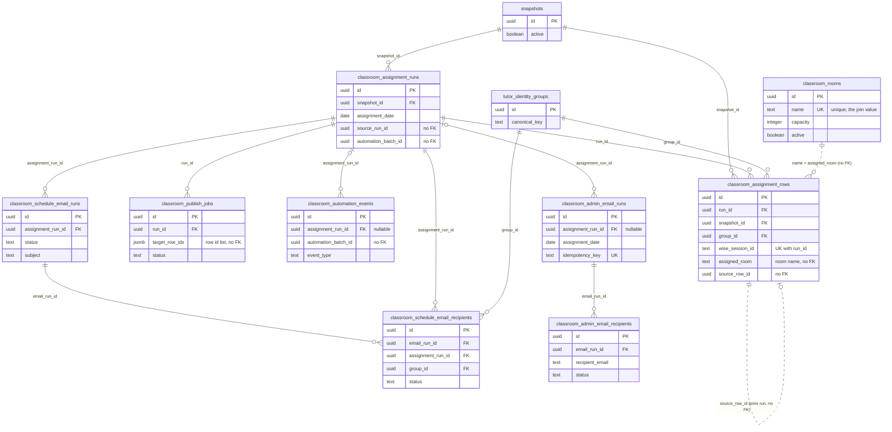

# Database Reference — Classrooms & Assignments

Feature status: **stable** — see [docs/features/classroom-assignments.md](../../features/classroom-assignments.md) for rules, flows, and the reason each rule exists.

Scope: the nine tables behind the daily room-assignment pipeline — a **room catalog**, a per-Bangkok-date **assignment run** holding one denormalized row per Wise session, a **publish job** that writes eligible rooms back to Wise, an append-only **automation event log**, and two independent **email lineages** (per-tutor schedule emails, and a single admin notification per date).

None of these tables is snapshot-scoped in the tutor sense — the Wise sync never rewrites them. An assignment run is *pinned* to the snapshot it read (`snapshotId`, a real FK) and then accumulates forever; new runs are appended per date and the newest one wins on read (`loadLatestRunForDate` orders by `createdAt desc limit 1`, `src/lib/classrooms/data.ts:588-596`). That append-only history is what makes the snapshot-pruning interaction in [Open Questions](#open-questions) worth flagging.

| Table (varName) | SQL name | schema.ts lines |
|---|---|---|
| `classroomRooms` | `classroom_rooms` | 1649–1663 |
| `classroomAssignmentRuns` | `classroom_assignment_runs` | 1664–1689 |
| `classroomAssignmentRows` | `classroom_assignment_rows` | 1690–1738 |
| `classroomPublishJobs` | `classroom_publish_jobs` | 1924–1945 |
| `classroomAutomationEvents` | `classroom_automation_events` | 1946–1964 |
| `classroomScheduleEmailRuns` | `classroom_schedule_email_runs` | 2021–2036 |
| `classroomScheduleEmailRecipients` | `classroom_schedule_email_recipients` | 2037–2055 |
| `classroomAdminEmailRuns` | `classroom_admin_email_runs` | 2056–2077 |
| `classroomAdminEmailRecipients` | `classroom_admin_email_recipients` | 2078–2095 |

Full column lists live in [index.md](./index.md); enum value sets live in [enums.md](./enums.md). This page covers grain, keys, relationships, and the write paths that create each row.

## ER Diagram

Two core tables are referenced by real foreign keys — `snapshots` and `tutor_identity_groups` — and are drawn as stub nodes rather than expanded. Solid lines are enforced SQL foreign keys (`.references(...)` in `src/lib/db/schema.ts`); dotted lines are application-level correlations with **no** FK: `classroom_assignment_runs.source_run_id` / `.automation_batch_id`, `classroom_assignment_rows.source_row_id`, `classroom_automation_events.automation_batch_id` / `.source_row_id` / `.target_row_id`, and the room-by-name join between `classroom_rooms.name` and the room-name text columns on a row.

```mermaid
erDiagram
    snapshots {
        uuid id PK
        boolean active
    }
    tutor_identity_groups {
        uuid id PK
        text canonical_key
    }

    classroom_rooms {
        uuid id PK
        text name UK "unique; the join value"
        integer capacity
        boolean active
    }

    classroom_assignment_runs {
        uuid id PK
        uuid snapshot_id FK
        date assignment_date
        uuid source_run_id "no FK"
        uuid automation_batch_id "no FK"
    }

    classroom_assignment_rows {
        uuid id PK
        uuid run_id FK
        uuid snapshot_id FK
        uuid group_id FK
        text wise_session_id "UK with run_id"
        text assigned_room "room name, no FK"
        uuid source_row_id "no FK"
    }

    classroom_publish_jobs {
        uuid id PK
        uuid run_id FK
        jsonb target_row_ids "row id list, no FK"
        text status
    }

    classroom_automation_events {
        uuid id PK
        uuid assignment_run_id FK "nullable"
        uuid automation_batch_id "no FK"
        text event_type
    }

    classroom_schedule_email_runs {
        uuid id PK
        uuid assignment_run_id FK
        text status
        text subject
    }

    classroom_schedule_email_recipients {
        uuid id PK
        uuid email_run_id FK
        uuid assignment_run_id FK
        uuid group_id FK
        text status
    }

    classroom_admin_email_runs {
        uuid id PK
        uuid assignment_run_id FK "nullable"
        date assignment_date
        text idempotency_key UK
    }

    classroom_admin_email_recipients {
        uuid id PK
        uuid email_run_id FK
        text recipient_email
        text status
    }

    snapshots ||--o{ classroom_assignment_runs : "snapshot_id"
    snapshots ||--o{ classroom_assignment_rows : "snapshot_id"
    classroom_assignment_runs ||--o{ classroom_assignment_rows : "run_id"
    tutor_identity_groups ||--o{ classroom_assignment_rows : "group_id"
    classroom_rooms ||..o{ classroom_assignment_rows : "name = assigned_room (no FK)"
    classroom_assignment_rows ||..o| classroom_assignment_rows : "source_row_id (prior run, no FK)"
    classroom_assignment_runs ||--o{ classroom_publish_jobs : "run_id"
    classroom_assignment_runs |o--o{ classroom_automation_events : "assignment_run_id"
    classroom_assignment_runs ||--o{ classroom_schedule_email_runs : "assignment_run_id"
    classroom_schedule_email_runs ||--o{ classroom_schedule_email_recipients : "email_run_id"
    classroom_assignment_runs ||--o{ classroom_schedule_email_recipients : "assignment_run_id"
    tutor_identity_groups ||--o{ classroom_schedule_email_recipients : "group_id"
    classroom_assignment_runs |o--o{ classroom_admin_email_runs : "assignment_run_id"
    classroom_admin_email_runs ||--o{ classroom_admin_email_recipients : "email_run_id"
```

## Enums

Five `pgEnum`s are declared together at `src/lib/db/schema.ts:50-83` and used only by this domain:

| Enum (varName) | SQL name | Used by | Values |
|---|---|---|---|
| `classroomRoomCategoryEnum` | `classroom_room_category` | `classroomRooms.category` | `standard`, `overflow_only`, `online_only` |
| `classroomAssignmentRunStatusEnum` | `classroom_assignment_run_status` | `classroomAssignmentRuns.status` | `completed`, `published`, `partial`, `failed` |
| `classroomAssignmentRowStatusEnum` | `classroom_assignment_row_status` | `classroomAssignmentRows.status` | `assigned`, `needs_review`, `no_room`, `remote` |
| `classroomPublishStatusEnum` | `classroom_publish_status` | `classroomAssignmentRows.publishStatus` | `not_published`, `skipped`, `success`, `failed` |
| `classroomPublishJobStatusEnum` | `classroom_publish_job_status` | `classroomPublishJobs.status` | `pending`, `running`, `succeeded`, `partial`, `failed` |

Both email lineages deliberately use plain `text` status columns instead of enums — see the two email-run sections for the value sets application code actually writes.

## Tables

### `classroomRooms` — `classroom_rooms`

Source: `src/lib/db/schema.ts:1649-1663`.

**Grain**: one row per bookable room, identified by its display **name**. `id` is a surrogate `uuid` PK (`defaultRandom()`, line 1650); the natural key is `name`, enforced by `uniqueIndex("classroom_rooms_name_idx")` (line 1660). A second index covers `active` (line 1661).

**Key columns**: `name` (`text`, unique) is the value every other table joins on; `capacity` (`integer`, not null, line 1653) and `hasTv` (`boolean`, default `false`, line 1652) drive fit checks; `category` (enum, default `standard`, line 1654) separates ordinary teaching rooms from `overflow_only` and `online_only` rooms; `active` (default `true`, line 1655) and `sortOrder` (default `0`, line 1656) control eligibility and display order.

**Write path**: the catalog is seeded and repaired idempotently by `ensureDefaultClassroomRooms` (`src/lib/classrooms/data.ts:431`), which reads existing rows, inserts only the missing ones from the `DEFAULT_CLASSROOM_ROOMS` constant, and still guards the insert with `.onConflictDoNothing({ target: schema.classroomRooms.name })` (`data.ts:451-452`) before updating drifted attributes by name (`data.ts:467-486`). Reads go through `listClassroomRooms` (`data.ts:490`), ordered by `sortOrder` then `name`.

**Relationships**: **none in SQL.** The room catalog declares no foreign key and is referenced by nobody. An assignment row stores the room's *name* in `preferredRoom` / `overrideRoom` / `assignedRoom` text columns, so the catalog is a soft lookup — renaming a room in the catalog silently orphans every historical row that carried the old name. The room-name text also carries two non-room sentinels, `NO_ROOM_AVAILABLE` (`src/lib/classrooms/rooms.ts:12`) and `REMOTE_NO_ROOM_NEEDED` (`src/lib/classrooms/assignment-engine.ts:18`), which are values `assigned_room` can hold that will never match a catalog row.

### `classroomAssignmentRuns` — `classroom_assignment_runs`

Source: `src/lib/db/schema.ts:1664-1689`.

**Grain**: one row per assignment attempt for one Bangkok calendar date. Runs are **append-only** — there is no unique index on `assignmentDate`, and the reader simply takes the newest `createdAt` for the date (`src/lib/classrooms/data.ts:588-596`). Indexes cover `assignmentDate`, `snapshotId`, and `automationBatchId` (lines 1685–1687).

**Key columns**:
- `snapshotId` (`uuid`, not null, **FK → `snapshots.id`**, line 1667) — the Wise snapshot the run read.
- `status` (enum, default `completed`, line 1668) — set to `completed` at insert (`data.ts:855`) and re-derived after every publish by `updateRunPublishStatus`: `partial` when any row's `publishStatus` is `failed`, else `published` when at least one row succeeded, else `completed` (`data.ts:1307-1333`). `failed` is declared in the enum but is not written by that derivation.
- `sourceRunId` (`uuid`, nullable, line 1670) and `automationBatchId` (`uuid`, nullable, line 1671) — **no `.references(...)`**, so neither is an enforced FK. `sourceRunId` points at the prior run an incremental reconciliation carried forward; `automationBatchId` groups the seven runs one morning-automation pass produces.
- `reconciliationMode` (`text`, nullable, line 1672) — written as `"minimal_moves"` by the incremental path (`data.ts:1014`), left `null` by a full run.
- `changeSummary` (`jsonb`, not null, default `{}`, line 1673) — the reconciliation tallies (`carried` / `added` / `changed` / `rescheduled` / `moved` / `canceled`, `src/lib/classrooms/reconciliation.ts:275-280`).
- Counters `totalSessions` / `assignedCount` / `needsReviewCount` / `noRoomCount` / `remoteCount` (lines 1674–1678) are computed from the row statuses at insert time (`data.ts:844-850`); `publishedCount` / `failedPublishCount` (lines 1679–1680) are maintained later by `updateRunPublishStatus`.
- `createdBy` (`text`, nullable, line 1681) — the admin's session email for a manual run (`src/app/api/class-assignments/run/route.ts:42`), or the literal actor `cron@classroom-assignments` for the morning automation (`src/lib/classrooms/morning-automation.ts:27,199`).

**Relationships**: parent of `classroomAssignmentRows`, `classroomPublishJobs`, `classroomScheduleEmailRuns`, `classroomScheduleEmailRecipients`, and (nullably) `classroomAutomationEvents` and `classroomAdminEmailRuns`. Child of `snapshots`.

### `classroomAssignmentRows` — `classroom_assignment_rows`

Source: `src/lib/db/schema.ts:1690-1738`. The widest table in the domain and the one the UI reads.

**Grain**: one row per Wise session per run, enforced by `uniqueIndex("car_rows_run_session_idx").on(runId, wiseSessionId)` (line 1734). Additional indexes cover `runId`, `snapshotId`, `sourceRowId`, and `changeType` (lines 1730–1733).

**Key columns**:
- `runId` (**FK → `classroomAssignmentRuns.id`**, line 1692), `snapshotId` (**FK → `snapshots.id`**, line 1693), `groupId` (**FK → `tutorIdentityGroups.id`**, line 1694) — the only three enforced references.
- A denormalized copy of the Wise session: `wiseTeacherId` / `wiseTeacherUserId` / `wiseSessionId` / `wiseClassId`, `startTime` / `endTime` plus the Bangkok-local `weekday` / `startMinute` / `endMinute`, `wiseStatus`, `sessionType`, `currentWiseLocation`, `studentName`, `studentCount`, `subject`, `classType`, `title` (lines 1696–1712). Copying rather than joining is what lets a historical run stay readable after the snapshot it read has rotated.
- Room decision: `minCapacity` and `needsTv` (the requirement), `preferredRoom` / `overrideRoom` (nullable operator inputs), and `assignedRoom` (`text`, **not null**, line 1717 — the engine always writes something, including the `NO_ROOM_AVAILABLE` / `REMOTE_NO_ROOM_NEEDED` sentinels).
- `status` (enum, default `assigned`, line 1718). Note that `needs_review` still holds a real room: `holdsRoom()` treats `assigned` and `needs_review` alike for occupancy and continuity, and the code comment (`src/lib/classrooms/reconciliation.ts:110-116`) records this as design decisions HI-01/MD-02 — a reconciled path that excluded `needs_review` would double-book the room a carried row holds.
- `sourceRowId` (`uuid`, nullable, line 1719, **no FK**) — the row in the previous run this one was carried or derived from.
- `changeType` (`text`, not null, default `manual`, line 1720). The reconciler writes one of `carried` / `added` / `changed` / `rescheduled` / `moved` (`src/lib/classrooms/reconciliation.ts:275-279`); `classifyChange` returns `carried` on a fingerprint match, `changed` when the times are identical, and `rescheduled` otherwise (`reconciliation.ts:177-188`). The DB default `manual` is what a non-reconciled insert falls back to (`src/lib/classrooms/data.ts:820`).
- `assignmentFingerprint` (`text`, nullable, line 1721) — a 24-character SHA-256 prefix over a fixed field list (`reconciliation.ts:93-104`); equality against the previous run's fingerprint is the definition of "nothing changed".
- `warnings` and `ruleTrace` (`jsonb` typed `string[]`, not null, default `[]`, lines 1722–1723) — the warning list is load-bearing, not cosmetic: `needs_review_missing_capacity` in `warnings` blocks Wise publish (`data.ts:1230-1232`).
- `publishStatus` (enum, default `not_published`, line 1724), `publishError`, `publishedAt` (lines 1725–1726). A carried row *preserves* its predecessor's publish state (`preservePublish`, `reconciliation.ts:231-245`); a changed row *resets* it to `not_published` (`resetPublish`, `reconciliation.ts:215-229`), which is what forces a re-publish only where it is needed.

**Relationships**: child of `classroomAssignmentRuns`, `snapshots`, and `tutorIdentityGroups`. Softly self-referential through `sourceRowId`. Softly linked to `classroomRooms` by room name. Referenced by id — again without an FK — from `classroomPublishJobs.targetRowIds` and `classroomAutomationEvents.sourceRowId` / `.targetRowId`.

### `classroomPublishJobs` — `classroom_publish_jobs`

Source: `src/lib/db/schema.ts:1924-1945`.

**Grain**: one row per Wise publish attempt against one assignment run. A run may have many jobs (a full publish, then targeted retries); indexes cover `runId` and `status` (lines 1942–1943).

**Key columns**: `runId` (**FK → `classroomAssignmentRuns.id`**, line 1926) is the only enforced reference. `targetRowIds` (`jsonb` typed `string[] | null`, line 1928) holds the subset of `classroom_assignment_rows.id` values to publish — `null` means "every row in the run" (`createClassroomPublishJob`, `src/lib/classrooms/data.ts:1235-1261`) — and is **not** a foreign key. `totalCount` and `eligibleCount` are computed at creation from `isClassroomPublishEligible` (`data.ts:1213-1234`), while `completedCount` / `successCount` / `failedCount` / `skippedCount` are incremented in place with SQL expressions as the job runs (`data.ts:1264-1289`). `lastError` records the failure that killed a job (`data.ts:1291-1300`); `createdBy` carries the admin's session email (`src/app/api/class-assignments/runs/[runId]/publish/route.ts:41`).

**Lifecycle**: `status` starts at the DB default `pending`, moves to `running`, and ends `succeeded` / `partial` / `failed`. A `running` job with a `startedAt` older than `PUBLISH_JOB_STALE_AFTER_MS` (6 minutes, `data.ts:133`) and no `finishedAt` is swept as stale (`isStaleRunningPublishJob`, `data.ts:1335-1338`) — the one self-healing guard in this domain.

**Relationships**: child of `classroomAssignmentRuns`. Its effect on `classroomAssignmentRows` is indirect: publishing sets each row's `publishStatus`, after which `updateRunPublishStatus` recomputes the run's counters and status.

### `classroomAutomationEvents` — `classroom_automation_events`

Source: `src/lib/db/schema.ts:1946-1964`.

**Grain**: one row per reconciliation decision — an append-only audit log, never updated. Indexes cover `automationBatchId`, `assignmentRunId`, `assignmentDate`, and `eventType` (lines 1959–1962).

**Key columns**: `assignmentRunId` (`uuid`, **nullable** FK → `classroomAssignmentRuns.id`, line 1949) is the only enforced reference; `automationBatchId` (`uuid`, **not null, no FK**, line 1948) is the correlation id for one morning-automation pass and is the column you group by to see a whole batch. `eventType` (`text`, not null, line 1951) carries the values of the `AutomationEventType` union — `added`, `changed`, `rescheduled`, `canceled`, `moved` (`src/lib/classrooms/reconciliation.ts:17`). Note the asymmetry with `classroomAssignmentRows.changeType`: `carried` produces a row but **no** event, and `canceled` produces an event (`reconciliation.ts:332`) but no surviving row. `wiseSessionId`, `sourceRowId`, and `targetRowId` (lines 1952–1954) are all nullable and none is an FK; `targetRowId` is resolved after the fact by matching `wiseSessionId` against the freshly inserted rows (`src/lib/classrooms/data.ts:942-964`). `message` (`text`, not null) is the human-readable line the UI renders; `metadata` (`jsonb`, default `{}`) carries the structured detail.

**Relationships**: optionally a child of `classroomAssignmentRuns`. Every other linkage — to a batch, to a source or target row — is by convention only.

### `classroomScheduleEmailRuns` — `classroom_schedule_email_runs`

Source: `src/lib/db/schema.ts:2021-2036`.

**Grain**: one row per per-tutor schedule-email send attempt against an assignment run. Many runs per assignment run are normal: a retry creates another, and an Apps Script sender failover creates a **second** run to carry the backup sender's attempts (`sendBackupFailoverEmails` → `createScheduleEmailRun(... status: "pending")`, `src/lib/classrooms/schedule-email.ts:898-915`). Indexed on `assignmentRunId` (line 2034).

**Key columns**: `assignmentRunId` (**FK → `classroomAssignmentRuns.id`**, not null, line 2023). `status` is plain `text` with DB default `pending` (line 2024); the values application code finalizes to come from `emailRunStatus()` — `failed` when every attempt failed, `partial` when successes mix with failures or blocks, `sent` when all succeeded, `blocked` when nothing was even attempted (`schedule-email.ts:715-719`). `subject` (not null) is stored verbatim. `createdBy` is the admin session email for a manual send, or `cron@classroom-schedule-email` from the morning automation (`src/lib/classrooms/morning-automation.ts:28,222`). The four counters `attemptedCount` / `successCount` / `failedCount` / `blockedCount` (lines 2027–2030) summarize the child recipient rows; `blockedCount` is set at creation, the rest at finalization.

**Relationships**: child of `classroomAssignmentRuns`; parent of `classroomScheduleEmailRecipients`.

### `classroomScheduleEmailRecipients` — `classroom_schedule_email_recipients`

Source: `src/lib/db/schema.ts:2037-2055`.

**Grain**: one row per tutor per schedule-email run — the per-recipient outcome ledger. Rows are inserted once with a terminal status rather than updated (`insertRecipientResult`, `src/lib/classrooms/schedule-email.ts:669-690`). Indexes cover `emailRunId`, `assignmentRunId`, and `groupId` (lines 2052–2054).

**Key columns**: three enforced FKs — `emailRunId` → `classroomScheduleEmailRuns.id` (line 2039), `assignmentRunId` → `classroomAssignmentRuns.id` (line 2040), and `groupId` → `tutorIdentityGroups.id` (line 2041). The duplicated `assignmentRunId` is not redundant bookkeeping: it is what lets a de-dup query span *all* email runs for an assignment run, so a retry never re-mails a tutor who already received one (`loadSentRecipientGroupIds` filters on `assignmentRunId` + `status = "sent"`, `schedule-email.ts:658-667`). `canonicalKey` and `tutorDisplayName` (lines 2042–2043) are denormalized identity copies; `canonicalKey` is the same soft key `tutorContacts` uses, but the enforced reference here is `groupId`, not a contacts FK. `recipientEmail` is **nullable** — a blocked recipient is recorded with no address. `status` is plain `text`, DB default `pending`, with application-written values `sent` / `failed` / `blocked` (`schedule-email.ts:675`). `resendEmailId` holds the provider message id and `error` the failure text.

**Relationships**: child of `classroomScheduleEmailRuns`, `classroomAssignmentRuns`, and `tutorIdentityGroups`.

### `classroomAdminEmailRuns` — `classroom_admin_email_runs`

Source: `src/lib/db/schema.ts:2056-2077`.

**Grain**: **one row per assignment date, at most** — the strictest guarantee in this domain. `uniqueIndex("caer_idempotency_idx").on(idempotencyKey)` (line 2074) plus the key format `classroom-admin:{assignmentDate}` (`src/lib/classrooms/admin-schedule-email.ts:300`) means a second insert for the same date raises `23505`, which `createEmailRun` catches and converts into `null` — the caller then reports `skipped` rather than sending twice (`admin-schedule-email.ts:312-318`). Indexes also cover `assignmentDate` and `assignmentRunId` (lines 2075–2076).

**Key columns**: `assignmentDate` (`date`, not null) is the natural key; `assignmentRunId` is a **nullable** FK → `classroomAssignmentRuns.id` (line 2059) precisely so a failure notice can be sent on a date where no run exists. `status` is plain `text`, default `pending`, finalized to `sent` / `partial` / `failed` (`finalizeEmailRun`, `admin-schedule-email.ts:321-343`) — the `skipped` and `pending` values you see in the API response are result-object statuses, not stored ones. `triggerKind` (`text`, default `ready`, line 2062) distinguishes the ready-summary email from the `failure` "ACTION REQUIRED" variant chosen when the pipeline is still not ready at the final retry minute (`admin-schedule-email.ts:389-396`). `createdBy` is always the literal `cron@classroom-admin-email` (`admin-schedule-email.ts:18,310`) because only the cron sends this email. `sentAt` is set only when at least one recipient succeeded; `lastError` and the three counters complete the record.

**Relationships**: optionally a child of `classroomAssignmentRuns`; parent of `classroomAdminEmailRecipients`.

### `classroomAdminEmailRecipients` — `classroom_admin_email_recipients`

Source: `src/lib/db/schema.ts:2078-2095`.

**Grain**: one row per admin address per admin-email run, inserted once per send attempt with a terminal status (`admin-schedule-email.ts:459-477`). Indexes cover `emailRunId`, `assignmentDate`, and `recipientEmail` (lines 2092–2094).

**Key columns**: `emailRunId` (**FK → `classroomAdminEmailRuns.id`**, line 2080) is the only enforced reference. `assignmentDate` is duplicated from the parent so the log can be queried by date without a join. `recipientEmail` is `text` **not null** — unlike the tutor lineage there is no blocked-with-no-address case, because recipients come from the `admin_users` list. `status` is plain `text`, default `pending`, written as `sent` or `failed` only. `providerMessageId` carries the sender's id on success; `error` the message on failure. There is no FK to `admin_users` — the address is stored as a value, so the log survives an admin being removed.

## How rows get created

Two entry points write this domain, both documented in the [feature doc](../../features/classroom-assignments.md):

- **Manual** — an admin posts to `/api/class-assignments/run` (creating a run + rows with `createdBy` = their session email), then optionally to `.../publish` (a publish job) and `.../schedule-email/send` (a schedule-email run + recipients).
- **Automated** — the cron `/api/internal/class-assignments/morning` at `41 23 * * *` UTC runs `runClassroomMorningAutomation`, which mints one `automationBatchId` and walks a **7-day** horizon (`horizonDates`, `src/lib/classrooms/morning-automation.ts:170-172`), producing one incremental run per date, publishing the targeted rows, and sending tutor schedule emails for the start date only in `failed_only` mode (`morning-automation.ts:194-234`). The cron `/api/internal/class-assignments/admin-email` at `4,14,24,36 0 * * *` UTC then makes up to four attempts at the single admin email for the date, each guarded by the idempotency key (`vercel.json:48-55`).

## Open questions

- **Snapshot pruning cannot see this domain.** `pruneOldSnapshots` keeps the 30 newest snapshots plus the active one and then deletes `tutorIdentityGroups` and `snapshots` rows (`src/lib/sync/snapshot-pruning.ts:5,64-179`), but it never touches `classroom_assignment_runs` or `classroom_assignment_rows` — both of which hold `snapshotId` FKs, and rows additionally a `groupId` FK, declared with no `onDelete` clause and therefore `NO ACTION`. Once classroom runs are older than the retention window, the delete should raise a foreign-key violation. The orchestrator catches and logs a pruning failure without failing the sync (`src/lib/sync/orchestrator.ts:527-541`), so the symptom would be silent: snapshots stop being pruned and the table grows. Should pruning skip snapshots still referenced by a classroom run, or should classroom runs be pruned alongside them?
- **Run deletion helpers are exported but unreachable.** `deleteClassroomRowsForRun` and `deleteClassroomRuns` (`src/lib/classrooms/data.ts:1922-1932`) have no callers anywhere in `src/` — a repo-wide grep returns only their definitions. Is a retention path intended, or should they be removed?
- **A crashed admin email permanently blocks its date.** If a run row is inserted and the process dies before `finalizeEmailRun`, `status` stays `pending`; the retry guard treats only `sent` / `partial` / `failed` as terminal (`admin-schedule-email.ts:258-268`), but the unique `idempotencyKey` rejects the second insert, so every later attempt returns `skipped` and that date can never be emailed. Should stale `pending` admin runs be swept the way stale publish jobs are?
- **`resendEmailId` is a stale name.** The column on `classroomScheduleEmailRecipients` is named for Resend, but the value written comes from an Apps Script sender (`createAppsScriptScheduleEmailSender`, `src/lib/classrooms/schedule-email.ts:597,919`). The admin lineage's equivalent column is named `providerMessageId`. Is renaming worth a migration?
- **Which sender delivered a schedule email is not stored.** There is no `senderKey` column on `classroomScheduleEmailRecipients`; primary vs. backup is only inferable from which `emailRunId` a row belongs to, since a failover creates a separate run. Intentional?
- **Footer commit could not be confirmed.** The footer below is reproduced exactly as specified, but `git log -1 origin/main` in this worktree resolves to `fed828d`, not `0cd1e81`, and the tree carries untracked files under `scripts/`. The line ranges above were read from the working tree at that state.

_Verified against main@0cd1e81 (clean tree) on 2026-09-02._
