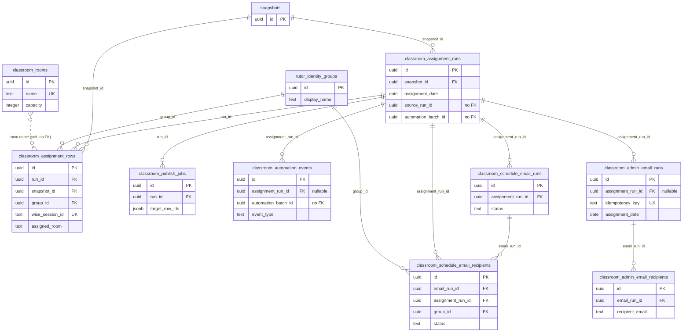

# Database Reference — Classrooms & Assignments

Schema for the daily room-assignment pipeline: a **room catalog**, a per-Bangkok-date **assignment run** with one denormalized **row per Wise session**, a **publish job** that writes eligible rooms back to Wise, an append-only **automation event log**, and two independent **email pipelines** (per-tutor schedule emails and an admin notification email).

Nothing here is snapshot-scoped in the tutor sense — the tables are never rewritten by the Wise sync. A run is *pinned* to the snapshot it read (`snapshot_id`) and accumulates forever; new runs are appended and the latest run for a date wins (`loadLatestRunForDate`, `src/lib/classrooms/data.ts:588-596`). That append-only history is what makes the snapshot-pruning interaction in [Open Questions](#open-questions) worth flagging.

All nine tables are defined in `src/lib/db/schema.ts`; the five `pgEnum`s they use are declared together at `src/lib/db/schema.ts:50-83`.

| Table (varName) | SQL name | schema.ts lines |
|---|---|---|
| `classroomRooms` | `classroom_rooms` | 1646–1660 |
| `classroomAssignmentRuns` | `classroom_assignment_runs` | 1661–1686 |
| `classroomAssignmentRows` | `classroom_assignment_rows` | 1687–1735 |
| `classroomPublishJobs` | `classroom_publish_jobs` | 1921–1942 |
| `classroomAutomationEvents` | `classroom_automation_events` | 1943–1961 |
| `classroomScheduleEmailRuns` | `classroom_schedule_email_runs` | 2018–2033 |
| `classroomScheduleEmailRecipients` | `classroom_schedule_email_recipients` | 2034–2052 |
| `classroomAdminEmailRuns` | `classroom_admin_email_runs` | 2053–2074 |
| `classroomAdminEmailRecipients` | `classroom_admin_email_recipients` | 2075–2092 |

Full column lists live in [docs/reference/database/index.md](./index.md); enum values live in [enums.md](./enums.md). Assignment rules, publish eligibility, and the morning-automation flow live in [docs/features/classroom-assignments.md](../../features/classroom-assignments.md). This page covers grain, keys, and relationships only.

## ER Diagram

```mermaid
erDiagram
    snapshots {
        uuid id PK
    }
    tutor_identity_groups {
        uuid id PK
        text display_name
    }

    classroom_rooms {
        uuid id PK
        text name UK
        integer capacity
    }
    classroom_assignment_runs {
        uuid id PK
        uuid snapshot_id FK
        date assignment_date
        uuid source_run_id "no FK"
        uuid automation_batch_id "no FK"
    }
    classroom_assignment_rows {
        uuid id PK
        uuid run_id FK
        uuid snapshot_id FK
        uuid group_id FK
        text wise_session_id UK
        text assigned_room
    }
    classroom_publish_jobs {
        uuid id PK
        uuid run_id FK
        jsonb target_row_ids
    }
    classroom_automation_events {
        uuid id PK
        uuid assignment_run_id FK "nullable"
        uuid automation_batch_id "no FK"
        text event_type
    }
    classroom_schedule_email_runs {
        uuid id PK
        uuid assignment_run_id FK
        text status
    }
    classroom_schedule_email_recipients {
        uuid id PK
        uuid email_run_id FK
        uuid assignment_run_id FK
        uuid group_id FK
        text status
    }
    classroom_admin_email_runs {
        uuid id PK
        uuid assignment_run_id FK "nullable"
        text idempotency_key UK
        date assignment_date
    }
    classroom_admin_email_recipients {
        uuid id PK
        uuid email_run_id FK
        text recipient_email
    }

    snapshots ||--o{ classroom_assignment_runs : "snapshot_id"
    snapshots ||--o{ classroom_assignment_rows : "snapshot_id"
    classroom_assignment_runs ||--o{ classroom_assignment_rows : "run_id"
    tutor_identity_groups ||--o{ classroom_assignment_rows : "group_id"
    classroom_assignment_runs ||--o{ classroom_publish_jobs : "run_id"
    classroom_assignment_runs ||--o{ classroom_automation_events : "assignment_run_id"
    classroom_assignment_runs ||--o{ classroom_schedule_email_runs : "assignment_run_id"
    classroom_schedule_email_runs ||--o{ classroom_schedule_email_recipients : "email_run_id"
    classroom_assignment_runs ||--o{ classroom_schedule_email_recipients : "assignment_run_id"
    tutor_identity_groups ||--o{ classroom_schedule_email_recipients : "group_id"
    classroom_assignment_runs ||--o{ classroom_admin_email_runs : "assignment_run_id"
    classroom_admin_email_runs ||--o{ classroom_admin_email_recipients : "email_run_id"
    classroom_rooms }o..o{ classroom_assignment_rows : "room name (soft, no FK)"
```

`snapshots` and `tutor_identity_groups` are stub nodes — they belong to [erd-core.md](./erd-core.md) and appear here only to anchor the edges. The dotted `classroom_rooms` edge is **soft**: assignment rows store the chosen room as free text (`preferred_room` / `override_room` / `assigned_room`), never as a row reference; the engine consumes rooms as value objects (`toEngineRoom`, `src/lib/classrooms/data.ts:498-505`). `assigned_room` can also hold one of two non-catalog sentinels, `NO_ROOM_AVAILABLE` (`src/lib/classrooms/rooms.ts:12`) or `REMOTE_NO_ROOM_NEEDED` (`src/lib/classrooms/assignment-engine.ts:18`).

Columns marked "no FK" are uuids that correlate rows logically but carry no Drizzle `.references()`: `classroom_assignment_runs.source_run_id` / `.automation_batch_id`, `classroom_assignment_rows.source_row_id`, and `classroom_automation_events.automation_batch_id` (NOT NULL) / `.source_row_id` / `.target_row_id`.

Every declared FK in this domain is `ON DELETE no action ON UPDATE no action` (`drizzle/0003_wandering_gravity.sql:75-78`, `drizzle/0004_round_rage.sql:46-49`, `drizzle/0005_rich_newton_destine.sql:20`, `drizzle/0023_classroom_automation.sql:61-65`) — no cascades anywhere.

## Tables

### `classroomRooms` (`classroom_rooms`)

**Grain:** one row per physical/virtual room in the catalog.

Standalone reference table with **no** foreign keys in either direction (`schema.ts:1646-1660`). `name` is unique (`classroom_rooms_name_idx`) and is the join key everything else uses; `capacity` (integer), `has_tv`, `active` (indexed, `classroom_rooms_active_idx`), and `sort_order` drive the assignment engine, and `category` is `classroom_room_category` — `standard` | `overflow_only` | `online_only` (`schema.ts:50-54`).

The table is **self-healing rather than hand-maintained**: `ensureDefaultClassroomRooms()` inserts any room missing from the in-code `DEFAULT_CLASSROOM_ROOMS` constant (`onConflictDoNothing` on `name`), forces drifted `has_tv`/`capacity`/`category`/`active`/`sort_order` back to the constant, and deactivates superseded physical room names listed in `TV_ROOM_NAME_BY_PHYSICAL_NAME` (`src/lib/classrooms/data.ts:431-488`; constant at `src/lib/classrooms/rooms.ts:62`, name map at `:34`). Every read goes through `listClassroomRooms()`, which runs that reconciliation first and then orders by `sort_order, name` (`src/lib/classrooms/data.ts:490-496`) — so an admin edit made directly in Postgres is reverted on the next read.

**Relationships:** none enforced; joined by room name string only.

### `classroomAssignmentRuns` (`classroom_assignment_runs`)

**Grain:** one row per assignment run for a Bangkok date — **not** one per date. Repeated runs (manual re-run, force reassign, morning automation) append new rows; consumers take the newest by `created_at` (`src/lib/classrooms/data.ts:588-596`, and the same "latest per date" reduction in `src/lib/room-capacity/data.ts:132-141`).

`assignment_date` is `date` in `"string"` mode and is indexed (`car_date_idx`). `snapshot_id` (NOT NULL) references `snapshots.id` (indexed `car_snapshot_idx`) and pins the run to the Wise snapshot it read. `status` is `classroom_assignment_run_status` — `completed` | `published` | `partial` | `failed` (`schema.ts:56-61`) — inserted as `completed` (`src/lib/classrooms/data.ts:857`) and later recomputed from per-row publish outcomes: `partial` if any row failed, else `published` if any row succeeded, else `completed` (`updateRunPublishStatus`, `:1307-1332`). The aggregate counters `total_sessions` / `assigned_count` / `needs_review_count` / `no_room_count` / `remote_count` are derived from the row statuses at insert (`:844-850`), and `published_count` / `failed_publish_count` are maintained by the same publish-status recompute.

Three columns exist only for the incremental automation path and carry no FK: `source_run_id` (the previous run this one was reconciled from), `automation_batch_id` (indexed `car_automation_batch_idx`), and `reconciliation_mode`. `runIncrementalClassroomAssignment()` sets all three plus `change_summary` (jsonb, default `{}`) in one insert, with `reconciliation_mode: "minimal_moves"` (`src/lib/classrooms/data.ts:1004-1017`); the plain path leaves them null. `created_by` is `"cron@classroom-assignments"` for automated runs (`src/lib/classrooms/morning-automation.ts:27`, `:199`), which is why the Data Health dashboard selects automated runs with `automation_batch_id IS NOT NULL OR created_by LIKE 'cron%'` (`src/lib/data-health/dashboard.ts:780-785`).

**Relationships:** child of `snapshots`; parent of `classroomAssignmentRows`, `classroomPublishJobs`, `classroomAutomationEvents`, `classroomScheduleEmailRuns`, `classroomScheduleEmailRecipients`, and (nullably) `classroomAdminEmailRuns`.

### `classroomAssignmentRows` (`classroom_assignment_rows`)

**Grain:** one row per Wise session inside a run — unique on `(run_id, wise_session_id)` (`car_rows_run_session_idx`, `schema.ts:1731`).

Rows are a **fully denormalized copy** of the session plus the assignment decision, so a run renders without joining snapshot tables. The source is `future_session_blocks` inner-joined to `tutor_identity_groups`, filtered to the run's snapshot, `is_blocking = true`, and the Bangkok day window (`loadAssignmentSessions`, `src/lib/classrooms/data.ts:736-783`) — which is where `group_id`, `wise_teacher_id`/`wise_teacher_user_id`, the `start_time`/`end_time` + `weekday`/`start_minute`/`end_minute` triple, `wise_status`, `session_type`, `current_wise_location`, and the `student_name`/`student_count`/`subject`/`class_type`/`title` descriptors all come from.

The decision columns are the inputs `min_capacity` / `needs_tv` / `preferred_room` / `override_room`, the output `assigned_room` (NOT NULL), and `status` — `classroom_assignment_row_status`: `assigned` | `needs_review` | `no_room` | `remote` (`schema.ts:63-68`). `warnings` and `rule_trace` are jsonb `string[]` (default `[]`) carrying the engine's explanation.

Reconciliation columns: `source_row_id` (uuid, no FK, indexed `car_rows_source_row_idx`), `change_type` (plain text, column default `"manual"`, indexed `car_rows_change_type_idx`; the writer's union is `manual` | `carried` | `added` | `changed` | `rescheduled` | `moved`, `src/lib/classrooms/reconciliation.ts:14`), and `assignment_fingerprint` — a 24-hex-char SHA-256 over 17 session fields, used to detect whether a session materially changed between runs (`assignmentFingerprint()`, `src/lib/classrooms/reconciliation.ts:66-99`).

Publish state is tracked per row: `publish_status` is `classroom_publish_status` — `not_published` | `skipped` | `success` | `failed` (`schema.ts:70-75`) — alongside `publish_error` and `published_at`, written by `markPublishResult()`, which also refreshes `current_wise_location` on success (`src/lib/classrooms/data.ts:1161-1182`).

**Relationships:** child of `classroomAssignmentRuns` (`run_id`, indexed `car_rows_run_idx`), `snapshots` (`snapshot_id`, indexed `car_rows_snapshot_idx`), and `tutorIdentityGroups` (`group_id`). Read cross-domain by Room Capacity to recover per-date manual overrides (`src/lib/room-capacity/data.ts:146-153`).

### `classroomPublishJobs` (`classroom_publish_jobs`)

**Grain:** one row per attempt to publish a run's rooms back to Wise — job-level state, complementary to the per-row `publish_status`. A run may have many jobs.

`run_id` (NOT NULL) references `classroomAssignmentRuns.id` (indexed `classroom_publish_jobs_run_idx`); `status` is indexed (`classroom_publish_jobs_status_idx`) and uses `classroom_publish_job_status` — `pending` | `running` | `succeeded` | `partial` | `failed` (`schema.ts:77-83`; note `succeeded`, not `success`, unlike the row-level enum). `target_row_ids` is a nullable jsonb `string[]`: a subset of rows to publish, with `null` meaning the whole run (`src/lib/classrooms/data.ts:1248-1256` at creation, re-applied at execution `:1494-1495`).

`total_count` / `eligible_count` are set at creation and rewritten once at the start of execution after eligibility is re-evaluated (`:1518-1525`); `completed_count` / `success_count` / `failed_count` / `skipped_count` are advanced with SQL `+` increments so a poller sees partial progress mid-run (`incrementPublishJobCounters`, `:1265-1288`). Terminal status is derived from the summary — `partial` when some succeeded and some failed, `failed` when none succeeded, else `succeeded` (`:1715-1729`) — and `finished_at` is stamped at the same time. A job left `running` for more than `PUBLISH_JOB_STALE_AFTER_MS` (6 minutes, `:133`) is force-failed on the next progress poll (`isStaleRunningPublishJob` / `failStalePublishJob`, `:1335-1353`), which also recomputes the parent run's publish status.

**Relationships:** child of `classroomAssignmentRuns`. Read by the admin email pipeline to decide whether automation is still in flight (`publishPending`, `src/lib/classrooms/admin-schedule-email.ts:265-267`).

### `classroomAutomationEvents` (`classroom_automation_events`)

**Grain:** one row per reconciliation event emitted while an automated batch runs — append-only, never updated.

`automation_batch_id` (uuid, NOT NULL, **no FK**, indexed `cae_batch_idx`) is the correlation key: a `randomUUID()` minted once per automation invocation (`src/lib/classrooms/morning-automation.ts:185`) and shared with `classroom_assignment_runs.automation_batch_id`. `assignment_run_id` is a **nullable** FK to `classroomAssignmentRuns.id` (indexed `cae_run_idx`), `assignment_date` is indexed (`cae_date_idx`), and `event_type` is plain text (indexed `cae_type_idx`) whose writer union is `added` | `changed` | `rescheduled` | `canceled` | `moved` (`src/lib/classrooms/reconciliation.ts:15`). `message` (NOT NULL) is the human-readable line and `metadata` is jsonb (default `{}`).

`wise_session_id`, `source_row_id`, and `target_row_id` are nullable correlation columns with no FK. `target_row_id` is resolved after the fact by matching the event's `wise_session_id` against the rows just written for the new run (`persistAutomationEvents`, `src/lib/classrooms/data.ts:942-965`) — so a `canceled` event, which has no successor row, keeps a null `target_row_id`.

**Relationships:** child of `classroomAssignmentRuns` (nullable); siblings within a batch found via `automation_batch_id`.

### `classroomScheduleEmailRuns` (`classroom_schedule_email_runs`)

**Grain:** one row per **send attempt** of per-tutor schedule emails, not one per assignment run. Every call to `sendScheduleEmailsForRun()` inserts a run row (`src/lib/classrooms/schedule-email.ts:1057-1063`), and an automatic primary→backup failover inserts a *second* row for the same assignment run (`sendBackupFailoverEmails`, `:909-915`). Retries and `failed_only` re-sends therefore accumulate rows against one `assignment_run_id`.

`assignment_run_id` (NOT NULL) references `classroomAssignmentRuns.id` (indexed `cser_assignment_run_idx`). `status` is plain text with column default `pending`; it is inserted as `pending` when the batch is sendable and `blocked` when it is not (`:1057-1063`), then finalized by `emailRunStatus()` to `sent` | `partial` | `failed` | `blocked` from the tallied counts (`:715-719`, applied in `finalizeScheduleEmailRun`, `:796-812`). `subject` (NOT NULL) is the rendered subject line, `created_by` the acting admin (nullable), and `attempted_count` / `success_count` / `failed_count` / `blocked_count` mirror the per-recipient outcomes.

**Relationships:** child of `classroomAssignmentRuns`; parent of `classroomScheduleEmailRecipients`.

### `classroomScheduleEmailRecipients` (`classroom_schedule_email_recipients`)

**Grain:** one row per tutor outcome within a schedule-email run — including tutors that were never emailed. Blocked recipients are inserted with the block reason in `error`, so the table is a complete audit of who was considered, not just who was sent to (`recordRecipientOutcome` → `insertRecipientResult`, `src/lib/classrooms/schedule-email.ts:669-691`, `:814-843`).

`recipient_email` is **nullable** — a tutor with no resolved contact still gets a row. `status` is plain text (default `pending`) written as `sent` | `failed` | `blocked` (`:675`), `canonical_key` / `tutor_display_name` denormalize the tutor identity, and `error` carries the failure or block reason.

`assignment_run_id` is denormalized alongside `email_run_id` specifically so a resend can skip tutors already delivered for that assignment run without joining the email-run table: `loadSentRecipientGroupIds()` selects `group_id` where `assignment_run_id = ? AND status = 'sent'` (`:658-667`), and both the `failed_only` mode and the backup failover consult it (`:1045-1050`, `:917`, `:938-950`).

`resend_email_id` is a **legacy name**: schedule mail is sent through a Google Apps Script webhook, not Resend (`createAppsScriptScheduleEmailSender`, `:597-635`), and the stored value is the Apps Script response id or the synthesized fallback `apps-script:{idempotencyKey}` (`:632`, written at `:982` and `:1124`). See [Open Questions](#open-questions).

**Relationships:** child of `classroomScheduleEmailRuns` (`email_run_id`, indexed `cser_recipients_email_run_idx`), `classroomAssignmentRuns` (`assignment_run_id`, indexed `cser_recipients_assignment_run_idx`), and `tutorIdentityGroups` (`group_id`, indexed `cser_recipients_group_idx`).

### `classroomAdminEmailRuns` (`classroom_admin_email_runs`)

**Grain:** one row per admin-notification send for a Bangkok date — and the database enforces it. `idempotency_key` carries a `uniqueIndex` (`caer_idempotency_idx`) and the writer builds it as `` `classroom-admin:${assignmentDate}` `` (`src/lib/classrooms/admin-schedule-email.ts:295`), so exactly one row can ever exist per date. `createEmailRun()` catches the resulting `23505` and returns `null`, which the caller reports as `skipped` (`:296-315`, `:394-405`).

`assignment_date` is indexed (`caer_date_idx`); `assignment_run_id` is a **nullable** FK to `classroomAssignmentRuns.id` (indexed `caer_assignment_run_idx`) because a failure-summary email is sent even when no run exists for the date. `trigger_kind` (text, default `ready`) is set to `ready` or `failure` depending on whether automation finished before the 07:30 Bangkok final-retry cutoff (`:19`, `:369-393`), and `subject` differs accordingly. `status` (text, default `pending`) is finalized to `sent` | `partial` | `failed` by counts (`finalizeEmailRun`, `:317-338`), with `sent_at` stamped only when at least one delivery succeeded; a run with no configured `admin_users` recipients is short-circuited to `failed` with `last_error` set (`:421-442`). `created_by` is the constant actor `"cron@classroom-admin-email"` (`:18`).

Re-entrancy is guarded twice: `hasTerminalAdminEmailForDate()` checks for an existing row in `sent`/`partial`/`failed` before doing any work (`:253-263`), and the unique index catches the race.

**Relationships:** child of `classroomAssignmentRuns` (nullable); parent of `classroomAdminEmailRecipients`. Surfaced on the Data Health dashboard as a job lineage (`src/lib/data-health/dashboard.ts:786`).

### `classroomAdminEmailRecipients` (`classroom_admin_email_recipients`)

**Grain:** one row per admin address delivery attempt within an admin-email run, inserted inside the send loop as each address succeeds or fails (`src/lib/classrooms/admin-schedule-email.ts:444-473`).

`email_run_id` (NOT NULL) references `classroomAdminEmailRuns.id` (indexed `caer_recipients_email_run_idx`). `assignment_date` is denormalized and indexed (`caer_recipients_date_idx`), as is `recipient_email` (NOT NULL, `caer_recipients_email_idx`). `status` is plain text (default `pending`) written only as `sent` or `failed`; success stores the Apps Script id in `provider_message_id` and failure stores the message in `error`. The recipient list is the full `admin_users` table, de-duplicated, lower-cased, and sorted (`loadAdminEmails`, `:201-206`) — there is no FK to `admin_users`, only the copied address.

**Relationships:** child of `classroomAdminEmailRuns`.

## Lifecycle at a glance

1. `classroomRooms` is reconciled against the in-code catalog on **every** read path.
2. A run row is appended to `classroomAssignmentRuns` for a Bangkok `assignment_date`, pinned to a `snapshots` row.
3. One `classroomAssignmentRows` row per blocking `future_session_blocks` session is written, carrying `assigned_room`, `status`, and the `rule_trace`/`warnings` explanation.
4. Incremental automation additionally sets `source_run_id` / `automation_batch_id` / `reconciliation_mode` on the run and appends a `classroomAutomationEvents` row per changed session.
5. Publishing to Wise is tracked at job level in `classroomPublishJobs` and per row via `publish_status` / `publish_error` / `published_at`; the run's `status` and publish counters are recomputed from the rows.
6. Notifications fan out through two independent pipelines: tutor schedule emails (`classroomScheduleEmailRuns` → `classroomScheduleEmailRecipients`, one run per send attempt) and the once-per-date admin email (`classroomAdminEmailRuns` → `classroomAdminEmailRecipients`).

## Open Questions

- **Snapshot pruning has no classroom step.** `pruneOldSnapshots()` keeps the newest 30 snapshots plus the active one and then deletes `tutor_identity_groups` and `snapshots` rows for the rest (`src/lib/sync/snapshot-pruning.ts:5`, `:49-179`), but it never touches `classroom_assignment_runs` / `classroom_assignment_rows` / `classroom_schedule_email_recipients` — all of which hold `ON DELETE no action` FKs to those tables. With a 30-minute sync cron, 30 snapshots is roughly 15 hours of retention, so any classroom run older than that appears to reference a snapshot the pruner will try to delete, which should raise a foreign-key violation. The orchestrator catches the failure and records it in `sync_runs.metadata.pruning` rather than failing the sync (`src/lib/sync/orchestrator.ts:520-548`), so it would fail silently. No test covers classroom rows during pruning (`src/lib/sync/__tests__/snapshot-pruning.integration.test.ts` never mentions them). Should pruning delete or detach classroom runs, or should classroom runs stop referencing `snapshots`/`tutor_identity_groups` by FK?
- **`classroom_assignment_run_status` has a `failed` value nothing writes.** Only `src/lib/classrooms/data.ts` writes this table, and it sets `completed` (`:857`, `:1110`) or the publish-derived `partial` / `published` / `completed` (`:1317-1322`). Is `failed` reserved for a future failure path, or dead?
- **`resend_email_id` is misnamed.** Schedule mail goes through an Apps Script webhook, and the column stores the Apps Script id or `apps-script:{idempotencyKey}` (`src/lib/classrooms/schedule-email.ts:597-635`). The sibling admin table calls the same value `provider_message_id` (`schema.ts:2081`). Should the schedule column be renamed for consistency?
- **A crashed admin email permanently blocks its date.** If a run row is inserted but never finalized, its `status` stays `pending`; the retry guard only treats `sent`/`partial`/`failed` as terminal (`src/lib/classrooms/admin-schedule-email.ts:253-263`), but the unique `idempotency_key` rejects the second insert, so the retry returns `skipped` and that date can never be emailed. Should stale `pending` runs be swept, the way stale publish jobs are?
- **Classroom run deletion is exported but unreachable.** `deleteClassroomRuns()` and `deleteClassroomRowsForRun()` (`src/lib/classrooms/data.ts:1922-1933`) have no callers anywhere in the repo, and with `ON DELETE no action` the former would fail while any child row exists. Is a retention/cleanup path intended, or should these be removed?
- **Primary vs backup sender is not persisted.** `classroom_schedule_email_recipients` has no `sender_key` column, so which sender delivered a message is only inferable from which `email_run_id` the row belongs to (`src/lib/classrooms/schedule-email.ts:814-853` carries `senderKey` in the API response only). Intentional?

_Verified against HEAD + uncommitted WIP on 2026-05-31._
