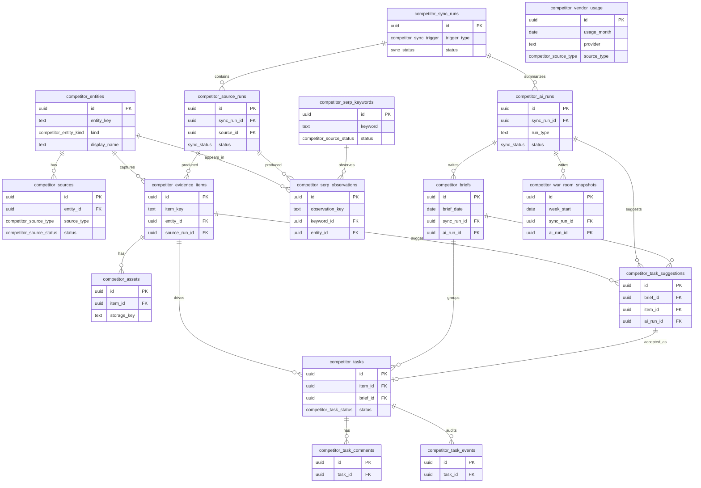

# Competitor Intelligence ERD

Mechanical table reference for the Competitor Intelligence domain. The current
handbook has no feature page for this area yet; this page exists so the database
reference has a real home for the 16 persisted tables already defined in
[`src/lib/db/schema.ts`](../../../src/lib/db/schema.ts).

The domain is snapshot-independent. It tracks configured entities/sources, provider
sync runs, captured evidence, generated briefs/snapshots, task suggestions/tasks, and
provider usage.

## Tables

| Table | Grain |
|---|---|
| `competitor_entities` | One tracked competitor or own-brand entity. |
| `competitor_sources` | One configured website/social/SERP/manual source for an entity. |
| `competitor_sync_runs` | One cron/manual/backfill sync run. |
| `competitor_source_runs` | One provider execution for a source inside a sync run. |
| `competitor_evidence_items` | One captured evidence item, deduped by `item_key`. |
| `competitor_assets` | One stored media/attachment asset for an evidence item. |
| `competitor_serp_keywords` | One tracked keyword/language/location/device tuple. |
| `competitor_serp_observations` | One observed SERP result row. |
| `competitor_ai_runs` | One AI summarization/classification run. |
| `competitor_briefs` | One daily competitor brief. |
| `competitor_war_room_snapshots` | One weekly war-room snapshot. |
| `competitor_task_suggestions` | One suggested response task. |
| `competitor_tasks` | One accepted/manual response task. |
| `competitor_task_comments` | One comment/attachment entry on a task. |
| `competitor_task_events` | One audit event on a task. |
| `competitor_vendor_usage` | One monthly provider/source-type usage ledger row. |

_Verified against HEAD + uncommitted WIP on 2026-07-02._
