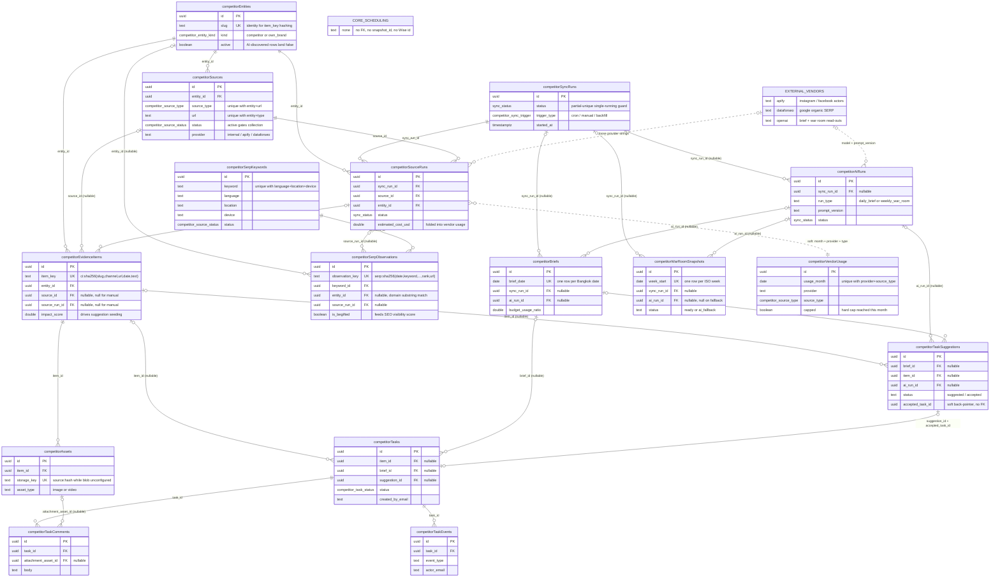

# Database Reference — Competitor Intelligence (ER Diagram)

Scope: the 16 tables backing the Competitor Intelligence feature (**stable**). The domain pulls competitor website, social, and SERP evidence through paid vendors under a monthly USD cap, normalizes every fetch into a scored evidence item, and regenerates a daily brief plus a weekly War Room snapshot on top of it.

The spine is a **run ledger fan-out**: one `competitor_sync_runs` row per attempt, one `competitor_source_runs` child per source fetched inside it, and every evidence row and SERP observation stamped with the child run that produced it. Nothing is snapshot-scoped and nothing is rewritten wholesale — evidence accumulates and is deduplicated by a content-derived key, so a re-run of the same source updates rows in place rather than replacing a generation.

A **budget accumulator** (`competitor_vendor_usage`) sits beside that spine, keyed by month × provider × source type, and is consulted before each paid fetch. Downstream, AI read-outs land in `competitor_ai_runs` and are published as a dated `competitor_briefs` row and a week-keyed `competitor_war_room_snapshots` row; both fan out into `competitor_task_suggestions`, which a human promotes into a `competitor_tasks` row — suggestions are never auto-executed.

Full column-by-column detail (types, defaults, every index) lives in [`./index.md`](./index.md); enum value sets live in [`./enums.md`](./enums.md#competitor-intelligence). This page covers grain, keys, and relationships only. For purpose, business rules, and flows see [`../../features/competitor-intelligence.md`](../../features/competitor-intelligence.md).

## Scope

Exactly 16 tables (Drizzle export — Postgres table — `src/lib/db/schema.ts` line range), all declared under the `// ── Competitor Intelligence ──` section header at `schema.ts:793`:

| Table (varName) | Postgres table | Lines | Grain scope |
|---|---|---|---|
| `competitorEntities` | `competitor_entities` | 795–815 | one tracked brand (competitor or own) |
| `competitorSources` | `competitor_sources` | 816–843 | one monitored URL per entity |
| `competitorSyncRuns` | `competitor_sync_runs` | 844–870 | run ledger (lineage root) |
| `competitorSourceRuns` | `competitor_source_runs` | 871–895 | one source fetch inside one run |
| `competitorEvidenceItems` | `competitor_evidence_items` | 896–928 | one deduped evidence item |
| `competitorAssets` | `competitor_assets` | 929–946 | one media artifact per item |
| `competitorSerpKeywords` | `competitor_serp_keywords` | 947–967 | one tracked keyword variant |
| `competitorSerpObservations` | `competitor_serp_observations` | 968–995 | one SERP result at one observation |
| `competitorAiRuns` | `competitor_ai_runs` | 996–1014 | one AI (or attempted AI) call |
| `competitorBriefs` | `competitor_briefs` | 1015–1037 | one row per Bangkok date |
| `competitorWarRoomSnapshots` | `competitor_war_room_snapshots` | 1038–1062 | one row per ISO week start |
| `competitorTaskSuggestions` | `competitor_task_suggestions` | 1063–1085 | one machine proposal |
| `competitorTasks` | `competitor_tasks` | 1086–1109 | one human-owned response task |
| `competitorTaskComments` | `competitor_task_comments` | 1110–1120 | one comment on a task |
| `competitorTaskEvents` | `competitor_task_events` | 1121–1131 | one audit event on a task |
| `competitorVendorUsage` | `competitor_vendor_usage` | 1132–1149 | month × provider × source type |

Five domain enums back these tables — `competitor_sync_trigger` (`schema.ts:198`), `competitor_entity_kind` (`204`), `competitor_source_type` (`209`), `competitor_source_status` (`218`), `competitor_task_status` (`225`). Three status columns instead reuse the shared `sync_status` enum: `competitor_sync_runs.status`, `competitor_source_runs.status`, and `competitor_ai_runs.status`.

## Relationship model

**The domain is closed.** Every `.references(...)` inside the 16-table block points at another competitor table, and no table anywhere else in `schema.ts` references one of them — a grep for `references(() => competitor` returns hits only in lines 818–1123. There is no `snapshot_id`, no tutor or identity-group key, and no Wise id column: Competitor Intelligence shares the database with the scheduling spine but touches none of it.

**Enforced foreign keys**, all 25 of them, by parent:

- → `competitorEntities.id`: `competitorSources.entityId` (`notNull`, `schema.ts:818`), `competitorSourceRuns.entityId` (`notNull`, `875`), `competitorEvidenceItems.entityId` (`notNull`, `899`), `competitorSerpObservations.entityId` (nullable, `972`)
- → `competitorSources.id`: `competitorSourceRuns.sourceId` (`notNull`, `874`), `competitorEvidenceItems.sourceId` (nullable, `900`)
- → `competitorSyncRuns.id`: `competitorSourceRuns.syncRunId` (`notNull`, `873`), `competitorAiRuns.syncRunId` (nullable, `998`), `competitorBriefs.syncRunId` (nullable, `1018`), `competitorWarRoomSnapshots.syncRunId` (nullable, `1044`)
- → `competitorSourceRuns.id`: `competitorEvidenceItems.sourceRunId` (nullable, `901`), `competitorSerpObservations.sourceRunId` (nullable, `973`)
- → `competitorEvidenceItems.id`: `competitorAssets.itemId` (`notNull`, `931`), `competitorTaskSuggestions.itemId` (nullable, `1066`), `competitorTasks.itemId` (nullable, `1088`)
- → `competitorSerpKeywords.id`: `competitorSerpObservations.keywordId` (`notNull`, `971`)
- → `competitorAiRuns.id`: `competitorBriefs.aiRunId` (nullable, `1019`), `competitorWarRoomSnapshots.aiRunId` (nullable, `1045`), `competitorTaskSuggestions.aiRunId` (nullable, `1067`)
- → `competitorBriefs.id`: `competitorTaskSuggestions.briefId` (nullable, `1065`), `competitorTasks.briefId` (nullable, `1089`)
- → `competitorTaskSuggestions.id`: `competitorTasks.suggestionId` (nullable, `1090`)
- → `competitorTasks.id`: `competitorTaskComments.taskId` (`notNull`, `1112`), `competitorTaskEvents.taskId` (`notNull`, `1123`)
- → `competitorAssets.id`: `competitorTaskComments.attachmentAssetId` (nullable, `1114`)

`competitorVendorUsage` declares no FK and is referenced by nothing — it is joined only implicitly, by the `(provider, sourceType)` pair a source run also carries.

**One deliberate soft key.** `competitorTaskSuggestions.acceptedTaskId` is a bare `uuid` with **no** `.references(...)` (`schema.ts:1076`), even though `competitorTasks.suggestionId` is a real FK in the other direction. Promotion writes both halves in the same `Promise.all` — the task row is inserted with `suggestionId`, then the suggestion is flipped to `status: "accepted"` with `acceptedTaskId` set (`src/lib/competitor-intelligence/data.ts:594-638`) — so the unenforced back-pointer is redundant with the enforced forward one.

**Soft joins, no FK.**

- **Evidence ↔ entity, at normalization time.** The `item_key` that deduplicates evidence is built from the entity *slug*, not its id: `ci:` + a 24-hex SHA-256 prefix over `entitySlug | channel | canonicalUrl | publishedAt | contentText.slice(0,500)` (`src/lib/competitor-intelligence/normalization.ts:50-65`). Renaming an entity's slug therefore re-keys every future capture of it.
- **SERP observation → entity** is resolved by substring, not by id. `entityIdForObservation` scans the concatenated `url + displayUrl + title` for a known domain fragment and returns the matching entity id or `null` (`sync.ts:315-319`), which is why `competitorSerpObservations.entityId` is nullable: a SERP row for an untracked domain is still stored.
- **Source run → vendor usage** on `(provider, sourceType)` for the current month, read before the fetch and accumulated after it (`sync.ts:166-212`).

## ER diagram

```mermaid
erDiagram
    competitorEntities {
        uuid id PK
        text slug UK "identity for item_key hashing"
        competitor_entity_kind kind "competitor or own_brand"
        boolean active "AI-discovered rows land false"
    }
    competitorSources {
        uuid id PK
        uuid entity_id FK
        competitor_source_type source_type "unique with entity+url"
        text url "unique with entity+type"
        competitor_source_status status "active gates collection"
        text provider "internal / apify / dataforseo"
    }
    competitorSyncRuns {
        uuid id PK
        sync_status status "partial-unique single-running guard"
        competitor_sync_trigger trigger_type "cron / manual / backfill"
        timestamptz started_at
    }
    competitorSourceRuns {
        uuid id PK
        uuid sync_run_id FK
        uuid source_id FK
        uuid entity_id FK
        sync_status status
        double estimated_cost_usd "folded into vendor usage"
    }
    competitorEvidenceItems {
        uuid id PK
        text item_key UK "ci:sha256(slug,channel,url,date,text)"
        uuid entity_id FK
        uuid source_id FK "nullable, null for manual"
        uuid source_run_id FK "nullable, null for manual"
        double impact_score "drives suggestion seeding"
    }
    competitorAssets {
        uuid id PK
        uuid item_id FK
        text storage_key UK "source:hash while blob unconfigured"
        text asset_type "image or video"
    }
    competitorSerpKeywords {
        uuid id PK
        text keyword "unique with language+location+device"
        text language
        text location
        text device
        competitor_source_status status
    }
    competitorSerpObservations {
        uuid id PK
        text observation_key UK "serp:sha256(date,keyword,...,rank,url)"
        uuid keyword_id FK
        uuid entity_id FK "nullable, domain substring match"
        uuid source_run_id FK "nullable"
        boolean is_begifted "feeds SEO visibility score"
    }
    competitorAiRuns {
        uuid id PK
        uuid sync_run_id FK "nullable"
        text run_type "daily_brief or weekly_war_room"
        text prompt_version
        sync_status status
    }
    competitorBriefs {
        uuid id PK
        date brief_date UK "one row per Bangkok date"
        uuid sync_run_id FK "nullable"
        uuid ai_run_id FK "nullable"
        double budget_usage_ratio
    }
    competitorWarRoomSnapshots {
        uuid id PK
        date week_start UK "one row per ISO week"
        uuid sync_run_id FK "nullable"
        uuid ai_run_id FK "nullable, null on fallback"
        text status "ready or ai_fallback"
    }
    competitorTaskSuggestions {
        uuid id PK
        uuid brief_id FK "nullable"
        uuid item_id FK "nullable"
        uuid ai_run_id FK "nullable"
        text status "suggested / accepted"
        uuid accepted_task_id "soft back-pointer, no FK"
    }
    competitorTasks {
        uuid id PK
        uuid item_id FK "nullable"
        uuid brief_id FK "nullable"
        uuid suggestion_id FK "nullable"
        competitor_task_status status
        text created_by_email
    }
    competitorTaskComments {
        uuid id PK
        uuid task_id FK
        uuid attachment_asset_id FK "nullable"
        text body
    }
    competitorTaskEvents {
        uuid id PK
        uuid task_id FK
        text event_type
        text actor_email
    }
    competitorVendorUsage {
        uuid id PK
        date usage_month "unique with provider+source_type"
        text provider
        competitor_source_type source_type
        boolean capped "hard cap reached this month"
    }
    EXTERNAL_VENDORS {
        text apify "instagram / facebook actors"
        text dataforseo "google organic SERP"
        text openai "brief + war room read-outs"
    }
    CORE_SCHEDULING {
        text none "no FK, no snapshot_id, no Wise id"
    }

    competitorEntities ||--o{ competitorSources : "entity_id"
    competitorEntities ||--o{ competitorSourceRuns : "entity_id"
    competitorEntities ||--o{ competitorEvidenceItems : "entity_id"
    competitorEntities |o--o{ competitorSerpObservations : "entity_id (nullable)"
    competitorSyncRuns ||--o{ competitorSourceRuns : "sync_run_id"
    competitorSyncRuns |o--o{ competitorAiRuns : "sync_run_id (nullable)"
    competitorSyncRuns |o--o{ competitorBriefs : "sync_run_id (nullable)"
    competitorSyncRuns |o--o{ competitorWarRoomSnapshots : "sync_run_id (nullable)"
    competitorSources ||--o{ competitorSourceRuns : "source_id"
    competitorSources |o--o{ competitorEvidenceItems : "source_id (nullable)"
    competitorSourceRuns |o--o{ competitorEvidenceItems : "source_run_id (nullable)"
    competitorSourceRuns |o--o{ competitorSerpObservations : "source_run_id (nullable)"
    competitorSerpKeywords ||--o{ competitorSerpObservations : "keyword_id"
    competitorEvidenceItems ||--o{ competitorAssets : "item_id"
    competitorEvidenceItems |o--o{ competitorTaskSuggestions : "item_id (nullable)"
    competitorEvidenceItems |o--o{ competitorTasks : "item_id (nullable)"
    competitorAiRuns |o--o{ competitorBriefs : "ai_run_id (nullable)"
    competitorAiRuns |o--o{ competitorWarRoomSnapshots : "ai_run_id (nullable)"
    competitorAiRuns |o--o{ competitorTaskSuggestions : "ai_run_id (nullable)"
    competitorBriefs |o--o{ competitorTaskSuggestions : "brief_id (nullable)"
    competitorBriefs |o--o{ competitorTasks : "brief_id (nullable)"
    competitorTaskSuggestions |o--o| competitorTasks : "suggestion_id + accepted_task_id"
    competitorTasks ||--o{ competitorTaskComments : "task_id"
    competitorTasks ||--o{ competitorTaskEvents : "task_id"
    competitorAssets |o--o{ competitorTaskComments : "attachment_asset_id (nullable)"
    competitorSourceRuns }o..|| competitorVendorUsage : "soft: month + provider + type"
    EXTERNAL_VENDORS |o..o{ competitorSourceRuns : "loose provider strings"
    EXTERNAL_VENDORS |o..o{ competitorAiRuns : "model + prompt_version"
```

`CORE_SCHEDULING` is drawn deliberately unconnected: there is no edge to draw. Unlike Payroll or Credit Control, this domain never joins the tutor snapshot spine — see [Cross-domain notes](#cross-domain-notes).

## Tables

### `competitorEntities` (`competitor_entities`, lines 795–815)

**Grain:** one row per tracked brand. `kind` is `competitor` or `own_brand` — BeGifted itself is a row, seeded with slug `begifted`, so its own SERP and social presence sit in the same tables as the competition (`src/lib/competitor-intelligence/default-sources.ts:26-31`).

`competitor_entities_slug_idx` is unique on `slug`, and `slug` is the upsert conflict target for all three writers: the seeder (`data.ts:80`), the own-brand ensure path (`data.ts:462`), and AI discovery (`sync.ts:484`). It is also the value hashed into every evidence `item_key`.

**AI-discovered rows arrive dormant.** `upsertDiscoveredCompetitors` only considers suggestions with `confidence >= 0.8`, slugifies the name (falling back to `ai-<hash>` if slugification empties it), and inserts with `discoveredBy: "ai"`, `discoveryMetadata: { needsReview: true }`, and `active: false` (`sync.ts:461-492`). Since collection filters on `competitorEntities.active = true` (`data.ts:172-175`), a discovered competitor contributes nothing until a human activates it. On conflict the upsert raises confidence with `greatest(...)` rather than overwriting it, so a re-suggestion can only increase the score.

### `competitorSources` (`competitor_sources`, lines 816–843)

**Grain:** one row per monitored URL for an entity — `competitor_sources_entity_type_url_idx` is unique on `(entityId, sourceType, url)`, which is also the conflict target every writer uses.

Carries the vendor routing (`provider`, defaulting to `"internal"`), a `priority` (default 50) that orders collection, `status` (`competitor_source_status`), a `reliability` string set to `"best_effort"` for Instagram/Facebook and `"reliable"` otherwise (`data.ts:48-51`), the `captureMedia` / `bestEffort` flags, a free-form `config` jsonb (Apify reads `config.limit` from it, `sync.ts:128`), and the last-attempt trio `lastRunAt` / `lastSuccessAt` / `lastError`.

`lastError` is the health signal the brief and War Room read: `sourceHealth` counts an `active` source as healthy exactly when `lastError` is null (`sync.ts:360-376`), and that ratio becomes `competitorBriefs.coverageScore`.

**Status is the collection gate.** `listActiveCompetitorSources` requires both `sources.status = 'active'` and `entities.active = true` (`data.ts:172-175`). The PATCH route accepts all four enum values including `archived` (`src/app/api/competitor-intelligence/sources/[sourceId]/route.ts:9-10`); own-brand disabling routes through the same helper with `"disabled"` (`data.ts:580-592`).

### `competitorSyncRuns` (`competitor_sync_runs`, lines 844–870)

**Grain:** one row per attempted collection run. Lineage root — source runs, AI runs, briefs, and War Room snapshots all point back at it.

Holds `status` (`sync_status`), `triggerType` (`competitor_sync_trigger`: `cron` / `manual` / `backfill`, default `"manual"`), `actorEmail` (the cron path stamps `cron@begifted.local`, `sync.ts:500`), the `startedAt` / `finishedAt` pair, ten counters — `sourceCount`, `sourceSuccessCount`, `sourceFailedCount`, `sourceSkippedCount`, `itemCount`, `newItemCount`, `assetCount`, `aiRunCount`, `taskSuggestionCount`, `budgetSkippedCount` — an `errorSummary`, and a `metadata` jsonb the run fills with the seeded entity/source/keyword counts.

**Two single-flight guards, one belt and one braces.** `competitor_sync_runs_single_running_idx` is a unique index on `status` filtered to `status = 'running'` (`schema.ts:864-866`), so Postgres itself rejects a second concurrent insert. The application additionally does a pre-flight `SELECT ... WHERE status = 'running'` and throws `"Competitor intelligence sync is already running"` before attempting the insert (`sync.ts:502-509`). Before both, `failStaleRunningCompetitorSyncs` flips `running` rows older than the stale threshold to `failed`, and cascades the same failure into their still-`running` `competitor_source_runs` and `competitor_ai_runs` children by `syncRunId` (`sync.ts:82-123`).

**A failed AI stage fails the run.** Terminal status is `"failed"` when either the brief or the War Room stage threw, even if every source fetch succeeded (`sync.ts:802`); up to six error strings are joined into `errorSummary`.

### `competitorSourceRuns` (`competitor_source_runs`, lines 871–895)

**Grain:** one row per source fetched inside one sync run. No unique index — a source legitimately appears once per run, but nothing in the schema enforces it.

Denormalizes `provider` and `sourceType` off the source (so cost accounting survives a later source edit), carries its own `status` / `startedAt` / `finishedAt` / `errorSummary`, four counters (`fetchedCount`, `itemCount`, `newItemCount`, `assetCount`), a `skippedReason`, and the vendor meter pair `usageUnits` + `estimatedCostUsd`.

`skippedReason` is how a *non-error* no-op is recorded — a missing `APIFY_API_TOKEN` or `DATAFORSEO_LOGIN`/`DATAFORSEO_PASSWORD` returns a skip rather than throwing (`src/lib/competitor-intelligence/providers.ts:93-99`, `130-141`), and a budget refusal is recorded the same way. Unlike its parent, this table's `status` carries **no** partial-unique running guard; it is a child ledger under a run row that already holds the lock.

### `competitorEvidenceItems` (`competitor_evidence_items`, lines 896–928)

**Grain:** one row per distinct piece of evidence, deduplicated by `itemKey` — `competitor_evidence_items_key_idx` is unique on it and is the conflict target for both the collection writer (`sync.ts:270`) and the manual-entry writer (`data.ts:731`).

Content columns are `channel`, `category` (one of six values from `classifyMarketCategory`, `normalization.ts:67-75`), `title`, `summary`, `contentText`, `canonicalUrl`, `language`, and the untouched `raw` plus a `metrics` jsonb for engagement numbers. Scoring columns are `impactScore` (default 0) and `confidence` (default 0.5). Timing is `observedAt` (stamped fresh on every re-capture) and a nullable `publishedAt`.

**Re-capture updates in place and refreshes `observedAt`.** The `onConflictDoUpdate` set list rewrites source linkage, content, scores, and `observedAt`, but not `entityId` — so an item cannot migrate between entities, which is consistent with the entity slug being baked into the key. "New" is computed *before* the write, by pre-loading the existing keys and counting the ones absent (`sync.ts:241-242`, `310`).

`pricingSignal` is a regex hit on the content (`normalization.ts:112`) and, together with `impactScore`, gates whether the item seeds a task suggestion at all: `buildTaskSuggestionSeed` returns `null` when `impactScore < 4` and there is no pricing signal (`normalization.ts:228`).

Three status columns — `evidenceStatus` (default `"captured"`), `reviewStatus` (default `"new"`), `taskSuggestionStatus` (default `"none"`) — are written but never transitioned; see [Open questions](#open-questions).

### `competitorAssets` (`competitor_assets`, lines 929–946)

**Grain:** one row per media artifact attached to an evidence item — `competitor_assets_storage_key_idx` is unique on `storageKey`, so the same asset URL captured twice inserts once.

Columns are `assetType` (`"video"` when the URL ends in mp4/mov/webm, else `"image"`), `storageProvider`, `storageKey`, `sourceUrl`, `mimeType`, `sizeBytes`, `checksum`, and `metadata`.

**Nothing is actually archived yet.** The schema default for `storageProvider` is `"vercel_blob"`, but the only writer overrides it with `"source_url"`, sets `storageKey` to `source:<hash of the URL>`, and stamps `metadata: { archiveStatus: "blob_not_configured" }` (`sync.ts:293-302`). At most four assets per item are stored, and the insert is `onConflictDoNothing` so `assetCount` counts genuinely new rows. The read path uses the table only as a `count(*) GROUP BY item_id` badge on the dashboard (`data.ts:276-280`).

### `competitorSerpKeywords` (`competitor_serp_keywords`, lines 947–967)

**Grain:** one row per tracked keyword *variant* — `competitor_serp_keywords_unique_idx` is unique on `(keyword, language, location, device)`, so the seeder expands every base keyword into a mobile and a desktop row (`default-sources.ts:186-189`).

Carries `status` (reusing `competitor_source_status`; `listActiveSerpKeywords` filters on `active`, `data.ts:179-184`), the provenance pair `discoveredBy` (`"seed"` or `"ai"`) + `confidence`, an `autoTracked` flag, and the approval pair `approvedByEmail` / `approvedAt`.

**AI keyword discovery is confidence-gated and device-fanned.** Only suggestions with `confidence >= 0.7` are upserted (`sync.ts:721`), and `upsertDiscoveredKeyword` writes one row per device for the pair, conflict-targeting the four-column unique index (`data.ts:747-772`).

### `competitorSerpObservations` (`competitor_serp_observations`, lines 968–995)

**Grain:** one SERP result row for one keyword at one observation — `competitor_serp_observations_key_idx` is unique on `observationKey`, built as `serp:` + hash of `observedDate | keyword | language | location | device | resultType | rankAbsolute | url-or-title` (`normalization.ts:206-209`). Because the date rather than a timestamp enters the hash, re-running the same keyword on the same day is idempotent.

The keyword identity is stored **twice**: as `keywordId` (a real FK) and as the denormalized `keyword` / `language` / `location` / `device` quartet, so an observation stays interpretable if the keyword row is later re-approved or edited. Result columns are `resultType` (default `"organic"`), nullable `rankAbsolute` / `rankGroup`, `title`, `url`, `displayUrl`, `snippet`, and `raw`.

`isBeGifted` is set when the URL or domain contains `begifted` (`normalization.ts:221`) and is the sole input to the brief's `seoVisibilityScore`: over the 300 most recent observations, best rank per keyword variant scores `100 - (rank - 1) * 5`, floored at 0 and averaged (`sync.ts:378-397`). Writes are `onConflictDoNothing` (`sync.ts:353`) — a same-day duplicate is silently dropped rather than updated.

### `competitorAiRuns` (`competitor_ai_runs`, lines 996–1014)

**Grain:** one row per AI read-out attempt. `runType` distinguishes the two: `"daily_brief"` (`sync.ts:699`) and `"weekly_war_room"` (`src/lib/competitor-intelligence/war-room.ts:548`).

Carries `syncRunId` (nullable — the War Room can be regenerated outside a sync), `status`, `model`, a `notNull` `promptVersion`, `inputItemCount`, the `output` jsonb, `errorSummary`, `startedAt` / `finishedAt`, and `latencyMs`.

**The two stages record fallbacks differently, and this is visible in the data.** The daily brief inserts its run row *unconditionally*, before checking configuration, then fills it from either OpenAI or `deterministicBrief` — so a deterministic brief still produces a `success` AI-run row with the real prompt version (`sync.ts:696-719`). The War Room inserts a run row *only* when `isCompetitorAiConfigured()` (`war-room.ts:544-553`), so its fallback leaves `aiRunId` null on the snapshot and no row here at all. Counting `competitor_ai_runs` therefore undercounts War Room generations and does not by itself distinguish a real model call from a deterministic brief.

### `competitorBriefs` (`competitor_briefs`, lines 1015–1037)

**Grain:** exactly one row per Bangkok calendar date — `competitor_briefs_date_idx` is unique on `briefDate` and is the upsert conflict target (`sync.ts:745`), so a second run on the same day rewrites the day's brief rather than appending.

Narrative columns are `title`, `executiveSummary`, and three `string[]` jsonb arrays: `whatChanged`, `whyItMatters`, `recommendedResponses`. Metric columns are `confidence`, `coverageScore` (healthy ÷ active sources × 100), `seoVisibilityScore`, `openTaskCount`, `budgetUsageRatio` (month-to-date spend ÷ summed hard caps across providers, `sync.ts:400-409`), and the `sourceHealth` jsonb holding the per-source-type breakdown.

`openTaskCount` is written in a **second pass**: the insert hardcodes 0, then a follow-up `UPDATE` sets the real count of tasks whose status is not `done` or `ignored` (`sync.ts:767-773`) — it has to, because the suggestions this brief generates are inserted between the two statements.

### `competitorWarRoomSnapshots` (`competitor_war_room_snapshots`, lines 1038–1062)

**Grain:** one row per ISO week — `competitor_war_room_snapshots_week_idx` is unique on `weekStart` and is the upsert conflict target (`war-room.ts:611`), so the week's snapshot is regenerated in place.

Four date columns bound it: `weekStart` / `weekEnd` (Bangkok Monday-anchored) and `lookbackStart` / `lookbackEnd`, where the lookback spans `WAR_ROOM_LOOKBACK_DAYS = 90` ending at the week end (`war-room.ts:21`, `61-69`). Payload columns are `executiveSummary`, the `matrix` and `contentAngles` jsonb arrays, `scoreDrilldowns`, `sourceHealth`, and `metadata`; `confidence` and `generatedAt` complete the row.

`status` is a plain `text` (not an enum) written as `"ready"` or `"ai_fallback"` depending on `metadata.aiFallback` (`war-room.ts:599`) — the one place a deterministic War Room is distinguishable, given the missing AI-run row noted above.

### `competitorTaskSuggestions` (`competitor_task_suggestions`, lines 1063–1085)

**Grain:** one machine-generated proposal. No unique index; duplicate suppression is a query, not a constraint.

Every parent link is nullable — `briefId`, `itemId`, `aiRunId` — because the two producers fill different subsets: the brief path sets `briefId` + `aiRunId` and resolves `itemId` from the suggestion's `itemKey` when the evidence row exists (`sync.ts:411-458`), while the War Room content-angle path sets `aiRunId` + `itemId` and leaves `briefId` null (`war-room.ts:435-446`).

**Dedup is a `SELECT` before the `INSERT`.** Both producers look for an existing row with the same `title`, the same `itemId` (or `itemId IS NULL`), and `status = 'suggested'`, and skip or reuse it (`sync.ts:433-444`, `war-room.ts:424-434`). Nothing prevents a duplicate once the earlier row has been accepted.

Promotion columns are `status` (plain text, `"suggested"` → `"accepted"`), `acceptedTaskId` (the unenforced back-pointer), `acceptedAt`, and `acceptedByEmail`. `acceptCompetitorTaskSuggestion` refuses a suggestion whose status is not `"suggested"` (`data.ts:605`) — the schema does not enforce single promotion, the read-modify-write does.

### `competitorTasks` (`competitor_tasks`, lines 1086–1109)

**Grain:** one human-owned response task. `status` is the `competitor_task_status` enum (`todo` / `in_progress` / `blocked` / `done` / `ignored`); everything else — `priority`, `labels`, `dueDate`, `ownerEmail` — is free-form.

`createdByEmail` is `notNull` and always an actor email, including on the promotion path (`data.ts:618`), which is what makes "no suggestion executes itself" checkable from the table alone: a task exists only because a signed-in admin created it.

**`completedAt` is derived from the status transition, tri-state.** `updateCompetitorTask` sets it to `now` when the new status is `done`, to `null` when any other status is supplied, and leaves it untouched when the patch carries no status at all (`data.ts:654`). Open-task counts elsewhere use `status NOT IN ('done','ignored')` rather than `completedAt` (`sync.ts:767-770`, `data.ts:300`).

### `competitorTaskComments` (`competitor_task_comments`, lines 1110–1120)

**Grain:** one comment on a task — `taskId` `notNull`, `body`, an optional `attachmentAssetId` pointing at a captured media asset, `createdByEmail` `notNull`, and a `(task_id, created_at)` index for threaded reads.

This table exists in the schema and in migration `drizzle/0044_competitor_intelligence.sql:204` with both its FK constraints (`:287-288`), but **no code in `src/` reads or writes it** — see [Open questions](#open-questions).

### `competitorTaskEvents` (`competitor_task_events`, lines 1121–1131)

**Grain:** one audit event on a task — `taskId` `notNull`, a free-text `eventType`, `actorEmail` `notNull`, and a `payload` jsonb, indexed on `(task_id, created_at)`.

Two event types are written, both from `data.ts`: `"created_from_suggestion"` with `payload: { suggestionId }` at promotion time (`data.ts:632-637`), and `"updated"` carrying the raw patch object on every task edit (`data.ts:669-674`). The table is append-only — there is no update or delete path for it — but nothing in `src/` reads it back either.

### `competitorVendorUsage` (`competitor_vendor_usage`, lines 1132–1149)

**Grain:** one accumulator per `(usageMonth, provider, sourceType)` — `competitor_vendor_usage_month_provider_idx` is unique on the triple and is the upsert conflict target (`sync.ts:199-206`). `usageMonth` is the first day of the **UTC** month (`budget.ts:11-16`), not the Bangkok month the briefs are dated by.

Columns are the running `usageUnits` and `estimatedCostUsd`, the `hardCapUsd` in force at write time, a `capped` boolean, and `metadata`.

**The cap is resolved from the environment, not stored.** `providerHardCapUsd` reads `COMPETITOR_<PROVIDER>_MONTHLY_CAP_USD`, falls back to `COMPETITOR_INTEL_MONTHLY_CAP_USD`, and otherwise defaults to `0` for `website`/`manual` source types and `250` for everything else (`budget.ts:18-24`). A cap of `0` means *unlimited*, not blocked: both `wouldExceedBudget` and `budgetUsageRatio` short-circuit when `hardCapUsd <= 0` (`budget.ts:26-34`). The stored `hardCapUsd` is therefore a record of the cap that applied when the row was last touched, and `capped` is recomputed on every accumulation as `hardCapUsd > 0 && estimatedCostUsd >= hardCapUsd`.

Refusals do not throw — the source run is closed with a `skippedReason` and the run's `budgetSkippedCount` increments, so a capped month degrades collection rather than failing the sync.

## Cross-domain notes

- **No edges to the scheduling spine.** No competitor table carries a `snapshotId`, a `tutorGroupCanonicalKey`, or a Wise identifier, and no table outside the block references one of these 16. Nothing here participates in snapshot rotation, and a Wise sync failure cannot affect this data.
- **Access is page-scoped, not row-scoped.** `hasCompetitorIntelligenceAccess` requires an `admin` role and, for restricted users, `/competitor-intelligence` (or a sub-path) in `allowedPages` (`src/lib/competitor-intelligence/access-policy.ts:3-13`) — the same `admin_users` mechanism the rest of the app uses, with no per-row ownership model in these tables.
- **External systems are strings, never FKs.** Apify actor ids, the DataForSEO endpoint, and the OpenAI model name live in `provider` / `model` / `metadata` columns and environment variables (`providers.ts:17-19`, `144`; `ai.ts:64-70`). See [`../env.md`](../env.md).
- **One collection cron.** `GET /api/internal/sync-competitor-intelligence` on `28 18 * * 0` — the only weekly entry in `vercel.json` (`vercel.json:13-14`), matching the registry's `competitor_intelligence` job (`src/lib/data-health/cron-registry.ts:94-109`). Endpoint mechanics: [`../api/index.md`](../api/index.md); schedule table: [`../crons.md`](../crons.md).

## Write-path note

There is **no transaction anywhere in this domain**. `runCompetitorIntelligenceSync` is a long sequential walk over sources, keywords, and AI stages, each step issuing its own statement, wrapped in a single `try`/`catch` that only marks the run row `failed` on the way out (`sync.ts:494-827`). Consistency comes from the key design instead: every content write is an upsert on a natural key (`item_key`, `observation_key`, `storage_key`, `brief_date`, `week_start`, the vendor-usage triple), so re-running a partially completed sync converges rather than duplicating.

That has one visible consequence for readers: a run row observed as `running` may already have committed evidence, briefs, and suggestions, and a run that ends `failed` because the AI stage threw still leaves every successfully collected source's rows in place. Run status describes the *pipeline*, not the completeness of the data it wrote.

`competitorVendorUsage` is accumulated with a read-then-upsert rather than a SQL increment (`sync.ts:166-212`) — it computes `current + delta` in application code. Two concurrent syncs would lose an increment, which is exactly what the single-running guard on `competitor_sync_runs` exists to prevent.

## Open questions

- **`competitorTaskComments` has no code path.** The table, both foreign keys, and its index exist (`schema.ts:1110-1120`; `drizzle/0044_competitor_intelligence.sql:204`, `:287-288`, `:329`), but `grep -rn competitorTaskComments src/` returns only the schema declaration — no insert, no select, no API route, no component. Whether task discussion is planned-but-unbuilt or abandoned is not answerable from the code. `attachmentAssetId` is likewise the only reader of `competitorAssets.id` and is equally unused.
- **Three evidence status columns never transition.** `evidenceStatus` is only ever written `"captured"` (`sync.ts:263`) or `"manual"` (`data.ts:720`); `reviewStatus` is only ever written `"new"` (`sync.ts:264`, `data.ts:721`); `taskSuggestionStatus` is only ever written `"none"` (`data.ts:723`) or left at its default. Only `reviewStatus` is even read, and only to echo into the dashboard DTO (`data.ts:376`). There is an index on `(review_status, observed_at)` (`schema.ts:926`) serving a triage query nothing issues. A human evidence-review workflow appears designed into the schema and not built.
- **`competitor_serp_keywords.location`'s default is unreachable.** The column defaults to `"Bangkok, Thailand"` (`schema.ts:951`), but both writers pass `DATAFORSEO_BANGKOK_LOCATION = "Bangkok,Bangkok,Thailand"` (`default-sources.ts:3`, used at `:187-188` and `data.ts:761`). Since `location` is part of the four-column unique index, a row ever created with the default would be a separate tracked keyword from the seeded one. Whether the default is stale or a deliberate fallback for a writer that does not exist yet is not determinable.
- **`competitor_entities.archived_at` has no writer.** The column is declared (`schema.ts:807`) and appears only in a test fixture (`src/lib/competitor-intelligence/__tests__/war-room.test.ts:33`); entity retirement in practice goes through `active = false`. The parallel `archived` value of `competitor_source_status` *is* reachable, but only for sources, via the PATCH route (`src/app/api/competitor-intelligence/sources/[sourceId]/route.ts:9-10`).
- **`competitor_source_runs` has no per-run uniqueness.** Nothing prevents two rows for the same `(sync_run_id, source_id)`. The sequential loop never creates one, but a retry or a future parallel fetcher could, and the cost counters would double-count. Whether that is an accepted risk or an oversight is not visible in the code.

_Verified against main@0cd1e81 (clean tree) on 2026-09-02._
