# Database Reference — Core (Snapshots, Sync, Tutors, Normalization)

This document covers the **core data domain**: the snapshot/sync control plane, the
Wise activity audit log, auth tables, and the snapshot-scoped tutor + normalization
tables produced by the ETL pipeline.

All tables live in [`src/lib/db/schema.ts`](../../../src/lib/db/schema.ts). Full
column-by-column listings (types, defaults, indexes) live in the
[database reference index](./index.md) — this page documents grain, key columns, and
relationships only. Line ranges below are cited against `schema.ts` at HEAD.

## Snapshot model in one paragraph

Almost every tutor/normalization table carries a `snapshotId` foreign key to
`snapshots` and a `groupId` foreign key to `tutor_identity_groups`. The ETL pipeline
writes a complete set of these rows under a fresh snapshot, then atomically flips
`snapshots.active` (`schema.ts:167`). Reads target the single active snapshot; failed
syncs leave the previous active snapshot untouched. A handful of tables are
deliberately **snapshot-independent** (`admin_users`, `google_oauth_tokens`,
`tutor_aliases`, `wise_activity_events`, `wise_activity_sync_runs`,
`room_utilization_sessions`, `past_session_blocks`) — see each table's note for why.

## ER diagram

```mermaid
erDiagram
    snapshots {
        uuid id PK
        boolean active
        timestamp created_at
    }
    tutor_identity_groups {
        uuid id PK
        uuid snapshot_id FK
        text canonical_key
        text display_name
    }

    sync_runs {
        uuid id PK
        uuid snapshot_id FK
        uuid promoted_snapshot_id FK
        text status
    }
    snapshot_stats {
        uuid id PK
        uuid snapshot_id FK
    }
    data_issues {
        uuid id PK
        uuid snapshot_id FK
        text type
    }

    tutor_identity_group_members {
        uuid id PK
        uuid group_id FK
        uuid snapshot_id FK
        text wise_teacher_id
    }
    tutors {
        uuid id PK
        uuid snapshot_id FK
        uuid group_id FK
        text display_name
    }
    raw_teacher_tags {
        uuid id PK
        uuid snapshot_id FK
        uuid group_id FK
        text tag_value
    }
    subject_level_qualifications {
        uuid id PK
        uuid snapshot_id FK
        uuid group_id FK
        text subject
    }
    recurring_availability_windows {
        uuid id PK
        uuid snapshot_id FK
        uuid group_id FK
        int weekday
    }
    dated_leaves {
        uuid id PK
        uuid snapshot_id FK
        uuid group_id FK
        timestamp start_time
    }
    future_session_blocks {
        uuid id PK
        uuid snapshot_id FK
        uuid group_id FK
        text wise_session_id
    }

    tutor_aliases {
        uuid id PK
        text from_key
        text to_key
    }
    admin_users {
        uuid id PK
        text email
    }
    google_oauth_tokens {
        text email PK
    }
    wise_activity_events {
        uuid id PK
        text event_id
        text event_name
    }
    wise_activity_sync_runs {
        uuid id PK
        text status
        text trigger_type
    }
    room_utilization_sessions {
        uuid id PK
        text wise_session_id
        date utilization_date
    }
    past_session_blocks {
        uuid id PK
        text group_canonical_key
        text wise_session_id
    }

    snapshots ||--o{ sync_runs : "snapshot_id"
    snapshots ||--o{ sync_runs : "promoted_snapshot_id"
    snapshots ||--o| snapshot_stats : "snapshot_id"
    snapshots ||--o{ data_issues : "snapshot_id"
    snapshots ||--o{ tutor_identity_groups : "snapshot_id"
    snapshots ||--o{ tutor_identity_group_members : "snapshot_id"
    snapshots ||--o{ tutors : "snapshot_id"
    snapshots ||--o{ raw_teacher_tags : "snapshot_id"
    snapshots ||--o{ subject_level_qualifications : "snapshot_id"
    snapshots ||--o{ recurring_availability_windows : "snapshot_id"
    snapshots ||--o{ dated_leaves : "snapshot_id"
    snapshots ||--o{ future_session_blocks : "snapshot_id"

    tutor_identity_groups ||--o{ tutor_identity_group_members : "group_id"
    tutor_identity_groups ||--o{ tutors : "group_id"
    tutor_identity_groups ||--o{ raw_teacher_tags : "group_id"
    tutor_identity_groups ||--o{ subject_level_qualifications : "group_id"
    tutor_identity_groups ||--o{ recurring_availability_windows : "group_id"
    tutor_identity_groups ||--o{ dated_leaves : "group_id"
    tutor_identity_groups ||--o{ future_session_blocks : "group_id"
```

> The diagram represents `snapshots` and `tutor_identity_groups` as full nodes because
> they are the two hubs every other core table fans out from. `tutor_aliases`,
> `admin_users`, `google_oauth_tokens`, `wise_activity_events`,
> `wise_activity_sync_runs`, `room_utilization_sessions`, and `past_session_blocks`
> have **no database foreign keys** and therefore appear unconnected — their logical
> links are described per table below.

## Control plane

### `snapshots` — `schema.ts:165-169`
**Grain:** one row per ETL snapshot (a versioned point-in-time capture of all tutor
data). **Keys:** `id` (PK). **Notable:** `active` boolean (`schema.ts:167`) — exactly
one row is `active = true` at a time; the sync orchestrator promotes a new snapshot by
flipping this flag atomically. Referenced by `snapshotId` (and `promotedSnapshotId`)
across nearly every other core table.

### `syncRuns` — `schema.ts:171-186`
**Grain:** one row per snapshot-sync attempt (cron-triggered or manual). **Keys:** `id`
(PK); FK `snapshotId` → `snapshots.id` (`schema.ts:176`), FK `promotedSnapshotId` →
`snapshots.id` (`schema.ts:177`). **Notable:** `status` uses the `sync_status` enum
(`running | success | failed`, `schema.ts:19-23`, default `running`). A partial unique
index `sync_runs_single_running_idx` over `status WHERE status = 'running'`
(`schema.ts:182-184`) enforces single-flight — at most one running sync at a time.
`teacherCount`, `errorSummary`, and `metadata` (jsonb) capture run outcome.

### `snapshotStats` — `schema.ts:1762-1778`
**Grain:** one row per snapshot (1:1 — enforced by unique index `ss_snapshot_idx`,
`schema.ts:1777`). **Keys:** `id` (PK); FK `snapshotId` → `snapshots.id`
(`schema.ts:1764`). **Notable:** denormalized counts powering the data-health
dashboard — `totalWiseTeachers`, `totalIdentityGroups`, `resolvedGroups`,
`unresolvedGroups`, `totalQualifications`, `totalAvailabilityWindows`, `totalLeaves`,
`totalFutureSessions`, `totalDataIssues`, plus `issuesByType` (jsonb map of
type → count).

### `dataIssues` — `schema.ts:1744-1758`
**Grain:** one row per unresolved normalization issue detected during a sync. **Keys:**
`id` (PK); FK `snapshotId` → `snapshots.id` (`schema.ts:1746`). **Notable:** `type`
uses the `data_issue_type` enum (`alias | modality | tag | completeness |
conflict_model | sync`, `schema.ts:25-32`); `severity` uses `data_issue_severity`
(`critical | high | medium | low`, default `high`, `schema.ts:34-39`). `entityType` /
`entityId` / `entityName` loosely point at the offending record (free-text, not a FK).
This table backs the fail-closed rule — anything that lands here surfaces in "Needs
Review" rather than being silently treated as available.

## Wise activity audit (snapshot-independent)

### `wiseActivityEvents` — `schema.ts:190-223`
**Grain:** one row per Wise activity event (deduplicated by upstream `eventId` —
unique index `wise_activity_events_event_id_idx`, `schema.ts:215`). **Keys:** `id`
(PK); business key `eventId`. **No foreign keys** — this is a standalone append-only
audit log fed by the read-only Wise activity sync, independent of snapshots. **Notable:**
extracted/flattened fields for actor (`actorWiseUserId`, `actorName`, `actorRole`),
classroom (`classroomId`, `classroomName`, `classroomSubject`), session
(`sessionId`, `sessionStartTime`, `sessionEndTime`), and transaction
(`transactionId`, `transactionType`, `transactionStatus`, `transactionAmount`,
`transactionCurrency`), plus `payload` and `raw` jsonb columns holding the original
event. Heavily indexed on timestamp, type, name, actor, classroom, session, and
transaction for the audit UI.

### `wiseActivitySyncRuns` — `schema.ts:225-243`
**Grain:** one row per Wise activity sync run (cron or manual backfill). **Keys:** `id`
(PK). **No foreign keys.** **Notable:** `status` reuses the `sync_status` enum
(`schema.ts:227`); `triggerType` distinguishes cron from manual. Counters
`pagesFetched` / `eventsFetched` / `insertedCount` and the
`oldestEventTimestamp` / `newestEventTimestamp` window record how far each run
reached. A partial unique index `wise_activity_sync_runs_single_running_idx` over
`status WHERE status = 'running'` (`schema.ts:239-241`) enforces single-flight for the
activity sync, mirroring `sync_runs`.

## Auth (snapshot-independent)

### `adminUsers` — `schema.ts:247-254`
**Grain:** one row per allowlisted admin email. **Keys:** `id` (PK); unique index
`admin_users_email_idx` on `email` (`schema.ts:253`). **No foreign keys.** Used by the
auth layer to gate sign-in.

### `googleOAuthTokens` — `schema.ts:256-266`
**Grain:** one row per admin email holding Google OAuth credentials. **Keys:** `email`
**is the primary key** (text, `schema.ts:257`) — there is no surrogate `id` here.
**No foreign keys** (matched to `admin_users` by email value, not a DB constraint).
**Notable:** stores ciphertext access/refresh tokens (`accessTokenCiphertext`,
`refreshTokenCiphertext`), `expiresAt`, `scope`, `tokenType`, and `lastError` for
token-refresh diagnostics.

## Tutor identity (snapshot-scoped)

### `tutorIdentityGroups` — `schema.ts:611-620`
**Grain:** one row per logical merged tutor (a real person who may map to multiple Wise
teacher records, e.g. online + onsite variants) **per snapshot**. **Keys:** `id` (PK);
FK `snapshotId` → `snapshots.id` (`schema.ts:613`). **Notable:** `canonicalKey` is the
stable cross-snapshot identity anchor (referenced by name, not FK, from
`past_session_blocks.groupCanonicalKey`); `displayName`; `supportedModality` uses the
`modality` enum (`online | onsite | both | unresolved`, default `unresolved`,
`schema.ts:41-46`). This is the second hub: every snapshot-scoped tutor table
references `groupId` here.

### `tutorIdentityGroupMembers` — `schema.ts:622-633`
**Grain:** one row per Wise teacher record belonging to an identity group, per
snapshot. **Keys:** `id` (PK); FK `groupId` → `tutorIdentityGroups.id`
(`schema.ts:624`), FK `snapshotId` → `snapshots.id` (`schema.ts:625`). **Notable:**
`wiseTeacherId`, optional `wiseUserId`, `wiseDisplayName`, and the
`isOnlineVariant` boolean used during online/offline pair detection.

### `tutorAliases` — `schema.ts:635-642`
**Grain:** one row per manual identity alias mapping (e.g. `Kev → Kevin`). **Keys:**
`id` (PK); unique index `tutor_aliases_from_idx` on `fromKey` (`schema.ts:641`).
**No foreign keys and no `snapshotId`** — this is a seeded, snapshot-independent
config table consumed during identity resolution (step 2 of the cascade). `fromKey` →
`toKey` are normalized keys, not display names.

### `tutors` — `schema.ts:644-653`
**Grain:** one row per logical tutor display record, per snapshot. **Keys:** `id` (PK);
FK `snapshotId` → `snapshots.id` (`schema.ts:646`), FK `groupId` →
`tutorIdentityGroups.id` (`schema.ts:647`). **Notable:** `displayName` and
`supportedModes` (jsonb `string[]`). A thin presentation projection of the identity
group.

## Tags & qualifications (snapshot-scoped)

### `rawTeacherTags` — `schema.ts:657-666`
**Grain:** one row per raw Wise tag captured per teacher, per snapshot (pre-parsing
provenance). **Keys:** `id` (PK); FK `snapshotId` → `snapshots.id` (`schema.ts:659`),
FK `groupId` → `tutorIdentityGroups.id` (`schema.ts:660`). **Notable:** `wiseTeacherId`,
`tagValue` (string form), and `tagRaw` (jsonb original — tags can be strings or
objects upstream).

### `subjectLevelQualifications` — `schema.ts:668-680`
**Grain:** one row per normalized subject/curriculum/level qualification derived from a
tag, per group per snapshot. **Keys:** `id` (PK); FK `snapshotId` → `snapshots.id`
(`schema.ts:670`), FK `groupId` → `tutorIdentityGroups.id` (`schema.ts:671`).
**Notable:** `subject`, `curriculum`, `level` (all required), optional `examPrep`, and
`sourceTag` linking back to the originating raw tag. Drives the data-driven search
filter dropdowns.

## Availability & sessions (snapshot-scoped)

### `recurringAvailabilityWindows` — `schema.ts:684-696`
**Grain:** one row per recurring weekly availability window, per group per snapshot.
**Keys:** `id` (PK); FK `snapshotId` → `snapshots.id` (`schema.ts:686`), FK `groupId`
→ `tutorIdentityGroups.id` (`schema.ts:687`). **Notable:** `weekday` (0=Sunday..6=Saturday,
`schema.ts:689`), `startMinute` / `endMinute` (minutes since midnight Asia/Bangkok,
`schema.ts:690-691`), and per-window `modality` (`modality` enum, default
`unresolved`). Composite index on `(snapshotId, weekday)` for the search grid.

### `datedLeaves` — `schema.ts:698-708`
**Grain:** one row per exact leave window, per group per snapshot. **Keys:** `id` (PK);
FK `snapshotId` → `snapshots.id` (`schema.ts:700`), FK `groupId` →
`tutorIdentityGroups.id` (`schema.ts:701`). **Notable:** `startTime` / `endTime` are
timezone-aware timestamps (UTC stored, converted to Asia/Bangkok at normalization
time). Leaves block availability in both recurring and one-time search modes.

### `futureSessionBlocks` — `schema.ts:710-737`
**Grain:** one row per future Wise session that may block a tutor, per group per
snapshot. **Keys:** `id` (PK); FK `snapshotId` → `snapshots.id` (`schema.ts:712`), FK
`groupId` → `tutorIdentityGroups.id` (`schema.ts:713`). **Notable:** Wise identifiers
(`wiseTeacherId`, optional `wiseTeacherUserId`, `wiseSessionId`, optional
`wiseClassId`); time fields (`startTime`/`endTime` + denormalized `weekday`,
`startMinute`, `endMinute`); `wiseStatus` (raw) plus the derived `isBlocking` boolean
(default `true` — fail-closed for unknown statuses); and assignment/display metadata
(`title`, `sessionType`, `location`, `studentName`, `studentCount`, `subject`,
`classType`, `recurrenceId`). This is the primary blocking source consumed by the
in-memory search index.

## Cross-snapshot session capture (snapshot-independent)

### `roomUtilizationSessions` — `schema.ts:831-854`
**Grain:** one row per Wise session observed for room-utilization analytics
(deduplicated by `wiseSessionId` — unique index `rus_wise_session_id_idx`,
`schema.ts:848`). **Keys:** `id` (PK); business key `wiseSessionId`. **No foreign keys
and no `snapshotId`** — captured cross-snapshot so utilization history survives
snapshot promotion. **Notable:** `utilizationDate` (Bangkok date string) plus
`weekday`/`startMinute`/`endMinute`, `wiseStatus`, `sessionType`, `rawLocation`,
`normalizedRoomLabel`, and `studentCount`. Indexed by date and by
`(normalizedRoomLabel, utilizationDate)`.

### `pastSessionBlocks` — `schema.ts:1347-1386`
**Grain:** one row per Wise session ever observed, captured on first observation
(deduplicated by `wiseSessionId` — unique index `psb_wise_session_id_idx`,
`schema.ts:1381`). **Keys:** `id` (PK); business key `wiseSessionId`. **No foreign keys
by design** — the in-code comment (`schema.ts:1354-1356`) notes snapshots may be pruned
independently. **Notable:** `groupCanonicalKey` (`schema.ts:1352`) is the cross-snapshot
identity anchor — the read path resolves the tutor by matching this against
`tutor_identity_groups.canonical_key` in the *active* snapshot rather than via a FK.
`capturedInSnapshotId` records provenance (nullable, not a FK). Remaining columns mirror
`futureSessionBlocks` minus `snapshotId`/`groupId`, plus a `capturedAt` audit timestamp.
Backs the compare view's historical fallback for past days that Wise's FUTURE API no
longer returns.

## Open items

See `claimedTables` for the exact set documented here. No discrepancies were found
between the supplied inventory and `schema.ts` at HEAD.

_Verified against HEAD + uncommitted WIP on 2026-05-31._
