# Database Reference — Core (Snapshots, Sync, Tutors, Normalization)

This page is the **core allocation** of the database reference: **124 tables**. It covers the
snapshot/sync control plane and cron observability, the Wise activity audit log, auth and access
tables, the snapshot-scoped tutor + normalization tables the ETL pipeline produces, and the newer
domains that hang off that spine — competitor intelligence, student promotion, progress tests, the
IPEDS university dataset, post-class feedback (including its finance and payout machinery),
university admissions case management, and the parent-facing student schedule links.

Every table below is declared in [`src/lib/db/schema.ts`](../../../src/lib/db/schema.ts) and
migrated under [`drizzle/`](../../../drizzle). **Full column-by-column detail — types, defaults,
indexes, check constraints — is the schema file itself, indexed by the
[database reference index](./index.md)**; this page documents grain, key columns, and relationships
only. Enum value sets live in [`enums.md`](./enums.md). Feature meaning, rules, and flows live under
[`docs/features/`](../../features/). Every line range cited below was read at HEAD.

## Snapshot model in one paragraph

The tutor and normalization tables each carry a `snapshotId` FK to `snapshots`, and most also carry
a `groupId` FK to `tutor_identity_groups`. The ETL orchestrator inserts a fresh candidate snapshot
with `active = false` (`src/lib/sync/orchestrator.ts:73`), writes a complete row set under it, and
then — only if fewer than 50% of identity groups are unresolved — promotes it with a **single**
`UPDATE` that sets `active = (id = candidate)` across a bounded `WHERE` covering just the
previously-active row(s) and the candidate (`src/lib/sync/orchestrator.ts:472-501`, REL-01).
Readers therefore always see exactly one active snapshot, and a failed sync leaves the prior one
untouched. Note that this invariant is enforced by that statement, not by a database constraint:
`snapshots` has no unique index on `active` (`schema.ts:456-461`). Tables outside the ETL lineage
are deliberately **snapshot-independent** — `admin_users`, `google_oauth_tokens`,
`learning_plan_access_grants`, `tutor_aliases`, `cron_invocations`, `cron_alert_state`,
`wise_activity_events`, `wise_activity_sync_runs`, `room_utilization_sessions`,
`past_session_blocks`, and every non-tutor domain on this page.

Because 124 tables do not fit in one legible diagram, the ER diagrams below are split by cluster,
and large clusters are split again. A table expanded in one diagram appears as a bare **stub node**
(name and primary key only) when another cluster references it.

---

## 1. Snapshot & sync control plane, activity audit, auth & access (9 tables)

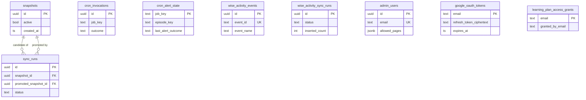
```mermaid
erDiagram
    snapshots {
        uuid id PK
        bool active
        ts created_at
    }
    sync_runs {
        uuid id PK
        uuid snapshot_id FK
        uuid promoted_snapshot_id FK
        text status
    }
    cron_invocations {
        uuid id PK
        text job_key
        text outcome
    }
    cron_alert_state {
        text job_key PK
        text episode_key
        text last_alert_outcome
    }
    wise_activity_events {
        uuid id PK
        text event_id UK
        text event_name
    }
    wise_activity_sync_runs {
        uuid id PK
        text status
        int inserted_count
    }
    admin_users {
        uuid id PK
        text email UK
        jsonb allowed_pages
    }
    google_oauth_tokens {
        text email PK
        text refresh_token_ciphertext
        ts expires_at
    }
    learning_plan_access_grants {
        text email PK
        text granted_by_email
    }

    snapshots ||--o{ sync_runs : "candidate of"
    snapshots ||--o{ sync_runs : "promoted by"
```

`cron_invocations`, `cron_alert_state`, `wise_activity_events`, `wise_activity_sync_runs`,
`admin_users`, `google_oauth_tokens`, and `learning_plan_access_grants` carry no foreign keys — they
are independent control-plane and access tables, correlated by job key or email rather than by
referential integrity.

### `snapshots` — `snapshots` (schema.ts:456-461)

One row per candidate snapshot created by a Wise ETL attempt. Three columns only: `id`, `active`,
`createdAt`. Every snapshot-scoped table in §4 points at it. Promotion flips `active` (see above);
pruning of superseded snapshots happens in the sync layer, not by cascade.

### `sync_runs` — `syncRuns` (schema.ts:462-478)

One row per Wise snapshot sync attempt. `status` is `sync_status`; `snapshotId` is the candidate
this run wrote and `promotedSnapshotId` the one it promoted (both FKs to `snapshots`, both nullable
— a failed run promotes nothing). `teacherCount`, `errorSummary`, and a free-form `metadata` jsonb
carry the run report. The partial unique index `sync_runs_single_running_idx` on
`status WHERE status = 'running'` is the **database-level single-flight guard**: a second concurrent
sync cannot insert its running row.

### `cron_invocations` — `cronInvocations` (schema.ts:479-504)

One row per invocation of an internal cron route, whether fired by the scheduler or by hand.
`jobKey` + `path` identify the job; `triggerSource` (default `"cron"`) and `actorEmail` distinguish
scheduled from manual runs; `outcome` (default `"running"`) plus
`responseStatus`/`durationMs`/`errorSummary` record the result. `linkedRunIds` jsonb correlates the
invocation with the domain-specific `*_sync_runs` row it created. No FKs; indexed by
(`jobKey`, `receivedAt`), (`outcome`, `receivedAt`), and (`triggerSource`, `receivedAt`).

### `cron_alert_state` — `cronAlertState` (schema.ts:505-517)

One row per cron job the watchdog has alerted on, keyed by `jobKey` as the primary key.
`episodeKey` names the failure episode that was alerted, so a continuing outage does not re-alert;
`lastAlertOutcome` flips to `"recovered"` when the recovery notice goes out, which re-arms the next
alert for that job (comment at `schema.ts:501-504`).

### `wise_activity_events` — `wiseActivityEvents` (schema.ts:518-552)

One row per Wise audit event, deduped by `uniqueIndex` on `eventId`. Wise's payload is both
flattened into query columns (actor, classroom, session, transaction) and preserved whole in
`payload` and `raw` jsonb. Snapshot-independent and append-mostly; eight indexes back the audit
UI's filters. Referenced by `post_class_feedback_event_links` (§7b).

### `wise_activity_sync_runs` — `wiseActivitySyncRuns` (schema.ts:553-574)

One row per activity-audit ingest run. Counters for `pagesFetched`, `eventsFetched`, and
`insertedCount`, plus the `oldestEventTimestamp`/`newestEventTimestamp` covered. Carries the same
partial unique `WHERE status = 'running'` single-flight guard as `sync_runs`.

### `admin_users` — `adminUsers` (schema.ts:575-586)

One row per allowlisted admin, unique on `email`. `allowedPages` is `string[] | null`: **null means
full access** (the historical behaviour for every existing admin), non-null restricts the user to
those route prefixes (comment at `schema.ts:579-580`). Snapshot-independent.

### `google_oauth_tokens` — `googleOAuthTokens` (schema.ts:587-600)

One row per connected Google account, keyed by `email` as the primary key. Access and refresh
tokens are stored as ciphertext columns only; `expiresAt`, `scope`, `tokenType`, and `lastError`
support silent refresh and surfacing a broken connection.

### `learning_plan_access_grants` — `learningPlanAccessGrants` (schema.ts:601-617)

One row per email granted learning-plan access, keyed by `email`. Two check constraints make the key
trustworthy rather than merely conventional: `learning_plan_access_email_normalized_check` requires
`email = lower(btrim(email))` and non-empty, and `learning_plan_access_granted_by_nonblank_check`
requires a non-blank grantor. Read by `src/lib/learning-plans/access.ts`.

---

## 2. Competitor intelligence (16 tables)

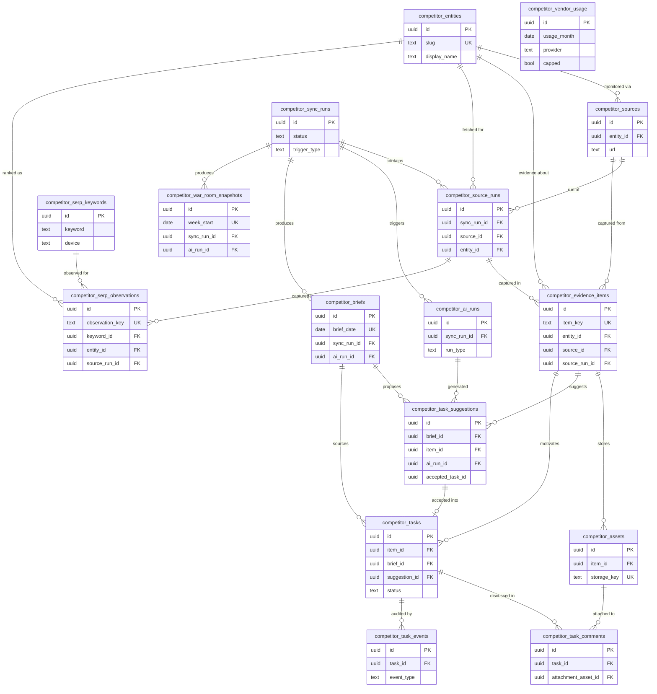
```mermaid
erDiagram
    competitor_entities {
        uuid id PK
        text slug UK
        text display_name
    }
    competitor_sources {
        uuid id PK
        uuid entity_id FK
        text url
    }
    competitor_sync_runs {
        uuid id PK
        text status
        text trigger_type
    }
    competitor_source_runs {
        uuid id PK
        uuid sync_run_id FK
        uuid source_id FK
        uuid entity_id FK
    }
    competitor_evidence_items {
        uuid id PK
        text item_key UK
        uuid entity_id FK
        uuid source_id FK
        uuid source_run_id FK
    }
    competitor_assets {
        uuid id PK
        uuid item_id FK
        text storage_key UK
    }
    competitor_serp_keywords {
        uuid id PK
        text keyword
        text device
    }
    competitor_serp_observations {
        uuid id PK
        text observation_key UK
        uuid keyword_id FK
        uuid entity_id FK
        uuid source_run_id FK
    }
    competitor_ai_runs {
        uuid id PK
        uuid sync_run_id FK
        text run_type
    }
    competitor_briefs {
        uuid id PK
        date brief_date UK
        uuid sync_run_id FK
        uuid ai_run_id FK
    }
    competitor_war_room_snapshots {
        uuid id PK
        date week_start UK
        uuid sync_run_id FK
        uuid ai_run_id FK
    }
    competitor_task_suggestions {
        uuid id PK
        uuid brief_id FK
        uuid item_id FK
        uuid ai_run_id FK
        uuid accepted_task_id
    }
    competitor_tasks {
        uuid id PK
        uuid item_id FK
        uuid brief_id FK
        uuid suggestion_id FK
        text status
    }
    competitor_task_comments {
        uuid id PK
        uuid task_id FK
        uuid attachment_asset_id FK
    }
    competitor_task_events {
        uuid id PK
        uuid task_id FK
        text event_type
    }
    competitor_vendor_usage {
        uuid id PK
        date usage_month
        text provider
        bool capped
    }

    competitor_entities ||--o{ competitor_sources : "monitored via"
    competitor_entities ||--o{ competitor_evidence_items : "evidence about"
    competitor_entities ||--o{ competitor_source_runs : "fetched for"
    competitor_entities ||--o{ competitor_serp_observations : "ranked as"
    competitor_sync_runs ||--o{ competitor_source_runs : "contains"
    competitor_sync_runs ||--o{ competitor_ai_runs : "triggers"
    competitor_sync_runs ||--o{ competitor_briefs : "produces"
    competitor_sync_runs ||--o{ competitor_war_room_snapshots : "produces"
    competitor_sources ||--o{ competitor_source_runs : "run of"
    competitor_sources ||--o{ competitor_evidence_items : "captured from"
    competitor_source_runs ||--o{ competitor_evidence_items : "captured in"
    competitor_source_runs ||--o{ competitor_serp_observations : "captured in"
    competitor_evidence_items ||--o{ competitor_assets : "stores"
    competitor_evidence_items ||--o{ competitor_task_suggestions : "suggests"
    competitor_evidence_items ||--o{ competitor_tasks : "motivates"
    competitor_serp_keywords ||--o{ competitor_serp_observations : "observed for"
    competitor_ai_runs ||--o{ competitor_task_suggestions : "generated"
    competitor_briefs ||--o{ competitor_task_suggestions : "proposes"
    competitor_briefs ||--o{ competitor_tasks : "sources"
    competitor_task_suggestions ||--o| competitor_tasks : "accepted into"
    competitor_tasks ||--o{ competitor_task_comments : "discussed in"
    competitor_tasks ||--o{ competitor_task_events : "audited by"
    competitor_assets ||--o{ competitor_task_comments : "attached to"
```

### `competitor_entities` — `competitorEntities` (schema.ts:795-815)

One row per tracked organisation. `slug` is unique; `kind` (`competitor_entity_kind`, default
`competitor`) separates true competitors from adjacent entities. `discoveredBy` (default `"seed"`)
plus `confidence` and `discoveryMetadata` record whether a human or a discovery pass added it.
Retirement is soft: `active` + `archivedAt`.

### `competitor_sources` — `competitorSources` (schema.ts:816-843)

One row per monitored source URL for an entity, unique on (`entityId`, `sourceType`, `url`).
`provider` (default `"internal"`) names the vendor that fetches it, `priority` orders the sweep,
`status` gates it, and `reliability`/`bestEffort` mark sources whose failure must not fail the run.
`lastRunAt`/`lastSuccessAt`/`lastError` are the source-health readout.

### `competitor_sync_runs` — `competitorSyncRuns` (schema.ts:844-870)

One row per competitor sweep. Partial unique `WHERE status = 'running'` gives the same single-flight
guarantee as the Wise sync. Counters cover sources (total/success/failed/skipped), items, new items,
assets, AI runs, task suggestions, and `budgetSkippedCount` — the sweep degrades rather than
overspending.

### `competitor_source_runs` — `competitorSourceRuns` (schema.ts:871-895)

One row per source per sweep; FKs to `competitorSyncRuns`, `competitorSources`, and
`competitorEntities`. Alongside per-source counters it carries `usageUnits` and `estimatedCostUsd`,
which is what makes the vendor-budget accounting in `competitor_vendor_usage` derivable.

### `competitor_evidence_items` — `competitorEvidenceItems` (schema.ts:896-928)

One row per captured piece of evidence, deduped by unique `itemKey`. FK to the entity; `sourceId`
and `sourceRunId` are nullable so manually-entered evidence is representable. Carries editorial
state (`evidenceStatus`, `reviewStatus`, `taskSuggestionStatus`), scoring (`impactScore`,
`confidence`), a `pricingSignal` flag, and `metrics`/`raw` jsonb.

### `competitor_assets` — `competitorAssets` (schema.ts:929-946)

One row per stored media asset belonging to an evidence item. `storageKey` is unique;
`storageProvider` defaults to `"vercel_blob"`. Also referenced by task comments as an attachment.

### `competitor_serp_keywords` — `competitorSerpKeywords` (schema.ts:947-967)

One row per tracked search query, unique on (`keyword`, `language`, `location`, `device`) — the same
phrase on mobile and desktop are different rows. Defaults are Bangkok / mobile / English.
`autoTracked` plus `approvedByEmail`/`approvedAt` distinguish machine-proposed keywords from
human-approved ones.

### `competitor_serp_observations` — `competitorSerpObservations` (schema.ts:968-995)

One row per SERP result observed for a keyword, deduped by unique `observationKey`. FK to the
keyword; `entityId` and `sourceRunId` are nullable (a result may not map to a tracked entity).
Stores `rankAbsolute`/`rankGroup`, the result text, and an `isBeGifted` flag so own-brand visibility
is a query rather than a string match.

### `competitor_ai_runs` — `competitorAiRuns` (schema.ts:996-1014)

One row per LLM call in the competitor pipeline. `runType` names the job, `promptVersion` is
required (so output is attributable to a prompt), `model` and `latencyMs` are observability, and
`output` jsonb holds the parsed result. `syncRunId` is nullable — ad-hoc runs exist.

### `competitor_briefs` — `competitorBriefs` (schema.ts:1015-1037)

One row per brief date (`briefDate` unique). Narrative fields (`executiveSummary` plus the
`whatChanged`/`whyItMatters`/`recommendedResponses` string arrays) sit beside scalar readouts —
`coverageScore`, `seoVisibilityScore`, `openTaskCount`, `budgetUsageRatio` — and `sourceHealth`
jsonb. Nullable FKs record which sweep and which AI run produced it.

### `competitor_war_room_snapshots` — `competitorWarRoomSnapshots` (schema.ts:1038-1062)

One row per week (`weekStart` unique), with an explicit `lookbackStart`/`lookbackEnd` window that
may be wider than the week itself. `matrix`, `contentAngles`, and `scoreDrilldowns` are jsonb
payloads rendered directly by the war-room view.

### `competitor_task_suggestions` — `competitorTaskSuggestions` (schema.ts:1063-1085)

One row per AI-proposed action, with nullable FKs to the brief, evidence item, and AI run that
motivated it. `status` defaults to `"suggested"`. `acceptedTaskId` is a **plain uuid, not an FK** —
it is set to the created task's id on acceptance
(`src/lib/competitor-intelligence/data.ts:627`), avoiding a circular FK with
`competitor_tasks.suggestionId`.

### `competitor_tasks` — `competitorTasks` (schema.ts:1086-1109)

One row per human-owned task. `status` is `competitor_task_status` (default `todo`); `ownerEmail`,
`dueDate`, `labels`, and `createdByEmail`/`updatedByEmail` are the work-tracking surface. All three
provenance FKs (`itemId`, `briefId`, `suggestionId`) are nullable so a task can be created from
scratch.

### `competitor_task_comments` — `competitorTaskComments` (schema.ts:1110-1120)

One row per comment on a task. `attachmentAssetId` optionally points at a `competitor_assets` row,
so a comment can cite the captured screenshot rather than re-uploading it.

### `competitor_task_events` — `competitorTaskEvents` (schema.ts:1121-1131)

Append-only task audit: one row per state change, with `eventType`, `actorEmail`, and a `payload`
jsonb. No `updatedAt` — rows are written, never edited.

### `competitor_vendor_usage` — `competitorVendorUsage` (schema.ts:1132-1149)

One row per (`usageMonth`, `provider`, `sourceType`) — unique. Accumulates `usageUnits` and
`estimatedCostUsd` against `hardCapUsd`, with a `capped` boolean the sweep reads to skip
budget-exhausted providers (which is what `competitor_sync_runs.budgetSkippedCount` counts).

---

## 3. Student promotion (6 tables)

The promotion workflow's own framing lives in
[erd-student-promotions.md](./erd-student-promotions.md); the mechanics are below.

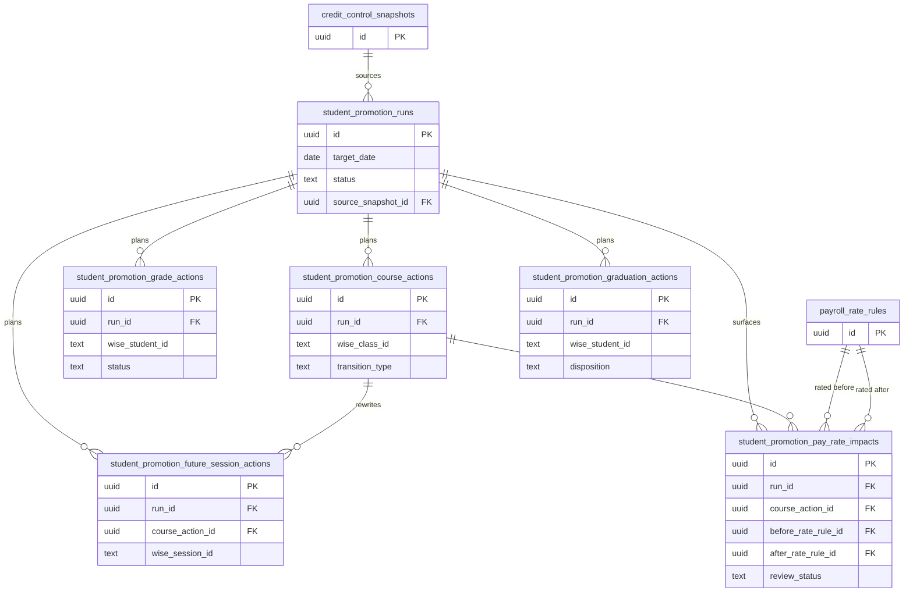
```mermaid
erDiagram
    credit_control_snapshots {
        uuid id PK
    }
    payroll_rate_rules {
        uuid id PK
    }
    student_promotion_runs {
        uuid id PK
        date target_date
        text status
        uuid source_snapshot_id FK
    }
    student_promotion_grade_actions {
        uuid id PK
        uuid run_id FK
        text wise_student_id
        text status
    }
    student_promotion_course_actions {
        uuid id PK
        uuid run_id FK
        text wise_class_id
        text transition_type
    }
    student_promotion_future_session_actions {
        uuid id PK
        uuid run_id FK
        uuid course_action_id FK
        text wise_session_id
    }
    student_promotion_graduation_actions {
        uuid id PK
        uuid run_id FK
        text wise_student_id
        text disposition
    }
    student_promotion_pay_rate_impacts {
        uuid id PK
        uuid run_id FK
        uuid course_action_id FK
        uuid before_rate_rule_id FK
        uuid after_rate_rule_id FK
        text review_status
    }

    credit_control_snapshots ||--o{ student_promotion_runs : "sources"
    student_promotion_runs ||--o{ student_promotion_grade_actions : "plans"
    student_promotion_runs ||--o{ student_promotion_course_actions : "plans"
    student_promotion_runs ||--o{ student_promotion_future_session_actions : "plans"
    student_promotion_runs ||--o{ student_promotion_graduation_actions : "plans"
    student_promotion_runs ||--o{ student_promotion_pay_rate_impacts : "surfaces"
    student_promotion_course_actions ||--o{ student_promotion_future_session_actions : "rewrites"
    student_promotion_course_actions ||--o{ student_promotion_pay_rate_impacts : "causes"
    payroll_rate_rules ||--o{ student_promotion_pay_rate_impacts : "rated before"
    payroll_rate_rules ||--o{ student_promotion_pay_rate_impacts : "rated after"
```

### `student_promotion_runs` — `studentPromotionRuns` (schema.ts:1343-1375)

One row per promotion planning run for a `targetDate`. `status` is `student_promotion_run_status`
(default `draft`); `sourceSnapshotId` FKs to `credit_control_snapshots`, pinning the plan to the
student population it was computed against. Counters break the plan down (grade-only, Year 8 /
Year 11 course moves, skipped, pending). Three distinct lifecycle stamps exist: verification
(`verifiedAt`/`verifiedByEmail`/`endpointVerificationNote`), apply
(`applyStartedAt`/`applyFinishedAt`/`appliedByEmail`), and creation.

### `student_promotion_grade_actions` — `studentPromotionGradeActions` (schema.ts:1376-1399)

One row per student per run — unique on (`runId`, `wiseStudentId`). Holds the parsed current year,
the `targetGrade`, an `actionType`, and a `student_promotion_action_status`. `requestPayload` and
`responsePayload` jsonb preserve exactly what was sent to and returned by Wise; `skipReason`
explains a non-action.

### `student_promotion_course_actions` — `studentPromotionCourseActions` (schema.ts:1400-1422)

One row per class per run — unique on (`runId`, `wiseClassId`). `currentSubject` → `targetSubject`
under a `transitionType`, with `studentIds` and `qualifyingStudentIds` arrays recording who is in
the class versus who actually qualifies for the move.

### `student_promotion_future_session_actions` — `studentPromotionFutureSessionActions` (schema.ts:1423-1449)

One row per future session to be rewritten — unique on (`runId`, `wiseSessionId`), with an optional
FK to the course action that caused it. Stores `scheduledStartTime` and both the raw subjects and
the `current`/`target` normalized course keys, so the rewrite is checkable after the fact.

### `student_promotion_graduation_actions` — `studentPromotionGraduationActions` (schema.ts:1450-1472)

One row per graduating student per run — unique on (`runId`, `wiseStudentId`). Unlike the other
action tables its `status` is a plain text column defaulting to `"pending_review"`: graduation is a
human decision, captured as `disposition` plus `reviewedByEmail`/`reviewedAt`.

### `student_promotion_pay_rate_impacts` — `studentPromotionPayRateImpacts` (schema.ts:1473-1515)

One row per pay-rate consequence of a course move — unique on (`runId`, `impactKey`).
`beforeRateRuleId`/`afterRateRuleId` FK into `payroll_rate_rules`, and the resolved
`before`/`afterExpectedHourlyRate` plus `rateDelta` quantify the change. Blast radius is recorded as
`futureSessionCount`, first/last session times, and the affected student id/name arrays.
`reviewStatus` (default `"pending_review"`) and `blockerReason` make an unreviewed rate change a
blocker rather than a silent side effect.

---

## 4. Tutor identity, normalization, session blocks, data health (13 tables)

This is the original ETL output: everything here except `tutor_aliases`,
`room_utilization_sessions`, and `past_session_blocks` is snapshot-scoped and rewritten wholesale
each sync.

```mermaid
erDiagram
    snapshots {
        uuid id PK
    }
    tutor_identity_groups {
        uuid id PK
        uuid snapshot_id FK
        text canonical_key
        text display_name
    }
    tutor_identity_group_members {
        uuid id PK
        uuid group_id FK
        uuid snapshot_id FK
        text wise_teacher_id
        bool is_online_variant
    }
    tutor_aliases {
        uuid id PK
        text from_key UK
        text to_key
    }
    tutors {
        uuid id PK
        uuid snapshot_id FK
        uuid group_id FK
        text display_name
    }
    raw_teacher_tags {
        uuid id PK
        uuid snapshot_id FK
        uuid group_id FK
        text tag_value
    }
    subject_level_qualifications {
        uuid id PK
        uuid snapshot_id FK
        uuid group_id FK
        text subject
        text level
    }
    recurring_availability_windows {
        uuid id PK
        uuid snapshot_id FK
        uuid group_id FK
        int weekday
        int start_minute
    }
    dated_leaves {
        uuid id PK
        uuid snapshot_id FK
        uuid group_id FK
        ts start_time
    }
    future_session_blocks {
        uuid id PK
        uuid snapshot_id FK
        uuid group_id FK
        text wise_session_id
        bool is_blocking
    }
    past_session_blocks {
        uuid id PK
        text group_canonical_key
        text wise_session_id UK
        uuid captured_in_snapshot_id
    }
    room_utilization_sessions {
        uuid id PK
        text wise_session_id UK
        date utilization_date
        text normalized_room_label
    }
    data_issues {
        uuid id PK
        uuid snapshot_id FK
        text type
        text severity
    }
    snapshot_stats {
        uuid id PK
        uuid snapshot_id FK
        int unresolved_groups
    }

    snapshots ||--o{ tutor_identity_groups : "scopes"
    snapshots ||--o{ tutor_identity_group_members : "scopes"
    snapshots ||--o{ tutors : "scopes"
    snapshots ||--o{ raw_teacher_tags : "scopes"
    snapshots ||--o{ subject_level_qualifications : "scopes"
    snapshots ||--o{ recurring_availability_windows : "scopes"
    snapshots ||--o{ dated_leaves : "scopes"
    snapshots ||--o{ future_session_blocks : "scopes"
    snapshots ||--o{ data_issues : "scopes"
    snapshots ||--|| snapshot_stats : "summarized by"
    tutor_identity_groups ||--o{ tutor_identity_group_members : "merges"
    tutor_identity_groups ||--o{ tutors : "presents as"
    tutor_identity_groups ||--o{ raw_teacher_tags : "tagged with"
    tutor_identity_groups ||--o{ subject_level_qualifications : "qualified for"
    tutor_identity_groups ||--o{ recurring_availability_windows : "available in"
    tutor_identity_groups ||--o{ dated_leaves : "on leave in"
    tutor_identity_groups ||--o{ future_session_blocks : "booked in"
    tutor_identity_groups }o..o{ past_session_blocks : "resolved by canonical_key"
```

### `tutor_identity_groups` — `tutorIdentityGroups` (schema.ts:1516-1526)

One row per resolved tutor identity within a snapshot. `canonicalKey` is the stable cross-snapshot
identity string (what `past_session_blocks`, tutor profiles, and post-class sessions join on);
`displayName` is the human label; `supportedModality` is `modality`, defaulting to `unresolved`
rather than guessing (fail-closed). `snapshotId` FK; indexed by snapshot.

### `tutor_identity_group_members` — `tutorIdentityGroupMembers` (schema.ts:1527-1539)

One row per underlying Wise teacher record folded into a group. Carries `wiseTeacherId`,
`wiseUserId`, the raw `wiseDisplayName`, and `isOnlineVariant` — the flag that records the
online/offline pair-detection step of the identity cascade. FKs to both the group and the snapshot.

### `tutor_aliases` — `tutorAliases` (schema.ts:1540-1548)

One row per manual alias mapping, unique on `fromKey`. **Snapshot-independent** — it is
human-curated *input* to the identity cascade, not output of it, so it survives snapshot rotation.

### `tutors` — `tutors` (schema.ts:1549-1561)

One row per presentable tutor per snapshot, FK to both `snapshots` and `tutor_identity_groups`.
Thin by design: `displayName` and a `supportedModes` string array; availability, qualification, and
session detail hang off the identity group rather than this row.

### `raw_teacher_tags` — `rawTeacherTags` (schema.ts:1562-1572)

One row per raw Wise tag observed on a teacher record, preserved verbatim (`tagValue` plus `tagRaw`
jsonb) alongside the `wiseTeacherId` it came from. This is the audit trail behind qualification
parsing: an unmapped tag becomes a `data_issue` and stays inspectable here.

### `subject_level_qualifications` — `subjectLevelQualifications` (schema.ts:1573-1588)

One row per parsed (subject, curriculum, level) qualification for an identity group, with optional
`examPrep` and the `sourceTag` it was parsed from — every qualification is traceable to the raw tag
that produced it. Indexed by snapshot and by group.

### `recurring_availability_windows` — `recurringAvailabilityWindows` (schema.ts:1589-1602)

One row per weekly availability window. `weekday` is 0=Sunday..6=Saturday and
`startMinute`/`endMinute` are minutes since midnight **Asia/Bangkok** (comments at
`schema.ts:1594-1595`), so there is no timezone maths at read time. `modality` defaults to
`unresolved`. `wiseTeacherId` is retained so a group's windows stay attributable to a specific Wise
record. Indexed by (`snapshotId`, `weekday`) for the search grid.

### `dated_leaves` — `datedLeaves` (schema.ts:1603-1614)

One row per merged leave interval, as absolute `startTime`/`endTime` timestamps (UTC→Bangkok
conversion and overlap merging happen in normalization, before the write). Leaves block availability
in both recurring and one-time search modes.

### `future_session_blocks` — `futureSessionBlocks` (schema.ts:1615-1645)

One row per future Wise session attributed to an identity group. Stores both absolute times and the
derived (`weekday`, `startMinute`, `endMinute`) triple the availability grid uses. `wiseStatus` is
the raw status and `isBlocking` its classification, defaulting to **true** — an unknown status
blocks (fail-closed). Display and grouping fields (`title`, `sessionType`, `location`,
`studentName`, `studentCount`, `subject`, `classType`, `recurrenceId`) support the compare calendar;
`recurrenceId` is what the past-day fallback dedupes on.

### `past_session_blocks` — `pastSessionBlocks` (schema.ts:2255-2299)

One row per past Wise session, **ever** — `uniqueIndex` on `wiseSessionId` makes capture idempotent
(PAST-05 / D-03). This is the only cross-snapshot data table in the tutor lineage: it identifies its
tutor by `groupCanonicalKey` (D-04) rather than a `groupId` FK, and `capturedInSnapshotId` is
deliberately **not** a foreign key so snapshots can be pruned independently (comment at
`schema.ts:2262-2264`). Columns otherwise mirror `future_session_blocks` minus the snapshot-scoped
ones; `capturedAt` records first observation. Indexed by (`groupCanonicalKey`, `startTime`) for the
compare read path.

### `room_utilization_sessions` — `roomUtilizationSessions` (schema.ts:1736-1759)

One row per Wise session for room-utilization analysis, unique on `wiseSessionId` and
**snapshot-independent** (it accumulates across syncs). Carries `utilizationDate` plus the same
weekday/minute triple, the `rawLocation` and its `normalizedRoomLabel`, and `studentCount`. Owned by
the Room Capacity feature ([erd-room-capacity.md](./erd-room-capacity.md)) but stored on the core
spine.

### `data_issues` — `dataIssues` (schema.ts:2685-2702)

One row per normalization problem found during a sync. `type` is `data_issue_type` and `severity`
`data_issue_severity` (default `high`). The entity is described loosely — `entityType`, `entityId`,
`entityName` are free text, not FKs — precisely because issues are raised about things that failed
to resolve into entities. Indexed by (`snapshotId`, `type`).

### `snapshot_stats` — `snapshotStats` (schema.ts:2703-2725)

Exactly one row per snapshot (`uniqueIndex` on `snapshotId`) holding the promotion-gate arithmetic:
teacher and identity-group totals, `resolvedGroups`/`unresolvedGroups`, and counts of
qualifications, availability windows, leaves, future sessions, and data issues, plus an
`issuesByType` jsonb map. Written immediately before the promote decision
(`src/lib/sync/orchestrator.ts:458-476`).

---

## 5. Progress tests (8 tables)

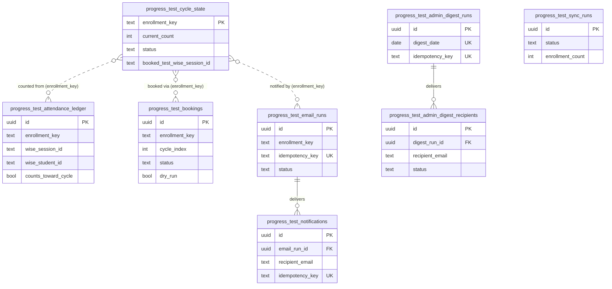
```mermaid
erDiagram
    progress_test_attendance_ledger {
        uuid id PK
        text enrollment_key
        text wise_session_id
        text wise_student_id
        bool counts_toward_cycle
    }
    progress_test_cycle_state {
        text enrollment_key PK
        int current_count
        text status
        text booked_test_wise_session_id
    }
    progress_test_bookings {
        uuid id PK
        text enrollment_key
        int cycle_index
        text status
        bool dry_run
    }
    progress_test_email_runs {
        uuid id PK
        text enrollment_key
        text idempotency_key UK
        text status
    }
    progress_test_notifications {
        uuid id PK
        uuid email_run_id FK
        text recipient_email
        text idempotency_key UK
    }
    progress_test_admin_digest_runs {
        uuid id PK
        date digest_date UK
        text idempotency_key UK
    }
    progress_test_admin_digest_recipients {
        uuid id PK
        uuid digest_run_id FK
        text recipient_email
        text status
    }
    progress_test_sync_runs {
        uuid id PK
        text status
        int enrollment_count
    }

    progress_test_cycle_state }o..o{ progress_test_attendance_ledger : "counted from (enrollment_key)"
    progress_test_cycle_state }o..o{ progress_test_bookings : "booked via (enrollment_key)"
    progress_test_cycle_state }o..o{ progress_test_email_runs : "notified by (enrollment_key)"
    progress_test_email_runs ||--o{ progress_test_notifications : "delivers"
    progress_test_admin_digest_runs ||--o{ progress_test_admin_digest_recipients : "delivers"
```

Only two of these relationships are foreign keys; the rest join on the natural `enrollmentKey`
string (student × class), which is also the primary key of the cycle-state table.

### `progress_test_attendance_ledger` — `progressTestAttendanceLedger` (schema.ts:2812-2837)

One row per attended session per student — unique on (`wiseSessionId`, `wiseStudentId`).
Denormalizes class, student, subject, tutor (`tutorCanonicalKey`/`tutorDisplayName`),
`creditApplied`, and `meetingStatus`. Two booleans drive the every-8-classes rule: `isProgressTest`
marks the test session itself and `countsTowardCycle` marks what accumulates.
`firstObservedSnapshotId` is a plain uuid, not an FK.

### `progress_test_cycle_state` — `progressTestCycleState` (schema.ts:2838-2873)

One row per enrollment, keyed by `enrollmentKey` as the primary key — the running state machine.
`currentCount`/`cycleIndex`/`status` (`progress_test_status`, default `accumulating`) track the
cycle; the `bookedTest*` columns and `scheduleMethod` (`after_class` | `parent_pick` | `at_home`,
comment at `schema.ts:2852`) record how a due test was scheduled. `atHomeSelectedAt` →
`atHomeSubmittedAt` is the at-home lifecycle that rolls the cycle (comment at `schema.ts:2856`).
`teacherNotifiedForCycle` prevents re-notifying within one cycle; `lastAiSummary` caches the
generated blurb.

### `progress_test_bookings` — `progressTestBookings` (schema.ts:2874-2896)

One row per booking attempt for an enrollment's cycle. `status` is `progress_test_booking_status`
(default `recorded`) and `dryRun` defaults to **true**, so a booking is an audit record unless
explicitly executed. `requestPayload`/`responsePayload` preserve the Wise exchange.

### `progress_test_email_runs` — `progressTestEmailRuns` (schema.ts:2897-2917)

One row per teacher heads-up email send for an enrollment/cycle, deduped by unique `idempotencyKey`.
`triggerKind` defaults to `"approaching"`; attempted/success/failed counters and `lastError`
summarize delivery.

### `progress_test_notifications` — `progressTestNotifications` (schema.ts:2918-2936)

One row per recipient per email run, deduped by unique `idempotencyKey`. The `emailRunId` FK is
`onDelete: "set null"` so the delivery record outlives its run. `providerMessageId` links to the
mail provider.

### `progress_test_admin_digest_runs` — `progressTestAdminDigestRuns` (schema.ts:2937-2958)

One row per admin digest, with **two** unique indexes — on `idempotencyKey` and on `digestDate` — so
a given day's digest exists at most once regardless of trigger path. Counters split
`approachingCount` from `dueCount`.

### `progress_test_admin_digest_recipients` — `progressTestAdminDigestRecipients` (schema.ts:2959-2974)

One row per recipient of a digest run (FK `digestRunId`), with per-recipient `status`,
`providerMessageId`, and `error`. `digestDate` is denormalized for direct date queries.

### `progress_test_sync_runs` — `progressTestSyncRuns` (schema.ts:2975-3003)

One row per progress-test sync. Same partial-unique `WHERE status = 'running'` single-flight guard;
counters for ledger rows, enrollments, approaching/due, and notifications.

---

## 6. US universities — IPEDS (3 tables)

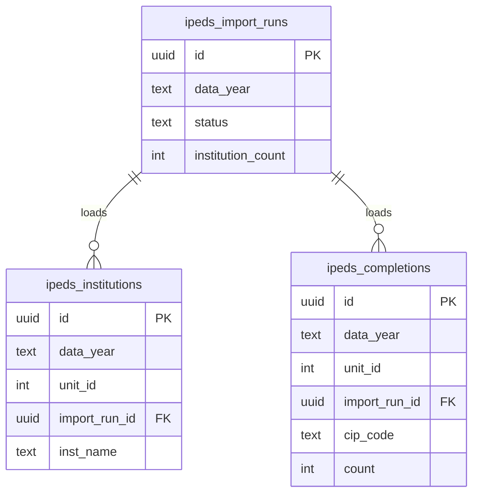
```mermaid
erDiagram
    ipeds_import_runs {
        uuid id PK
        text data_year
        text status
        int institution_count
    }
    ipeds_institutions {
        uuid id PK
        text data_year
        int unit_id
        uuid import_run_id FK
        text inst_name
    }
    ipeds_completions {
        uuid id PK
        text data_year
        int unit_id
        uuid import_run_id FK
        text cip_code
        int count
    }

    ipeds_import_runs ||--o{ ipeds_institutions : "loads"
    ipeds_import_runs ||--o{ ipeds_completions : "loads"
```

All three are keyed by (`dataYear`, `unitId`) as a natural key so a future IPEDS year drops in
without a migration; the runtime only ever reads them (comment at `schema.ts:2997-3003`).

### `ipeds_import_runs` — `ipedsImportRuns` (schema.ts:3004-3020)

One row per import of an IPEDS data year. The single-running guard is **per year**: partial unique
on `dataYear WHERE status = 'running'`, not on `status` alone — two different years can import
concurrently.

### `ipeds_institutions` — `ipedsInstitutions` (schema.ts:3021-3114)

One row per institution per data year — unique on (`dataYear`, `unitId`). By far the widest table on
this page: directory, admissions and test-score bands, enrollment and demographics, retention and
outcomes, cost, and degree mix, each block sourced from a named IPEDS survey file (see the section
comments in the schema). `raw` jsonb retains the source record. Indexed for state, control, and
acceptance-rate filtering, plus (`unitId`, `dataYear`) for per-institution trends.

### `ipeds_completions` — `ipedsCompletions` (schema.ts:3115-3137)

One row per (data year, institution, CIP code, award level) completions count. `cip2` is the
2-digit rollup stored alongside the full `cipCode`, so broad-field queries need no substring work.
No unique index — the grain is whatever the import writes.

---

## 7. Post-class feedback (32 tables)

Wise stays read-only for this feature. Source evidence, compliance state, and financial workflow
state live in separate columns and tables **so a provider outage or an AI opinion can never create a
financial decision** (comment at `schema.ts:3133-3137`).

### 7a. Configuration, access, and ingest

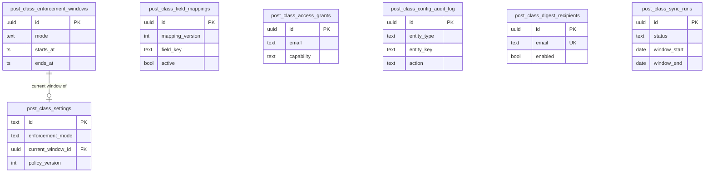
```mermaid
erDiagram
    post_class_enforcement_windows {
        uuid id PK
        text mode
        ts starts_at
        ts ends_at
    }
    post_class_settings {
        text id PK
        text enforcement_mode
        uuid current_window_id FK
        int policy_version
    }
    post_class_field_mappings {
        uuid id PK
        int mapping_version
        text field_key
        bool active
    }
    post_class_access_grants {
        uuid id PK
        text email
        text capability
    }
    post_class_config_audit_log {
        uuid id PK
        text entity_type
        text entity_key
        text action
    }
    post_class_digest_recipients {
        uuid id PK
        text email UK
        bool enabled
    }
    post_class_sync_runs {
        uuid id PK
        text status
        date window_start
        date window_end
    }

    post_class_enforcement_windows ||--o| post_class_settings : "current window of"
```

**`post_class_enforcement_windows`** — `postClassEnforcementWindows` (schema.ts:3138-3151). One row
per enforcement-mode period. `mode` is `post_class_enforcement_mode`; an open window has
`endsAt IS NULL` (there is an index on `endsAt` for exactly that lookup). `actorEmail` is required
and `reason` optional — a mode change always has an owner.

**`post_class_settings`** — `postClassSettings` (schema.ts:3152-3167). The **singleton**: `id` is a
text primary key defaulting to `"default"`. Holds current `enforcementMode`, an FK to the current
window, `policyVersion`, `formMappingVersion`/`formMappingValid`, and the go-live readiness stamps
`emailDeliveryVerifiedAt` and `shadowReviewedAt`. `version` is the optimistic-concurrency counter.

**`post_class_field_mappings`** — `postClassFieldMappings` (schema.ts:3168-3183). One row per
feedback field per mapping version — unique on (`mappingVersion`, `fieldKey`). Maps a Wise question
(raw and normalized text) to a compliance field, with `requiredForCompliance` and `active`.
Versioning is what lets an assessment be replayed under the mapping it was made with.

**`post_class_access_grants`** — `postClassAccessGrants` (schema.ts:3184-3195). One row per
(`email`, `capability`) — unique. `capability` is `post_class_capability`; this is a per-capability
grant table, not a role column.

**`post_class_config_audit_log`** — `postClassConfigAuditLog` (schema.ts:3196-3210). Append-only
config audit: `entityType`/`entityKey`/`action`, `actorEmail`, and `beforeValue`/`afterValue` jsonb
diffs. No `updatedAt`.

**`post_class_digest_recipients`** — `postClassDigestRecipients` (schema.ts:3211-3222). One row per
digest recipient email (unique), with an `enabled` toggle rather than deletion.

**`post_class_sync_runs`** — `postClassSyncRuns` (schema.ts:3223-3249). One row per ingest run over a
`windowStart`..`windowEnd` date range. Partial unique `WHERE status = 'running'`. `detailCap`
(default 50) bounds per-run detail fetches and `cursor` jsonb resumes across runs; counters cover
discovered, sessions, detail fetches, version inserts, assessments, and source issues.

### 7b. Sessions, feedback evidence, and assessment

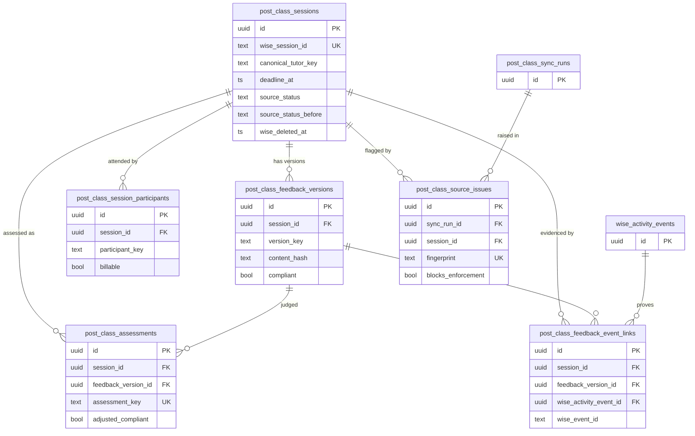
```mermaid
erDiagram
    wise_activity_events {
        uuid id PK
    }
    post_class_sync_runs {
        uuid id PK
    }
    post_class_sessions {
        uuid id PK
        text wise_session_id UK
        text canonical_tutor_key
        ts deadline_at
        text source_status
        text source_status_before
        ts wise_deleted_at
    }
    post_class_session_participants {
        uuid id PK
        uuid session_id FK
        text participant_key
        bool billable
    }
    post_class_feedback_versions {
        uuid id PK
        uuid session_id FK
        text version_key
        text content_hash
        bool compliant
    }
    post_class_feedback_event_links {
        uuid id PK
        uuid session_id FK
        uuid feedback_version_id FK
        uuid wise_activity_event_id FK
        text wise_event_id
    }
    post_class_assessments {
        uuid id PK
        uuid session_id FK
        uuid feedback_version_id FK
        text assessment_key UK
        bool adjusted_compliant
    }
    post_class_source_issues {
        uuid id PK
        uuid sync_run_id FK
        uuid session_id FK
        text fingerprint UK
        bool blocks_enforcement
    }

    post_class_sessions ||--o{ post_class_session_participants : "attended by"
    post_class_sessions ||--o{ post_class_feedback_versions : "has versions"
    post_class_sessions ||--o{ post_class_feedback_event_links : "evidenced by"
    post_class_sessions ||--o{ post_class_assessments : "assessed as"
    post_class_sessions ||--o{ post_class_source_issues : "flagged by"
    post_class_feedback_versions ||--o{ post_class_assessments : "judged"
    post_class_feedback_versions ||--o{ post_class_feedback_event_links : "timed by"
    wise_activity_events ||--o{ post_class_feedback_event_links : "proves"
    post_class_sync_runs ||--o{ post_class_source_issues : "raised in"
```

**`post_class_sessions`** — `postClassSessions` (schema.ts:3250-3306). One row per Wise session
(unique `wiseSessionId`); the spine of the feature. Identity is carried as `canonicalTutorKey` (a
soft reference to `tutor_identity_groups.canonicalKey`, not an FK) plus `wiseTeacherUserId`.
Compliance is decomposed into four independent enums — `sourceStatus`, `contentStatus`,
`timingStatus`, `deductionStatus` — so "we could not prove it" is never confused with "it failed".
Two columns deserve special note:

- `sourceStatusBefore` is set only by the run-wide fail-closed demotion (REC-01) and holds the
  status the row carried before source health became unprovable, so a later healthy sync restores it
  in one statement; null means `sourceStatus` is the row's own observation (comment at
  `schema.ts:3268-3271`).
- `wiseDeletedAt` records deletion proven by a `SessionDeletedEvent` in the activity mirror
  (REC-03). It is deliberately a fact of its own rather than a `sourceStatus` value, because every
  `sourceStatus <> 'ready'` reader treats its subject as blocking — which would otherwise keep a
  deleted session in the payout coverage denominator forever (comment at `schema.ts:3273-3278`).

`latestFeedbackVersionId` and `firstOnTimeCompliantVersionId` are plain uuids, **not** FKs.
`enforcementMode` and `policyVersion` are stamped per session so history replays under the policy
in force.

**`post_class_session_participants`** — `postClassSessionParticipants` (schema.ts:3307-3322). One row
per participant per session — unique on (`sessionId`, `participantKey`), `onDelete: "cascade"`.
`creditsConsumed` and `billable` are what make a session payout-relevant.

**`post_class_feedback_versions`** — `postClassFeedbackVersions` (schema.ts:3323-3353). One row per
observed version of a session's feedback — unique on (`sessionId`, `versionKey`), with `contentHash`
for change detection. The four graded fields (`topics`, `performance`, `improvement`, `homework`)
sit beside the raw `answers` jsonb. Timing trust is explicit: `sourceCreatedAt` +
`sourceTimestampTrustworthy` (default **false**) + `sourceTimestampKind` versus the always-known
`observedAt`. `substantive`, `compliant`, and `fieldFailures` are the per-version verdict.

**`post_class_feedback_event_links`** — `postClassFeedbackEventLinks` (schema.ts:3354-3368). One row
per Wise activity event linked to a session — unique on (`sessionId`, `wiseEventId`). Both
`feedbackVersionId` and `wiseActivityEventId` FKs are `onDelete: "set null"` so the link survives
either side being pruned; the text `wiseEventId` is the durable identity. `autoSubmitted` and
`linkConfidence` qualify how strongly the event proves submission timing.

**`post_class_assessments`** — `postClassAssessments` (schema.ts:3369-3399). One row per assessment
of a session, deduped by unique `assessmentKey`. Snapshots the `policyVersion` **and**
`mappingVersion` used, all four status enums, and the reasoning: `requiredFieldsPassed`,
`combinedRawCharCount`, `fieldFailures`, `objectiveViolation`, `rawOnTime`, `adjustedCompliant`,
`remediatedLate`, `timingUnknown`, `timingEvidence`, `sourceReady`. An assessment is therefore
re-derivable and arguable without re-reading Wise.

**`post_class_source_issues`** — `postClassSourceIssues` (schema.ts:3400-3421). One row per distinct
source problem, deduped by unique `fingerprint` with `firstSeenAt`/`lastSeenAt` instead of duplicate
rows. `scope` separates global from per-session issues (`sessionId` is nullable, cascade);
`blocksEnforcement` defaults to **true** — an unexplained source problem stops enforcement rather
than being logged past.

### 7c. Notifications

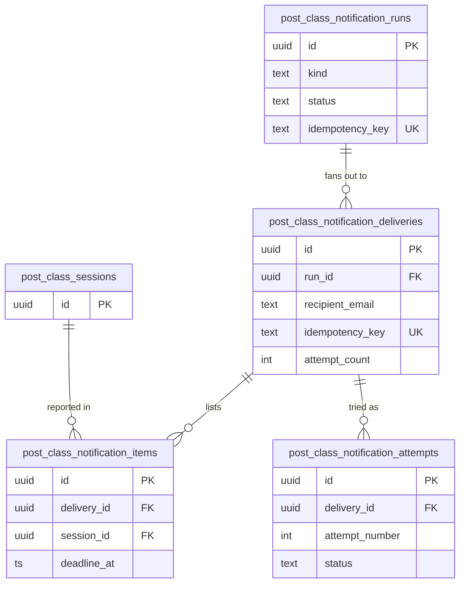
```mermaid
erDiagram
    post_class_sessions {
        uuid id PK
    }
    post_class_notification_runs {
        uuid id PK
        text kind
        text status
        text idempotency_key UK
    }
    post_class_notification_deliveries {
        uuid id PK
        uuid run_id FK
        text recipient_email
        text idempotency_key UK
        int attempt_count
    }
    post_class_notification_items {
        uuid id PK
        uuid delivery_id FK
        uuid session_id FK
        ts deadline_at
    }
    post_class_notification_attempts {
        uuid id PK
        uuid delivery_id FK
        int attempt_number
        text status
    }

    post_class_notification_runs ||--o{ post_class_notification_deliveries : "fans out to"
    post_class_notification_deliveries ||--o{ post_class_notification_items : "lists"
    post_class_notification_deliveries ||--o{ post_class_notification_attempts : "tried as"
    post_class_sessions ||--o{ post_class_notification_items : "reported in"
```

**`post_class_notification_runs`** — `postClassNotificationRuns` (schema.ts:3422-3446). One row per
scheduled notification batch, deduped by unique `idempotencyKey`. `kind` and `status` are
`post_class_notification_kind`/`_status`; counters split eligible, delivery, sent, failed, and
cancelled.

**`post_class_notification_deliveries`** — `postClassNotificationDeliveries` (schema.ts:3447-3470).
One row per recipient per run (unique `idempotencyKey`; run FK cascades). `nextAttemptAt` +
`attemptCount` + `status` form the retry queue (there is a dedicated (`status`, `nextAttemptAt`)
index); `cancelledAt` records a delivery withdrawn before send.

**`post_class_notification_items`** — `postClassNotificationItems` (schema.ts:3471-3483). One row per
session included in a delivery — unique on (`deliveryId`, `sessionId`). Freezes the
`failureReasons`, `rawCharCount`, and `deadlineAt` as of send time, so the email's content stays
explainable after the session changes.

**`post_class_notification_attempts`** — `postClassNotificationAttempts` (schema.ts:3484-3499). One
row per send attempt — unique on (`deliveryId`, `attemptNumber`), with provider, status, error code
and message, and start/finish timestamps.

### 7d. AI concern review

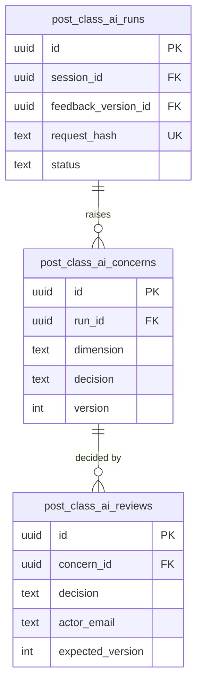
```mermaid
erDiagram
    post_class_ai_runs {
        uuid id PK
        uuid session_id FK
        uuid feedback_version_id FK
        text request_hash UK
        text status
    }
    post_class_ai_concerns {
        uuid id PK
        uuid run_id FK
        text dimension
        text decision
        int version
    }
    post_class_ai_reviews {
        uuid id PK
        uuid concern_id FK
        text decision
        text actor_email
        int expected_version
    }

    post_class_ai_runs ||--o{ post_class_ai_concerns : "raises"
    post_class_ai_concerns ||--o{ post_class_ai_reviews : "decided by"
```

**`post_class_ai_runs`** — `postClassAiRuns` (schema.ts:3500-3520). One row per LLM evaluation of a
specific feedback version (both FKs required, both cascade), deduped by unique `requestHash` so an
identical request is never paid for twice. `triggerReasons` records why the run was worth making;
`redactionVersion` records which redaction rules produced the prompt.

**`post_class_ai_concerns`** — `postClassAiConcerns` (schema.ts:3521-3535). One row per concern
dimension per run — unique on (`runId`, `dimension`). `decision` is `post_class_concern_decision`
(default `pending`) and `version` is the optimistic-concurrency counter reviews check against.

**`post_class_ai_reviews`** — `postClassAiReviews` (schema.ts:3536-3548). One row per human decision
on a concern. `note` and `actorEmail` are **not null** — a decision without a written reason is not
representable — and `expectedVersion` is the CAS token matched against the concern's `version`.

### 7e. Finance periods, deductions, and payout runs

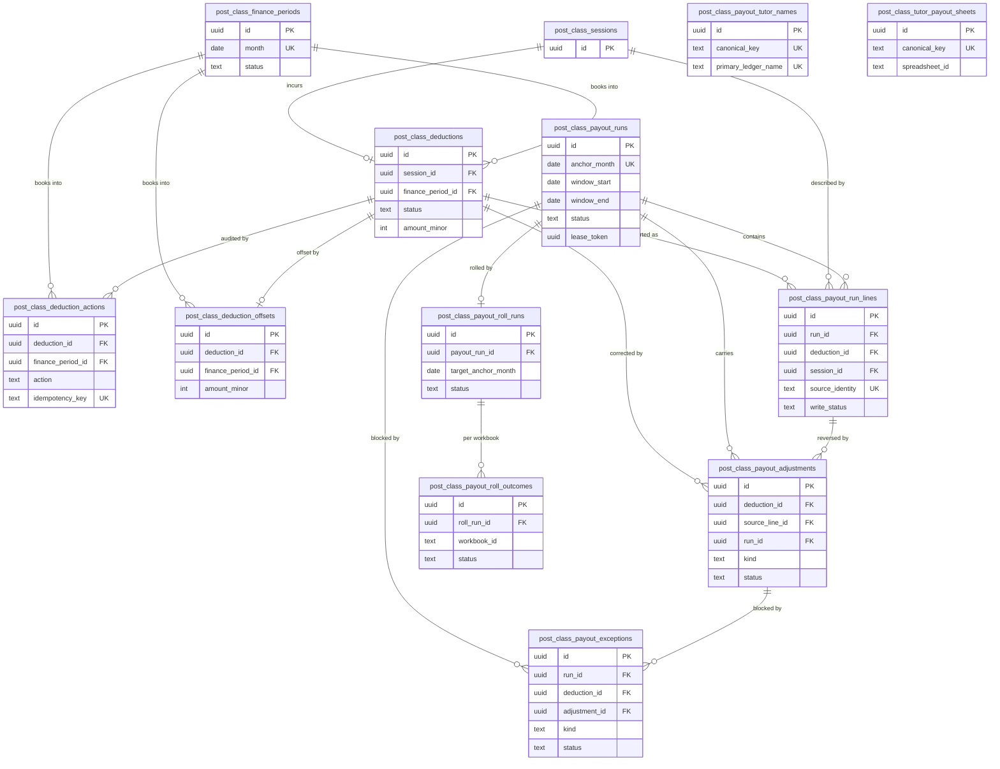
```mermaid
erDiagram
    post_class_sessions {
        uuid id PK
    }
    post_class_finance_periods {
        uuid id PK
        date month UK
        text status
    }
    post_class_deductions {
        uuid id PK
        uuid session_id FK
        uuid finance_period_id FK
        text status
        int amount_minor
    }
    post_class_deduction_actions {
        uuid id PK
        uuid deduction_id FK
        uuid finance_period_id FK
        text action
        text idempotency_key UK
    }
    post_class_deduction_offsets {
        uuid id PK
        uuid deduction_id FK
        uuid finance_period_id FK
        int amount_minor
    }
    post_class_payout_runs {
        uuid id PK
        date anchor_month UK
        date window_start
        date window_end
        text status
        uuid lease_token
    }
    post_class_payout_run_lines {
        uuid id PK
        uuid run_id FK
        uuid deduction_id FK
        uuid session_id FK
        text source_identity UK
        text write_status
    }
    post_class_payout_adjustments {
        uuid id PK
        uuid deduction_id FK
        uuid source_line_id FK
        uuid run_id FK
        text kind
        text status
    }
    post_class_payout_exceptions {
        uuid id PK
        uuid run_id FK
        uuid deduction_id FK
        uuid adjustment_id FK
        text kind
        text status
    }
    post_class_payout_tutor_names {
        uuid id PK
        text canonical_key UK
        text primary_ledger_name UK
    }
    post_class_tutor_payout_sheets {
        uuid id PK
        text canonical_key UK
        text spreadsheet_id
    }
    post_class_payout_roll_runs {
        uuid id PK
        uuid payout_run_id FK
        date target_anchor_month
        text status
    }
    post_class_payout_roll_outcomes {
        uuid id PK
        uuid roll_run_id FK
        text workbook_id
        text status
    }

    post_class_sessions ||--o| post_class_deductions : "incurs"
    post_class_finance_periods ||--o{ post_class_deductions : "books into"
    post_class_finance_periods ||--o{ post_class_deduction_actions : "books into"
    post_class_finance_periods ||--o{ post_class_deduction_offsets : "books into"
    post_class_deductions ||--o{ post_class_deduction_actions : "audited by"
    post_class_deductions ||--o| post_class_deduction_offsets : "offset by"
    post_class_deductions ||--o{ post_class_payout_run_lines : "exported as"
    post_class_deductions ||--o{ post_class_payout_adjustments : "corrected by"
    post_class_sessions ||--o{ post_class_payout_run_lines : "described by"
    post_class_payout_runs ||--o{ post_class_payout_run_lines : "contains"
    post_class_payout_runs ||--o{ post_class_payout_adjustments : "carries"
    post_class_payout_runs ||--o{ post_class_payout_exceptions : "blocked by"
    post_class_payout_run_lines ||--o{ post_class_payout_adjustments : "reversed by"
    post_class_payout_adjustments ||--o{ post_class_payout_exceptions : "blocked by"
    post_class_payout_runs ||--o| post_class_payout_roll_runs : "rolled by"
    post_class_payout_roll_runs ||--o{ post_class_payout_roll_outcomes : "per workbook"
```

**`post_class_finance_periods`** — `postClassFinancePeriods` (schema.ts:3549-3566). One row per
calendar month (unique `month`). `status` is `post_class_finance_period_status` (default `open`);
open/close/reopen each record actor, timestamp, and reason. `version` guards concurrent close.

**`post_class_deductions`** — `postClassDeductions` (schema.ts:3567-3590). One row per session
(unique `sessionId`; FK `onDelete: "restrict"` — a session with money attached cannot be deleted).
`amountMinor` defaults to 10 000 THB minor units. `defaultFinanceMonth` is the month it belongs to
by policy while `financePeriodId` is the period it was actually booked into. Waiver
(`waiverCategory`/`waiverNote`), decision, and processing stamps are separate columns so "approved"
and "paid out" never collapse into one flag.

**`post_class_deduction_actions`** — `postClassDeductionActions` (schema.ts:3591-3611). Append-only
transition log: one row per action, deduped by unique `idempotencyKey`, recording
`fromStatus` → `toStatus`, amount, period, actor, and `occurredAt`.

**`post_class_deduction_offsets`** — `postClassDeductionOffsets` (schema.ts:3612-3635). At most one
offset per deduction (unique `deductionId`) plus unique `idempotencyKey`. `amountMinor` defaults to
**−10 000** — an offset is the negative counterpart booked into a named period, with mandatory
`reason` and `reference`.

**`post_class_payout_runs`** — `postClassPayoutRuns` (schema.ts:3636-3718). One row per 26th→25th
payout window: unique on `anchorMonth` and on (`windowStart`, `windowEnd`). The window is a
*selection and export* window only — finance periods stay calendar-month and keep gating approval
and month close, so one run legitimately spans two finance months (comment at
`schema.ts:3629-3634`). Concurrency is a lease: `leaseToken` + `leaseExpiresAt` (15 minutes) owned
by `publishingByEmail`. `publishAcknowledgements` is a strongly-typed jsonb record of the exact
coverage numbers an operator confirmed when publishing over pending-review deductions or non-ready
sessions. CSV export state (`csvStatus`, checked to `pending|uploaded|failed`) and date-roll state
(`dateRollStatus`, checked to `not_started|running|partial|completed`) are separate lifecycles.

**`post_class_payout_tutor_names`** — `postClassPayoutTutorNames` (schema.ts:3719-3741). One row per
tutor `canonicalKey` (unique), mapping to the **exact** identity strings the master payout ledger
uses. `primaryLedgerName` is unique and `alternateLedgerName` is unique where non-null. These are
copied from the ledger, never constructed: a tutor's workbook is a `QUERY(IMPORTRANGE(...))` view
filtered on these strings, so an approximation produces a row that belongs to nobody (comment at
`schema.ts:3711-3718`).

**`post_class_tutor_payout_sheets`** — `postClassTutorPayoutSheets` (schema.ts:3742-3762). One row
per tutor workbook (unique `canonicalKey`), with `spreadsheetId`, `sheetName`, and the numeric
`sheetGid` the `insertDimension` batch request needs. The doc comment marks it superseded by
`post_class_payout_tutor_names` and retained only because migration 0057 created it. That is true of
the runtime write path, but the table is **not entirely unread**:
`loadActivePayoutWorkbookRegistry` (`src/lib/post-class-feedback/payout-repository.ts:1932-1944`)
selects its active rows and is called by `scripts/roll-payout-workbook-dates.ts:387`.

**`post_class_payout_run_lines`** — `postClassPayoutRunLines` (schema.ts:3763-3823). One line per
deduction per run. Three separate unique indexes (`idempotencyKey`, `sourceIdentity`,
`rowSignature`) plus `writeStatus` are what make re-pressing Publish safe: a line already `written`
is skipped rather than inserted into the tutor's sheet a second time (comment at
`schema.ts:3758-3762`). `sourceAnchorFingerprint` is a durable hash of the source anchor's A:H
cells, so a line survives Finance re-pasting the export and moving every row number, giving an O(1)
claim lookup instead of a re-match search (comment at `schema.ts:3792-3797`). Two check constraints
hold the shape: `lineKind = 'deduction'` and `amountMinor < 0`. `retiredAt`/`retiredReason` keep a
no-longer-approved line for audit without blocking close.

**`post_class_payout_adjustments`** — `postClassPayoutAdjustments` (schema.ts:3824-3859).
Append-only positive corrections created when finance waives or reverses a deduction whose negative
row already landed. `kind` is checked to `waiver|reversal`, `status` to
`pending|written|failed|exception`, and `amountMinor > 0`. Same triple-unique identity discipline as
run lines; `sourceLineId` points at the negative row being compensated.

**`post_class_payout_exceptions`** — `postClassPayoutExceptions` (schema.ts:3860-3886). One durable
finance-owned blocker per `sourceIdentity` (unique) and per `idempotencyKey` (unique), attached to a
run and optionally to a deduction or adjustment. `status` is checked to `open|resolved`; resolution
requires note, reference, and actor.

**`post_class_payout_roll_runs`** — `postClassPayoutRollRuns` (schema.ts:3887-3918). One audited
attempt to roll every tutor workbook to the next 26→25 window, unique on `payoutRunId`.
`manifestHash`, a required `leaseToken`/`leaseExpiresAt`, and succeeded/failed workbook counters make
a partial roll resumable; `status` is checked to `running|partial|completed|failed`.

**`post_class_payout_roll_outcomes`** — `postClassPayoutRollOutcomes` (schema.ts:3919-3956). One
CAS-fenced workbook outcome per roll attempt — unique on (`rollRunId`, `workbookId`). Stores the
before/after date serials and the previous/applied window dates, so "already at target" is
distinguishable from "we changed it" (`status` checked to `pending|already_target|verified|failed`).

---

## 8. University admissions case management (36 tables)

All 36 carry the `admissions_` prefix. `wiseStudentKey` and `unitId` are plain soft-reference
columns — **never** FKs to Wise/snapshot or `ipeds_*` tables. User-facing tables carry a soft-delete
`deletedAt`; `admissions_audit_log` is append-only (comment at `schema.ts:3951-3955`). The workflow
framing lives in [erd-university-admissions.md](./erd-university-admissions.md) and
[docs/casemanagementsystem_design.md](../../casemanagementsystem_design.md).

### 8a. Cohorts, cases, membership, checklist

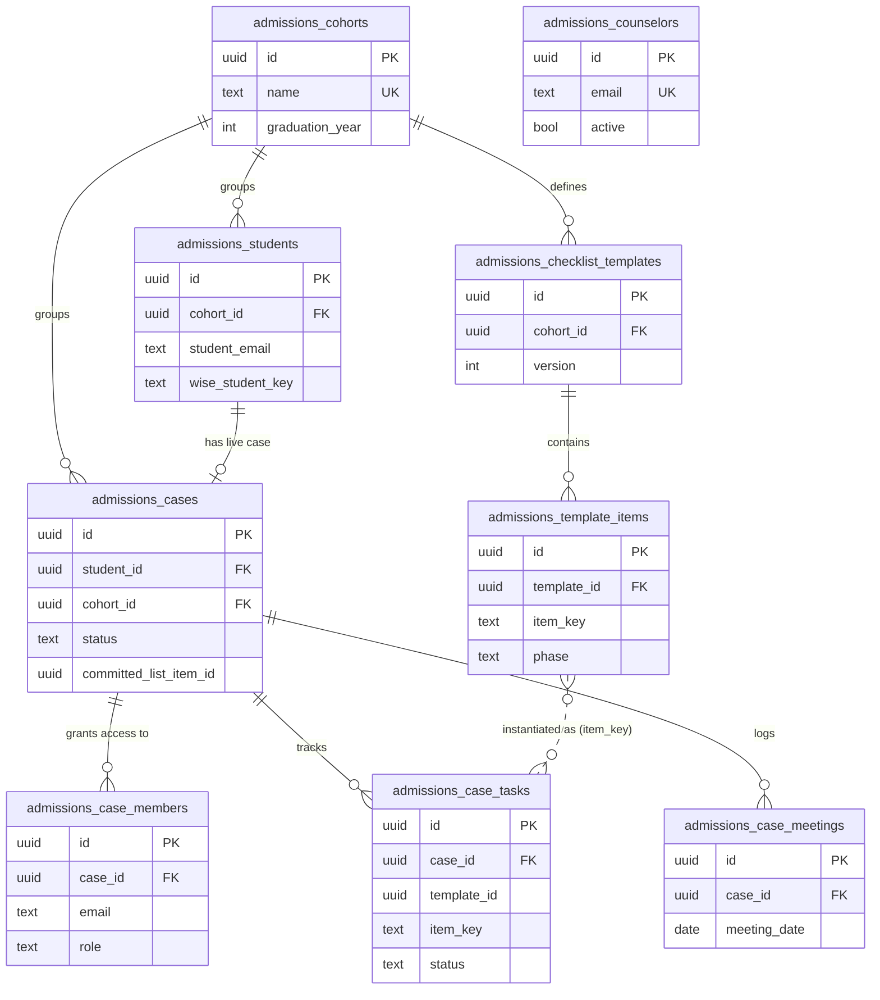
```mermaid
erDiagram
    admissions_cohorts {
        uuid id PK
        text name UK
        int graduation_year
    }
    admissions_students {
        uuid id PK
        uuid cohort_id FK
        text student_email
        text wise_student_key
    }
    admissions_cases {
        uuid id PK
        uuid student_id FK
        uuid cohort_id FK
        text status
        uuid committed_list_item_id
    }
    admissions_case_members {
        uuid id PK
        uuid case_id FK
        text email
        text role
    }
    admissions_counselors {
        uuid id PK
        text email UK
        bool active
    }
    admissions_checklist_templates {
        uuid id PK
        uuid cohort_id FK
        int version
    }
    admissions_template_items {
        uuid id PK
        uuid template_id FK
        text item_key
        text phase
    }
    admissions_case_tasks {
        uuid id PK
        uuid case_id FK
        uuid template_id
        text item_key
        text status
    }
    admissions_case_meetings {
        uuid id PK
        uuid case_id FK
        date meeting_date
    }

    admissions_cohorts ||--o{ admissions_students : "groups"
    admissions_cohorts ||--o{ admissions_cases : "groups"
    admissions_cohorts ||--o{ admissions_checklist_templates : "defines"
    admissions_students ||--o| admissions_cases : "has live case"
    admissions_cases ||--o{ admissions_case_members : "grants access to"
    admissions_cases ||--o{ admissions_case_tasks : "tracks"
    admissions_cases ||--o{ admissions_case_meetings : "logs"
    admissions_checklist_templates ||--o{ admissions_template_items : "contains"
    admissions_template_items }o..o{ admissions_case_tasks : "instantiated as (item_key)"
```

**`admissions_cohorts`** — `admissionsCohorts` (schema.ts:3957-3967). One row per cohort, unique on
`name`, indexed by `graduationYear`.

**`admissions_students`** — `admissionsStudents` (schema.ts:3968-3986). One row per student. FK to
cohort; `wiseStudentKey` is a nullable soft reference to the tutoring side. `externalLinks` jsonb
holds portal/drive URLs. Soft-deletable.

**`admissions_cases`** — `admissionsCases` (schema.ts:3987-4011). One row per case. The **partial
unique index** `admissions_cases_live_student_idx` on `studentId`
`WHERE status IN ('active','committed')` enforces one live case per student while allowing archived
history. `committedListItemId` is a plain uuid soft reference to the college list item the student
committed to. Family access is opt-in and audited in place: `familyPortalOpen` plus
`familyPortalOpenedAt`/`familyPortalOpenedByEmail` (comment at `schema.ts:3995-3996`).

**`admissions_case_members`** — `admissionsCaseMembers` (schema.ts:4012-4037). One row per email per
case — unique on (`caseId`, `email`); this is the table every request's access check resolves
against. `role` and `status` are enums with invited/activated/revoked timestamps.
`notificationPrefs` jsonb allows per-category downgrades to `digest`/`off`; deadline reminders have
no key because they are never downgradable (CM-112, comment at `schema.ts:4022-4024`).

**`admissions_counselors`** — `admissionsCounselors` (schema.ts:4038-4048). One row per counselor,
unique on `email`, with an `active` flag.

**`admissions_checklist_templates`** — `admissionsChecklistTemplates` (schema.ts:4049-4060). One row
per (cohort, version) — unique. A null `publishedAt` means draft.

**`admissions_template_items`** — `admissionsTemplateItems` (schema.ts:4061-4076). One row per
checklist item in a template. `itemKey` is the stable identity carried onto instantiated case tasks;
`phase`, `defaultOwner`, and `sortOrder` shape the 10-phase checklist.

**`admissions_case_tasks`** — `admissionsCaseTasks` (schema.ts:4077-4100). One row per task on a
case. `templateId`/`templateVersion`/`itemKey` are **plain columns, not FKs**, so a task keeps its
provenance even if the template is revised or removed; ad-hoc tasks leave them null. `owner` and
`status` are enums, with `verifiedByEmail`/`verifiedAt` for staff sign-off and `recurrence` jsonb.

**`admissions_case_meetings`** — `admissionsCaseMeetings` (schema.ts:4101-4115). One row per meeting
on a case, with an `attendees` array, free-text `notes`, and `nextMeetingDate`.

### 8b. College list and everything hanging off it

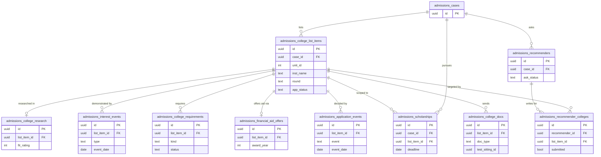
```mermaid
erDiagram
    admissions_cases {
        uuid id PK
    }
    admissions_college_list_items {
        uuid id PK
        uuid case_id FK
        int unit_id
        text inst_name
        text round
        text app_status
    }
    admissions_college_research {
        uuid id PK
        uuid list_item_id FK
        int fit_rating
    }
    admissions_interest_events {
        uuid id PK
        uuid list_item_id FK
        text type
        date event_date
    }
    admissions_college_requirements {
        uuid id PK
        uuid list_item_id FK
        text kind
        text status
    }
    admissions_financial_aid_offers {
        uuid id PK
        uuid list_item_id FK
        int award_year
    }
    admissions_scholarships {
        uuid id PK
        uuid case_id FK
        uuid list_item_id FK
        date deadline
    }
    admissions_application_events {
        uuid id PK
        uuid list_item_id FK
        text event
        date event_date
    }
    admissions_recommenders {
        uuid id PK
        uuid case_id FK
        text ask_status
    }
    admissions_recommender_colleges {
        uuid id PK
        uuid recommender_id FK
        uuid list_item_id FK
        bool submitted
    }
    admissions_college_docs {
        uuid id PK
        uuid list_item_id FK
        text doc_type
        uuid test_sitting_id
    }

    admissions_cases ||--o{ admissions_college_list_items : "lists"
    admissions_cases ||--o{ admissions_scholarships : "pursues"
    admissions_cases ||--o{ admissions_recommenders : "asks"
    admissions_college_list_items ||--o| admissions_college_research : "researched in"
    admissions_college_list_items ||--o{ admissions_interest_events : "demonstrated by"
    admissions_college_list_items ||--o{ admissions_college_requirements : "requires"
    admissions_college_list_items ||--o| admissions_financial_aid_offers : "offers aid via"
    admissions_college_list_items ||--o{ admissions_scholarships : "scoped to"
    admissions_college_list_items ||--o{ admissions_application_events : "decided by"
    admissions_college_list_items ||--o{ admissions_recommender_colleges : "targeted by"
    admissions_college_list_items ||--o{ admissions_college_docs : "sends"
    admissions_recommenders ||--o{ admissions_recommender_colleges : "writes for"
```

**`admissions_college_list_items`** — `admissionsCollegeListItems` (schema.ts:4116-4144). One row per
college on a case's list; the hub of this cluster. `unitId` is a soft reference into
`ipeds_institutions` (`dataYear`, `unitId`) and is **never an FK** (comment at `schema.ts:4119`);
`isManual` marks an entry with no IPEDS match. `round`, `appStatus`, and `category` are enums;
`deadline`, major choices, portal URLs, and `aidOffered`/`aidNotes` complete the row.

**`admissions_college_research`** — `admissionsCollegeResearch` (schema.ts:4145-4165). At most one
research record per list item (unique `listItemId`). `fitRating` is checked to null or 1..5;
`sources` is a jsonb array, alongside campus-visit and narrative note fields.

**`admissions_interest_events`** — `admissionsInterestEvents` (schema.ts:4166-4179). One row per
demonstrated-interest event on a list item (`type`, `eventDate`, `actorEmail`), soft-deletable.

**`admissions_college_requirements`** — `admissionsCollegeRequirements` (schema.ts:4180-4201). One row
per requirement on a list item, reusing the task `status`/`owner` enums so the college checklist and
the case checklist read alike. `required`, `sourceUrl`, and `verifiedByEmail`/`verifiedAt` separate
"we believe" from "we checked".

**`admissions_financial_aid_offers`** — `admissionsFinancialAidOffers` (schema.ts:4202-4219). At most
one offer per list item (unique `listItemId`) for a given `awardYear`. Cost, gift-aid, and loan
breakdowns are jsonb maps; `workStudyAmount`, `netCost`, and `remainingBalance` are numeric.

**`admissions_scholarships`** — `admissionsScholarships` (schema.ts:4220-4240). One row per
scholarship pursued on a case. `listItemId` is nullable — external scholarships are not tied to a
college. Soft-deletable.

**`admissions_application_events`** — `admissionsApplicationEvents` (schema.ts:4241-4252). One row per
application/decision event on a list item; `event` is `admissions_decision_event`, dated by
`eventDate`. This is the decision *history*, not a status column.

**`admissions_recommenders`** — `admissionsRecommenders` (schema.ts:4253-4266). One row per
recommender on a case, with `askStatus` (`admissions_rec_status`, default `planned`).

**`admissions_recommender_colleges`** — `admissionsRecommenderColleges` (schema.ts:4267-4279). The
join: one row per (recommender, list item) — unique — with `submitted`/`submittedAt`.

**`admissions_college_docs`** — `admissionsCollegeDocs` (schema.ts:4280-4292). One row per document
type sent to a college. `testSittingId` is a plain uuid soft reference to
`admissions_test_sittings` (score sends), keeping the two tables independently deletable.

### 8c. Student-facing content: essays, activities, awards, testing, records

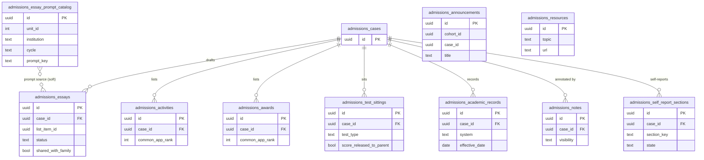
```mermaid
erDiagram
    admissions_cases {
        uuid id PK
    }
    admissions_essays {
        uuid id PK
        uuid case_id FK
        uuid list_item_id
        text status
        bool shared_with_family
    }
    admissions_essay_prompt_catalog {
        uuid id PK
        int unit_id
        text institution
        text cycle
        text prompt_key
    }
    admissions_activities {
        uuid id PK
        uuid case_id FK
        int common_app_rank
    }
    admissions_awards {
        uuid id PK
        uuid case_id FK
        int common_app_rank
    }
    admissions_test_sittings {
        uuid id PK
        uuid case_id FK
        text test_type
        bool score_released_to_parent
    }
    admissions_academic_records {
        uuid id PK
        uuid case_id FK
        text system
        date effective_date
    }
    admissions_notes {
        uuid id PK
        uuid case_id FK
        text visibility
    }
    admissions_announcements {
        uuid id PK
        uuid cohort_id
        uuid case_id
        text title
    }
    admissions_resources {
        uuid id PK
        text topic
        text url
    }
    admissions_self_report_sections {
        uuid id PK
        uuid case_id FK
        text section_key
        text state
    }

    admissions_cases ||--o{ admissions_essays : "drafts"
    admissions_cases ||--o{ admissions_activities : "lists"
    admissions_cases ||--o{ admissions_awards : "lists"
    admissions_cases ||--o{ admissions_test_sittings : "sits"
    admissions_cases ||--o{ admissions_academic_records : "records"
    admissions_cases ||--o{ admissions_notes : "annotated by"
    admissions_cases ||--o{ admissions_self_report_sections : "self-reports"
    admissions_essay_prompt_catalog }o..o{ admissions_essays : "prompt source (soft)"
```

**`admissions_essays`** — `admissionsEssays` (schema.ts:4293-4310). One row per essay on a case.
`listItemId` is a plain uuid (supplemental essays point at a college; personal statements do not).
`status` and `counselorStage` share the `admissions_essay_status` enum so student-visible progress
and internal stage can differ. `sharedWithFamily` and `lastStudentUpdateAt` drive the family view.

**`admissions_essay_prompt_catalog`** — `admissionsEssayPromptCatalog` (schema.ts:4311-4336). One row
per (institution, program, cycle, promptKey) — unique. `unitId` soft-links to IPEDS. `wordLimit` is
checked to null-or-positive, and `verifiedAt`/`verifiedByEmail` record that a human confirmed the
prompt against `sourceUrl`.

**`admissions_activities`** — `admissionsActivities` (schema.ts:4337-4352). One row per activity, with
platform-specific payloads in `commonApp` and `uc` jsonb plus `commonAppRank` and `sortOrder`.

**`admissions_awards`** — `admissionsAwards` (schema.ts:4353-4386). One row per award. The platform
limits are enforced in the database: `commonAppRank` checked to 1..5 and **unique per case among
non-deleted rows**, `ucEligibilityNarrative` ≤ 250 characters, `ucAchievementNarrative` ≤ 350.
`gradeLevels` and `recognitionLevels` are arrays.

**`admissions_test_sittings`** — `admissionsTestSittings` (schema.ts:4387-4407). One row per test
sitting. `testType` and `status` are enums; registration and late-registration deadlines are
separate columns. `scoreReleasedToParent` defaults to **false** — raw scores are parent-visible only
after explicit release — and `scoreDetails` jsonb holds the section breakdown.

**`admissions_academic_records`** — `admissionsAcademicRecords` (schema.ts:4408-4423). One row per
(case, `system`, `effectiveDate`) — unique among non-deleted rows — with the transcript payload in
jsonb, so multiple grading systems coexist without schema churn.

**`admissions_notes`** — `admissionsNotes` (schema.ts:4424-4438). One row per note. `visibility` is
`admissions_note_visibility`, **not null with no default**, so the UI must force an explicit
visibility choice (comment at `schema.ts:4429`).

**`admissions_announcements`** — `admissionsAnnouncements` (schema.ts:4439-4458). One row per
announcement. `cohortId` and `caseId` are plain uuids governed by the
`admissions_announcements_target_check` XOR constraint: exactly one target, cohort broadcast or
case-scoped.

**`admissions_resources`** — `admissionsResources` (schema.ts:4459-4471). One row per shared resource
link, grouped by `topic` and ordered by `sortOrder`. Global, not case-scoped.

**`admissions_self_report_sections`** — `admissionsSelfReportSections` (schema.ts:4472-4487). One row
per (`caseId`, `sectionKey`) — unique, which is what autosave upserts against (comment at
`schema.ts:4484`). `payload` jsonb, `state` (`admissions_submission_state`, default `draft`),
`sharedWithFamily`, and `reviewedByEmail`.

### 8d. Audit, notifications, and spreadsheet import

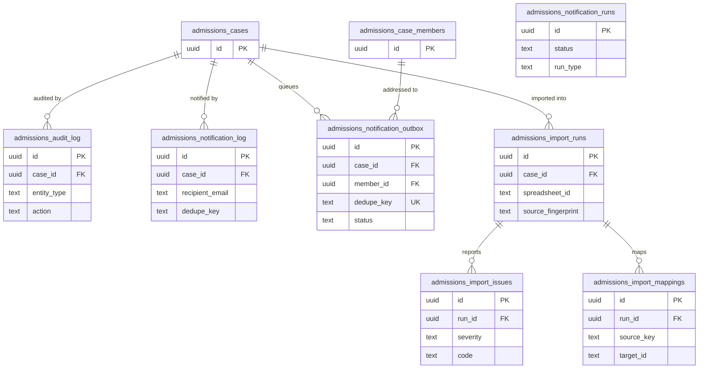
```mermaid
erDiagram
    admissions_cases {
        uuid id PK
    }
    admissions_case_members {
        uuid id PK
    }
    admissions_audit_log {
        uuid id PK
        uuid case_id FK
        text entity_type
        text action
    }
    admissions_notification_log {
        uuid id PK
        uuid case_id FK
        text recipient_email
        text dedupe_key
    }
    admissions_notification_outbox {
        uuid id PK
        uuid case_id FK
        uuid member_id FK
        text dedupe_key UK
        text status
    }
    admissions_notification_runs {
        uuid id PK
        text status
        text run_type
    }
    admissions_import_runs {
        uuid id PK
        uuid case_id FK
        text spreadsheet_id
        text source_fingerprint
    }
    admissions_import_issues {
        uuid id PK
        uuid run_id FK
        text severity
        text code
    }
    admissions_import_mappings {
        uuid id PK
        uuid run_id FK
        text source_key
        text target_id
    }

    admissions_cases ||--o{ admissions_audit_log : "audited by"
    admissions_cases ||--o{ admissions_notification_log : "notified by"
    admissions_cases ||--o{ admissions_notification_outbox : "queues"
    admissions_cases ||--o{ admissions_import_runs : "imported into"
    admissions_case_members ||--o{ admissions_notification_outbox : "addressed to"
    admissions_import_runs ||--o{ admissions_import_issues : "reports"
    admissions_import_runs ||--o{ admissions_import_mappings : "maps"
```

`admissions_notification_runs` carries no FK — it is the digest-cron control row, correlated to
outbox rows by time rather than by reference.

**`admissions_audit_log`** — `admissionsAuditLog` (schema.ts:4488-4503). One row per audited
mutation. `caseId` is nullable (case-independent actions exist); `diff` is a typed jsonb map of
`{ old, new }` per field. Append-only: `createdAt` only, no `updatedAt`, no UPDATE/DELETE path
(comment at `schema.ts:4497`).

**`admissions_notification_log`** — `admissionsNotificationLog` (schema.ts:4504-4524). One row per
email actually sent. `category` and `tier` are documented text values (comments at
`schema.ts:4508-4511`). The **partial** unique index on `dedupeKey WHERE dedupeKey IS NOT NULL`
means keyed sends happen exactly once while keyless ones stay unconstrained.

**`admissions_notification_outbox`** — `admissionsNotificationOutbox` (schema.ts:4525-4548). One
queued email per `dedupeKey` (unique, and non-nullable here). Delivery state is `status` +
`attemptCount` + `nextAttemptAt` (indexed together as the claim query), with `providerMessageId` and
`lastError` on completion. Optional FK to the case member it addresses.

**`admissions_notification_runs`** — `admissionsNotificationRuns` (schema.ts:4549-4565). One row per
digest run (`runType` = daily | weekly), with the same partial-unique `WHERE status = 'running'`
single-flight guard used across the codebase, plus sent/skipped counters.

**`admissions_import_runs`** — `admissionsImportRuns` (schema.ts:4566-4587). One row per SummitEd
spreadsheet import for a case, unique on (`caseId`, `spreadsheetId`, `sourceFingerprint`) — the same
sheet content cannot be imported twice. `status` defaults to `"preview"` and only `committedAt`
marks it applied; `conflictPolicy`, `sourceMetadata`, and `summary` jsonb hold the plan.

**`admissions_import_issues`** — `admissionsImportIssues` (schema.ts:4588-4603). One row per problem
found in an import, with `severity`/`code`, the originating `sheetName`/`sourceRef`, `details`
jsonb, and a `resolution`.

**`admissions_import_mappings`** — `admissionsImportMappings` (schema.ts:4604-4626). One row per
source entity mapped to a created record — unique on (`runId`, `sourceType`, `sourceKey`).
`targetType`/`targetId` are plain text because targets span many tables, and
`sourceValueFingerprint` supports change detection on re-import.

---

## 9. Student monthly schedule — parent-facing (1 table)

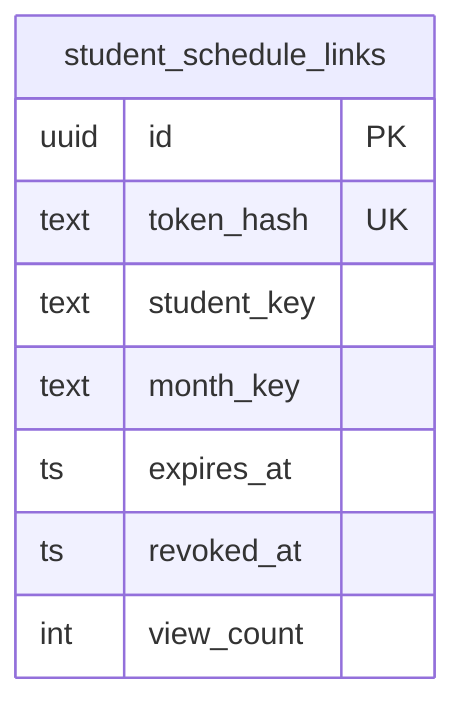
```mermaid
erDiagram
    student_schedule_links {
        uuid id PK
        text token_hash UK
        text student_key
        text month_key
        ts expires_at
        ts revoked_at
        int view_count
    }
```

### `student_schedule_links` — `studentScheduleLinks` (schema.ts:4627-4659)

One row per capability token issued for the public `/schedule/{token}` parent view — unique on
`tokenHash`. Only the SHA-256 hash is stored (the same discipline as `line_oa_resolver_runs`), so a
database read cannot reconstruct a live link; a row grants read access to exactly one
(`studentKey`, `monthKey`) pair and is both expiring (`expiresAt`) and revocable (`revokedAt`)
(comment at `schema.ts:4621-4626`). Provenance covers both issuance paths — `createdByEmail` for the
admin UI, `createdByLineUserId` for the LINE bot — and delivery is recorded as either
`sentToLineUserId` (1:1) or `sentToGroupId` (group chat, comment at `schema.ts:4637-4638`).
`viewCount`/`lastViewedAt` are the usage trail. No foreign keys: `studentKey`/`wiseStudentId` are
soft references to Wise.

---

_Verified against HEAD + uncommitted WIP on 2026-05-31._
