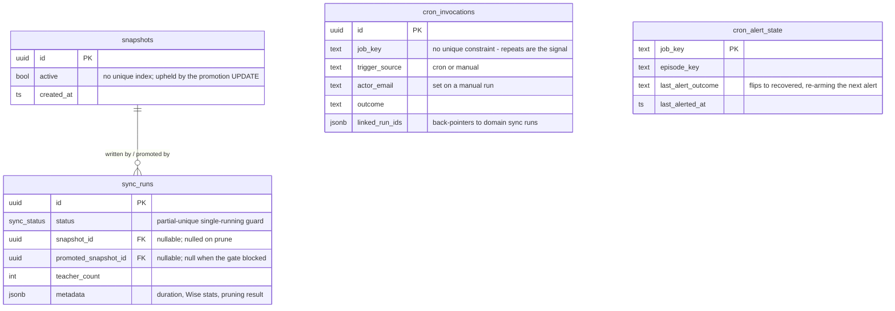
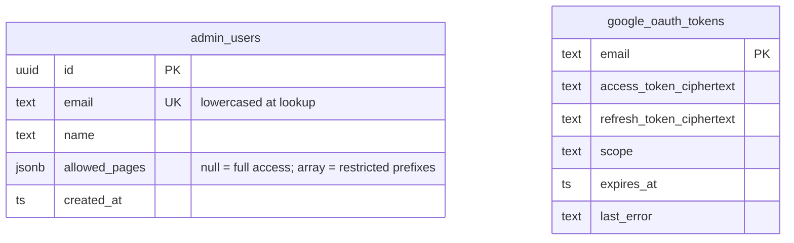
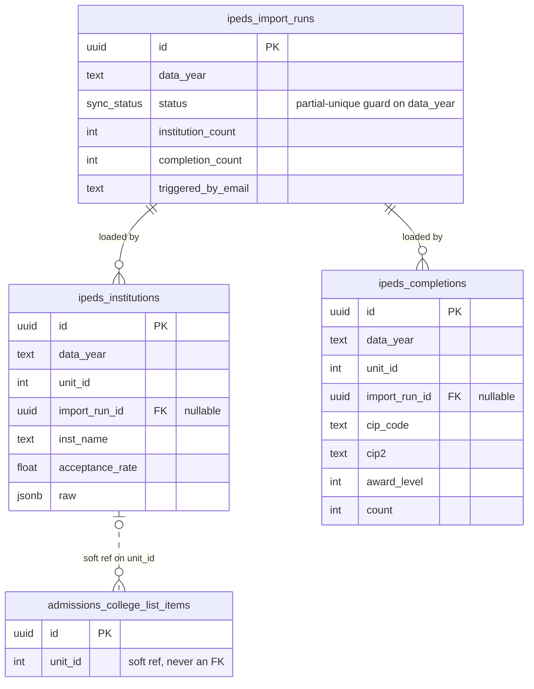

# Database Reference — Core (Snapshots, Sync, Tutor Identity, Normalization)

Scope: the **22 tables** that remain in the `core` allocation after every self-contained subsystem
was given its own page. What is left is the original ETL spine and the things that have no other
home: the snapshot/sync control plane and cron observability, the sign-in allowlist and the Google
token store, the snapshot-scoped tutor + normalization tables `runFullSync()` writes, the two
cross-snapshot exceptions (`tutor_aliases`, `past_session_blocks`), the room-utilization mirror, the
two ETL self-report tables (`data_issues`, `snapshot_stats`), and the read-only IPEDS dataset.

Every table below is declared in [`src/lib/db/schema.ts`](../../../src/lib/db/schema.ts) and migrated
under [`drizzle/`](../../../drizzle). **Column-by-column detail — types, defaults, indexes, check
constraints — is the schema file itself, indexed by the [master table index](./index.md)**; this page
documents grain, key columns, and relationships only. Enum value sets live in
[`enums.md`](./enums.md). Feature meaning, rules, and flows live under
[`docs/features/`](../../features/) — principally [tutor-search.md](../../features/tutor-search.md),
[tutor-compare.md](../../features/tutor-compare.md),
[data-health.md](../../features/data-health.md), and
[us-universities.md](../../features/us-universities.md).

## Moved

Eight domains that this page used to enumerate now have their own reference pages. They are **no
longer documented here** — follow the link instead. The counts are the number of tables each page
took with it.

| Domain | Tables | Now documented in |
|---|---:|---|
| `post_class_*` — post-class feedback, finance, payout | 32 | [erd-post-class-feedback.md](./erd-post-class-feedback.md) |
| `admissions_*` — university admissions case management | 36 | [erd-university-admissions.md](./erd-university-admissions.md) |
| `competitor_*` — competitor intelligence | 16 | [erd-competitor-intelligence.md](./erd-competitor-intelligence.md) |
| `progress_test_*` — progress tests | 8 | [erd-progress-tests.md](./erd-progress-tests.md) |
| `student_promotion_*` — July 1 student promotions | 6 | [erd-student-promotions.md](./erd-student-promotions.md) |
| `wise_activity_*` — Wise activity audit mirror | 2 | [erd-wise-activity.md](./erd-wise-activity.md) |
| `student_schedule_links` — parent schedule capability tokens | 1 | [erd-student-schedule.md](./erd-student-schedule.md) |
| `learning_plan_access_grants` — Learning Plans access | 1 | [erd-learning-plans.md](./erd-learning-plans.md) |

Those eight took 102 tables with them; the 22 below are what is left. **None of the eight holds a
foreign key into core** — every `.references(...)` pointing at a table on this page comes from
Classrooms or Leave Requests instead (listed in [§3](#3-tutor-identity-normalization-session-blocks--data-health-13-tables)).
The moved domains reach core by durable string: `tutor_identity_groups.canonical_key`
resolved at read or sync time, and `admissions_college_list_items.unit_id`, a soft reference into
`ipeds_institutions` that is deliberately never an FK (`schema.ts:4128`; see
[§4](#4-us-universities--ipeds-3-tables)).

## Scope

Exactly 22 tables (Drizzle export — Postgres table — `src/lib/db/schema.ts` line range). With the
102 moved above and the 65 owned by the nine other domain pages (AI & Proposals, Classrooms, Credit
Control, LINE, Leave Requests, Payroll, Room Capacity, Sales Dashboard, Tutor Profiles), that
accounts for all 189 `pgTable` declarations in the schema:

| Table (varName) | Postgres table | Lines | § | Grain |
|---|---|---|---|---|
| `snapshots` | `snapshots` | 456–461 | [1](#1-snapshot--sync-control-plane-and-cron-observability-4-tables) | one row per ETL snapshot |
| `syncRuns` | `sync_runs` | 462–478 | [1](#1-snapshot--sync-control-plane-and-cron-observability-4-tables) | one row per full-sync attempt |
| `cronInvocations` | `cron_invocations` | 479–504 | [1](#1-snapshot--sync-control-plane-and-cron-observability-4-tables) | one row per cron/manual invocation |
| `cronAlertState` | `cron_alert_state` | 505–517 | [1](#1-snapshot--sync-control-plane-and-cron-observability-4-tables) | current state, one row per alerted job |
| `adminUsers` | `admin_users` | 575–586 | [2](#2-auth--access-2-tables) | one row per allowlisted admin |
| `googleOAuthTokens` | `google_oauth_tokens` | 587–600 | [2](#2-auth--access-2-tables) | one row per connected Google account |
| `tutorIdentityGroups` | `tutor_identity_groups` | 1519–1529 | [3](#3-tutor-identity-normalization-session-blocks--data-health-13-tables) | snapshot-scoped |
| `tutorIdentityGroupMembers` | `tutor_identity_group_members` | 1530–1542 | [3](#3-tutor-identity-normalization-session-blocks--data-health-13-tables) | snapshot-scoped |
| `tutorAliases` | `tutor_aliases` | 1543–1551 | [3](#3-tutor-identity-normalization-session-blocks--data-health-13-tables) | snapshot-independent (curated input) |
| `tutors` | `tutors` | 1552–1564 | [3](#3-tutor-identity-normalization-session-blocks--data-health-13-tables) | snapshot-scoped |
| `rawTeacherTags` | `raw_teacher_tags` | 1565–1575 | [3](#3-tutor-identity-normalization-session-blocks--data-health-13-tables) | snapshot-scoped |
| `subjectLevelQualifications` | `subject_level_qualifications` | 1576–1591 | [3](#3-tutor-identity-normalization-session-blocks--data-health-13-tables) | snapshot-scoped |
| `recurringAvailabilityWindows` | `recurring_availability_windows` | 1592–1605 | [3](#3-tutor-identity-normalization-session-blocks--data-health-13-tables) | snapshot-scoped |
| `datedLeaves` | `dated_leaves` | 1606–1617 | [3](#3-tutor-identity-normalization-session-blocks--data-health-13-tables) | snapshot-scoped |
| `futureSessionBlocks` | `future_session_blocks` | 1618–1648 | [3](#3-tutor-identity-normalization-session-blocks--data-health-13-tables) | snapshot-scoped |
| `roomUtilizationSessions` | `room_utilization_sessions` | 1739–1762 | [3](#3-tutor-identity-normalization-session-blocks--data-health-13-tables) | snapshot-independent, unique on session |
| `pastSessionBlocks` | `past_session_blocks` | 2258–2302 | [3](#3-tutor-identity-normalization-session-blocks--data-health-13-tables) | snapshot-independent, unique on session |
| `dataIssues` | `data_issues` | 2688–2705 | [3](#3-tutor-identity-normalization-session-blocks--data-health-13-tables) | snapshot-scoped |
| `snapshotStats` | `snapshot_stats` | 2706–2728 | [3](#3-tutor-identity-normalization-session-blocks--data-health-13-tables) | exactly one row per snapshot |
| `ipedsImportRuns` | `ipeds_import_runs` | 3007–3023 | [4](#4-us-universities--ipeds-3-tables) | one row per import attempt per data year |
| `ipedsInstitutions` | `ipeds_institutions` | 3024–3117 | [4](#4-us-universities--ipeds-3-tables) | one row per (dataYear, unitId) |
| `ipedsCompletions` | `ipeds_completions` | 3118–3140 | [4](#4-us-universities--ipeds-3-tables) | one row per (dataYear, unitId, cipCode, awardLevel) |

## The snapshot model in one paragraph

The tutor and normalization tables each carry a `snapshot_id` FK to `snapshots`, and most also carry
a `group_id` FK to `tutor_identity_groups`. `runFullSync()` inserts a fresh candidate snapshot with
`active: false` (`src/lib/sync/orchestrator.ts:72-73`), writes a complete row set under it, then
computes `unresolvedRatio = identityIssues.length / max(groups.length, 1)` and promotes only if that
is below `0.5` (`orchestrator.ts:472-476`). Promotion is a **single** `UPDATE` that sets
`active = (id = candidate)` under a bounded `WHERE` covering the previously-active row(s) plus the
candidate (`orchestrator.ts:488-498`), so a concurrent reader sees either the old active row or the
new one and never a moment with zero matches (comment at `orchestrator.ts:481-487`, labelled
REL-01). The invariant is upheld by that statement, not by a constraint: `snapshots` carries no
unique index on `active` (`schema.ts:456-461`).

After a successful promotion the orchestrator calls `pruneOldSnapshots(db)`
(`orchestrator.ts:527-541`), which keeps the newest `SNAPSHOT_RETENTION_COUNT = 30` snapshots plus
the active one whatever its age (`src/lib/sync/snapshot-pruning.ts:5`, `:64-70`), then deletes
children in reverse-FK order — `snapshot_stats`,
`data_issues`, `future_session_blocks`, `dated_leaves`, `recurring_availability_windows`,
`raw_teacher_tags`, `subject_level_qualifications`, `tutors`, `tutor_identity_group_members`,
`tutor_identity_groups`, and finally `snapshots` (`src/lib/sync/snapshot-pruning.ts:104-179`).
`sync_runs` is not deleted; its two snapshot columns are **nulled** instead
(`snapshot-pruning.ts:88-103`), which is why both are nullable FKs. Pruning runs inside its own
try/catch and records success or failure in `sync_runs.metadata` rather than failing the sync
(`orchestrator.ts:532-541`).

Tables deliberately outside that lineage are **snapshot-independent** and survive rotation:
`admin_users`, `google_oauth_tokens`, `tutor_aliases`, `cron_invocations`, `cron_alert_state`,
`room_utilization_sessions`, `past_session_blocks`, and all three `ipeds_*` tables.

Three grain patterns recur and are worth naming once:

- **Snapshot-scoped** — carries `snapshot_id`, rewritten wholesale per ETL run; readers filter to
  `snapshots.active = true`.
- **Snapshot-independent** — keyed by a durable natural key (email, `wise_session_id`,
  `group_canonical_key`, `(dataYear, unitId)`) and deliberately surviving rotation.
- **Single-flight ledger** — a run table whose partial `uniqueIndex(...).where(status = 'running')`
  puts the concurrency guard in Postgres rather than application code. `sync_runs` and
  `ipeds_import_runs` are the two on this page, and they guard on different columns (see
  [Open questions](#open-questions)).

---

## 1. Snapshot & sync control plane and cron observability (4 tables)

| Table (varName) | SQL name | schema.ts lines |
|---|---|---|
| `snapshots` | `snapshots` | 456–461 |
| `syncRuns` | `sync_runs` | 462–478 |
| `cronInvocations` | `cron_invocations` | 479–504 |
| `cronAlertState` | `cron_alert_state` | 505–517 |

```mermaid
erDiagram
    snapshots {
        uuid id PK
        bool active "no unique index; upheld by the promotion UPDATE"
        ts created_at
    }
    sync_runs {
        uuid id PK
        sync_status status "partial-unique single-running guard"
        uuid snapshot_id FK "nullable; nulled on prune"
        uuid promoted_snapshot_id FK "nullable; null when the gate blocked"
        int teacher_count
        jsonb metadata "duration, Wise stats, pruning result"
    }
    cron_invocations {
        uuid id PK
        text job_key "no unique constraint - repeats are the signal"
        text trigger_source "cron or manual"
        text actor_email "set on a manual run"
        text outcome
        jsonb linked_run_ids "back-pointers to domain sync runs"
    }
    cron_alert_state {
        text job_key PK
        text episode_key
        text last_alert_outcome "flips to recovered, re-arming the next alert"
        ts last_alerted_at
    }

    snapshots ||--o{ sync_runs : "written by / promoted by"
```

`sync_runs` holds the only foreign keys in this cluster — both to `snapshots`, both nullable. The
other two tables are independent ledgers that share the cluster because they are control-plane
rather than domain data: neither references anything and nothing references them.

### `snapshots` — `snapshots` (schema.ts:456-461)

One row per Wise ETL snapshot; three columns only (`id`, `active`, `createdAt`). `active = true`
marks the single promoted snapshot every read path filters on — `ensureIndex()` resolves it with a
plain `WHERE active = true` before loading anything else (`src/lib/search/index.ts:145-148`). Parent
of every snapshot-scoped table in §3 and of both `sync_runs` FK columns.

### `syncRuns` — `sync_runs` (schema.ts:462-478)

One row per full-sync attempt. `status` is [`sync_status`](./enums.md#sync_status); `snapshotId` is
the candidate the run wrote and `promotedSnapshotId` the one it promoted — null when the run errored
or the >50% unresolved-identity gate blocked it. `teacherCount`, `errorSummary`, and a free-form
`metadata` jsonb carry the outcome; the orchestrator writes run duration, Wise client stats, and the
pruning result into that jsonb (`orchestrator.ts:507-546`). The partial
`uniqueIndex("sync_runs_single_running_idx").where(status = 'running')` (`schema.ts:473-475`) is the
single-flight guard: a second concurrent sync cannot insert its `running` row.

### `cronInvocations` — `cron_invocations` (schema.ts:479-504)

One row per invocation of an internal cron or manual job. `jobKey` has **no** unique constraint —
repeat rows are the observability signal, not a defect. `triggerSource` separates `cron` from manual
runs and `actorEmail` names the human on a manual one; `outcome`, `responseStatus`, and `durationMs`
record the result; `linkedRunIds` jsonb points back at whatever domain `*_sync_runs` row the
invocation created (`extractLinkedRunIds`, `src/lib/data-health/cron-audit.ts:180`). Rows are
retained for `CRON_INVOCATION_RETENTION_DAYS = 90` and then deleted
(`src/lib/data-health/cron-retention.ts:16-54`). Backs the Data Health cron table; the schedule
inventory is [`../crons.md`](../crons.md).

### `cronAlertState` — `cron_alert_state` (schema.ts:505-517)

One row per cron job the watchdog has ever alerted on — `jobKey` is the primary key, so this is
current state, not history. `episodeKey` identifies the failure episode already alerted; when the
recovery notice goes out `lastAlertOutcome` flips to `"recovered"`, which re-arms the next alert for
that job (comment at `schema.ts:501-504`). Written only by
[`src/lib/internal/cron-watchdog.ts`](../../../src/lib/internal/cron-watchdog.ts), the handler behind
the `/api/internal/cron-watchdog` cron (`7,37 * * * *`, `vercel.json:60-63`).

---

## 2. Auth & access (2 tables)

| Table (varName) | SQL name | schema.ts lines |
|---|---|---|
| `adminUsers` | `admin_users` | 575–586 |
| `googleOAuthTokens` | `google_oauth_tokens` | 587–600 |

```mermaid
erDiagram
    admin_users {
        uuid id PK
        text email UK "lowercased at lookup"
        text name
        jsonb allowed_pages "null = full access; array = restricted prefixes"
        ts created_at
    }
    google_oauth_tokens {
        text email PK
        text access_token_ciphertext
        text refresh_token_ciphertext
        text scope
        ts expires_at
        text last_error
    }
```

Neither table is an FK target and neither declares an FK. They are joined to nothing: both are keyed
by email and looked up by an already-normalized string.

### `adminUsers` — `admin_users` (schema.ts:575-586)

One row per allowlisted admin, unique on `email` (`schema.ts:584`). `allowedPages` is the
page-scoping mechanism: `null` means full access (the original admins, unchanged), a non-null string
array restricts the user to those route prefixes (comment at `schema.ts:579-580`). It is **step 1 of
a four-step sign-in cascade** — an `admin_users` hit wins outright, ahead of the admissions-counselor
registry, tutor contacts, and per-case admissions membership, so an admin who is also a tutor contact
keeps the admin view (`resolveUserAccess`, `src/lib/auth-access.ts:56-84`). The resolved
`allowedPages` then rides on the session and is enforced per request in `isPathAllowed`
(`src/middleware.ts:36-67`), which matches each prefix both as a page (`/x`, `/x/…`) and as its API
namespace (`/api/x`, `/api/x/…`). The `allowedPages IS NULL` predicate is also how the cron watchdog
picks its alert recipients — only full-access admins are mailed
(`src/lib/internal/cron-watchdog.ts:264-267`).

### `googleOAuthTokens` — `google_oauth_tokens` (schema.ts:587-600)

One row per connected Google account, `email` as the primary key. Access and refresh tokens are
stored only as ciphertext (`accessTokenCiphertext`, `refreshTokenCiphertext`); `scope`, `tokenType`,
`expiresAt`, and `lastError` carry the connection's health. Owned by the Sales Dashboard's shared
Google layer (`src/lib/sales-dashboard/google-oauth.ts:106-293`, the only writer) and read by Leave
Requests (`src/lib/leave-requests/sync.ts:132-135`) and the post-class Drive/payout path
(`src/lib/post-class-feedback/drive.ts`, `payout-run.ts`) — three domains sharing one token store.

---

## 3. Tutor identity, normalization, session blocks & data health (13 tables)

The original ETL output: what `runFullSync()` writes under a candidate snapshot, plus the two
cross-snapshot exceptions (`tutor_aliases` as curated input, `past_session_blocks` as durable
history), the independent room-utilization mirror, and the two tables in which a run reports on
itself.

| Table (varName) | SQL name | schema.ts lines |
|---|---|---|
| `tutorIdentityGroups` | `tutor_identity_groups` | 1519–1529 |
| `tutorIdentityGroupMembers` | `tutor_identity_group_members` | 1530–1542 |
| `tutorAliases` | `tutor_aliases` | 1543–1551 |
| `tutors` | `tutors` | 1552–1564 |
| `rawTeacherTags` | `raw_teacher_tags` | 1565–1575 |
| `subjectLevelQualifications` | `subject_level_qualifications` | 1576–1591 |
| `recurringAvailabilityWindows` | `recurring_availability_windows` | 1592–1605 |
| `datedLeaves` | `dated_leaves` | 1606–1617 |
| `futureSessionBlocks` | `future_session_blocks` | 1618–1648 |
| `roomUtilizationSessions` | `room_utilization_sessions` | 1739–1762 |
| `pastSessionBlocks` | `past_session_blocks` | 2258–2302 |
| `dataIssues` | `data_issues` | 2688–2705 |
| `snapshotStats` | `snapshot_stats` | 2706–2728 |

```mermaid
erDiagram
    snapshots {
        uuid id PK
    }
    tutor_identity_groups {
        uuid id PK
        uuid snapshot_id FK
        text canonical_key "durable cross-domain handle"
        text display_name
        modality supported_modality "defaults to unresolved"
    }
    tutor_identity_group_members {
        uuid id PK
        uuid group_id FK
        uuid snapshot_id FK
        text wise_teacher_id
        text wise_user_id
        bool is_online_variant
    }
    tutors {
        uuid id PK
        uuid snapshot_id FK
        uuid group_id FK
        text display_name
        jsonb supported_modes
    }
    raw_teacher_tags {
        uuid id PK
        uuid snapshot_id FK
        uuid group_id FK
        text tag_value
        jsonb tag_raw
    }
    subject_level_qualifications {
        uuid id PK
        uuid snapshot_id FK
        uuid group_id FK
        text subject
        text level
        text source_tag
    }
    recurring_availability_windows {
        uuid id PK
        uuid snapshot_id FK
        uuid group_id FK
        int weekday "0=Sunday..6=Saturday"
        int start_minute "minutes since midnight Asia/Bangkok"
        modality modality
    }
    dated_leaves {
        uuid id PK
        uuid snapshot_id FK
        uuid group_id FK
        ts start_time
        ts end_time
    }
    future_session_blocks {
        uuid id PK
        uuid snapshot_id FK
        uuid group_id FK
        text wise_session_id
        text wise_status
        bool is_blocking "fail-closed default true"
        text recurrence_id
    }
    data_issues {
        uuid id PK
        uuid snapshot_id FK
        data_issue_type type
        data_issue_severity severity
        text entity_id "loose text, not an FK"
    }
    snapshot_stats {
        uuid id PK
        uuid snapshot_id UK "exactly one row per snapshot"
        int total_identity_groups
        int unresolved_groups
        jsonb issues_by_type
    }
    tutor_aliases {
        uuid id PK
        text from_key UK
        text to_key
    }
    past_session_blocks {
        uuid id PK
        text group_canonical_key "resolved at read time"
        text wise_session_id UK "one row per session, ever"
        uuid captured_in_snapshot_id "provenance only, deliberately not an FK"
        ts captured_at
    }
    room_utilization_sessions {
        uuid id PK
        text wise_session_id UK
        date utilization_date
        text raw_location
        text normalized_room_label
    }

    snapshots ||--o{ tutor_identity_groups : scopes
    snapshots ||--o{ tutor_identity_group_members : scopes
    snapshots ||--o{ tutors : scopes
    snapshots ||--o{ raw_teacher_tags : scopes
    snapshots ||--o{ subject_level_qualifications : scopes
    snapshots ||--o{ recurring_availability_windows : scopes
    snapshots ||--o{ dated_leaves : scopes
    snapshots ||--o{ future_session_blocks : scopes
    snapshots ||--o{ data_issues : scopes
    snapshots ||--|| snapshot_stats : summarizes
    tutor_identity_groups ||--o{ tutor_identity_group_members : merges
    tutor_identity_groups ||--o{ tutors : "read aggregate for"
    tutor_identity_groups ||--o{ raw_teacher_tags : "tagged with"
    tutor_identity_groups ||--o{ subject_level_qualifications : qualifies
    tutor_identity_groups ||--o{ recurring_availability_windows : "available in"
    tutor_identity_groups ||--o{ dated_leaves : "on leave in"
    tutor_identity_groups ||--o{ future_session_blocks : "busy in"
    tutor_identity_groups |o..o{ past_session_blocks : "resolved by canonical_key"
    tutor_aliases }o..o{ tutor_identity_groups : "curated input to the cascade"
```

Both dotted edges are deliberate non-FKs. `past_session_blocks` joins by the `group_canonical_key`
string so its rows outlive the snapshot that captured them; `tutor_aliases` is *input* to the
identity cascade rather than output of it — the orchestrator reads the whole table before resolving
(`orchestrator.ts:86-94`) — so it must not be rewritten per sync. `room_utilization_sessions` has no
edge at all: it is keyed on `wise_session_id` and carries no group or snapshot column.

**Inbound cross-domain FKs.** Five tables outside this page reference core, and this is the complete
list: `classroomAssignmentRuns.snapshotId` (`schema.ts:1667`),
`classroomAssignmentRows.snapshotId` + `.groupId` (`:1693-1694`),
`classroomScheduleEmailRecipients.groupId` (`:2041`) — all in
[erd-classrooms.md](./erd-classrooms.md) — plus `leaveRequests.tutorGroupId` (`:2153`) and
`leaveRequestAffectedSessions.snapshotId` + `.groupId` (`:2177-2178`) in
[erd-leave-requests.md](./erd-leave-requests.md). Every other domain that needs a tutor stores
`tutor_identity_groups.canonical_key` as a plain string resolved at read or sync time — payroll
(`src/lib/payroll/sync.ts:139-159`), progress tests, and post-class feedback all do this. Nothing
anywhere references `admin_users`, `google_oauth_tokens`, or the `ipeds_*` tables by FK.

### `tutorIdentityGroups` — `tutor_identity_groups` (schema.ts:1519-1529)

One row per resolved tutor identity within one snapshot. `canonicalKey` is the durable
cross-snapshot handle other domains store as a plain string; `displayName` is the human label; and
`supportedModality` is [`modality`](./enums.md#modality) defaulting to `"unresolved"` — the
fail-closed default. Parent of every other snapshot-scoped tutor table and the only core table that
other domains reference by FK.

### `tutorIdentityGroupMembers` — `tutor_identity_group_members` (schema.ts:1530-1542)

One row per Wise teacher record folded into a group, so the 5-step identity cascade's merge decision
stays inspectable after the fact. Carries `wiseTeacherId`, an optional `wiseUserId`, the raw
`wiseDisplayName`, and `isOnlineVariant` — the flag the online/offline pair-detection step sets.
Loaded by the search index (`src/lib/search/index.ts:176-180`) and re-read at sync time by domains
that need to stamp a canonical key onto their own rows.

### `tutorAliases` — `tutor_aliases` (schema.ts:1543-1551)

One row per manual alias mapping, unique on `fromKey` (`schema.ts:1549`). Snapshot-independent and
human-curated: it is read whole into the identity cascade (`orchestrator.ts:86-94`), seeded by
`src/lib/db/seed.ts:24-26`, and also consulted outside the ETL by tutor business profiles
(`src/lib/tutor-business-profiles.ts:317-320`), leave-request matching
(`src/lib/leave-requests/matching.ts:81`), and classroom schedule email
(`src/lib/classrooms/schedule-email.ts:165-168`).

### `tutors` — `tutors` (schema.ts:1552-1564)

One row per identity group per snapshot — a flattened read aggregate with `displayName` and a
`supportedModes` jsonb string array. Both `snapshotId` and `groupId` are FKs; the row carries no Wise
identifier of its own, since membership lives in `tutor_identity_group_members`. At this revision it
is **write-only**: inserted by `orchestrator.ts:441`, deleted by `snapshot-pruning.ts:155-157`, and
read by nothing outside tests — the in-memory index builds from `tutor_identity_groups` instead
(`src/lib/search/index.ts:171-172`). See [Open questions](#open-questions).

### `rawTeacherTags` — `raw_teacher_tags` (schema.ts:1565-1575)

One row per raw Wise tag observed on a teacher, kept verbatim (`tagValue` plus the untouched
`tagRaw` jsonb) alongside the parsed output in `subject_level_qualifications`. Retaining the input is
what would make an unmapped tag diagnosable rather than merely lost — but like `tutors`, it is
currently written (`orchestrator.ts:432`) and pruned (`snapshot-pruning.ts:141-143`) with no runtime
reader.

### `subjectLevelQualifications` — `subject_level_qualifications` (schema.ts:1576-1591)

One row per parsed qualification for a group: `subject`, `curriculum`, `level`, optional `examPrep`,
and the `sourceTag` it was derived from. Drives qualification filtering in search
(`src/lib/search/index.ts:181-183`) and the cached tutor list (`src/lib/data/tutors.ts:69-73`). A tag
that cannot be parsed produces a `data_issues` row instead of a guess.

### `recurringAvailabilityWindows` — `recurring_availability_windows` (schema.ts:1592-1605)

One row per weekly availability window after overlap-merge and de-duplication. Stored as `weekday`
(0=Sunday..6=Saturday) plus `startMinute`/`endMinute` as minutes since midnight **Asia/Bangkok**
(inline comments at `schema.ts:1597-1598`), which is what keeps the in-memory availability grid
integer-only. `modality` defaults to `"unresolved"`. A composite `(snapshotId, weekday)` index backs
the per-weekday read (`schema.ts:1603`).

### `datedLeaves` — `dated_leaves` (schema.ts:1606-1617)

One row per dated leave interval for a group, as absolute `startTime`/`endTime` timestamptz values
(UTC storage, Bangkok semantics). Leaves block availability in both the recurring and one-time search
modes — the non-negotiable rule stated in [AGENTS.md](../../../AGENTS.md).

### `futureSessionBlocks` — `future_session_blocks` (schema.ts:1618-1648)

One row per future Wise session for a group in this snapshot. Carries both the absolute times and the
derived `weekday`/`startMinute`/`endMinute` triple, the raw `wiseStatus`, and the classification
`isBlocking` — which defaults to `true` (`schema.ts:1632`), the fail-closed posture that makes an
unrecognized status block rather than free a slot. The descriptive columns (`title`, `sessionType`,
`location`, `studentName`, `studentCount`, `subject`, `classType`, `recurrenceId`) are what the
compare calendar renders and what the past-day fallback dedupes on. Indexed on `(snapshotId,
weekday)` and on `groupId` (`schema.ts:1642-1644`).

### `roomUtilizationSessions` — `room_utilization_sessions` (schema.ts:1739-1762)

One row per Wise session observed for room utilization, unique on `wiseSessionId`
(`schema.ts:1756`) — an independent mirror, upserted by its own sync rather than scoped to a
snapshot. `rawLocation` is preserved next to `normalizedRoomLabel`, and `utilizationDate` + `weekday`
+ minute bounds support the per-room-per-day rollups. It sits here rather than in
[erd-room-capacity.md](./erd-room-capacity.md) because that page explicitly disclaims it: the four
`room_capacity_*` forecast tables are a separate lineage. Its sync is registry-only — `schedule:
null`, `cadenceLabel: "Manual only"`, `manualOnly: true`, with no `vercel.json` entry
(`src/lib/data-health/cron-registry.ts:369-383`).

### `pastSessionBlocks` — `past_session_blocks` (schema.ts:2258-2302)

One row per Wise session ever observed, unique on `wiseSessionId` (`schema.ts:2292`) — **the one
cross-snapshot tutor data table**. Identity is anchored by the `groupCanonicalKey` string, resolved
at read time against the active snapshot's `tutor_identity_groups` (D-04, comment at
`schema.ts:2261-2262`), and `capturedInSnapshotId` is provenance only — deliberately nullable and
deliberately **not** a foreign key, so snapshots can be pruned independently
(`schema.ts:2265-2266`). Columns otherwise mirror `future_session_blocks` minus the snapshot-scoped
keys, populated first-observation-wins: a session later observed as retroactively cancelled keeps its
original row, with no drift detection in v1.1 (D-03, comment at `schema.ts:2255-2257`). Written by
`src/lib/sync/past-sessions-diff-hook.ts`, read by `src/lib/data/past-sessions.ts`, and indexed for
the compare read path on `(groupCanonicalKey, startTime)` (`schema.ts:2294`).

### `dataIssues` — `data_issues` (schema.ts:2688-2705)

One row per normalization problem found during a sync, scoped to the snapshot that found it.
`type` and `severity` are [`data_issue_type`](./enums.md#data_issue_type) and
[`data_issue_severity`](./enums.md#data_issue_severity), the latter defaulting to `"high"`.
`entityType` / `entityId` / `entityName` locate the subject loosely as text rather than by FK,
because the subject may be a Wise record that never became a row. A per-teacher failure lands here
instead of aborting the run — fail-isolated ingest — and the identity subset of these rows is the
numerator of the promotion gate.

### `snapshotStats` — `snapshot_stats` (schema.ts:2706-2728)

Exactly one row per snapshot — `uniqueIndex` on `snapshotId` (`schema.ts:2721`) — holding the run's
counts: Wise teachers, identity groups resolved vs unresolved, qualifications, availability windows,
leaves, future sessions, total data issues, and an `issuesByType` jsonb histogram. Written once at
`orchestrator.ts:458` and read by the Data Health dashboard for the active snapshot only
(`src/lib/data-health/dashboard.ts:933-934`). The unresolved/total ratio here is the same quantity
the promotion gate blocks on, recorded after the fact.

---

## 4. US universities / IPEDS (3 tables)

A curated slice of the IPEDS 2024-25 Provisional release, loaded once by a local script and
thereafter read-only at runtime. The schema comment states the contract directly: rows are keyed by
`(dataYear, unitId)` so a future IPEDS year drops in without a migration, and "the runtime only ever
reads these tables, never the source .accdb/CSV" (`schema.ts:3001-3005`). Meaning and UI live in
[us-universities.md](../../features/us-universities.md).

| Table (varName) | SQL name | schema.ts lines |
|---|---|---|
| `ipedsImportRuns` | `ipeds_import_runs` | 3007–3023 |
| `ipedsInstitutions` | `ipeds_institutions` | 3024–3117 |
| `ipedsCompletions` | `ipeds_completions` | 3118–3140 |

```mermaid
erDiagram
    ipeds_import_runs {
        uuid id PK
        text data_year
        sync_status status "partial-unique guard on data_year"
        int institution_count
        int completion_count
        text triggered_by_email
    }
    ipeds_institutions {
        uuid id PK
        text data_year
        int unit_id
        uuid import_run_id FK "nullable"
        text inst_name
        float acceptance_rate
        jsonb raw
    }
    ipeds_completions {
        uuid id PK
        text data_year
        int unit_id
        uuid import_run_id FK "nullable"
        text cip_code
        text cip2
        int award_level
        int count
    }
    admissions_college_list_items {
        uuid id PK
        int unit_id "soft ref, never an FK"
    }

    ipeds_import_runs ||--o{ ipeds_institutions : "loaded by"
    ipeds_import_runs ||--o{ ipeds_completions : "loaded by"
    ipeds_institutions |o..o{ admissions_college_list_items : "soft ref on unit_id"
```

`admissions_college_list_items` is a **stub node** owned by
[erd-university-admissions.md](./erd-university-admissions.md); it appears only to anchor the dotted
edge. That edge is the reason the IPEDS tables stayed on this page rather than moving with the
admissions domain: the admissions page documents `unit_id` as a soft reference and does not describe
these three tables.

Note that `ipeds_institutions` and `ipeds_completions` do **not** reference each other. Both hang off
`ipeds_import_runs` by a nullable `importRunId`, and every join between them is on the
`(dataYear, unitId)` pair at query time (`src/lib/us-universities/data.ts:308-350`).

### `ipedsImportRuns` — `ipeds_import_runs` (schema.ts:3007-3023)

One row per import attempt for one data year. `status` is [`sync_status`](./enums.md#sync_status);
`institutionCount` and `completionCount` record what landed; `triggeredByEmail` names the operator.
The single-flight guard is `uniqueIndex("ipeds_runs_single_running_idx").on(dataYear).where(status =
'running')` (`schema.ts:3019-3021`) — keyed on the **data year**, not on `status`, unlike every other
run ledger in the schema. Read at runtime only to surface the last successful import
(`src/lib/us-universities/data.ts:277-282`).

### `ipedsInstitutions` — `ipeds_institutions` (schema.ts:3024-3117)

One row per institution per data year, unique on `(dataYear, unitId)` (`schema.ts:3110`). The widest
table on this page at 68 columns, grouped by IPEDS source survey — directory (HD2024),
admissions and test scores (ADM2024 + DRVADM2024), enrollment and demographics (DRVEF2024), retention
and outcomes (EF2024D + DRVGR2024 + DRVOM2024), cost (DRVCOST2024 and the Cost1/Cost2 files), and
degree mix (DRVC2024) — plus a `raw` jsonb keeping the untouched source record. Populated by
`scripts/ipeds-import.ts`, which filters the directory to four-year degree-granting active Title IV
institutions before writing (`scripts/ipeds-import.ts:4-5`, `:168-169`). Four secondary indexes cover
the console's filter axes plus a `(unitId, dataYear)` index for the cross-year admissions trend
(`schema.ts:3111-3115`).

### `ipedsCompletions` — `ipeds_completions` (schema.ts:3118-3140)

One row per completions record: `(dataYear, unitId, cipCode, awardLevel)` with a `count`. `cip2` is
the denormalized two-digit CIP family the program filter groups on, indexed as `(dataYear, cip2)`
alongside `(dataYear, unitId)` and `(dataYear, unitId, count)` (`schema.ts:3130-3132`). No unique
constraint — an institution legitimately has many rows per year.

---

## Read and write paths

| Table | Written by | Read by |
|---|---|---|
| `snapshots`, `syncRuns` | `runFullSync()` (`src/lib/sync/orchestrator.ts`), `pruneOldSnapshots()` | `ensureIndex()` (`src/lib/search/index.ts:145-148`), Data Health |
| `cronInvocations` | `src/lib/data-health/cron-audit.ts` | Data Health dashboard; swept by `cron-retention.ts` |
| `cronAlertState` | `src/lib/internal/cron-watchdog.ts` — sole writer and reader | — |
| `adminUsers` | `src/lib/db/seed.ts` | `resolveUserAccess` (`src/lib/auth-access.ts`), watchdog + digest recipients, LINE link validation |
| `googleOAuthTokens` | `src/lib/sales-dashboard/google-oauth.ts` | Leave Requests sync, post-class Drive/payout |
| The 8 snapshot-scoped tutor tables | `runFullSync()`; deleted by `pruneOldSnapshots()` | `ensureIndex()` and `src/lib/data/tutors.ts` (`tutors` and `raw_teacher_tags` excepted — no reader) |
| `tutorAliases` | `src/lib/db/seed.ts` | identity cascade, tutor profiles, leave matching, schedule email |
| `pastSessionBlocks` | `src/lib/sync/past-sessions-diff-hook.ts` | `src/lib/data/past-sessions.ts` (compare weekday fallback) |
| `roomUtilizationSessions` | `/api/internal/sync-room-utilization` (manual-only) | room utilization dashboard |
| `dataIssues`, `snapshotStats` | `runFullSync()` | Data Health dashboard |
| `ipeds*` | `scripts/ipeds-import.ts` — **no runtime writer** | `src/lib/us-universities/{data,query}.ts`, `src/lib/admissions/colleges.ts` |

---

## Open questions

1. **`tutors` and `raw_teacher_tags` have no runtime reader.** Both are inserted every sync
   (`orchestrator.ts:432`, `:441`) and deleted every prune (`snapshot-pruning.ts:141-158`), but a
   repo-wide search finds no non-test read of either. The in-memory index builds from
   `tutor_identity_groups` + `tutor_identity_group_members` instead (`src/lib/search/index.ts:171-180`).
   Whether they are retained as a diagnostic record or are simply vestigial is not stated anywhere in
   code.
2. **Snapshot pruning can be blocked by cross-domain FKs, silently.** `classroomAssignmentRuns.snapshotId`
   and `classroomAssignmentRows.snapshotId` are `notNull` FKs to `snapshots` (`schema.ts:1667`,
   `:1693`), and `pruneOldSnapshots()` deletes only the tables it enumerates — no classroom or
   leave-request table is in that list (`snapshot-pruning.ts:13-27`). A prune of a snapshot still
   referenced by a classroom assignment run would raise an FK violation, which the orchestrator
   catches and records in `sync_runs.metadata` without failing the sync
   (`orchestrator.ts:532-541`). Whether retention is expected to outrun classroom-assignment history
   in practice is a runtime fact the repo cannot attest.
3. **Snapshot single-activeness has no database constraint.** It is upheld only by the orchestrator's
   bounded promotion `UPDATE` (`orchestrator.ts:488-498`). Any future writer touching
   `snapshots.active` outside that path could break the invariant silently.
4. **`ipeds_import_runs` guards single-flight per data year, not globally.** Its partial unique index
   is `.on(dataYear).where(status = 'running')` (`schema.ts:3019-3021`), unlike every other run
   ledger in the schema, which guards `.on(status)`. Whether concurrent imports of two different
   years are intended or merely permitted is not stated in code.
5. **`erd-university-admissions.md` enumerates fewer tables than the schema declares.** That page
   opens with "25 tables … `schema.ts:2983-3396`", while `admissions_*` is 36 tables at
   `schema.ts:3965-4634` at this revision — the schema's own section comment (`schema.ts:3960`) says
   25 too, so both appear to predate later phases. This page hands the whole `admissions_*` family
   over regardless; the destination page needs reconciling before its count is quoted.
6. **`./index.md` still points at the pre-split section anchors.** Its per-row links `[c3]`–`[c9]`
   target `erd-core.md#3-competitor-intelligence-16-tables` and siblings
   (`docs/reference/database/index.md:322-330`), and its group table still credits `core` with 124
   tables (`index.md:24`). Those anchors no longer exist here and need repointing to the new pages.

---

_Verified against main@0cd1e81 (clean tree) on 2026-09-02._
