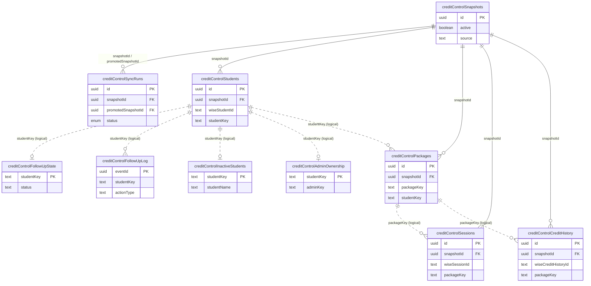

# Database Reference — Credit Control Domain

The Credit Control domain tracks student class packages, credit consumption, and
admin follow-up workflow for chasing low/expired credit balances. It is built on
its **own** snapshot lineage (`creditControlSnapshots`), entirely separate from
the tutor-scheduling `snapshots` table. A sync ingests Wise package/session/credit
data into snapshot-scoped tables, then an active snapshot is promoted atomically.
A second set of tables holds **operational state** (follow-up status, ownership,
inactive flags) that deliberately survives snapshot promotion.

All 10 tables documented here are defined in `src/lib/db/schema.ts` lines 447–610.
For the complete column-by-column listing (types, defaults, indexes) see
[index.md](./index.md).

## Entity Relationship Diagram

Each entity shows only its primary key, foreign keys, and 1–2 identifying columns
for legibility. `studentKey` / `packageKey` are **derived identity strings**
(see "Key model" below), not database foreign keys; the dashed relationships mark
those logical joins.

## Key model

Two text "keys" thread through this domain and explain why the operational tables
have no SQL foreign keys:

- **`studentKey`** — `normalize(studentName) :: normalize(parentName)`, joined with
  `::` (`buildDashboardStudentKey`, `src/lib/credit-control/helpers.ts:17-22`).
  A stable identity for a student derived from display names, used to correlate
  rows across snapshots and against the snapshot-agnostic operational tables.
- **`packageKey`** — `studentName|||packageName`
  (`buildStudentPackageKey`, `src/lib/credit-control/helpers.ts:105-107`). Groups
  packages, sessions, and credit-history rows for the same student package.

The operational tables (`creditControlFollowUpState`, `creditControlFollowUpLog`,
`creditControlInactiveStudents`, `creditControlAdminOwnership`) are keyed solely by
`studentKey` and carry **no `snapshotId`**, so admin follow-up decisions persist
when a new snapshot is promoted.

## Tables

### `creditControlSnapshots` (schema.ts 447–458)

Grain: one row per Credit Control snapshot (a versioned point-in-time ingest of
Wise package/credit data). PK `id` (uuid). `active` boolean marks the single
promoted snapshot consumed by the dashboard; `ccs_active_idx` indexes it
(schema.ts:455). `source` defaults to `"wise"`. This is the root of the domain —
every snapshot-scoped table references it via `snapshotId`. Distinct from the
tutor-scheduling `snapshots` table.

### `creditControlSyncRuns` (schema.ts 459–478)

Grain: one row per Credit Control sync attempt. PK `id` (uuid). Status uses the
shared `syncStatusEnum` (`running` / `success` / `failed`, schema.ts:19-23). Has
**two** FKs into `creditControlSnapshots`: `snapshotId` (the snapshot being
written) and `promotedSnapshotId` (the snapshot that became active on success),
both nullable (schema.ts:464-465). Carries roll-up counts (`studentCount`,
`packageCount`, `sessionCount`) and an `errorSummary`. A partial unique index
`ccsr_single_running_idx` enforces single-flight by allowing only one row WHERE
`status = 'running'` (schema.ts:474-476).

### `creditControlStudents` (schema.ts 479–493)

Grain: one row per student within a snapshot. PK `id` (uuid); FK `snapshotId ->
creditControlSnapshots.id` (schema.ts:481). Holds `wiseStudentId`, the derived
`studentKey`, display names, optional `email`, and an `activated` flag. Unique per
`(snapshotId, wiseStudentId)` (`cc_students_snapshot_wise_idx`, schema.ts:490);
also indexed by `(snapshotId, studentKey)` for dashboard joins.

### `creditControlPackages` (schema.ts 494–518)

Grain: one row per student package within a snapshot (a Wise class the student is
enrolled in). PK `id` (uuid); FK `snapshotId -> creditControlSnapshots.id`
(schema.ts:496). Carries `wiseStudentId`, `wiseClassId`, derived `studentKey` and
`packageKey`, plus the credit ledger as `doublePrecision`: `totalCredits`,
`consumedCredits`, `remainingCredits`, `availableCredits`, `bookedSessions`. An
`excludedReason` can flag a package out of scope. Unique per
`(snapshotId, wiseClassId, wiseStudentId)` (`cc_packages_snapshot_pair_idx`,
schema.ts:514); indexed by `packageKey` and `studentKey`. Joins logically to
sessions and credit history via `packageKey`.

### `creditControlSessions` (schema.ts 519–544)

Grain: one row per (session, student) pair within a snapshot. PK `id` (uuid); FK
`snapshotId -> creditControlSnapshots.id` (schema.ts:521). Identified by
`wiseSessionId` + `wiseStudentId`, linked to its package by `wiseClassId` and the
derived `packageKey`. Captures scheduling (`scheduledStartTime`,
`scheduledEndTime`, `durationMinutes`), `meetingStatus`, a `sessionKind`
classification, optional `teacherFeedback`, and `creditApplied` (doublePrecision).
Unique per `(snapshotId, wiseSessionId, wiseStudentId)`
(`cc_sessions_snapshot_session_student_idx`, schema.ts:539); additionally indexed
by `sessionKind`, `packageKey`, and `scheduledStartTime`.

### `creditControlCreditHistory` (schema.ts 545–563)

Grain: one row per Wise credit-history entry within a snapshot (a credit
debit/grant event). PK `id` (uuid); FK `snapshotId ->
creditControlSnapshots.id` (schema.ts:547). Keyed by `wiseCreditHistoryId` and
linked via `wiseStudentId`, `wiseClassId`, and derived `packageKey`. Stores the
`credit` delta (doublePrecision), `type`, `meetingStatus`, `durationMinutes`, the
original Wise timestamp `createdAtWise`, and the full `raw` JSON payload. Unique
per `(snapshotId, wiseCreditHistoryId, wiseStudentId, wiseClassId)`
(`cc_history_snapshot_history_idx`, schema.ts:560); indexed by `packageKey`.

### `creditControlFollowUpState` (schema.ts 564–575)

Grain: one row per student follow-up status — current state of the collections
workflow. **PK is `studentKey`** (text, schema.ts:565), not a uuid, and there is
no `snapshotId`: the row persists across snapshot promotions. Stores denormalized
`studentName`/`parentName`, the workflow `status`, and audit fields `updatedAt`,
`updatedByEmail`, `updatedByName`. Indexed by `updatedAt`. Joins to snapshot data
logically via `studentKey`.

### `creditControlFollowUpLog` (schema.ts 576–590)

Grain: one row per follow-up action event — the append-only history behind
`creditControlFollowUpState`. PK `eventId` (uuid, schema.ts:577). Keyed to a
student by `studentKey` (no FK; snapshot-agnostic). Records `actionType`,
optional resulting `status`, `createdAt`, and actor identity
(`actorEmail`, `actorName`). Indexed by `(studentKey, createdAt)` and `createdAt`
for per-student timelines and recent-activity views.

### `creditControlInactiveStudents` (schema.ts 591–598)

Grain: one row per student manually flagged inactive (suppressed from follow-up).
**PK is `studentKey`** (text, schema.ts:592); snapshot-agnostic. Holds
denormalized `studentName`/`parentName` and audit fields `markedAt`,
`markedByEmail`. The only table here with no secondary index.

### `creditControlAdminOwnership` (schema.ts 599–610)

Grain: one row per student, recording which admin owns their follow-up. **PK is
`studentKey`** (text, schema.ts:600); snapshot-agnostic. Maps `studentKey ->
adminKey` with audit fields `assignedAt`, `assignedByEmail`, `updatedAt`. Indexed
by `adminKey` (`cc_admin_ownership_admin_idx`, schema.ts:606) for "students owned
by admin X" lookups.

_Verified against HEAD + uncommitted WIP on 2026-05-31._
