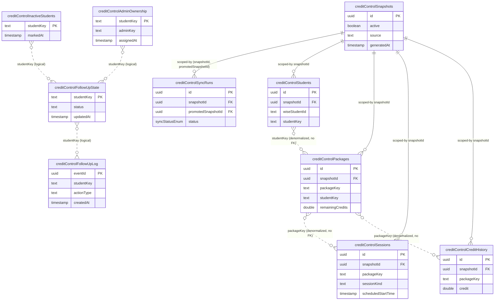

# Database Reference — Credit Control

Status: **stable**

Mechanical reference for the 10 Credit Control tables in `src/lib/db/schema.ts` (lines 505–668). This page owns the ER shape and per-table grain; for the full column-by-column inventory (SQL name, Drizzle export, types) see the canonical [database index](index.md). For purpose, rules, and flows see [features/credit-control](../../features/credit-control.md).

Credit Control runs a **separate snapshot lineage** from the core Wise tutor snapshot: it has its own `credit_control_snapshots` + `credit_control_sync_runs` pair and its own atomic `active`-promotion model, mirroring the core sync discipline rather than reusing the core snapshot. The five snapshot-scoped data tables (`students`, `packages`, `sessions`, `credit_history`) all FK to `credit_control_snapshots.id`. Four human-owned sidecar tables (`follow_up_state`, `follow_up_log`, `inactive_students`, `admin_ownership`) are **snapshot-independent** — they survive snapshot rotation and are keyed by the stable `studentKey` (not by snapshot or Wise id).

## ER Diagram

> Only `snapshotId` / `promotedSnapshotId` are real `references()` foreign keys (to `credit_control_snapshots.id`, schema.ts:522–523, 539, 554, 579, 605). Every `studentKey`, `packageKey`, and `wise*Id` join is a **denormalized string key with no FK constraint** — drawn dashed above. The four sidecar tables share `studentKey` only by convention; there is no DB-level referential link between them or to the snapshot-scoped student rows.

## Tables

### `creditControlSnapshots` (schema.ts:505–516)
**Grain:** one row per Credit Control sync snapshot (an immutable point-in-time pull of student/package/session/credit data). PK `id` (uuid). `active` (default `false`) marks the single live snapshot read by the UI; `source` defaults to `"wise"`; `generatedAt` and `metadata` (jsonb) capture provenance. Indexed on `active` (`ccs_active_idx`) and `generatedAt` (`ccs_generated_at_idx`). Parent of all four snapshot-scoped data tables and the target of the sync-run FKs.

### `creditControlSyncRuns` (schema.ts:517–536)
**Grain:** one row per Credit Control sync attempt. PK `id`. `status` is the shared `syncStatusEnum` (default `"running"`). Two nullable self-domain FKs to `creditControlSnapshots.id`: `snapshotId` (the candidate being built, line 522) and `promotedSnapshotId` (the snapshot promoted to `active` on success, line 523). Carries denormalized counters `studentCount`/`packageCount`/`sessionCount`, an `errorSummary`, and `metadata`. A **partial unique index** `ccsr_single_running_idx` on `status WHERE status = 'running'` (lines 532–534) enforces the single-flight guard — at most one running sync at a time. Also indexed on `status` and `startedAt`.

### `creditControlStudents` (schema.ts:537–551)
**Grain:** one row per student per snapshot. PK `id`; FK `snapshotId` → `creditControlSnapshots.id`. Identity columns: `wiseStudentId` (Wise source id), `studentKey` (the stable cross-snapshot key also used by the sidecar tables), `studentName`, `parentName`, optional `email`, and `activated`. Unique on `(snapshotId, wiseStudentId)` (`cc_students_snapshot_wise_idx`); indexed on `(snapshotId, studentKey)` for key lookups. Joins to packages/sessions logically via `studentKey` (no FK).

### `creditControlPackages` (schema.ts:552–576)
**Grain:** one row per student–class package per snapshot (a purchased credit package for a student in a Wise class). PK `id`; FK `snapshotId`. Source ids `wiseStudentId` + `wiseClassId`; logical keys `studentKey` and `packageKey`. Descriptive: `studentName`, `parentName`, `packageName`, `subject`, `classType`. The credit-depletion numbers live here as `doublePrecision`: `totalCredits`, `consumedCredits`, `remainingCredits`, `availableCredits`, `bookedSessions`, plus `excludedReason` (set when a package is filtered out of the at-risk projection). Unique on `(snapshotId, wiseClassId, wiseStudentId)` (`cc_packages_snapshot_pair_idx`); indexed on `(snapshotId, packageKey)` and `(snapshotId, studentKey)`.

### `creditControlSessions` (schema.ts:577–602)
**Grain:** one row per Wise session per student per snapshot (the booked/held sessions that consume package credit). PK `id`; FK `snapshotId`. Source ids `wiseSessionId` + `wiseClassId` + `wiseStudentId`; logical `studentKey` + `packageKey`. Scheduling fields `scheduledStartTime` (NOT NULL), nullable `scheduledEndTime`, `durationMinutes`; classification `meetingStatus` + `sessionKind`; plus `teacherFeedback` and `creditApplied` (`doublePrecision`). Unique on `(snapshotId, wiseSessionId, wiseStudentId)` (`cc_sessions_snapshot_session_student_idx`); indexed on `sessionKind`, `packageKey`, and `scheduledStartTime` (all snapshot-scoped). Joins to packages logically via `packageKey`.

### `creditControlCreditHistory` (schema.ts:603–621)
**Grain:** one row per Wise credit-history ledger entry per snapshot (per student × class). PK `id`; FK `snapshotId`. Source id `wiseCreditHistoryId` plus `wiseStudentId` + `wiseClassId`; logical `packageKey`. `credit` (`doublePrecision`, signed ledger delta), nullable `type` and `meetingStatus`, `durationMinutes`, the Wise-side `createdAtWise` timestamp, and the full `raw` Wise payload as jsonb. Unique on `(snapshotId, wiseCreditHistoryId, wiseStudentId, wiseClassId)` (`cc_history_snapshot_history_idx`); indexed on `(snapshotId, packageKey)`. Joins to packages logically via `packageKey`.

### `creditControlFollowUpState` (schema.ts:622–633)
**Grain:** one row per student (current follow-up state). **Snapshot-independent** — PK is `studentKey` itself (not a uuid, not snapshot-scoped), so a student carries a single live state across snapshot rotations. Holds `studentName`, `parentName`, the free-text `status`, and an audit trio `updatedAt` / `updatedByEmail` / `updatedByName`. Indexed on `updatedAt` (`cc_follow_up_state_updated_at_idx`). The mutable "where this follow-up stands now" record, distinct from the append-only log below.

### `creditControlFollowUpLog` (schema.ts:634–648)
**Grain:** one row per follow-up action event (append-only audit trail). **Snapshot-independent.** PK `eventId` (uuid). Keyed by `studentKey` (no FK); records `studentName`, `parentName`, `actionType`, nullable `status`, `createdAt`, and actor `actorEmail` / `actorName`. Indexed on `(studentKey, createdAt)` (`cc_follow_up_log_student_created_idx`) for per-student history and on `createdAt` (`cc_follow_up_log_created_idx`) for a global feed. Pairs with `creditControlFollowUpState` (current state vs. history).

### `creditControlInactiveStudents` (schema.ts:649–656)
**Grain:** one row per student manually flagged inactive. **Snapshot-independent.** PK `studentKey`; carries `studentName`, `parentName`, `markedAt`, and `markedByEmail`. No secondary indexes. Suppresses a student from the at-risk follow-up queue regardless of snapshot.

### `creditControlAdminOwnership` (schema.ts:657–668)
**Grain:** one row per student → owning admin assignment. **Snapshot-independent.** PK `studentKey` (so a student has at most one current owner); `adminKey` is the assigned admin, with audit fields `assignedAt`, `assignedByEmail`, and `updatedAt`. Indexed on `adminKey` (`cc_admin_ownership_admin_idx`) to list a given admin's students.

_Verified against HEAD `d4fe6d3` on 2026-06-05._
