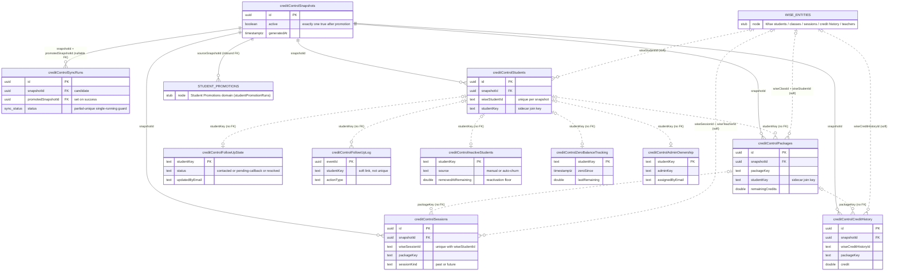

# Database Reference — Credit Control (ER Diagram)

Scope: the 11 tables that back the Credit Control feature. The domain runs its **own** snapshot lineage (`credit_control_snapshots`), entirely separate from the core Wise scheduling `snapshots` table: a sync run pulls students, class↔student package pairs, past + future sessions, and per-pair credit history from Wise into a fresh inactive snapshot, then promotes it with one table-wide `UPDATE` (`src/lib/credit-control/sync.ts:700-702`). Beside that immutable snapshot data sits a set of **snapshot-independent sidecar tables** keyed by a derived `studentKey` string — follow-up status, an append-only action log, inactive/churn state, zero-balance tracking, and admin ownership — which deliberately survive snapshot rotation.

Full column-by-column detail (types, defaults, every index) lives in [`./index.md`](./index.md); this page covers grain, keys, and relationships only. For purpose, business rules, and flows see [`../../features/credit-control.md`](../../features/credit-control.md).

## Scope

Exactly 11 tables (Drizzle export — Postgres table — `src/lib/db/schema.ts` line range):

| Table (var) | Postgres table | Lines | Snapshot-scoped? |
|---|---|---|---|
| `creditControlSnapshots` | `credit_control_snapshots` | 1150–1161 | is the lineage root |
| `creditControlSyncRuns` | `credit_control_sync_runs` | 1162–1181 | no (FK to snapshot, nullable) |
| `creditControlStudents` | `credit_control_students` | 1182–1196 | yes |
| `creditControlPackages` | `credit_control_packages` | 1197–1221 | yes |
| `creditControlSessions` | `credit_control_sessions` | 1222–1260 | yes |
| `creditControlCreditHistory` | `credit_control_credit_history` | 1261–1279 | yes |
| `creditControlFollowUpState` | `credit_control_follow_up_state` | 1280–1291 | no (sidecar) |
| `creditControlFollowUpLog` | `credit_control_follow_up_log` | 1292–1306 | no (sidecar) |
| `creditControlInactiveStudents` | `credit_control_inactive_students` | 1307–1321 | no (sidecar) |
| `creditControlZeroBalanceTracking` | `credit_control_zero_balance_tracking` | 1322–1330 | no (sidecar) |
| `creditControlAdminOwnership` | `credit_control_admin_ownership` | 1331–1342 | no (sidecar) |

## Relationship model

**Enforced foreign keys.** `creditControlSnapshots.id` is the only FK target in the domain. Every `.references(...)` call pointing at a credit-control table in the whole schema is:

- `creditControlSyncRuns.snapshotId` and `.promotedSnapshotId` — both nullable (`schema.ts:1167-1168`)
- `creditControlStudents.snapshotId`, `creditControlPackages.snapshotId`, `creditControlSessions.snapshotId`, `creditControlCreditHistory.snapshotId` — all `notNull` (`schema.ts:1184`, `1199`, `1224`, `1263`)
- `studentPromotionRuns.sourceSnapshotId` — the one **inbound cross-domain** FK, pinning a promotion run to the credit-control snapshot it was generated from (`schema.ts:1347`; see [`./erd-student-promotions.md`](./erd-student-promotions.md))

**Soft keys, no FK.** The five sidecar tables carry no `snapshotId` and declare no `.references(...)`. They join to snapshot rows purely on `studentKey`, a *derived* string rather than a Wise id: `buildDashboardStudentKey()` lowercases and whitespace-collapses the student and parent names and joins them with `::`, falling back to `unknown-student` / `missing-parent` (`src/lib/credit-control/helpers.ts:17-22`). Packages, sessions, and credit history additionally carry `packageKey`, built as `` `${studentName}|||${packageName}` `` (`src/lib/credit-control/helpers.ts:105-107`). Both derivations are re-exported as `fallbackStudentKey` / `fallbackPackageKey` for consumers (`src/lib/credit-control/db.ts:326-332`).

There are **no** FKs from this domain to the core scheduling tables (`snapshots`, `tutors`, `tutorIdentityGroups`). Links to Wise live as loose strings — `wiseStudentId`, `wiseClassId`, `wiseSessionId`, `wiseCreditHistoryId`, `wiseTeacherUserId` / `wiseTeacherId` — shown below as a single `WISE_ENTITIES` stub node.

## ER diagram

```mermaid
erDiagram
    creditControlSnapshots {
        uuid id PK
        boolean active "exactly one true after promotion"
        timestamptz generatedAt
    }
    creditControlSyncRuns {
        uuid id PK
        uuid snapshotId FK "candidate"
        uuid promotedSnapshotId FK "set on success"
        sync_status status "partial-unique single-running guard"
    }
    creditControlStudents {
        uuid id PK
        uuid snapshotId FK
        text wiseStudentId "unique per snapshot"
        text studentKey "sidecar join key"
    }
    creditControlPackages {
        uuid id PK
        uuid snapshotId FK
        text packageKey
        text studentKey "sidecar join key"
        double remainingCredits
    }
    creditControlSessions {
        uuid id PK
        uuid snapshotId FK
        text wiseSessionId "unique with wiseStudentId"
        text packageKey
        text sessionKind "past or future"
    }
    creditControlCreditHistory {
        uuid id PK
        uuid snapshotId FK
        text wiseCreditHistoryId
        text packageKey
        double credit
    }
    creditControlFollowUpState {
        text studentKey PK
        text status "contacted or pending-callback or resolved"
        text updatedByEmail
    }
    creditControlFollowUpLog {
        uuid eventId PK
        text studentKey "soft link, not unique"
        text actionType
    }
    creditControlInactiveStudents {
        text studentKey PK
        text source "manual or auto-churn"
        double removedAtRemaining "reactivation floor"
    }
    creditControlZeroBalanceTracking {
        text studentKey PK
        timestamptz zeroSince
        double lastRemaining
    }
    creditControlAdminOwnership {
        text studentKey PK
        text adminKey
        text assignedByEmail
    }
    WISE_ENTITIES {
        stub node "Wise students / classes / sessions / credit history / teachers"
    }
    STUDENT_PROMOTIONS {
        stub node "Student Promotions domain (studentPromotionRuns)"
    }

    creditControlSnapshots ||--o{ creditControlSyncRuns : "snapshotId + promotedSnapshotId (nullable FK)"
    creditControlSnapshots ||--o{ creditControlStudents : "snapshotId"
    creditControlSnapshots ||--o{ creditControlPackages : "snapshotId"
    creditControlSnapshots ||--o{ creditControlSessions : "snapshotId"
    creditControlSnapshots ||--o{ creditControlCreditHistory : "snapshotId"
    creditControlSnapshots ||--o{ STUDENT_PROMOTIONS : "sourceSnapshotId (inbound FK)"

    creditControlStudents |o..o{ creditControlPackages : "studentKey (no FK)"
    creditControlPackages |o..o{ creditControlSessions : "packageKey (no FK)"
    creditControlPackages |o..o{ creditControlCreditHistory : "packageKey (no FK)"

    creditControlStudents |o..o| creditControlFollowUpState : "studentKey (no FK)"
    creditControlStudents |o..o{ creditControlFollowUpLog : "studentKey (no FK)"
    creditControlStudents |o..o| creditControlInactiveStudents : "studentKey (no FK)"
    creditControlStudents |o..o| creditControlZeroBalanceTracking : "studentKey (no FK)"
    creditControlStudents |o..o| creditControlAdminOwnership : "studentKey (no FK)"

    WISE_ENTITIES |o..o{ creditControlStudents : "wiseStudentId (soft)"
    WISE_ENTITIES |o..o{ creditControlPackages : "wiseClassId + wiseStudentId (soft)"
    WISE_ENTITIES |o..o{ creditControlSessions : "wiseSessionId + wiseTeacherId (soft)"
    WISE_ENTITIES |o..o{ creditControlCreditHistory : "wiseCreditHistoryId (soft)"
```

## Tables

### `creditControlSnapshots` — `credit_control_snapshots`

Source: `src/lib/db/schema.ts:1150-1161`.

Grain: one row per credit-control sync attempt that got as far as writing data — an immutable point-in-time copy of the Wise credit picture. The sync inserts it with `active: false` and a `metadata` object recording the fetch windows and raw counts (`src/lib/credit-control/sync.ts:661-678`), writes all child rows against `snapshot.id`, and only then promotes with a single statement that sets `active` to the boolean expression `id = <new id>` across the whole table (`src/lib/credit-control/sync.ts:700-702`) — so promotion and demotion happen atomically and exactly one row can end up active.

Key columns: `id` (uuid PK, `defaultRandom()`), `active` (boolean, indexed by `ccs_active_idx`), `source` (text, default `"wise"`), `generatedAt` (timestamptz, indexed by `ccs_generated_at_idx`), `metadata` (jsonb).

Relationships: parent of the four snapshot-scoped data tables and of `creditControlSyncRuns`' two nullable snapshot columns; referenced from outside the domain by `studentPromotionRuns.sourceSnapshotId` (`schema.ts:1347`). Readers resolve the current lineage head with `active = true` ordered by `generatedAt desc` (`src/lib/credit-control/db.ts:74-86`).

### `creditControlSyncRuns` — `credit_control_sync_runs`

Source: `src/lib/db/schema.ts:1162-1181`.

Grain: one row per sync invocation, including invocations that never produced a snapshot. Inserted `status: "running"` at the top of `runCreditControlSync` (`src/lib/credit-control/sync.ts:641-646`), updated with `snapshotId` as soon as the candidate exists (680-683), then finalized either to `success` with `promotedSnapshotId` plus the three row counts (711-726) or to `failed` with `errorSummary` and an error merged into `metadata` via a jsonb `||` concat (740-748).

Key columns: `id` (uuid PK); `status` (`sync_status` pgEnum — `running` / `success` / `failed`, `schema.ts:21-25`); `startedAt` / `finishedAt`; `snapshotId` and `promotedSnapshotId` (nullable FKs — a failed run keeps its candidate `snapshotId` but never a `promotedSnapshotId`); `studentCount` / `packageCount` / `sessionCount`; `errorSummary`; `metadata`.

Concurrency: `ccsr_single_running_idx` is a **partial** unique index — `uniqueIndex(...).on(status).where(status = 'running')` (`schema.ts:1177-1179`) — so the database itself permits at most one running row. The cron/manual entry point leans on that: it first fails any run still `running` past 20 minutes (`STALE_RUNNING_CREDIT_CONTROL_SYNC_MS`, `src/lib/credit-control/run-sync-request.ts:9-66`), then treats Postgres unique violation `23505` as "already running" rather than an error (`run-sync-request.ts:39-46`). The route is `/api/internal/sync-credit-control` (`vercel.json:16`); see [`../crons.md`](../crons.md).

Relationships: two nullable FKs to `creditControlSnapshots`. Also read cross-domain by the Data Health dashboard (`src/lib/data-health/dashboard.ts:774`).

### `creditControlStudents` — `credit_control_students`

Source: `src/lib/db/schema.ts:1182-1196`.

Grain: one row per Wise student per snapshot. Built directly from the Wise student list; `parentName` is the first parent with a non-empty name, else `""` (`src/lib/credit-control/sync.ts:237-239`, `305-321`).

Key columns: `id` (uuid PK); `snapshotId` (FK, notNull); `wiseStudentId` (Wise id, unique within a snapshot via `cc_students_snapshot_wise_idx`); `studentKey` (derived sidecar join key, indexed with the snapshot via `cc_students_snapshot_key_idx`); `studentName`, `parentName`, `email` (nullable), `activated`.

Relationships: child of `creditControlSnapshots`. Joins to packages/sessions/credit-history by `wiseStudentId` or `studentKey` and to all five sidecar tables by `studentKey` — none of it FK-enforced. This table is also what the admin-ownership seeder walks to translate spreadsheet student names into `studentKey` values (`src/lib/credit-control/admin-ownership-seed.ts:41-77`).

### `creditControlPackages` — `credit_control_packages`

Source: `src/lib/db/schema.ts:1197-1221`.

Grain: one row per **(class, student) pair** per snapshot — a student's enrolment in one Wise class, which the feature calls a package. Rows come from `fetchPairCredits` results, so a pair whose Wise credit fetch failed is simply absent (the failure count lands in the sync run's `metadata`, `sync.ts:351-370`, `674`).

Key columns: `id` (uuid PK); `snapshotId` (FK); `wiseClassId` + `wiseStudentId` (unique together per snapshot via `cc_packages_snapshot_pair_idx`); `studentKey` and `packageKey` (derived join keys, each indexed with the snapshot); the credit measures `totalCredits` / `consumedCredits` / `remainingCredits` / `availableCredits` / `bookedSessions` (all `double precision`); `excludedReason` — nullable, set to the first matched keyword when the package name or subject looks like a non-billable product, otherwise `null` (`sync.ts:241-244`, `346`).

Relationships: child of `creditControlSnapshots`; the credit source of truth for the dashboard and for churn — `applyChurnMaintenance` aggregates remaining credits per `studentKey` straight from the just-written package rows (`sync.ts:504-517`). Read cross-domain by LINE student-link resolution (`src/lib/line/student-links.ts:209-289`), Student Promotions (`src/lib/student-promotions/data.ts:710-719`), and Wise Activity package reconciliation (`src/lib/wise-activity/reconciliation.ts:896-988`).

### `creditControlSessions` — `credit_control_sessions`

Source: `src/lib/db/schema.ts:1222-1260`.

Grain: one row per **(Wise session, student)** pair per snapshot — a class session fans out into one row per enrolled student that matched a known package pair; unmatched students are skipped and duplicates are suppressed by an in-memory `sessionId|studentId` seen-set (`src/lib/credit-control/sync.ts:428-464`). Covers both directions of the fetch window: `sessionKind` is the literal `"past"` or `"future"` (`sync.ts:466-467`), with the windows currently 120 days back and 180 days forward (`sync.ts:60-61`, `650-651`).

Key columns: `id` (uuid PK); `snapshotId` (FK); `wiseSessionId` + `wiseStudentId` (unique together per snapshot, `cc_sessions_snapshot_session_student_idx`); `wiseClassId`; `studentKey` / `packageKey`; `scheduledStartTime` (notNull, indexed with the snapshot) and `scheduledEndTime`; `durationMinutes`; `meetingStatus` (upper-cased at write time, `sync.ts:452`); `sessionKind` (indexed with the snapshot); `teacherFeedback` (fetched only for `ENDED` past sessions with no positive credit already applied, else `""`/`null`, `sync.ts:406-424`, `457`); `creditApplied` (positive credit matched from the pair's credit history, past sessions only, `sync.ts:458-460`); and the nullable teaching identity `wiseTeacherUserId` / `wiseTeacherId` / `teacherName` — deliberately nullable so an unresolved teacher renders "Teacher TBC" rather than being guessed (schema comment, `schema.ts:1240-1245`).

Indexing note: the schema carries an explicit decision comment against adding a `(snapshot_id, student_key, scheduled_start_time)` index — measured at 67.8M rows / 39GB across 3,367 retained snapshots, `cc_sessions_start_idx` already narrows to the active snapshot's ~22.8k rows and the month query runs in 12.9ms, while building another index would hold a SHARE lock that blocks the sync (`schema.ts:1252-1258`). Preserve that comment when editing nearby.

Relationships: child of `creditControlSnapshots`; soft-joined to packages by `packageKey` and to students by `studentKey`. It is the most widely reused table in the repo — the student monthly schedule (`src/lib/student-schedule/data.ts:199-218`), progress tests (`src/lib/progress-tests/db.ts:78-149`, `483-493`), post-class feedback (`src/lib/post-class-feedback/repository.ts:1527-1537`), LINE operational lookups (`src/lib/line/operational.ts:360-394`), and leave-request impact analysis (`src/lib/leave-requests/data.ts:348-378`) all read it.

### `creditControlCreditHistory` — `credit_control_credit_history`

Source: `src/lib/db/schema.ts:1261-1279`.

Grain: one row per Wise credit-history entry per (class, student) pair per snapshot — the ledger behind a package's consumed/remaining numbers. Written from each pair's `sessionCreditHistory` while session rows are being assembled (`src/lib/credit-control/sync.ts:381-404`).

Key columns: `id` (uuid PK); `snapshotId` (FK); the composite uniqueness `snapshotId` + `wiseCreditHistoryId` + `wiseStudentId` + `wiseClassId` (`cc_history_snapshot_history_idx`) — the Wise history id alone is not assumed unique across pairs; `packageKey` (indexed with the snapshot); `credit` (double precision, coerced with `Number(...) || 0`); `type`, `meetingStatus`, `durationMinutes`, `createdAtWise` (all nullable / defaulted); `raw` — the full Wise entry preserved as jsonb.

Relationships: child of `creditControlSnapshots`, soft-joined to packages by `packageKey`. Positive-credit entries are also used in-memory during the same sync to decide `creditApplied` and to skip redundant teacher-feedback fetches (`sync.ts:386-389`, `406-415`).

### `creditControlFollowUpState` — `credit_control_follow_up_state`

Source: `src/lib/db/schema.ts:1280-1291`.

Grain: one row per student **currently** carrying a follow-up status — `studentKey` is the primary key, so the table holds present state only, never history. Writes are upserts targeting that PK (`src/lib/credit-control/db.ts:210-225`); clearing deletes the row (`db.ts:231-235`).

Key columns: `studentKey` (text PK); `status` — free-text in SQL but constrained in application code to `contacted` / `pending-callback` / `resolved` (`src/types/credit-control.ts:2`, validated by `normalizeStudentActionStatus`, `src/lib/credit-control/action-helpers.ts:17-23`); `studentName` / `parentName` denormalized so the row is readable without a snapshot join; `updatedAt` (indexed by `cc_follow_up_state_updated_at_idx`); `updatedByEmail` / `updatedByName`.

Relationships: none in SQL. Soft-joined to snapshot rows by `studentKey`. State is auto-cleared when a student no longer has any `notify`/`watch` package, which deletes the row and appends an `auto-clear` log entry (`src/lib/credit-control/service.ts:109-136`).

### `creditControlFollowUpLog` — `credit_control_follow_up_log`

Source: `src/lib/db/schema.ts:1292-1306`.

Grain: one row per follow-up action event — append-only; nothing in the codebase deletes from it. Written by `appendCreditFollowUpLog` (`src/lib/credit-control/db.ts:227-229`) and by the sync's churn pass directly.

Key columns: `eventId` (uuid PK, `defaultRandom()`); `studentKey` (not unique — many events per student); `studentName` / `parentName`; `actionType`; `status` (nullable — automated events log `null`); `createdAt`; `actorEmail` / `actorName`. Two indexes: `cc_follow_up_log_student_created_idx` for the per-student history read (default last 7 days, `db.ts:237-251`) and `cc_follow_up_log_created_idx` for the global feed.

Non-obvious: `actionType` is plain `text`, and its admin-facing union in `FollowUpLogInput` lists only `set` / `clear` / `bulk-set` / `bulk-clear` / `auto-clear` (`src/lib/credit-control/db.ts:41`). The churn pass bypasses that helper and inserts two further values with raw Drizzle — `auto-remove` (`src/lib/credit-control/sync.ts:593-601`) and `auto-reactivate` (`sync.ts:611-619`) — so seven distinct action types exist in the table, under the system actor `system@begifted.local` / `System` (`src/lib/credit-control/config.ts:18-19`).

Relationships: none in SQL; soft-linked to everything else by `studentKey`.

### `creditControlInactiveStudents` — `credit_control_inactive_students`

Source: `src/lib/db/schema.ts:1307-1321`.

Grain: one row per student currently hidden from the worklist — presence in the table *is* the "no longer active" flag, so removal means deleting the row (`src/lib/credit-control/db.ts:284-288`). Upserts target the `studentKey` PK (`db.ts:258-282`).

Key columns: `studentKey` (text PK); `studentName` / `parentName`; `markedAt`; `markedByEmail`; `source` — `"manual"` (admin clicked *No Longer Active*) or `"auto-churn"` (the 45-day zero-credit rule), default `"manual"` (schema comment, `schema.ts:1313-1314`); `removedAtRemaining` (nullable double precision) — the student's total remaining credits at removal, which becomes the **reactivation floor**: churn re-activates only when current total remaining exceeds `max(removedAtRemaining, 0)`, so a genuine top-up is required rather than a rounding wobble (`schema.ts:1315-1316`; `src/lib/credit-control/churn.ts:113-120`).

Relationships: none in SQL. Read and written by the churn pass at sync time (`src/lib/credit-control/sync.ts:526-534`, `571-608`) and surfaced to the UI so hidden students can be listed and restored (`src/lib/credit-control/service.ts:95-104`).

### `creditControlZeroBalanceTracking` — `credit_control_zero_balance_tracking`

Source: `src/lib/db/schema.ts:1322-1330`.

Grain: one row per student who currently holds a continuous ≤ 0 remaining-credit streak — a stopwatch, not a log. Keyed by `studentKey` (PK) so it survives snapshot rotation, and the row is dropped the moment the student recovers above zero (schema comment, `schema.ts:1319-1321`).

Key columns: `studentKey` (text PK); `studentName` / `parentName`; `zeroSince` — the streak start, carried forward on every upsert so it is never reset by a later sync (`src/lib/credit-control/churn.ts:123-141`); `lastRemaining`; `updatedAt`.

Lifecycle: at each sync, `applyChurnMaintenance` upserts streak rows, auto-inactivates students past `CHURN_INACTIVITY_DAYS = 45` (`src/lib/credit-control/config.ts:16`), and deletes tracking rows **last** — deliberately after the inactive-table writes, because Neon HTTP has no transactions and leaving tracking rows intact on a partial failure means a still-qualifying student is re-processed next sync without losing their streak (`src/lib/credit-control/sync.ts:623-631`). The whole churn pass is best-effort: its errors are caught and logged so churn can never roll back an already-promoted snapshot (`sync.ts:704-709`).

Relationships: none in SQL; soft-linked by `studentKey`, and paired with `creditControlInactiveStudents` — a student in the inactive table needs no streak row, so any stale one is cleared (`churn.ts:118-119`).

### `creditControlAdminOwnership` — `credit_control_admin_ownership`

Source: `src/lib/db/schema.ts:1331-1342`.

Grain: one row per student that has an owning admin — `studentKey` is the PK, so ownership is single-valued and reassignment is an upsert on that key (`src/lib/credit-control/db.ts:312-324`).

Key columns: `studentKey` (text PK); `adminKey` — a registry key resolved to a display label in application code, falling back to the raw key when unknown (`db.ts:300-309`); `assignedAt`; `assignedByEmail`; `updatedAt`. `cc_admin_ownership_admin_idx` on `adminKey` supports per-admin filtering.

Relationships: none in SQL. Read in bulk by `studentKey` for the current worklist page (`db.ts:290-310`). Seeding walks the active snapshot's `creditControlStudents` to map spreadsheet student names onto `studentKey`, skipping the sentinel "unassigned" admin (`src/lib/credit-control/admin-ownership-seed.ts:33-77`).

## Retention

Nothing in the codebase deletes snapshot-scoped credit-control rows: the only `delete(schema.creditControl*)` calls in `src/` target `creditControlInactiveStudents` and `creditControlZeroBalanceTracking` (churn, `sync.ts:607`, `629`) and `creditControlFollowUpState` (`db.ts:233`, `286`). There is no pruning job analogous to the core snapshot pruning, which is why the schema comment can cite 3,367 retained snapshots and 67.8M session rows (`schema.ts:1252-1258`).

_Verified against HEAD + uncommitted WIP on 2026-05-31._
