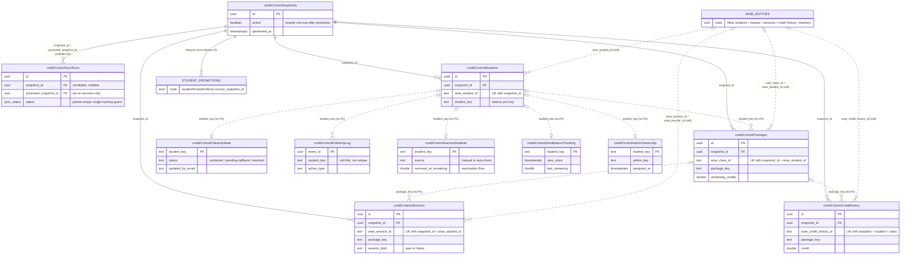

# Database Reference — Credit Control

Status: **stable**.

Schema for the 11 tables behind prepaid-credit depletion tracking. The domain runs its **own snapshot lineage** (`credit_control_snapshots`), completely separate from the core Wise scheduling `snapshots` table: one sync run pulls students, class↔student package pairs, past + future sessions, and per-pair credit history from Wise into a fresh inactive snapshot, then promotes it with a single bounded `UPDATE` (`src/lib/credit-control/sync.ts:707-722`). The cron is `/api/internal/sync-credit-control` at `20,50 * * * *` (`vercel.json:16-18`); see [`../crons.md`](../crons.md).

Beside that immutable snapshot data sits a set of **snapshot-independent sidecar tables** keyed by a derived `student_key` string — follow-up status, an append-only action log, inactive/churn state, zero-balance tracking, and admin ownership. They carry no `snapshot_id` and deliberately survive snapshot rotation.

All 11 tables are defined in `src/lib/db/schema.ts`:

| Table (varName) | SQL name | schema.ts lines | Snapshot-scoped? |
|---|---|---|---|
| `creditControlSnapshots` | `credit_control_snapshots` | 1150–1161 | lineage root |
| `creditControlSyncRuns` | `credit_control_sync_runs` | 1162–1181 | no (two nullable snapshot FKs) |
| `creditControlStudents` | `credit_control_students` | 1182–1196 | yes |
| `creditControlPackages` | `credit_control_packages` | 1197–1221 | yes |
| `creditControlSessions` | `credit_control_sessions` | 1222–1263 | yes |
| `creditControlCreditHistory` | `credit_control_credit_history` | 1264–1282 | yes |
| `creditControlFollowUpState` | `credit_control_follow_up_state` | 1283–1294 | no (sidecar) |
| `creditControlFollowUpLog` | `credit_control_follow_up_log` | 1295–1309 | no (sidecar) |
| `creditControlInactiveStudents` | `credit_control_inactive_students` | 1310–1324 | no (sidecar) |
| `creditControlZeroBalanceTracking` | `credit_control_zero_balance_tracking` | 1325–1333 | no (sidecar) |
| `creditControlAdminOwnership` | `credit_control_admin_ownership` | 1334–1345 | no (sidecar) |

Full column lists live in [index.md](./index.md); enum values live in [enums.md](./enums.md). This page covers grain, keys, and relationships only. For purpose, business rules, and flows see [`../../features/credit-control.md`](../../features/credit-control.md).

## Keys and relationship model

**Enforced foreign keys.** `creditControlSnapshots.id` is the only FK target in the domain. Grepping `references(() => creditControlSnapshots` over the whole schema returns exactly seven sites:

- `creditControlSyncRuns.snapshotId` and `.promotedSnapshotId` — both nullable (`schema.ts:1167-1168`)
- `snapshotId` on students, packages, sessions, credit history — all `notNull` (`schema.ts:1184`, `1199`, `1224`, `1266`)
- `studentPromotionRuns.sourceSnapshotId` — the one **inbound cross-domain** FK, pinning a promotion run to the credit-control snapshot it was generated from (`schema.ts:1350`; see [erd-student-promotions.md](./erd-student-promotions.md))

**Soft keys, no FK.** The five sidecar tables declare no `.references(...)` and join to snapshot rows purely on `student_key` — a *derived* string, not a Wise id. `buildDashboardStudentKey()` lowercases and whitespace-collapses the student and parent names and joins them with `::`, falling back to `unknown-student` / `missing-parent` (`src/lib/credit-control/helpers.ts:17-22`). Packages, sessions, and credit history additionally carry `package_key`, built as `` `${studentName}|||${packageName}` `` (`helpers.ts:105-107`). Both derivations are re-exported as `fallbackStudentKey` / `fallbackPackageKey` for consumers (`src/lib/credit-control/db.ts:326-332`).

There are **no** FKs from this domain to the core scheduling tables (`snapshots`, `tutors`, `tutor_identity_groups`). Links to Wise live as loose strings — `wise_student_id`, `wise_class_id`, `wise_session_id`, `wise_credit_history_id`, `wise_teacher_user_id` / `wise_teacher_id` — shown below as one `WISE_ENTITIES` stub node.

## ER Diagram

```mermaid
erDiagram
    creditControlSnapshots {
        uuid id PK
        boolean active "exactly one true after promotion"
        timestamptz generated_at
    }
    creditControlSyncRuns {
        uuid id PK
        uuid snapshot_id FK "candidate, nullable"
        uuid promoted_snapshot_id FK "set on success only"
        sync_status status "partial-unique single-running guard"
    }
    creditControlStudents {
        uuid id PK
        uuid snapshot_id FK
        text wise_student_id "UK with snapshot_id"
        text student_key "sidecar join key"
    }
    creditControlPackages {
        uuid id PK
        uuid snapshot_id FK
        text wise_class_id "UK with snapshot_id + wise_student_id"
        text package_key
        double remaining_credits
    }
    creditControlSessions {
        uuid id PK
        uuid snapshot_id FK
        text wise_session_id "UK with snapshot_id + wise_student_id"
        text package_key
        text session_kind "past or future"
    }
    creditControlCreditHistory {
        uuid id PK
        uuid snapshot_id FK
        text wise_credit_history_id "UK with snapshot + student + class"
        text package_key
        double credit
    }
    creditControlFollowUpState {
        text student_key PK
        text status "contacted / pending-callback / resolved"
        text updated_by_email
    }
    creditControlFollowUpLog {
        uuid event_id PK
        text student_key "soft link, not unique"
        text action_type
    }
    creditControlInactiveStudents {
        text student_key PK
        text source "manual or auto-churn"
        double removed_at_remaining "reactivation floor"
    }
    creditControlZeroBalanceTracking {
        text student_key PK
        timestamptz zero_since
        double last_remaining
    }
    creditControlAdminOwnership {
        text student_key PK
        text admin_key
        timestamptz assigned_at
    }
    WISE_ENTITIES {
        stub node "Wise students / classes / sessions / credit history / teachers"
    }
    STUDENT_PROMOTIONS {
        stub node "studentPromotionRuns.source_snapshot_id"
    }

    creditControlSnapshots ||--o{ creditControlSyncRuns : "snapshot_id + promoted_snapshot_id (nullable FK)"
    creditControlSnapshots ||--o{ creditControlStudents : "snapshot_id"
    creditControlSnapshots ||--o{ creditControlPackages : "snapshot_id"
    creditControlSnapshots ||--o{ creditControlSessions : "snapshot_id"
    creditControlSnapshots ||--o{ creditControlCreditHistory : "snapshot_id"
    creditControlSnapshots ||--o{ STUDENT_PROMOTIONS : "inbound cross-domain FK"

    creditControlStudents |o..o{ creditControlPackages : "student_key (no FK)"
    creditControlPackages |o..o{ creditControlSessions : "package_key (no FK)"
    creditControlPackages |o..o{ creditControlCreditHistory : "package_key (no FK)"

    creditControlStudents |o..o| creditControlFollowUpState : "student_key (no FK)"
    creditControlStudents |o..o{ creditControlFollowUpLog : "student_key (no FK)"
    creditControlStudents |o..o| creditControlInactiveStudents : "student_key (no FK)"
    creditControlStudents |o..o| creditControlZeroBalanceTracking : "student_key (no FK)"
    creditControlStudents |o..o| creditControlAdminOwnership : "student_key (no FK)"

    WISE_ENTITIES |o..o{ creditControlStudents : "wise_student_id (soft)"
    WISE_ENTITIES |o..o{ creditControlPackages : "wise_class_id + wise_student_id (soft)"
    WISE_ENTITIES |o..o{ creditControlSessions : "wise_session_id + wise_teacher_id (soft)"
    WISE_ENTITIES |o..o{ creditControlCreditHistory : "wise_credit_history_id (soft)"
```

## Tables

### `creditControlSnapshots` — `credit_control_snapshots`

`schema.ts:1150-1161`. **Grain:** one row per sync attempt that got as far as writing data — an immutable point-in-time copy of the Wise credit picture.

The sync inserts it `active: false` with a `metadata` object recording the fetch windows and raw counts (`sync.ts:668-685`), writes all child rows against `snapshot.id`, and only then promotes. Promotion is a **single bounded `UPDATE`** that sets `active` to the SQL boolean expression `id = <candidate>` restricted by `WHERE active = true OR id = <candidate>` — one statement, so concurrent readers see either the prior-active row or the new one and never a moment with zero matches, and the rewrite touches only two rows instead of the whole table (decision **REL-01**, `sync.ts:707-722`). Preserve that comment when editing nearby.

**Key columns:** `id` (uuid PK); `active` (indexed `ccs_active_idx`); `source` (default `"wise"`); `generated_at` (indexed `ccs_generated_at_idx`); `metadata` (jsonb).

**Relationships:** parent of the four snapshot-scoped data tables and of both sync-run snapshot columns; referenced from outside the domain by `studentPromotionRuns.sourceSnapshotId`. Readers resolve the lineage head with `active = true` ordered by `generated_at desc, limit 1` (`db.ts:74-86`) — a pattern replicated verbatim by every cross-domain consumer listed below.

### `creditControlSyncRuns` — `credit_control_sync_runs`

`schema.ts:1162-1181`. **Grain:** one row per sync invocation, including invocations that never produced a snapshot.

Inserted `status: "running"` by the request guard (`run-sync-request.ts:115-120`) or by `runCreditControlSync` itself when no run id is passed (`sync.ts:648-654`); stamped with `snapshot_id` as soon as the candidate exists (`sync.ts:686-689`); finalized either to `success` with `promoted_snapshot_id` plus the three row counts (`sync.ts:731-751`) or to `failed` with `error_summary` and an error merged into `metadata` through a jsonb `||` concat (`sync.ts:764-772`).

**Key columns:** `id` (uuid PK); `status` (`sync_status` pgEnum — `running` / `success` / `failed`, `schema.ts:21-25`); `started_at` / `finished_at`; `snapshot_id` and `promoted_snapshot_id` (nullable FKs — a failed run keeps its candidate `snapshot_id` but never a `promoted_snapshot_id`); `student_count` / `package_count` / `session_count`; `error_summary`; `metadata`.

**Concurrency:** `ccsr_single_running_idx` is a **partial** unique index — `uniqueIndex(...).on(status).where(status = 'running')` (`schema.ts:1177-1179`) — so at most one running row is possible at the database level. The entry point leans on that: it first fails any run still `running` past 20 minutes (`STALE_RUNNING_CREDIT_CONTROL_SYNC_MS`, `run-sync-request.ts:9`, `48-66`), then treats Postgres unique violation `23505` as "already running" and returns HTTP 202 rather than an error (`run-sync-request.ts:39-46`, `125-135`, `146-148`).

**Relationships:** two nullable FKs to `creditControlSnapshots`. Read cross-domain by the Data Health dashboard (`src/lib/data-health/dashboard.ts:774`).

### `creditControlStudents` — `credit_control_students`

`schema.ts:1182-1196`. **Grain:** one row per Wise student per snapshot, built straight from the Wise student list (`sync.ts:311-327`); `parent_name` is the first parent carrying a non-empty name, else `""` (`sync.ts:243-245`).

**Key columns:** `id` (uuid PK); `snapshot_id` (FK, notNull); `wise_student_id` (unique within a snapshot, `cc_students_snapshot_wise_idx`); `student_key` (derived sidecar join key, indexed with the snapshot via `cc_students_snapshot_key_idx`); `student_name`, `parent_name`, `email` (nullable), `activated`.

**Relationships:** child of `creditControlSnapshots`; soft-joined to packages/sessions/credit-history by `wise_student_id` or `student_key`, and to all five sidecars by `student_key`. It is also the table the admin-ownership seeder walks to translate spreadsheet student names into `student_key` values (`src/lib/credit-control/admin-ownership-seed.ts:32-77`), and it is read cross-domain by the LINE credit bot's parent→student resolution (`src/lib/line/credit-bot.ts:173-181`) and by the student report (`src/lib/student-report/db.ts:109-115`).

### `creditControlPackages` — `credit_control_packages`

`schema.ts:1197-1221`. **Grain:** one row per **(class, student) pair** per snapshot — a student's enrolment in one Wise class, which this feature calls a package.

Pairs are collected from two directions: every *activated* student's `classrooms`, plus every student appearing on a past or future session (`sync.ts:261-309`). Each pair's credits are then fetched from Wise concurrently; a pair whose fetch throws is dropped and only counted, so the row is simply absent and the count surfaces as `failedCreditPairs` in both the snapshot and sync-run metadata (`sync.ts:357-376`, `681`, `741`).

**Key columns:** `id` (uuid PK); `snapshot_id` (FK); `wise_class_id` + `wise_student_id` (unique together per snapshot, `cc_packages_snapshot_pair_idx`); `student_key` and `package_key` (derived join keys, each indexed with the snapshot); the credit measures `total_credits` / `consumed_credits` / `remaining_credits` / `available_credits` / `booked_sessions` (all `double precision`); `excluded_reason` — nullable, set to the first `EXCLUDED_PACKAGE_KEYWORDS` hit (`["pretest", "trial"]`, `config.ts:6`) found in the lower-cased package name plus subject, otherwise `null` (`sync.ts:247-250`, `352`).

**Relationships:** child of `creditControlSnapshots`; the credit source of truth for both the dashboard and churn — `applyChurnMaintenance` aggregates remaining credits per `student_key` directly from the just-built package rows, skipping any row with an `excluded_reason` (`sync.ts:511-524`, `churn.ts:56-70`). Read cross-domain by LINE student-link resolution (`src/lib/line/student-links.ts:219`), Student Promotions (`src/lib/student-promotions/data.ts:690-702`), and Wise Activity package reconciliation (`src/lib/wise-activity/reconciliation.ts:881-897`).

### `creditControlSessions` — `credit_control_sessions`

`schema.ts:1222-1263`. **Grain:** one row per **(Wise session, student)** pair per snapshot — a class session fans out into one row per enrolled student that matched a known package pair. Students with no matching pair are skipped and duplicates are suppressed by an in-memory `sessionId|studentId` seen-set (`sync.ts:433-443`). Both fetch directions land here: `session_kind` is the literal `"past"` or `"future"` (`sync.ts:473-474`), with windows of 120 days back and 180 days forward (`PAST_WINDOW_DAYS` / `FUTURE_WINDOW_DAYS`, `sync.ts:61`, `63`, applied at `657-658`).

**Key columns:** `id` (uuid PK); `snapshot_id` (FK); `wise_session_id` + `wise_student_id` (unique together per snapshot, `cc_sessions_snapshot_session_student_idx`); `wise_class_id`; `student_key` / `package_key`; `scheduled_start_time` (notNull, indexed with the snapshot) and `scheduled_end_time`; `duration_minutes`; `meeting_status` (upper-cased at write time, `sync.ts:459`); `session_kind` (indexed with the snapshot); `title` — the raw Wise session title, carrying a schema comment marking it the only field that names the class itself while `subject` holds BeGifted's level bands (`schema.ts:1233-1235`, written at `sync.ts:455`); `teacher_feedback` — fetched only for past sessions whose Wise status is `ENDED` and which have no positive credit already applied, else `""` / `null` for future rows (`sync.ts:412-421`, `464`); `credit_applied` — the positive credit matched from that pair's credit history, past rows only (`sync.ts:465-467`); and the nullable teaching identity `wise_teacher_user_id` / `wise_teacher_id` / `teacher_name`, each trimmed to `null` when empty (`src/lib/credit-control/wise.ts:131-144`) and deliberately nullable so an unresolved teacher renders `TEACHER_TBC` rather than being guessed (schema comment, `schema.ts:1243-1245`).

**Indexing note:** the schema carries an explicit decision comment *against* adding a `(snapshot_id, student_key, scheduled_start_time)` index — measured on production at 67.8M rows / 39GB across 3,367 retained snapshots, `cc_sessions_start_idx` already narrows to the active snapshot's ~22.8k rows and the month query runs in 12.9ms, while building another index would hold a SHARE lock that blocks the credit-control sync for its duration (`schema.ts:1255-1261`). Preserve that comment when editing nearby.

**Relationships:** child of `creditControlSnapshots`; soft-joined to packages by `package_key` and students by `student_key`. This is the most widely reused table in the repo — the student monthly schedule (`src/lib/student-schedule/data.ts:323-333`), progress tests (`src/lib/progress-tests/db.ts:68-79`), post-class feedback (`src/lib/post-class-feedback/repository.ts:1529-1535`), LINE operational lookups (`src/lib/line/operational.ts:360-369`), and leave-request impact analysis (`src/lib/leave-requests/data.ts:340-350`) all read it through the same `active = true` snapshot resolution.

### `creditControlCreditHistory` — `credit_control_credit_history`

`schema.ts:1264-1282`. **Grain:** one row per Wise credit-history entry per (class, student) pair per snapshot — the ledger behind a package's consumed/remaining numbers. Written from each pair's `sessionCreditHistory` while session rows are being assembled (`sync.ts:389-409`).

**Key columns:** `id` (uuid PK); `snapshot_id` (FK); the four-part uniqueness `snapshot_id` + `wise_credit_history_id` + `wise_student_id` + `wise_class_id` (`cc_history_snapshot_history_idx`) — the Wise history id alone is not assumed unique across pairs; `package_key` (indexed with the snapshot); `credit` (double precision, coerced `Number(...) || 0`); `type`, `meeting_status`, `duration_minutes`, `created_at_wise` (nullable / defaulted); `raw` — the full Wise entry preserved as jsonb.

**Relationships:** child of `creditControlSnapshots`, soft-joined to packages by `package_key`. Positive-credit entries are additionally used in-memory during the same sync to set `credit_applied` and to skip redundant teacher-feedback fetches (`sync.ts:392-395`, `412-421`).

### `creditControlFollowUpState` — `credit_control_follow_up_state`

`schema.ts:1283-1294`. **Grain:** one row per student **currently** carrying a follow-up status — `student_key` is the primary key, so the table holds present state only, never history. Writes are upserts on that PK (`db.ts:210-225`); clearing deletes the row (`db.ts:231-235`).

**Key columns:** `student_key` (text PK); `status` — free-text in SQL but constrained in application code to `contacted` / `pending-callback` / `resolved` (`src/types/credit-control.ts:2`, enforced by `normalizeStudentActionStatus`, `src/lib/credit-control/action-helpers.ts:18-23`); `student_name` / `parent_name` denormalized so a row is readable without a snapshot join; `updated_at` (indexed `cc_follow_up_state_updated_at_idx`); `updated_by_email` / `updated_by_name`.

**Relationships:** none in SQL; soft-joined by `student_key`. State is auto-cleared when a student no longer has any `notify` or `watch` package — the row is deleted and an `auto-clear` log entry appended (`src/lib/credit-control/service.ts:108-135`).

### `creditControlFollowUpLog` — `credit_control_follow_up_log`

`schema.ts:1295-1309`. **Grain:** one row per follow-up action event — append-only; nothing in `src/` deletes from it. Written through `appendCreditFollowUpLog` (`db.ts:227-229`) and, for automated events, directly by the churn pass.

**Key columns:** `event_id` (uuid PK); `student_key` (not unique — many events per student); `student_name` / `parent_name`; `action_type`; `status` (nullable — automated events log `null`); `created_at`; `actor_email` / `actor_name`. Two indexes: `cc_follow_up_log_student_created_idx` for the per-student history read (default last 7 days, `db.ts:237-251`) and `cc_follow_up_log_created_idx` for the global feed.

**Non-obvious:** `action_type` is plain `text`, and the admin-facing union in `FollowUpLogInput` lists only `set` / `clear` / `bulk-set` / `bulk-clear` / `auto-clear` (`db.ts:41`). The churn pass bypasses that helper and inserts two further values with raw Drizzle — `auto-remove` (`sync.ts:600-609`) and `auto-reactivate` (`sync.ts:618-627`) — under the synthetic actor `system@begifted.local` / `System` (`config.ts:18-19`). Seven distinct action types therefore exist in the column.

**Relationships:** none in SQL; soft-linked to everything else by `student_key`.

### `creditControlInactiveStudents` — `credit_control_inactive_students`

`schema.ts:1310-1324`. **Grain:** one row per student currently hidden from the worklist — presence in the table *is* the "no longer active" flag, so restoring a student means deleting the row (`db.ts:284-288`). Marking is an upsert on the `student_key` PK (`db.ts:258-282`).

**Key columns:** `student_key` (text PK); `student_name` / `parent_name`; `marked_at`; `marked_by_email`; `source` — `"manual"` (an admin clicked *No Longer Active*) or `"auto-churn"` (the 45-day zero-credit rule), default `"manual"` (schema comment, `schema.ts:1316-1317`); `removed_at_remaining` (nullable double precision) — the student's total remaining credits at removal, which becomes the **reactivation floor**: churn reactivates only when current total remaining exceeds `max(removed_at_remaining, 0)`, so an auto-churned student rejoins on any positive balance while a manually-removed student who still held credits must genuinely rise above that prior balance (`schema.ts:1318-1319`; `churn.ts:113-116`).

**Relationships:** none in SQL. Read and written by the churn pass at sync time (`sync.ts:526-541`, `577-627`) and surfaced to the UI so hidden students can be listed and restored (`service.ts:95-104`).

### `creditControlZeroBalanceTracking` — `credit_control_zero_balance_tracking`

`schema.ts:1325-1333`. **Grain:** one row per student who currently holds a continuous ≤ 0 remaining-credit streak — a stopwatch, not a log. Keyed by `student_key` (PK) so it survives snapshot rotation, and the row is dropped the moment the student recovers above zero (schema comment, `schema.ts:1322-1324`).

**Key columns:** `student_key` (text PK); `student_name` / `parent_name`; `zero_since` — the streak start, carried forward on every upsert (`tracked?.zeroSince ?? now`, `churn.ts:124`) so a later sync never resets it; `last_remaining`; `updated_at`.

**Lifecycle:** at each sync `applyChurnMaintenance` upserts streak rows, auto-inactivates students past `CHURN_INACTIVITY_DAYS = 45` (`config.ts:16`, compared at `churn.ts:100`, `125`), and deletes tracking rows **last** — deliberately after the inactive-table writes, because Neon HTTP has no transactions and leaving tracking rows intact on a partial failure means a still-qualifying student is re-processed next sync without losing their streak (`sync.ts:630-639`). The whole churn pass is best-effort: its errors are caught and logged so churn can never roll back an already-promoted snapshot (`sync.ts:723-728`).

**Relationships:** none in SQL; soft-linked by `student_key` and paired with `creditControlInactiveStudents` — an already-inactive student needs no streak row, so any stale one is cleared (`churn.ts:118`).

### `creditControlAdminOwnership` — `credit_control_admin_ownership`

`schema.ts:1334-1345`. **Grain:** one row per student that has an owning admin — `student_key` is the PK, so ownership is single-valued and reassignment is an upsert on that key (`db.ts:312-324`).

**Key columns:** `student_key` (text PK); `admin_key` — a registry key resolved to a display label in application code from `ADMIN_OWNER_REGISTRY` (`config.ts:28`), falling back to the `unassigned` label or the raw key when unknown (`db.ts:290-310`); `assigned_at`; `assigned_by_email`; `updated_at`. `cc_admin_ownership_admin_idx` on `admin_key` supports per-admin filtering.

**Relationships:** none in SQL. Read in bulk by `student_key` for the current worklist page (`db.ts:290-310`). Seeding walks the active snapshot's `creditControlStudents` to map spreadsheet student names onto `student_key`, skipping the sentinel `unassigned` admin (`admin-ownership-seed.ts:32-77`).

## Retention

Nothing in the codebase deletes snapshot-scoped credit-control rows. The only four `delete(schema.creditControl*)` call sites in `src/` target sidecars: `creditControlInactiveStudents` and `creditControlZeroBalanceTracking` from churn (`sync.ts:614`, `636`) and `creditControlFollowUpState` / `creditControlInactiveStudents` from the admin actions layer (`db.ts:233`, `286`). There is no pruning job analogous to core snapshot pruning, which is why the schema comment can cite 3,367 retained snapshots and 67.8M session rows (`schema.ts:1255-1261`).

## Open questions

- **Snapshot growth is unbounded.** With no pruning path, `credit_control_sessions` and `credit_control_credit_history` grow one full copy per sync at `20,50 * * * *`. The schema comment records the size but no code caps it; whether a retention policy is intended is not answerable from the repo.
- **`status` and `action_type` are unconstrained text.** `credit_control_follow_up_state.status` and `credit_control_follow_up_log.action_type` are plain `text` with no pgEnum or CHECK; the vocabularies live only in TypeScript (`src/types/credit-control.ts:2`, `db.ts:41`) and the churn pass writes two values outside the declared union.
- **`index.md` line ranges lag this page.** The master table lists slightly different `schema.ts` ranges for several of these tables (e.g. `credit_control_sessions` as 1222-1259 at `docs/reference/database/index.md:211`) than the ranges verified here.

_Verified against main@0cd1e81 (clean tree) on 2026-09-02._
