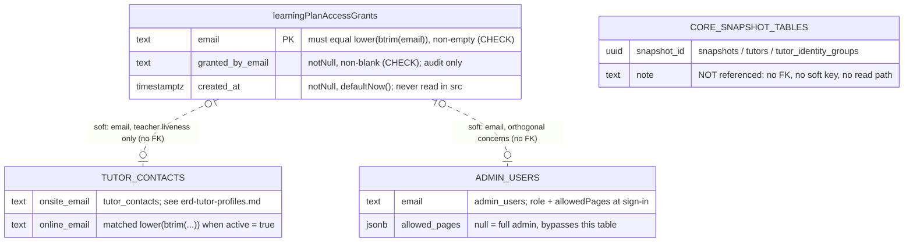

# Database Reference — Learning Plans (ER Diagram)

**Status: stable** — a documentation-side label; no in-code status marker exists (see the [feature doc](../../features/learning-plans.md)).

Scope: the **single** table the Learning Plans feature owns — `learningPlanAccessGrants`. Learning Plans is a stateless document generator: it stores no plan, no student, and no syllabus row. The syllabus corpus is committed JSON under `src/lib/syllabus/data/`, and the generated plan lives entirely in the report URL's query string. The only database state the feature owns is **who is allowed to use it**.

That makes this domain a capability list rather than a data model: one row per granted email address, read fresh on every grant-dependent request, with the correctness work pushed into two SQL `CHECK` constraints rather than into application validation.

Full column-by-column detail (types, defaults, every constraint) lives in [`./index.md`](./index.md); enum value sets live in [`./enums.md`](./enums.md) — this table declares no enum column. This page covers grain, keys, and relationships only. For purpose, the access model's business rules, and the print/PDF flow, see [`../../features/learning-plans.md`](../../features/learning-plans.md).

## Scope

Exactly 1 table (Drizzle export — Postgres table — `src/lib/db/schema.ts` line range):

| Table (varName) | Postgres table | Lines | Grain scope |
|---|---|---|---|
| `learningPlanAccessGrants` | `learning_plan_access_grants` | 601–614 | one row per granted email; snapshot-independent |

Created by `drizzle/0056_learning_plan_access_grants.sql`, registered in the journal at `idx: 56` (`drizzle/meta/_journal.json:397-402`).

## Relationship model

**There are no foreign keys — inbound or outbound.** The table declares no `.references(...)` call (`schema.ts:601-614`), and no other table in the schema references it. The generated Drizzle snapshot confirms all three collections are empty: `"indexes": {}`, `"foreignKeys": {}`, `"uniqueConstraints": {}` (`drizzle/meta/0068_snapshot.json:13192-13230`). A dedicated migration test pins the absence of foreign keys as intentional rather than incidental (`src/lib/learning-plans/__tests__/migration.test.ts:54-59`).

Two soft, application-level relationships exist, both resolved by normalized email string rather than by a key:

- **`learning_plan_access_grants.email` ↔ the signed-in session.** The lookup is an exact equality match on the already-normalized address, `limit 1`, projecting only `email` (`src/lib/learning-plans/access.ts:30-41`). The caller lowercases and trims before the query (`access.ts:26-28`, `:76`), which is why the stored value must already be canonical — see the check constraints below.
- **`learning_plan_access_grants.email` ↔ `tutor_contacts.onsite_email` / `.online_email`.** For a **teacher** role only, a grant is not sufficient: the same email must also match an `active` tutor contact, compared as `lower(btrim(...))` on the Postgres side (`access.ts:43-60`). This is a liveness re-check, so revoking or editing the contact takes effect immediately instead of waiting for JWT expiry (`access.ts:62-71`). `tutor_contacts` is owned by Tutor Profiles — see [`./erd-tutor-profiles.md`](./erd-tutor-profiles.md).

**Deliberately *not* related to `admin_users`.** The two tables share only the semantics of an email column; `admin_users` (`schema.ts:575-585`) decides *whether you may sign in and with what role*, resolved once at sign-in by `resolveUserAccess` (`src/lib/auth-access.ts:57-84`), while this table decides *whether that already-authenticated subject may use one feature*. A grant row can neither create an account nor confer a role — a behaviour the test suite asserts directly (`src/lib/learning-plans/__tests__/access.test.ts:232`).

**No linkage to the snapshot spine.** Nothing in this domain carries a `snapshotId`, and neither `snapshots`, `tutors`, nor `tutorIdentityGroups` is read on any Learning Plans code path. Grants survive snapshot rotation untouched. `tutor_contacts` — the one core-adjacent table the feature reads — is itself snapshot-independent.

## ER diagram

`CORE_SNAPSHOT_TABLES` is drawn edge-less on purpose: it records that the snapshot spine is absent from this domain, not that a relationship is elided.

## Tables

### `learningPlanAccessGrants` (`learning_plan_access_grants`, lines 601–614)

**Grain:** one row per email address granted access to the Learning Plans feature. `email` is the primary key directly (`schema.ts:602`) — there is no surrogate id, so an address is granted at most once. Only three columns exist: `email`, `grantedByEmail` (`notNull`), and `createdAt` (`timestamptz`, `notNull`, `defaultNow()`) (`schema.ts:602-604`).

**Canonicalization is enforced in SQL, not trusted from callers.** Two `check(...)` constraints ship with the table (`schema.ts:605-614`):

- `learning_plan_access_email_normalized_check` — `email = lower(btrim(email)) AND email <> ''` (`schema.ts:606-609`). A mixed-case, padded, or empty address cannot be stored, which is what makes the read-side exact-equality lookup safe: the reader normalizes the incoming session email once and compares with `eq`, never with a `lower()` wrapper that would defeat the primary-key index (`access.ts:26-28`, `:34-38`).
- `learning_plan_access_granted_by_nonblank_check` — `btrim(granted_by_email) <> ''` (`schema.ts:610-613`). The audit column is required to say *something*; the constraint is a non-blank test only, so `grantedByEmail` is not required to be an email or to exist in `admin_users`. The seed rows exercise exactly that latitude, storing the sentinel `'system:migration'`.

**Indexes:** none beyond the primary key. Every access is a point lookup on the PK, so no secondary index is declared (`drizzle/meta/0068_snapshot.json:13192-13230`).

**`createdAt` and `grantedByEmail` are write-only in practice.** The single `SELECT` in `src/` projects `{ email }` alone (`access.ts:35`); neither the timestamp nor the granter is read by any code path, surfaced in any UI, or exported. They exist for forensic inspection in the database.

**Read path — one query, one caller.** `hasExactGrant` (`access.ts:30-41`) is the only place the table is touched, and it is reached only after `resolveLearningPlansAccess` has failed the automatic path:

1. Full admins — and admins whose `allowedPages` still carries the historical `/learning-plans` prefix — return `true` **before any database work** (`access.ts:79-87`, policy at `src/lib/learning-plans/access-policy.ts:13-21`). The test suite asserts the grant DB is never consulted for them (`access.test.ts:43-55`).
2. Roles outside `admin` / `teacher` / a null-or-absent role claim are rejected without a query (`access.ts:90-95`).
3. Only then is the grant read. For `teacher`, the `tutor_contacts` liveness query follows; for everyone else it is skipped (`access.ts:102-104`).

**Fail-closed on error.** The whole grant-dependent branch is wrapped in a `try`/`catch` that returns `false` (`access.ts:97-113`), so a database outage denies the feature rather than opening it — matching the platform's non-negotiable fail-closed posture. `getCurrentLearningPlansAccess` memoizes the decision with `React.cache`, which deduplicates within a single server render only and does not make a grant stale across requests (`access.ts:116-138`).

**Consumers** are all Server Components — there is no `src/app/api/learning-plans/` directory at this revision, so the table is never read through an HTTP handler:

- `src/app/(app)/layout.tsx:15-24` — `getLearningPlansAccess()` gates whether the nav entry renders at all.
- `src/app/(app)/learning-plans/page.tsx:8` — `requireLearningPlansAccess()`, which `redirect("/login")`s an unauthenticated visitor and `notFound()`s an authenticated one without a grant (`access.ts:149-157`).
- `src/app/(print)/learning-plans/report/page.tsx:9` — the same guard on the A4 print surface, so the report cannot be reached by URL alone.

Middleware only performs a **coarse authenticated pass** over `/learning-plans` and `/learning-plans/*` (`src/middleware.ts:51-52`); the live grant decision is deliberately left to the page guard above. Note that the sibling `/api/learning-plans*` exception in middleware (`src/middleware.ts:55-56`) is a namespace reservation — no route file exists behind it.

**Write path: none in application code.** No `INSERT`, `UPDATE`, `DELETE`, or upsert against this table exists anywhere in `src/` — the only occurrences of the Drizzle export outside `schema.ts` are the three lines of the `SELECT` in `access.ts`. The table's sole populating write in the repo is the seed embedded in its own migration, which inserts three addresses with `granted_by_email = 'system:migration'` under `ON CONFLICT ("email") DO NOTHING` (`drizzle/0056_learning_plan_access_grants.sql:9-13`).

## Open questions

- **Granting access requires direct SQL.** With no insert or delete path in `src/` and no admin UI, adding or revoking a Learning Plans grant today means running SQL against Neon or shipping another migration. Whether an admin management surface is intended-but-unbuilt, or the grant list is meant to stay a deliberately manual, low-churn artifact, is not answerable from the code.
- **`grantedByEmail` accepts any non-blank string.** The constraint does not require an email shape, and the seeded rows use the sentinel `'system:migration'` rather than a person. If a future write path is added, whether the column should be tightened to a real granter identity — or kept loose precisely so system provenance can be recorded — is an unresolved design choice.
- **Cross-link handover.** [`../../features/learning-plans.md`](../../features/learning-plans.md) currently points readers at [`./erd-core.md`](./erd-core.md) for this table's reference detail. This page is the new canonical home; that link should be repointed here when the feature page is next regenerated.

_Verified against main@0cd1e81 (clean tree) on 2026-09-02._
