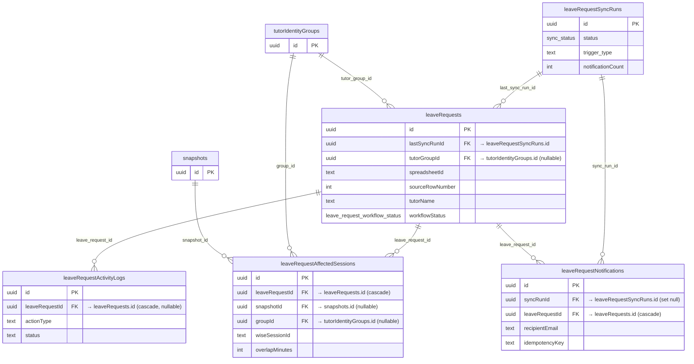

# Database Reference — Leave Requests ER Diagram

> 🟡 **IN PROGRESS** — These tables are **uncommitted work-in-progress**. They live only in the modified (unstaged) `src/lib/db/schema.ts` working tree and are **not present in committed `HEAD`** (verified: `git show HEAD:src/lib/db/schema.ts` contains zero `leaveRequests` references). Definitions, column sets, and relationships may change before this lands. Treat every fact below as a snapshot of WIP, not a stable contract.

Domain: ingestion and triage of tutor **leave requests** sourced from a Google Sheet, the affected Wise sessions each leave overlaps, an action audit trail, and outbound notification bookkeeping.

This page covers **5 tables**, all defined in `src/lib/db/schema.ts`:

| Table (Drizzle var) | Postgres name | schema.ts lines |
|---|---|---|
| `leaveRequestSyncRuns` | `leave_request_sync_runs` | 1185–1204 |
| `leaveRequests` | `leave_requests` | 1205–1262 |
| `leaveRequestAffectedSessions` | `leave_request_affected_sessions` | 1263–1293 |
| `leaveRequestActivityLogs` | `leave_request_activity_logs` | 1294–1309 |
| `leaveRequestNotifications` | `leave_request_notifications` | 1310–1346 |

> Full column-by-column listings (types, defaults, every index) are the canonical responsibility of [`docs/reference/database/index.md`](./index.md). This page intentionally shows only primary keys, foreign keys, and a few identifying columns per entity — see that index for the complete column dictionary.

---

## ER Diagram

Core tables referenced by this domain (`snapshots`, `tutor_identity_groups`) are drawn as **stub nodes** — they are defined elsewhere in `schema.ts` and are not expanded here.

---

## Tables

### `leaveRequestSyncRuns` — `leave_request_sync_runs`
**Grain:** one row per execution of the leave-request sync job (the process that scans the source Google Sheet and ingests rows).

- **PK:** `id` (uuid, random).
- **Key columns:** `status` (`sync_status` enum: `running` / `success` / `failed`, default `running` — schema.ts:19–23, 1187), `triggerType`, optional `actorEmail`, `startedAt` / `finishedAt`, and per-run counters `scannedRowCount`, `insertedCount`, `updatedCount`, `notificationCount` (schema.ts:1192–1195).
- **Single-flight guard:** a partial unique index (`leave_request_sync_runs_single_running_idx`) enforces at most one row with `status = 'running'` at a time (schema.ts:1199–1201) — only one sync can be in flight.
- **Relationships:** referenced by `leaveRequests.lastSyncRunId` (the run that last touched a request) and by `leaveRequestNotifications.syncRunId`. No outbound FKs.

### `leaveRequests` — `leave_requests`
**Grain:** one row per leave request submitted in the source spreadsheet. Uniqueness is anchored to the source row via the `leave_requests_source_row_idx` unique index on (`spreadsheetId`, `sheetName`, `sourceRowNumber`) (schema.ts:1257) — i.e. one logical request per spreadsheet row.

- **PK:** `id` (uuid, random).
- **Source provenance:** `spreadsheetId`, `sheetName`, `sourceRowNumber`, `sourceFingerprint`, `sourceSubmittedAt`, plus the full untransformed row in `rawValues` (jsonb).
- **Tutor / submission detail:** `tutorName` (required), `tutorEmail`, leave window fields (`startDate`/`endDate` as string-mode dates, `timePeriod`, `specificTimeText`, `leaveStartTime`/`leaveEndTime`, `startMinute`/`endMinute`), and reported context (`reason`, `reportedHasClasses`, `reportedAffectedClasses`, `makeupOptions`, `daysNotice`, `adminFee`, etc.).
- **Normalization & matching:** `normalizationStatus` (default `ok`) / `normalizationError`; identity-match fields `matchConfidence` (default `unmatched`), `matchReason`, `tutorCanonicalKey`, `tutorDisplayName`.
- **Workflow state:** `workflowStatus` (`leave_request_workflow_status` enum: `new` / `needs_review` / `in_progress` / `done` / `ignored` / `canceled_by_tutor`, default `new` — schema.ts:147–154, 1236), `unread` (default true), `staffNote`, `statusUpdatedAt`. Sheet write-back tracked via `sheetWriteStatus` (`leave_request_sheet_write_status` enum: `not_required` / `pending` / `success` / `failed`, default `not_required` — schema.ts:156–161, 1239), `sheetWriteError`, `sheetWrittenAt`.
- **Derived counts:** `affectedClassCount`, `cancellationPreviewCount` (both default 0).
- **Foreign keys:** `tutorGroupId` → `tutorIdentityGroups.id` (nullable; the matched logical tutor); `lastSyncRunId` → `leaveRequestSyncRuns.id` (nullable). Both are plain references with no declared on-delete action (schema.ts:1242, 1250).
- **Relationships:** parent of `leaveRequestAffectedSessions`, `leaveRequestActivityLogs`, and `leaveRequestNotifications` (all cascade-delete from here).
- **Hot-path indexes:** by workflow + leave start (`leave_requests_workflow_idx`), unread + created (`leave_requests_unread_idx`), and tutor + leave start (`leave_requests_tutor_idx`) (schema.ts:1258–1260).

### `leaveRequestAffectedSessions` — `leave_request_affected_sessions`
**Grain:** one row per Wise session that a given leave request overlaps — i.e. the candidate sessions impacted by the leave. Deduplicated per request+session via the `leave_request_affected_session_unique_idx` unique index on (`leaveRequestId`, `wiseSessionId`) (schema.ts:1289).

- **PK:** `id` (uuid, random).
- **Key columns:** Wise identifiers (`wiseSessionId` required, `wiseClassId`, `wiseTeacherId` required, `wiseTeacherUserId`), session window (`startTime`/`endTime`, `weekday`, `startMinute`/`endMinute`), Wise status/type (`wiseStatus` required, `sessionType`, `location`), student/subject detail (`studentName`, `studentCount`, `subject`, `classType`, `title`), `overlapMinutes` (minutes the session intersects the leave window, default 0), and `cancelPreviewSelected` (whether this session is selected for cancellation preview, default false).
- **Foreign keys:** `leaveRequestId` → `leaveRequests.id` **on delete cascade** (schema.ts:1265); `snapshotId` → `snapshots.id` (nullable); `groupId` → `tutorIdentityGroups.id` (nullable) (schema.ts:1266–1267).
- **Relationships:** child of `leaveRequests`; references core `snapshots` and `tutorIdentityGroups` for the snapshot the session was read from and the logical tutor.
- **Indexes:** by request + start time (`..._request_idx`) and by Wise session id (`..._wise_idx`) (schema.ts:1290–1291).

### `leaveRequestActivityLogs` — `leave_request_activity_logs`
**Grain:** one row per recorded action/event against a leave request (an audit trail entry).

- **PK:** `id` (uuid, random).
- **Key columns:** `actionType` (required), `status` (default `success`), human-readable `message`, structured `requestPayload` (jsonb, default `{}`) and nullable `responsePayload` (jsonb), `errorMessage`, and actor fields `createdByEmail` / `createdByName`.
- **Foreign key:** `leaveRequestId` → `leaveRequests.id` **on delete cascade** (nullable — a log row can exist without being tied to a surviving request) (schema.ts:1296).
- **Relationships:** child of `leaveRequests`. No other FKs.
- **Index:** by request + created time (`leave_request_activity_logs_request_idx`) for chronological retrieval per request (schema.ts:1307).

### `leaveRequestNotifications` — `leave_request_notifications`
**Grain:** one row per outbound notification attempt (e.g. a new-submission email) for a leave request.

- **PK:** `id` (uuid, random).
- **Key columns:** `notificationType` (default `new_submission_email`), `recipientEmail` (required), `status` (default `pending`), `providerMessageId`, `error`, `idempotencyKey` (required), and send-tracking timestamps `createdAt` / `sentAt`.
- **Idempotency:** the `leave_request_notifications_idempotency_idx` unique index on `idempotencyKey` guarantees a given logical notification is sent at most once (schema.ts:1323).
- **Foreign keys:** `syncRunId` → `leaveRequestSyncRuns.id` **on delete set null** (the originating sync run; survives run deletion); `leaveRequestId` → `leaveRequests.id` **on delete cascade** (schema.ts:1312–1313).
- **Relationships:** child of both `leaveRequests` and `leaveRequestSyncRuns`.
- **Indexes:** by request (`..._request_idx`) and by sync run (`..._sync_idx`) (schema.ts:1324–1325).

---

## Notes & caveats

- **Sourced from a spreadsheet, not Wise directly.** Unlike the snapshot-scoped scheduling tables, `leaveRequests` originates from a Google Sheet (`spreadsheetId` / `sheetName` / `sourceRowNumber`) and writes back to it (`sheetWriteStatus` family). The link to Wise is indirect, via `leaveRequestAffectedSessions`, which carries the Wise session/class/teacher identifiers.
- **Snapshot coupling is loose.** Only `leaveRequestAffectedSessions` references `snapshots` (and `snapshotId` is nullable, no on-delete action). `leaveRequests` itself is **not** snapshot-scoped — it persists across snapshot rotation.
- **Cascade topology.** Deleting a `leaveRequests` row cascades to its affected sessions, activity logs, and notifications. Deleting a `leaveRequestSyncRuns` row nulls out `leaveRequestNotifications.syncRunId` but leaves `leaveRequests.lastSyncRunId` dangling (no declared on-delete action there).
- **Enum source lines** (for verification): `sync_status` schema.ts:19–23; `leave_request_workflow_status` schema.ts:147–154; `leave_request_sheet_write_status` schema.ts:156–161.

_Verified against HEAD + uncommitted WIP on 2026-05-31._
