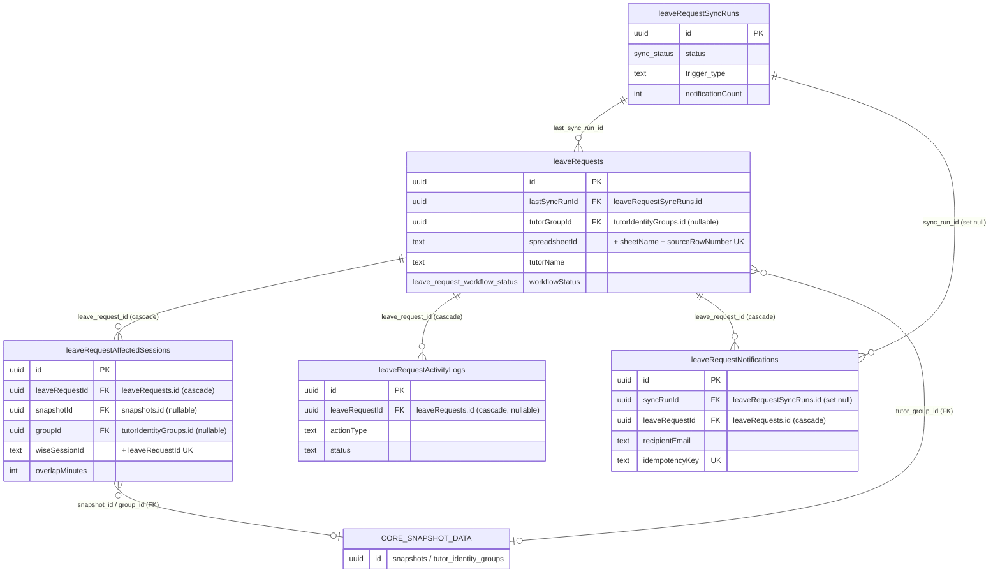

# Database Reference — Leave Requests ER Diagram

> 🟡 **Young / stabilizing** — These tables are **committed and tracked at HEAD `d4fe6d3`** (defined in `src/lib/db/schema.ts`, migrated under `drizzle/`). The feature is live, but its Wise-cancellation path is deliberately preview-only (no Wise mutation) and the parser/normalization heuristics are young, so treat column shapes as stabilizing rather than frozen.

Domain: ingestion and triage of tutor **leave requests** sourced from a Google Sheet, the affected Wise sessions each leave overlaps, an action audit trail, and outbound notification bookkeeping.

This page covers **5 tables**, all defined in `src/lib/db/schema.ts`:

| Table (Drizzle var) | Postgres name | schema.ts lines |
|---|---|---|
| `leaveRequestSyncRuns` | `leave_request_sync_runs` | 1325–1343 |
| `leaveRequests` | `leave_requests` | 1345–1401 |
| `leaveRequestAffectedSessions` | `leave_request_affected_sessions` | 1403–1432 |
| `leaveRequestActivityLogs` | `leave_request_activity_logs` | 1434–1448 |
| `leaveRequestNotifications` | `leave_request_notifications` | 1450–1466 |

> Full column-by-column listings (types, defaults, every index) are the canonical responsibility of [`docs/reference/database/index.md`](./index.md). This page intentionally shows only primary keys, foreign keys, and a few identifying columns per entity — see that index for the complete column dictionary.

---

## ER Diagram

`leaveRequests` is the hub. Core tables referenced by this domain (`snapshots`, `tutor_identity_groups`) are drawn as a single **stub node** (`CORE_SNAPSHOT_DATA`) — they are defined elsewhere in `schema.ts` and are not expanded here. Only foreign keys that actually exist in the schema are drawn.

---

## Tables

### `leaveRequestSyncRuns` — `leave_request_sync_runs`
**Grain:** one row per execution of the leave-request sync job (the process that scans the source Google Sheet and ingests rows).

- **PK:** `id` (uuid, `defaultRandom()`, schema.ts:1326).
- **Key columns:** `status` (`sync_status` enum: `running` / `success` / `failed`, default `running` — enum at schema.ts:19–23, column at 1327), `triggerType`, optional `actorEmail`, `startedAt` / `finishedAt`, and per-run counters `scannedRowCount`, `insertedCount`, `updatedCount`, `notificationCount` (schema.ts:1332–1335). `errorSummary` and a `metadata` jsonb (default `{}`) round out the row (schema.ts:1336–1337).
- **Single-flight guard:** a partial unique index (`leave_request_sync_runs_single_running_idx`) enforces at most one row with `status = 'running'` at a time (schema.ts:1339–1341) — only one sync can be in flight.
- **Relationships:** referenced by `leaveRequests.lastSyncRunId` (the run that last touched a request) and by `leaveRequestNotifications.syncRunId`. No outbound FKs.

### `leaveRequests` — `leave_requests`
**Grain:** one row per leave request submitted in the source spreadsheet. Uniqueness is anchored to the source row via the `leave_requests_source_row_idx` unique index on (`spreadsheetId`, `sheetName`, `sourceRowNumber`) (schema.ts:1397) — i.e. one logical request per spreadsheet row; re-imports update in place.

- **PK:** `id` (uuid, `defaultRandom()`, schema.ts:1346).
- **Source provenance:** `spreadsheetId`, `sheetName`, `sourceRowNumber`, `sourceFingerprint`, `sourceSubmittedAt` (schema.ts:1347–1351), plus the full untransformed row in `rawValues` (jsonb, default `{}`, schema.ts:1389).
- **Tutor / submission detail:** `tutorName` (required, schema.ts:1352), `tutorEmail`, leave-window fields (`startDate`/`endDate` as string-mode dates, `timePeriod`, `specificTimeText`, `leaveStartTime`/`leaveEndTime`, `startMinute`/`endMinute`, schema.ts:1354–1361), and reported context (`reportedHasClasses`, `reportedAffectedClasses`, `makeupOptions`, `reason`, `certificateUrl`, `situationText`, `policyAgreement`, `daysNotice`, `lateNotice`, `adminFee`, `emergencyUsed`, schema.ts:1364–1374).
- **Normalization & matching:** `normalizationStatus` (default `ok`) / `normalizationError` (schema.ts:1362–1363); identity-match fields `matchConfidence` (default `unmatched`), `matchReason`, `tutorCanonicalKey`, `tutorDisplayName` (schema.ts:1383–1386).
- **Workflow state:** `workflowStatus` (`leave_request_workflow_status` enum: `new` / `needs_review` / `in_progress` / `done` / `ignored` / `canceled_by_tutor`, default `new` — enum at schema.ts:163–170, column at 1376), `unread` (default true, schema.ts:1378), `staffNote`, `statusUpdatedAt`. Sheet write-back tracked via `sourceSheetStatus` (schema.ts:1375) and `sheetWriteStatus` (`leave_request_sheet_write_status` enum: `not_required` / `pending` / `success` / `failed`, default `not_required` — enum at schema.ts:172–177, column at 1379), `sheetWriteError`, `sheetWrittenAt` (schema.ts:1380–1381).
- **Derived counts:** `affectedClassCount`, `cancellationPreviewCount` (both default 0, schema.ts:1387–1388).
- **Foreign keys:** `tutorGroupId` → `tutorIdentityGroups.id` (nullable; the matched logical tutor — the only hard core-table FK on this table, schema.ts:1382); `lastSyncRunId` → `leaveRequestSyncRuns.id` (nullable, schema.ts:1390). Both are plain references with no declared on-delete action.
- **Relationships:** parent of `leaveRequestAffectedSessions`, `leaveRequestActivityLogs`, and `leaveRequestNotifications` (all cascade-delete from here).
- **Hot-path indexes:** by workflow + leave start (`leave_requests_workflow_idx`), unread + created (`leave_requests_unread_idx`), and tutor + leave start (`leave_requests_tutor_idx`) (schema.ts:1398–1400).

### `leaveRequestAffectedSessions` — `leave_request_affected_sessions`
**Grain:** one row per Wise session that a given leave request overlaps — i.e. the candidate sessions impacted by the leave. Deduplicated per request+session via the `leave_request_affected_session_unique_idx` unique index on (`leaveRequestId`, `wiseSessionId`) (schema.ts:1429).

- **PK:** `id` (uuid, `defaultRandom()`, schema.ts:1404).
- **Key columns:** Wise identifiers (`wiseTeacherId` required, `wiseTeacherUserId`, `wiseClassId`, `wiseSessionId` required, schema.ts:1408–1411), session window (`startTime`/`endTime`, `weekday`, `startMinute`/`endMinute`, schema.ts:1412–1416), Wise status/type (`wiseStatus` required, `sessionType`, `location`, schema.ts:1417–1419), student/subject detail (`studentName`, `studentCount`, `subject`, `classType`, `title`, schema.ts:1420–1424), `overlapMinutes` (minutes the session intersects the leave window, default 0, schema.ts:1425), and `cancelPreviewSelected` (whether this session is selected for the dry-run cancellation preview, default false, schema.ts:1426).
- **Foreign keys:** `leaveRequestId` → `leaveRequests.id` **on delete cascade** (required, schema.ts:1405); `snapshotId` → `snapshots.id` (nullable, schema.ts:1406); `groupId` → `tutorIdentityGroups.id` (nullable, schema.ts:1407).
- **Relationships:** child of `leaveRequests`; references core `snapshots` and `tutorIdentityGroups` for the snapshot the session was read from and the logical tutor.
- **Indexes:** by request + start time (`..._request_idx`) and by Wise session id (`..._wise_idx`) (schema.ts:1430–1431).

### `leaveRequestActivityLogs` — `leave_request_activity_logs`
**Grain:** one row per recorded action/event against a leave request (an append-only audit-trail entry).

- **PK:** `id` (uuid, `defaultRandom()`, schema.ts:1435).
- **Key columns:** `actionType` (required), `status` (default `success`), human-readable `message`, structured `requestPayload` (jsonb, default `{}`) and nullable `responsePayload` (jsonb), `errorMessage`, and actor fields `createdByEmail` / `createdByName` (schema.ts:1437–1444).
- **Foreign key:** `leaveRequestId` → `leaveRequests.id` **on delete cascade** (nullable — a log row can exist without being tied to a surviving request, schema.ts:1436).
- **Relationships:** child of `leaveRequests`. No other FKs.
- **Index:** by request + created time (`leave_request_activity_logs_request_idx`) for chronological retrieval per request (schema.ts:1447).

### `leaveRequestNotifications` — `leave_request_notifications`
**Grain:** one row per outbound notification attempt (e.g. a new-submission email) for a leave request — an email outbox entry.

- **PK:** `id` (uuid, `defaultRandom()`, schema.ts:1451).
- **Key columns:** `notificationType` (default `new_submission_email`), `recipientEmail` (required), `status` (default `pending`), `providerMessageId`, `error`, `idempotencyKey` (required), and send-tracking timestamps `createdAt` / `sentAt` (schema.ts:1454–1461).
- **Idempotency:** the `leave_request_notifications_idempotency_idx` unique index on `idempotencyKey` guarantees a given logical notification is sent at most once (schema.ts:1463).
- **Foreign keys:** `syncRunId` → `leaveRequestSyncRuns.id` **on delete set null** (the originating sync run; survives run deletion, schema.ts:1452); `leaveRequestId` → `leaveRequests.id` **on delete cascade** (schema.ts:1453).
- **Relationships:** child of both `leaveRequests` and `leaveRequestSyncRuns`.
- **Indexes:** by request (`..._request_idx`) and by sync run (`..._sync_idx`) (schema.ts:1464–1465).

---

## Notes & caveats

- **Sourced from a spreadsheet, not Wise directly.** Unlike the snapshot-scoped scheduling tables, `leaveRequests` originates from a Google Sheet (`spreadsheetId` / `sheetName` / `sourceRowNumber`) and writes back to it (`sheetWriteStatus` family). The link to Wise is indirect, via `leaveRequestAffectedSessions`, which carries the Wise session/class/teacher identifiers.
- **Snapshot coupling is loose.** Only `leaveRequestAffectedSessions` references `snapshots` (and `snapshotId` is nullable, no on-delete action). `leaveRequests` itself is **not** snapshot-scoped — it persists across snapshot rotation.
- **Cascade topology.** Deleting a `leaveRequests` row cascades to its affected sessions, activity logs, and notifications. Deleting a `leaveRequestSyncRuns` row nulls out `leaveRequestNotifications.syncRunId` but leaves `leaveRequests.lastSyncRunId` dangling (no declared on-delete action there).
- **Enum source lines** (for verification): `sync_status` schema.ts:19–23; `leave_request_workflow_status` schema.ts:163–170; `leave_request_sheet_write_status` schema.ts:172–177.

_Verified against HEAD `d4fe6d3` on 2026-06-05._
