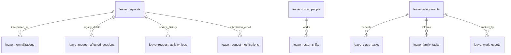

# Leave Requests database

The feature owns 13 tables: five original source/legacy tables from migration 0036 and eight durable work tables from migration 0080. They are declared in `src/lib/db/schema.ts`.

```mermaid
erDiagram
  leave_requests ||--o{ leave_normalizations : interpreted_as
  leave_roster_people ||--o{ leave_roster_shifts : works
  leave_assignments ||--o{ leave_class_tasks : cancels
  leave_assignments ||--o{ leave_family_tasks : informs
  leave_assignments ||--o{ leave_work_events : audited_by
  leave_requests ||--o{ leave_request_affected_sessions : legacy_detail
  leave_requests ||--o{ leave_request_activity_logs : source_history
  leave_requests ||--o{ leave_request_notifications : submission_email
```

## Durable work tables

| SQL table / Drizzle export | Grain and important fields |
|---|---|
| `leave_roster_people` / `leaveRosterPeople` | One roster person; stable key, unique existing admin email, display name, aliases. No access grants. |
| `leave_roster_shifts` / `leaveRosterShifts` | Unique person/date; working/off/sick/leave/holiday/unknown, shift minutes, tab/cell, resolved colour, text/note, fetched timestamp. |
| `leave_normalizations` / `leaveNormalizations` | Unique source request + meaningful input key. Stores model, prompt version, input, result, pending/ok/failed status, attempts/retry time, completion time and evidence-application checkpoint. |
| `leave_assignments` / `leaveAssignments` | Unique stable teacher canonical key + Bangkok class date. Due date, owner email/name, assigned date, source request IDs, issue, derived done state and optimistic version. |
| `leave_class_tasks` / `leaveClassTasks` | Globally unique Wise session ID. Assignment FK, real UTC start/end, Wise class ID/status, student records, content revision, linked source IDs, active/missing state, cancellation evidence, consumed normalization IDs and version. |
| `leave_family_tasks` / `leaveFamilyTasks` | Unique assignment + stable family key. Student/contact records, required and informed session revisions, notification evidence, consumed normalization IDs, active state and version. |
| `leave_work_events` / `leaveWorkEvents` | Append-only assignment audit. Globally unique mutation key, actor, action, prior values/input and recorded timestamp. |
| `leave_work_state` / `leaveWorkState` | Keyed sync checkpoints/freshness (`source`, `roster`, `classes`, `processing`) and per-bundle source fingerprints. |

These tables deliberately have no foreign keys to rotating snapshots or tutor-group UUIDs. Stable canonical teacher keys, Wise session IDs and student/family keys preserve workflow across snapshot replacement. Assignment-to-source relationships are stored as deduplicated request-ID arrays because several submissions can share the same teacher/date and Wise session.

Completion evidence stores source (`admin`, `sheet`, `wise`), actor email/name when known, actual completion time when established, recorded time, and source note/normalization ID. Imported sheet and Wise observations must not invent an admin completion timestamp. Consumed normalization IDs remain after undo to make interrupted catch-up reconciliation safe.

Family coverage consists of session ID plus a revision of the class information relevant to that family. Adding another family to a group class leaves existing family coverage unchanged. Changing the affected time/content invalidates only the impacted notification coverage. The cancellation task is still shared across all families.

## Existing tables

- `leave_request_sync_runs`: the original running/success/failed ledger and partial unique running-row index remain. New sync reclaims abandoned rows older than 20 minutes and records bounded processing progress.
- `leave_requests`: original row identity, form fields, raw values, source timestamps/status, matched tutor identity and legacy workflow metadata remain. Migration 0080 adds `current_normalization_key`; only the matching successful revision may generate current work. `sheet_write_status` is the checklist-summary outbox state.
- `leave_request_affected_sessions`: retained legacy request detail/preview data; no longer authoritative for the daily work queue.
- `leave_request_activity_logs`: retained source import and metadata history.
- `leave_request_notifications`: existing submission-email ledger. Initial migration suppresses catch-up email sends.

## Read dependencies and invariants

The new queue reads the active Credit Control snapshot's **original** `scheduled_start_time`/`scheduled_end_time` values, participant records, parent names, verified LINE links, and the active Wise teacher/session identity mapping. It never interprets the legacy scheduler's shifted wall-clock timestamps as UTC. A session absent from a later snapshot does not prove cancellation and does not delete unfinished tasks.

Checklist and ownership changes run in a transaction with an assignment row lock, entity version check, and audit insert. Exact mutation retries are idempotent even after PostgreSQL JSONB key reordering. Allocation uses a transaction advisory lock plus the same assignment locks and never changes an existing ownership decision. Per-bundle fingerprints avoid unnecessary work on unchanged syncs.

Apply the additive 0080 migration before the new code. No existing requests, owners, sheet notes, statuses, or completion evidence are deleted by the migration.
