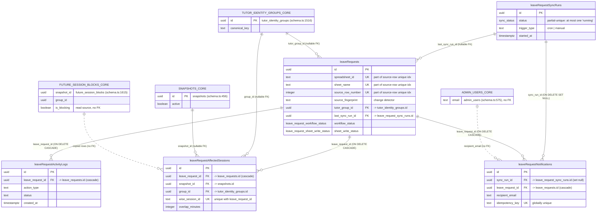

# Database Reference — Leave Requests ER Diagram

> 🟡 **IN PROGRESS** — badge supplied by the documentation task for this domain. Read the badge note below before treating it as a claim about the code: at this revision the five tables and their migration are **committed and running in production**, not uncommitted WIP.

Domain: ingestion and triage of tutor **leave requests** sourced from one Google Sheet tab, the Wise sessions each leave window overlaps, an append-only action trail, and outbound notification bookkeeping.

This page covers **5 tables**, all defined in `src/lib/db/schema.ts` under the `── Tutor Leave Requests ──` section header (`src/lib/db/schema.ts:2091`):

| Table (Drizzle var) | Postgres name | schema.ts lines |
|---|---|---|
| `leaveRequestSyncRuns` | `leave_request_sync_runs` | 2093–2111 |
| `leaveRequests` | `leave_requests` | 2113–2169 |
| `leaveRequestAffectedSessions` | `leave_request_affected_sessions` | 2171–2200 |
| `leaveRequestActivityLogs` | `leave_request_activity_logs` | 2202–2216 |
| `leaveRequestNotifications` | `leave_request_notifications` | 2218–2234 |

> Full column-by-column listings (every type, default, and index) are the canonical responsibility of [`docs/reference/database/index.md`](./index.md); enum value lists belong to [`enums.md`](./enums.md). This page shows only primary keys, foreign keys, and a few identifying columns per entity, plus grain and relationships. Purpose, workflow rules, and the reasoning behind them live in [`docs/features/leave-requests.md`](../../features/leave-requests.md).

### Note on the badge

The `IN PROGRESS` badge is applied as instructed by the documentation task, which described these tables as living in a modified, unstaged `src/lib/db/schema.ts`. That premise does not hold at this revision. Verified mechanically:

- `git status --porcelain -- src/lib/db/schema.ts` → empty. The file is clean; there are no unstaged leave-request changes.
- `git show HEAD:src/lib/db/schema.ts | grep -c "leaveRequestNotifications\|leaveRequestSyncRuns"` → `4`. The tables are in committed `HEAD`.
- The DDL migration `drizzle/0036_tutor_leave_requests.sql` is tracked and committed, and creates all five tables plus the two `leave_request_*` enums. No later migration under `drizzle/*.sql` alters them (`grep -ln "leave_request" drizzle/*.sql` matches only `0036`).
- `git log -1 -- src/lib/leave-requests/` → `8cc2717`. The whole feature source is committed.

Read the badge as "feature still maturing", not "schema uncommitted". The feature doc reaches the same conclusion independently ([`docs/features/leave-requests.md`](../../features/leave-requests.md), status line).

---

## ER Diagram

Core tables are drawn as **stub nodes** — they are defined elsewhere in `schema.ts` and are not expanded here. `snapshots` (`src/lib/db/schema.ts:456`) and `tutorIdentityGroups` (`src/lib/db/schema.ts:1516`) are reached by real SQL foreign keys. `futureSessionBlocks` (`src/lib/db/schema.ts:1615`) is shown because it is the *read source* that populates `leaveRequestAffectedSessions` (`src/lib/leave-requests/data.ts:443`-`451`), but no foreign key points at it — that edge is dashed. `adminUsers` (`src/lib/db/schema.ts:575`) supplies the notification recipient list (`src/lib/leave-requests/sync.ts:270`-`276`) with no FK either.

```mermaid
erDiagram
    leaveRequestSyncRuns {
        uuid id PK
        sync_status status "partial-unique: at most one 'running'"
        text trigger_type "cron | manual"
        timestamptz started_at
    }

    leaveRequests {
        uuid id PK
        text spreadsheet_id UK "part of source-row unique idx"
        text sheet_name UK "part of source-row unique idx"
        integer source_row_number UK "part of source-row unique idx"
        text source_fingerprint "change detector"
        uuid tutor_group_id FK "-> tutor_identity_groups.id"
        uuid last_sync_run_id FK "-> leave_request_sync_runs.id"
        leave_request_workflow_status workflow_status
        leave_request_sheet_write_status sheet_write_status
    }

    leaveRequestAffectedSessions {
        uuid id PK
        uuid leave_request_id FK "-> leave_requests.id (cascade)"
        uuid snapshot_id FK "-> snapshots.id"
        uuid group_id FK "-> tutor_identity_groups.id"
        text wise_session_id UK "unique with leave_request_id"
        integer overlap_minutes
    }

    leaveRequestActivityLogs {
        uuid id PK
        uuid leave_request_id FK "-> leave_requests.id (cascade)"
        text action_type
        text status
        timestamptz created_at
    }

    leaveRequestNotifications {
        uuid id PK
        uuid sync_run_id FK "-> leave_request_sync_runs.id (set null)"
        uuid leave_request_id FK "-> leave_requests.id (cascade)"
        text recipient_email
        text idempotency_key UK "globally unique"
    }

    SNAPSHOTS_CORE {
        uuid id PK "snapshots (schema.ts:456)"
        boolean active
    }

    TUTOR_IDENTITY_GROUPS_CORE {
        uuid id PK "tutor_identity_groups (schema.ts:1516)"
        text canonical_key
    }

    FUTURE_SESSION_BLOCKS_CORE {
        uuid snapshot_id "future_session_blocks (schema.ts:1615)"
        uuid group_id
        boolean is_blocking "read source, no FK"
    }

    ADMIN_USERS_CORE {
        text email "admin_users (schema.ts:575), no FK"
    }

    leaveRequestSyncRuns  ||--o{ leaveRequests                 : "last_sync_run_id (nullable FK)"
    leaveRequestSyncRuns  ||--o{ leaveRequestNotifications     : "sync_run_id (ON DELETE SET NULL)"
    leaveRequests         ||--o{ leaveRequestAffectedSessions  : "leave_request_id (ON DELETE CASCADE)"
    leaveRequests         ||--o{ leaveRequestActivityLogs      : "leave_request_id (ON DELETE CASCADE)"
    leaveRequests         ||--o{ leaveRequestNotifications     : "leave_request_id (ON DELETE CASCADE)"
    TUTOR_IDENTITY_GROUPS_CORE ||--o{ leaveRequests            : "tutor_group_id (nullable FK)"
    TUTOR_IDENTITY_GROUPS_CORE ||--o{ leaveRequestAffectedSessions : "group_id (nullable FK)"
    SNAPSHOTS_CORE        ||--o{ leaveRequestAffectedSessions  : "snapshot_id (nullable FK)"
    FUTURE_SESSION_BLOCKS_CORE ||..o{ leaveRequestAffectedSessions : "copied rows (no FK)"
    ADMIN_USERS_CORE      ||..o{ leaveRequestNotifications     : "recipient_email (no FK)"
```

---

## Tables

### `leaveRequestSyncRuns` — `leave_request_sync_runs`

Source: `src/lib/db/schema.ts:2093`-`2111`.

**Grain:** one row per attempt to sync the leave-request Google Sheet into Postgres — cron or manual. The row is inserted *before* any work happens (`src/lib/leave-requests/sync.ts:373`-`382`) and updated exactly once at the end, to `success` with the counters filled in (`sync.ts:418`-`434`) or to `failed` with `errorSummary` (`sync.ts:446`-`452`).

**Key columns:**
- `id` — `uuid` PK, `defaultRandom()`.
- `status` — the shared `syncStatusEnum` (`running` / `success` / `failed`, `src/lib/db/schema.ts:21`), default `running`.
- `triggerType` / `actorEmail` — provenance of the run; `actorEmail` is null for cron.
- `scannedRowCount`, `insertedCount`, `updatedCount`, `notificationCount` — `integer`, default `0`; written only on the success path.
- `errorSummary` — populated only on the failure path.
- `metadata` — `jsonb`, default `{}`. Seeded with `spreadsheetId` + `sheetName` at insert, then re-written on success to also carry `connectedEmail` and `activeSnapshotId` (`sync.ts:427`-`432`).

**Single-flight guard.** The uniqueness is conditional, not a plain unique column: `leave_request_sync_runs_single_running_idx` is a `uniqueIndex` on `status` with a `.where(...)` predicate restricting it to `status = 'running'` (`src/lib/db/schema.ts:2107`-`2109`), so at most one row may sit in `running` at a time. The application does not pre-check — it attempts the insert and translates the Postgres unique violation into a typed error by matching the index name in the message: `isRunningConflict` tests `text.includes("leave_request_sync_runs_single_running_idx")` and the caller throws `LeaveRequestSyncAlreadyRunningError` (`src/lib/leave-requests/sync.ts:55`-`58`, `:385`). The database is therefore the concurrency authority, not the process.

**Relationships:** referenced by `leaveRequests.lastSyncRunId` (nullable, no cascade) and by `leaveRequestNotifications.syncRunId` (`ON DELETE SET NULL`). Holds no FK of its own.

---

### `leaveRequests` — `leave_requests`

Source: `src/lib/db/schema.ts:2113`-`2169`. The widest table in the domain (~45 columns).

**Grain:** one row per **source sheet row** — not per leave event and not per sync. Identity is the triple `(spreadsheetId, sheetName, sourceRowNumber)`, enforced by the `leave_requests_source_row_idx` unique index (`src/lib/db/schema.ts:2165`). A re-sync of the same sheet row updates the existing row rather than appending a new one (`src/lib/leave-requests/sync.ts:239`-`267`).

**Key columns**, grouped by who writes them:

- **Source identity (sync-owned):** `spreadsheetId`, `sheetName`, `sourceRowNumber`, `sourceFingerprint`, `sourceSubmittedAt`. `sourceFingerprint` is the change detector — the sync compares `existing.sourceFingerprint !== parsed.sourceFingerprint` to decide whether the row materially changed, which in turn re-flags `unread` and emits a `source_updated` (vs. `source_refreshed`) activity log (`sync.ts:239`, `:253`, `:261`).
- **Parsed form fields (sync-owned):** `tutorName`, `tutorEmail`, `startDate` / `endDate` (`date`, `mode: "string"`), `timePeriod`, `specificTimeText`, `leaveStartTime` / `leaveEndTime`, `startMinute` / `endMinute`, plus the reported/administrative fields `reportedHasClasses`, `reportedAffectedClasses`, `makeupOptions`, `reason`, `certificateUrl`, `situationText`, `policyAgreement`, `daysNotice`, `lateNotice`, `adminFee`, `emergencyUsed`. `rawValues` (`jsonb`, default `{}`) retains the untyped sheet row so nothing parsed away is lost.
- **Normalization outcome:** `normalizationStatus` is a plain `text` (default `"ok"`), **not** a pgEnum; the parser only ever writes `"ok"` or `"needs_review"` (`src/lib/leave-requests/parser.ts:227`, `:237`, `:271`), with the reason in `normalizationError`.
- **Identity match (sync-owned):** `tutorGroupId` → `tutorIdentityGroups.id` (nullable FK, `src/lib/db/schema.ts:2150`), plus the denormalized `tutorCanonicalKey` and `tutorDisplayName`. `matchConfidence` is `text` defaulting to `"unmatched"`; the matcher emits exactly `"email" | "name" | "unmatched"` (`src/lib/leave-requests/matching.ts:9`). A null `tutorGroupId` is the fail-closed state — affected-session computation short-circuits to zero when it is missing (`src/lib/leave-requests/data.ts:404`-`410`).
- **Triage state (admin-owned):** `workflowStatus` (`leaveRequestWorkflowStatusEnum`, default `new` — values in [`enums.md`](./enums.md)), `staffNote`, `unread` (default `true`), `statusUpdatedAt`. The sync may *escalate* but never overwrite human triage: it only rewrites `workflowStatus` to `needs_review` when the current value is still `new` or `needs_review` and either normalization failed or the tutor is unmatched (`sync.ts:241`-`246`).
- **Sheet writeback state:** `sheetWriteStatus` (`leaveRequestSheetWriteStatusEnum`, default `not_required`), `sheetWriteError`, `sheetWrittenAt`, and the mirrored `sourceSheetStatus`. The status machine is driven entirely from `updateLeaveRequestWorkflow`: set to `pending` up front when a write is intended, then `success` (with `sourceSheetStatus` and `sheetWrittenAt` updated) or `failed` (with `sheetWriteError` set) — `src/lib/leave-requests/data.ts:525`-`526`, `:558`-`564`, `:583`-`588`. Failures are recorded, never swallowed.
- **Derived counters:** `affectedClassCount` and `cancellationPreviewCount`, both `integer` default `0`. Both are recomputed wholesale, not incremented — see the next table.
- **Lineage / timestamps:** `lastSyncRunId` → `leaveRequestSyncRuns.id` (nullable FK, `src/lib/db/schema.ts:2158`), `firstSeenAt`, `lastSeenAt`, `createdAt`, `updatedAt`.

**Indexes** beyond the unique source-row key serve the three workspace views: `leave_requests_workflow_idx` on `(workflowStatus, leaveStartTime)`, `leave_requests_unread_idx` on `(unread, createdAt)`, and `leave_requests_tutor_idx` on `(tutorCanonicalKey, leaveStartTime)` (`src/lib/db/schema.ts:2166`-`2168`).

**Relationships:** parent of all three child tables (`leaveRequestAffectedSessions`, `leaveRequestActivityLogs`, `leaveRequestNotifications`), each `ON DELETE CASCADE`. Child of `tutorIdentityGroups` (nullable) and `leaveRequestSyncRuns` (nullable). Note that both tutor references are nullable and no `snapshot_id` exists on this table — a leave request outlives snapshot rotation.

---

### `leaveRequestAffectedSessions` — `leave_request_affected_sessions`

Source: `src/lib/db/schema.ts:2171`-`2200`.

**Grain:** one row per (leave request × Wise session) pair whose times actually overlap — enforced by `leave_request_affected_session_unique_idx` on `(leaveRequestId, wiseSessionId)` (`src/lib/db/schema.ts:2197`).

**Population is delete-and-rebuild, not incremental.** `recomputeAffectedSessionsForRequest` deletes every existing row for the request, then re-selects from `futureSessionBlocks` scoped to the **active** snapshot and the request's `tutorGroupId`, filtered to `isBlocking = true` and to the Bangkok date range of the leave (`src/lib/leave-requests/data.ts:401`-`451`). Each candidate is kept only if `overlapMinutes(...) > 0` (`data.ts:456`-`457`), so a session on the right day but outside the requested time window is excluded. The sync calls this for every row on every pass (`src/lib/leave-requests/sync.ts:402`).

**Key columns:**
- `id` — `uuid` PK; `leaveRequestId` — `notNull` FK to `leaveRequests.id`, `onDelete: "cascade"`.
- `snapshotId` → `snapshots.id` and `groupId` → `tutorIdentityGroups.id`, both **nullable** FKs (`src/lib/db/schema.ts:2174`-`2175`). They record which snapshot the copy came from, and are nullable so a pruned/rotated lineage cannot orphan the row.
- Wise identifiers copied verbatim from the source block: `wiseTeacherId` (`notNull`), `wiseTeacherUserId`, `wiseClassId`, `wiseSessionId` (`notNull`).
- Time fields: `startTime` / `endTime` (`notNull`, timezone-aware), plus the denormalized `weekday`, `startMinute`, `endMinute` (`notNull`) carried over from `futureSessionBlocks`.
- Descriptive copies: `wiseStatus` (`notNull`), `sessionType`, `location`, `studentName`, `studentCount`, `subject`, `classType`, `title`.
- `overlapMinutes` — `integer`, `notNull`, default `0`; the computed intersection in minutes between the leave window and the session (`data.ts:479`).
- `cancelPreviewSelected` — `boolean`, `notNull`, default `false`. Reset to `false` for the whole request and then set to `true` for exactly the selected ids on each preview (`data.ts:626`-`635`), so it always reflects the latest selection rather than accumulating.

**Counter derivation.** After the rebuild, the parent's `affectedClassCount` is set to the row count, and `cancellationPreviewCount` to the number of rows having both `wiseClassId` and `wiseSessionId` — but only when `normalizationStatus === "ok"`, otherwise `0` (`data.ts:487`-`491`). A later explicit preview overwrites `cancellationPreviewCount` with the selected-row count (`data.ts:647`-`650`).

**Relationships:** child of `leaveRequests` (cascade), optional child of `snapshots` and `tutorIdentityGroups`. Its content originates from `futureSessionBlocks` by copy, with **no** foreign key to it — a deliberate decoupling, since `futureSessionBlocks` rows are snapshot-scoped and rotate away.

---

### `leaveRequestActivityLogs` — `leave_request_activity_logs`

Source: `src/lib/db/schema.ts:2202`-`2216`.

**Grain:** one row per recorded action against a leave request — append-only. Every write in the feature goes through the single helper `insertLeaveRequestLog`, which does a bare `db.insert(...).values(input)` (`src/lib/leave-requests/data.ts:181`-`183`); nothing in `src/lib/leave-requests/` updates or deletes a log row.

**Key columns:**
- `id` — `uuid` PK. `leaveRequestId` — FK to `leaveRequests.id` with `onDelete: "cascade"`, and **nullable** (`src/lib/db/schema.ts:2204`), unlike the other two children, so an unattributed entry is representable.
- `actionType` — `text`, `notNull`. Six values are emitted in the code: `source_inserted`, `source_updated`, `source_refreshed` (`sync.ts:231`, `:261`), `status_update` (`data.ts:534`), `sheet_status_write` (`data.ts:570`, `:591`), and `wise_cancel_preview` (`data.ts:654`). It is free text, not a pgEnum.
- `status` — `text`, `notNull`, default `"success"`. Observed values are `success`, `failed`, and `manual_required` — the last used to mark that a Wise cancellation was previewed only and a human must perform it (`data.ts:655`).
- `requestPayload` — `jsonb`, `notNull`, default `{}`; `responsePayload` — nullable `jsonb`. The cancel-preview entry stores the exact `DELETE /teacher/classes/{classId}/sessions/{sessionId}?cancelSession=true` endpoints (built at `data.ts:637`-`645`) alongside `dryRun: true` and `policy: "preview_only_manual_required"` (`data.ts:657`-`662`), which is what makes this table the audit record proving no Wise mutation was sent.
- `errorMessage`, `createdByEmail`, `createdByName`, `createdAt`.

**Index:** `leave_request_activity_logs_request_idx` on `(leaveRequestId, createdAt)` (`src/lib/db/schema.ts:2215`), matching the detail view's descending-by-`createdAt` read (`data.ts:298`-`300`).

**Relationships:** optional child of `leaveRequests` (cascade when set). No other FKs — actor identity is stored as denormalized email/name text, not a reference to `admin_users`.

---

### `leaveRequestNotifications` — `leave_request_notifications`

Source: `src/lib/db/schema.ts:2218`-`2234`.

**Grain:** one row per (leave request × recipient) delivery record for a given notification, deduplicated by `idempotencyKey`. Note the fan-out shape: one email is sent per recipient covering *all* new requests in that sync, but a bookkeeping row is written per request per recipient (`src/lib/leave-requests/sync.ts:328`-`359`) — so N new requests × M admins produces N×M rows against M actual sends.

**Two distinct idempotency keys exist.** The one sent to the mail provider is run-scoped — `` `leave-requests:${syncRunId}:${recipient}` `` (`sync.ts:329`) — while the one stored in this table is request-scoped: `` `leave-request:new:${request.id}:${recipient}` `` (`sync.ts:355`). Only the stored key is constrained, by the global `leave_request_notifications_idempotency_idx` unique index (`src/lib/db/schema.ts:2231`), and the insert is guarded with `.onConflictDoNothing({ target: schema.leaveRequestNotifications.idempotencyKey })` (`sync.ts:358`). The effect is that a given request is only ever recorded as notified once per recipient, even across repeated syncs.

**Key columns:**
- `id` — `uuid` PK.
- `syncRunId` → `leaveRequestSyncRuns.id`, nullable, `onDelete: "set null"` (`src/lib/db/schema.ts:2220`) — the run may be pruned without losing the delivery record.
- `leaveRequestId` → `leaveRequests.id`, nullable, `onDelete: "cascade"` (`src/lib/db/schema.ts:2221`).
- `notificationType` — `text`, `notNull`, default `"new_submission_email"`; only the default is written today.
- `recipientEmail` — `text`, `notNull`. Sourced from the `admin_users` allowlist, lowercased and de-duplicated (`sync.ts:270`-`276`), with no FK to `admin_users`.
- `status` — `text`, `notNull`, default `"pending"`. The sync writes `"success"` or `"failed"` directly (`sync.ts:352`); the `pending` default is a schema-level fallback that this code path does not use.
- `providerMessageId`, `error`, `createdAt`, `sentAt` (`sentAt` left null on failure, `sync.ts:356`).

**Indexes:** the unique `idempotencyKey` index plus lookup indexes on `leaveRequestId` and `syncRunId` (`src/lib/db/schema.ts:2231`-`2233`).

**Relationships:** optional child of both `leaveRequestSyncRuns` (set-null) and `leaveRequests` (cascade). The asymmetric delete behaviour is intentional: deleting a request removes its notification history, while deleting a sync run only detaches it.

---

## Domain-level notes

- **No snapshot scoping on the parent.** Unlike the Wise tutor tables, `leaveRequests` carries no `snapshotId`. Only `leaveRequestAffectedSessions` records one, and it is nullable. Leave requests are human workflow state that must survive snapshot rotation; the session overlap is a recomputable projection of whatever snapshot was active at the time.
- **Only three status-like columns are real enums.** `workflowStatus` and `sheetWriteStatus` on `leaveRequests` are pgEnums, and `leaveRequestSyncRuns.status` reuses the shared `syncStatusEnum`. But `normalizationStatus`, `matchConfidence`, `leaveRequestActivityLogs.actionType`/`status`, and `leaveRequestNotifications.notificationType`/`status` are all plain `text` with application-level conventions — a real constraint difference to be aware of when querying.
- **Nothing in this domain writes to Wise.** No table stores a Wise mutation result; `leaveRequestActivityLogs` stores the *intended* endpoints of a preview only (`data.ts:637`-`662`).

_Verified against HEAD + uncommitted WIP on 2026-05-31._
