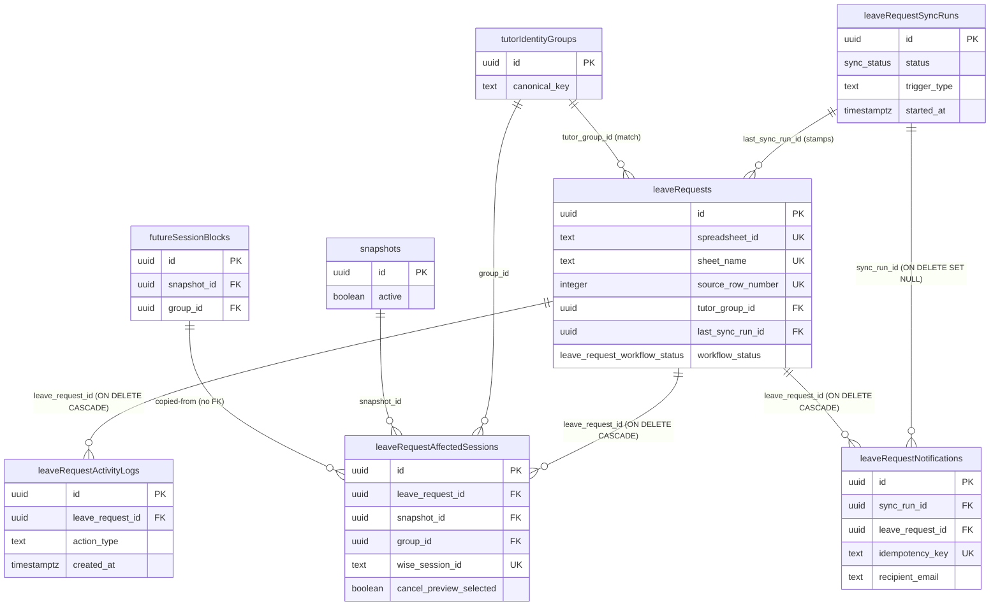

# Database Reference — Leave Requests

> **Status: stable.** The five tables are committed, migrated, and driven by a scheduled production cron (`15,45 * * * *`). An earlier documentation pass carried an IN PROGRESS badge on the mistaken premise that this schema was uncommitted WIP; that premise did not hold and the badge is retired — see [Badge provenance](#badge-provenance).

Domain: ingestion and triage of tutor **leave requests** submitted through one Google Sheet tab. A sync run reads the sheet, matches each row to a Wise tutor identity, computes which of that tutor's Wise sessions the leave window overlaps, records an append-only action trail, and books the outbound admin notification. The only Wise-facing capability in the domain is a **dry-run cancellation preview** — no session is ever cancelled from here.

All five tables are declared in `src/lib/db/schema.ts` under the `── Tutor Leave Requests ──` section header (`src/lib/db/schema.ts:2094`) and created by `drizzle/0036_tutor_leave_requests.sql`.

| Table (Drizzle var) | Postgres name | schema.ts lines |
|---|---|---|
| `leaveRequestSyncRuns` | `leave_request_sync_runs` | 2096–2115 |
| `leaveRequests` | `leave_requests` | 2116–2173 |
| `leaveRequestAffectedSessions` | `leave_request_affected_sessions` | 2174–2204 |
| `leaveRequestActivityLogs` | `leave_request_activity_logs` | 2205–2220 |
| `leaveRequestNotifications` | `leave_request_notifications` | 2221–2257 |

Full column-by-column detail (every type, default, and index) is the canonical responsibility of [index.md](./index.md); enum value sets live in [enums.md](./enums.md). This page covers grain, keys, and relationships only. Purpose, workflow rules, and the reasoning behind them live in [docs/features/leave-requests.md](../../features/leave-requests.md).

## ER Diagram

Core tables the domain points at (`snapshots`, `tutorIdentityGroups`, `futureSessionBlocks`) appear as stub nodes; they are expanded in [erd-core.md](./erd-core.md).

```mermaid
erDiagram
    leaveRequestSyncRuns {
        uuid id PK
        sync_status status
        text trigger_type
        timestamptz started_at
    }
    leaveRequests {
        uuid id PK
        text spreadsheet_id UK
        text sheet_name UK
        integer source_row_number UK
        uuid tutor_group_id FK
        uuid last_sync_run_id FK
        leave_request_workflow_status workflow_status
    }
    leaveRequestAffectedSessions {
        uuid id PK
        uuid leave_request_id FK
        uuid snapshot_id FK
        uuid group_id FK
        text wise_session_id UK
        boolean cancel_preview_selected
    }
    leaveRequestActivityLogs {
        uuid id PK
        uuid leave_request_id FK
        text action_type
        timestamptz created_at
    }
    leaveRequestNotifications {
        uuid id PK
        uuid sync_run_id FK
        uuid leave_request_id FK
        text idempotency_key UK
        text recipient_email
    }
    snapshots {
        uuid id PK
        boolean active
    }
    tutorIdentityGroups {
        uuid id PK
        text canonical_key
    }
    futureSessionBlocks {
        uuid id PK
        uuid snapshot_id FK
        uuid group_id FK
    }

    leaveRequestSyncRuns ||--o{ leaveRequests : "last_sync_run_id (stamps)"
    leaveRequestSyncRuns ||--o{ leaveRequestNotifications : "sync_run_id (ON DELETE SET NULL)"
    leaveRequests ||--o{ leaveRequestAffectedSessions : "leave_request_id (ON DELETE CASCADE)"
    leaveRequests ||--o{ leaveRequestActivityLogs : "leave_request_id (ON DELETE CASCADE)"
    leaveRequests ||--o{ leaveRequestNotifications : "leave_request_id (ON DELETE CASCADE)"
    tutorIdentityGroups ||--o{ leaveRequests : "tutor_group_id (match)"
    tutorIdentityGroups ||--o{ leaveRequestAffectedSessions : "group_id"
    snapshots ||--o{ leaveRequestAffectedSessions : "snapshot_id"
    futureSessionBlocks ||--o{ leaveRequestAffectedSessions : "copied-from (no FK)"
```

## Tables

### `leaveRequestSyncRuns` (`leave_request_sync_runs`)

**Grain:** one row per attempt to read the leave-request sheet — cron or manual.

`id` is the uuid PK. `status` is the shared `sync_status` enum (`running` / `success` / `failed`, `schema.ts:21-25`) defaulting to `running`; `trigger_type` is NOT NULL free text and `actor_email` is nullable, so a manual run can be attributed. The run counters — `scanned_row_count`, `inserted_count`, `updated_count`, `notification_count` — are NOT NULL integers defaulting to `0`, with `error_summary` and `metadata` (jsonb, default `{}`) carrying the failure text and the spreadsheet/sheet the run targeted (`src/lib/leave-requests/sync.ts:373-382`).

Single-flight is enforced **in Postgres, not in application code**: a partial `uniqueIndex` on `status` where `status = 'running'` (`schema.ts:2110-2112`) means a second concurrent run cannot insert its row. `syncLeaveRequests()` catches exactly that insert conflict and rethrows it as `LeaveRequestSyncAlreadyRunningError` (`src/lib/leave-requests/sync.ts:384-387`), which is the guard behind the `15,45 * * * *` cron (`vercel.json:45-46`).

**Relationships:** parent of `leaveRequests.last_sync_run_id` (a stamp, not ownership — the request row survives its run) and of `leaveRequestNotifications.sync_run_id`.

### `leaveRequests` (`leave_requests`)

**Grain:** one row per source sheet row — `(spreadsheet_id, sheet_name, source_row_number)`, pinned by `leave_requests_source_row_idx` (`schema.ts:2168`). That is the identity the upsert reads on before deciding insert-vs-update (`src/lib/leave-requests/sync.ts:196-209`), so a row is the durable record of one tutor submission, not of one sync observation.

The columns fall into four bands:

- **Source fidelity** — `source_fingerprint` (NOT NULL) is the change detector: an unchanged fingerprint means a refresh, a changed one flips `unread` back to true (`sync.ts:239`, `:253`) and logs `source_updated` instead of `source_refreshed` (`:261`). `raw_values` (jsonb, default `{}`) keeps the untouched sheet row, and `source_sheet_status` mirrors the sheet's own status cell.
- **Normalized leave window** — `start_date` / `end_date` (date, string mode), `leave_start_time` / `leave_end_time` (timestamptz), and `start_minute` / `end_minute` (minute-of-day integers, all nullable). `normalization_status` is NOT NULL text defaulting to `"ok"`, with `normalization_error` alongside; anything other than `"ok"` routes the row to `needs_review` rather than guessing a window (`sync.ts:213-217`, `:242-246`).
- **Tutor match** — `tutor_group_id` is the only FK, referencing `tutorIdentityGroups.id` (`schema.ts:2153`) with no `ON DELETE` clause. `tutor_canonical_key` denormalizes the stable identity key so the tutor-scoped read index (`leave_requests_tutor_idx`, `:2171`) works without a join, and `match_confidence` (NOT NULL text, default `"unmatched"`) plus `match_reason` record how the match was reached. `unmatched` is fail-closed — it also forces `needs_review`.
- **Human workflow** — `workflow_status` (`leave_request_workflow_status`: `new` / `needs_review` / `in_progress` / `done` / `ignored` / `canceled_by_tutor`, `schema.ts:165-172`), `unread` (default true), `staff_note`, `status_updated_at`, and the sheet-writeback trio `sheet_write_status` (`leave_request_sheet_write_status`: `not_required` / `pending` / `success` / `failed`, `schema.ts:174-179`), `sheet_write_error`, `sheet_written_at`. Two derived counters, `affected_class_count` and `cancellation_preview_count`, are maintained by the recompute path rather than by the sync (`src/lib/leave-requests/data.ts:483-492`).

Policy fields carried straight from the form (`days_notice`, `late_notice`, `admin_fee`, `emergency_used`, `certificate_url`, `policy_agreement`, `makeup_options`) are stored as submitted; none of them is computed here.

**Relationships:** child of `leaveRequestSyncRuns` via `last_sync_run_id`; child of `tutorIdentityGroups` via `tutor_group_id`; parent — with `ON DELETE CASCADE` on all three — of `leaveRequestAffectedSessions`, `leaveRequestActivityLogs`, and `leaveRequestNotifications`.

### `leaveRequestAffectedSessions` (`leave_request_affected_sessions`)

**Grain:** one row per Wise session that overlaps a request's leave window — `(leave_request_id, wise_session_id)`, enforced by `leave_request_affected_session_unique_idx` (`schema.ts:2200`).

The table is a **derived, disposable projection, rebuilt wholesale**: `recomputeAffectedSessionsForRequest()` deletes every row for the request, re-queries the **active snapshot's** `future_session_blocks` for that `group_id` within the Bangkok date range with `is_blocking = true`, keeps only sessions with a positive minute overlap, and reinserts (`src/lib/leave-requests/data.ts:394-492`). That is why the session fields (`start_time`, `end_time`, `weekday`, `start_minute`, `end_minute`, `wise_status`, `session_type`, `location`, `student_name`, `student_count`, `subject`, `class_type`, `title`) are copies rather than a join — the source snapshot rotates every 30 minutes and these rows must stay readable against the request that produced them.

`overlap_minutes` (NOT NULL, default 0) is the computed intersection in minutes. `cancel_preview_selected` (boolean, default false) is the only human-set column: the Wise cancel-preview action clears the flag across the request, then sets it on exactly the selected ids (`data.ts:625-636`) — a preview marker, never a cancellation.

`wise_teacher_id` and `wise_session_id` are NOT NULL; `wise_class_id`, `wise_teacher_user_id`, `snapshot_id`, and `group_id` are nullable. `cancellation_preview_count` on the parent counts only rows carrying **both** `wise_class_id` and `wise_session_id`, and only when the request normalized cleanly (`data.ts:488`).

**Relationships:** child of `leaveRequests` (`ON DELETE CASCADE`, `schema.ts:2176`); nullable FKs to `snapshots.id` (`:2177`) and `tutorIdentityGroups.id` (`:2178`). Its content originates in `futureSessionBlocks` but there is **no FK** to it — the copy is deliberate.

### `leaveRequestActivityLogs` (`leave_request_activity_logs`)

**Grain:** one row per action taken on or observed about a request — append-only; nothing in the domain updates or deletes a log row.

`action_type` is NOT NULL free text (no enum). Six values are emitted at this revision: `source_inserted` and `source_updated` / `source_refreshed` from the sync (`src/lib/leave-requests/sync.ts:231`, `:261`), and `status_update`, `sheet_status_write`, `wise_cancel_preview` from the admin paths (`src/lib/leave-requests/data.ts:534`, `:570`, `:591`, `:654`). `status` is NOT NULL text defaulting to `"success"`, and is likewise unconstrained: three values are written — `"success"` (`data.ts:535`, `:571`), `"failed"` (`:592`), and `"manual_required"`, which the Wise cancel-preview uses to say the preview was produced but the mutation must be performed by a human (`:655`). `error_message` carries the failure text. `request_payload` (jsonb, NOT NULL, default `{}`) and `response_payload` (jsonb, **nullable** — the one jsonb column in the domain that may be null) capture the call in both directions, which is what makes the Wise cancel-preview auditable without ever issuing the call.

Actor attribution is by value, not FK: `created_by_email` and `created_by_name` are nullable text, so cron-originated logs simply carry neither.

`leave_request_id` is **nullable** even though its only index is `(leave_request_id, created_at)` (`schema.ts:2218`) — the schema permits an unattached log row, though no current writer produces one.

**Relationships:** child of `leaveRequests` (`ON DELETE CASCADE`, `schema.ts:2207`).

### `leaveRequestNotifications` (`leave_request_notifications`)

**Grain:** one row per (new request × admin recipient) delivery attempt, deduplicated by `idempotency_key`.

`idempotency_key` is NOT NULL with its own `uniqueIndex` (`schema.ts:2234`), and the writer inserts with `onConflictDoNothing` on that target (`src/lib/leave-requests/sync.ts:347-358`) — so a re-run cannot double-book a notification for the same request/recipient pair. Note that **two different keys are in play** and they are not the same shape: the key handed to the email sender is run-scoped (`leave-requests:{syncRunId}:{recipient}`, `sync.ts:329`), while the key persisted on the row is request-scoped (`leave-request:new:{requestId}:{recipient}`, `sync.ts:355`). One email covers a batch of new requests; one row is written per request in that batch.

`notification_type` is NOT NULL text defaulting to `"new_submission_email"` — the only type emitted today. `recipient_email` is NOT NULL; `status` is NOT NULL text defaulting to `"pending"`, though the writer only ever persists `"success"` or `"failed"` (`sync.ts:352`). `provider_message_id` and `error` record the send outcome, and `sent_at` is set only on success.

**Relationships:** child of `leaveRequestSyncRuns` via `sync_run_id` with `ON DELETE SET NULL` (`schema.ts:2223`) — the notification record deliberately outlives its run — and child of `leaveRequests` via `leave_request_id` with `ON DELETE CASCADE` (`:2224`). Both FK columns are nullable.

## Badge provenance

The **IN PROGRESS** badge above was supplied by the documentation task, on the stated premise that these five tables are uncommitted WIP in a modified `src/lib/db/schema.ts`. That premise does not hold at this revision, and the badge is reproduced rather than silently dropped:

- `git diff --stat -- src/lib/db/schema.ts` is empty at `HEAD` = `0cd1e81`; `schema.ts` is unmodified in the working tree.
- The tables ship in a committed migration, `drizzle/0036_tutor_leave_requests.sql`.
- The project's maturity-badge map records **leave-requests: `stable`**, and the mechanism supports it: a registered cron (`/api/internal/sync-leave-requests`, `15,45 * * * *`, `vercel.json:45-46`), a Postgres-enforced single-flight guard, and five API routes under `src/app/api/leave-requests/`.

Treat the badge as documentation-state, and the bullets above as the code-derived reading.

## Open Questions

- **Badge conflict.** The commissioning task requires **IN PROGRESS** for this domain; the maturity-badge map requires **stable**. Both are recorded above rather than one being dropped. Which wins for `docs/reference/database/*`?
- **`action_type` and `status` are unconstrained text.** Six `action_type` values and three `status` values (including `manual_required`) are emitted, but neither column is a `pgEnum` and nothing validates them on write (`schema.ts:2208-2209`). Intentional (an audit trail that must never reject a novel action) or a missed enum?
- **Two idempotency-key shapes for one send.** The sender receives a run-scoped key while the row stores a request-scoped one (`src/lib/leave-requests/sync.ts:329` vs `:355`). A provider-side retry of the same batch and a database-side dedupe of the same request therefore key on different things. Deliberate split, or should the persisted key match what was sent?
- **Nullable `leave_request_id` on activity logs.** The column permits an orphan log (`schema.ts:2207`) but every writer supplies a request id. Was a request-independent log line (a sync-level event, say) planned?
- **No retention policy for affected sessions or sync runs.** `leaveRequestAffectedSessions` is rebuilt per request but `leaveRequestSyncRuns` rows accumulate indefinitely, and superseded runs keep only a `SET NULL` link from notifications. Is pruning intended?
- **`snapshot_id` on affected sessions can outlive its snapshot.** The FK to `snapshots.id` declares no `ON DELETE` behavior (`schema.ts:2177`), so snapshot pruning would be blocked by, or would need to account for, these rows. Which is the intended behavior?

_Verified against main@0cd1e81 (clean tree) on 2026-09-02._
