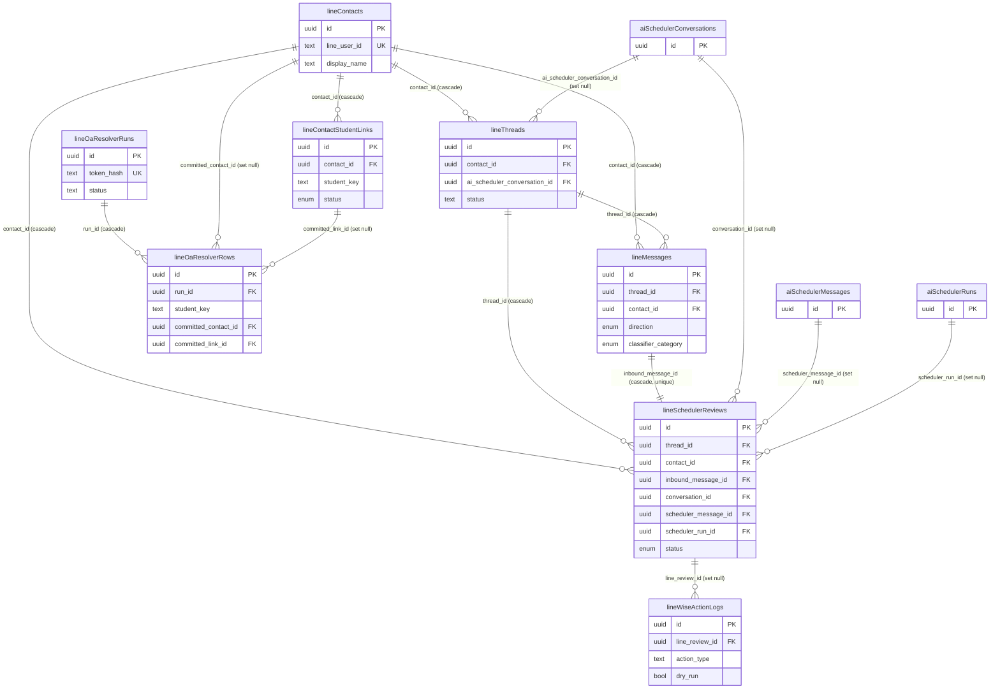

# Database Reference — LINE Domain

This document covers the eight tables that back the LINE Official Account (OA) integration: contact identity, conversation threads and messages, contact↔student linking, the human-in-the-loop AI scheduler review queue, the Wise writeback audit log, and the OA resolver worklist used to attach LINE chats to credit-control students.

All tables are defined in `src/lib/db/schema.ts`. Line ranges are cited per table below. Enum value sets are defined at `src/lib/db/schema.ts:108-132`.

For the full column-by-column listing (types, defaults, indexes) see the database [index](./index.md). This page documents grain, keys, and relationships only — it does not restate every column.

## ER Diagram

Core/sibling tables referenced from this domain (`aiSchedulerConversations`, `aiSchedulerMessages`, `aiSchedulerRuns`) are shown as stub nodes; they are owned by the AI scheduler domain, not here.

## Tables

### `lineContacts` (schema.ts:1666-1683)

One row per LINE user (the identity that messages the OA). Keyed by `id` (uuid); `line_user_id` is unique (`line_contacts_user_id_idx`), making it the natural external key from LINE webhook payloads. Carries the LINE profile snapshot (`display_name`, `picture_url`, `status_message`, full `profile_raw` jsonb) plus loose human-entered labels (`linked_parent_label`, `linked_student_label`) and `first_seen_at` / `last_seen_at` lifecycle timestamps. This is the hub of the domain: threads, messages, student links, scheduler reviews, and committed resolver rows all reference it.

### `lineThreads` (schema.ts:1684-1699)

One row per LINE conversation thread, one-to-one with a contact in practice — `line_user_id` is unique (`line_threads_user_id_idx`). References `lineContacts.id` via `contact_id` (cascade delete) and optionally links to the AI scheduler conversation it drives through `ai_scheduler_conversation_id` → `aiSchedulerConversations.id` (set null on delete). `status` defaults to `"active"` (free-text, not an enum). `last_message_at` tracks recency for inbox sorting.

### `lineMessages` (schema.ts:1700-1734)

One row per inbound or outbound LINE message event. References both `lineThreads.id` (`thread_id`, cascade) and `lineContacts.id` (`contact_id`, cascade). `direction` is the `line_message_direction` enum (`inbound` | `outbound`). Idempotency is enforced by two unique indexes — `webhook_event_id` (`line_messages_webhook_event_idx`) and `line_message_id` (`line_messages_line_message_idx`) — so re-delivered webhooks do not duplicate rows. Beyond the raw message fields (`message_type`, `text`, `reply_token`, `event_timestamp`, `is_redelivery`, `is_retracted`, `raw` jsonb), the row carries the inline classifier verdict (`classifier_category` of enum `line_scheduler_classifier_category`: `scheduling_request` | `scheduling_change` | `non_scheduling` | `unclear`, plus `classifier_confidence`/`classifier_summary`/`classifier_payload`/`classified_at`) and a separate human review-of-classification block (`classification_reviewed_*` columns).

### `lineContactStudentLinks` (schema.ts:1735-1773)

One row per (contact, student) association — a suggested or confirmed link between a LINE contact and a Wise student. References `lineContacts.id` (`contact_id`, cascade). Uniqueness is on `(contact_id, student_key)` (`line_contact_student_links_contact_student_idx`). `status` is the `line_contact_student_link_status` enum (`suggested` | `verified` | `rejected`, default `suggested`). Identifies the student by `wise_student_id` / `student_key` / `student_name` (plus `parent_name`), records match `confidence` and `evidence` jsonb, a reviewer block (`reviewed_by_*`/`reviewed_at`), and a validation-workbench assignment block (`validation_assigned_to_*`, `validation_assigned_run_id`, `validation_assigned_at`, `validation_note`). Note `validation_assigned_run_id` is a plain uuid column with no FK constraint in this definition.

### `lineSchedulerReviews` (schema.ts:1774-1822)

One row per inbound message that enters the human-in-the-loop scheduler review queue — the central record where a staff member approves, edits, or rejects an AI-drafted reply before it is sent back over LINE. The grain is one review per inbound message: `inbound_message_id` → `lineMessages.id` is unique (`line_scheduler_reviews_inbound_message_idx`, cascade). It also references `lineThreads.id` (`thread_id`, cascade) and `lineContacts.id` (`contact_id`, cascade), and three AI scheduler tables with set-null semantics: `conversation_id` → `aiSchedulerConversations.id`, `scheduler_message_id` → `aiSchedulerMessages.id`, `scheduler_run_id` → `aiSchedulerRuns.id`. `classifier_category` (same classifier enum) is required here. `status` is the `line_scheduler_review_status` enum (`pending_review` | `approved_sent` | `accepted_no_send` | `rejected` | `dismissed`, default `pending_review`). The bulk of the table captures the draft/decision lifecycle: intent (`intent_type`/`intent_payload`), the proposed and final reply text (`proposed_draft`, `selected_suggestion`, `final_text`), rejection/correction fields, tutor and student selections (`selected_tutor_ids`, `verified_student_keys`, `matched_student_keys`, `student_link_override`), candidate sessions and proposed Wise actions (`candidate_sessions`, `proposed_wise_actions`, `admin_selected_session_ids`), the LINE send outcome (`writeback_status`, `send_line_message_id`, `send_response`, `send_error`), and a reviewer block.

### `lineWiseActionLogs` (schema.ts:1823-1839)

One row per Wise writeback action attempt originating from a scheduler review — the audit trail for session changes pushed to Wise. References `lineSchedulerReviews.id` via `line_review_id` with **set null** on delete (so the log survives if its review is removed; the FK is nullable). `action_type` is free text; `status` defaults to `"dry_run"` and `dry_run` defaults to `true`, reflecting a dry-run-first writeback policy. Captures the affected `wise_session_ids`, the `request_payload` / `response_payload` jsonb, an `error_message`, and an actor block (`created_by_email`/`created_by_name`).

### `lineOaResolverRuns` (schema.ts:1840-1865)

One row per OA resolver run — a token-scoped batch job that walks a credit-control worklist to discover LINE OA chats for students. The run is addressed by a hashed token: `token_hash` is unique (`line_oa_resolver_runs_token_hash_idx`), with `token_prefix` stored for display. `status` defaults to `"active"` (free text) and `worklist_source` defaults to `"current_credit_control_snapshot"`. Holds denormalized progress counters (`total_rows`, `pending_rows`, `matched_rows`, `ambiguous_rows`, `no_match_rows`, `error_rows`, `needs_manual_code_rows`, `committed_rows`), an actor block, and a required `expires_at` (token expiry) plus `committed_at`. Parent of `lineOaResolverRows`.

### `lineOaResolverRows` (schema.ts:1866-1894)

One row per student worklist entry within a resolver run. References `lineOaResolverRuns.id` via `run_id` (cascade). Uniqueness is on `(run_id, student_key, search_code)` (`line_oa_resolver_rows_run_student_code_idx`). Identifies the student (`wise_student_id`, `student_key`, `student_name`, `parent_name`) and the discovered LINE chat (`line_oa_account_id`, `line_user_id`, `line_chat_url`, `chat_title`), with `search_code`, `match_mode`, `capture_mode`, `status` (default `"pending"`, free text), `error_message`, and `evidence` jsonb. On commit it points back into the live tables via `committed_contact_id` → `lineContacts.id` and `committed_link_id` → `lineContactStudentLinks.id`, both set null on delete — the bridge from a resolver run to the persistent contact/link records.

_Verified against HEAD `d4fe6d3` on 2026-06-05._
