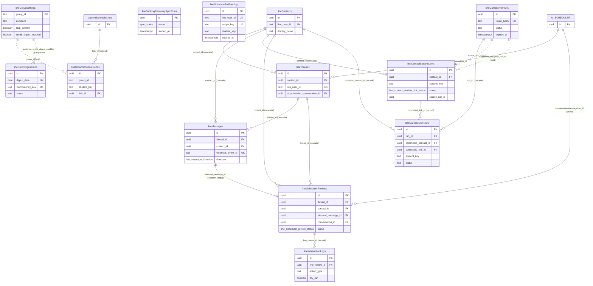

# Database Reference — LINE Domain (ER Diagram)

Schema for the LINE Official Account integration — **stable (scheduler write-path flag-gated)**. The write path into Wise is gated two ways: `lineWiseActionLogs.dryRun` defaults to `true` (`src/lib/db/schema.ts:2601`), and the whole LINE surface is disabled unless `ENABLE_LINE_SCHEDULER !== "false"` **and** both `LINE_CHANNEL_SECRET` and `LINE_CHANNEL_ACCESS_TOKEN` are set (`lineSchedulerEnabled()`, `src/lib/line/client.ts:19-23`).

This domain is the only one in the app whose primary write trigger is a **push**, not a cron pull: a LINE webhook POST is what creates contacts, threads and messages (`recordLineWebhookPayload`, `src/lib/line/data.ts:455-524`). Its 13 tables form four clusters around a single identity anchor, `line_contacts`:

1. **Conversation store** — `lineContacts` → `lineThreads` → `lineMessages`: the durable transcript of the OA inbox.
2. **Identity linkage** — `lineContactStudentLinks` (the contact ↔ student mapping every downstream gate consults), fed by the OA-resolver harvest pair (`lineOaResolverRuns` / `lineOaResolverRows`) and by the follower backlog-recovery job whose ledger table is `lineBacklogRecoverySyncRuns`.
3. **AI review queue** — `lineSchedulerReviews` (one review per inbound message) with its `lineWiseActionLogs` audit trail.
4. **Bots** — `lineScheduleBotPending`, `lineGroupSettings`, `lineGroupScheduleSends`, `lineCreditDigestRuns`: the confirm gate, per-chat audience + instant-mode settings, the schedule-delivery audit, and the daily credit-runout digest ledger.

Four Postgres enums are LINE-specific: `line_message_direction` (`inbound` / `outbound`, `schema.ts:110-113`), `line_scheduler_classifier_category` (`scheduling_request` / `scheduling_change` / `non_scheduling` / `unclear`, `:115-120`), `line_scheduler_review_status` (`pending_review` / `approved_sent` / `accepted_no_send` / `rejected` / `dismissed`, `:122-128`), and `line_contact_student_link_status` (`suggested` / `verified` / `rejected`, `:130-134`). `lineBacklogRecoverySyncRuns` reuses the shared `sync_status` enum (`running` / `success` / `failed`, `:21-25`). See [enums.md](./enums.md).

Full per-column type and constraint detail lives in [index.md](./index.md) — this page covers grain, keys, and relationships only. For purpose, business rules, and flows see [../../features/line-integration.md](../../features/line-integration.md).

## Scope

Exactly 13 tables, all declared in `src/lib/db/schema.ts`:

| Table (varName) | SQL name | schema.ts lines |
|---|---|---|
| `lineContacts` | `line_contacts` | 2437–2454 |
| `lineThreads` | `line_threads` | 2455–2470 |
| `lineMessages` | `line_messages` | 2471–2505 |
| `lineContactStudentLinks` | `line_contact_student_links` | 2506–2546 |
| `lineSchedulerReviews` | `line_scheduler_reviews` | 2547–2595 |
| `lineWiseActionLogs` | `line_wise_action_logs` | 2596–2612 |
| `lineOaResolverRuns` | `line_oa_resolver_runs` | 2613–2638 |
| `lineOaResolverRows` | `line_oa_resolver_rows` | 2639–2665 |
| `lineBacklogRecoverySyncRuns` | `line_backlog_recovery_sync_runs` | 2666–2687 |
| `lineScheduleBotPending` | `line_schedule_bot_pending` | 4668–4699 |
| `lineGroupSettings` | `line_group_settings` | 4700–4739 |
| `lineCreditDigestRuns` | `line_credit_digest_runs` | 4740–4759 |
| `lineGroupScheduleSends` | `line_group_schedule_sends` | 4760–4772 |

## ER Diagram

```mermaid
erDiagram
    lineContacts {
        uuid id PK
        text line_user_id UK
        text display_name
    }
    lineThreads {
        uuid id PK
        uuid contact_id FK
        text line_user_id UK
        uuid ai_scheduler_conversation_id FK
    }
    lineMessages {
        uuid id PK
        uuid thread_id FK
        uuid contact_id FK
        text webhook_event_id UK
        line_message_direction direction
    }
    lineContactStudentLinks {
        uuid id PK
        uuid contact_id FK
        text student_key
        line_contact_student_link_status status
        uuid source_run_id
    }
    lineSchedulerReviews {
        uuid id PK
        uuid thread_id FK
        uuid contact_id FK
        uuid inbound_message_id FK
        uuid conversation_id FK
        line_scheduler_review_status status
    }
    lineWiseActionLogs {
        uuid id PK
        uuid line_review_id FK
        text action_type
        boolean dry_run
    }
    lineOaResolverRuns {
        uuid id PK
        text token_hash UK
        text status
        timestamptz expires_at
    }
    lineOaResolverRows {
        uuid id PK
        uuid run_id FK
        uuid committed_contact_id FK
        uuid committed_link_id FK
        text student_key
        text status
    }
    lineBacklogRecoverySyncRuns {
        uuid id PK
        sync_status status
        timestamptz started_at
    }
    lineScheduleBotPending {
        uuid id PK
        text line_user_id UK
        text scope_key UK
        text student_key
        timestamptz expires_at
    }
    lineGroupSettings {
        text group_id PK
        text audience
        boolean skip_confirm
        boolean credit_digest_enabled
    }
    lineCreditDigestRuns {
        uuid id PK
        date digest_date UK
        text idempotency_key UK
        text status
    }
    lineGroupScheduleSends {
        uuid id PK
        text group_id
        text student_key
        uuid link_id FK
    }
    AI_SCHEDULER {
        uuid id PK
    }
    studentScheduleLinks {
        uuid id PK
    }

    lineContacts ||--o{ lineThreads : "contact_id (cascade)"
    lineContacts ||--o{ lineMessages : "contact_id (cascade)"
    lineContacts ||--o{ lineContactStudentLinks : "contact_id (cascade)"
    lineContacts ||--o{ lineSchedulerReviews : "contact_id (cascade)"
    lineContacts ||--o{ lineOaResolverRows : "committed_contact_id (set null)"
    lineThreads ||--o{ lineMessages : "thread_id (cascade)"
    lineThreads ||--o{ lineSchedulerReviews : "thread_id (cascade)"
    lineMessages ||--o| lineSchedulerReviews : "inbound_message_id (cascade, unique)"
    lineSchedulerReviews ||--o{ lineWiseActionLogs : "line_review_id (set null)"
    lineOaResolverRuns ||--o{ lineOaResolverRows : "run_id (cascade)"
    lineContactStudentLinks ||--o{ lineOaResolverRows : "committed_link_id (set null)"
    lineOaResolverRuns ||..o{ lineContactStudentLinks : "source_run_id (soft)"
    lineOaResolverRuns ||..o{ lineContactStudentLinks : "validation_assigned_run_id (soft)"
    studentScheduleLinks ||--o{ lineGroupScheduleSends : "link_id (set null)"
    AI_SCHEDULER ||--o{ lineThreads : "ai_scheduler_conversation_id (set null)"
    AI_SCHEDULER ||--o{ lineSchedulerReviews : "conversation/message/run_id (set null)"
    lineGroupSettings ||..o{ lineGroupScheduleSends : "group_id (soft)"
    lineGroupSettings ||..o{ lineCreditDigestRuns : "audience+credit_digest_enabled (query-time)"
```

`AI_SCHEDULER` and `studentScheduleLinks` are **stub nodes** standing in for tables owned by other pages — `aiSchedulerConversations` (`schema.ts:2347`), `aiSchedulerMessages` (`:2368`) and `aiSchedulerRuns` (`:2386`) belong to [erd-ai-and-proposals.md](./erd-ai-and-proposals.md), and `studentScheduleLinks` (`:4635`) to [erd-core.md](./erd-core.md). They appear only to anchor the edges.

Dotted edges are **soft** references with no database foreign key: `lineContactStudentLinks.sourceRunId` and `.validationAssignedRunId` are bare `uuid` columns (`schema.ts:2517`, `:2524`), and the schedule-bot / digest tables join to `lineGroupSettings` on a plain `group_id` text value.

Four tables carry **no foreign key at all** — `lineBacklogRecoverySyncRuns`, `lineScheduleBotPending`, `lineGroupSettings`, and `lineCreditDigestRuns`.

## Tables

### `lineContacts` (`line_contacts`)

**Grain:** one row per LINE user id ever seen by the Official Account.

`id` is a uuid PK (`defaultRandom()`), but the natural key is `line_user_id`, carrying `line_contacts_user_id_idx` as a **unique** index (`schema.ts:2451`) — that index is the upsert target in `upsertLineContact()`, which writes `onConflictDoUpdate` on `lineUserId` and refreshes `displayName` / `pictureUrl` / `statusMessage` / `profileRaw` only when a profile was actually fetched (`?? undefined` leaves the stored value alone, `src/lib/line/data.ts:322-344`). `first_seen_at` and `last_seen_at` both default to now; `last_seen_at` is indexed (`:2452`). The full LINE profile payload is preserved in `profile_raw` (jsonb, default `{}`); `linked_parent_label` / `linked_student_label` are nullable display conveniences.

**Relationships:** the hub of the domain. FK target for `lineThreads.contactId`, `lineMessages.contactId`, `lineContactStudentLinks.contactId`, and `lineSchedulerReviews.contactId` — all `onDelete: "cascade"` — plus `lineOaResolverRows.committedContactId` (`onDelete: "set null"`). Deleting a contact therefore erases its transcript, its student links, and its reviews, while leaving the resolver worklist row in place with a nulled pointer.

### `lineThreads` (`line_threads`)

**Grain:** one row per LINE conversation — in practice one per contact.

`contact_id` (uuid, NOT NULL) references `lineContacts.id` with cascade delete (`schema.ts:2457`). The FK alone would allow many threads per contact, but `line_threads_user_id_idx` is a **unique** index on `line_user_id` (`:2466`) and `getOrCreateLineThread()` upserts on exactly that column (`src/lib/line/data.ts:389-405`), so the relationship is effectively 1:1. `status` is text defaulting to `"active"`; `last_message_at` (indexed, `:2468`) is bumped on every stored message.

`ai_scheduler_conversation_id` is a nullable FK to `aiSchedulerConversations.id` with `onDelete: "set null"` (`:2459-2460`, indexed at `:2467`) — purging an AI conversation must not destroy the LINE thread.

**Relationships:** child of `lineContacts`; parent of `lineMessages` and `lineSchedulerReviews`; optional pointer into the AI-scheduler domain.

### `lineMessages` (`line_messages`)

**Grain:** one row per stored LINE message event — inbound webhook events and outbound sends alike.

`thread_id` and `contact_id` are both NOT NULL FKs with cascade delete (`schema.ts:2473-2474`). `direction` uses the `line_message_direction` enum. **Two** unique indexes provide idempotency: `line_messages_webhook_event_idx` on `webhook_event_id` and `line_messages_line_message_idx` on `line_message_id` (`:2499-2500`). The webhook writer inserts with `onConflictDoNothing({ target: webhookEventId })` and counts a non-returning insert as a duplicate event (`src/lib/line/data.ts:501-518`), which is what makes LINE's at-least-once redelivery safe; `is_redelivery` records the delivery-context flag separately.

Retraction is soft: an `unsend` event flips `is_retracted` and stamps `retracted_at` on the row matched by `line_message_id`, never deleting it (`src/lib/line/data.ts:474-481`).

The classifier columns are a second write pass over the same row — `classifier_category` / `classifier_confidence` / `classifier_summary` / `classifier_payload` / `classified_at`, indexed as `(classifier_category, classified_at)` (`:2502`) — and the `classification_reviewed_*` quintet holds the human correction of that verdict, indexed as `(classification_reviewed_category, classification_reviewed_at)` (`:2503`). The raw webhook event is kept whole in `raw` (jsonb, default `{}`). Only text messages are persisted; other message types are counted as ignored (`src/lib/line/data.ts:490-495`).

**Relationships:** child of `lineThreads` and `lineContacts`; parent (1:1) of `lineSchedulerReviews` via that table's unique `inbound_message_id`.

### `lineContactStudentLinks` (`line_contact_student_links`)

**Grain:** one row per (LINE contact, student) claim — the identity mapping the whole domain gates on.

`contact_id` (uuid, NOT NULL, cascade) references `lineContacts.id` (`schema.ts:2508`), and `line_contact_student_links_contact_student_idx` makes `(contact_id, student_key)` **unique** (`:2530`) — the composite that defines the grain. `status` uses `line_contact_student_link_status` and defaults to `suggested`; a link only unlocks downstream sends once it is `verified`. `confidence` (`doublePrecision`) and `evidence` (jsonb, default `{}`) carry the match rationale; `wise_student_id`, `student_name` are NOT NULL and `parent_name` defaults to `""`.

`is_phantom` (boolean, default false) quarantines rows whose contact is not a real LINE user: every active read filters `isPhantom = false` (`src/lib/line/link-validation.ts:248`, `:737`; `src/lib/line/student-links.ts:765`), and only the explicit `"phantom"` archive scope selects them (`link-validation.ts:422-431`). The schedule bot's send gate is the strictest reader — `status = 'verified'` **and** `isPhantom = false` (`src/lib/line/schedule-bot.ts:159-162`).

Provenance and worklist state share the table. `source_kind` / `source_run_id` record which OA-resolver run produced the row, and the four `validation_assigned_*` columns assign a suggested link to a named reviewer; `reviewed_by_email` / `reviewed_by_name` / `reviewed_at` / `validation_note` capture the verdict. Neither `source_run_id` nor `validation_assigned_run_id` declares a `.references()` — both are plain uuid columns (`:2517`, `:2524`). Nine indexes support the review queue, three of them **partial** indexes scoped to `source_kind = 'line_oa_resolver'` (`:2536-2544`), the last additionally narrowed to `status IN ('verified','rejected')`.

Verifying a link has a side effect beyond this table: `pending_review` scheduler rows for the same contact are re-planned inline so `matchedStudentKeys` and `writebackStatus` reflect the new identity, fail-isolated per row (IDENT-06, `src/lib/line/link-validation.ts:747-796`).

**Relationships:** child of `lineContacts`; referenced by `lineOaResolverRows.committedLinkId` (`set null`); soft-linked to `lineOaResolverRuns` through `source_run_id` / `validation_assigned_run_id`.

### `lineSchedulerReviews` (`line_scheduler_reviews`)

**Grain:** one row per inbound message that entered the AI review queue.

`inbound_message_id` (uuid, NOT NULL, cascade) references `lineMessages.id` and carries a **unique** index (`schema.ts:2551-2553`, `:2590`), which is what pins the grain; the creator inserts with `onConflictDoNothing` on that target and then re-reads the row, so a reprocessed message can never spawn a second review (`src/lib/line/data.ts:753-779`). `thread_id` and `contact_id` are NOT NULL cascade FKs (`:2549-2550`). Three nullable FKs point into the AI-scheduler domain — `conversation_id`, `scheduler_message_id`, `scheduler_run_id` — all `onDelete: "set null"` (`:2554-2559`).

`classifier_category` is NOT NULL here (unlike on the message), and `status` uses `line_scheduler_review_status` defaulting to `pending_review`. The draft/decision columns are `proposed_draft` (NOT NULL, default `""`), `selected_suggestion`, `final_text`, `rejection_reason`, `reason_category`, and `staff_correction`. Operational planning state lives in `intent_type` (default `"new_request"`), `intent_payload`, `matched_student_keys`, `verified_student_keys`, `candidate_sessions`, `proposed_wise_actions`, `admin_selected_session_ids` and `selected_tutor_ids` — all jsonb with non-null defaults. `student_link_override` (boolean, default false) records that a human bypassed the identity gate. `writeback_status` is plain text defaulting to `"not_applicable"`. Send telemetry is `send_line_message_id` / `send_response` / `send_error`; sign-off is `reviewed_by_email` / `reviewed_by_name` / `reviewed_at`. Indexes cover `(status, created_at)`, `conversation_id`, and `(intent_type, created_at)` (`:2591-2593`).

**Relationships:** child of `lineMessages` (1:1), `lineThreads`, and `lineContacts`; optional child of three AI-scheduler tables; parent of `lineWiseActionLogs`.

### `lineWiseActionLogs` (`line_wise_action_logs`)

**Grain:** one row per attempted Wise action originating from a LINE review — dry run or real.

`line_review_id` is a **nullable** FK to `lineSchedulerReviews.id` with `onDelete: "set null"` (`schema.ts:2598`), so the audit entry outlives the review it came from. `status` defaults to `"dry_run"` and `dry_run` defaults to `true` — and the writer preserves that bias, defaulting both when the caller omits them (`createLineWiseActionLog()`, `src/lib/line/data.ts:1010-1024`). `action_type` is free text; `wise_session_ids` is a jsonb string array (default `[]`); `request_payload` (default `{}`), `response_payload` (nullable) and `error_message` capture the exchange, with `created_by_email` / `created_by_name` as the actor. One index on `(line_review_id, created_at)` (`:2610`) backs the per-review timeline read (`:1033-1036`).

**Relationships:** optional child of `lineSchedulerReviews`; no other FKs.

### `lineOaResolverRuns` (`line_oa_resolver_runs`)

**Grain:** one row per OA-resolver harvest session — a token-authenticated worklist handed to an operator.

`token_hash` carries a **unique** index (`line_oa_resolver_runs_token_hash_idx`, `schema.ts:2634`) and is the authentication key: the run id and a 32-byte secret are concatenated into the bearer token, only its hash is stored, and `token_prefix` keeps a non-secret display fragment (`createLineOaResolverRun()`, `src/lib/line/oa-resolver.ts:540-570`). Authentication additionally requires `expires_at > now()` (`:598-603`), so this table — not the middleware — is what gates the two public resolver endpoints. `status` defaults to `"active"`; `worklist_source` defaults to `"current_credit_control_snapshot"`, naming where the worklist came from. Eight integer counters (`total_rows` … `committed_rows`, all default 0) are seeded at creation and recomputed from the child rows afterwards (`:474-482`). Indexes cover `(status, created_at)` and `(created_by_email, created_at)` (`:2635-2636`).

**Relationships:** parent of `lineOaResolverRows` (cascade); soft parent of `lineContactStudentLinks` via that table's `source_run_id` / `validation_assigned_run_id`.

### `lineOaResolverRows` (`line_oa_resolver_rows`)

**Grain:** one row per (run, student, search code) worklist entry.

`run_id` (uuid, NOT NULL) references `lineOaResolverRuns.id` with cascade delete (`schema.ts:2641`); `line_oa_resolver_rows_run_student_code_idx` makes `(run_id, student_key, search_code)` **unique** (`:2661`), with lookup indexes on `(run_id, status)` and `line_user_id` (`:2662-2663`). `status` is plain text defaulting to `"pending"` and moves through `matched` / `ambiguous` / `needs_manual_code` / `committed` as the operator works (`src/lib/line/oa-resolver.ts:649-668`, `:1068-1080`). The harvested LINE identifiers — `line_oa_account_id`, `line_user_id`, `line_chat_url`, `chat_title` — plus `match_mode`, `capture_mode`, `error_message` and an `evidence` jsonb (default `{}`) record how the match was made; a sibling fan-out copies one row's candidates onto same-parent rows in the same run (`:670-700`).

Commit is where the row leaves the worklist and enters durable identity: the contact is upserted and a link is written **as `suggested`, never `verified`**, with `sourceKind: "line_oa_resolver"` and `sourceRunId` stamped (`:919-944`); the row then flips to `committed` and records `committed_contact_id` / `committed_link_id` (`:1068-1080`). Both pointers are nullable FKs with `onDelete: "set null"` (`schema.ts:2656-2657`), so deleting the contact or the link leaves the audit row standing.

**Relationships:** child of `lineOaResolverRuns`; optional child of `lineContacts` and `lineContactStudentLinks`.

### `lineBacklogRecoverySyncRuns` (`line_backlog_recovery_sync_runs`)

**Grain:** one row per LINE follower backlog-recovery attempt (IDENT-07).

A standalone `*_sync_runs` ledger with no FKs. `status` uses the shared `sync_status` enum defaulting to `running`, and `line_backlog_recovery_sync_runs_single_running_idx` is a **partial unique index on `status` where `status = 'running'`** (`schema.ts:2680-2682`) — single-flight enforced in Postgres, one run at a time table-wide. `trigger_type` is NOT NULL text; `started_at` defaults to now with a nullable `finished_at`; `follower_count`, `targets_count`, `matched_count`, `inserted_count` are integers defaulting to 0, alongside `dry_run` (default false), `error_summary`, and a `metadata` jsonb (default `{}`). A second index covers `(status, started_at)` (`:2683`).

The job it describes does exist: `runLineBacklogRecovery()` fetches the full LINE follower roster, matches fresh display names against human-verified resolver targets, and inserts **only** `status: "suggested"` links (`src/lib/line/backlog-recovery.ts:1-19`, `:131-151`), exposed at `GET /api/internal/line-backlog-recovery` (`maxDuration = 300`) and registered `manualOnly: true` with no `vercel.json` entry (`src/lib/data-health/cron-registry.ts:384-397`). But see [Open Questions](#open-questions): nothing writes this ledger.

**Relationships:** none.

### `lineScheduleBotPending` (`line_schedule_bot_pending`)

**Grain:** one row per (operator LINE user, scope) outstanding schedule-send confirmation — at most one live confirm per admin per chat.

`line_schedule_bot_pending_scope_idx` is a **unique** index on `(line_user_id, scope_key)` (`schema.ts:4685`), and both writers upsert on exactly that pair (`src/lib/line/schedule-bot.ts:467-497`, `src/lib/line/schedule-bot-group.ts:595-604`), so a new request replaces the operator's previous pending confirm rather than queuing behind it. `scope_key` defaults to `"dm"` — the literal `DM_SCOPE` used by the direct-message bot (`schedule-bot.ts:190`) — while the group bot writes `` `group:${groupId}` `` (`scopeKeyFor()`, `schedule-bot-group.ts:141-143`); `group_id` is nullable and set only in the group case.

The row is the whole confirm payload: `student_key`, `wise_student_id`, `student_name`, `parent_name`, `month_key`, `session_count`, and the destination pair `target_line_user_id` / `target_display_name`, both NOT NULL but defaulting to `""` — deliberately empty for a group command, where the destination is the chat rather than a person (schema comment, `schema.ts:4677`). `expires_at` is NOT NULL: the confirm handler treats an expired row as no row, deletes it, and refuses to send (SCHED-BOT-03, `schedule-bot.ts:528-534`). Rows are deleted, not marked done, once acted on (`:206-212`, `schedule-bot-group.ts:490-496`).

**Relationships:** none — `line_user_id`, `group_id`, and `student_key` are all bare text.

### `lineGroupSettings` (`line_group_settings`)

**Grain:** one row per LINE group chat that has been set up for a bot. `group_id` is the text **primary key**.

`audience` (NOT NULL text) selects wording only — `"family"` → Thai parent template, `"staff"` → English admin template — and grants nothing (schema comment, `schema.ts:4688-4703`). `skip_confirm` (default false) is the one setting that relaxes a gate: while set, the per-student YES confirmation is skipped for that chat (GRP-BOT-07). It is fail-closed at both ends — the toggle refuses when the chat has no registered audience (`setGroupConfirmMode()`, `src/lib/line/schedule-bot-group.ts:228-243`), and changing the audience deliberately does **not** reset it, the upsert's `set` clause omitting `skipConfirm` on purpose (`:210-218`).

The credit-bot columns — `credit_digest_enabled` (default false), `credit_digest_set_by_line_user_id`, `credit_digest_updated_at` — are written by the in-chat `/credit setup` command (`src/lib/line/credit-bot.ts:301-313`). Enablement is not trusted at send time: the digest re-selects on `audience = 'staff' AND credit_digest_enabled = true` (CRED-BOT-G1, `src/lib/line/credit-digest.ts:306-314`), so a chat later flipped to `family` silently stops receiving it. A separate raw read treats any value other than exactly `"staff"` as not-a-staff-chat (`credit-bot.ts:114-121`). `set_by_line_user_id` is NOT NULL; `created_at` / `updated_at` default to now.

**Relationships:** none enforced; joined by `group_id` text to `lineGroupScheduleSends`, and read as the target list for `lineCreditDigestRuns`.

### `lineCreditDigestRuns` (`line_credit_digest_runs`)

**Grain:** one row per Bangkok calendar day of the LINE credit-runout digest.

Two unique indexes: `digest_date` and `idempotency_key` (`schema.ts:4756-4757`). The date index **is** the single-flight guard — any existing row for the date, whatever its status, is terminal, so a same-day re-run short-circuits rather than posting twice (schema comment `:4733-4739`; `hasTerminalDigestForDate()`, `src/lib/line/credit-digest.ts:200-207`), and a lost concurrent race surfaces as Postgres `23505`, which the creator swallows into a `null` return (`:209-233`). `idempotency_key` is written as `` `line-credit-digest:${digestDate}` `` (`:218`).

`status` is plain text defaulting to `"pending"` and settles to `sent` / `partial` / `failed` from the per-group push tallies (`:388-401`) or to `skipped` when no staff chat has the digest enabled (`:326-334`). The counters split cleanly: `runs_out_count` / `already_out_count` describe the credit population, `group_count` the intended audience, and `attempted_count` / `success_count` / `failed_count` the delivery outcome, with `last_error` holding the final failure message. `sent_at` is set only when at least one push succeeded.

Its schema comment names `progress_test_admin_digest_runs` as the pattern this mirrors. The digest reads the active credit-control snapshot and its sessions/packages (`credit-digest.ts:185-198`, `:280-305`), but stores no snapshot id and declares no FK. It is driven by the daily cron `3 2 * * *` at `/api/internal/line-credit-digest` (`vercel.json:68-71`).

**Relationships:** none enforced.

### `lineGroupScheduleSends` (`line_group_schedule_sends`)

**Grain:** one row per schedule link actually delivered into a LINE group.

The table does double duty (schema comment, `schema.ts:4724-4732`): audit trail, and the "has this group already received this student?" lookup that decides whether a confirm step is required. `groupHasSeenStudent()` selects on `(group_id, student_key)` (`src/lib/line/schedule-bot-group.ts:246-259`), matching the `line_group_schedule_sends_group_student_idx` index (`:4770`); a second index covers `created_at` (`:4771`). Exact-code matching stops the wrong student being sent, and this table catches the other half — the right code typed into the wrong family's chat — by forcing a confirmation the first time a student appears in a given group (GRP-BOT-04).

`link_id` is a nullable FK to `studentScheduleLinks.id` with `onDelete: "set null"` (`:4767`), tying the delivery to the capability token that was minted; `group_id`, `student_key`, `student_name`, `month_key`, and `requested_by_line_user_id` are all NOT NULL text. The insert happens **after** a successful send and its failure is swallowed with a `console.error` (`schedule-bot-group.ts:760-777`), so the send is never rolled back by a failed audit write.

**Relationships:** optional child of core `studentScheduleLinks`; joined by `group_id` text to `lineGroupSettings`.

## Open Questions

- **`lineBacklogRecoverySyncRuns` has no writer.** A repo-wide search finds the varName only in `schema.ts`, and `line_backlog_recovery_sync_runs` only in `schema.ts`, `drizzle/0042_special_titania.sql`, and the drizzle meta snapshots — the orchestrator (`src/lib/line/backlog-recovery.ts`) and its cron route (`src/app/api/internal/line-backlog-recovery/route.ts`) never insert or update a run row, and rely on `withCronInvocationAudit` for observability instead. Is the ledger vestigial, or is the run-row write still to be built? Its partial unique index means single-flight is currently unenforced for this job.
- **`line_credit_digest_runs` is missing from the column inventory.** [index.md](./index.md) lists the other four late-added LINE tables (rows 256–259) but has no entry for `line_credit_digest_runs`, so this page currently links to a canonical home that does not describe the table. Should index.md be regenerated?
- **Line ranges in index.md are stale.** index.md gives `line_schedule_bot_pending` as 4660–4678 and `line_group_settings` as 4692–4706; at `main@0cd1e81` they are 4668–4699 and 4700–4739. The two pages disagree by roughly 8–33 lines across the late-added LINE tables.
- **`source_run_id` and `validation_assigned_run_id` are unenforced references.** Both are bare `uuid` columns on `lineContactStudentLinks` (`schema.ts:2517`, `:2524`) pointing at `lineOaResolverRuns.id`, and three partial indexes are built on `source_run_id` — but nothing stops a deleted run from stranding them. Intentional (so a purged run does not disturb committed identity) or an omission?
- **`lineThreads` is 1:1 with `lineContacts` by index, not by schema.** The unique index sits on `line_user_id` rather than `contact_id`, so a contact whose `line_user_id` were ever rewritten could accumulate a second thread. Is the one-thread-per-contact invariant meant to be structural?

_Verified against main@0cd1e81 (clean tree) on 2026-09-02._
