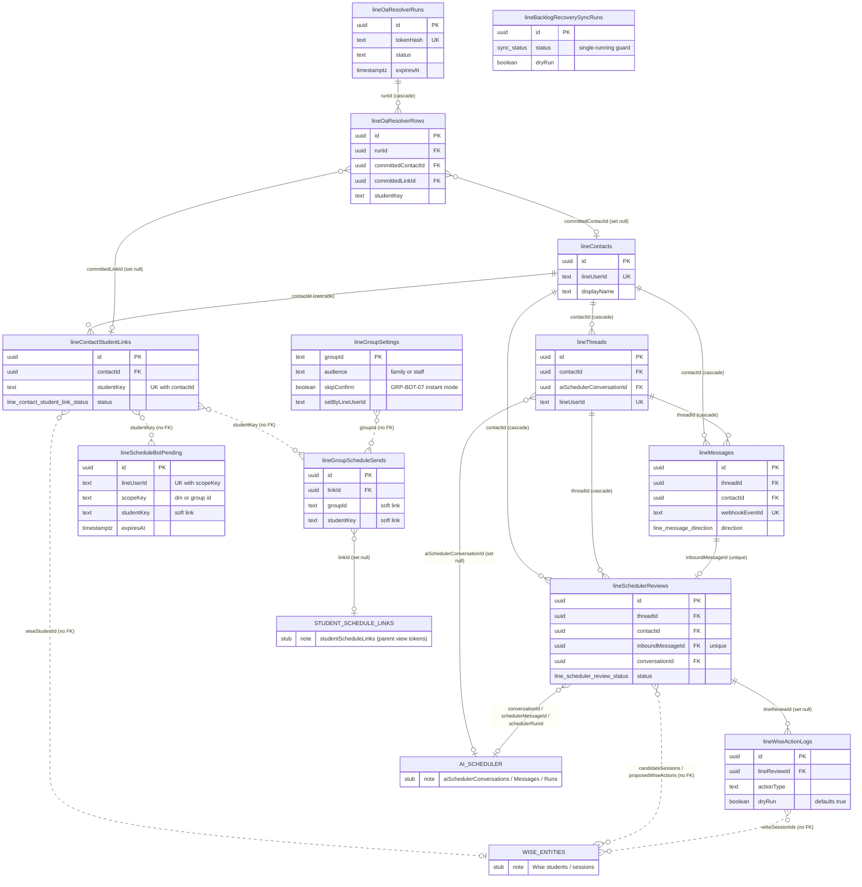

# Database Reference — LINE Domain (ER Diagram)

The LINE domain is the only subsystem in BGScheduler whose data arrives **push-first**: a LINE webhook POST is the write trigger, not a cron-driven pull. Its 12 tables fall into four clusters that share `line_contacts` as the single identity anchor:

1. **Conversation store** — `lineContacts` → `lineThreads` → `lineMessages`, the durable transcript of the Official Account inbox, written by `recordLineWebhookPayload` (`src/lib/line/data.ts:422-524`).
2. **Identity linkage** — `lineContactStudentLinks`, the (contact ↔ student) mapping every downstream write gate consults, plus the OA-resolver harvest tables (`lineOaResolverRuns` / `lineOaResolverRows`) and the backlog-recovery run ledger (`lineBacklogRecoverySyncRuns`) that feed it.
3. **AI review queue** — `lineSchedulerReviews` (one review per inbound message) and its `lineWiseActionLogs` audit trail; the Wise write path defaults to dry run (`dryRun` defaults to `true`, schema.ts:2598).
4. **Schedule bot** — `lineScheduleBotPending`, `lineGroupSettings`, `lineGroupScheduleSends`: the confirm gate, per-group audience + instant-mode flag, and delivery audit for pushing a parent-facing monthly schedule link into LINE.

Four Postgres enums are LINE-specific and appear throughout: `lineMessageDirectionEnum` (`inbound` / `outbound`, schema.ts:110–113), `lineSchedulerClassifierCategoryEnum` (`scheduling_request` / `scheduling_change` / `non_scheduling` / `unclear`, schema.ts:115–120), `lineSchedulerReviewStatusEnum` (`pending_review` / `approved_sent` / `accepted_no_send` / `rejected` / `dismissed`, schema.ts:122–128), and `lineContactStudentLinkStatusEnum` (`suggested` / `verified` / `rejected`, schema.ts:130–134). See [`./enums.md`](./enums.md).

All 12 tables below are defined in `src/lib/db/schema.ts`. Full per-column type and constraint detail lives in [`./index.md`](./index.md) — this page covers grain, keys, and relationships only. For purpose, business rules, and flows see [`../../features/line-integration.md`](../../features/line-integration.md).

## Scope

Exactly 12 tables (varName — `schema.ts` line range):

| Table (var) | Postgres table | Lines |
|---|---|---|
| `lineContacts` | `line_contacts` | 2434–2451 |
| `lineThreads` | `line_threads` | 2452–2467 |
| `lineMessages` | `line_messages` | 2468–2502 |
| `lineContactStudentLinks` | `line_contact_student_links` | 2503–2543 |
| `lineSchedulerReviews` | `line_scheduler_reviews` | 2544–2592 |
| `lineWiseActionLogs` | `line_wise_action_logs` | 2593–2609 |
| `lineOaResolverRuns` | `line_oa_resolver_runs` | 2610–2635 |
| `lineOaResolverRows` | `line_oa_resolver_rows` | 2636–2662 |
| `lineBacklogRecoverySyncRuns` | `line_backlog_recovery_sync_runs` | 2663–2684 |
| `lineScheduleBotPending` | `line_schedule_bot_pending` | 4660–4688 |
| `lineGroupSettings` | `line_group_settings` | 4692–4706 |
| `lineGroupScheduleSends` | `line_group_schedule_sends` | 4707–4719 |

## Relationship model

**`lineContacts.id` is the domain's hub.** It is the FK target for `lineThreads.contactId`, `lineMessages.contactId`, `lineContactStudentLinks.contactId`, and `lineSchedulerReviews.contactId` (all `onDelete: "cascade"`), plus `lineOaResolverRows.committedContactId` (`onDelete: "set null"`). Deleting a contact therefore removes its entire transcript, its student links, and its reviews, but leaves the OA-resolver worklist row intact with a nulled pointer.

**The conversation store is keyed by LINE identifiers, not surrogate ids.** `lineContacts.lineUserId` and `lineThreads.lineUserId` each carry a unique index (schema.ts:2448, 2463), so a contact and its thread are both upserted with `onConflictDoUpdate` on that column (`src/lib/line/data.ts:333-343`, `:396-403`). This makes threads **1:1 with contacts in practice** even though the FK alone would permit many.

**Cross-domain FKs into the AI scheduler.** `lineThreads.aiSchedulerConversationId` (schema.ts:2456–2457) and `lineSchedulerReviews.conversationId` / `.schedulerMessageId` / `.schedulerRunId` (schema.ts:2551–2556) reference the AI-scheduler tables (`aiSchedulerConversations` schema.ts:2344, `aiSchedulerMessages` schema.ts:2365, `aiSchedulerRuns` schema.ts:2383), all with `onDelete: "set null"` — a purged scheduler conversation must not delete the LINE audit trail. Those three appear below as a single `AI_SCHEDULER` stub node; see [`./erd-ai-and-proposals.md`](./erd-ai-and-proposals.md).

**One FK into the student-schedule domain.** `lineGroupScheduleSends.linkId` → `studentScheduleLinks.id` (`onDelete: "set null"`, schema.ts:4714) — the capability token minted for the public `/schedule/{token}` parent view (`studentScheduleLinks`, schema.ts:4627). Stubbed below.

**No FKs at all to Wise or to the core scheduling snapshot.** `wiseStudentId`, `studentKey`, `wiseSessionIds`, `groupId`, and `lineUserId` are loose strings everywhere they appear. In particular the three schedule-bot tables (`lineScheduleBotPending`, `lineGroupSettings`, `lineGroupScheduleSends`) declare **no** FK to `lineContacts` and join to everything else purely by `studentKey` / `groupId` / `lineUserId` text. `lineBacklogRecoverySyncRuns` has no FKs and no referents in either direction.

**Uniqueness that encodes a business rule** (rather than mere de-duplication):

- `line_messages_webhook_event_idx` on `webhookEventId` (schema.ts:2496) is the webhook idempotency key — ingest inserts with `onConflictDoNothing` on it and counts the miss as `duplicateEvents` (`src/lib/line/data.ts:516-520`).
- `line_scheduler_reviews_inbound_message_idx` on `inboundMessageId` (schema.ts:2587) makes the review queue exactly one row per inbound message; a second classification pass is a no-op (`src/lib/line/data.ts:777`).
- `line_contact_student_links_contact_student_idx` on (`contactId`, `studentKey`) (schema.ts:2527) makes a link idempotent per contact/student pair.
- `line_schedule_bot_pending_scope_idx` on (`lineUserId`, `scopeKey`) (schema.ts:4677) lets one admin hold a DM confirm and a group confirm at the same time without either clobbering the other.
- `line_backlog_recovery_sync_runs_single_running_idx` is a **partial** unique index on `status` where `status = 'running'` (schema.ts:2677–2679) — the same single-flight guard the other `*_sync_runs` tables use.

## ER diagram

```mermaid
erDiagram
    lineContacts {
        uuid id PK
        text lineUserId UK
        text displayName
    }
    lineThreads {
        uuid id PK
        uuid contactId FK
        uuid aiSchedulerConversationId FK
        text lineUserId UK
    }
    lineMessages {
        uuid id PK
        uuid threadId FK
        uuid contactId FK
        text webhookEventId UK
        line_message_direction direction
    }
    lineContactStudentLinks {
        uuid id PK
        uuid contactId FK
        text studentKey "UK with contactId"
        line_contact_student_link_status status
    }
    lineSchedulerReviews {
        uuid id PK
        uuid threadId FK
        uuid contactId FK
        uuid inboundMessageId FK "unique"
        uuid conversationId FK
        line_scheduler_review_status status
    }
    lineWiseActionLogs {
        uuid id PK
        uuid lineReviewId FK
        text actionType
        boolean dryRun "defaults true"
    }
    lineOaResolverRuns {
        uuid id PK
        text tokenHash UK
        text status
        timestamptz expiresAt
    }
    lineOaResolverRows {
        uuid id PK
        uuid runId FK
        uuid committedContactId FK
        uuid committedLinkId FK
        text studentKey
    }
    lineBacklogRecoverySyncRuns {
        uuid id PK
        sync_status status "single-running guard"
        boolean dryRun
    }
    lineScheduleBotPending {
        uuid id PK
        text lineUserId "UK with scopeKey"
        text scopeKey "dm or group id"
        text studentKey "soft link"
        timestamptz expiresAt
    }
    lineGroupSettings {
        text groupId PK
        text audience "family or staff"
        boolean skipConfirm "GRP-BOT-07 instant mode"
        text setByLineUserId
    }
    lineGroupScheduleSends {
        uuid id PK
        uuid linkId FK
        text groupId "soft link"
        text studentKey "soft link"
    }

    AI_SCHEDULER {
        stub note "aiSchedulerConversations / Messages / Runs"
    }
    STUDENT_SCHEDULE_LINKS {
        stub note "studentScheduleLinks (parent view tokens)"
    }
    WISE_ENTITIES {
        stub note "Wise students / sessions"
    }

    lineContacts ||--o{ lineThreads : "contactId (cascade)"
    lineContacts ||--o{ lineMessages : "contactId (cascade)"
    lineContacts ||--o{ lineContactStudentLinks : "contactId (cascade)"
    lineContacts ||--o{ lineSchedulerReviews : "contactId (cascade)"
    lineThreads ||--o{ lineMessages : "threadId (cascade)"
    lineThreads ||--o{ lineSchedulerReviews : "threadId (cascade)"
    lineMessages ||--o| lineSchedulerReviews : "inboundMessageId (unique)"
    lineSchedulerReviews ||--o{ lineWiseActionLogs : "lineReviewId (set null)"
    lineOaResolverRuns ||--o{ lineOaResolverRows : "runId (cascade)"
    lineOaResolverRows }o--o| lineContacts : "committedContactId (set null)"
    lineOaResolverRows }o--o| lineContactStudentLinks : "committedLinkId (set null)"
    lineGroupScheduleSends }o--o| STUDENT_SCHEDULE_LINKS : "linkId (set null)"

    lineThreads }o--o| AI_SCHEDULER : "aiSchedulerConversationId (set null)"
    lineSchedulerReviews }o--o| AI_SCHEDULER : "conversationId / schedulerMessageId / schedulerRunId"

    lineContactStudentLinks }o..o| WISE_ENTITIES : "wiseStudentId (no FK)"
    lineSchedulerReviews }o..o{ WISE_ENTITIES : "candidateSessions / proposedWiseActions (no FK)"
    lineWiseActionLogs }o..o{ WISE_ENTITIES : "wiseSessionIds (no FK)"
    lineContactStudentLinks }o..o{ lineScheduleBotPending : "studentKey (no FK)"
    lineContactStudentLinks }o..o{ lineGroupScheduleSends : "studentKey (no FK)"
    lineGroupSettings }o..o{ lineGroupScheduleSends : "groupId (no FK)"
```

> Dashed edges (`..`) are soft links by string identifier, not enforced foreign keys. `AI_SCHEDULER`, `STUDENT_SCHEDULE_LINKS`, and `WISE_ENTITIES` are stub nodes standing in for the AI-scheduler tables, the parent-schedule token table, and external Wise records; none is expanded here. `lineBacklogRecoverySyncRuns` is intentionally drawn with no edges — it has none.

## Per-table description

### `lineContacts` (schema.ts:2434–2451)
**Grain:** one row per LINE user the Official Account has seen — the identity anchor for the whole domain.
**Key columns:** `id` (PK); `lineUserId` (unique, schema.ts:2448); LINE profile mirror `displayName` / `pictureUrl` / `statusMessage`; `profileRaw` jsonb (default `{}`); admin-maintained `linkedParentLabel` / `linkedStudentLabel`; `firstSeenAt` / `lastSeenAt` / `createdAt` / `updatedAt`.
**Write path:** `upsertLineContact` inserts and `onConflictDoUpdate`s on `lineUserId`, refreshing `lastSeenAt` on every inbound event while leaving profile fields untouched when no profile was fetched (the set clause passes `undefined`, not `null` — `src/lib/line/data.ts:333-343`). The two label columns are set separately by `updateLineContactLabels` (`src/lib/line/data.ts:366-382`).
**Relationships:** parent of `lineThreads`, `lineMessages`, `lineContactStudentLinks`, and `lineSchedulerReviews` (all cascade). Referenced non-cascading by `lineOaResolverRows.committedContactId`. Secondary index on `lastSeenAt` (schema.ts:2449).

### `lineThreads` (schema.ts:2452–2467)
**Grain:** one row per 1:1 LINE conversation. The unique index on `lineUserId` (schema.ts:2463) makes this effectively one thread per contact — `getOrCreateLineThread` upserts on that column (`src/lib/line/data.ts:389-405`).
**Key columns:** `id` (PK); `contactId` (FK, not null, cascade); `lineUserId` (unique); `aiSchedulerConversationId` (nullable FK, set null); `status` (free-form `text`, default `"active"`); `lastMessageAt`; `createdAt` / `updatedAt`.
**Relationships:** child of `lineContacts`; parent of `lineMessages` and `lineSchedulerReviews`. `aiSchedulerConversationId` is written by `linkLineThreadConversation` (`src/lib/line/data.ts:408-420`) when a LINE thread is promoted into an AI-scheduler conversation. Indexes on `aiSchedulerConversationId` and `lastMessageAt` (schema.ts:2464–2465).
**Note:** `status` is plain `text`, not a Postgres enum, and no code path in `src/` moves it off the `"active"` default.

### `lineMessages` (schema.ts:2468–2502)
**Grain:** one row per message in a 1:1 thread, in **both** directions (`direction` is `lineMessageDirectionEnum`). Group and room messages are deliberately **not** persisted here — they are collected as transient `LineGroupCommand` objects and handed to the schedule bot instead (`src/lib/line/data.ts:441-461`).
**Key columns:** `id` (PK); `threadId` / `contactId` (FKs, not null, cascade); `direction`; LINE identifiers `lineMessageId` and `webhookEventId` (both uniquely indexed, schema.ts:2496–2497); `sourceType` (default `"user"`); `messageType`; `text`; `replyToken`; `eventTimestamp`; `isRedelivery`; the retraction pair `isRetracted` / `retractedAt`; the classifier block `classifierCategory` / `classifierConfidence` / `classifierSummary` / `classifierPayload` / `classifiedAt`; the human-correction block `classificationReviewedCategory` / `classificationReviewedCorrect` / `classificationReviewedByEmail` / `classificationReviewedByName` / `classificationReviewedAt`; `raw` jsonb (the full webhook event); `createdAt`.
**Idempotency:** ingest inserts with `onConflictDoNothing` targeting `webhookEventId`; a conflict increments `duplicateEvents` rather than erroring (`src/lib/line/data.ts:500-520`). LINE `unsend` events become an `UPDATE … SET isRetracted = true, retractedAt = now()` matched on `lineMessageId` — the row is never deleted (`src/lib/line/data.ts:475-480`).
**Two classification layers:** the classifier writes the `classifier*` columns; an admin correcting it writes the parallel `classificationReviewed*` columns instead of overwriting the model's output, which is what makes accuracy metrics computable (`src/lib/line/data.ts:1209-1217`). Separate indexes cover each layer (schema.ts:2499–2500), plus (`threadId`, `createdAt`) for transcript reads (schema.ts:2498).
**Outbound rows** are inserted by `insertOutboundLineMessage` with `direction: "outbound"`, `messageType: "text"`, and no `webhookEventId` (`src/lib/line/data.ts:969-993`).

### `lineContactStudentLinks` (schema.ts:2503–2543)
**Grain:** one row per (`contactId`, `studentKey`) pair — the claim that a given LINE user is associated with a given student. Unique on that pair (schema.ts:2527).
**Key columns:** `id` (PK); `contactId` (FK, not null, cascade); `wiseStudentId` / `studentKey` / `studentName` / `parentName`; `status` (`lineContactStudentLinkStatusEnum`, default `suggested`); `confidence` (double); `evidence` jsonb; provenance `sourceKind` / `sourceRunId`; the quarantine flag `isPhantom` (default false); reviewer audit `reviewedByEmail` / `reviewedByName` / `reviewedAt`; the validation-assignment block `validationAssignedToEmail` / `validationAssignedToName` / `validationAssignedRunId` / `validationAssignedAt` / `validationNote`; `createdAt` / `updatedAt`.
**Fail-closed rule (IDENT-02):** automated producers **always** write `status: "suggested"`, never `"verified"` — the message-content matcher (`src/lib/line/student-links.ts:519`), the OA-resolver commit (`src/lib/line/oa-resolver.ts:938`, which additionally preserves an existing `verified` status rather than downgrading it, `:909`), and the backlog-recovery job (stated invariant, `src/lib/line/backlog-recovery.ts:18`). Only a human review flips a row to `verified`.
**`isPhantom` (D-04 / IDENT-05):** quarantines OA-resolver rows harvested from a chat-surface namespace whose `lineUserId` values are not usable Messaging-API IDs. Every active read filters `isPhantom = false` via `realContactCondition()` (`src/lib/line/link-validation.ts:246-248`, also `:737`; `src/lib/line/student-links.ts:734`; `src/lib/line/schedule-bot.ts:157`); the dedicated `"phantom"` scope is the archive view that returns only quarantined rows, with no status constraint (`src/lib/line/link-validation.ts:422-431`).
**Indexing:** eight indexes (schema.ts:2527–2541), three of which are **partial**, filtered to `sourceKind = 'line_oa_resolver'` — they back the resolver validation worklist's run-scoped, assignee-scoped, and reviewed-history sort orders.
**Relationships:** child of `lineContacts`; referenced by `lineOaResolverRows.committedLinkId`. Soft-linked by `studentKey` to the schedule-bot tables and to Wise student records.

### `lineSchedulerReviews` (schema.ts:2544–2592)
**Grain:** exactly one row per inbound message that entered the AI review queue — enforced by the unique index on `inboundMessageId` (schema.ts:2587), so re-processing is a no-op (`onConflictDoNothing`, `src/lib/line/data.ts:777`).
**Key columns:** `id` (PK); `threadId` / `contactId` / `inboundMessageId` (FKs, not null, cascade); the nullable AI-scheduler triple `conversationId` / `schedulerMessageId` / `schedulerRunId` (set null); the classifier snapshot `classifierCategory` (not null) / `classifierConfidence` / `classifierSummary` / `classifierPayload`; `status` (`lineSchedulerReviewStatusEnum`, default `pending_review`); the operational plan `intentType` (default `"new_request"`) / `intentPayload`; the draft `proposedDraft` / `selectedSuggestion` / `finalText`; the rejection-feedback triple `rejectionReason` / `reasonCategory` / `staffCorrection`; `selectedTutorIds`; the student-gate columns `studentLinkOverride` / `verifiedStudentKeys` / `matchedStudentKeys`; the Wise-action plan `candidateSessions` / `proposedWiseActions` / `adminSelectedSessionIds` / `writebackStatus` (default `"not_applicable"`); send outcome `sendLineMessageId` / `sendResponse` / `sendError`; reviewer audit `reviewedByEmail` / `reviewedByName` / `reviewedAt`; `createdAt` / `updatedAt`.
**Student-link gate:** approval requires at least one verified student key unless the reviewer sets `studentLinkOverride` explicitly (`src/lib/line/review-service.ts:478`), and the override is persisted on the row (`:497`, `:565`) so the exception is auditable rather than invisible.
**Relationships:** child of `lineThreads`, `lineContacts`, and `lineMessages`; parent of `lineWiseActionLogs`. Also read cross-domain by the AI-scheduler data layer (`src/lib/ai/scheduler-data.ts:227`). Indexes on (`status`, `createdAt`), `conversationId`, and (`intentType`, `createdAt`) (schema.ts:2588–2590).

### `lineWiseActionLogs` (schema.ts:2593–2609)
**Grain:** one row per attempted Wise mutation originating from a LINE review — the append-only audit of the write path.
**Key columns:** `id` (PK); `lineReviewId` (nullable FK, set null — the log outlives its review); `actionType` (free-form `text`); `status` (default `"dry_run"`); `dryRun` (boolean, **default true**, schema.ts:2598); `wiseSessionIds` jsonb array; `requestPayload` / `responsePayload` jsonb; `errorMessage`; actor audit `createdByEmail` / `createdByName`; `createdAt`.
**Safety posture:** both `status` and `dryRun` default to the non-mutating value, so a caller that forgets to pass them records a dry run rather than implying a live Wise write; `createLineWiseActionLog` re-applies the same default in code (`input.dryRun ?? true`, `src/lib/line/data.ts:1016`).
**Relationships:** child of `lineSchedulerReviews`. Single index on (`lineReviewId`, `createdAt`) (schema.ts:2607). `wiseSessionIds` is a soft reference to Wise sessions — no FK.

### `lineOaResolverRuns` (schema.ts:2610–2635)
**Grain:** one row per OA-resolver session — a time-boxed, token-authenticated worklist an operator works through to attach LINE identities to credit-control students.
**Key columns:** `id` (PK); `tokenHash` (unique, schema.ts:2631) and `tokenPrefix`; `status` (default `"active"`); `worklistSource` (default `"current_credit_control_snapshot"`); the count rollups `totalRows` / `pendingRows` / `matchedRows` / `ambiguousRows` / `noMatchRows` / `errorRows` / `needsManualCodeRows` / `committedRows`; creator audit `createdByEmail` / `createdByName`; `expiresAt` (not null) / `committedAt`; `createdAt` / `updatedAt`.
**Token discipline:** only the SHA-256 hash is stored (`tokenHash()`, `src/lib/line/oa-resolver.ts:124-125`), with `tokenPrefix` kept purely as a human-readable label (`src/lib/line/oa-resolver.ts:565`), so a database read cannot reconstruct a live token. TTL is 8 hours (`TOKEN_TTL_MS`, `src/lib/line/oa-resolver.ts:111`, applied at `:569`), and lookup requires both a hash match **and** `expiresAt > now()` (`:601-602`). Expiry is reflected only in the *derived* status computed by `runStatus()` (`:150-152`) — the stored `status` column is not rewritten when a run lapses.
**Relationships:** parent of `lineOaResolverRows` (cascade). Indexes on (`status`, `createdAt`) and (`createdByEmail`, `createdAt`) (schema.ts:2632–2633).

### `lineOaResolverRows` (schema.ts:2636–2662)
**Grain:** one row per (`runId`, `studentKey`, `searchCode`) worklist item — a single student the operator must locate in the LINE OA console. Unique on that triple (schema.ts:2658).
**Key columns:** `id` (PK); `runId` (FK, not null, cascade); `wiseStudentId` / `studentKey` / `studentName` / `parentName`; `searchCode`; `status` (default `"pending"`); the captured result `lineOaAccountId` / `lineUserId` / `lineChatUrl` / `chatTitle`; `matchMode` / `captureMode`; `errorMessage`; `evidence` jsonb; the commit pointers `committedContactId` → `lineContacts.id` and `committedLinkId` → `lineContactStudentLinks.id` (both nullable, set null); `createdAt` / `updatedAt`.
**Status flow:** rows are seeded `pending`, or `needs_manual_code` when no search code could be derived from the student name (`src/lib/line/oa-resolver.ts:321`); the operator drives them to `matched` / `ambiguous` / `no_match` / `error`; commit walks the `matched` + `ambiguous` set, sets each row to `committed` (`src/lib/line/oa-resolver.ts:1071`), and rolls the parent run to `committed` only when no `matched`/`ambiguous` rows remain (`:1089-1090`).
**Relationships:** child of `lineOaResolverRuns`; soft parent (via the two commit pointers) of the contact and link it produced. Indexes on (`runId`, `status`) and `lineUserId` (schema.ts:2659–2660).

### `lineBacklogRecoverySyncRuns` (schema.ts:2663–2684)
**Grain:** intended as one row per LINE backlog-identity-recovery run (IDENT-07) — the job that fetches the full OA follower roster and proposes `suggested` links against human-verified resolver targets.
**Key columns:** `id` (PK); `status` (`syncStatusEnum` — `running` / `success` / `failed`, default `running`, schema.ts:21–25); `triggerType` (not null); `startedAt` / `finishedAt`; the count rollups `followerCount` / `targetsCount` / `matchedCount` / `insertedCount`; `dryRun`; `errorSummary`; `metadata` jsonb.
**Constraints:** partial unique index on `status` where `status = 'running'` (schema.ts:2677–2679) — the standard single-flight guard — plus an index on (`status`, `startedAt`) (schema.ts:2680).
**Status — defined but unwritten:** no code in `src/` reads or writes this table. `runLineBacklogRecovery` returns its counts to the caller (`src/lib/line/backlog-recovery.ts:106-115`) and the cron route `GET /api/internal/line-backlog-recovery` echoes them in the JSON response without persisting a run row (`src/app/api/internal/line-backlog-recovery/route.ts:19-20`); run observability comes from the `withCronInvocationAudit` wrapper instead (`:15-16`). The table was created by `drizzle/0042_special_titania.sql` and stays empty. See [Open questions](#open-questions).
**Relationships:** none — no FKs in either direction.

### `lineScheduleBotPending` (schema.ts:4660–4688)
**Grain:** one row per live confirm prompt, scoped per conversation rather than per user — unique on (`lineUserId`, `scopeKey`) (schema.ts:4677). `scopeKey` is the literal `"dm"` for a direct message (`DM_SCOPE`, `src/lib/line/schedule-bot.ts:186`) or `` `group:${groupId}` `` for a group command (`scopeKeyFor`, `src/lib/line/schedule-bot-group.ts:128-130`), so one admin can hold a DM confirm and a group confirm simultaneously without either clobbering the other.
**Key columns:** `id` (PK); `lineUserId` / `scopeKey` / `groupId`; the staged student `studentKey` / `wiseStudentId` / `studentName` / `parentName`; the destination `targetLineUserId` / `targetDisplayName` (both default `""` — empty for a group command, where the destination is the group, not a person, schema.ts:4669–4671); `monthKey`; `sessionCount`; `expiresAt` (not null); `createdAt`.
**Fail-closed gate (SCHED-BOT-03 / GRP-BOT-04):** the row is the *only* thing a "yes" acts on. TTL is 5 minutes (`PENDING_TTL_MINUTES`, `src/lib/line/schedule-bot.ts:76` and `src/lib/line/schedule-bot-group.ts:85`), and a missing **or** expired row sends nothing and reports the expiry (`src/lib/line/schedule-bot.ts:472-477`; `src/lib/line/schedule-bot-group.ts:516-520`). A new command overwrites the staged row via `onConflictDoUpdate` on the (`lineUserId`, `scopeKey`) pair, resetting `createdAt` and `expiresAt` (`src/lib/line/schedule-bot.ts:425-442`). The row is deleted after delivery — and also after a *failed* delivery (`src/lib/line/schedule-bot-group.ts:614`, `:618`).
**Relationships:** no FKs. Soft-linked to `lineContactStudentLinks` by `studentKey` and to a chat by `groupId`. There is no TTL sweeper; expired rows are cleared lazily on the next confirm attempt.

### `lineGroupSettings` (schema.ts:4692–4706)
**Grain:** one row per LINE group chat — `groupId` is the primary key directly (a `text` PK, no surrogate id, and no secondary indexes).
**Key columns:** `groupId` (PK); `audience` (`"family"` → Thai parent template, `"staff"` → English admin template, per the in-schema comment at schema.ts:4694); `skipConfirm` (boolean, default false — GRP-BOT-07 instant mode); `setByLineUserId`; `createdAt` / `updatedAt`.
**Business rule:** the bot cannot distinguish a family group (a parent reads whatever it posts) from a staff coordination group, so it asks once and remembers rather than guessing (schema.ts:4684–4687). `audience` **selects the template only — it grants nothing and relaxes no gate** (schema.ts:4687); `skipConfirm` is the one setting that **does** relax a gate — while true, the GRP-BOT-04 confirm (including the `send` verb's force-confirm) is skipped for this chat (schema.ts:4696–4701, `src/lib/line/schedule-bot-group.ts:476-488`). Reads normalize anything that is not exactly `"family"` to `"staff"` (`src/lib/line/schedule-bot-group.ts:194`); a missing row means the chat was never set up, and a bare `YES` in an unregistered chat asks for setup rather than defaulting (`:596-601`). Written by `setGroupAudience` as an upsert on the `groupId` PK (`:199-215`), either via an explicit `setup family|staff` command (`:337-346`) or as a side effect of the one-time FAMILY/STAFF confirm reply (`:590-592`) — the upsert's set-clause deliberately omits `skipConfirm`, so changing the audience never resets instant mode (`:209-214`). `skipConfirm` is written only by `setGroupConfirmMode` (`:222-237`) via the `setup instant|confirm` command (`:348-361`), which refuses (no insert) when the chat has no settings row.
**Relationships:** no FKs. Soft-linked to `lineGroupScheduleSends` by `groupId`. Note the shape asymmetry with the rest of the domain — `audience` is plain `text`, not a Postgres enum, despite having exactly two legal values.

### `lineGroupScheduleSends` (schema.ts:4717–4729)
**Grain:** one row per schedule link actually delivered into a LINE group — simultaneously the audit log and the "has this group already received this student?" lookup.
**Key columns:** `id` (PK); `groupId` / `studentKey` / `studentName` / `monthKey`; `requestedByLineUserId`; `linkId` (nullable FK → `studentScheduleLinks.id`, set null); `createdAt`.
**Business rule (GRP-BOT-04):** exact nickname-code matching prevents sending the *wrong student*; this table catches the other half — the *right* code typed in the *wrong family's* group — by forcing a confirmation the first time any student appears in a given group (schema.ts:4711–4715). `groupHasSeenStudent` is the (`groupId`, `studentKey`) existence check (`src/lib/line/schedule-bot-group.ts:239-253`) consulted before deciding whether the confirm step can be skipped (`:494`); in an instant-mode chat (GRP-BOT-07) the lookup is skipped entirely, though deliveries are still recorded here (`:476-488`).
**Write timing:** inserted **after** the message is confirmed sent, and its failure is caught and logged rather than thrown — a bookkeeping error must not look like a failed send (`src/lib/line/schedule-bot-group.ts:688-701`).
**Relationships:** child of `studentScheduleLinks` via `linkId`; soft-linked to `lineGroupSettings` by `groupId` and to student records by `studentKey`. Indexes on (`groupId`, `studentKey`) and `createdAt` (schema.ts:4717–4718).

## Open questions

- **`lineBacklogRecoverySyncRuns` has no producer or consumer.** The table, its single-running partial unique index, and migration `drizzle/0042_special_titania.sql` all exist, but a repo-wide grep finds references only in `src/lib/db/schema.ts` and the Drizzle migration metadata. Neither `runLineBacklogRecovery` nor its cron route writes a run row. Is this instrumentation that was planned but never wired up, or a table to drop?
- **`lineContactStudentLinks.isPhantom` is never set to `true` by application code.** Every reference in `src/` is a *read* filter; the only writer would be an out-of-band SQL quarantine after `drizzle/0040_nifty_mercury.sql` added the column. How phantom rows actually get flagged (and whether new ones can still be created) matters, because the schedule bot's SCHED-BOT-02 gate depends on that filter.
- **Two `text` columns with a fixed value domain.** `lineThreads.status` defaults to `"active"` and no code path in `src/` ever changes it; `lineGroupSettings.audience` accepts only `"family"` or `"staff"` but is not a `pgEnum` (reads coerce everything else to `"staff"`). Both are candidates for an enum — or, for `lineThreads.status`, removal — pending intent.

_Verified against HEAD + uncommitted WIP on 2026-05-31._
