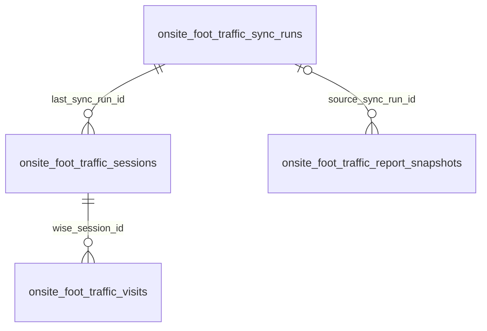

# Onsite Foot Traffic Database

Four tables owned by [Onsite Foot Traffic](../../features/onsite-foot-traffic.md), declared at `src/lib/db/schema.ts:5116-5197` and created by `drizzle/0073_funny_ego.sql`. They are snapshot-independent: correction reconciliation replaces a Bangkok date window without depending on the tutor-search snapshot.

## `onsiteFootTrafficSyncRuns` — `onsite_foot_traffic_sync_runs`

**Grain:** one PAST-session reconciliation attempt.

| Column | Type / constraints | Meaning |
|---|---|---|
| `id` | uuid PK, random default | Run id |
| `status` | `sync_status` not null, default `running` | `running`, `success`, or `failed` |
| `trigger_type` | text not null, default `cron` | `cron` or CLI/manual provenance |
| `actor_email` | text nullable | Optional manual actor |
| `mode` | text not null, default `rolling` | `rolling` or `backfill` |
| `requested_start_date`, `requested_end_date` | date not null | Inclusive Bangkok replacement window |
| `fetched_session_count`, `stored_session_count`, `visit_count` | integer not null, default 0 | Run volumes |
| `unknown_room_count`, `missing_attendance_evidence_count`, `missing_stable_id_count` | integer not null, default 0 | Run quality signals |
| `error_summary` | text nullable | Terminal failure summary |
| `started_at` | timestamptz not null, default now | Claim time |
| `finished_at` | timestamptz nullable | Terminal time |

Indexes: partial unique `oft_sync_single_running_idx` on `status` where `status = 'running'`; `oft_sync_status_started_idx(status, started_at)`; `oft_sync_range_idx(requested_start_date, requested_end_date)`. The partial unique index is the database single-flight guard.

## `onsiteFootTrafficSessions` — `onsite_foot_traffic_sessions`

**Grain:** current canonical representation of one Wise PAST session in reconciled history.

| Column | Type / constraints | Meaning |
|---|---|---|
| `wise_session_id` | text PK | Stable Wise session key |
| `attendance_date` | date not null | Bangkok local date |
| `scheduled_start_at`, `scheduled_end_at` | timestamptz not null | Source instants |
| `wise_status` | text not null | Normalized source status |
| `session_type` | text nullable | Normalized source type |
| `normalized_location` | text nullable | Normalized source location for diagnostics |
| `room_name`, `room_category` | text nullable | Matched active classroom at reconciliation time |
| `subject`, `tutor_name` | text nullable | Non-student export dimensions |
| `scheduled_student_count` | integer nullable | Source-provided scheduled count when available |
| `participant_count`, `counted_visit_count` | integer not null, default 0 | Parsed and qualifying participant counts |
| `missing_attendance_evidence_count`, `missing_stable_id_count` | integer not null, default 0 | Per-session quality counts |
| `is_counted_onsite` | boolean not null, default false | True only when at least one qualifying visit exists |
| `exclusion_reason` | text nullable | Session-level fail-closed reason |
| `last_sync_run_id` | uuid not null FK → sync runs | Reconciliation lineage |
| `synced_at` | timestamptz not null, default now | Last replacement time |

Indexes: `oft_session_date_idx(attendance_date)`, `oft_session_room_date_idx(room_name, attendance_date)`, and `oft_session_counted_date_idx(is_counted_onsite, attendance_date)`. No student or class/title text is stored.

## `onsiteFootTrafficVisits` — `onsite_foot_traffic_visits`

**Grain:** one qualifying attended onsite class occurrence for one source participant.

| Column | Type / constraints | Meaning |
|---|---|---|
| `id` | uuid PK, random default | Surrogate key |
| `wise_session_id` | text not null FK → sessions, `ON DELETE CASCADE` | Parent class occurrence |
| `participant_key` | text not null | HMAC identity when stable; deterministic non-PII placeholder when unidentified |
| `student_fingerprint` | text nullable | Stable HMAC-SHA256 fingerprint; null means excluded from uniques |
| `attendance_date` | date not null | Denormalized Bangkok date |
| `consumed_credits` | double precision not null | Positive attendance evidence |
| `created_at` | timestamptz not null, default now | Replacement insert time |

Indexes: unique `oft_visit_session_participant_idx(wise_session_id, participant_key)` makes the student-visit idempotent within a class; `oft_visit_date_idx(attendance_date)`; `oft_visit_student_date_idx(student_fingerprint, attendance_date)`. The table contains no raw student ID or student name.

## `onsiteFootTrafficReportSnapshots` — `onsite_foot_traffic_report_snapshots`

**Grain:** one immutable, de-identified analytics-pack capture.

| Column | Type / constraints | Meaning |
|---|---|---|
| `id` | uuid PK, random default | Download capability within authenticated routes |
| `created_by_email` | text not null | Internal audit actor |
| `start_date`, `end_date` | date not null | Requested range |
| `filters` | jsonb not null, default `{}` | Date/room/weekday selection |
| `payload` | jsonb not null | Exact aggregate dashboard payload used by both renderers |
| `source_sync_run_id` | uuid nullable FK → sync runs | Freshness lineage at capture time |
| `created_at` | timestamptz not null, default now | Capture time |
| `expires_at` | timestamptz not null | Read eligibility; 30 days after capture |

Indexes: `oft_report_expiry_idx(expires_at)` for cleanup/expiry reads and `oft_report_creator_idx(created_by_email, created_at)` for audit lookup. Expiry removes server access; downloaded HTML/PDF files are self-contained and unaffected.

## Write and read paths

- `src/lib/onsite-foot-traffic/sync.ts` is the only writer to sync runs, canonical sessions, and visits. It fetches before transaction start, then replaces the window atomically.
- `src/lib/onsite-foot-traffic/data.ts` reads canonical rows, aggregates them, writes immutable report snapshots, and rejects expired snapshots.
- the daily sync deletes expired report rows opportunistically; there is no separate retention cron.
- no table references `snapshots.id`, contains a student name/raw student ID, or stores Wise session/class titles.
