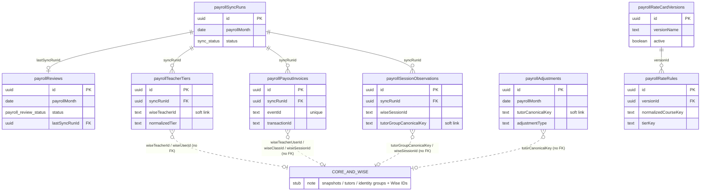

# Database Reference — Payroll Domain (ER Diagram)

The payroll domain captures the monthly teacher payout pipeline: a per-month sync run pulls Wise payout-invoice events and session observations, snapshots each teacher's tier, layers on manual adjustments, and prices everything against a versioned rate card. All 8 tables below are defined in `src/lib/db/schema.ts`.

Full per-column type and constraint detail lives in [`./index.md`](./index.md) — this page covers grain, keys, and relationships only.

## Scope

Exactly 8 tables (varName — `schema.ts` line range):

| Table (var) | Postgres table | Lines |
|---|---|---|
| `payrollSyncRuns` | `payroll_sync_runs` | 855–874 |
| `payrollReviews` | `payroll_reviews` | 875–890 |
| `payrollTeacherTiers` | `payroll_teacher_tiers` | 891–906 |
| `payrollPayoutInvoices` | `payroll_payout_invoices` | 907–934 |
| `payrollSessionObservations` | `payroll_session_observations` | 935–961 |
| `payrollAdjustments` | `payroll_adjustments` | 962–979 |
| `payrollRateCardVersions` | `payroll_rate_card_versions` | 980–996 |
| `payrollRateRules` | `payroll_rate_rules` | 997–1015 |

## Relationship model

Only **two** foreign keys are enforced via Drizzle `.references()` inside this domain:

- `payrollSyncRuns.id` is referenced by `payrollReviews.lastSyncRunId` (schema.ts:883), `payrollTeacherTiers.syncRunId` (schema.ts:894), `payrollPayoutInvoices.syncRunId` (schema.ts:910), and `payrollSessionObservations.syncRunId` (schema.ts:938).
- `payrollRateCardVersions.id` is referenced by `payrollRateRules.versionId` (schema.ts:999).

There are **no** Drizzle FKs from this domain to the core scheduling tables (`snapshots`, `tutors`, `tutorIdentityGroups`). Links to Wise entities and tutors are carried as loose string identifiers — e.g. `wiseTeacherId` / `wiseUserId` (schema.ts:895–896), `wiseTeacherUserId` / `wiseClassId` / `wiseSessionId` (schema.ts:914–917, 939–944), `tutorGroupCanonicalKey` (schema.ts:942), and `tutorCanonicalKey` (schema.ts:966) — not enforced relationships. They appear in the diagram below only as a single `CORE_AND_WISE` stub node with dashed soft-link edges.

Most cross-table cohesion is instead implicit via the shared `payrollMonth` `date` column (present on all tables except the two rate-card tables, which use `effectiveMonth`).

## ER diagram

> Dashed edges (`..`) are soft links by string identifier, not enforced foreign keys. The `CORE_AND_WISE` node is a stub standing in for the core scheduling tables and external Wise entities; it is not expanded here.

## Per-table description

### `payrollSyncRuns` (schema.ts:855–874)
**Grain:** one row per payroll-month sync attempt. Tracks the ETL run that ingests a month's payout and session data from Wise.
**Key columns:** `id` (PK); `payrollMonth` (`date`, string mode); `status` (`syncStatusEnum` — `running` / `success` / `failed`, default `running`, schema.ts:19–23); `triggerType` (default `manual`); `startedAt` / `finishedAt`; count rollups `teacherCount`, `sessionCount`, `invoiceCount`; `errorSummary`; `metadata` jsonb.
**Constraints / relationships:** a partial unique index `payroll_sync_runs_single_running_idx` enforces a single-flight guard — at most one row with `status = 'running'` (schema.ts:868–870). This row is the parent for tier/invoice/observation children and is referenced by `payrollReviews.lastSyncRunId`.

### `payrollReviews` (schema.ts:875–890)
**Grain:** one row per payroll month (enforced by the unique index `payroll_reviews_month_idx` on `payrollMonth`, schema.ts:888) — the human review/approval record for that month.
**Key columns:** `id` (PK); `payrollMonth`; `status` (`payrollReviewStatusEnum` — `draft` / `approved`, default `draft`, schema.ts:142–145); `notes`; approval audit fields `approvedByEmail` / `approvedByName` / `approvedAt`; `lastSyncRunId`; `metadata`; `createdAt` / `updatedAt`.
**Relationships:** `lastSyncRunId` → `payrollSyncRuns.id` (nullable, schema.ts:883), pinning the review to the sync run whose numbers were last reviewed.

### `payrollTeacherTiers` (schema.ts:891–906)
**Grain:** one row per (`payrollMonth`, `wiseTeacherId`) — the resolved compensation tier for each teacher within a month (unique index `payroll_teacher_tiers_month_teacher_idx`, schema.ts:903).
**Key columns:** `id` (PK); `payrollMonth`; `syncRunId` (FK, not null); Wise identity `wiseTeacherId` / `wiseUserId` / `wiseDisplayName`; `rawTier` (as seen in Wise) vs `normalizedTier` (default `Unassigned`); `tags` (jsonb string array); `createdAt`.
**Relationships:** `syncRunId` → `payrollSyncRuns.id` (schema.ts:894). Soft-links to tutors via the `wiseTeacherId` / `wiseUserId` strings (no FK). A secondary index supports lookups by month + user (schema.ts:904).

### `payrollPayoutInvoices` (schema.ts:907–934)
**Grain:** one row per Wise payout event (unique on `eventId` via `payroll_payout_invoices_event_idx`, schema.ts:928) — the per-session payout/invoice line ingested from Wise activity.
**Key columns:** `id` (PK); `payrollMonth`; `syncRunId` (FK, not null); `eventId` (unique) and `transactionId`; `eventTimestamp`; Wise references `wiseTeacherUserId` / `actorWiseUserId` / `wiseClassId` / `wiseSessionId`; `sessionStartTime`; `sessionCredits`; monetary fields `amountMinor` (integer) and `amount` (double, default 0) with `currency` (default `THB`); `transactionStatus`; `note`; `raw` jsonb payload; `createdAt`.
**Relationships:** `syncRunId` → `payrollSyncRuns.id` (schema.ts:910). Soft-links to the teacher/class/session by Wise ID strings. Secondary indexes cover `transactionId`, `payrollMonth`, month + teacher, and `wiseSessionId` (schema.ts:929–932).

### `payrollSessionObservations` (schema.ts:935–961)
**Grain:** one row per (`payrollMonth`, `wiseSessionId`) — a denormalized snapshot of each taught session that month, used to attribute hours and pricing (unique index `payroll_session_observations_month_session_idx`, schema.ts:957).
**Key columns:** `id` (PK); `payrollMonth`; `syncRunId` (FK, not null); `wiseSessionId`; teacher refs `wiseTeacherUserId` / `wiseTeacherId`; tutor refs `tutorGroupCanonicalKey` / `tutorDisplayName`; class context `wiseClassId` / `className` / `subject` / `classType`; `startTime` / `endTime` / `durationMinutes`; `meetingStatus` (not null) and `sessionType`; `studentCount`; `raw` jsonb; `createdAt`.
**Relationships:** `syncRunId` → `payrollSyncRuns.id` (schema.ts:938). Soft-links to tutors/sessions by Wise IDs and `tutorGroupCanonicalKey` (no FK). Secondary indexes cover month + teacher and month + tutor group (schema.ts:958–959).

### `payrollAdjustments` (schema.ts:962–979)
**Grain:** one row per manual (or sourced) adjustment line applied to a payroll month for a given tutor — extra hours or amounts layered onto the computed totals.
**Key columns:** `id` (PK); `payrollMonth`; `adjustmentType` (default `manual`); `tutorCanonicalKey` / `tutorDisplayName`; `hours` and `amount` (both double, default 0); `description`; `source` (default `manual`); audit fields `createdByEmail` / `createdByName`; `createdAt` / `updatedAt`.
**Relationships:** no enforced FKs. Associated to a month by `payrollMonth` and to a tutor by the `tutorCanonicalKey` string (soft link). One index on month + `createdAt` (schema.ts:977).

### `payrollRateCardVersions` (schema.ts:980–996)
**Grain:** one row per rate-card version — a named, dated revision of the pricing table.
**Key columns:** `id` (PK); `versionName`; `effectiveMonth` (`date`, string mode); `sourceLabel`; `active` (boolean, default false); `createdByEmail`; `createdAt` / `updatedAt`; `metadata` jsonb.
**Constraints / relationships:** a partial unique index `payroll_rate_card_versions_active_idx` enforces at most one row with `active = true` (schema.ts:991–993) — a single active rate card at a time. Parent of `payrollRateRules`; a secondary index sorts by `effectiveMonth` (schema.ts:994).

### `payrollRateRules` (schema.ts:997–1015)
**Grain:** one row per priced cell within a rate-card version — keyed by (`versionId`, `studentBand`, `normalizedCourseKey`, `tierKey`) per the unique index `payroll_rate_rules_unique_idx` (schema.ts:1012).
**Key columns:** `id` (PK); `versionId` (FK, not null); `studentBand`; `curriculum` / `course` / `normalizedCourseKey`; `tierKey` and `sourceTierKey`; `pricePerHour` (nullable); `expectedRevenuePerHour` (not null); `revenueShare` (nullable); `rawSourceRow` jsonb; `createdAt`.
**Relationships:** `versionId` → `payrollRateCardVersions.id` (schema.ts:999). A lookup index on (`versionId`, `studentBand`, `normalizedCourseKey`) speeds rate resolution (schema.ts:1013).

_Verified against HEAD + uncommitted WIP on 2026-05-31._
