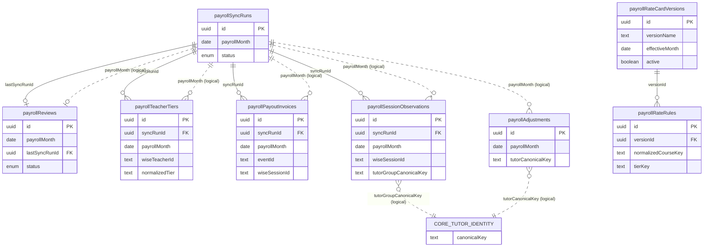

# Database Reference — Payroll Domain

The Payroll domain reconciles tutor pay for a Bangkok calendar month. A monthly
sync pulls Wise teaching sessions and payout-invoice events into month-scoped
observation tables, joins them against a versioned rate card, and surfaces a
review worklist with manual adjustments. Unlike the tutor-scheduling and
Credit Control domains, **Payroll has no snapshot lineage** — every ingest table
is keyed by `payrollMonth` (a `date` stored as `"YYYY-MM-DD"` string, conventionally
the first of the month) and the most-recent `payrollSyncRuns` row for that month,
not by an immutable promoted snapshot. The rate card is the one piece of long-lived
state: rate-card versions and their rules are independent of any month and are
selected by effective month at compute time.

All 8 tables documented here are defined in `src/lib/db/schema.ts` lines 995–1155.
For the complete column-by-column listing (types, defaults, indexes) see
[index.md](./index.md).

## Entity Relationship Diagram

Each entity shows only its primary key, foreign keys, and 1–2 identifying columns
for legibility. `payrollMonth` (a `date` string) is the **logical partition key**
that threads through the ingest tables — it is not a database foreign key, so the
dashed relationships mark those month-scoped logical groupings. The
`tutorGroupCanonicalKey` / `tutorCanonicalKey` columns are plain text that join
logically to the core tutor identity (shown as a single stub node, not expanded
here — see [erd-core.md](./erd-core.md)).

## Key model

Two identity dimensions thread through this domain and explain why most joins are
logical rather than enforced by SQL foreign keys:

- **`payrollMonth`** — a `date` (mode `"string"`, so `"YYYY-MM-DD"`) carried by every
  ingest table (`payrollSyncRuns`, `payrollReviews`, `payrollTeacherTiers`,
  `payrollPayoutInvoices`, `payrollSessionObservations`, `payrollAdjustments`). It
  partitions all of a month's pay data; the active dataset for a month is the rows
  written by that month's latest `payrollSyncRuns`.
- **`canonicalKey` family** — `tutorGroupCanonicalKey` (`payrollSessionObservations`,
  schema.ts:1082) and `tutorCanonicalKey` (`payrollAdjustments`, schema.ts:1106) are
  plain `text` that correspond to the stable `tutor_identity_groups.canonical_key`
  used across snapshots (the same key denormalized onto `past_session_blocks`). There
  is **no SQL FK** into the core tutor tables, so payroll rows survive independently
  of snapshot rotation; the link is resolved in application code.

Only two FK relationships are enforced in SQL: the four month-scoped ingest tables
back-reference the run that wrote them via `syncRunId -> payrollSyncRuns.id`
(`payrollReviews` uses the nullable `lastSyncRunId`), and every rate rule references
its version via `versionId -> payrollRateCardVersions.id`. `payrollAdjustments` has
no FK at all — it is keyed only by `payrollMonth`.

## Tables

### `payrollSyncRuns` (schema.ts 995–1014)

Grain: one row per payroll sync attempt for a month. PK `id` (uuid). `payrollMonth`
(date string) names the month being reconciled. Status uses the shared `syncStatusEnum`
(`running` / `success` / `failed`, schema.ts:19-23, default `running`); `triggerType`
defaults to `"manual"`. Carries roll-up counts (`teacherCount`, `sessionCount`,
`invoiceCount`), an `errorSummary`, and a `metadata` JSON bag. A partial unique index
`payroll_sync_runs_single_running_idx` enforces single-flight by allowing only one row
WHERE `status = 'running'` (schema.ts:1008-1010); also indexed by `(payrollMonth, startedAt)`
and `(status, startedAt)`. This run is the parent that the four month-scoped ingest tables
reference via `syncRunId`.

### `payrollReviews` (schema.ts 1015–1030)

Grain: one row per month-level payroll review (the approval record for a month). PK `id`
(uuid); unique on `payrollMonth` (`payroll_reviews_month_idx`, schema.ts:1028), so a month
has at most one review. Status uses `payrollReviewStatusEnum` (`draft` / `approved`,
schema.ts:158-161, default `draft`). Holds free-text `notes`, approval audit fields
(`approvedByEmail`, `approvedByName`, `approvedAt`), and a `metadata` JSON bag. FK
`lastSyncRunId -> payrollSyncRuns.id` (nullable, schema.ts:1023) pins the review to the
sync run whose data was approved.

### `payrollTeacherTiers` (schema.ts 1031–1046)

Grain: one row per teacher per month, recording the pay tier resolved for that teacher.
PK `id` (uuid); FK `syncRunId -> payrollSyncRuns.id` (not null, schema.ts:1034). Identified
by Wise `wiseTeacherId` (+ optional `wiseUserId`) and a denormalized `wiseDisplayName`.
Captures the `rawTier` as seen in Wise and the `normalizedTier` used for rate lookup
(default `"Unassigned"`), plus a `tags` string array. Unique per `(payrollMonth, wiseTeacherId)`
(`payroll_teacher_tiers_month_teacher_idx`, schema.ts:1043); also indexed by
`(payrollMonth, wiseUserId)`.

### `payrollPayoutInvoices` (schema.ts 1047–1074)

Grain: one row per Wise payout-invoice event for a month (a teacher-payment transaction
line). PK `id` (uuid); FK `syncRunId -> payrollSyncRuns.id` (not null, schema.ts:1050).
Keyed by `eventId` (unique) and `transactionId`, with `eventTimestamp`. Links to the
paid party (`wiseTeacherUserId`, `actorWiseUserId`) and the work (`wiseClassId`,
`wiseSessionId`, `sessionStartTime`, `sessionCredits`). Money is stored both as
`amountMinor` (integer minor units) and `amount` (doublePrecision), with `currency`
(default `"THB"`), `transactionStatus`, a `note`, and the full `raw` Wise payload. Unique
on `eventId` (`payroll_payout_invoices_event_idx`, schema.ts:1068); additionally indexed by
`transactionId`, `payrollMonth`, `(payrollMonth, wiseTeacherUserId)`, and `wiseSessionId`
(the last enabling reconciliation against session observations).

### `payrollSessionObservations` (schema.ts 1075–1101)

Grain: one row per observed teaching session for a month (the work side of the
reconciliation, sourced from Wise sessions). PK `id` (uuid); FK `syncRunId ->
payrollSyncRuns.id` (not null, schema.ts:1078). Identified by `wiseSessionId`, attributed to
a teacher via `wiseTeacherUserId` / `wiseTeacherId` and to a tutor identity via the
denormalized `tutorGroupCanonicalKey` (+ `tutorDisplayName`). Describes the class
(`wiseClassId`, `className`, `subject`, `classType`), timing (`startTime`, `endTime`,
`durationMinutes`), `meetingStatus`, `sessionType`, `studentCount`, and the `raw` payload.
Unique per `(payrollMonth, wiseSessionId)` (`payroll_session_observations_month_session_idx`,
schema.ts:1097); also indexed by `(payrollMonth, wiseTeacherUserId)` and
`(payrollMonth, tutorGroupCanonicalKey)`. The `tutorGroupCanonicalKey` joins logically to
the core tutor identity (no SQL FK).

### `payrollAdjustments` (schema.ts 1102–1119)

Grain: one row per manual payroll adjustment for a month (an admin-entered correction to
hours/amount). PK `id` (uuid). **No FK to a sync run** — adjustments are keyed only by
`payrollMonth` and persist across re-syncs. `adjustmentType` and `source` both default to
`"manual"`. Attributed to a tutor by the denormalized `tutorCanonicalKey` (+ `tutorDisplayName`),
with `hours` and `amount` (doublePrecision), a `description`, and actor audit fields
(`createdByEmail`, `createdByName`, `createdAt` / `updatedAt`). Indexed by
`(payrollMonth, createdAt)` (`payroll_adjustments_month_idx`, schema.ts:1117). The
`tutorCanonicalKey` joins logically to the core tutor identity (no SQL FK).

### `payrollRateCardVersions` (schema.ts 1120–1136)

Grain: one row per rate-card version — a named, dated revision of the pay rate card.
PK `id` (uuid). **Snapshot- and month-independent**: a version is identified by `versionName`,
takes effect from `effectiveMonth` (date string), and records a `sourceLabel` plus a `metadata`
JSON bag and audit fields (`createdByEmail`, `createdAt` / `updatedAt`). An `active` boolean marks
the single live card; a partial unique index `payroll_rate_card_versions_active_idx` allows only
one row WHERE `active = true` (schema.ts:1131-1133), and `effectiveMonth` is indexed for
effective-dated selection. Parent of `payrollRateRules`.

### `payrollRateRules` (schema.ts 1137–1155)

Grain: one row per rate rule within a rate-card version (the price for a specific
band/curriculum/course/tier combination). PK `id` (uuid); FK `versionId ->
payrollRateCardVersions.id` (not null, schema.ts:1139). Lookup dimensions are `studentBand`,
`curriculum`, `course` (with its `normalizedCourseKey`), and `tierKey` (with the original
`sourceTierKey`). Pricing fields: `pricePerHour` (nullable), `expectedRevenuePerHour` (not null),
and `revenueShare` (nullable), alongside the `rawSourceRow` JSON. Unique per
`(versionId, studentBand, normalizedCourseKey, tierKey)` (`payroll_rate_rules_unique_idx`,
schema.ts:1152); also indexed by `(versionId, studentBand, normalizedCourseKey)` for the
rate-lookup path.

_Verified against HEAD `d4fe6d3` on 2026-06-05._
