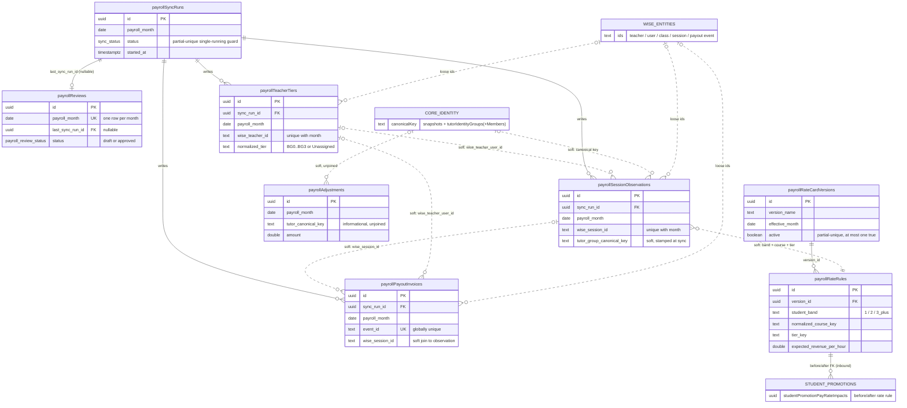

# Database Reference — Payroll (ER Diagram)

Scope: the 8 tables backing the Payroll feature (**stable**). The domain reconciles what a tutor *taught* against what Wise *paid out* for one Bangkok calendar month, measured against a versioned rate card.

Every operational table is keyed by `payroll_month` — a `date` column holding the **first day of the Bangkok month**. `payrollMonthRange()` derives it as `` `${YYYY-MM}-01` `` and exposes it as `payrollMonth`, alongside a Wise query window padded one day either side to absorb timezone edges (`src/lib/payroll/domain.ts:91-107`).

A **sync run** (`runPayrollSync`, `src/lib/payroll/sync.ts:243`) pulls one month of Wise data and rewrites three observation tables for that month; a single **review** row per month carries approval state; **adjustments** are human-entered corrections; and a **rate card** (versions + rules) supplies the expected hourly revenue the reconciliation is measured against.

Full column-by-column detail (types, defaults, every index) lives in [`./index.md`](./index.md); enum value sets live in [`./enums.md`](./enums.md). This page covers grain, keys, and relationships only. For purpose, business rules, and flows see [`../../features/payroll.md`](../../features/payroll.md).

## Scope

Exactly 8 tables (Drizzle export — Postgres table — `src/lib/db/schema.ts` line range):

| Table (varName) | Postgres table | Lines | Grain scope |
|---|---|---|---|
| `payrollSyncRuns` | `payroll_sync_runs` | 1763–1782 | run ledger (lineage root) |
| `payrollReviews` | `payroll_reviews` | 1783–1798 | one row per month |
| `payrollTeacherTiers` | `payroll_teacher_tiers` | 1799–1814 | rewritten per month per run |
| `payrollPayoutInvoices` | `payroll_payout_invoices` | 1815–1842 | rewritten per month per run |
| `payrollSessionObservations` | `payroll_session_observations` | 1843–1869 | rewritten per month per run |
| `payrollAdjustments` | `payroll_adjustments` | 1870–1887 | human-entered, survives sync |
| `payrollRateCardVersions` | `payroll_rate_card_versions` | 1888–1904 | month-independent |
| `payrollRateRules` | `payroll_rate_rules` | 1905–1923 | month-independent |

The rate-card pair is the odd couple: it is the only part of the domain **not** scoped to a payroll month, and it carries no application write path (see [Open questions](#open-questions)).

## Relationship model

**Enforced foreign keys.** Only two payroll tables are FK targets, and every `.references(...)` pointing at a payroll table in the whole schema is listed here:

- `payrollReviews.lastSyncRunId` → `payrollSyncRuns.id`, **nullable** (`schema.ts:1791`)
- `payrollTeacherTiers.syncRunId`, `payrollPayoutInvoices.syncRunId`, `payrollSessionObservations.syncRunId` → `payrollSyncRuns.id`, all `notNull` (`schema.ts:1802`, `1818`, `1846`)
- `payrollRateRules.versionId` → `payrollRateCardVersions.id`, `notNull` (`schema.ts:1907`)
- `studentPromotionPayRateImpacts.beforeRateRuleId` / `.afterRateRuleId` → `payrollRateRules.id`, both nullable — the domain's only **inbound cross-domain** FKs, pinning a promotion's before/after pay band to the exact rate rule that produced it (`schema.ts:1492-1493`; see [`./erd-student-promotions.md`](./erd-student-promotions.md))

`payrollAdjustments` declares no FK at all and is referenced by nothing.

**Soft keys, no FK.** Everything else joins on strings resolved at read time in `buildPayrollPayload` (`src/lib/payroll/data.ts:265-420`):

- **Session ↔ invoice** on `wise_session_id`. Sessions are indexed by id and invoices grouped by session id; a session with no invoice and an invoice with no session are both surfaced as reconciliation issues rather than dropped (`data.ts:272-278`, `324-337`).
- **Session/invoice ↔ tier** on `wise_teacher_user_id` (`data.ts:286`, `336`).
- **Session ↔ tutor identity** on `tutor_group_canonical_key`. That value is stamped **at sync time**, not join time: `loadActiveIdentityEntries` reads `tutorIdentityGroupMembers ⋈ tutorIdentityGroups ⋈ snapshots WHERE snapshots.active` and the row copies `identity.canonicalKey ?? null` (`sync.ts:139-159`, `sync.ts:326`). A null canonical key becomes an `unresolved:` / `unresolved-session:` pseudo-key downstream so the tutor still appears rather than silently vanishing (`data.ts:144-146`).
- **Session ↔ rate rule** on the composite `(studentBand, normalizedCourseKey, tierKey)`, all three derived rather than stored on the session: band from `student_count` (3+ / 2 / else 1, `rate-card.ts:83-88`), course key by normalizing `subject ?? class_name`, tier from the matched tier row (`data.ts:410-414`).
- `payrollAdjustments.tutorCanonicalKey` is carried through to the DTO but is **not** joined to anything — adjustments roll up as month-level `hours` / `amount` sums (`data.ts:483-484`, `data.ts:113-128`).

There are no FKs from this domain to the core scheduling tables. `snapshots` / `tutorIdentityGroups` are touched only by the sync-time identity read above, and Wise ids (`wise_teacher_id`, `wise_user_id`, `wise_class_id`, `wise_session_id`, `event_id`, `transaction_id`) are loose strings — both shown below as single stub nodes.

## ER diagram

```mermaid
erDiagram
    payrollSyncRuns {
        uuid id PK
        date payroll_month
        sync_status status "partial-unique single-running guard"
        timestamptz started_at
    }
    payrollReviews {
        uuid id PK
        date payroll_month UK "one row per month"
        uuid last_sync_run_id FK "nullable"
        payroll_review_status status "draft or approved"
    }
    payrollTeacherTiers {
        uuid id PK
        uuid sync_run_id FK
        date payroll_month
        text wise_teacher_id "unique with month"
        text normalized_tier "BG0..BG3 or Unassigned"
    }
    payrollPayoutInvoices {
        uuid id PK
        uuid sync_run_id FK
        date payroll_month
        text event_id UK "globally unique"
        text wise_session_id "soft join to observation"
    }
    payrollSessionObservations {
        uuid id PK
        uuid sync_run_id FK
        date payroll_month
        text wise_session_id "unique with month"
        text tutor_group_canonical_key "soft, stamped at sync"
    }
    payrollAdjustments {
        uuid id PK
        date payroll_month
        text tutor_canonical_key "informational, unjoined"
        double amount
    }
    payrollRateCardVersions {
        uuid id PK
        text version_name
        date effective_month
        boolean active "partial-unique, at most one true"
    }
    payrollRateRules {
        uuid id PK
        uuid version_id FK
        text student_band "1 / 2 / 3_plus"
        text normalized_course_key
        text tier_key
        double expected_revenue_per_hour
    }
    CORE_IDENTITY {
        text canonicalKey "snapshots + tutorIdentityGroups(+Members)"
    }
    WISE_ENTITIES {
        text ids "teacher / user / class / session / payout event"
    }
    STUDENT_PROMOTIONS {
        uuid studentPromotionPayRateImpacts "before/after rate rule"
    }

    payrollSyncRuns ||--o| payrollReviews : "last_sync_run_id (nullable)"
    payrollSyncRuns ||--o{ payrollTeacherTiers : "writes"
    payrollSyncRuns ||--o{ payrollPayoutInvoices : "writes"
    payrollSyncRuns ||--o{ payrollSessionObservations : "writes"
    payrollRateCardVersions ||--o{ payrollRateRules : "version_id"
    payrollRateRules ||--o{ STUDENT_PROMOTIONS : "before/after FK (inbound)"
    payrollSessionObservations |o..o{ payrollPayoutInvoices : "soft: wise_session_id"
    payrollTeacherTiers |o..o{ payrollSessionObservations : "soft: wise_teacher_user_id"
    payrollTeacherTiers |o..o{ payrollPayoutInvoices : "soft: wise_teacher_user_id"
    payrollSessionObservations }o..|| payrollRateRules : "soft: band + course + tier"
    CORE_IDENTITY |o..o{ payrollSessionObservations : "soft: canonical key"
    CORE_IDENTITY |o..o{ payrollAdjustments : "soft, unjoined"
    WISE_ENTITIES |o..o{ payrollSessionObservations : "loose ids"
    WISE_ENTITIES |o..o{ payrollPayoutInvoices : "loose ids"
    WISE_ENTITIES |o..o{ payrollTeacherTiers : "loose ids"
```

## Tables

### `payrollSyncRuns` (`payroll_sync_runs`, lines 1763–1782)

**Grain:** one row per attempted payroll sync for one month. This is the lineage root — every observation row points back at the run that wrote it.

Carries `payrollMonth`, `status` (`sync_status`: `running` / `success` / `failed`), `triggerType` (default `"manual"`), the `startedAt` / `finishedAt` pair, three counters (`teacherCount`, `sessionCount`, `invoiceCount`), an `errorSummary`, and a free-form `metadata` jsonb the sync fills with the query window and prepared-row counts (`sync.ts:265-266`, `sync.ts:373-383`).

**Single-flight lives in Postgres, not application code:** `payroll_sync_runs_single_running_idx` is a unique index on `status` filtered to `status = 'running'` (`schema.ts:1776-1778`), so a second concurrent run fails its INSERT and is translated into `PayrollSyncAlreadyRunningError` (`sync.ts:268-271`). A separate `markAbandonedRuns` sweep flips `running` rows older than the stale threshold to `failed` before each attempt, stamping the reason "still running after 20 minutes" into `errorSummary` (`sync.ts:125-137`, called at `sync.ts:255`).

### `payrollReviews` (`payroll_reviews`, lines 1783–1798)

**Grain:** exactly one row per payroll month, enforced by `payroll_reviews_month_idx` unique on `payrollMonth`.

Holds the human approval state: `status` (`payroll_review_status`: `draft` / `approved` — the enum's only two values, `schema.ts:160-163`), `notes`, the `approvedByEmail` / `approvedByName` / `approvedAt` triple, and `lastSyncRunId` pointing at the run whose data the review reflects.

**A successful sync resets approval.** The end-of-transaction upsert targets `payrollMonth` and, on conflict, forces `status: "draft"` and nulls all three approval fields (`sync.ts:394-412`). Re-syncing an approved month therefore withdraws the approval by design. Manual review edits go through the same conflict target from `savePayrollReview` (`data.ts:589-606`).

### `payrollTeacherTiers` (`payroll_teacher_tiers`, lines 1799–1814)

**Grain:** one row per Wise teacher per payroll month — unique on `(payrollMonth, wiseTeacherId)`.

Snapshots each teacher's pay tier as of the sync: `rawTier` is the matched Wise tag, `normalizedTier` is the mapped `BG0` / `BG1` / `BG2` / `BG3` value defaulting to `"Unassigned"` when no `Tier N` tag matches (`domain.ts:109-117`), and `tags` keeps the full tag array. `wiseUserId` is nullable and is the key everything else joins on, so it carries its own `payroll_teacher_tiers_month_user_idx`.

### `payrollPayoutInvoices` (`payroll_payout_invoices`, lines 1815–1842)

**Grain:** one row per Wise payout **event** — `payroll_payout_invoices_event_idx` is unique on `eventId` alone, globally rather than per month.

This is the "what Wise actually paid" side of the reconciliation: `transactionId`, `eventTimestamp`, `wiseTeacherUserId`, `actorWiseUserId`, the session linkage (`wiseClassId`, `wiseSessionId`, `sessionStartTime`), the money (`sessionCredits`, nullable `amountMinor`, `amount`, `currency` default `"THB"`), `transactionStatus`, `note`, and the untouched `raw` event.

Rows are filtered into the month by the **session** start time, not the event timestamp (`sync.ts:342-346`).

It is also the one payroll table read from **outside** the domain: Post-Class Feedback's `resolvePostClassPayoutEligibility` asks whether a payable invoice exists for a session — `wiseSessionId` match with `sessionCredits > 0 OR amount > 0` — to decide deduction eligibility (`src/lib/post-class-feedback/repository.ts:2162-2179`). That is a soft read on `wise_session_id`, no FK.

### `payrollSessionObservations` (`payroll_session_observations`, lines 1843–1869)

**Grain:** one row per Wise session per payroll month — unique on `(payrollMonth, wiseSessionId)`.

The "what was taught" side: teacher identifiers (`wiseTeacherUserId`, `wiseTeacherId`), the sync-time-resolved `tutorGroupCanonicalKey` + `tutorDisplayName`, class context (`wiseClassId`, `className`, `subject`, `classType`), timing (`startTime`, nullable `endTime`, `durationMinutes`), `meetingStatus`, `sessionType`, nullable `studentCount`, and `raw`.

`studentCount` and `subject`/`className` are load-bearing beyond display — they are the inputs to the rate-rule lookup's student band and course key (`data.ts:411-412`). Only sessions whose `startTime` falls inside the Bangkok month survive the padded Wise query window (`sync.ts:316`).

### `payrollAdjustments` (`payroll_adjustments`, lines 1870–1887)

**Grain:** one row per manual correction for a month. No unique constraint — the same tutor may have many.

Holds `adjustmentType` (default `"manual"`), the informational `tutorCanonicalKey` / `tutorDisplayName`, the `hours` and `amount` deltas, a `description`, a `source` provenance string (schema default `"manual"`; the insert path hardcodes `"manual"` regardless of input, `data.ts:646`), and `createdByEmail` / `createdByName` attribution.

This is the only payroll table with a genuine CRUD path — insert and hard `DELETE` by id (`data.ts:637`, `data.ts:656-658`) — and the only one a sync leaves untouched: the rewrite transaction deletes tiers, invoices, and observations but never adjustments (`sync.ts:386-388`). They aggregate as month totals rather than per-tutor lines (`data.ts:483-484`).

### `payrollRateCardVersions` (`payroll_rate_card_versions`, lines 1888–1904)

**Grain:** one row per published rate-card version. Not scoped to a payroll month.

Carries `versionName`, `effectiveMonth`, a `sourceLabel` describing where the card came from, `createdByEmail`, and `metadata`.

**At most one version is active at a time**, enforced the same way the sync guard is: `payroll_rate_card_versions_active_idx` is a unique index on `active` filtered to `active = true` (`schema.ts:1899-1901`). Readers always take the active row — `getPayrollPayload` selects `WHERE active = true ORDER BY createdAt DESC LIMIT 1` (`data.ts:553-558`), and Student Promotions resolves its pay bands the same way (`src/lib/student-promotions/data.ts:1582-1584`).

### `payrollRateRules` (`payroll_rate_rules`, lines 1905–1923)

**Grain:** one rate cell per version — unique on `(versionId, studentBand, normalizedCourseKey, tierKey)`, with a matching three-column lookup index dropping `tierKey`.

Each row pairs the human-readable `curriculum` / `course` with the machine key `normalizedCourseKey`, the `tierKey` (a `PayrollTier`) with the `sourceTierKey` it was widened from (a spreadsheet column like `"Tier 0-1"` fans out into one row per covered tier, `rate-card.ts:23-28`), and the money: nullable `pricePerHour` (the student list price), `expectedRevenuePerHour` (`notNull`, the reconciliation input), nullable `revenueShare`, plus the `rawSourceRow` the parser read.

The whole card is loaded once per payload request and matched in memory (`data.ts:560-561`), which is why the composite key is denormalized rather than joined.

## Cross-domain notes

- **Post-Class Feedback → `payrollPayoutInvoices`** — read-only eligibility probe on `wise_session_id`, described above. Post-Class Feedback maintains its own payout-adjustment tables and never writes Payroll.
- **Student Promotions → `payrollRateCardVersions` / `payrollRateRules`** — reads the active card to compute pay-band impacts, and stores hard FKs to the specific before/after rules on `studentPromotionPayRateImpacts` (`schema.ts:1492-1493`).
- **Core identity tables** — read at sync time only (`sync.ts:139-159`); the payroll row keeps a copied string, so a later snapshot rotation does not retroactively change a stored observation.

## Write-path note

The month rewrite is genuinely transactional, which forces a driver switch. `runPayrollWriteTransaction` first tries `db.transaction(...)` and, when the Neon HTTP driver reports transactions unsupported, falls back to a `pg` (node-postgres) pool client running explicit `BEGIN` / `COMMIT` / `ROLLBACK` (`sync.ts:100-123`). Inside that one transaction the sync deletes and re-inserts all three observation tables for the month, upserts the review, and flips the run row to `success` (`sync.ts:385-425`) — so a month is never observed half-rewritten. A throw anywhere marks the run `failed` with a short error summary and leaves the previous month data in place (`sync.ts:437-446`).

## Open questions

- **No application write path for the rate card.** `payrollRateCardVersions` and `payrollRateRules` are only ever `SELECT`ed in `src/` (`src/lib/payroll/data.ts:553-561`, `src/lib/student-promotions/data.ts:1582-1592`, plus the ad-hoc `scripts/price-student-credits.ts:119-132`). Their sole populating write in the repo is the seed embedded in migration `drizzle/0037_payroll_rate_cards.sql:40`, `:181`. The parser in `src/lib/payroll/rate-card.ts` produces `ParsedPayRateRule[]` but nothing in `src/` persists that output. How a *new* rate-card version is meant to be published — another migration, a manual SQL load, or an unbuilt UI — is not answerable from the code.
- **`payrollAdjustments.tutorCanonicalKey` is captured but unused.** It is validated and stored (`data.ts:641`) and echoed in the DTO (`data.ts:118`), but no aggregation joins on it; adjustments only ever land as month-level totals. Whether per-tutor attribution is intended but unbuilt, or the column is deliberately advisory, is not determinable from the code.
- **Cron coverage.** `runPayrollSync` defaults `triggerType` to `"manual"` (`sync.ts:264`) and the column's own default is `"manual"` (`schema.ts:1767`); no caller in `src/` passes another value. Whether payroll sync is ever driven on a schedule is a `vercel.json` / cron-registry question, not a schema one — see [`../crons.md`](../crons.md).

_Verified against main@0cd1e81 (clean tree) on 2026-09-02._
