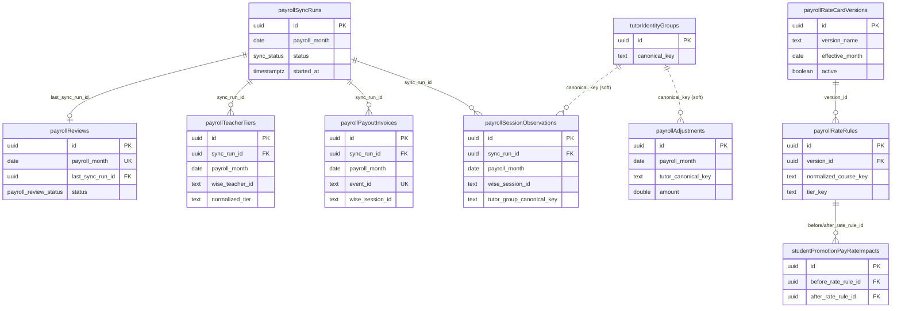

# Database Reference — Payroll

Schema for monthly tutor pay reconciliation. Every operational table in this domain is keyed by `payroll_month` — a `date` column holding the **first day of the Bangkok month** (`payrollMonthRange()` builds it as `${YYYY-MM}-01` and returns it as `payrollMonth`, `src/lib/payroll/domain.ts:91-107`). A **sync run** pulls a month's Wise data and rewrites three observation tables for that month (teacher tiers, payout invoices, session observations) inside one transaction; a single **review** row per month carries approval state; **adjustments** are human-entered corrections; and a versioned **rate card** (versions + rules) supplies the expected hourly rates the reconciliation is measured against.

The rate-card pair is the odd couple here: it is the only part of the domain not scoped to a payroll month, and it is read-only from application code (see [Open Questions](#open-questions)).

All eight tables are defined in `src/lib/db/schema.ts`:

| Table (varName) | SQL name | schema.ts lines |
|---|---|---|
| `payrollSyncRuns` | `payroll_sync_runs` | 1760–1779 |
| `payrollReviews` | `payroll_reviews` | 1780–1795 |
| `payrollTeacherTiers` | `payroll_teacher_tiers` | 1796–1811 |
| `payrollPayoutInvoices` | `payroll_payout_invoices` | 1812–1839 |
| `payrollSessionObservations` | `payroll_session_observations` | 1840–1866 |
| `payrollAdjustments` | `payroll_adjustments` | 1867–1884 |
| `payrollRateCardVersions` | `payroll_rate_card_versions` | 1885–1901 |
| `payrollRateRules` | `payroll_rate_rules` | 1902–1920 |

Full column lists live in [docs/reference/database/index.md](./index.md); enum values live in [enums.md](./enums.md). This page covers grain, keys, and relationships only.

## ER Diagram

```mermaid
erDiagram
    payrollSyncRuns {
        uuid id PK
        date payroll_month
        sync_status status
        timestamptz started_at
    }
    payrollReviews {
        uuid id PK
        date payroll_month UK
        uuid last_sync_run_id FK
        payroll_review_status status
    }
    payrollTeacherTiers {
        uuid id PK
        uuid sync_run_id FK
        date payroll_month
        text wise_teacher_id
        text normalized_tier
    }
    payrollPayoutInvoices {
        uuid id PK
        uuid sync_run_id FK
        date payroll_month
        text event_id UK
        text wise_session_id
    }
    payrollSessionObservations {
        uuid id PK
        uuid sync_run_id FK
        date payroll_month
        text wise_session_id
        text tutor_group_canonical_key
    }
    payrollAdjustments {
        uuid id PK
        date payroll_month
        text tutor_canonical_key
        double amount
    }
    payrollRateCardVersions {
        uuid id PK
        text version_name
        date effective_month
        boolean active
    }
    payrollRateRules {
        uuid id PK
        uuid version_id FK
        text normalized_course_key
        text tier_key
    }
    tutorIdentityGroups {
        uuid id PK
        text canonical_key
    }
    studentPromotionPayRateImpacts {
        uuid id PK
        uuid before_rate_rule_id FK
        uuid after_rate_rule_id FK
    }

    payrollSyncRuns ||--o{ payrollTeacherTiers : "sync_run_id"
    payrollSyncRuns ||--o{ payrollPayoutInvoices : "sync_run_id"
    payrollSyncRuns ||--o{ payrollSessionObservations : "sync_run_id"
    payrollSyncRuns ||--o| payrollReviews : "last_sync_run_id"
    payrollRateCardVersions ||--o{ payrollRateRules : "version_id"
    payrollRateRules ||--o{ studentPromotionPayRateImpacts : "before/after_rate_rule_id"
    tutorIdentityGroups ||..o{ payrollSessionObservations : "canonical_key (soft)"
    tutorIdentityGroups ||..o{ payrollAdjustments : "canonical_key (soft)"
```

`tutorIdentityGroups` and `studentPromotionPayRateImpacts` are stub nodes — they belong to [erd-core.md](./erd-core.md) and [erd-student-promotions.md](./erd-student-promotions.md) respectively, and appear here only to anchor the edges. Dotted edges are **soft** references: `tutor_group_canonical_key` / `tutor_canonical_key` are plain `text` with no database foreign key. `payrollAdjustments` has no FK at all; it joins to the rest of the domain only through `payroll_month`.

## Tables

### `payrollSyncRuns` (`payroll_sync_runs`)

**Grain:** one row per payroll sync attempt for a month.

The lineage root. `id` is a uuid PK (`defaultRandom()`); `payroll_month` (date, string mode) scopes the run. `status` uses the shared `sync_status` enum — `running` / `success` / `failed` (`schema.ts:21-25`) — defaulting to `running`, alongside `trigger_type` (text, default `"manual"`). Timing is `started_at` (timestamptz, `defaultNow()`) plus nullable `finished_at`; the counters `teacher_count`, `session_count`, `invoice_count` (integers, default 0), `error_summary`, and a non-null `metadata` jsonb (default `{}`) record the outcome. The sync writes fetch/page statistics into `metadata` before opening the write transaction (`src/lib/payroll/sync.ts:366-383`).

Single-flight is enforced in the database, not in application code: `payroll_sync_runs_single_running_idx` is a **partial unique index on `status` where `status = 'running'`** (`schema.ts:1773-1775`), so at most one run may be in flight across the whole table (not per month) — the insert's `23505` violation is translated into `PayrollSyncAlreadyRunningError` (`src/lib/payroll/sync.ts:54-59`, `:270-273`). Abandoned runs are swept to `failed` after 20 minutes by `markAbandonedRuns()` (`src/lib/payroll/sync.ts:24`, `:125-137`). Two supporting indexes cover `(payroll_month, started_at)` and `(status, started_at)` (`schema.ts:1776-1777`).

**Relationships:** parent of `payrollTeacherTiers`, `payrollPayoutInvoices`, and `payrollSessionObservations` (all NOT NULL `sync_run_id`); optionally referenced by `payrollReviews.last_sync_run_id`.

### `payrollReviews` (`payroll_reviews`)

**Grain:** one row per payroll month — the human approval record.

`payroll_month` carries a `uniqueIndex` (`payroll_reviews_month_idx`, `schema.ts:1793`), which is what pins the grain to exactly one row per month; the sync upserts on that target rather than inserting duplicates (`src/lib/payroll/sync.ts:394-412`). `status` uses the `payroll_review_status` enum — `draft` / `approved` (`schema.ts:160-163`) — defaulting to `draft`. Sign-off is captured by `approved_by_email`, `approved_by_name`, and `approved_at` (all nullable); `notes` is non-null text defaulting to `""`. `last_sync_run_id` (nullable uuid) references `payrollSyncRuns.id` (`schema.ts:1788`) and records which run last refreshed the month's data. `metadata` jsonb defaults to `{}`; `created_at` / `updated_at` are timestamptz with `defaultNow()`.

A re-sync **resets approval**: the sync's upsert sets `status: "draft"` and nulls `approved_by_email` / `approved_by_name` / `approved_at` (`src/lib/payroll/sync.ts:402-412`), so refreshed data can never inherit a stale sign-off. Admin edits go through `updatePayrollReview()`, which stamps the actor and timestamp on approval and clears them on any other status (`src/lib/payroll/data.ts:577-619`).

**Relationships:** child of `payrollSyncRuns` via `last_sync_run_id`; logically the header row for all other month-scoped tables.

### `payrollTeacherTiers` (`payroll_teacher_tiers`)

**Grain:** one row per (payroll month, Wise teacher) — the teacher's pay tier as observed during that month's sync.

`sync_run_id` (uuid, NOT NULL) references `payrollSyncRuns.id` (`schema.ts:1799`). The row is keyed on `(payroll_month, wise_teacher_id)` by `payroll_teacher_tiers_month_teacher_idx` (`schema.ts:1808`), with a secondary index on `(payroll_month, wise_user_id)` (`:1809`) because sessions and invoices join on the Wise **user** id rather than the teacher id. `wise_display_name` is NOT NULL. `raw_tier` is the tier tag as found on the Wise teacher record; `normalized_tier` is the parsed value, NOT NULL and defaulting to `"Unassigned"` — the fail-closed default `normalizeTierLabel()` returns for a blank or unrecognized tag, versus `BG0`–`BG3` for a matched `Tier N` label (`src/lib/payroll/domain.ts:109-117`). `tags` is a `jsonb` string array (default `[]`) holding the teacher's full Wise tag list. Rows are built from Wise teacher records in `src/lib/payroll/sync.ts:291-311`.

Rows are **replaced, not accumulated**: each sync deletes the month's tier rows and reinserts them in a single transaction (`src/lib/payroll/sync.ts:385-392`).

**Relationships:** child of `payrollSyncRuns`.

### `payrollPayoutInvoices` (`payroll_payout_invoices`)

**Grain:** one row per Wise payout event (`event_id`) attributable to the payroll month — what the tutor was actually paid.

`sync_run_id` (uuid, NOT NULL) references `payrollSyncRuns.id` (`schema.ts:1815`). `event_id` carries a table-wide `uniqueIndex` (`payroll_payout_invoices_event_idx`, `:1833`) — the dedupe key — and `transaction_id`, `payroll_month`, `(payroll_month, wise_teacher_user_id)`, and `wise_session_id` are each indexed (`:1834-1837`). Money columns are `amount_minor` (nullable integer), `amount` (`doublePrecision`, default 0), and `currency` (text, default `"THB"`), alongside `session_credits` (`doublePrecision`, default 0) and nullable `transaction_status` / `note`. The linkage columns — `wise_teacher_user_id`, `actor_wise_user_id`, `wise_class_id`, `wise_session_id`, `session_start_time` — are all nullable, so an invoice can exist without a matched session. The full Wise event is preserved in `raw` (jsonb, default `{}`).

Month membership is decided by the **session** start time, not the event timestamp: invoices are filtered with `dateIsInPayrollMonth(event.sessionStartTime, range)` (`src/lib/payroll/sync.ts:345`). Like the other observation tables, the month's rows are deleted and reinserted on every sync (`:385-392`).

Read outside payroll: post-class feedback treats a matching invoice row with `session_credits > 0` **or** `amount > 0` as evidence a session was payable (`src/lib/post-class-feedback/repository.ts:2154-2167`).

**Relationships:** child of `payrollSyncRuns`; joins to `payrollSessionObservations` on `wise_session_id` (no FK).

### `payrollSessionObservations` (`payroll_session_observations`)

**Grain:** one row per (payroll month, Wise session) — what was actually taught.

`sync_run_id` (uuid, NOT NULL) references `payrollSyncRuns.id` (`schema.ts:1843`). Uniqueness is `(payroll_month, wise_session_id)` (`payroll_session_observations_month_session_idx`, `:1862`), with lookup indexes on `(payroll_month, wise_teacher_user_id)` and `(payroll_month, tutor_group_canonical_key)` (`:1863-1864`). Required columns are `start_time` (timestamptz), `meeting_status` (text), and `duration_minutes` (integer, default 0); `end_time`, `session_type`, `student_count`, `wise_class_id`, `class_name`, `subject`, and `class_type` are nullable. The raw Wise session is kept in `raw` (jsonb, default `{}`).

`tutor_group_canonical_key` and `tutor_display_name` are the bridge back to the tutor domain: the sync resolves each session's Wise user/teacher id against identity-group members joined to the **active snapshot** (`loadActiveIdentityEntries()`, `src/lib/payroll/sync.ts:139-159`) and denormalizes the resulting `canonicalKey` onto the row (`:326`). Both are nullable and carry no FK, so an unmatched session persists with a null key rather than being dropped.

Rows are replaced per month on each sync (`src/lib/payroll/sync.ts:385-392`), and only sessions whose start time falls inside the Bangkok month are kept (`:316`) — even though the Wise fetch deliberately widens the query window by a day on each side to absorb the UTC/Bangkok offset (`src/lib/payroll/domain.ts:95-98`).

**Relationships:** child of `payrollSyncRuns`; soft reference to core `tutor_identity_groups.canonical_key`; joins to `payrollPayoutInvoices` on `wise_session_id`.

### `payrollAdjustments` (`payroll_adjustments`)

**Grain:** one row per manual pay correction within a payroll month.

The only operational payroll table with **no foreign key** — it is not tied to a sync run, so adjustments survive re-syncs of the same month. Scoping is `payroll_month` plus the `(payroll_month, created_at)` index (`payroll_adjustments_month_idx`, `schema.ts:1882`). `adjustment_type` (text, default `"manual"`) and `source` (text, default `"manual"`) classify the entry; `hours` and `amount` are `doublePrecision` defaulting to 0, and `description` is non-null text defaulting to `""`. `tutor_canonical_key` / `tutor_display_name` are nullable soft references to the tutor identity group. Provenance is `created_by_email` / `created_by_name` (nullable), with `created_at` / `updated_at` timestamptz `defaultNow()`.

Writes go through `addPayrollAdjustment()`, which trims inputs, forces `source: "manual"`, and coerces non-finite `hours`/`amount` to 0 (`src/lib/payroll/data.ts:621-652`); deletion is by `id` (`:654-660`). The month payload sums `hours` and `amount` across all adjustments for the month (`src/lib/payroll/data.ts:483-484`).

**Relationships:** none enforced; associated to a month by `payroll_month` and (optionally, softly) to a tutor by `tutor_canonical_key`.

### `payrollRateCardVersions` (`payroll_rate_card_versions`)

**Grain:** one row per rate-card version — a labeled, dated snapshot of the pay-rate table.

Not month-scoped. `version_name`, `source_label`, and `effective_month` (date, string mode) are NOT NULL, and `effective_month` is indexed (`payroll_rate_card_versions_effective_idx`, `schema.ts:1899`). `active` (boolean, default `false`) carries a **partial unique index where `active = true`** (`payroll_rate_card_versions_active_idx`, `:1896-1898`), so at most one version can be active at a time — the database, not the application, enforces that invariant. `created_by_email` is nullable; `created_at` / `updated_at` are timestamptz `defaultNow()`; `metadata` jsonb (default `{}`) records the source spreadsheet.

Both the payroll payload (`src/lib/payroll/data.ts:552-561`) and student promotions (`src/lib/student-promotions/data.ts:1579-1594`) resolve the rate card the same way: select `active = true`, order by `created_at` desc, take the first row, then load that version's rules.

**Relationships:** parent (one-to-many) of `payrollRateRules` via `version_id`.

### `payrollRateRules` (`payroll_rate_rules`)

**Grain:** one row per (version, student band, normalized course, tier) — a single expected-rate cell of the rate card.

`version_id` (uuid, NOT NULL) references `payrollRateCardVersions.id` (`schema.ts:1904`). The composite `uniqueIndex` on `(version_id, student_band, normalized_course_key, tier_key)` (`payroll_rate_rules_unique_idx`, `:1917`) defines the grain; a matching lookup index drops `tier_key` (`:1918`) for the common "all tiers for this band + course" read. `student_band`, `curriculum`, `course`, `normalized_course_key`, `tier_key`, and `source_tier_key` are all NOT NULL text — `course` is the human label from the source sheet and `normalized_course_key` its canonical form (produced by `normalizePayrollRateCourse()`, `src/lib/payroll/rate-card.ts:52-81`), while `source_tier_key` preserves the original spreadsheet column header (e.g. `"Tier 0-2"`) that one or more `tier_key` rows were expanded from (`src/lib/payroll/rate-card.ts:22-28`). `expected_revenue_per_hour` (`doublePrecision`) is NOT NULL; `price_per_hour` and `revenue_share` are nullable. `raw_source_row` (jsonb, default `{}`) keeps the originating sheet row.

At read time the rules are folded into a `Map` keyed exactly as the unique index implies — `${studentBand}|${normalizedCourseKey}|${tierKey}` (`buildRateRuleLookup()` / `rateRuleKey()`, `src/lib/payroll/rate-card.ts:162-176`).

**Relationships:** child of `payrollRateCardVersions`; referenced from outside the domain by `studentPromotionPayRateImpacts.before_rate_rule_id` and `.after_rate_rule_id` (`schema.ts:1489-1490`), which price a promotion's before/after hourly rate.

## Open Questions

- **No application write path for the rate card.** A repo-wide search finds no `insert` into `payroll_rate_card_versions` or `payroll_rate_rules` outside the data-carrying migration `drizzle/0037_payroll_rate_cards.sql`, which seeds one active version (`'PayRate May 2026'`, effective `2026-05-01`, sourced from a Google Sheet) plus its rules (`drizzle/0037_payroll_rate_cards.sql:39-48`). Application code only reads them, even though a full sheet parser (`parsePayRateRows()`, `src/lib/payroll/rate-card.ts:98-160`) exists. Is a new rate card meant to arrive via another migration, or is an admin import path still to be built?
- **`payroll_sync_runs` single-flight is global, not per month.** The partial unique index is on `status` alone (`schema.ts:1773-1775`), so a sync for one month blocks a concurrent sync for another. Intentional (one Wise pull at a time) or an unintended coupling?
- **Orphaned observation lineage.** Each sync deletes and reinserts the month's tier/invoice/observation rows, but superseded `payroll_sync_runs` rows remain, leaving historical runs with zero children and no `ON DELETE` behavior declared on the FKs. Is any retention or pruning intended for old payroll sync runs?
- **`tutor_canonical_key` on adjustments is unvalidated.** `addPayrollAdjustment()` only trims the string (`src/lib/payroll/data.ts:641`); a mistyped key silently yields an adjustment that never joins to a tutor. Should it be validated against the active snapshot's identity groups?

_Verified against HEAD + uncommitted WIP on 2026-05-31._
