# Database Reference — Post-Class Feedback & Payout (ER Diagram)

Scope: the 32 tables whose Drizzle export begins `postClass` (**stable**). The domain observes immutable Wise teacher-feedback evidence, decides — deterministically, never by AI opinion — whether a session violated the feedback policy, and carries a reviewed ฿100 deduction all the way onto a Google-Sheets payout ledger.

The schema's own header states the boundary the table layout exists to enforce: Wise stays read-only, and source evidence, compliance state, and financial workflow state live in separate columns and tables so a provider outage or an AI opinion can never create a financial decision (`src/lib/db/schema.ts:3136-3139`).

Five grains stack on top of each other, and almost every table belongs to exactly one:

1. **Configuration** — enforcement mode, form mapping, capability grants, and an append-only config audit trail.
2. **Evidence** — one `postClassSessions` row per Wise session, its participants, its immutable feedback versions, the activity events that date them, and one `postClassAssessments` row per distinct verdict.
3. **Notification** — reminder/digest runs, per-tutor deliveries, the sessions listed in each, and per-attempt provider results. Present but **parked**: nothing schedules a dispatch (see [Open questions](#open-questions)).
4. **Finance** — calendar-month periods, one deduction per session, an append-only action log, and reversal offsets.
5. **Payout** — the 26th→25th export window, its ledger lines, positive corrections, exceptions, and the audited workbook date-roll.

Full column-by-column detail (types, defaults, every index) lives in [`./index.md`](./index.md); the 15 `post_class_*` enum value sets live in [`./enums.md`](./enums.md). This page covers grain, keys, and relationships only. For purpose, business rules, and flows see [`../../features/post-class-feedback.md`](../../features/post-class-feedback.md).

> This page is the canonical home for these 32 tables. They were previously described inside [`./erd-core.md`](./erd-core.md), which now points here.

## Scope

Exactly 32 tables (Drizzle export — Postgres table — `src/lib/db/schema.ts` line range):

| Table (varName) | Postgres table | Lines | Grain scope |
|---|---|---|---|
| `postClassEnforcementWindows` | `post_class_enforcement_windows` | 3141–3153 | one row per enforcement-mode interval |
| `postClassSettings` | `post_class_settings` | 3155–3169 | singleton (`id` defaults `'default'`) |
| `postClassFieldMappings` | `post_class_field_mappings` | 3171–3185 | field × mapping version |
| `postClassAccessGrants` | `post_class_access_grants` | 3187–3197 | email × capability |
| `postClassConfigAuditLog` | `post_class_config_audit_log` | 3199–3212 | append-only config change |
| `postClassDigestRecipients` | `post_class_digest_recipients` | 3214–3224 | one row per digest email |
| `postClassSyncRuns` | `post_class_sync_runs` | 3226–3251 | collection/backfill run ledger |
| `postClassSessions` | `post_class_sessions` | 3253–3308 | one row per Wise session (durable) |
| `postClassSessionParticipants` | `post_class_session_participants` | 3310–3324 | student on a session |
| `postClassFeedbackVersions` | `post_class_feedback_versions` | 3326–3355 | immutable submission version |
| `postClassFeedbackEventLinks` | `post_class_feedback_event_links` | 3357–3370 | Wise activity event ↔ session |
| `postClassAssessments` | `post_class_assessments` | 3372–3401 | distinct policy verdict |
| `postClassSourceIssues` | `post_class_source_issues` | 3403–3423 | deduped source-health defect |
| `postClassNotificationRuns` | `post_class_notification_runs` | 3425–3448 | reminder/digest run |
| `postClassNotificationDeliveries` | `post_class_notification_deliveries` | 3450–3472 | one email inside a run |
| `postClassNotificationItems` | `post_class_notification_items` | 3474–3485 | session listed in a delivery |
| `postClassNotificationAttempts` | `post_class_notification_attempts` | 3487–3501 | one provider send attempt |
| `postClassAiRuns` | `post_class_ai_runs` | 3503–3522 | one AI call per feedback version |
| `postClassAiConcerns` | `post_class_ai_concerns` | 3524–3537 | concern dimension per run |
| `postClassAiReviews` | `post_class_ai_reviews` | 3539–3550 | human decision on a concern |
| `postClassFinancePeriods` | `post_class_finance_periods` | 3552–3568 | one row per calendar month |
| `postClassDeductions` | `post_class_deductions` | 3570–3592 | at most one per session |
| `postClassDeductionActions` | `post_class_deduction_actions` | 3594–3613 | append-only lifecycle event |
| `postClassDeductionOffsets` | `post_class_deduction_offsets` | 3615–3630 | at most one reversal per deduction |
| `postClassPayoutRuns` | `post_class_payout_runs` | 3639–3712 | one 26→25 window |
| `postClassPayoutTutorNames` | `post_class_payout_tutor_names` | 3722–3738 | tutor → exact ledger identity |
| `postClassTutorPayoutSheets` | `post_class_tutor_payout_sheets` | 3745–3759 | superseded workbook registry |
| `postClassPayoutRunLines` | `post_class_payout_run_lines` | 3766–3821 | one ledger line per deduction per run |
| `postClassPayoutAdjustments` | `post_class_payout_adjustments` | 3827–3865 | append-only positive correction |
| `postClassPayoutExceptions` | `post_class_payout_exceptions` | 3868–3892 | durable finance blocker |
| `postClassPayoutRollRuns` | `post_class_payout_roll_runs` | 3895–3924 | one workbook date-roll attempt |
| `postClassPayoutRollOutcomes` | `post_class_payout_roll_outcomes` | 3927–3957 | one workbook inside a roll |

Migration lineage matches those five grains: `drizzle/0055_post_class_feedback.sql` created the first 24 (config through deduction offsets), `0057_post_class_payout_runs.sql` added the runs/lines pair plus `post_class_tutor_payout_sheets`, `0059_post_class_payout_master.sql` added `post_class_payout_tutor_names`, and `0060_post_class_payout_durable_runs.sql` added the last four. `0058`, `0061`, `0062`, and `0068` alter existing tables rather than create new ones.

## Relationship model

**Enforced foreign keys.** These 32 tables carry 35 `.references(...)` declarations — 34 pointing at another `postClass` table and one crossing out of the domain — and every one is listed below. Cascade behaviour is deliberate and splits three ways: `cascade` for evidence a session owns, `set null` for provenance that may outlive its source, and **`restrict` for everything financial** — a deduction, its finance period, its ledger line, or its adjustment cannot be deleted out from under an audit trail.

Inside the evidence grain (all `cascade` from `postClassSessions`):

- `postClassSessionParticipants.sessionId`, `postClassFeedbackVersions.sessionId`, `postClassFeedbackEventLinks.sessionId`, `postClassAssessments.sessionId`, `postClassNotificationItems.sessionId`, `postClassAiRuns.sessionId` (`schema.ts:3312`, `3328`, `3359`, `3374`, `3477`, `3505`)
- `postClassSourceIssues.sessionId` is `cascade` but **nullable** — a global-scope issue has no session (`schema.ts:3406`)
- `postClassFeedbackEventLinks.feedbackVersionId` and `postClassAssessments.feedbackVersionId` are `set null`: an assessment survives losing the version it governed (`schema.ts:3360`, `3375`). `postClassAiRuns.feedbackVersionId` is `notNull` + `cascade` instead — an AI opinion about a vanished version is meaningless (`schema.ts:3506`)
- `postClassSourceIssues.syncRunId` → `postClassSyncRuns.id`, `set null` (`schema.ts:3405`)

Config, notification, and AI chains:

- `postClassSettings.currentWindowId` → `postClassEnforcementWindows.id`, nullable, no delete action (`schema.ts:3158`) — the singleton's pointer at the currently open window
- `postClassNotificationDeliveries.runId` → runs; `postClassNotificationItems.deliveryId` and `postClassNotificationAttempts.deliveryId` → deliveries; all `notNull` + `cascade` (`schema.ts:3452`, `3476`, `3489`)
- `postClassAiConcerns.runId` → AI runs, `postClassAiReviews.concernId` → concerns; both `notNull` + `cascade` (`schema.ts:3526`, `3541`)

Finance and payout chains (every one `restrict` unless noted):

- `postClassDeductions.sessionId` → sessions, `notNull`; `postClassDeductions.financePeriodId` → periods, nullable (`schema.ts:3572`, `3577`)
- `postClassDeductionActions.deductionId` (`notNull`) and `.financePeriodId` (nullable) (`schema.ts:3596`, `3601`)
- `postClassDeductionOffsets.deductionId` and `.financePeriodId`, both `notNull` (`schema.ts:3617-3618`)
- `postClassPayoutRunLines.runId` → payout runs (`cascade`), `.deductionId`, `.sessionId` (both `notNull`, `restrict`) (`schema.ts:3768-3770`)
- `postClassPayoutAdjustments.deductionId` (`notNull`), `.sourceLineId` → run lines (nullable), `.runId` → payout runs (nullable, `set null`) (`schema.ts:3829-3831`)
- `postClassPayoutExceptions.runId` (`notNull`, `cascade`), `.deductionId`, `.adjustmentId` (both nullable) (`schema.ts:3870-3872`)
- `postClassPayoutRollRuns.payoutRunId` → payout runs, `notNull`, `restrict`; `postClassPayoutRollOutcomes.rollRunId` → roll runs, `notNull`, `cascade` (`schema.ts:3897`, `3929`)

**The one outbound cross-domain FK** is `postClassFeedbackEventLinks.wiseActivityEventId` → `wiseActivityEvents.id`, nullable and `set null` (`schema.ts:3361`). It is what lets timing be proven from the Wise activity mirror rather than inferred. Nothing outside the domain declares an FK **into** these 32 tables.

**Two deliberate non-FKs inside `postClassSessions`.** `latestFeedbackVersionId` and `firstOnTimeCompliantVersionId` are plain `uuid` columns pointing at `postClassFeedbackVersions` rows with no `.references(...)` (`schema.ts:3286-3287`) — the reverse direction is already a `cascade` FK, so declaring these would make the pair mutually dependent.

**Soft keys, no FK.**

- **Tutor identity** — `canonicalTutorKey` (on sessions, deliveries, run lines, roll outcomes) is a copied string, resolved at collection time against the **active** snapshot's identity groups: `tutorIdentityGroupMembers ⋈ tutorIdentityGroups ⋈ snapshots WHERE snapshots.active`, matching on `wiseUserId` **or** `wiseTeacherId`. Anything but exactly one matching group returns `status: "ambiguous"` with a null key (`repository.ts:2116-2145`), which becomes the `identity_review` source status rather than a guess.
- **Wise session identity** — `wiseSessionId` is the natural key of `postClassSessions` (unique) and is carried verbatim onto payout run lines. It is also the join Payroll eligibility reads on (see [Cross-domain notes](#cross-domain-notes)).
- **Ledger identity** — `postClassPayoutTutorNames.primaryLedgerName` / `alternateLedgerName` are exact strings copied from the master payout workbook, matched against `postClassPayoutRunLines.tutorName`. The schema comment is explicit that they are copied and never constructed, because a tutor's own workbook is a `QUERY(IMPORTRANGE(...))` view filtered on those strings and an approximation produces a row belonging to nobody (`schema.ts:3714-3721`).
- **Finance month** — `postClassDeductions.defaultFinanceMonth` and `postClassPayoutRunLines.financeMonth` are `date` values, matched to `postClassFinancePeriods.month` by value rather than by FK.

### Money signs

Four tables carry a `amountMinor`, and their sign conventions differ on purpose:

| Column | Convention | Enforcement |
|---|---|---|
| `postClassDeductions.amountMinor` | positive magnitude, default `10000` (฿100) | none |
| `postClassDeductionOffsets.amountMinor` | negation of the deduction, default `-10_000` | none; the writer sets `-current.amountMinor` (`actions.ts:792`) |
| `postClassPayoutRunLines.amountMinor` | signed, always negative — a ledger row that reduces pay | `CHECK amount_minor < 0` (`schema.ts:3820`) |
| `postClassPayoutAdjustments.amountMinor` | positive, default `10_000` — a correction that gives it back | `CHECK amount_minor > 0` (`schema.ts:3864`) |

The two payout checks are what make "no netting" auditable: a live written line can only ever be negative, and the only way to produce a positive row is a `postClassPayoutAdjustments` correction — which the retirement path deliberately avoids reaching (see [Write-path note](#write-path-note)).

## ER diagram

Core scheduling tables are shown as stubs; expand them in [`./erd-core.md`](./erd-core.md).

```mermaid
erDiagram
    postClassEnforcementWindows {
        uuid id PK
        post_class_enforcement_mode mode
        timestamptz starts_at
        timestamptz ends_at "null while open"
        timestamptz policy_effective_at "prospective only"
    }
    postClassSettings {
        text id PK "defaults to 'default'"
        post_class_enforcement_mode enforcement_mode
        uuid current_window_id FK "nullable"
        int form_mapping_version
        int version "optimistic concurrency"
    }
    postClassFieldMappings {
        uuid id PK
        int mapping_version "unique with field_key"
        text field_key
        text normalized_question_text
        bool required_for_compliance
    }
    postClassAccessGrants {
        uuid id PK
        text email "unique with capability"
        post_class_capability capability
    }
    postClassConfigAuditLog {
        uuid id PK
        text entity_type
        text entity_key
        text action
        jsonb before_value
        jsonb after_value
    }
    postClassDigestRecipients {
        uuid id PK
        text email UK
        bool enabled
    }
    postClassSyncRuns {
        uuid id PK
        sync_status status "partial-unique single-running guard"
        date window_start
        date window_end
        int detail_cap
    }
    postClassSessions {
        uuid id PK
        text wise_session_id UK "natural key"
        text canonical_tutor_key "soft, active-snapshot identity"
        timestamptz scheduled_end_at
        timestamptz deadline_at "derived, end date plus 2 in Bangkok"
        post_class_source_status source_status
        post_class_source_status source_status_before "partial-index restore slot"
        post_class_content_status content_status
        post_class_timing_status timing_status
        post_class_deduction_status deduction_status
        timestamptz wise_deleted_at "proven deletion, not a defect"
        uuid latest_feedback_version_id "soft, no FK"
        uuid first_on_time_compliant_version_id "soft, no FK"
    }
    postClassSessionParticipants {
        uuid id PK
        uuid session_id FK
        text participant_key "unique with session_id"
        float8 credits_consumed
        bool billable
    }
    postClassFeedbackVersions {
        uuid id PK
        uuid session_id FK
        text version_key "unique with session_id"
        text content_hash
        post_class_feedback_provenance provenance
        bool source_timestamp_trustworthy
        int raw_char_count
    }
    postClassFeedbackEventLinks {
        uuid id PK
        uuid session_id FK
        uuid feedback_version_id FK "nullable, set null"
        uuid wise_activity_event_id FK "cross-domain, nullable"
        text wise_event_id "unique with session_id"
        timestamptz event_timestamp
    }
    postClassAssessments {
        uuid id PK
        uuid session_id FK
        uuid feedback_version_id FK "nullable"
        text assessment_key UK "sha256 of the verdict inputs"
        int policy_version
        int mapping_version
        bool adjusted_compliant
    }
    postClassSourceIssues {
        uuid id PK
        uuid sync_run_id FK "nullable"
        uuid session_id FK "null when scope is global"
        text fingerprint UK
        text scope "global or session"
        bool blocks_enforcement "fail-closed switch"
    }
    postClassNotificationRuns {
        uuid id PK
        post_class_notification_kind kind
        post_class_notification_status status
        text idempotency_key UK
        timestamptz scheduled_for
    }
    postClassNotificationDeliveries {
        uuid id PK
        uuid run_id FK
        text recipient_email
        text canonical_tutor_key "soft"
        text idempotency_key UK
        timestamptz next_attempt_at
    }
    postClassNotificationItems {
        uuid id PK
        uuid delivery_id FK
        uuid session_id FK "unique with delivery_id"
        timestamptz deadline_at
    }
    postClassNotificationAttempts {
        uuid id PK
        uuid delivery_id FK
        int attempt_number "unique with delivery_id"
        post_class_notification_status status
        text provider
    }
    postClassAiRuns {
        uuid id PK
        uuid session_id FK
        uuid feedback_version_id FK
        text request_hash UK "identical input never re-bills"
        post_class_ai_status status
        text model
    }
    postClassAiConcerns {
        uuid id PK
        uuid run_id FK
        text dimension "unique with run_id"
        post_class_concern_decision decision
        int version
    }
    postClassAiReviews {
        uuid id PK
        uuid concern_id FK
        post_class_concern_decision decision
        text actor_email
        int expected_version
    }
    postClassFinancePeriods {
        uuid id PK
        date month UK "calendar month"
        post_class_finance_period_status status
        int version
    }
    postClassDeductions {
        uuid id PK
        uuid session_id FK "UNIQUE, one per session"
        uuid finance_period_id FK "nullable"
        post_class_deduction_status status
        int amount_minor "positive magnitude"
        date default_finance_month
        int version
    }
    postClassDeductionActions {
        uuid id PK
        uuid deduction_id FK
        uuid finance_period_id FK "nullable"
        text action "approve waive reopen reinstate move process reverse"
        post_class_deduction_status to_status
        text idempotency_key UK
    }
    postClassDeductionOffsets {
        uuid id PK
        uuid deduction_id FK "UNIQUE, at most one"
        uuid finance_period_id FK
        int amount_minor "negative"
        text idempotency_key UK
    }
    postClassPayoutRuns {
        uuid id PK
        date anchor_month UK
        date window_start "unique with window_end"
        date window_end
        post_class_payout_run_status status
        uuid lease_token "15-minute publish lease"
        text date_roll_status "checked"
        int version
    }
    postClassPayoutTutorNames {
        uuid id PK
        text canonical_key UK
        text primary_ledger_name UK "copied verbatim"
        text alternate_ledger_name "partial-unique when not null"
        bool active
    }
    postClassTutorPayoutSheets {
        uuid id PK
        text canonical_key UK
        text spreadsheet_id
        int sheet_gid
        bool active
    }
    postClassPayoutRunLines {
        uuid id PK
        uuid run_id FK
        uuid deduction_id FK
        uuid session_id FK
        text source_identity UK "deduction uuid plus generation"
        text row_signature UK "BGS-PAYOUT marker cell"
        text idempotency_key UK
        text wise_session_id "soft"
        int amount_minor "CHECK less than zero"
        post_class_payout_match_status match_status
        post_class_payout_write_status write_status
        text source_anchor_fingerprint "survives a ledger re-paste"
        timestamptz retired_at "auto-un-charge"
    }
    postClassPayoutAdjustments {
        uuid id PK
        uuid deduction_id FK
        uuid source_line_id FK "nullable"
        uuid run_id FK "nullable, set null"
        text kind "waiver or reversal, checked"
        text status "checked, superseded is terminal"
        int amount_minor "CHECK greater than zero"
        text source_identity UK
    }
    postClassPayoutExceptions {
        uuid id PK
        uuid run_id FK
        uuid deduction_id FK "nullable"
        uuid adjustment_id FK "nullable"
        text kind
        text status "open or resolved, checked"
        text source_identity UK
    }
    postClassPayoutRollRuns {
        uuid id PK
        uuid payout_run_id FK "UNIQUE, one roll per run"
        date target_anchor_month
        text manifest_hash
        text status "checked"
        uuid lease_token
    }
    postClassPayoutRollOutcomes {
        uuid id PK
        uuid roll_run_id FK
        text workbook_id "unique with roll_run_id"
        text status "checked"
        float8 before_start_serial
        float8 after_start_serial
    }
    CORE_IDENTITY {
        text canonicalKey "snapshots + tutorIdentityGroups(+Members)"
    }
    WISE_ACTIVITY {
        uuid wiseActivityEvents "the only outbound FK"
    }
    PAYROLL_INVOICES {
        text payrollPayoutInvoices "read-only eligibility probe"
    }

    postClassEnforcementWindows ||--o| postClassSettings : "current_window_id"
    postClassSyncRuns ||--o{ postClassSourceIssues : "sync_run_id (nullable)"
    postClassSessions ||--o{ postClassSessionParticipants : "cascade"
    postClassSessions ||--o{ postClassFeedbackVersions : "cascade"
    postClassSessions ||--o{ postClassFeedbackEventLinks : "cascade"
    postClassSessions ||--o{ postClassAssessments : "cascade"
    postClassSessions ||--o{ postClassSourceIssues : "cascade (nullable)"
    postClassSessions ||--o{ postClassAiRuns : "cascade"
    postClassSessions ||--o{ postClassNotificationItems : "cascade"
    postClassSessions ||--o| postClassDeductions : "restrict, one per session"
    postClassSessions ||--o{ postClassPayoutRunLines : "restrict"
    postClassFeedbackVersions |o--o{ postClassFeedbackEventLinks : "set null"
    postClassFeedbackVersions |o--o{ postClassAssessments : "set null"
    postClassFeedbackVersions ||--o{ postClassAiRuns : "cascade"
    postClassSessions |o..o| postClassFeedbackVersions : "soft: latest / first-on-time"
    WISE_ACTIVITY |o--o{ postClassFeedbackEventLinks : "wise_activity_event_id"
    postClassNotificationRuns ||--o{ postClassNotificationDeliveries : "cascade"
    postClassNotificationDeliveries ||--o{ postClassNotificationItems : "cascade"
    postClassNotificationDeliveries ||--o{ postClassNotificationAttempts : "cascade"
    postClassAiRuns ||--o{ postClassAiConcerns : "cascade"
    postClassAiConcerns ||--o{ postClassAiReviews : "cascade"
    postClassFinancePeriods |o--o{ postClassDeductions : "restrict (nullable)"
    postClassFinancePeriods |o--o{ postClassDeductionActions : "restrict (nullable)"
    postClassFinancePeriods ||--o{ postClassDeductionOffsets : "restrict"
    postClassDeductions ||--o{ postClassDeductionActions : "restrict, append-only"
    postClassDeductions ||--o| postClassDeductionOffsets : "restrict, at most one"
    postClassDeductions ||--o{ postClassPayoutRunLines : "restrict"
    postClassDeductions ||--o{ postClassPayoutAdjustments : "restrict"
    postClassPayoutRuns ||--o{ postClassPayoutRunLines : "cascade"
    postClassPayoutRuns |o--o{ postClassPayoutAdjustments : "set null"
    postClassPayoutRuns ||--o{ postClassPayoutExceptions : "cascade"
    postClassPayoutRuns ||--o| postClassPayoutRollRuns : "restrict, one roll per run"
    postClassPayoutRunLines |o--o{ postClassPayoutAdjustments : "source_line_id"
    postClassPayoutAdjustments |o--o{ postClassPayoutExceptions : "adjustment_id"
    postClassDeductions |o--o{ postClassPayoutExceptions : "deduction_id"
    postClassPayoutRollRuns ||--o{ postClassPayoutRollOutcomes : "cascade"
    postClassPayoutTutorNames |o..o{ postClassPayoutRunLines : "soft: exact ledger name"
    CORE_IDENTITY |o..o{ postClassSessions : "soft: canonical tutor key"
    CORE_IDENTITY |o..o{ postClassPayoutRollOutcomes : "soft: canonical tutor key"
    postClassSessions }o..|| PAYROLL_INVOICES : "soft: wise_session_id"
```

## Tables

### Configuration, access, and audit

#### `postClassEnforcementWindows` (`post_class_enforcement_windows`, lines 3141–3153)

**Grain:** one row per interval the feature spent in a given enforcement mode. `endsAt` is null while the window is open; `mode` is `shadow` / `live` / `paused` (`schema.ts:262-266`).

`policyEffectiveAt` is the column that makes enforcement prospective: only sessions whose `scheduledEndAt` is at or after it can produce a verdict that counts (`policy.ts:521-524`). It is populated only when the window's mode is `live` (`settings.ts:206`).

Windows rotate rather than mutate. A mode change closes the current window by stamping `endsAt = now`, then inserts a fresh row and repoints `postClassSettings.currentWindowId` at it — all inside one transaction (`settings.ts:196-210`). Two indexes support the two questions asked of it: `pc_enforcement_mode_start_idx` on `(mode, startsAt)` and `pc_enforcement_open_idx` on `endsAt`.

#### `postClassSettings` (`post_class_settings`, lines 3155–3169)

**Grain:** a singleton. The primary key is `text` defaulting to `'default'`, and every read takes `.limit(1)` without a `WHERE` (`settings.ts:96`, `settings.ts:376`).

Carries the live `enforcementMode`, the `currentWindowId` pointer, `policyEffectiveAt`, the `policyVersion` / `formMappingVersion` pair that stamps every assessment, `formMappingValid`, and three activation-gate timestamps (`emailDeliveryVerifiedAt`, `shadowReviewedAt`).

**`version` is a real optimistic-concurrency guard, not decoration.** The update carries `expectedVersion`, and the `WHERE` matches both `id` and the prior `version`; a mismatch on either side raises `PostClassConflictError` (`settings.ts:98-100`, `settings.ts:236-252`). Going `live` additionally requires reviewer + finance + access-manager coverage, a reviewed shadow sync, and a non-backdated effective instant (`settings.ts:175-192`).

#### `postClassFieldMappings` (`post_class_field_mappings`, lines 3171–3185)

**Grain:** one row per Wise form field per mapping version — `pc_field_mapping_version_key_idx` unique on `(mappingVersion, fieldKey)`.

Stores the raw `wiseQuestionText`, its `normalizedQuestionText` (what matching actually compares), and `requiredForCompliance`. Versions accumulate rather than overwrite, so a stored assessment's `mappingVersion` still resolves to the exact question set that produced it. Editing the mapping is blocked while enforcement is `live` (`settings.ts:127-128`) and clears `shadowReviewedAt`, forcing a fresh shadow review before reactivation (`settings.ts:244`).

#### `postClassAccessGrants` (`post_class_access_grants`, lines 3187–3197)

**Grain:** one row per email × capability — `pc_access_email_capability_idx` unique on `(email, capability)`, so a person holding three capabilities has three rows.

`capability` is `viewer` / `reviewer` / `finance` / `access_manager` (`schema.ts:268-273`). The reverse index `pc_access_capability_idx` on `(capability, email)` is what the activation gate's coverage check reads.

#### `postClassConfigAuditLog` (`post_class_config_audit_log`, lines 3199–3212)

**Grain:** one row per configuration or workflow change. Append-only — the table has `createdAt` and no `updatedAt`, and no `UPDATE`/`DELETE` path exists in `src/`.

Generic by design: `entityType` + `entityKey` + `action` plus `beforeValue` / `afterValue` jsonb. Six modules write to it — access, actions, AI, dashboard, notifications, and the payout repository — so a settings flip, a deduction decision, and a workbook-roll outcome all land in the same trail. Indexed both by entity (`entityType, entityKey, createdAt`) and by actor.

#### `postClassDigestRecipients` (`post_class_digest_recipients`, lines 3214–3224)

**Grain:** one row per admin digest recipient — unique on `email`, with an `enabled` flag.

Rewritten wholesale rather than diffed: the settings update deletes every row and re-inserts the submitted list (`settings.ts:225-232`). Recipients are validated against `admin_users` first, so a non-allowlisted address is rejected rather than stored (`settings.ts:218-223`).

### Evidence collection

#### `postClassSyncRuns` (`post_class_sync_runs`, lines 3226–3251)

**Grain:** one row per attempted collection or backfill run over a `windowStart`…`windowEnd` Bangkok date range.

Carries `status` (the shared `sync_status` enum), `triggerType` (default `"cron"`), `detailCap`, six counters (`discoveredCount`, `sessionCount`, `detailFetchedCount`, `versionInsertedCount`, `assessedCount`, `sourceIssueCount`), a resumable `cursor` jsonb, `metadata`, and `errorSummary`.

**Two independent guards run before a run may start**, both inside one transaction that first takes the domain advisory lock (`repository.ts:747-800`):

1. `pc_sync_single_running_idx` — a unique index on `status` filtered to `status = 'running'` (`schema.ts:3246-3248`). A second concurrent insert violates it and is translated into `PostClassFeedbackSyncAlreadyRunningError` (`repository.ts:797`). Runs stuck `running` for more than 20 minutes are flipped to `failed` first, with that reason written into `errorSummary` (`repository.ts:262`, `751-764`).
2. A **payout lease check** — if any `postClassPayoutRuns` row holds a live `leaseToken`, `beginSync` returns null and the collector defers. The comment is explicit about why: a payout pass releases the transaction lock while it performs irreversible Google appends, and its durable lease extends the source freeze across that gap so eligibility cannot shift under an append plan (`repository.ts:766-777`).

#### `postClassSessions` (`post_class_sessions`, lines 3253–3308)

**Grain:** one row per Wise session under feedback policy — `pc_sessions_wise_session_idx` unique on `wiseSessionId`. Durable: not scoped to a sync run, and never rotated.

This is the domain's hub. Alongside Wise identity (`wiseClassId`, `recurrenceId`, `wiseTeacherUserId`) and the soft `canonicalTutorKey` / `canonicalTutorName` it holds four independent status axes — `sourceStatus`, `contentStatus`, `timingStatus`, `deductionStatus` — plus `eligible` / `payableEligible` / `eligibilityReason`, and the stamped `enforcementMode` + `policyVersion` under which the row was last judged.

`deadlineAt` is derived, not fetched: `calculateFeedbackDeadline` reads the Bangkok calendar date of `scheduledEndAt` and returns 23:59:59.999 at UTC+07:00 **two days later** (`policy.ts:302-319`).

Two columns exist purely to keep fail-closed behaviour reversible, and each has its own partial index:

- **`sourceStatusBefore`** is set only by the run-wide fail-closed demotion, holding the status the row carried before source health became unprovable; a later healthy sync restores from it in one statement, so demotion and recovery are the same shape (`schema.ts:3271-3275`). `pc_sessions_source_restore_idx` is filtered to `sourceStatusBefore IS NOT NULL`.
- **`wiseDeletedAt`** records a deletion proven by a `SessionDeletedEvent` in the activity mirror. The schema comment explains why it is a fact of its own rather than a `sourceStatus` value: deletion is a legitimate Wise lifecycle transition, not a source-health defect, and every `sourceStatus <> 'ready'` reader treats its subject as blocking — which would keep a deleted session in the payout coverage denominator forever (`schema.ts:3276-3282`). `pc_sessions_wise_deleted_idx` is filtered to `wiseDeletedAt IS NOT NULL`.

`latestFeedbackVersionId` and `firstOnTimeCompliantVersionId` point at feedback versions without an FK (see [Relationship model](#relationship-model)). Four more indexes serve the worklists: `(canonicalTutorKey, scheduledEndAt)`, `deadlineAt`, `(eligible, sourceStatus, timingStatus)`, and `(deductionStatus, deadlineAt)`.

#### `postClassSessionParticipants` (`post_class_session_participants`, lines 3310–3324)

**Grain:** one row per student on a session — unique on `(sessionId, participantKey)`.

Holds `wiseStudentId`, `studentName`, `creditsConsumed`, a `billable` flag, and the untouched `raw` payload. Billing evidence is load-bearing rather than cosmetic: a session that cannot prove it consumed credits raises a `billing_evidence_missing` source issue instead of being assumed payable (`sync.ts:941-945`).

#### `postClassFeedbackVersions` (`post_class_feedback_versions`, lines 3326–3355)

**Grain:** one immutable row per distinct feedback submission observed for a session — unique on `(sessionId, versionKey)`, where `versionKey` is `` `${submissionId}:${contentHash}` `` when Wise gave a submission id and the bare `contentHash` otherwise (`repository.ts:398-402`).

Insert-only: the writer collects the distinct keys, selects which already exist, and inserts only the remainder (`repository.ts:1611-1627`). Editing history is therefore impossible by construction — a corrected submission becomes an additional version.

The four content fields (`topics`, `performance`, `improvement`, `homework`) sit beside the raw `answers` array, `rawCharCount`, and the derived `substantive` / `compliant` / `fieldFailures`. Timing trust is explicit rather than assumed: `sourceCreatedAt` is paired with `sourceTimestampTrustworthy` and `sourceTimestampKind`, and `observedAt` (when *we* saw it) is `notNull` while `sourceCreatedAt` is not.

#### `postClassFeedbackEventLinks` (`post_class_feedback_event_links`, lines 3357–3370)

**Grain:** one row per Wise activity event linked to a session's feedback — unique on `(sessionId, wiseEventId)`.

This is the timing evidence. `wiseActivityEventId` is the domain's only outbound cross-domain FK, resolving into the Wise activity mirror; `wiseEventId` is the raw Wise string, kept so a link survives the FK being nulled. `autoSubmitted` distinguishes a tutor's own submission from a platform auto-fill, and `linkConfidence` records how sure the match was.

#### `postClassAssessments` (`post_class_assessments`, lines 3372–3401)

**Grain:** one row per *distinct verdict*, not per evaluation attempt — `pc_assessments_key_idx` unique on `assessmentKey`, and every writer uses `onConflictDoNothing` on that target (`repository.ts:1851`, `reassess.ts:292`).

`assessmentKey` is a SHA-256 of the full verdict input set: sync run, assessed-at, Wise session id, policy and mapping versions, scheduled end, deadline, enforcement mode, all three status axes, the governing version key, and the `violation` / `adjustedCompliant` booleans (`repository.ts:404-421`). Re-running the same evaluation therefore writes nothing; only a genuinely changed verdict appends. The policy-replay path (`reassess.ts:249-258`) builds a differently shaped key prefixed `reassess:`, so a replay is always distinguishable from a collection-time verdict.

Beyond the four statuses the row carries the audit detail behind the verdict — `requiredFieldsPassed`, `combinedRawCharCount`, `fieldFailures`, `objectiveViolation`, `rawOnTime`, `adjustedCompliant`, `remediatedLate`, `timingUnknown`, `timingEvidence`, `sourceReady`, and a `details` jsonb.

#### `postClassSourceIssues` (`post_class_source_issues`, lines 3403–3423)

**Grain:** one row per deduped source-health defect — `pc_source_issues_fingerprint_idx` unique on `fingerprint`, with `firstSeenAt` / `lastSeenAt` carrying recurrence instead of duplicate rows.

`fingerprint` encodes scope directly: the collector builds `` `${issueType}:${scope === "global" ? "global" : sessionId}:${status}` `` (`sync.ts:502`), and other sites follow the same shape — `detail_retry:<sessionId>`, `form_drift:<mappingVersion>`, `contract_error:global:widespread`, `identity_ambiguous:<sessionId>`, `billing_evidence_missing:<sessionId>` (`sync.ts:525`, `559`, `764`, `786`, `932`, `945`).

**`blocksEnforcement` defaults to `true`** — the fail-closed switch. A global blocking issue stops the whole run from producing enforceable verdicts, which is why the payout coverage report counts `blockingGlobalSourceIssues` separately (`schema.ts:3673`).

### Notifications

All four notification tables are wired end to end but **parked**: the three jobs that would dispatch them are registered `manualOnly: true` with `schedule: null` and have no `vercel.json` entry (`cron-registry.ts:193-232`). The settings module states the consequence directly — reminders and the digest no longer gate activation, and "the notification subsystem remains in the tree but nothing dispatches it" (`settings.ts:182-185`). Only the retry pass still runs, from inside the collection cron.

#### `postClassNotificationRuns` (`post_class_notification_runs`, lines 3425–3448)

**Grain:** one row per reminder or digest run of a given `kind` (`tutor_day_after` / `tutor_deadline` / `admin_digest` / `test`, `schema.ts:281-286`) — unique on `idempotencyKey`, so re-firing the same scheduled slot cannot double-send.

Carries `scheduledFor`, `triggerType`, and five counters (`eligibleCount`, `deliveryCount`, `sentCount`, `failedCount`, `cancelledCount`).

#### `postClassNotificationDeliveries` (`post_class_notification_deliveries`, lines 3450–3472)

**Grain:** one addressed email inside a run — unique on `idempotencyKey`.

Holds `recipientEmail`, the soft `canonicalTutorKey`, `subject`, provider identity (`provider`, `providerMessageId`), and the retry state machine: `nextAttemptAt`, `attemptCount`, `finalError`, `sentAt`, `cancelledAt`. `pc_notification_delivery_retry_idx` on `(status, nextAttemptAt)` is the index the surviving retry pass sweeps.

#### `postClassNotificationItems` (`post_class_notification_items`, lines 3474–3485)

**Grain:** one session listed inside one delivery — unique on `(deliveryId, sessionId)`.

Snapshots what the email said about that session at send time (`failureReasons`, `rawCharCount`, `deadlineAt`) rather than re-deriving it later, so an archived email stays truthful even after the session's status moves on.

#### `postClassNotificationAttempts` (`post_class_notification_attempts`, lines 3487–3501)

**Grain:** one provider send attempt — unique on `(deliveryId, attemptNumber)`.

Records `provider`, `status`, `providerMessageId`, `errorCode` / `errorMessage`, and the `startedAt` / `finishedAt` pair. Attempts accumulate; the delivery row keeps only the latest summary.

### AI quality review

The AI tables are strictly advisory. `postClassAiConcerns` has no path into `postClassDeductions`; a concern's only outcome is a human `postClassAiReviews` decision.

#### `postClassAiRuns` (`post_class_ai_runs`, lines 3503–3522)

**Grain:** one AI review call for one feedback version — `pc_ai_runs_request_hash_idx` unique on `requestHash`.

`requestHash` is a SHA-256 over session id, feedback version id, content hash, prompt version, and redaction version (`ai.ts:39-42`), so identical input never re-bills and a prompt bump deliberately produces a fresh run. `redactionVersion` is stored on the row, making it possible to tell which scrubbing rules the outbound payload used. `triggerReasons` records why the run was queued at all.

#### `postClassAiConcerns` (`post_class_ai_concerns`, lines 3524–3537)

**Grain:** one concern dimension per run — unique on `(runId, dimension)`.

`decision` is `pending` / `confirmed` / `dismissed` (`schema.ts:303-307`) and `version` guards concurrent triage. `pc_ai_concern_decision_idx` on `(decision, updatedAt)` drives the review queue.

#### `postClassAiReviews` (`post_class_ai_reviews`, lines 3539–3550)

**Grain:** one human decision on one concern. Append-only — `createdAt`, no `updatedAt`, and no unique constraint, so a re-decided concern accumulates rows.

`expectedVersion` is stored alongside the decision, recording which version of the concern the reviewer was actually looking at. `note` is `notNull`: a decision without a written reason cannot be persisted.

### Finance and deductions

#### `postClassFinancePeriods` (`post_class_finance_periods`, lines 3552–3568)

**Grain:** exactly one row per calendar month — `pc_finance_period_month_idx` unique on `month`. Deliberately calendar-month even though payout runs are 26→25; the schema comment above the payout block says so explicitly, and notes that one run legitimately spans two finance months (`schema.ts:3632-3637`).

`status` is `open` / `closed`; both transitions are audited (`openedByEmail` / `openedAt`, `closedByEmail` / `closedAt` / `closeReason`, plus `reopenReason`), and `version` guards them. Period actions are `open` / `close` / `reopen` (`actions.ts:66-71`).

#### `postClassDeductions` (`post_class_deductions`, lines 3570–3592)

**Grain:** at most one deduction per session — `pc_deductions_session_idx` unique on `sessionId`.

`amountMinor` defaults to `10000` (฿100) in `currency` `THB`. `defaultFinanceMonth` is the month the deduction was born into; `financePeriodId` is the period it was actually assigned to, and stays nullable until assignment. `status` walks the six-value `post_class_deduction_status` enum (`none` / `pending_review` / `approved` / `waived` / `processed` / `reversed`, `schema.ts:253-260`), mirrored back onto `postClassSessions.deductionStatus`.

Waiver provenance (`waiverCategory`, `waiverNote`), reviewer attribution (`decisionByEmail`, `decisionAt`), and processing attribution (`processingReference`, `processedByEmail`, `processedAt`) sit on the row; `version` guards every transition, and the FK to sessions is `restrict` so an evidence row can never be deleted out from under money.

#### `postClassDeductionActions` (`post_class_deduction_actions`, lines 3594–3613)

**Grain:** one append-only row per lifecycle event — unique on `idempotencyKey`, so a retried request re-reads its own prior row instead of re-applying.

The vocabulary splits by capability: review actions are `approve` / `waive` / `reopen` / `reinstate` and finance actions are `move` / `process` / `reverse` (`actions.ts:44`, `actions.ts:53`). Each row records `fromStatus` → `toStatus`, the `amountMinor` in play, the finance period, `actorEmail`, and a `metadata` jsonb.

Unattended auto-approval writes here too, and through the same code path: the sweep hands candidates to `applyPostClassReviewAction` rather than reimplementing approval, so a system approval produces the same audited row shape a human does, distinguished only by its `actorEmail` (`auto-approval.ts:28-32`).

#### `postClassDeductionOffsets` (`post_class_deduction_offsets`, lines 3615–3630)

**Grain:** at most one reversal offset per deduction — unique on `deductionId`, plus a second unique on `idempotencyKey`.

Written only by the finance `reverse` action, which first checks no offset exists, flips the deduction `processed` → `reversed` under a version guard, and inserts the offset with `amountMinor = -current.amountMinor` (`actions.ts:797-832`, `actions.ts:792`). `reason` and `reference` are both `notNull`: a reversal without a written justification and an external reference cannot be recorded.

### Payout ledger

#### `postClassPayoutRuns` (`post_class_payout_runs`, lines 3639–3712)

**Grain:** one row per 26th→25th payout window. Two unique indexes pin it: `pc_payout_runs_anchor_idx` on `anchorMonth` and `pc_payout_runs_window_idx` on `(windowStart, windowEnd)`.

The window is derived, not entered: `payoutRunWindow` steps one day back from the anchor month's 1st and takes that month's 26th as the start, so month lengths and leap years fall out of shared Bangkok date arithmetic (`payout-window.ts:44-52`).

`status` is `draft` / `publishing` / `partial` / `published` / `closed` (`schema.ts:314-320`). Concurrency is a **durable 15-minute lease**, not an in-process mutex: `leaseToken` + `leaseExpiresAt` are claimed for `PAYOUT_RUN_LEASE_MS` (`payout-repository.ts:59`, `:1953`), which is also what makes the collector defer (see `postClassSyncRuns`).

`publishAcknowledgements` is a strongly typed jsonb rather than a free-form blob: it records the operator's confirmation together with the full coverage snapshot they confirmed against — eligible/ready/non-ready/unavailable/form-drift/identity-review session counts, pending-review and unproven-approved deduction counts, unmapped tutor keys, null-tutor-key line count, blocking global source issues, the preview token, and a source fingerprint (`schema.ts:3653-3676`). The publish decision is therefore reconstructable after the fact.

Two `text` status columns carry `CHECK` constraints instead of enums — `csvStatus` (`pending` / `uploaded` / `failed`, for the Drive summary export) and `dateRollStatus` (`not_started` / `running` / `partial` / `completed`) (`schema.ts:3704-3711`).

#### `postClassPayoutTutorNames` (`post_class_payout_tutor_names`, lines 3722–3738)

**Grain:** one row per tutor — unique on `canonicalKey`, unique on `primaryLedgerName`, and a **partial** unique on `alternateLedgerName` filtered to `alternate_ledger_name is not null` (so many tutors may have no alternate, but no two may share one).

The schema comment carries the rule these three indexes exist to enforce: a tutor's own workbook is a `QUERY(IMPORTRANGE(...))` view filtered on these strings, so a deduction reaches them only if its ledger row carries one verbatim; the names are copied from the ledger, never constructed, because an approximation produces a row that belongs to nobody (`schema.ts:3714-3721`).

#### `postClassTutorPayoutSheets` (`post_class_tutor_payout_sheets`, lines 3745–3759)

**Grain:** one row per tutor workbook tab — unique on `canonicalKey`.

**Superseded.** Its own comment says deductions append to the shared master ledger, so there is no per-tutor spreadsheet to address, and the table is retained only because migration `0057` created it (`schema.ts:3740-3744`). The comment slightly overstates the case: one reader survives — `loadActivePayoutWorkbookRegistry` (`payout-repository.ts:2027-2039`), described as a "compatibility registry seam for roll scripts" — whose only caller is `scripts/roll-payout-workbook-dates.ts:387`. The only writer is `scripts/inventory-payout-workbooks.ts:295-299`. Nothing under `src/app/` touches it.

#### `postClassPayoutRunLines` (`post_class_payout_run_lines`, lines 3766–3821)

**Grain:** one ledger line per deduction per run. Three unique indexes, any of which can identify the row: `idempotencyKey`, `sourceIdentity`, and `rowSignature`.

`sourceIdentity` is `` `deduction:<uuid>` `` at generation 1 and `` `deduction:<uuid>:g<n>` `` after that; the generation exists for reinstatement, where a deduction whose written row was deliberately removed may earn one fresh row that the unique indexes will accept, while generation 1 stays byte-identical to the historical format (`payout-plan.ts:31-38`, `payout-plan.ts:21-28`). `rowSignature` is the `` `BGS-PAYOUT <anchor> <12 hex>` `` marker written into the ledger's Session-name cell, with later generations deriving their 12 hex characters from a hash so a fresh row can never collide with the removed original (`payout-master.ts:142-161`).

Two `CHECK` constraints hold the shape: `lineKind = 'deduction'` and `amountMinor < 0` (`schema.ts:3819-3820`).

`writeStatus` (`pending` / `written` / `failed` / `skipped`) is what makes re-pressing Publish safe — an already-`written` line is skipped rather than appended twice (`schema.ts:3761-3765`). `passToken` records which publish lease last claimed the line. `matchStatus` (`pending` / `matched` / `unmatched` / `ambiguous` / `no_sheet`) records how the line found its anchor row.

**`sourceAnchorFingerprint`** is the column that survives Finance re-pasting the source export. Stored row numbers drift on every re-paste, so the line instead keeps a SHA-256 of the anchor row's exact A:H cells — teacher, session, student, date, time, duration, credits, payout amount (`payout-master.ts:276-290`). That gives the append planner an O(1) claim lookup that a tolerance-based re-match cannot mis-claim. Null on rows written before the column existed (`schema.ts:3795-3801`).

`retiredAt` / `retiredReason` are the auto-un-charge slots: a no-longer-approved line is retained for audit but stops being a close blocker (`schema.ts:3807-3808`).

#### `postClassPayoutAdjustments` (`post_class_payout_adjustments`, lines 3827–3865)

**Grain:** one append-only positive correction, created when finance waives or reverses a deduction *after* its negative row already landed (`schema.ts:3823-3826`). Unique on `idempotencyKey`, `sourceIdentity`, and `rowSignature`.

`kind` is `waiver` or `reversal`; `status` is `pending` / `written` / `failed` / `exception` / `superseded`; `amountMinor` must be positive. All three are `text` columns with `CHECK` constraints rather than enums (`schema.ts:3859-3864`).

**`superseded` is terminal**: the correction was applied to the ledger outside the system, so no pass may ever append it and it does not block run close (`schema.ts:3833-3837`). That value arrived with migration `0068_payout_adjustment_superseded.sql`.

#### `postClassPayoutExceptions` (`post_class_payout_exceptions`, lines 3868–3892)

**Grain:** one durable, finance-owned blocker raised while a run is prepared or written (`schema.ts:3867`). Unique on `sourceIdentity` and on `idempotencyKey`; `status` is a checked `open` / `resolved`.

Three `kind` values are raised in code: `post_close_adjustment`, `post_close_late_approval`, and `source_anchor_missing` (`payout-repository.ts:1516`, `:1622`, `:1653`). Re-raising an existing `sourceIdentity` reopens the same row under a version guard rather than inserting a duplicate (`payout-repository.ts:1312-1330`).

Both `deductionId` and `adjustmentId` are nullable, so an exception can attach to either side of a correction — or to neither, when the blocker is about the run itself.

#### `postClassPayoutRollRuns` (`post_class_payout_roll_runs`, lines 3895–3924)

**Grain:** one audited attempt to roll every tutor workbook to the next 26→25 window — `pc_payout_roll_runs_source_idx` unique on `payoutRunId`, so a payout run has at most one roll.

`manifestHash` pins the workbook set the attempt was planned against; resuming a roll whose manifest has changed is refused (`payout-repository.ts:2194`). `leaseToken` and `leaseExpiresAt` are both `notNull` here (unlike on the payout run) and share the same 15-minute lease constant (`payout-repository.ts:2214`). `status` is a checked `running` / `partial` / `completed` / `failed`, with `totalWorkbooks` / `succeededWorkbooks` / `failedWorkbooks` counters. A resume resets only the `failed` outcomes and bumps their `version` (`payout-repository.ts:2238-2245`).

#### `postClassPayoutRollOutcomes` (`post_class_payout_roll_outcomes`, lines 3927–3957)

**Grain:** one workbook inside one roll attempt — unique on `(rollRunId, workbookId)`.

`status` is a checked `pending` / `already_target` / `verified` / `failed`. The four `*Serial` columns are Google Sheets date serials captured before and after the write — `beforeStartSerial`, `beforeEndSerial`, `afterStartSerial`, `afterEndSerial` — and they are what make the outcome *evidence* rather than a claim: verification requires the recorded before/after serials to match the expected outgoing and target windows exactly (`payout-repository.ts:2116-2127`). The four `*WindowStart` / `*WindowEnd` date columns record the same transition in calendar form. Every outcome transition is mirrored into `postClassConfigAuditLog` with before/after values (`payout-repository.ts:2411-2412`).

## Cross-domain notes

- **→ Wise Activity Audit** — `postClassFeedbackEventLinks.wiseActivityEventId` is the domain's only outbound FK, into `wiseActivityEvents` (`schema.ts:3361`). It supplies the timing proof behind `timingStatus`, and it is `set null` so an activity-mirror prune cannot delete a session's feedback history.
- **→ Core identity** — `canonicalTutorKey` is resolved at collection time against the **active** snapshot's identity groups and then stored as a copied string (`repository.ts:2116-2145`). A later snapshot rotation therefore cannot retroactively re-attribute a session, and an ambiguous match becomes `identity_review`, never a guess.
- **→ Payroll (read-only)** — `resolvePostClassPayoutEligibility` asks `payroll_payout_invoices` whether a payable invoice exists for a `wise_session_id`, matching on `sessionCredits > 0 OR amount > 0` (`repository.ts:2162-2180`). That is a soft read with no FK, and it is the whole of the relationship: Post-Class Feedback **never writes Payroll**. See [`./erd-payroll.md`](./erd-payroll.md).
- **→ `admin_users`** — digest recipients are validated against the auth allowlist by a normalized `lower(btrim(...))` join before being stored (`settings.ts:102-109`, `settings.ts:218-223`).
- **Outward to Google, not to Postgres** — the ledger itself is a Google Sheet. `postClassPayoutRunLines` and `postClassPayoutAdjustments` are the system's record of what it appended there, which is why their identity columns are hashes and marker strings rather than row numbers.

## Write-path note

Every financial mutation runs through two layers.

**A transaction that works on both drivers.** `withPostClassTransaction` tries `db.transaction(...)` first and, when the Neon HTTP driver reports transactions unsupported, falls back to a single pooled `pg` (node-postgres) client running explicit `BEGIN` / `COMMIT` / `ROLLBACK` (`transaction.ts:27-49`). The pool is capped at `max: 1`.

**A domain-wide advisory lock inside it.** `lockPostClassFinance` takes `pg_advisory_xact_lock(hashtext('post_class_feedback_finance'))`, serializing finance-period transitions, deduction decisions, payout publication, compensation, exceptions, and date rolling against each other (`finance-lock.ts:9-18`). `beginSync` takes the same lock, which is how collection and payout are kept off each other's toes at the transaction level — and the payout lease covers the window where the lock is deliberately released for Google appends.

**Retirement before correction — the no-netting invariant.** The instant-charge pipeline writes a −฿100 row the moment a violation is proven, so evidence arriving later that clears the violation must take the row *off* the ledger by deleting the sheet row and retiring the line, never by netting a +฿100 correction. Retiring first is what preserves the invariant: a waive that follows sees no live written line, so `createPayoutAdjustment` is never reached (`payout-retirement.ts:29-42`). Deletes run in descending chunks located by marker, never by stored row number, and a readback must prove every removed marker gone and every retained marker intact before any line is retired.

**Unattended passes reuse the attended ones.** Auto-approval hands candidates to `applyPostClassReviewAction` (`auto-approval.ts:21-26`); accrual calls `publishPayoutRun` (`payout-accrual.ts:31-34`). Neither reimplements the write, so the audit rows are indistinguishable in shape from a human's. Scope is bounded on both ends: auto-charging applies only from the later of a policy floor date and the last-ended payout window (`auto-approval.ts:43-57`), and the unattended finalize waits three Bangkok days past a window's end, because the last classes of a window can still produce brand-new proven violations through the 27th (`payout-accrual.ts:49-58`).

**Two kill switches sit outside the schema.** `POST_CLASS_PAYOUT_WRITES_ENABLED` must be `"true"` for any Google write (`payout-config.ts:49-50`), and `POST_CLASS_PAYOUT_TARGET` must be `production` on a production deployment and `scratch` on a preview (`payout-config.ts:112-122`). Neither is in `src/lib/env.ts`; both are read directly from `process.env`. See [`../env.md`](../env.md).

## Open questions

- **The notification grain is fully built and entirely unscheduled.** Four tables, a retry state machine, per-attempt provider records — and the three jobs that would fill them are `manualOnly: true` with `schedule: null` (`cron-registry.ts:193-232`), while the settings module records that reminders and the digest are "parked" and no longer gate activation (`settings.ts:182-185`). Only `processDuePostClassNotificationRetries()` still runs, from inside the collection cron, so it can only retry deliveries nothing is creating. Whether the subsystem is awaiting re-enablement or is effectively retired is not answerable from the code.
- **`postClassTutorPayoutSheets` is documented as dead but is not quite.** Its schema comment says "nothing reads or writes it" (`schema.ts:3743`), yet `loadActivePayoutWorkbookRegistry` reads it (`payout-repository.ts:2027-2039`) for `scripts/roll-payout-workbook-dates.ts` and `scripts/inventory-payout-workbooks.ts` writes it. The comment is accurate about `src/app/`; whether the script seam is meant to migrate onto `postClassPayoutTutorNames` or the comment is meant to be narrowed is a decision the code does not record.
- **`postClassDeductionOffsets` and `postClassPayoutAdjustments` both express "give it back".** The offset is an in-Postgres negative accounting entry created by the finance `reverse` action; the adjustment is a positive row appended to the Google ledger. They have different signs, different lifecycles, and no FK between them. Which one is authoritative for a reversal that happened after a ledger row landed is resolved by the write-path ordering above rather than by anything in the schema.
- **Enforcement state is duplicated by design, and the copies can disagree.** `enforcementMode` and `policyVersion` live on `postClassSettings` (current), on `postClassEnforcementWindows` (historical), and stamped onto each `postClassSessions` and `postClassAssessments` row (as-judged). That is deliberate — a stored verdict must stay reproducible — but nothing in the schema constrains a session's stamped mode to any window that actually existed.

_Verified against main@0cd1e81 (clean tree) on 2026-09-02._
