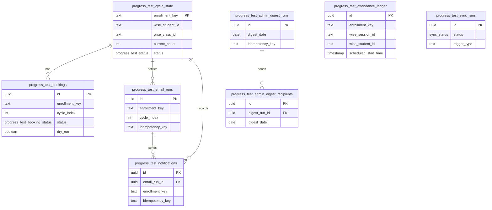

# Progress Tests ERD

Mechanical table reference for the Progress Tests domain. The domain is
cross-snapshot by design: attendance and cycle state must accumulate across
Credit Control snapshot rotations.

## Tables

| Table | Grain |
|---|---|
| `progress_test_attendance_ledger` | One class/student attendance row that can count toward a progress-test cycle. |
| `progress_test_cycle_state` | One durable cycle state row per enrollment key. |
| `progress_test_bookings` | One progress-test booking or manual-confirmation attempt. |
| `progress_test_email_runs` | One teacher heads-up email run for a cycle. |
| `progress_test_notifications` | One recipient row for a progress-test email run. |
| `progress_test_admin_digest_runs` | One daily admin digest run. |
| `progress_test_admin_digest_recipients` | One recipient row for an admin digest. |
| `progress_test_sync_runs` | One Progress Tests sync/cycle-recompute run. |

_Verified against HEAD + uncommitted WIP on 2026-07-02._
