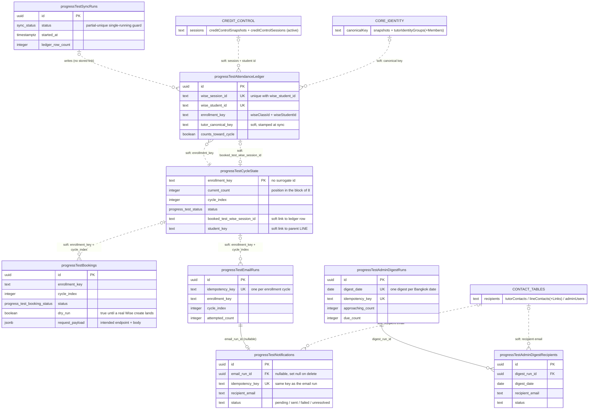

# Database Reference — Progress Tests (ER Diagram)

Scope: the 8 tables backing the Progress Tests feature. The domain tracks BeGifted's "a progress test every eight attended classes" contract per **enrollment** — a student-in-a-class pair — and drives the two email nudges around it.

Every operational table is keyed by `enrollment_key`, a synthetic text key built as `` `${wiseClassId}|${wiseStudentId}` `` (`src/lib/progress-tests/config.ts:35-37`). Six of the eight tables carry it; only the admin-digest pair does not, because a digest is per-date rather than per-enrollment.

The domain is split cleanly in two. A **durable spine** — an append-only attendance ledger plus a derived cycle-state row per enrollment — accumulates counts, and six **audit / side-effect trails** record what was booked and what was emailed. A **sync run** (`runProgressTestSync`, `src/lib/progress-tests/sync.ts:494`) refreshes the spine every half hour from the active Credit Control snapshot, and a pure engine (`src/lib/progress-tests/engine.ts`) turns ledger rows into the `accumulating → approaching → due → scheduled → completed` status.

**The defining structural decision is that the spine is cross-snapshot.** Neither the ledger nor the cycle state carries a `snapshot_id` FK, because attendance arrives through the Credit Control snapshot lineage, which is rewritten wholesale on every sync and keeps only a bounded past window — a count living inside a snapshot would reset on rotation. The schema records this as a deliberate deviation from the project's snapshot-scoped convention, naming `past_session_blocks` and `room_utilization_sessions` as precedent (`src/lib/db/schema.ts:2800-2813`).

Full column-by-column detail (types, defaults, every index) lives in [`./index.md`](./index.md); enum value sets live in [`./enums.md`](./enums.md). This page covers grain, keys, and relationships only. For purpose, business rules, and flows see [`../../features/progress-tests.md`](../../features/progress-tests.md).

## Scope

Exactly 8 tables (Drizzle export — Postgres table — `src/lib/db/schema.ts` line range):

| Table (varName) | Postgres table | Lines | Grain scope |
|---|---|---|---|
| `progressTestAttendanceLedger` | `progress_test_attendance_ledger` | 2815–2840 | durable spine, cross-snapshot, upsert-only |
| `progressTestCycleState` | `progress_test_cycle_state` | 2841–2876 | one row per enrollment (derived read model) |
| `progressTestBookings` | `progress_test_bookings` | 2877–2899 | one row per booking attempt |
| `progressTestEmailRuns` | `progress_test_email_runs` | 2900–2920 | one row per enrollment cycle |
| `progressTestNotifications` | `progress_test_notifications` | 2921–2939 | one row per enrollment cycle (delivery) |
| `progressTestAdminDigestRuns` | `progress_test_admin_digest_runs` | 2940–2961 | one row per Bangkok date |
| `progressTestAdminDigestRecipients` | `progress_test_admin_digest_recipients` | 2962–2977 | one row per recipient per digest run |
| `progressTestSyncRuns` | `progress_test_sync_runs` | 2978–3006 | run ledger (single-flight guard) |

Two enums are declared for this domain — `progress_test_status` (5 values, `schema.ts:181-187`) and `progress_test_booking_status` (6 values, `schema.ts:189-196`) — and the run ledger reuses the shared `sync_status`. Every other status column in the domain (`email_runs`, `notifications`, both digest tables) is plain `text` defaulting to `"pending"`, so the value sets there are conventions in code rather than constraints in Postgres.

Migrations: `drizzle/0038_cynical_karma.sql` creates all eight tables and both enums; `drizzle/0039_overrated_krista_starr.sql` adds the `schedule_method`, `booked_test_location`, and at-home columns to cycle state.

## Relationship model

**Enforced foreign keys.** The whole domain declares exactly two, and both stay inside it:

- `progressTestNotifications.emailRunId` → `progressTestEmailRuns.id`, **nullable**, `onDelete: "set null"` (`schema.ts:2923`)
- `progressTestAdminDigestRecipients.digestRunId` → `progressTestAdminDigestRuns.id`, `notNull` (`schema.ts:2964`)

Nothing outside the domain references a `progress_test_*` table, and no `progress_test_*` table references a core, credit-control, LINE, or tutor-profile table — a deliberate consequence of the cross-snapshot design.

The nullable FK is load-bearing rather than incidental. When the most-frequent tutor cannot be resolved to a contact email, the notification row is written with `emailRunId: null` and `status: "unresolved"` — no email run exists to point at, because nothing was attempted (`src/lib/progress-tests/teacher-heads-up.ts:293-311`).

**Soft keys, no FK.** Everything else joins on strings, resolved either at sync time (stamped onto the row) or at read time:

- **Ledger ↔ cycle state** on `enrollment_key`. The sync loads the whole ledger grouped by enrollment (`loadLedgerByEnrollment`, `src/lib/progress-tests/db.ts:274`), feeds each group through the engine, and upserts one cycle-state row per enrollment (`sync.ts:544-549`).
- **Ledger ← Credit Control** on `wise_session_id` + `wise_student_id`. The attendance source is the **active** credit-control snapshot's `credit_control_sessions`, filtered to `meetingStatus = ENDED`, `creditApplied > 0`, `sessionKind = 'past'`, and `scheduledStartTime >= 2026-03-01` Bangkok (`db.ts:64-98`, rule restated in `engine.ts:96-100`). The same query, narrowed to non-empty `teacherFeedback`, supplies the AI-summary notes (`db.ts:118-156`).
- **Ledger ← core identity** on Wise ids. `loadActiveIdentityEntries` reads `tutorIdentityGroupMembers ⋈ tutorIdentityGroups ⋈ snapshots WHERE snapshots.active` (`db.ts:201-221`) and `buildLedgerRows` copies the resolved `canonicalKey` / `displayName` onto the ledger row (`sync.ts:248-251`). Like Payroll, the value is **stamped at sync time**, so a later snapshot rotation never retroactively rewrites a stored row; an unresolvable teacher leaves the columns null and surfaces as a fail-closed issue rather than a guess.
- **Cycle state ↔ booking ↔ ledger** on `booked_test_wise_session_id`. A confirmed booking stamps the Wise session id onto cycle state and flips the matching ledger row to `is_progress_test = true, counts_toward_cycle = false` (`db.ts:429-440`); the next sync re-derives `isProgressTest` from that stored id (`sync.ts:233-236`), so the test session never counts toward its own cycle.
- **Cycle state → parent LINE** on `student_key`. The dashboard read batch-resolves verified parent contacts via `lineContactStudentLinks (status = 'verified') ⋈ lineContacts` (`src/lib/progress-tests/line.ts:34-48`).
- **Cycle state → tutor contact** on `most_frequent_tutor_canonical_key`. The heads-up recipient is resolved from `tutor_contacts`, preferring the onsite address and falling back to the online one (`teacher-heads-up.ts:101-116`).
- **Email run ↔ notification** additionally share the per-cycle idempotency key `progress-test:teacher:{enrollmentKey}:{cycleIndex}` (`teacher-heads-up.ts:82-84`), which is unique on both tables — so the FK and the key say the same thing twice, on purpose.

The digest pair shares no key with the rest of the domain. `buildDigestContent` re-queries cycle state by status — counting a row as `due` only when it has no booked test — and notifications by `status = 'unresolved'`, then stores just the resulting counts and the recipient list (`admin-digest.ts:101-138`).

## ER diagram

```mermaid
erDiagram
    progressTestSyncRuns {
        uuid id PK
        sync_status status "partial-unique single-running guard"
        timestamptz started_at
        integer ledger_row_count
    }
    progressTestAttendanceLedger {
        uuid id PK
        text wise_session_id UK "unique with wise_student_id"
        text wise_student_id UK
        text enrollment_key "wiseClassId + wiseStudentId"
        text tutor_canonical_key "soft, stamped at sync"
        boolean counts_toward_cycle
    }
    progressTestCycleState {
        text enrollment_key PK "no surrogate id"
        integer current_count "position in the block of 8"
        integer cycle_index
        progress_test_status status
        text booked_test_wise_session_id "soft link to ledger row"
        text student_key "soft link to parent LINE"
    }
    progressTestBookings {
        uuid id PK
        text enrollment_key
        integer cycle_index
        progress_test_booking_status status
        boolean dry_run "true until a real Wise create lands"
        jsonb request_payload "intended endpoint + body"
    }
    progressTestEmailRuns {
        uuid id PK
        text idempotency_key UK "one per enrollment cycle"
        text enrollment_key
        integer cycle_index
        integer attempted_count
    }
    progressTestNotifications {
        uuid id PK
        uuid email_run_id FK "nullable, set null on delete"
        text idempotency_key UK "same key as the email run"
        text recipient_email
        text status "pending / sent / failed / unresolved"
    }
    progressTestAdminDigestRuns {
        uuid id PK
        date digest_date UK "one digest per Bangkok date"
        text idempotency_key UK
        integer approaching_count
        integer due_count
    }
    progressTestAdminDigestRecipients {
        uuid id PK
        uuid digest_run_id FK
        date digest_date
        text recipient_email
        text status
    }
    CREDIT_CONTROL {
        text sessions "creditControlSnapshots + creditControlSessions (active)"
    }
    CORE_IDENTITY {
        text canonicalKey "snapshots + tutorIdentityGroups(+Members)"
    }
    CONTACT_TABLES {
        text recipients "tutorContacts / lineContacts(+Links) / adminUsers"
    }

    progressTestEmailRuns ||--o| progressTestNotifications : "email_run_id (nullable)"
    progressTestAdminDigestRuns ||--o{ progressTestAdminDigestRecipients : "digest_run_id"
    progressTestSyncRuns |o..o{ progressTestAttendanceLedger : "writes (no stored link)"
    progressTestAttendanceLedger }o..|| progressTestCycleState : "soft: enrollment_key"
    progressTestCycleState |o..o{ progressTestBookings : "soft: enrollment_key + cycle_index"
    progressTestCycleState |o..o| progressTestAttendanceLedger : "soft: booked_test_wise_session_id"
    progressTestCycleState |o..o{ progressTestEmailRuns : "soft: enrollment_key + cycle_index"
    CREDIT_CONTROL |o..o{ progressTestAttendanceLedger : "soft: session + student id"
    CORE_IDENTITY |o..o{ progressTestAttendanceLedger : "soft: canonical key"
    CONTACT_TABLES |o..o{ progressTestNotifications : "soft: recipient email"
    CONTACT_TABLES |o..o{ progressTestAdminDigestRecipients : "soft: recipient email"
```

## Tables

### `progressTestAttendanceLedger` (`progress_test_attendance_ledger`, lines 2815–2840)

**Grain:** one row per *(Wise session × student)* attended with credit on or after the counting start — unique on `(wiseSessionId, wiseStudentId)` via `ptal_session_student_idx`. This is the system of record; nothing in the feature deletes from it.

Carries the enrollment triple (`enrollmentKey`, `wiseClassId`, `wiseStudentId`), student display fields (`studentKey`, `studentName`, `subject`), the observation itself (`scheduledStartTime`, `creditApplied`, `meetingStatus`), the four denormalized teacher columns (`wiseTeacherUserId`, `wiseTeacherId`, `tutorCanonicalKey`, `tutorDisplayName`), two counting booleans, and the `firstObservedSnapshotId` / `capturedAt` provenance pair.

**The two booleans are the counting contract.** `isProgressTest` marks a row as the test itself; `countsTowardCycle` (default `true`) marks it as a regular class. The engine skips any row where either is set against it (`engine.ts:277-283` for the cycle count; `sync.ts:293` and `sync.ts:335` for the most-frequent-tutor tally). Only the confirmed-booking path ever flips them, and it flips both at once (`db.ts:436`).

**Upserts preserve first observation.** `appendLedgerRows` conflicts on the unique pair and overwrites only the mutable attendance fields — `meetingStatus`, `creditApplied`, `isProgressTest`, `countsTowardCycle`, `updatedAt` — leaving `capturedAt` and `firstObservedSnapshotId` untouched (`db.ts:252-264`). Rows are written in chunks of 500 because each binds 16 parameters and a full-snapshot append would otherwise blow Postgres's 65,535 bound-parameter ceiling (`db.ts:223-227`) — a limit unit tests with a handful of rows do not reach.

The second index, `ptal_enrollment_start_idx` on `(enrollmentKey, scheduledStartTime)`, matches the one read the sync actually performs: the whole ledger, ordered by enrollment then start time (`db.ts:277-283`).

### `progressTestCycleState` (`progress_test_cycle_state`, lines 2841–2876)

**Grain:** exactly one row per enrollment. `enrollmentKey` is the **primary key directly** — the only table in the domain with no surrogate `uuid id`.

A derived read model, rewritten by every sync from the engine's output. The fields that carry the rules are `currentCount` (position *within* the current block of 8, not a lifetime total), `cycleIndex` (blocks already accounted for), `status` (`progress_test_status`), and `teacherNotifiedForCycle` (the notify-once marker the engine reads to suppress a repeat heads-up). Around them sit the booking columns (`bookedTestWiseSessionId`, `bookedTestDate`, `bookedTestBookingMode`, `scheduleMethod`, `bookedTestLocation`), the at-home lifecycle pair (`atHomeSelectedAt` → `atHomeSubmittedAt`), the most-frequent-tutor pair, the cached `lastAiSummary` jsonb + timestamp, `lastClassDate`, and `updatedByEmail`.

`upsertCycleState` conflicts on the primary key and overwrites **every** derived column, so the row is a projection rather than an accumulator (`db.ts:322-354`). The one write that deliberately does not go through it is `storeCycleAiSummary`, a narrow `UPDATE` of `lastAiSummary` + `lastAiSummaryAt` that leaves the cycle fields alone (`db.ts:180-190`).

Its three indexes map to its three read patterns: `ptcs_status_idx` for the dashboard and digest status queries and the home-hub badge (`src/lib/home/summary.ts:112-117`), `ptcs_student_key_idx` for the parent-LINE join, and `ptcs_updated_at_idx` for recency ordering. Of the feature's own tables the dashboard reads only this one plus the latest sync-run timestamp — the ledger is never touched on the read path.

### `progressTestBookings` (`progress_test_bookings`, lines 2877–2899)

**Grain:** one row per booking *attempt* for one enrollment cycle — no unique constraint, so retries and at-home events stack up as history.

Holds `enrollmentKey` + `cycleIndex`, the `status` (`progress_test_booking_status`), the `dryRun` flag (schema default `true`), the intended `scheduledTestDate`, the Wise identifiers (`wiseClassId`, `wiseStudentId`, `wiseSessionId`, `wiseTeacherUserId`), the `location`, the `requestPayload` / `responsePayload` jsonb pair, `errorMessage`, and `createdByEmail` / `createdByName`.

**The row is written before the network call.** `confirmProgressTestBooking` inserts at `status: "recorded", dryRun: true` carrying the intended Wise endpoint string and body as `requestPayload`, then finalizes the same row in place with its terminal status — `manual_required` when the class or teacher cannot be resolved or the write flag is off, `failed` on an availability conflict, or `wise_created` with `dryRun: false` and the returned session id (`booking.ts:213-227`, `236`, `279-284`, `320-325`). At-home select and submit rows are instead inserted straight at their terminal status with a `{ mode: … }` payload and never finalized (`booking.ts:473-484`, `520-531`), as is the "an admin booked it directly in Wise" record (`booking.ts:375-387`).

The schema comment on `requestPayload` is a rule, not a note: never store secrets or PII in the payload (`db.ts:378-380`).

### `progressTestEmailRuns` (`progress_test_email_runs`, lines 2900–2920)

**Grain:** one row per *(enrollment × cycle)* teacher heads-up, enforced by `pt_email_runs_idempotency_idx` unique on `idempotencyKey`.

Carries `subject`, `triggerKind` (default and only written value `"approaching"`), `createdBy`, `lastError`, the `createdAt` / `sentAt` / `updatedAt` timestamps, and three counters.

**The counters accumulate across retries rather than being overwritten.** The upsert conflicts on the idempotency key and increments `attemptedCount` unconditionally, `successCount` only on a send, and `failedCount` only on a failure, while `sentAt` is set on success and otherwise left at its stored value (`teacher-heads-up.ts:246-263`). A cycle that failed twice and then succeeded therefore reads `attempted 3 / success 1 / failed 2` on a single row — a failed send retries to success on a later sync instead of duplicating.

### `progressTestNotifications` (`progress_test_notifications`, lines 2921–2939)

**Grain:** one row per *(enrollment × cycle)* delivery, unique on the **same** `idempotencyKey` the email run uses. Despite the plural name and the one-to-many shape the FK allows, the heads-up path produces exactly one recipient per cycle, so the relationship is one-to-one in practice.

Holds `notificationType` (default and only written value `"teacher_heads_up_email"`), `recipientEmail`, `status`, `providerMessageId`, `error`, and `sentAt`.

Two paths write it. The resolved path upserts with the email-run id and `status` `"sent"` or `"failed"`, clearing `sentAt` on failure (`teacher-heads-up.ts:345-369`). The unresolved path — no contact email for the most-frequent tutor — upserts with `emailRunId: null` and `status: "unresolved"`, recording the miss without inventing an email run (`teacher-heads-up.ts:293-311`). `status` is plain `text` with a `"pending"` default, so four values circulate and none is constrained by Postgres.

### `progressTestAdminDigestRuns` (`progress_test_admin_digest_runs`, lines 2940–2961)

**Grain:** one digest per Bangkok date. It carries **two** unique indexes — `pt_admin_digest_runs_date_idx` on `digestDate` and `pt_admin_digest_runs_idempotency_idx` on `idempotencyKey` (which is itself `progress-test-digest:{digestDate}`) — so the same fact is guarded twice.

Holds `subject`, `triggerKind` (default `"daily"`), `createdBy`, the reported `approachingCount` / `dueCount`, the delivery counters `attemptedCount` / `successCount` / `failedCount`, `lastError`, and `createdAt` / `sentAt` / `updatedAt`.

**The unique date is the single-flight guard.** `sendProgressTestAdminDigest` first short-circuits when any row already exists for today, then inserts; a concurrent invocation that loses the race catches the `23505` and treats it as "already created" rather than sending twice (`admin-digest.ts:229-270`). `finalizeDigestRun` derives a terminal `status` from the counters — `sent`, `partial` when some recipients failed, `failed` when all did — and a run with nothing to report is stamped `skipped` and never sent (`admin-digest.ts:274-293`, `332-344`). A missing `admin_users` recipient list is recorded as a failed run with an explicit reason, not a silent no-op (`admin-digest.ts:389-403`).

### `progressTestAdminDigestRecipients` (`progress_test_admin_digest_recipients`, lines 2962–2977)

**Grain:** one row per recipient per digest run. Plain inserts, no unique index — the parent run's unique `digestDate` already makes a duplicate set impossible.

Holds the `digestRunId` FK, a denormalized `digestDate`, `recipientEmail`, `status` (`"sent"` or `"failed"` as written), `providerMessageId`, `error`, and the timestamp pair. One row is inserted per recipient inside the send loop, on both the success and the failure branch, so the trail is complete even when the digest partially fails (`admin-digest.ts:416-434`).

The denormalized `digestDate` earns its own index alongside the run and email indexes, which is what lets "did this person get the digest on this date" be answered without joining.

### `progressTestSyncRuns` (`progress_test_sync_runs`, lines 2978–3006)

**Grain:** one row per attempted sync. Unlike Payroll's equivalent it is *not* scoped to a period — the sync always reprocesses the whole ledger.

Carries `status` (`sync_status`), `triggerType` (default `"manual"`), `actorEmail`, `startedAt` / `finishedAt`, five counters (`ledgerRowCount`, `enrollmentCount`, `approachingCount`, `dueCount`, `notificationCount`), `errorSummary`, and a `metadata` jsonb the sync fills with the attended-session and Wise-fetch counts plus the unresolved-teacher tally (`sync.ts:590-595`).

**Single-flight lives in Postgres:** `pt_sync_runs_single_running_idx` is a unique index on `status` filtered to `status = 'running'` (`schema.ts:2995-2997`). The guard around it is belt-and-braces — `acquireSyncRun` first sweeps `running` rows older than 20 minutes to `failed` with an explicit "still running after 20 minutes" reason, then looks for a live run and returns a `202` skip result, and *also* catches a `23505` from the insert and re-reads the running row (`run-sync-request.ts:48-135`). Failure is per-run: a throw inside the sync flips the row to `failed` and merges `{ error }` into `metadata` with a jsonb `||`, leaving the ledger and cycle state as the previous pass left them (`sync.ts:610-620`).

The dashboard's "last synced" label is `finishedAt ?? startedAt` of the newest run (`src/lib/progress-tests/service.ts:183-195`), and Data Health reads the newest runs of both this table and the digest table for its cron panel (`src/lib/data-health/dashboard.ts:776-777`).

## Cross-domain notes

- **Credit Control → the ledger** — the attendance source, read-only, from the *active* snapshot only. Progress Tests never writes a `credit_control_*` table. See [`./erd-credit-control.md`](./erd-credit-control.md).
- **Core identity → the ledger** — `snapshots` + `tutorIdentityGroups` + `tutorIdentityGroupMembers`, read at sync time and copied into the row (`db.ts:201-221`). See [`./erd-core.md`](./erd-core.md).
- **Contact tables → the notification trails** — `tutor_contacts` supplies the heads-up recipient ([`./erd-tutor-profiles.md`](./erd-tutor-profiles.md)), `line_contact_student_links` + `line_contacts` the parent chat link ([`./erd-line.md`](./erd-line.md)), and `admin_users` the digest recipient list.
- **Recommendation reads** — the booking dialog's room-verified slots come from `future_session_blocks` on the active Wise snapshot, the classroom room catalog, and the student's future `credit_control_sessions` (`db.ts:463-475`). All three are reads; no `progress_test_*` row records them.
- **No outbound writes at all** outside the eight tables here, with one flag-gated exception toward Wise itself (session create, off by default behind `WISE_SESSION_CREATE_VERIFIED`, `src/lib/progress-tests/config.ts:49-51`).

## Write-path note

Nothing in this domain runs in a transaction, and nothing deletes: `grep -n "\.delete("` over `src/lib/progress-tests/` and `src/app/api/progress-tests/` returns nothing. Durability comes instead from making every write idempotent on a stable key — the ledger on `(wiseSessionId, wiseStudentId)`, cycle state on `enrollmentKey`, the email trails on the per-cycle idempotency key, the digest on its date — so a partial sync self-heals on the next pass rather than needing a rollback. The sync's own step 5 is explicitly fail-isolated: an AI or email error is caught, logged, and never fails the run row (`sync.ts:569-577`).

Both scheduled writers are cron-driven: `25,55 * * * *` for the sync and `35 0 * * *` (07:35 Bangkok) for the digest (`vercel.json:20-27`, mirrored in `src/lib/data-health/cron-registry.ts:129-158`). Contracts for all nine endpoints — the six app routes that write bookings and cycle state, and the two internal cron routes — are in [`../api/progress-tests.md`](../api/progress-tests.md); schedules and health thresholds in [`../crons.md`](../crons.md).

## Open questions

- **`first_observed_snapshot_id` has no writer.** The schema comment presents it as the provenance link back to the source credit-control snapshot (`schema.ts:2810-2813`), and the upsert is careful to preserve it (`db.ts:233-236`), but `buildLedgerRows` never populates it (`sync.ts:230-255`) and no other code path sets it — a repo-wide grep finds it only in `schema.ts` and a test fixture that passes `null`. Every row therefore holds `NULL`. Whether the column is aspirational or was dropped from the writer is not answerable from the code.
- **`progress_test_booking_status` value `dry_run` is never assigned.** The enum declares it (`schema.ts:191`), but the dry-run case is represented as `status: "recorded"` with the separate `dryRun` boolean; the five values actually written are `recorded`, `wise_created`, `manual_required`, `manual_confirmed`, and `failed`. The `dry_run` value in `src/lib/line/data.ts:1015` belongs to a different, identically-named column on a LINE table.
- **The email trails carry no link back to the run that triggered them.** `runTeacherHeadsUpNotifications` takes a `syncRunId` in its input interface (`teacher-heads-up.ts:48`) and never persists or reads it; a manual resend passes the synthetic `` `manual-resend:${enrollmentKey}` `` (`src/lib/progress-tests/service.ts:430`), which likewise goes nowhere. So a heads-up row cannot be attributed to a sync run, and a scheduled send cannot be told from an admin resend after the fact.
- **The ledger grows without bound.** It is upsert-only across snapshot rotations by design, with no retention sweep anywhere in `src/` — the counterpart to `pruneOldSnapshots` for the snapshot tables. At what volume that becomes a problem, and what the intended trim is, is not determinable from the code.

_Verified against main@0cd1e81 (clean tree) on 2026-09-02._
