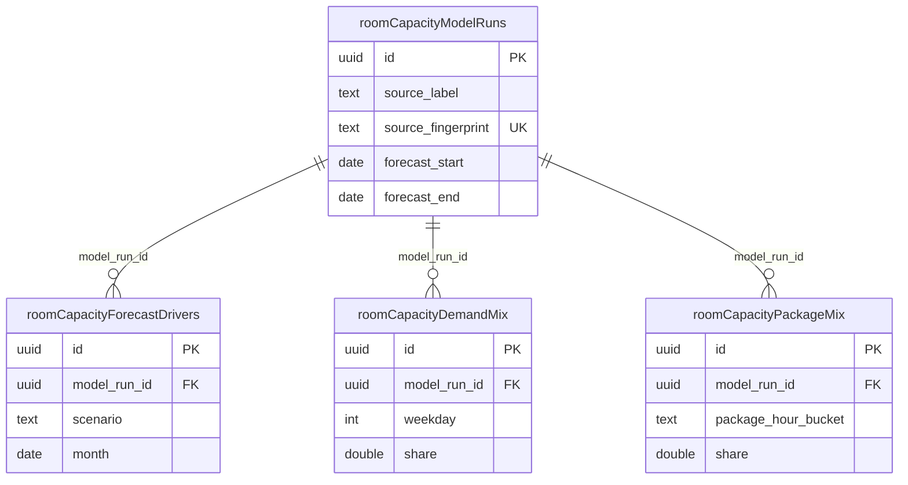

# Database Reference — Room Capacity

> **Maturity:** partial (per the [room-capacity feature doc](../../features/room-capacity.md)). These four tables back the month-pressure / saturation-forecast engines, which are complete and tested but currently have **no frontend consumer**.

Schema for the room-capacity forecasting model. One **model run** captures a forecast horizon (`forecast_start`..`forecast_end`) built from a labeled, fingerprinted source, and fans out into three detail tables: per-scenario/month **forecast drivers**, a **demand mix** of session shapes, and a **package mix** of sale/revenue buckets. Every detail row points back to its parent run.

All four tables are defined in `src/lib/db/schema.ts`:

| Table (varName) | SQL name | schema.ts lines |
|---|---|---|
| `roomCapacityModelRuns` | `room_capacity_model_runs` | 1936–1948 |
| `roomCapacityForecastDrivers` | `room_capacity_forecast_drivers` | 1950–1971 |
| `roomCapacityDemandMix` | `room_capacity_demand_mix` | 1973–1989 |
| `roomCapacityPackageMix` | `room_capacity_package_mix` | 1991–2005 |

Full column lists live in [docs/reference/database/index.md](./index.md). This page covers grain, keys, and relationships only.

## ER Diagram

This domain is self-contained: none of the four tables reference the core `snapshots`, `tutors`, or `tutor_identity_groups` tables (no `snapshot_id` / tutor / identity-group FK), so no core stub nodes are shown. (`room_utilization_sessions` — the live-utilization source owned by this feature but grouped under Core — is documented in the Core ERD, not here.)

## Tables

### `roomCapacityModelRuns` (`room_capacity_model_runs`)

**Grain:** one row per room-capacity forecast run.

The root of the domain. Identified by `id` (uuid PK, `defaultRandom()`). Each run records a human `source_label` and a `source_fingerprint` of the input data; the fingerprint carries a `uniqueIndex` (`rcmr_source_fingerprint_idx`, line 1947), so the same source data resolves to a single run (an idempotency / upsert key for re-runs). The forecast horizon is bounded by `forecast_start` / `forecast_end` (both `date`, `mode: "string"`). `metadata` is a non-null `jsonb` blob defaulting to `{}`. Provenance fields are `created_by` (nullable text) and `created_at` (timestamptz, `defaultNow()`, indexed by `rcmr_created_at_idx`, line 1946).

**Relationships:** parent (one-to-many) of `roomCapacityForecastDrivers`, `roomCapacityDemandMix`, and `roomCapacityPackageMix` via their `model_run_id`.

### `roomCapacityForecastDrivers` (`room_capacity_forecast_drivers`)

**Grain:** one row per (model run, scenario, month) — the monthly funnel-and-capacity drivers for a forecast scenario.

`model_run_id` (uuid, NOT NULL) references `roomCapacityModelRuns.id` (line 1952). A row is scoped by `scenario` (text) and `month` (`date`, string mode). It carries funnel inputs (`leads`, `lead_to_paid_conversion`, `new_paid_students`, `active_base_prior_month`), revenue (`projected_revenue_thb`, `uncapped_revenue_thb`), and capacity figures (`forecast_consumed_hours`, `scheduled_hours`, `teacher_capacity_hours`, `capacity_utilization_pct`, plus the `capacity_exceeded` boolean) — all `doublePrecision`/`boolean` with defaults. `seasonality_index` defaults to `1`. Indexed on `model_run_id` (`rcfd_model_run_idx`) and on the `(model_run_id, scenario, month)` composite (`rcfd_scenario_month_idx`, lines 1969–1970). Full column list: see [index.md](./index.md).

**Relationships:** child of `roomCapacityModelRuns`.

### `roomCapacityDemandMix` (`room_capacity_demand_mix`)

**Grain:** one row per distinct session shape within a model run (the demand-side mix of when/how sessions occur).

`model_run_id` (uuid, NOT NULL) references `roomCapacityModelRuns.id` (line 1975). Each row describes a session shape by `weekday` (integer), `start_minute`, `duration_minutes`, `mode` (text), and `student_count` (integer, default 1), with optional `subject` and `class_type` (both nullable text). `share` (`doublePrecision`, NOT NULL) is the fraction of demand this shape represents, and `observed_sessions` (integer, default 0) is the underlying sample count. Indexed on `model_run_id` (`rcdm_model_run_idx`) and `(model_run_id, weekday)` (`rcdm_weekday_idx`, lines 1987–1988).

**Relationships:** child of `roomCapacityModelRuns`.

### `roomCapacityPackageMix` (`room_capacity_package_mix`)

**Grain:** one row per package-hour bucket within a model run (the sales-side mix of package sizes and revenue).

`model_run_id` (uuid, NOT NULL) references `roomCapacityModelRuns.id` (line 1993). Each row is keyed by `package_hour_bucket` (text) and records `package_hours`, `average_revenue_thb`, and `share` (all `doublePrecision`, NOT NULL). Observed sample fields are `observed_sale_count` (integer, default 0) and `observed_student_count` (`doublePrecision`, default 0). Each row also carries its own `source_label` (text, NOT NULL). Indexed on `model_run_id` (`rcpm_model_run_idx`) and `(model_run_id, package_hour_bucket)` (`rcpm_bucket_idx`, lines 2003–2004).

**Relationships:** child of `roomCapacityModelRuns`.

_Verified against HEAD `d4fe6d3` on 2026-06-05._
