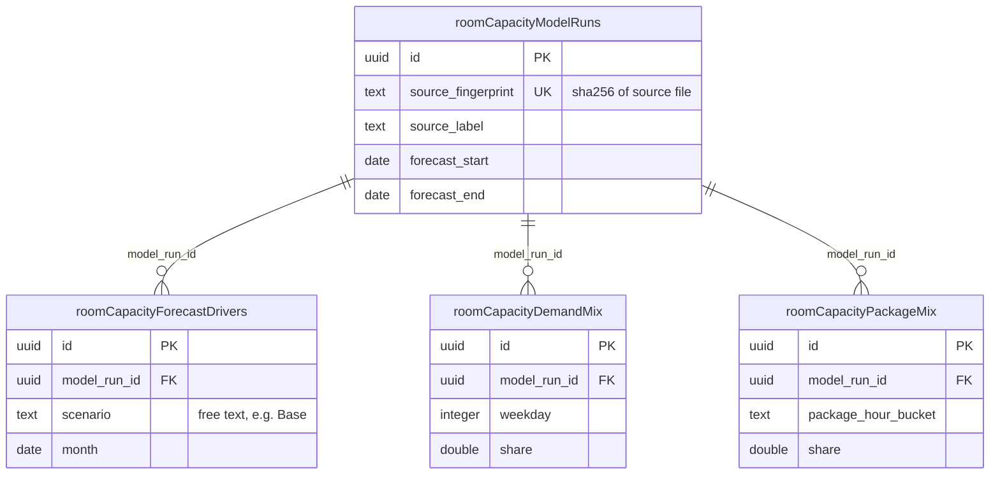

# Database Reference — Room Capacity

**Status: stable (utilization); forecast/month engines have no UI caller; sync is manualOnly.**

Scope: the four tables that persist the room-capacity **forecast model** — one `roomCapacityModelRuns` header fanning out into three aggregate detail tables (`roomCapacityForecastDrivers`, `roomCapacityDemandMix`, `roomCapacityPackageMix`), each child pointing back at its parent through `model_run_id`.

The schema comment sitting directly above these definitions states the design intent: they "store only aggregate forecast/model inputs from the private BeGifted datasets workspace", and Vercel runtime "must not read local workbook paths" (`src/lib/db/schema.ts:2724-2728`). The modelling happens offline; only the resulting aggregates land in Postgres.

| Table (varName) | SQL name | schema.ts lines |
|---|---|---|
| `roomCapacityModelRuns` | `room_capacity_model_runs` | 2729–2741 |
| `roomCapacityForecastDrivers` | `room_capacity_forecast_drivers` | 2743–2764 |
| `roomCapacityDemandMix` | `room_capacity_demand_mix` | 2766–2782 |
| `roomCapacityPackageMix` | `room_capacity_package_mix` | 2784–2798 |

Full column lists live in [docs/reference/database/index.md](./index.md); enum values live in [enums.md](./enums.md). Purpose, rules, and the meaning of the forecast live in the [Room Capacity feature doc](../../features/room-capacity.md). This page covers grain, keys, and relationships only.

Two scoping notes, so this page is not mistaken for the whole feature:

- The **utilization** path — the one part of Room Capacity with a live UI — does not use these tables. `room-capacity-dashboard.tsx` fetches only `/api/room-capacity/utilization` (`src/components/room-capacity/room-capacity-dashboard.tsx:354`); a repo-wide grep for `api/room-capacity` finds no non-test caller of the `forecast` or `month` endpoints.
- `room_utilization_sessions` and the `manualOnly` **Room Utilization** cron entry (`src/lib/data-health/cron-registry.ts:369-382`, `schedule: null`, `cadenceLabel: "Manual only"`) belong to the utilization lineage, **not** to the four tables here. These four have no cron and no API writer at all — see [Write and read paths](#write-and-read-paths).

## ER Diagram

```mermaid
erDiagram
    roomCapacityModelRuns {
        uuid id PK
        text source_fingerprint UK "sha256 of source file"
        text source_label
        date forecast_start
        date forecast_end
    }

    roomCapacityForecastDrivers {
        uuid id PK
        uuid model_run_id FK
        text scenario "free text, e.g. Base"
        date month
    }

    roomCapacityDemandMix {
        uuid id PK
        uuid model_run_id FK
        integer weekday
        double share
    }

    roomCapacityPackageMix {
        uuid id PK
        uuid model_run_id FK
        text package_hour_bucket
        double share
    }

    roomCapacityModelRuns ||--o{ roomCapacityForecastDrivers : "model_run_id"
    roomCapacityModelRuns ||--o{ roomCapacityDemandMix : "model_run_id"
    roomCapacityModelRuns ||--o{ roomCapacityPackageMix : "model_run_id"
```

**No core stub node is drawn, deliberately.** At the schema level this domain is self-contained: the only `.references(...)` calls across all four definitions point at `roomCapacityModelRuns.id` (`src/lib/db/schema.ts:2745`, `:2768`, `:2786`), and no table carries a `snapshotId`, a `canonicalKey`, or any other soft join key onto `snapshots` / `tutors` / `tutor_identity_groups`.

The link to core data exists but is **procedural and import-time only**: the importer reads `futureSessionBlocks` inner-joined to `tutorIdentityGroups` for the active snapshot to derive the demand mix (`scripts/import-room-capacity-model.ts:203-245`), then stores only the resulting aggregate shares. Nothing identifying the source snapshot is persisted on the row, so drawing a stored relationship to a core stub would assert a link the database does not hold.

## Tables

### `roomCapacityModelRuns` — `room_capacity_model_runs`

Source: `src/lib/db/schema.ts:2729-2741`.

**Grain**: one row per imported forecast run — one source projection file becomes one run.

**Keys**: `id` is a surrogate `uuid` PK (`defaultRandom()`, line 2730). The natural key is `sourceFingerprint` (`text`, not null), which carries a `uniqueIndex` — `rcmr_source_fingerprint_idx` (line 2740). The importer computes a SHA-256 over the raw file text and looks the run up by that fingerprint before inserting (`scripts/import-room-capacity-model.ts:278-284`), so re-importing byte-identical source data cannot create a second run: it logs `Model run already imported`, backfills any missing package-mix rows, and returns (lines 285-290).

**Other key columns**: `sourceLabel` (`text`, not null — the payload `title`, falling back to the file's basename, `import-room-capacity-model.ts:295`); the horizon bounds `forecastStart` / `forecastEnd` (`date`, string mode, both not null, and both required in the payload or the import throws, lines 274-276); `metadata` (`jsonb` typed `Record<string, unknown>`, not null, default `{}`, into which the importer folds the payload metadata plus a `sourceFile` basename, lines 299-302); `createdBy` (nullable `text`, set from `process.env.USER`, line 303); `createdAt` (timezone-aware `timestamp`, not null, `defaultNow()`), indexed by `rcmr_created_at_idx` (`src/lib/db/schema.ts:2739`).

**`created_at` is the read-path selector.** There is no `active` flag and no promotion gate in this domain — unlike the Wise snapshot model. `loadLatestModelRun` simply takes `ORDER BY created_at DESC LIMIT 1` (`src/lib/room-capacity/data.ts:293-300`), so the newest imported run wins immediately and unconditionally.

**Relationships**: parent, one-to-many, of all three detail tables via their `modelRunId`. Every FK is generated `ON DELETE no action ON UPDATE no action` (`drizzle/0007_purple_daredevil.sql:47-48`, `drizzle/0008_reflective_shadowcat.sql:14`), so a run cannot be deleted while any detail row still references it.

### `roomCapacityForecastDrivers` — `room_capacity_forecast_drivers`

Source: `src/lib/db/schema.ts:2743-2764`.

**Grain**: one row per (model run, scenario, month) — the monthly funnel-and-capacity drivers for one forecast scenario.

**Keys**: surrogate `uuid` PK (line 2744); `modelRunId` (`uuid`, not null) references `roomCapacityModelRuns.id` (line 2745). The business key is the `(modelRunId, scenario, month)` triple, indexed by `rcfd_scenario_month_idx` (line 2763) alongside a plain `rcfd_model_run_idx` (line 2762).

**Key columns** (full list in [index.md](./index.md)): `scenario` (`text`, not null) and `month` (`date`, string mode, not null) scope the row; the remaining columns are all `doublePrecision`/`boolean`, not null, with defaults — funnel inputs (`leads`, `leadToPaidConversion`, `newPaidStudents`, `activeBasePriorMonth`), revenue (`projectedRevenueThb`, `uncappedRevenueThb`), capacity (`forecastConsumedHours`, `scheduledHours`, `teacherCapacityHours`, `capacityUtilizationPct`, `capacityExceeded`), and `seasonalityIndex`, whose column default of `1` (line 2759) is mirrored by the importer's `|| 1` coalesce (`import-room-capacity-model.ts:322`).

**`scenario` is free text, not a `pgEnum`.** The importer stringifies whatever the source row carries and defaults to `"Base"` (`import-room-capacity-model.ts:309`); the reader derives the offered scenario list from the distinct stored values rather than a fixed set, matches case-insensitively (`driversForScenario`, `src/lib/room-capacity/forecast.ts:825-830`), and silently falls back to the first available scenario when the request names one with no rows (`src/lib/room-capacity/data.ts:394-397`).

**The composite index is not unique.** `drizzle/0007_purple_daredevil.sql:52` emits a plain `CREATE INDEX`, so nothing at the database level prevents two driver rows for the same run/scenario/month. Uniqueness rests entirely on the source projection file being well-formed. Rows whose `month` does not match `^\d{4}-\d{2}-\d{2}$` are dropped at import (`import-room-capacity-model.ts:323`) rather than rejected, so a malformed month silently shrinks the horizon.

**Relationships**: child of `roomCapacityModelRuns`. No other table references it.

### `roomCapacityDemandMix` — `room_capacity_demand_mix`

Source: `src/lib/db/schema.ts:2766-2782`.

**Grain**: one row per distinct session *shape* observed within a model run — the demand-side answer to "when, how long, in what mode, and for how many students do sessions happen".

**Keys**: surrogate `uuid` PK (line 2767); `modelRunId` (`uuid`, not null) references `roomCapacityModelRuns.id` (line 2768). Indexed by `rcdm_model_run_idx` and `(modelRunId, weekday)` as `rcdm_weekday_idx` (lines 2780-2781). The grouping key used by the producer is wider than either index — `weekday | startMinute | durationMinutes | mode | studentCount | subject | classType` (`src/lib/room-capacity/analysis.ts:262-270`) — and is not enforced by any unique constraint.

**Key columns**: the shape itself is `weekday`, `startMinute`, `durationMinutes` (all `integer`, not null), `mode` (`text`, not null), and `studentCount` (`integer`, not null, default 1), with nullable `subject` and `classType`. `share` (`doublePrecision`, not null, **no default**) is the fraction of demand this shape represents; `observedSessions` (`integer`, not null, default 0) is the underlying sample count.

Three behaviours are enforced in code, not by constraints:

- **`mode` is free text but is only ever written as the literal `"onsite"`.** The sole producer, `buildDemandMixFromSessions`, filters to onsite-eligible sessions and hard-codes `"onsite"` into both the grouping key and the emitted row (`src/lib/room-capacity/analysis.ts:249-254`, `:266`, `:275`). The reader's narrowing — anything not `"online"` or `"either"` becomes `"onsite"` (`src/lib/room-capacity/data.ts:330`) — is defensive against hand-written rows, not a path the importer exercises.
- **Rows are capped at 120, and the cap is applied *after* shares are computed.** `share` is `observedSessions / total` across the full grouped set (`analysis.ts:286-288`); only then does the importer `.slice(0, 120)` the sorted list (`import-room-capacity-model.ts:331`). Stored shares therefore describe a truncated distribution and do **not** re-normalize to 1.0.
- **Zero rows is a valid, expected state.** With no eligible sessions the builder returns `[]` (`analysis.ts:254`) and the importer inserts nothing (`import-room-capacity-model.ts:332`); the reader then derives a mix from the live schedule instead, via `seededDemandMixFromSchedule` (`src/lib/room-capacity/data.ts:408`, implementation at `src/lib/room-capacity/forecast.ts:832`).

**Relationships**: child of `roomCapacityModelRuns`. No other table references it.

### `roomCapacityPackageMix` — `room_capacity_package_mix`

Source: `src/lib/db/schema.ts:2784-2798`.

**Grain**: one row per package-hour bucket within a model run — the sales-side mix of package sizes, their student share, and their average revenue.

**Keys**: surrogate `uuid` PK (line 2785); `modelRunId` (`uuid`, not null) references `roomCapacityModelRuns.id` (line 2786). Indexed by `rcpm_model_run_idx` and `(modelRunId, packageHourBucket)` as `rcpm_bucket_idx` (lines 2796-2797) — again a plain index, not a unique one (`drizzle/0008_reflective_shadowcat.sql:16`).

**Key columns**: `packageHourBucket` (`text`, not null) is the bucket label; `packageHours`, `averageRevenueThb`, and `share` are `doublePrecision`, not null, **no defaults**; sample sizes are `observedSaleCount` (`integer`, default 0) and `observedStudentCount` (`doublePrecision`, default 0).

**This table carries its own `sourceLabel`**, distinct from the run's, because package mix is aggregated from a *directory* of sales workbooks rather than from the projection file. The value is the sorted, comma-joined set of contributing workbook labels, or the fallback string `"salesrecord paid package sales"` when no label survived (`src/lib/room-capacity/package-mix.ts:31`, `:72`). The directory is derived from the projection path — the segment before `/outputs/`, plus `salesrecord` (`import-room-capacity-model.ts:92-96`).

Bucket semantics, all from the sole producer `buildPackageMixFromSales` (`src/lib/room-capacity/package-mix.ts:29-75`):

- The bucket label is **per student, not per sale**: total package hours are divided by the sale's student count, rounded to the nearest 0.5h with a floor of 0.5h, and formatted `"3h"` / `"2.5h"` (lines 24-27, 40-43).
- `packageHours` and `averageRevenueThb` are per-student means within the bucket (lines 67-68), and `share` is `observedStudentCount / totalStudents` across buckets (line 69) — so shares are **student-weighted**, not sale-weighted, and do sum to 1.0 (nothing truncates this table).
- `observedStudentCount` is `doublePrecision` but integral in practice: the accumulator adds `Math.max(1, Math.round(...))` per sale (lines 40, 54). The column type is wider than any value the importer produces.

**This table landed after the other three** — migration `drizzle/0008_reflective_shadowcat.sql` versus `drizzle/0007_purple_daredevil.sql` — which is why the importer carries an explicit backfill path: given a run that already exists but has no package-mix rows, `ensurePackageMixForRun` inserts them without touching the run (`import-room-capacity-model.ts:174-201`). Pre-`0008` runs may therefore legitimately hold zero rows here, and so may new ones — a missing sales directory returns `[]` (line 170), as does an empty one (`package-mix.ts:62`).

**Relationships**: child of `roomCapacityModelRuns`. No other table references it.

## Write and read paths

- **Writes are manual and offline.** `scripts/import-room-capacity-model.ts` is the only writer to all four tables — a repo-wide grep for the four Drizzle exports outside `schema.ts` returns exactly this script plus the reader `src/lib/room-capacity/data.ts` (and the API route test). It is invoked as `npx tsx scripts/import-room-capacity-model.ts /path/to/projection_data.json` (`import-room-capacity-model.ts:266-269`). There is no `vercel.json` cron for this domain (a grep for `room` in `vercel.json` returns nothing) and no API route that inserts into these tables.
- **Reads** all funnel through `src/lib/room-capacity/data.ts`: `loadLatestModelRun` (line 293) picks the newest run, then `loadForecastDrivers` (302), `loadDemandMix` (320), and `loadPackageMix` (339) fetch its children; `getRoomCapacityForecast` (385) assembles the response served by `GET /api/room-capacity/forecast` (`src/app/api/room-capacity/forecast/route.ts:52`). Endpoint signatures live in [docs/reference/api/index.md](../api/index.md).
- **The four tables are treated as optional at runtime.** The forecast route classifies any error whose message mentions one of the four SQL table names as "not migrated here" and returns the `status: "missing"` body with **HTTP 200** instead of a 500 (`src/app/api/room-capacity/forecast/route.ts:6-14`, `:55-57`) — the project's optional-table convention. An environment that never applied `0007`/`0008` degrades to an empty forecast rather than erroring. The same shape is returned in-library when no run exists at all (`missingForecastResponse`, `src/lib/room-capacity/data.ts:358`, called at `:391`).

## Open Questions

- [`docs/reference/database/index.md`](./index.md) lists these four tables at `schema.ts` lines `2726-2738`, `2740-2761`, `2763-2779`, and `2781-2795`; the definitions are actually at `2729-2741`, `2743-2764`, `2766-2782`, and `2784-2798` at this revision. The index's ranges are stale by roughly three lines and should be refreshed when that page is next regenerated.
- Neither `rcfd_scenario_month_idx` nor `rcpm_bucket_idx` is unique, so duplicate driver rows for one (run, scenario, month) and duplicate package-hour buckets within a run are both representable. Whether that is a deliberate tolerance for messy source files or an oversight is not recorded anywhere in code or migration comments.
- Stored `roomCapacityDemandMix.share` values do not sum to 1.0 whenever the grouped set exceeded 120 rows before truncation. No consumer re-normalizes them (`src/lib/room-capacity/data.ts:320-338` passes `share` through unchanged), so it is unclear whether downstream saturation simulation assumes a normalized distribution.
- `roomCapacityModelRuns` has no `active` flag and no pruning path: runs accumulate and only the newest is ever read. Nothing in the repo states a retention policy for superseded runs or their detail rows, and the `no action` FKs mean deleting an old run requires deleting its children first.

_Verified against main@0cd1e81 (clean tree) on 2026-09-02._
