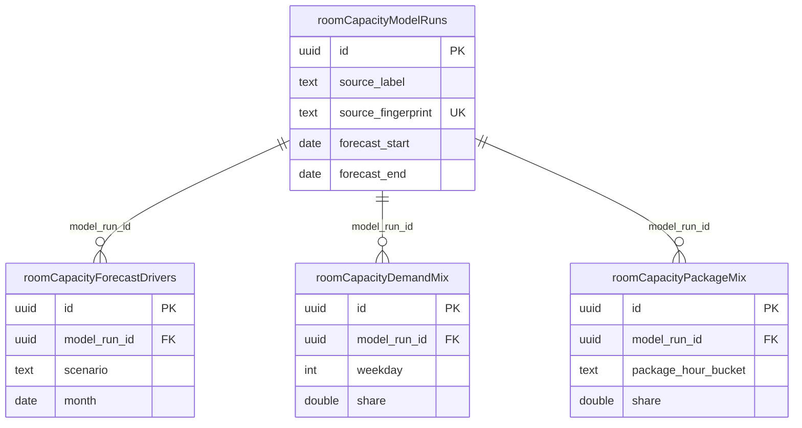

# Database Reference — Room Capacity

Schema for the room-capacity forecasting model. One **model run** captures a forecast horizon (`forecast_start`..`forecast_end`) built from a labeled, fingerprinted source file, and fans out into three detail tables: per-scenario/month **forecast drivers**, a **demand mix** of session shapes, and a **package mix** of sale/revenue buckets. Every detail row points back to its parent run via `model_run_id`.

The schema comment above these tables states the intent explicitly: they "store only aggregate forecast/model inputs from the private BeGifted datasets workspace", and Vercel runtime "must not read local workbook paths" (`src/lib/db/schema.ts:2721-2725`). The heavy lifting happens offline in `scripts/import-room-capacity-model.ts`; the app only reads the aggregates.

All four tables are defined in `src/lib/db/schema.ts`:

| Table (varName) | SQL name | schema.ts lines |
|---|---|---|
| `roomCapacityModelRuns` | `room_capacity_model_runs` | 2726–2739 |
| `roomCapacityForecastDrivers` | `room_capacity_forecast_drivers` | 2740–2762 |
| `roomCapacityDemandMix` | `room_capacity_demand_mix` | 2763–2780 |
| `roomCapacityPackageMix` | `room_capacity_package_mix` | 2781–2795 |

Full column lists live in [docs/reference/database/index.md](./index.md). This page covers grain, keys, and relationships only. Feature meaning (what the forecast is for, why the engines exist) lives in [docs/features/room-capacity.md](../../features/room-capacity.md).

## ER Diagram

```mermaid
erDiagram
    roomCapacityModelRuns {
        uuid id PK
        text source_label
        text source_fingerprint UK
        date forecast_start
        date forecast_end
    }
    roomCapacityForecastDrivers {
        uuid id PK
        uuid model_run_id FK
        text scenario
        date month
    }
    roomCapacityDemandMix {
        uuid id PK
        uuid model_run_id FK
        int weekday
        double share
    }
    roomCapacityPackageMix {
        uuid id PK
        uuid model_run_id FK
        text package_hour_bucket
        double share
    }

    roomCapacityModelRuns ||--o{ roomCapacityForecastDrivers : "model_run_id"
    roomCapacityModelRuns ||--o{ roomCapacityDemandMix : "model_run_id"
    roomCapacityModelRuns ||--o{ roomCapacityPackageMix : "model_run_id"
```

**No core stub node is shown, deliberately.** This domain is self-contained at the schema level: none of the four tables declares a foreign key or a soft join key to `snapshots`, `tutors`, or `tutor_identity_groups` — the only `.references(...)` calls in all four definitions point at `roomCapacityModelRuns.id` (`src/lib/db/schema.ts:2742`, `:2765`, `:2783`). The link to core data is procedural and import-time only: the importer reads `future_session_blocks` inner-joined to `tutor_identity_groups` for the **active** snapshot to derive the demand mix (`scripts/import-room-capacity-model.ts:203-245`), then stores only the resulting aggregate shares. Nothing identifying the source snapshot is persisted on the row, so a stored relationship to core tables would be a fiction.

## Tables

### `roomCapacityModelRuns` (`room_capacity_model_runs`)

**Grain:** one row per imported room-capacity forecast run (one source projection file → one run).

The root of the domain. `id` is a uuid PK with `defaultRandom()`. Each run records a human-readable `source_label` and a `source_fingerprint` of the input file; the fingerprint carries a `uniqueIndex` (`rcmr_source_fingerprint_idx`, `src/lib/db/schema.ts:2737`), so re-importing byte-identical source data cannot create a second run — the importer computes a SHA-256 over the raw file text, finds the existing run, and only backfills missing package-mix rows (`scripts/import-room-capacity-model.ts:278-290`). The forecast horizon is bounded by `forecast_start` / `forecast_end` (both `date`, string mode). `metadata` is a non-null `jsonb` blob defaulting to `{}`, into which the importer folds the payload metadata plus `sourceFile` (`scripts/import-room-capacity-model.ts:299-302`). Provenance is `created_by` (nullable text, set from `process.env.USER`) and `created_at` (timestamptz, `defaultNow()`), indexed by `rcmr_created_at_idx` (`src/lib/db/schema.ts:2736`).

That `created_at` index backs the read path: the forecast reader resolves the **latest** run by `ORDER BY created_at DESC LIMIT 1` — there is no `active`/promotion flag in this domain, unlike the Wise snapshot model (`src/lib/room-capacity/data.ts:293-300`).

**Relationships:** parent (one-to-many) of `roomCapacityForecastDrivers`, `roomCapacityDemandMix`, and `roomCapacityPackageMix` via their `model_run_id`. All three FKs are `ON DELETE no action ON UPDATE no action` (`drizzle/0007_purple_daredevil.sql:47-48`, `drizzle/0008_reflective_shadowcat.sql:14`), so a run cannot be deleted while detail rows exist.

### `roomCapacityForecastDrivers` (`room_capacity_forecast_drivers`)

**Grain:** one row per (model run, scenario, month) — the monthly funnel-and-capacity drivers for one forecast scenario.

`model_run_id` (uuid, NOT NULL) references `roomCapacityModelRuns.id` (`src/lib/db/schema.ts:2742`). A row is scoped by `scenario` (free text — not a `pgEnum`; the importer defaults it to `"Base"` when the source row omits it, `scripts/import-room-capacity-model.ts:309`) and `month` (`date`, string mode; rows whose month is not `YYYY-MM-DD` are dropped at import, line 323). It carries funnel inputs (`leads`, `lead_to_paid_conversion`, `new_paid_students`, `active_base_prior_month`), revenue (`projected_revenue_thb`, `uncapped_revenue_thb`), and capacity figures (`forecast_consumed_hours`, `scheduled_hours`, `teacher_capacity_hours`, `capacity_utilization_pct`, plus the `capacity_exceeded` boolean) — all `doublePrecision`/`boolean`, all NOT NULL with defaults. `seasonality_index` defaults to `1` in both the column definition and the importer (`|| 1`, line 322). Indexed on `model_run_id` (`rcfd_model_run_idx`) and on the `(model_run_id, scenario, month)` composite (`rcfd_scenario_month_idx`), `src/lib/db/schema.ts:2759-2760`.

Note the composite index is **not** unique (`drizzle/0007_purple_daredevil.sql:52` creates a plain `CREATE INDEX`) — nothing at the database level prevents two driver rows for the same run/scenario/month; uniqueness relies on the source projection file being well-formed.

The distinct `scenario` values offered by the API are derived from the stored rows rather than from a fixed list, and an unknown requested scenario silently falls back to the first available one (`src/lib/room-capacity/data.ts:394-397`).

**Relationships:** child of `roomCapacityModelRuns`.

### `roomCapacityDemandMix` (`room_capacity_demand_mix`)

**Grain:** one row per distinct session shape observed within a model run — the demand-side mix of when and how sessions occur.

`model_run_id` (uuid, NOT NULL) references `roomCapacityModelRuns.id` (`src/lib/db/schema.ts:2765`). Each row describes a session shape by `weekday` (integer), `start_minute`, `duration_minutes`, `mode` (text), and `student_count` (integer, default 1), with optional `subject` and `class_type` (both nullable text). `share` (`doublePrecision`, NOT NULL, no default) is the fraction of demand this shape represents; `observed_sessions` (integer, default 0) is the underlying sample count. Indexed on `model_run_id` (`rcdm_model_run_idx`) and `(model_run_id, weekday)` (`rcdm_weekday_idx`), `src/lib/db/schema.ts:2777-2778`.

Three behaviors worth knowing, all enforced in code rather than by constraints:

- **`mode` is free text but only ever written as `"onsite"`.** The sole producer, `buildDemandMixFromSessions`, filters to onsite-eligible sessions and then hard-codes the literal `"onsite"` into both the grouping key and the row (`src/lib/room-capacity/analysis.ts:250-253`, `:266`, `:275`). The reader's narrowing — anything that is not `"online"` or `"either"` becomes `"onsite"` (`src/lib/room-capacity/data.ts:330`) — is therefore defensive against hand-written rows, not something the import path exercises.
- **Row cap of 120, applied after shares are computed.** `share` is `observedSessions / total` over the *full* grouped set (`src/lib/room-capacity/analysis.ts:286-288`), and only then does the importer `.slice(0, 120)` the sorted list (`scripts/import-room-capacity-model.ts:331`). Stored shares are consequently a truncated distribution that does **not** re-normalize to 1.0.
- **Empty is a valid state.** If no eligible sessions exist, `buildDemandMixFromSessions` returns `[]` (line 254) and the importer inserts nothing (line 332), in which case the reader falls back to deriving a mix from the live schedule instead (`src/lib/room-capacity/data.ts:408`).

**Relationships:** child of `roomCapacityModelRuns`.

### `roomCapacityPackageMix` (`room_capacity_package_mix`)

**Grain:** one row per package-hour bucket within a model run — the sales-side mix of package sizes and their revenue.

`model_run_id` (uuid, NOT NULL) references `roomCapacityModelRuns.id` (`src/lib/db/schema.ts:2783`). Each row is keyed by `package_hour_bucket` (text) and records `package_hours`, `average_revenue_thb`, and `share` (all `doublePrecision`, NOT NULL, no defaults). Observed sample fields are `observed_sale_count` (integer, default 0) and `observed_student_count` (`doublePrecision`, default 0). Each row also carries its own `source_label` (text, NOT NULL), distinct from the run's `source_label`, because package mix is aggregated from a *directory* of sales workbooks rather than from the projection file — the label is the joined set of contributing workbook labels, or the fallback string `"salesrecord paid package sales"` (`src/lib/room-capacity/package-mix.ts:31`, `:72`; `scripts/import-room-capacity-model.ts:169-172`). Indexed on `model_run_id` (`rcpm_model_run_idx`) and `(model_run_id, package_hour_bucket)` (`rcpm_bucket_idx`), `src/lib/db/schema.ts:2793-2794`.

Bucket semantics, from the sole producer `buildPackageMixFromSales` (`src/lib/room-capacity/package-mix.ts:29-75`):

- The bucket label is derived **per student**, not per sale: total package hours are divided by the sale's student count, rounded to the nearest 0.5h with a floor of 0.5h, and formatted `"3h"` / `"2.5h"` (lines 24-27, 41-43).
- `package_hours` and `average_revenue_thb` are per-student means within the bucket (lines 67-68); `share` is `observedStudentCount / totalStudents` across buckets (line 69), so shares are student-weighted, not sale-weighted.
- `observed_student_count` is stored as `doublePrecision` but is integral in practice — the accumulator adds `Math.max(1, Math.round(...))` per sale (lines 40, 54). The column type is wider than the values the importer produces.

This table was added after the other three (migration `drizzle/0008_reflective_shadowcat.sql`, versus `drizzle/0007_purple_daredevil.sql` for the first three), which is why the importer has an explicit backfill path: if a run already exists but has no package-mix rows, it inserts them without touching the run (`scripts/import-room-capacity-model.ts:174-201`). Existing runs may therefore legitimately have zero rows here — and so may new ones, since an empty or missing sales directory yields no rows (`scripts/import-room-capacity-model.ts:170`, `src/lib/room-capacity/package-mix.ts:62`).

**Relationships:** child of `roomCapacityModelRuns`.

## Write and read paths

- **Writes**: manual only. `scripts/import-room-capacity-model.ts` (run as `npx tsx scripts/import-room-capacity-model.ts /path/to/projection_data.json`, line 268) is the sole writer to all four tables — a repo-wide grep for the four Drizzle exports outside `schema.ts` returns only this script and `src/lib/room-capacity/data.ts`. There is no cron entry for this domain in `vercel.json` and no API route that inserts into these tables.
- **Reads**: `src/lib/room-capacity/data.ts` — `loadLatestModelRun` (line 293) picks the newest run, then `loadForecastDrivers` (302), `loadDemandMix` (320), and `loadPackageMix` (339) fetch its children; `getRoomCapacityForecast` (385) assembles the response consumed by `GET /api/room-capacity/forecast` (`src/app/api/room-capacity/forecast/route.ts:52`). Endpoint signatures live in [docs/reference/api/index.md](../api/index.md).
- **The four tables are treated as optional.** The forecast route classifies any error whose message mentions one of the four SQL table names as "not migrated here" and returns the `status: "missing"` payload with **HTTP 200** rather than a 500 (`src/app/api/room-capacity/forecast/route.ts:6-13`, `:56-58`) — the project's optional-table convention. An environment that has never run `0007`/`0008` degrades to an empty forecast instead of erroring.

_Verified against HEAD + uncommitted WIP on 2026-05-31._
