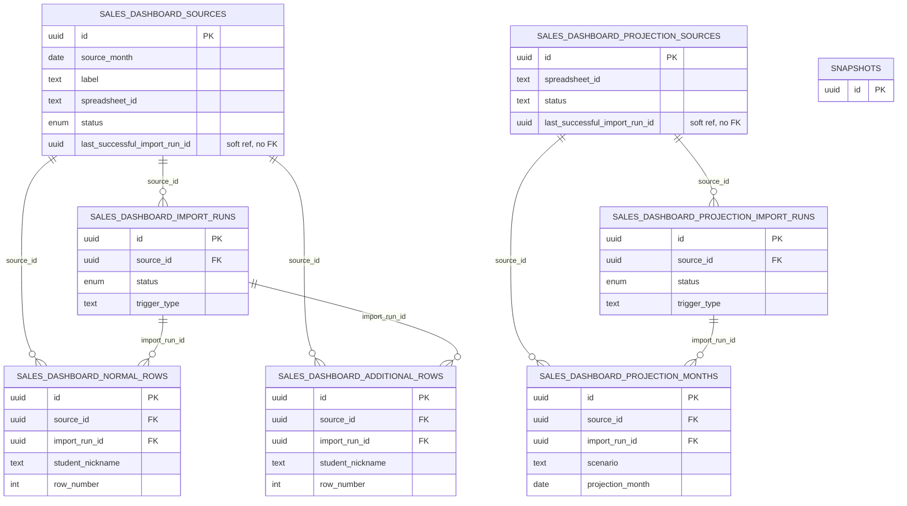

# Database Reference — Sales Dashboard

Mechanical reference for the seven tables that back the Sales Dashboard domain. This domain ingests sales data from Google Sheets (one sheet pair per month, plus a single projection workbook) and stores the imported rows for the dashboard UI.

All tables live in `src/lib/db/schema.ts` (lines 270–446). Full per-column lookups (types, defaults, nullability) live in [the column index](./index.md) — this page covers grain, key columns, and relationships only.

> Note: this domain is self-contained. None of these seven tables reference the core scheduling tables (`snapshots`, `tutors`, `tutor_identity_groups`). All foreign keys are internal to the Sales Dashboard tables. `snapshots` is shown as a stub below only to make the boundary explicit — there is no edge to it.

## ER Diagram

The diagram splits into two parallel sub-graphs that never join:

- **Monthly sales** — `sources` → `import_runs` → (`normal_rows`, `additional_rows`)
- **Projection** — `projection_sources` → `projection_import_runs` → `projection_months`

## Tables

### `salesDashboardSources` (schema.ts 270–301)

**Grain:** one row per monthly Google Sheet source (a `source_month` date plus the spreadsheet that holds that month's sales). A partial unique index `sds_source_month_active_idx` enforces one non-archived source per `source_month` (`WHERE archived_at IS NULL`, schema.ts 295–297).

**Key columns:** `id` (PK); `source_month`, `label`, `spreadsheetId` / `spreadsheetUrl` identify the sheet; `normalSheetName` / `additionalSheetName` name the two tabs to import; `status` is the `salesDashboardSourceStatusEnum` (`active`, `refreshing`, `finalized`, `reopened`, `archived` — schema.ts 134–140) with `statusBeforeArchive` preserving the prior status. Import bookkeeping is denormalized onto the source: `lastSuccessfulImportRunId`, `lastImportedAt`, `lastImportError`, `lastNormalRowCount`, `lastAdditionalRowCount`. Lifecycle timestamps: `finalizedAt`, `reopenedAt`, `archivedAt` (+ `archivedByEmail`). Audit: `connectedEmail`, `createdByEmail`, `updatedByEmail`, `createdAt`, `updatedAt`.

**Relationships:** parent of `salesDashboardImportRuns`, `salesDashboardNormalRows`, and `salesDashboardAdditionalRows` (all via `source_id`). `lastSuccessfulImportRunId` is a bare `uuid` with **no** `.references()` declared (schema.ts 279) — a soft pointer to `salesDashboardImportRuns`, not an enforced FK.

### `salesDashboardImportRuns` (schema.ts 302–322)

**Grain:** one row per import attempt for a source. A partial unique index `sdir_source_single_running_idx` allows at most one `running` run per source (`WHERE status = 'running' AND source_id IS NOT NULL`, schema.ts 318–320), giving single-flight protection.

**Key columns:** `id` (PK); `sourceId` (FK, nullable); `status` (`syncStatusEnum`: `running` / `success` / `failed`, schema.ts 19–23); `triggerType`; `startedAt` / `finishedAt`; result counts `sourceCount`, `normalRowCount`, `additionalRowCount`; `errorSummary`; `actorEmail`; free-form `metadata` jsonb.

**Relationships:** child of `salesDashboardSources` (`source_id` → `salesDashboardSources.id`, schema.ts 304). Parent of `salesDashboardNormalRows` and `salesDashboardAdditionalRows` via `import_run_id`. `sourceId` is nullable, so a run can exist without a source row.

### `salesDashboardNormalRows` (schema.ts 323–349)

**Grain:** one row per parsed line in the source's "normal" sales sheet, scoped to a single import run. Unique index `sdnr_run_row_idx` on (`import_run_id`, `row_number`) keeps each run's row numbers distinct (schema.ts 344).

**Key columns:** `id` (PK); `sourceId` (FK, not null); `importRunId` (FK, not null); `sourceMonth`; `rowNumber`. Sales payload: `studentNickname`, `program`, `packageHours`, `numberOfStudents`, `paymentAmount`, `salesRepresentative`, `paymentDate`, `enrollmentType`, `programWiseName`, `packageHoursClean`, `validUntil`, `churnStatus`. The original sheet row is retained in `raw` (jsonb). `createdAt` records insert time.

**Relationships:** child of both `salesDashboardSources` (`source_id`, schema.ts 325) and `salesDashboardImportRuns` (`import_run_id`, schema.ts 326). Leaf table — nothing references it.

### `salesDashboardAdditionalRows` (schema.ts 350–369)

**Grain:** one row per line in the source's "additional" sales sheet (the supplementary/add-on tab), scoped to one import run. Unique index `sdar_run_row_idx` on (`import_run_id`, `row_number`) (schema.ts 364).

**Key columns:** `id` (PK); `sourceId` (FK, not null); `importRunId` (FK, not null); `sourceMonth`; `rowNumber`; plus the lighter additional-sales payload `studentNickname`, `salesType`, `packageName`, `paymentAmount`, `paymentDate`, with the source row in `raw` (jsonb) and `createdAt`.

**Relationships:** child of `salesDashboardSources` (`source_id`, schema.ts 352) and `salesDashboardImportRuns` (`import_run_id`, schema.ts 353). Leaf table. Structurally parallel to `salesDashboardNormalRows` but with a distinct, smaller column set.

### `salesDashboardProjectionSources` (schema.ts 370–394)

**Grain:** one row per projection workbook. There is no `source_month` — a partial unique index `sdps_single_active_idx` allows only one `active` row at a time (`WHERE status = 'active'`, schema.ts 389–391), so the projection side is effectively a singleton source.

**Key columns:** `id` (PK); `spreadsheetId` / `spreadsheetUrl`; three named tabs `summarySheetName` (default `"Summary"`), `whatIfSheetName` (default `"What_If"`), `calcMultiSheetName` (default `"Calc_Multi"`); `status` is a plain `text` column (default `"active"`, **not** the enum used elsewhere — schema.ts 377). Denormalized import state: `lastSuccessfulImportRunId`, `lastImportedAt`, `lastImportError`, `lastProjectionMonthCount`, `lastTargetMonthlyRevenue`. Audit: `connectedEmail`, `createdByEmail`, `updatedByEmail`, `createdAt`, `updatedAt`.

**Relationships:** parent of `salesDashboardProjectionImportRuns` and `salesDashboardProjectionMonths` via `source_id`. `lastSuccessfulImportRunId` is a bare `uuid` with no `.references()` (schema.ts 378) — soft pointer to `salesDashboardProjectionImportRuns`.

### `salesDashboardProjectionImportRuns` (schema.ts 395–414)

**Grain:** one row per projection import attempt. Partial unique index `sdpir_source_single_running_idx` enforces one `running` run per source (schema.ts 410–412).

**Key columns:** `id` (PK); `sourceId` (FK, nullable); `status` (`syncStatusEnum`); `triggerType`; `startedAt` / `finishedAt`; `monthRowCount`; `targetMonthlyRevenue`; `errorSummary`; `actorEmail`; `metadata` jsonb.

**Relationships:** child of `salesDashboardProjectionSources` (`source_id`, schema.ts 397). Parent of `salesDashboardProjectionMonths` via `import_run_id`. Mirrors `salesDashboardImportRuns` for the projection sub-graph; differs in carrying `monthRowCount` / `targetMonthlyRevenue` instead of normal/additional counts.

### `salesDashboardProjectionMonths` (schema.ts 415–446)

**Grain:** one row per (scenario, projection month) within an import run — the per-month forecast figures. Unique index `sdpm_run_scenario_month_idx` on (`import_run_id`, `scenario`, `projection_month`) (schema.ts 439).

**Key columns:** `id` (PK); `sourceId` (FK, not null); `importRunId` (FK, not null); `scenario`; `projectionMonth`; `monthLabel`; `monthKind` (default `"forecast"`). Revenue metrics: `totalNetRevenue`, `renewalRevenue`, `newStudentRevenue`, `trialRevenue`. Volume/student metrics: `activeStudents`, `trialBookings`, `newStudents`, `packRenewals`. Hours metrics: `renewalHours`, `newStudentHours`, `trialHours`, `totalHours`. Capacity metrics: `roomCapacity`, `roomUtilization`. `createdAt` records insert time.

**Relationships:** child of `salesDashboardProjectionSources` (`source_id`, schema.ts 417) and `salesDashboardProjectionImportRuns` (`import_run_id`, schema.ts 418). Leaf table — the projection-side analogue of `salesDashboardNormalRows`.

## Cross-table notes

- **Two enums:** the monthly-sales `sources.status` uses `salesDashboardSourceStatusEnum`; the projection `projection_sources.status` is plain `text`. All four `import_runs` tables share `syncStatusEnum`.
- **Soft FKs:** both `lastSuccessfulImportRunId` columns (on `salesDashboardSources` and `salesDashboardProjectionSources`) are declared as bare `uuid` without `.references()`, so they are not DB-enforced foreign keys even though they logically point at the corresponding import-run tables.
- **No core-table coupling:** none of these tables carry a `snapshotId` or reference `snapshots` / `tutors` / identity-group tables.

_Verified against HEAD + uncommitted WIP on 2026-05-31._
