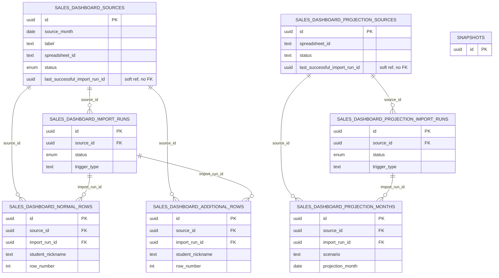

# Database Reference — Sales Dashboard

Mechanical reference for the seven tables that back the Sales Dashboard domain. This domain ingests sales data from Google Sheets (one sheet pair per month, plus a single projection workbook) and stores the imported rows for the dashboard UI.

All tables live in [`src/lib/db/schema.ts`](../../../src/lib/db/schema.ts) (lines 328–501). Full per-column lookups (types, defaults, nullability) live in [the column index](./index.md); enum value lists live in [enums.md](./enums.md) — this page covers grain, key columns, and relationships only.

> Note: this domain is self-contained. None of these seven tables reference the core scheduling tables (`snapshots`, `tutors`, `tutor_identity_groups`). All foreign keys are internal to the Sales Dashboard tables. `snapshots` is shown as a stub below only to make the boundary explicit — there is no edge to it (`schema.ts:328-501`).

## ER Diagram

Each entity shows only its primary key, foreign keys, and one or two identifying columns for legibility. The diagram splits into two parallel sub-graphs that never join.

The two sub-graphs share the same `source → import-run → parsed-rows` shape:

- **Monthly sales (actuals)** — `sources` → `import_runs` → (`normal_rows`, `additional_rows`)
- **Projection** — `projection_sources` → `projection_import_runs` → `projection_months`

## Tables

### `salesDashboardSources` (schema.ts 328–358)

**Grain:** one row per monthly Google Sheet source (a `source_month` date plus the spreadsheet that holds that month's sales). A partial unique index `sds_source_month_active_idx` enforces one non-archived source per `source_month` (`WHERE archived_at IS NULL`, schema.ts 353–355).

**Key columns:** `id` (PK, `defaultRandom`); `source_month`, `label`, `spreadsheetId` / `spreadsheetUrl` identify the sheet; the optional `normalSheetName` / `additionalSheetName` name the two tabs to import; `status` is the `salesDashboardSourceStatusEnum` defaulting to `active` (schema.ts 336), with `statusBeforeArchive` preserving the prior status on archive. Import bookkeeping is denormalized onto the source: `lastSuccessfulImportRunId`, `lastImportedAt`, `lastImportError`, `lastNormalRowCount`, `lastAdditionalRowCount` (schema.ts 337–341). Lifecycle timestamps: `finalizedAt`, `reopenedAt`, `archivedAt` (+ `archivedByEmail`) at schema.ts 342–346. Audit: `connectedEmail` (the Google OAuth token owner), `createdByEmail`, `updatedByEmail`, `createdAt`, `updatedAt`. Additional indexes: `sds_status_month_idx` on (`status`, `source_month`) and `sds_connected_email_idx` on `connected_email` (schema.ts 356–357).

**Relationships:** parent of `salesDashboardImportRuns`, `salesDashboardNormalRows`, and `salesDashboardAdditionalRows` (all via `source_id`). `lastSuccessfulImportRunId` is a bare `uuid` with **no** `.references()` declared (schema.ts 337) — a soft pointer to `salesDashboardImportRuns`, not an enforced FK.

### `salesDashboardImportRuns` (schema.ts 360–379)

**Grain:** one row per actuals-import attempt for a source. A partial unique index `sdir_source_single_running_idx` allows at most one `running` run per source (`WHERE status = 'running' AND source_id IS NOT NULL`, schema.ts 376–378), giving single-flight protection.

**Key columns:** `id` (PK); `sourceId` (FK, **nullable**, schema.ts 362); `status` is `syncStatusEnum` defaulting to `running` (schema.ts 363); `triggerType`; `startedAt` / `finishedAt`; result counts `sourceCount`, `normalRowCount`, `additionalRowCount`; `errorSummary`; `actorEmail`; free-form `metadata` jsonb (`Record<string, unknown>`, default `{}`). Read indexes: `sdir_source_started_idx` on (`source_id`, `started_at`) and `sdir_status_started_idx` on (`status`, `started_at`).

**Relationships:** child of `salesDashboardSources` (`source_id` → `salesDashboardSources.id`, schema.ts 362). Parent of `salesDashboardNormalRows` and `salesDashboardAdditionalRows` via `import_run_id`. `sourceId` is nullable, so a run can exist without a source row.

### `salesDashboardNormalRows` (schema.ts 381–406)

**Grain:** one row per parsed line in the source's "normal" (primary enrollment) sales sheet, scoped to a single import run. Unique index `sdnr_run_row_idx` on (`import_run_id`, `row_number`) keeps each run's row numbers distinct (schema.ts 402).

**Key columns:** `id` (PK); `sourceId` (FK, **not null**, schema.ts 383); `importRunId` (FK, **not null**, schema.ts 384); `sourceMonth` (denormalized onto the row); `rowNumber`. Sales payload: `studentNickname`, `program`, `packageHours`, `numberOfStudents`, `paymentAmount`, `salesRepresentative`, `paymentDate`, `enrollmentType`, `programWiseName`, `packageHoursClean`, `validUntil` (nullable), `churnStatus`. Numeric fields use `doublePrecision`; most text fields default to `""`. The original sheet row is retained in `raw` (jsonb, default `{}`); `createdAt` records insert time. Additional read indexes: `sdnr_source_run_idx` on (`source_id`, `import_run_id`), `sdnr_payment_date_idx` on `payment_date`, `sdnr_source_month_idx` on `source_month` (schema.ts 403–405).

**Relationships:** child of both `salesDashboardSources` (`source_id`, schema.ts 383) and `salesDashboardImportRuns` (`import_run_id`, schema.ts 384). Leaf table — nothing references it.

### `salesDashboardAdditionalRows` (schema.ts 408–426)

**Grain:** one row per line in the source's "additional" sales sheet (the supplementary/add-on tab), scoped to one import run. Unique index `sdar_run_row_idx` on (`import_run_id`, `row_number`) (schema.ts 422).

**Key columns:** `id` (PK); `sourceId` (FK, **not null**, schema.ts 410); `importRunId` (FK, **not null**, schema.ts 411); `sourceMonth`; `rowNumber`; plus the lighter additional-sales payload `studentNickname`, `salesType`, `packageName`, `paymentAmount` (`doublePrecision`), `paymentDate`, with the source row in `raw` (jsonb) and `createdAt`. Read indexes mirror the normal-rows set: `sdar_source_run_idx` on (`source_id`, `import_run_id`), `sdar_payment_date_idx` on `payment_date`, `sdar_source_month_idx` on `source_month` (schema.ts 423–425).

**Relationships:** child of `salesDashboardSources` (`source_id`, schema.ts 410) and `salesDashboardImportRuns` (`import_run_id`, schema.ts 411). Leaf table. Structurally parallel to `salesDashboardNormalRows` but with a distinct, smaller column set.

### `salesDashboardProjectionSources` (schema.ts 428–451)

**Grain:** one row per projection workbook. There is no `source_month` — a partial unique index `sdps_single_active_idx` allows only one `active` row at a time (`WHERE status = 'active'`, schema.ts 447–449), so the projection side is effectively a singleton source.

**Key columns:** `id` (PK); `spreadsheetId` / `spreadsheetUrl`; three named tabs `summarySheetName` (default `"Summary"`), `whatIfSheetName` (default `"What_If"`), `calcMultiSheetName` (default `"Calc_Multi"`) at schema.ts 432–434; `status` is a plain `text` column (default `"active"`, **not** the enum used by the actuals source — schema.ts 435). Denormalized import state: `lastSuccessfulImportRunId`, `lastImportedAt`, `lastImportError`, `lastProjectionMonthCount`, `lastTargetMonthlyRevenue` (schema.ts 436–440). Audit: `connectedEmail`, `createdByEmail`, `updatedByEmail`, `createdAt`, `updatedAt`. Additional index: `sdps_connected_email_idx` on `connected_email` (schema.ts 450).

**Relationships:** parent of `salesDashboardProjectionImportRuns` and `salesDashboardProjectionMonths` via `source_id`. `lastSuccessfulImportRunId` is a bare `uuid` with no `.references()` (schema.ts 436) — soft pointer to `salesDashboardProjectionImportRuns`.

### `salesDashboardProjectionImportRuns` (schema.ts 453–471)

**Grain:** one row per projection import attempt. Partial unique index `sdpir_source_single_running_idx` enforces one `running` run per source (`WHERE status = 'running' AND source_id IS NOT NULL`, schema.ts 468–470).

**Key columns:** `id` (PK); `sourceId` (FK, **nullable**, schema.ts 455); `status` (`syncStatusEnum`, default `running`); `triggerType`; `startedAt` / `finishedAt`; `monthRowCount`; `targetMonthlyRevenue` (`doublePrecision`, nullable); `errorSummary`; `actorEmail`; `metadata` jsonb. Read indexes: `sdpir_source_started_idx` on (`source_id`, `started_at`) and `sdpir_status_started_idx` on (`status`, `started_at`).

**Relationships:** child of `salesDashboardProjectionSources` (`source_id`, schema.ts 455). Parent of `salesDashboardProjectionMonths` via `import_run_id`. Mirrors `salesDashboardImportRuns` for the projection sub-graph; differs in carrying `monthRowCount` / `targetMonthlyRevenue` instead of normal/additional counts.

### `salesDashboardProjectionMonths` (schema.ts 473–501)

**Grain:** one row per (`scenario`, `projection_month`) within an import run — the per-month forecast figures. `scenario` is a `text` discriminator (e.g. Bear/Base/Bull). Unique index `sdpm_run_scenario_month_idx` on (`import_run_id`, `scenario`, `projection_month`) (schema.ts 497).

**Key columns:** `id` (PK); `sourceId` (FK, **not null**, schema.ts 475); `importRunId` (FK, **not null**, schema.ts 476); `scenario`; `projectionMonth`; `monthLabel`; `monthKind` (`text`, default `"forecast"`). Revenue metrics: `totalNetRevenue`, `renewalRevenue`, `newStudentRevenue`, `trialRevenue`. Volume/student metrics: `activeStudents`, `trialBookings`, `newStudents`, `packRenewals`. Hours metrics: `renewalHours`, `newStudentHours`, `trialHours`, `totalHours`. Capacity metrics: `roomCapacity`, `roomUtilization`. Every metric is `doublePrecision` defaulting to `0` (schema.ts 481–494); `createdAt` records insert time. Additional read indexes: `sdpm_source_run_idx` on (`source_id`, `import_run_id`), `sdpm_month_idx` on `projection_month`, `sdpm_scenario_month_idx` on (`scenario`, `projection_month`) at schema.ts 498–500.

**Relationships:** child of `salesDashboardProjectionSources` (`source_id`, schema.ts 475) and `salesDashboardProjectionImportRuns` (`import_run_id`, schema.ts 476). Leaf table — the projection-side analogue of `salesDashboardNormalRows`.

## Cross-table notes

- **Two `status` representations:** the monthly-sales `sources.status` uses `salesDashboardSourceStatusEnum` (schema.ts 336); the projection `projection_sources.status` is plain `text` (schema.ts 435). All four `import_runs` tables share `syncStatusEnum`. Enum value lists are in [enums.md](./enums.md).
- **Soft FKs:** both `lastSuccessfulImportRunId` columns (on `salesDashboardSources` schema.ts 337 and `salesDashboardProjectionSources` schema.ts 436) are declared as bare `uuid` without `.references()`, so they are not DB-enforced foreign keys even though they logically point at the corresponding import-run tables.
- **Nullable vs. not-null `source_id`:** the two `import_runs` tables declare `sourceId` as a nullable FK (schema.ts 362, 455), while all four parsed-row tables declare `sourceId` / `importRunId` as **not-null** FKs.
- **No core-table coupling:** none of these tables carry a `snapshotId` or reference `snapshots` / `tutors` / identity-group tables.

_Verified against HEAD `d4fe6d3` on 2026-06-05._
