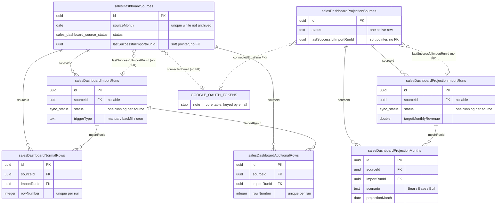

# Database Reference — Sales Dashboard Domain (ER Diagram)

The sales-dashboard domain has **no snapshot lineage**. It is a pair of parallel Google-Sheets import pipelines whose "current truth" is a *pointer*: each source row carries a `lastSuccessfulImportRunId`, and every read scopes its row selection to that run id, so a partially written or failed run can never leak into the dashboard (`src/lib/sales-dashboard/data.ts:869-884`, `:825-841`). Nothing is deleted or promoted — superseded runs and their rows stay in place forever, simply unreferenced.

The two pipelines are structurally identical but independent:

- **Monthly sales** — one workbook per calendar month (`salesDashboardSources`), imported into two parsed row tables (`salesDashboardNormalRows`, `salesDashboardAdditionalRows`) via `salesDashboardImportRuns`.
- **Scenario projection** — a single workbook (`salesDashboardProjectionSources`) parsed into Bear/Base/Bull month rows (`salesDashboardProjectionMonths`) via `salesDashboardProjectionImportRuns`.

Both are driven by the same cron entry, `/api/internal/sync-sales-dashboard` at `10,40 * * * *` (`vercel.json:8-9`), which calls `importRefreshableSalesSources` and then `importActiveSalesDashboardProjectionSource` (`src/app/api/internal/sync-sales-dashboard/route.ts:53-60`; the route carries `maxDuration = 800`).

All 7 tables below are defined in `src/lib/db/schema.ts`. Full per-column type and constraint detail lives in [`./index.md`](./index.md) — this page covers grain, keys, and relationships only. For purpose, business rules, and flows see [`../../features/sales-dashboard.md`](../../features/sales-dashboard.md); enum value sets live in [`./enums.md`](./enums.md).

## Scope

Exactly 7 tables (varName — `schema.ts` line range):

| Table (var) | Postgres table | Lines |
|---|---|---|
| `salesDashboardSources` | `sales_dashboard_sources` | 618–649 |
| `salesDashboardImportRuns` | `sales_dashboard_import_runs` | 650–670 |
| `salesDashboardNormalRows` | `sales_dashboard_normal_rows` | 671–697 |
| `salesDashboardAdditionalRows` | `sales_dashboard_additional_rows` | 698–717 |
| `salesDashboardProjectionSources` | `sales_dashboard_projection_sources` | 718–742 |
| `salesDashboardProjectionImportRuns` | `sales_dashboard_projection_import_runs` | 743–762 |
| `salesDashboardProjectionMonths` | `sales_dashboard_projection_months` | 763–794 |

## Relationship model

**Two disjoint FK trees, eight enforced FKs, all internal to the domain.**

Sales tree:

- `salesDashboardImportRuns.sourceId` → `salesDashboardSources.id` (**nullable**, schema.ts:652)
- `salesDashboardNormalRows.sourceId` → `salesDashboardSources.id` (not null, schema.ts:673)
- `salesDashboardNormalRows.importRunId` → `salesDashboardImportRuns.id` (not null, schema.ts:674)
- `salesDashboardAdditionalRows.sourceId` / `.importRunId` — the same pair (both not null, schema.ts:700–701)

Projection tree:

- `salesDashboardProjectionImportRuns.sourceId` → `salesDashboardProjectionSources.id` (**nullable**, schema.ts:745)
- `salesDashboardProjectionMonths.sourceId` → `salesDashboardProjectionSources.id` (not null, schema.ts:765)
- `salesDashboardProjectionMonths.importRunId` → `salesDashboardProjectionImportRuns.id` (not null, schema.ts:766)

Every FK is emitted `ON DELETE no action ON UPDATE no action` (`drizzle/0020_sales_dashboard.sql:89-93`, `drizzle/0029_sales_dashboard_projection.sql:60-64`), and no code path under `src/lib/sales-dashboard/**` issues a `.delete()` — the row tables are append-only with no pruning job.

**The "current" pointer is deliberately *not* a foreign key.** `salesDashboardSources.lastSuccessfulImportRunId` (schema.ts:627) and `salesDashboardProjectionSources.lastSuccessfulImportRunId` (schema.ts:726) are bare `uuid` columns with no `.references()`. They are the most load-bearing link in the domain — `loadLiveRowData` collects them across non-archived sources and filters the row tables by `importRunId IN (…)` (`data.ts:869-884`) — yet they carry no referential integrity. They appear below as dashed edges.

**No cross-domain FKs exist in either direction.** Two soft dependencies are worth naming:

- `connectedEmail` on both source tables is the Google account whose stored OAuth token fetches the workbook. It is plain `text` matched by value against `googleOAuthTokens.email` (schema.ts:587–588), with no FK.
- Wise-activity reconciliation reads `salesDashboardNormalRows` scoped to `lastSuccessfulImportRunId` to match package sales against Wise events (`src/lib/wise-activity/reconciliation.ts:847-852`), and Data Health lists both run tables on the sync-status board (`src/lib/data-health/dashboard.ts:771-772`). Both are read-only consumers, not schema relationships.

## ER diagram

```mermaid
erDiagram
    salesDashboardSources {
        uuid id PK
        date sourceMonth "unique while not archived"
        sales_dashboard_source_status status
        uuid lastSuccessfulImportRunId "soft pointer, no FK"
    }
    salesDashboardImportRuns {
        uuid id PK
        uuid sourceId FK "nullable"
        sync_status status "one running per source"
        text triggerType "manual / backfill / cron"
    }
    salesDashboardNormalRows {
        uuid id PK
        uuid sourceId FK
        uuid importRunId FK
        integer rowNumber "unique per run"
    }
    salesDashboardAdditionalRows {
        uuid id PK
        uuid sourceId FK
        uuid importRunId FK
        integer rowNumber "unique per run"
    }
    salesDashboardProjectionSources {
        uuid id PK
        text status "one active row"
        uuid lastSuccessfulImportRunId "soft pointer, no FK"
    }
    salesDashboardProjectionImportRuns {
        uuid id PK
        uuid sourceId FK "nullable"
        sync_status status "one running per source"
        double targetMonthlyRevenue
    }
    salesDashboardProjectionMonths {
        uuid id PK
        uuid sourceId FK
        uuid importRunId FK
        text scenario "Bear / Base / Bull"
        date projectionMonth
    }

    GOOGLE_OAUTH_TOKENS {
        stub note "core table, keyed by email"
    }

    salesDashboardSources ||--o{ salesDashboardImportRuns : "sourceId"
    salesDashboardSources ||--o{ salesDashboardNormalRows : "sourceId"
    salesDashboardSources ||--o{ salesDashboardAdditionalRows : "sourceId"
    salesDashboardImportRuns ||--o{ salesDashboardNormalRows : "importRunId"
    salesDashboardImportRuns ||--o{ salesDashboardAdditionalRows : "importRunId"
    salesDashboardSources }o..o| salesDashboardImportRuns : "lastSuccessfulImportRunId (no FK)"

    salesDashboardProjectionSources ||--o{ salesDashboardProjectionImportRuns : "sourceId"
    salesDashboardProjectionSources ||--o{ salesDashboardProjectionMonths : "sourceId"
    salesDashboardProjectionImportRuns ||--o{ salesDashboardProjectionMonths : "importRunId"
    salesDashboardProjectionSources }o..o| salesDashboardProjectionImportRuns : "lastSuccessfulImportRunId (no FK)"

    salesDashboardSources }o..o| GOOGLE_OAUTH_TOKENS : "connectedEmail (no FK)"
    salesDashboardProjectionSources }o..o| GOOGLE_OAUTH_TOKENS : "connectedEmail (no FK)"
```

> Dashed edges (`..`) are soft links by value, not enforced foreign keys. `GOOGLE_OAUTH_TOKENS` is a stub node standing in for the core `google_oauth_tokens` table (schema.ts:587–597); it is not expanded here.

## Per-table description

### `salesDashboardSources` (schema.ts:618–649)
**Grain:** one row per calendar month of sales — the registered Google Sheets workbook for that month, plus its lifecycle state and last-import rollups.
**Key columns:** `id` (PK); `sourceMonth` (`date`, month start); `label`; `spreadsheetId` / `spreadsheetUrl`; the optional tab overrides `normalSheetName` / `additionalSheetName` (nullable — when null the importer falls back through `chooseSheetName`, preferring `(1)PackageSales` then the legacy `SalesRecord`, and `(2)AdditionalSales`; `src/lib/sales-dashboard/parser.ts:6-9`, `data.ts:148-151`, `:466-472`); `status` (`salesDashboardSourceStatusEnum` — `active` / `refreshing` / `finalized` / `reopened` / `archived`, schema.ts:152–158); `lastSuccessfulImportRunId`, `lastImportedAt`, `lastImportError`, `lastNormalRowCount`, `lastAdditionalRowCount`; lifecycle timestamps `finalizedAt` / `reopenedAt` / `archivedAt` plus `archivedByEmail` and `statusBeforeArchive`; `connectedEmail`; actor audit `createdByEmail` / `updatedByEmail`; `createdAt` / `updatedAt`.
**Constraints:** the unique index `sds_source_month_active_idx` is **partial** — unique on `sourceMonth` only `WHERE archived_at IS NULL` (schema.ts:643–645). That is what makes archiving a soft delete: an archived month keeps all its rows and stops occupying the month slot. Restore therefore re-checks the slot explicitly and refuses if a live source already holds it (`data.ts:365-376`). Secondary indexes on (`status`, `sourceMonth`) and `connectedEmail` (schema.ts:646–647).
**Lifecycle notes:** `statusBeforeArchive` is the restore target, coerced to `active` when it was `archived` or `refreshing` (`data.ts:379-381`). `status` is set to `refreshing` for the duration of an import and rolled back to `previousStatus` on failure (`data.ts:459-462`, `:559-562`). The post-success status comes from `statusAfterSuccessfulImport`, which finalizes any month older than the current one — the previous month gets a 7-day Bangkok grace window — and never demotes `archived` or `reopened` (`src/lib/sales-dashboard/lifecycle.ts:21-33`). Archiving is blocked while a source is `refreshing` (`data.ts:335-337`).
**Relationships:** parent of `salesDashboardImportRuns`, `salesDashboardNormalRows`, and `salesDashboardAdditionalRows`. Soft-links to one import run via `lastSuccessfulImportRunId` and to a Google token via `connectedEmail`.

### `salesDashboardImportRuns` (schema.ts:650–670)
**Grain:** one row per import attempt against one monthly source.
**Key columns:** `id` (PK); `sourceId` (nullable FK); `status` (`syncStatusEnum` — `running` / `success` / `failed`, default `running`, schema.ts:21–25); `triggerType` (plain `text`; values `manual` / `backfill` / `cron` per `SalesImportTrigger`, `src/lib/sales-dashboard/types.ts:2`); `startedAt` / `finishedAt`; rollups `sourceCount` (set to 1 at acquisition, `src/lib/sales-dashboard/import-guard.ts:192`), `normalRowCount`, `additionalRowCount`; `errorSummary`; `actorEmail`; `metadata` jsonb.
**Constraints:** the partial unique index `sdir_source_single_running_idx` is the single-flight guard, permitting at most one `status = 'running'` row per non-null `sourceId` (schema.ts:666–668). `acquireSalesImportRun` treats a `23505` unique violation as "another caller won the race" and returns a skipped result instead of throwing (`import-guard.ts:199-215`).
**Stale-run recovery:** runs still `running` after `STALE_RUNNING_SALES_IMPORT_MS = 20 minutes` are force-failed with a fixed `errorSummary` (`import-guard.ts:6`, `:97-125`). Because a crashed import strands its source in `refreshing`, the pre-import status is stashed in `metadata.previousStatus` at acquisition (`import-guard.ts:194`) and read back by `restoreStaleSourceStatuses` to return the source to `active` / `finalized` / `reopened` (`import-guard.ts:74-95`).
**Metadata contents:** on success the run also records the resolved tab names and the workbook's full sheet-title list — `normalSheetName`, `additionalSheetName`, `availableSheetNames` (`data.ts:525-529`).
**Relationships:** child of `salesDashboardSources`; parent of both monthly row tables. Also read by the Data Health board (`src/lib/data-health/dashboard.ts:771`).

### `salesDashboardNormalRows` (schema.ts:671–697)
**Grain:** one parsed row of the *normal* (package sales) tab, per import run — re-importing the same spreadsheet row produces a new row under a new `importRunId`, never an update.
**Key columns:** `id` (PK); `sourceId` + `importRunId` (both not-null FKs); `sourceMonth` (denormalized from the source); `rowNumber` (the 1-based spreadsheet row, computed as `HEADER_ROW + rowIndex + 1` with `HEADER_ROW = 3`, `parser.ts:6`, `:119`); `studentNickname`; `program`; `packageHours`; `numberOfStudents`; `paymentAmount`; `salesRepresentative`; `paymentDate`; `enrollmentType`; the derived `programWiseName` and `packageHoursClean`; `validUntil` (nullable); `churnStatus`; `raw` jsonb (the untrimmed sheet row); `createdAt`.
**Derived-column note:** `enrollmentType`, `programWiseName`, `packageHoursClean`, and `churnStatus` are written empty by the row-level parse and filled by a second per-student pass — enrollment classified as `Trial` / `New Student` / `Renewal`, `programWiseName` mapped through `PROGRAM_MAP`, and `churnStatus` derived from the latest paid row's `validUntil` plus a 14-day grace deadline, yielding `—` / `N/A` / `Active` / `Retained` / `Churned` (`parser.ts:182-223`). None of these are Postgres enums.
**Constraints:** unique on (`importRunId`, `rowNumber`) — `sdnr_run_row_idx` (schema.ts:692); secondary indexes on (`sourceId`, `importRunId`), `paymentDate`, and `sourceMonth` (schema.ts:693–695).
**Write / read path:** inserted in 500-row chunks by `insertChunks` (`data.ts:153-162`, `:485-503`). Read only via `importRunId IN (active sources' lastSuccessfulImportRunId)` (`data.ts:877-884`). This is the widest-read table in the domain, feeding the landing payload, the dimensions payload, the transactions endpoints, and Wise-activity reconciliation (`src/lib/wise-activity/reconciliation.ts:847-852`).

### `salesDashboardAdditionalRows` (schema.ts:698–717)
**Grain:** one parsed row of the *additional* sales tab, per import run — the same append-only, run-scoped model as the normal rows, with a narrower column set.
**Key columns:** `id` (PK); `sourceId` + `importRunId` (both not-null FKs); `sourceMonth`; `rowNumber`; `studentNickname`; `salesType`; `packageName`; `paymentAmount`; `paymentDate`; `raw` jsonb; `createdAt`. There are no derived/classified columns here — the additional-sales parse is a straight field mapping (`parser.ts:139-163`).
**Constraints:** unique on (`importRunId`, `rowNumber`) — `sdar_run_row_idx` (schema.ts:712); secondary indexes on (`sourceId`, `importRunId`), `paymentDate`, and `sourceMonth` (schema.ts:713–715).
**Optional-tab note:** the additional tab may legitimately be absent. When `chooseSheetName` resolves nothing, the importer substitutes an empty row list rather than failing the run (`data.ts:472-479`), so a successful run with zero additional rows is normal, not an error.

### `salesDashboardProjectionSources` (schema.ts:718–742)
**Grain:** one row per scenario-projection workbook — in practice exactly one live row, since every read goes through `getActiveSalesDashboardProjectionSource`, which selects `status = 'active'` with `limit 1` (`data.ts:236-243`).
**Key columns:** `id` (PK); `spreadsheetId` / `spreadsheetUrl`; the three required tab names `summarySheetName` (default `Summary`), `whatIfSheetName` (default `What_If`), `calcMultiSheetName` (default `Calc_Multi`); `status` (plain `text` defaulting to `active` — **not** the `salesDashboardSourceStatusEnum` used by the monthly sources); `lastSuccessfulImportRunId`, `lastImportedAt`, `lastImportError`, `lastProjectionMonthCount`, `lastTargetMonthlyRevenue`; `connectedEmail`; actor audit `createdByEmail` / `updatedByEmail`; `createdAt` / `updatedAt`.
**Constraints:** the partial unique index `sdps_single_active_idx` is on `status` `WHERE status = 'active'` (schema.ts:737–739) — a singleton guard allowing at most one active projection workbook, while any number of non-active rows may coexist. Index on `connectedEmail` (schema.ts:740). `upsertSalesDashboardProjectionSource` accordingly updates the existing active row when one exists and inserts only otherwise (`data.ts:260-276`).
**Fail-loud note:** unlike the monthly sources, all three tab names are mandatory — `requireProjectionSheet` throws when a named sheet is missing from the workbook instead of falling back (`data.ts:603-612`).
**Relationships:** parent of `salesDashboardProjectionImportRuns` and `salesDashboardProjectionMonths`; soft-links to one run via `lastSuccessfulImportRunId` and to a Google token via `connectedEmail`.

### `salesDashboardProjectionImportRuns` (schema.ts:743–762)
**Grain:** one row per projection import attempt.
**Key columns:** `id` (PK); `sourceId` (nullable FK); `status` (`syncStatusEnum`, default `running`); `triggerType`; `startedAt` / `finishedAt`; `monthRowCount`; `targetMonthlyRevenue` (nullable double, parsed from the `What_If` tab); `errorSummary`; `actorEmail`; `metadata` jsonb.
**Constraints:** the same index trio as the monthly run table — (`sourceId`, `startedAt`), (`status`, `startedAt`), and the partial unique `sdpir_source_single_running_idx` on `sourceId` `WHERE status = 'running' AND source_id IS NOT NULL` (schema.ts:756–760).
**Guard asymmetry (worth knowing):** the projection importer does **not** use the `import-guard.ts` acquire/stale-fail machinery — it inserts the `running` row directly (`data.ts:641-650`). The partial unique index is therefore the only single-flight protection, and a crashed projection run leaves a `running` row that nothing force-fails on a timer; the monthly pipeline's 20-minute stale sweep covers only `salesDashboardImportRuns` (`import-guard.ts:97-125`).
**Metadata contents:** the run's `metadata` carries the parsed workbook metadata including `scenarioSummaries` (`data.ts:690`), which the read path filters back down to Bear/Base/Bull summary objects (`data.ts:801-809`). `targetMonthlyRevenue` is read from the run first and falls back to the source's `lastTargetMonthlyRevenue`; the payload's `targetSource` flips to `"fallback"` only when both are absent (`data.ts:846-847`).
**Relationships:** child of `salesDashboardProjectionSources`; parent of `salesDashboardProjectionMonths`. Also surfaced on the Data Health board (`src/lib/data-health/dashboard.ts:772`).

### `salesDashboardProjectionMonths` (schema.ts:763–794)
**Grain:** one row per (import run × scenario × projection month) — the `Calc_Multi` grid flattened, three scenario blocks deep.
**Key columns:** `id` (PK); `sourceId` + `importRunId` (both not-null FKs); `scenario` (plain `text`; the parser only ever emits `Bear` / `Base` / `Bull` and throws when a block is missing, `src/lib/sales-dashboard/projection.ts:14`, `:146-147`, `:176`); `projectionMonth` (`date`, month start) and `monthLabel`; `monthKind` (default `forecast`, set to `actual` only where the `Calc_Multi` status row literally reads `actual`, `projection.ts:158-166` and `:190`); revenue measures `totalNetRevenue`, `renewalRevenue`, `newStudentRevenue`, `trialRevenue`; volume measures `activeStudents`, `trialBookings`, `newStudents`, `packRenewals`; hour measures `renewalHours`, `newStudentHours`, `trialHours`, `totalHours`; capacity measures `roomCapacity`, `roomUtilization`; `createdAt`. All measures are `double precision` defaulting to 0.
**Constraints:** unique on (`importRunId`, `scenario`, `projectionMonth`) — `sdpm_run_scenario_month_idx` (schema.ts:787); secondary indexes on (`sourceId`, `importRunId`), `projectionMonth`, and (`scenario`, `projectionMonth`) (schema.ts:788–790).
**Write / read path:** inserted in 500-row chunks alongside the run (`data.ts:659-680`); read strictly by `importRunId = source.lastSuccessfulImportRunId`, ordered by (`projectionMonth`, `scenario`) (`data.ts:834-840`). When the source has never had a successful import, the payload returns empty arrays rather than falling back to an older run (`data.ts:825-841`).

_Verified against HEAD + uncommitted WIP on 2026-05-31._
