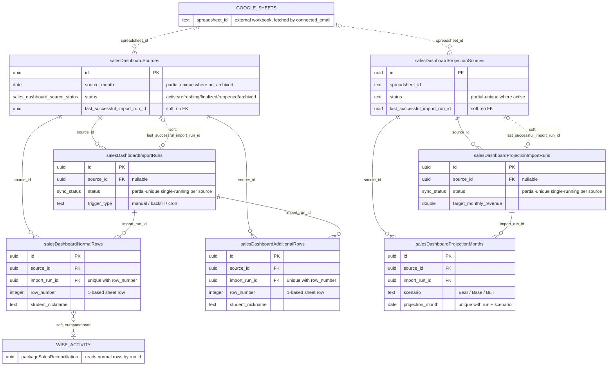

# Database Reference — Sales Dashboard (ER Diagram)

Scope: the 7 tables backing the Sales Dashboard feature (**stable**). The domain ingests Google Sheets — monthly sales workbooks and one scenario-projection workbook — into Postgres so `/sales-dashboard` never reads Sheets on the request path.

Two independent lineages share one shape (**source** → **import run** → **row tables**) but no foreign key:

- **Monthly sales** — `salesDashboardSources` → `salesDashboardImportRuns` → `salesDashboardNormalRows` + `salesDashboardAdditionalRows`. One source per Bangkok month; the cron at `10,40 * * * *` (`vercel.json:8-11`) re-imports the current month, plus the previous month through its 7th day.
- **Projection** — `salesDashboardProjectionSources` → `salesDashboardProjectionImportRuns` → `salesDashboardProjectionMonths`. A single active workbook parsed into Bear/Base/Bull rows per projection month.

Two properties govern every read. Nothing is deleted or overwritten: each import **appends** a fresh copy of the sheet under a new `import_run_id`. Readers therefore never query by month or by source — they dereference `sources.last_successful_import_run_id` and filter rows by that run id (`loadLiveRowData`, `src/lib/sales-dashboard/data.ts:869-899`; `getSalesDashboardProjectionPayload`, `data.ts:811-853`). That pointer, not any status column, is what makes a run's rows live.

Full column-by-column detail (types, defaults, every index) lives in [`./index.md`](./index.md); enum value sets live in [`./enums.md`](./enums.md). This page covers grain, keys, and relationships only. For purpose, business rules, and flows see [`../../features/sales-dashboard.md`](../../features/sales-dashboard.md).

## Scope

Exactly 7 tables (Drizzle export — Postgres table — `src/lib/db/schema.ts` line range):

| Table (varName) | Postgres table | Lines | Grain scope |
|---|---|---|---|
| `salesDashboardSources` | `sales_dashboard_sources` | 618–649 | one live row per Bangkok month |
| `salesDashboardImportRuns` | `sales_dashboard_import_runs` | 650–670 | run ledger (monthly lineage root) |
| `salesDashboardNormalRows` | `sales_dashboard_normal_rows` | 671–697 | appended per run, never deleted |
| `salesDashboardAdditionalRows` | `sales_dashboard_additional_rows` | 698–717 | appended per run, never deleted |
| `salesDashboardProjectionSources` | `sales_dashboard_projection_sources` | 718–742 | at most one `active` row |
| `salesDashboardProjectionImportRuns` | `sales_dashboard_projection_import_runs` | 743–762 | run ledger (projection lineage root) |
| `salesDashboardProjectionMonths` | `sales_dashboard_projection_months` | 763–794 | appended per run, never deleted |

## Relationship model

**Enforced foreign keys.** Every `.references(...)` in the domain, and none point outside it:

- `salesDashboardImportRuns.sourceId` → `salesDashboardSources.id`, **nullable** (`schema.ts:652`)
- `salesDashboardNormalRows.sourceId` / `.importRunId` → sources / import runs, both `notNull` (`schema.ts:673-674`)
- `salesDashboardAdditionalRows.sourceId` / `.importRunId` → sources / import runs, both `notNull` (`schema.ts:700-701`)
- `salesDashboardProjectionImportRuns.sourceId` → `salesDashboardProjectionSources.id`, **nullable** (`schema.ts:745`)
- `salesDashboardProjectionMonths.sourceId` / `.importRunId` → projection sources / projection runs, both `notNull` (`schema.ts:765-766`)

All are `ON DELETE no action ON UPDATE no action` (`drizzle/0020_sales_dashboard.sql:89-93`, `drizzle/0029_sales_dashboard_projection.sql:60-64`). No table in this domain is an FK target from any other domain, and no column here references core scheduling tables — there is no `snapshot_id` anywhere in the domain, so it is entirely outside the snapshot/ETL spine.

**Soft keys, no FK.**

- `salesDashboardSources.lastSuccessfulImportRunId` and `salesDashboardProjectionSources.lastSuccessfulImportRunId` are bare `uuid` columns with no `.references()` (`schema.ts:627`, `:726`) — a back-pointer from parent to child that would otherwise close a cycle. Every read path dereferences them anyway.
- Cross-domain reads join on the same pointer: Wise Activity reconciliation and Data Health both reach in without any declared relationship (see [Cross-domain notes](#cross-domain-notes)).

## ER diagram

```mermaid
erDiagram
    salesDashboardSources {
        uuid id PK
        date source_month "partial-unique where not archived"
        sales_dashboard_source_status status "active/refreshing/finalized/reopened/archived"
        uuid last_successful_import_run_id "soft, no FK"
    }
    salesDashboardImportRuns {
        uuid id PK
        uuid source_id FK "nullable"
        sync_status status "partial-unique single-running per source"
        text trigger_type "manual / backfill / cron"
    }
    salesDashboardNormalRows {
        uuid id PK
        uuid source_id FK
        uuid import_run_id FK "unique with row_number"
        integer row_number "1-based sheet row"
        text student_nickname
    }
    salesDashboardAdditionalRows {
        uuid id PK
        uuid source_id FK
        uuid import_run_id FK "unique with row_number"
        integer row_number "1-based sheet row"
        text student_nickname
    }
    salesDashboardProjectionSources {
        uuid id PK
        text spreadsheet_id
        text status "partial-unique where active"
        uuid last_successful_import_run_id "soft, no FK"
    }
    salesDashboardProjectionImportRuns {
        uuid id PK
        uuid source_id FK "nullable"
        sync_status status "partial-unique single-running per source"
        double target_monthly_revenue
    }
    salesDashboardProjectionMonths {
        uuid id PK
        uuid source_id FK
        uuid import_run_id FK
        text scenario "Bear / Base / Bull"
        date projection_month "unique with run + scenario"
    }
    GOOGLE_SHEETS {
        text spreadsheet_id "external workbook, fetched by connected_email"
    }
    WISE_ACTIVITY {
        uuid packageSalesReconciliation "reads normal rows by run id"
    }

    salesDashboardSources ||--o{ salesDashboardImportRuns : "source_id"
    salesDashboardSources ||--o{ salesDashboardNormalRows : "source_id"
    salesDashboardSources ||--o{ salesDashboardAdditionalRows : "source_id"
    salesDashboardImportRuns ||--o{ salesDashboardNormalRows : "import_run_id"
    salesDashboardImportRuns ||--o{ salesDashboardAdditionalRows : "import_run_id"
    salesDashboardImportRuns |o..o| salesDashboardSources : "soft: last_successful_import_run_id"
    salesDashboardProjectionSources ||--o{ salesDashboardProjectionImportRuns : "source_id"
    salesDashboardProjectionSources ||--o{ salesDashboardProjectionMonths : "source_id"
    salesDashboardProjectionImportRuns ||--o{ salesDashboardProjectionMonths : "import_run_id"
    salesDashboardProjectionImportRuns |o..o| salesDashboardProjectionSources : "soft: last_successful_import_run_id"
    GOOGLE_SHEETS |o..o{ salesDashboardSources : "spreadsheet_id"
    GOOGLE_SHEETS |o..o{ salesDashboardProjectionSources : "spreadsheet_id"
    salesDashboardNormalRows }o..o| WISE_ACTIVITY : "soft, outbound read"
```

`GOOGLE_SHEETS` and `WISE_ACTIVITY` are stub nodes, not tables in this domain — the first is the external workbook each source names, the second is the Wise Activity reconciliation that reads normal rows. No core stub (snapshots, tutors, identity groups) appears because the domain references none.

## Tables

### `salesDashboardSources` (`sales_dashboard_sources`, lines 618–649)

**Grain:** one non-archived row per Bangkok source month — the spreadsheet that month's sales are read from.

`sourceMonth` is a `date` (string mode) holding the first day of the month, and the grain is enforced by a **partial unique index filtered to live rows**: `sds_source_month_active_idx` on `sourceMonth` where `archived_at IS NULL` (`schema.ts:643-645`). Archived sources for a month may therefore accumulate, but only one live source per month can exist. Migration `0026` dropped the original unconditional unique index and replaced it with this one (`drizzle/0026_sales_dashboard_archival.sql:5-6`).

`status` uses `sales_dashboard_source_status` — `active` / `refreshing` / `finalized` / `reopened` / `archived` (`schema.ts:152-158`). `refreshing` is transient: the importer sets it before fetching and always leaves it on either path (`data.ts:457-460`, `:531-544`, `:553-563`). The month lifecycle is three pure predicates in `src/lib/sales-dashboard/lifecycle.ts` — `sourceShouldRefresh` refreshes only the current month plus the previous one through Bangkok day 7 (`:8-19`); `statusAfterSuccessfulImport` flips a source to `finalized` once it falls outside that window, while preserving `reopened` and `archived` (`:21-32`); `shouldAutoFinalizePreviousMonth` finalizes last month from day 8 without importing it (`:35-41`).

Sheet resolution is nullable by design: `normalSheetName` / `additionalSheetName` are overrides, and when absent the importer picks a tab by name from the live workbook, preferring the current name then the legacy one (`chooseSheetName`, `data.ts:148-151`, `:461-470`). Archival state is `archivedAt` / `archivedByEmail` / `statusBeforeArchive`, the last replaying the pre-archive enum value on restore (`data.ts:376-392`). Result caching lives on the row: `lastSuccessfulImportRunId`, `lastImportedAt`, `lastImportError`, `lastNormalRowCount`, `lastAdditionalRowCount`, plus `finalizedAt` / `reopenedAt`. Provenance is `connectedEmail` (the Google token owner the Sheets fetch runs as), `createdByEmail`, `updatedByEmail`.

Writes go through `upsertSalesDashboardSource` (`data.ts:181-217`), whose conflict target repeats the index predicate — `target: sourceMonth`, `targetWhere: archived_at IS NULL` (`:202-203`) — so an upsert updates the live source for a month and never revives an archived one. `restoreSalesDashboardSource` refuses a restore when another live source already holds that month (`data.ts:352-374`). Fourteen months of spreadsheet ids are seeded from `DEFAULT_SALES_SOURCES` (`src/lib/sales-dashboard/default-sources.ts:3-18`).

### `salesDashboardImportRuns` (`sales_dashboard_import_runs`, lines 650–670)

**Grain:** one row per import attempt against one monthly source.

`sourceId` is nullable at the schema level though the importer always supplies it (`acquireSalesImportRun`, `src/lib/sales-dashboard/import-guard.ts:179-186`). `status` is the shared `sync_status` enum — `running` / `success` / `failed` (`schema.ts:21-25`). `triggerType` is `notNull` **text** carrying `"manual"` / `"backfill"` / `"cron"` (`SalesImportTrigger`, `src/lib/sales-dashboard/types.ts:2`), a closed union enforced only in TypeScript. Outcome columns are `sourceCount`, `normalRowCount`, `additionalRowCount`, `errorSummary`, `actorEmail`, and `metadata`.

**Single-flight lives in Postgres, per source:** `sdir_source_single_running_idx` is unique on `sourceId` filtered to `status = 'running' AND source_id IS NOT NULL` (`schema.ts:666-668`). The application both pre-checks for a running row and catches the resulting `23505` — in either case returning a `SkippedSalesDashboardImportResult` rather than throwing, so a cron overlapping a manual refresh is a skip, not an error (`import-guard.ts:168-201`, `:57-63`).

`metadata` is also recovery state, not just diagnostics. Acquire stamps `{ previousStatus }` (`import-guard.ts:185`), because a run that dies mid-flight strands its source in `refreshing`. `failStaleSalesDashboardImports` fails any `running` row older than 20 minutes (`STALE_RUNNING_SALES_IMPORT_MS`, `import-guard.ts:6`, `:97-120`) and then reads that stamp back to restore each affected source's real status, defaulting to `active` if the value is unrecognized (`restoreStaleSourceStatuses`, `:74-95`; `metadataStatus`, `:67-72`). On success the same `metadata` column is overwritten with the resolved and available sheet names (`data.ts:519-531`), so the recovery hint does not survive a completed run.

### `salesDashboardNormalRows` (`sales_dashboard_normal_rows`, lines 671–697)

**Grain:** one row per `(importRunId, rowNumber)` on the main sales tab — a single package payment, unique via `sdnr_run_row_idx` (`schema.ts:692`).

`rowNumber` is the **1-based spreadsheet row**, not an ordinal: it is computed as `HEADER_ROW + rowIndex + 1` with `HEADER_ROW = 3` (`src/lib/sales-dashboard/parser.ts:6`, `:119`), so a row points back at the cell range it came from. `sourceMonth` is denormalized onto the row and indexed, as is `paymentDate` (`schema.ts:694-695`).

`studentNickname` and `paymentDate` are the only required business values — rows missing either are dropped at parse time, never persisted as blanks (`parser.ts:96-111`). The rest default rather than nullify: `program`, `packageHours`, `salesRepresentative`, `enrollmentType`, `programWiseName`, `packageHoursClean`, `churnStatus` are `notNull` text defaulting to `""`; `numberOfStudents` and `paymentAmount` are `doublePrecision` defaulting to 0; only `validUntil` is nullable. The full source row is kept as a header-keyed object in `raw`, which is never serialized to clients — the API goes through slim projections instead (`data.ts:917-930`).

**Four columns are derived at import time, not read time.** `analyzeNormalSalesRows` (`parser.ts:165-227`) groups a parse batch by lowercased nickname and writes back `enrollmentType` (Trial / New Student / Renewal), `programWiseName` (a `PROGRAM_MAP` lookup), `packageHoursClean`, and `churnStatus` (`Active` / `Retained` / `Churned` / `N/A`, default `—`, decided against a 14-day grace period past the latest paid `validUntil`, `:199-224`). The dashboard reads the stored strings verbatim (`src/lib/sales-dashboard/analytics.ts:295-301`), so these are a snapshot of what was true when the import ran.

### `salesDashboardAdditionalRows` (`sales_dashboard_additional_rows`, lines 698–717)

**Grain:** one row per `(importRunId, rowNumber)` on the *additional* sales tab — top-ups and ancillary purchases, unique via `sdar_run_row_idx` (`schema.ts:712`).

Structurally the sibling of the normal rows, with the same key design and the same four indexes, but a much smaller column set: `salesType` and `packageName` (`notNull` text, default `""`) replace the whole program/package/enrollment block, alongside `paymentAmount`, the required `studentNickname` / `paymentDate` pair, and `raw`.

Its rows receive **no derived analysis** — `parseAdditionalSalesRows` returns them unmodified (`parser.ts:138-163`), with no counterpart to `analyzeNormalSalesRows`. There is therefore no enrollment-type or churn signal on this table, and downstream it feeds only additive revenue aggregates. The tab itself is optional: when the workbook has no matching title the importer parses an empty array and the table simply gains no rows for that run (`data.ts:465-478`).

### `salesDashboardProjectionSources` (`sales_dashboard_projection_sources`, lines 718–742)

**Grain:** one row per projection workbook — in practice exactly one, because `"active"` is the only status ever written.

Not month-scoped. `status` is plain **text** defaulting to `"active"` (`schema.ts:725`), deliberately *not* the `sales_dashboard_source_status` enum the monthly sources use, and carries `sdps_single_active_idx` — unique on `status` filtered to `status = 'active'` (`:737-739`) — so at most one active projection source can exist. The three sheet-name columns are `notNull` with schema defaults `"Summary"`, `"What_If"`, `"Calc_Multi"` (`:722-724`), and unlike the monthly lineage they are **requirements, not fallbacks**: a missing tab aborts the import with a named error (`requireProjectionSheet`, `data.ts:602-605`).

The result cache mirrors the monthly source and adds `lastTargetMonthlyRevenue` — the headline revenue target the dashboard falls back to when the run row is unavailable (`data.ts:843-846`).

Reads resolve the row by `status = 'active'` with `limit 1` (`getActiveSalesDashboardProjectionSource`, `data.ts:236-243`), and the upsert **updates that row in place** rather than inserting a second (`data.ts:245-276`). There is no archive path and no seeded history: replacing the workbook rewrites the single row.

### `salesDashboardProjectionImportRuns` (`sales_dashboard_projection_import_runs`, lines 743–762)

**Grain:** one row per projection-workbook import attempt.

Column-for-column the projection twin of the monthly ledger — nullable `sourceId`, `sync_status` enum, free-text `triggerType`, `startedAt` / `finishedAt` — differing in its outcome pair: `monthRowCount` and the nullable `targetMonthlyRevenue`. Indexes mirror the monthly ones, including the partial unique `sdpir_source_single_running_idx` on `sourceId` where `status = 'running' AND source_id IS NOT NULL` (`schema.ts:758-760`).

`metadata` here is **load-bearing rather than diagnostic**: the Bear/Base/Bull headline summaries live inside it and are re-read on every dashboard load through a defensive filter that keeps only entries whose `scenario` is one of the three literals (`scenarioSummariesFromMetadata`, `data.ts:801-809`; written at `:686-691`). It also holds the three resolved sheet names and the workbook's full tab list (`data.ts:619-627`).

Unlike the monthly lineage, this ledger has **no application-side guard and no stale-run sweeper** — the importer inserts the `running` row directly with no pre-check and no `23505` handler (`data.ts:633-652`). See [Open questions](#open-questions).

### `salesDashboardProjectionMonths` (`sales_dashboard_projection_months`, lines 763–794)

**Grain:** one row per `(importRunId, scenario, projectionMonth)` — a single month-column of one scenario block in the `Calc_Multi` sheet, unique via `sdpm_run_scenario_month_idx` (`schema.ts:787`).

`scenario` is `notNull` **text**, though the parser only emits `Bear` / `Base` / `Bull` (`SCENARIOS`, `src/lib/sales-dashboard/projection.ts:14`) and the sheet must carry a `--- Bear ---`-style marker for each block or the parse fails (`:139-147`). `monthKind` is `notNull` text defaulting to `"forecast"`, set to `"actual"` only where the sheet's status row says so (`parseMonthKind`, `projection.ts:158-164`, applied at `:190`) — the fail-safe default is to treat a month as forecast rather than as settled history.

The fourteen measure columns are all `doublePrecision` `notNull` defaulting to 0: three revenue splits plus a total (`totalNetRevenue`, `renewalRevenue`, `newStudentRevenue`, `trialRevenue`), four volume counts (`activeStudents`, `trialBookings`, `newStudents`, `packRenewals`), four hour splits plus a total (`renewalHours`, `newStudentHours`, `trialHours`, `totalHours`), and `roomCapacity` / `roomUtilization`. `monthLabel` preserves the sheet's own column header. There is no `updatedAt` — rows are write-once.

Reads take the whole set for one run id ordered by `(projectionMonth, scenario)` (`data.ts:836-839`), so the payload returns all three scenarios interleaved per month and the client splits them.

## Cross-domain notes

- **Wise Activity → `salesDashboardNormalRows`** — package-sales reconciliation picks a non-archived month, then loads that month's rows by its `lastSuccessfulImportRunId` ordered by `rowNumber` (`src/lib/wise-activity/reconciliation.ts:748-754`, `:848-851`, `:940-943`). A soft read on the same run-id pointer the dashboard uses; no FK, no write back.
- **Data Health → both run ledgers** — lists the most recent monthly and projection runs side by side for freshness reporting (`src/lib/data-health/dashboard.ts:771-772`).
- **Google Sheets** — the only external dependency. Both source tables store a `spreadsheetId` plus the `connectedEmail` whose OAuth token authorizes the fetch; the workbook itself is never mirrored beyond the parsed rows and the per-row `raw` jsonb.
- **No core coupling.** Nothing here carries a `snapshotId`, and no Wise identity key is stored, so a snapshot rotation cannot affect any row in this domain.

## Write-path note

Unlike Payroll, the sales import is **not transactional**. Rows are appended in batches of 500 through `insertChunks` (`data.ts:153-161`) over the Neon HTTP driver, with no `BEGIN` around them, so a run that dies mid-insert leaves a partial row set behind permanently. The mitigation is ordering rather than atomicity: `lastSuccessfulImportRunId` is only advanced after every batch lands and the run flips to `success` (`data.ts:519-544`), and every reader filters on that pointer — the guarantee documented on `loadLiveRowData` itself (`data.ts:863-868`). Partial runs become inert rows, never visible data.

Failure paths are symmetric across both lineages: the run is marked `failed` with an error summary, the source's `lastImportError` is set, and — for monthly sources — `status` is rolled back to the pre-import value rather than left at `refreshing` (`data.ts:553-563`; projection equivalent at `:713-724`). The cron entry point runs the monthly refresh and then the projection import in sequence, returning `409` rather than `500` when the Google token is missing (`src/app/api/internal/sync-sales-dashboard/route.ts:52-67`).

## Open questions

- **Row tables grow without bound.** No `delete()` against any of the seven tables exists in `src/`, and the snapshot pruning helper covers only snapshot-scoped tables (`src/lib/sync/snapshot-pruning.ts:49-121`). With the cron at `10,40 * * * *` re-importing the current month — and early each month the previous one — a complete copy of every sheet row is appended roughly every 30 minutes, while only rows under `lastSuccessfulImportRunId` are ever read. Whether retention is handled out of band or superseded runs are meant to be pruned is not answerable from the code.
- **The projection lineage has no stale-run recovery.** Its partial unique index (`schema.ts:758-760`) will reject a concurrent import with a raw `23505`, but `importSalesDashboardProjectionSource` neither pre-checks for a running row nor catches that error the way `acquireSalesImportRun` does (`data.ts:633-652` vs `import-guard.ts:168-201`), and there is no projection counterpart to `failStaleSalesDashboardImports`. A run that dies mid-flight leaves a permanent `running` row that blocks every future projection import. Whether that asymmetry is intentional is not determinable from the code.
- **Derived sales columns are frozen at import time and scoped to one month.** `enrollmentType` and `churnStatus` are computed by grouping rows *within a single source's parse* against the import-time clock (`parser.ts:165-227`), then stored and read back verbatim (`analytics.ts:295-301`). A finalized month's churn labels never age, and a student whose trial and first paid package straddle a month boundary is grouped in neither pass. Whether recomputation across the live row set was intended is not stated anywhere in the code.
- **`lastSuccessfulImportRunId` carries no foreign key** on either source table (`schema.ts:627`, `:726`) despite being the pointer every read path dereferences. Whether that is deliberate — it would close a cycle between the source and run tables — or an oversight is not recorded.
- **`status`, `triggerType`, `scenario`, and `monthKind` are modeled inconsistently.** `sales_dashboard_sources.status` is a `pgEnum`; `sales_dashboard_projection_sources.status` is plain text with the same `"active"` default (`schema.ts:626` vs `:725`), and the other three are unconstrained text over closed TypeScript unions. No note in the code explains why one of the pair was promoted to an enum and the other was not.
- **Dead branch in the source upsert.** `upsertSalesDashboardSource` writes `status: sourceMonth === currentBangkokMonthStart(now) ? "active" : "active"` (`data.ts:198`) — both arms identical, so a back-dated month is created `active` and only reaches `finalized` on its next import. Whether a distinct initial status was intended for historical sources cannot be recovered from the code.

_Verified against main@0cd1e81 (clean tree) on 2026-09-02._
