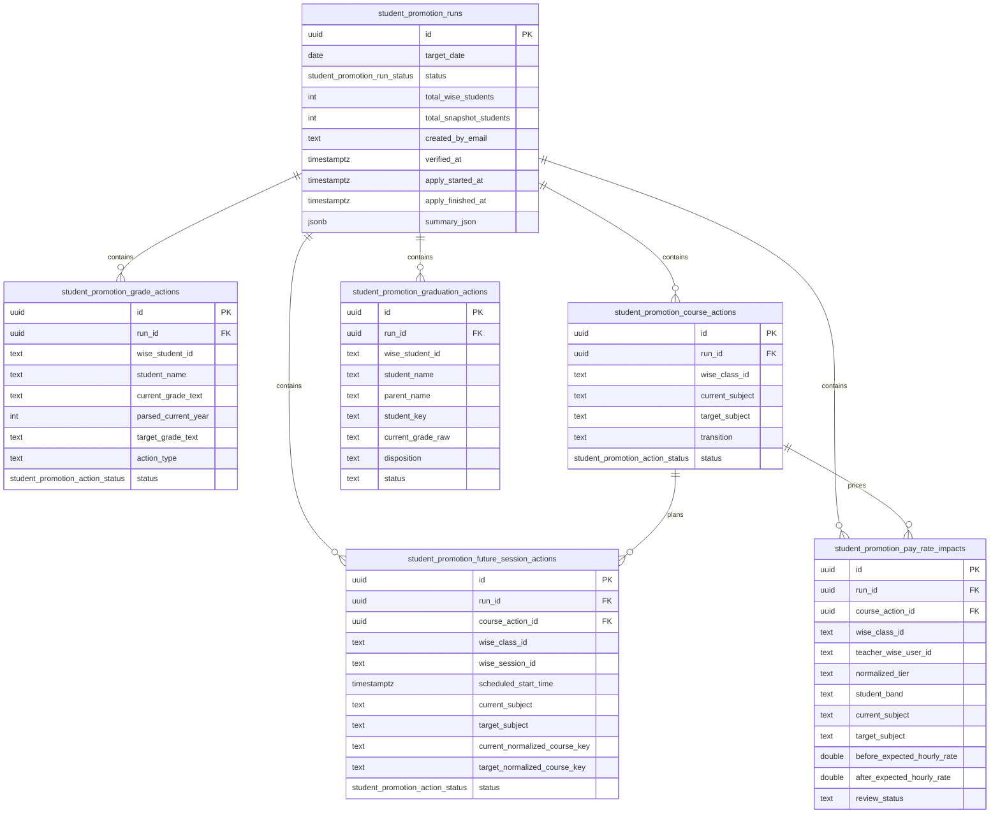

# Student Promotions ERD

Mechanical table reference for the July 1, 2026 Student Promotions workflow. Feature behavior and rules live in [docs/features/student-promotions.md](../../features/student-promotions.md).

The domain owns six snapshot-independent audit tables. They do not rotate with `snapshots` or `credit_control_snapshots`; a dry run records the website snapshot ids and Wise payloads it used for traceability.

## Tables

### `student_promotion_runs`

One dry-run/apply ledger row for the fixed target date `2026-07-01`.

| Column | Type | Notes |
|---|---|---|
| `id` | `uuid` | Primary key, default random UUID. |
| `target_date` | `date` | The promotion target date; current workflow uses `2026-07-01`. |
| `status` | `student_promotion_run_status` | `draft`, `verified`, `applying`, `applied`, `applied_with_errors`, `failed`; default `draft`. |
| `total_wise_students` | `integer` | Count of accepted Wise students fetched during audit. |
| `total_snapshot_students` | `integer` | Count of website snapshot students used for comparison. |
| `summary_json` | `jsonb` | Summary counts and review buckets shown in the UI. |
| `created_by_email`, `created_by_name` | `text` | Admin who ran the audit. |
| `verified_by_email`, `verified_by_name`, `verified_at` | `text`, `text`, `timestamptz` | Admin and time for verification. |
| `endpoint_verification_note` | `text` | Required note documenting approved Wise endpoint verification before the run can be verified. |
| `applied_by_email`, `applied_by_name` | `text` | Actor for apply (`cron` or admin). |
| `apply_started_at`, `apply_finished_at` | `timestamptz` | Apply lifecycle timestamps. |
| `error_summary`, `error_message` | `text` | Run-level failure or partial-apply summary. |
| `created_at`, `updated_at` | `timestamptz` | Audit timestamps. |

Indexes:

- `student_promotion_runs_target_status_idx` on `(target_date, status)`
- `student_promotion_runs_created_at_idx` on `created_at`
- `student_promotion_runs_verified_idx` on `verified_at`

### `student_promotion_grade_actions`

One potential Wise registration update per accepted Wise student in a run.

| Column | Type | Notes |
|---|---|---|
| `id` | `uuid` | Primary key. |
| `run_id` | `uuid` | FK to `student_promotion_runs.id`, cascade delete. |
| `wise_student_id` | `text` | Wise participant/student id. |
| `student_name` | `text` | Display name captured at audit time. |
| `current_grade_text` | `text` | Raw Wise registration value from `if89sblj`. |
| `parsed_current_year` | `integer` | Parsed current year, nullable for blank/unparseable rows. |
| `target_grade_text` | `text` | Canonical target, e.g. `Year 9 / Grade 8`. |
| `action_type` | `text` | `grade_increment_only`, `year8_course_and_grade`, or `year11_course_and_grade`. |
| `status` | `student_promotion_action_status` | `pending`, `skipped`, `applied`, `failed`; default `pending`. |
| `skip_reason` | `text` | Blank/unparseable/drift reason for skipped rows. |
| `wise_response_json`, `wise_error_json` | `jsonb` | Raw response/error payloads from Wise. |
| `applied_at`, `created_at`, `updated_at` | `timestamptz` | Lifecycle timestamps. |

Indexes:

- `student_promotion_grade_actions_run_idx` on `run_id`
- `student_promotion_grade_actions_student_idx` on `(run_id, wise_student_id)`
- `student_promotion_grade_actions_status_idx` on `(run_id, status)`

### `student_promotion_course_actions`

One potential class/course subject update per Wise class id in a run. The service dedupes by `wise_class_id`.

| Column | Type | Notes |
|---|---|---|
| `id` | `uuid` | Primary key. |
| `run_id` | `uuid` | FK to `student_promotion_runs.id`, cascade delete. |
| `wise_class_id` | `text` | Wise class/course id. |
| `class_name` | `text` | Captured class display name. |
| `current_subject` | `text` | Exact source subject captured at audit time. |
| `target_subject` | `text` | Exact target subject, nullable for review-only/unmapped variants. |
| `transition` | `text` | `year8_to_year9`, `year11_to_year12`, or skipped classification. |
| `student_ids` | `jsonb` | Student ids in the class at audit time. |
| `blocked_student_ids` | `jsonb` | Roster students that prevented auto-update. |
| `status` | `student_promotion_action_status` | `pending`, `skipped`, `applied`, `failed`; default `pending`. |
| `skip_reason` | `text` | Unmapped/mixed/drift reason for skipped rows. |
| `wise_response_json`, `wise_error_json` | `jsonb` | Raw response/error payloads from Wise. |
| `applied_at`, `created_at`, `updated_at` | `timestamptz` | Lifecycle timestamps. |

Indexes:

- `student_promotion_course_actions_run_idx` on `run_id`
- `student_promotion_course_actions_class_idx` on `(run_id, wise_class_id)`
- `student_promotion_course_actions_status_idx` on `(run_id, status)`

### `student_promotion_future_session_actions`

One audited July 1+ future Wise session subject check/update candidate per run and Wise session id. Rows are generated only for mapped UK/US/IB school-curriculum course actions where payroll derives the promoted course band from the session subject.

| Column | Type | Notes |
|---|---|---|
| `id` | `uuid` | Primary key. |
| `run_id` | `uuid` | FK to `student_promotion_runs.id`. |
| `course_action_id` | `uuid` | FK to the class/course action that determines the target subject. |
| `wise_class_id` | `text` | Wise class id returned on the live session. |
| `wise_session_id` | `text` | Wise session id. Unique per run. |
| `scheduled_start_time` | `timestamptz` | Live Wise scheduled start. Only sessions on or after `2026-07-01T00:00:00+07:00` are in scope. |
| `current_subject` | `text` | Live session/class subject observed during refresh. |
| `target_subject` | `text` | Promoted school-curriculum subject to use for payroll course-band normalization. |
| `current_normalized_course_key` | `text` | Payroll course key from the live subject, nullable when unknown. |
| `target_normalized_course_key` | `text` | Expected promoted payroll course key. |
| `status` | `student_promotion_action_status` | `pending`, `skipped`, `applied`, `failed`; default `pending`. |
| `skip_reason` | `text` | Drift/unmapped/manual reason for skipped rows. |
| `request_payload`, `response_payload` | `jsonb` | Raw Wise request/response payloads for gated single-session writes or idempotent readback. |
| `error_message` | `text` | Wise error or drift detail. |
| `applied_at`, `created_at`, `updated_at` | `timestamptz` | Lifecycle timestamps. |

Indexes:

- `sp_future_session_actions_run_session_idx` unique on `(run_id, wise_session_id)`
- `sp_future_session_actions_run_status_idx` on `(run_id, status)`
- `sp_future_session_actions_class_idx` on `wise_class_id`
- `sp_future_session_actions_course_action_idx` on `course_action_id`
- `sp_future_session_actions_start_idx` on `scheduled_start_time`

### `student_promotion_graduation_actions`

One required Year 13 disposition review row per accepted Wise student parsed as current Year 13.

| Column | Type | Notes |
|---|---|---|
| `id` | `uuid` | Primary key. |
| `run_id` | `uuid` | FK to `student_promotion_runs.id`. |
| `wise_student_id` | `text` | Wise student id. Unique per run. |
| `student_name`, `parent_name`, `student_key` | `text` | Credit Control identity snapshot used for local inactive writes. |
| `current_grade_raw` | `text` | Raw Wise grade value at audit time. |
| `disposition` | `text` | `inactive`, `university`, or null until admin review. |
| `status` | `text` | `pending_review`, `selected`, `applied`, or `failed`. |
| `reviewed_by_email`, `reviewed_by_name`, `reviewed_at` | `text`, `text`, `timestamptz` | Admin review audit fields. |
| `applied_at`, `error_message`, `created_at`, `updated_at` | `timestamptz`, `text`, `timestamptz`, `timestamptz` | Lifecycle fields. |

Indexes:

- `sp_graduation_actions_run_student_idx` unique on `(run_id, wise_student_id)`
- `sp_graduation_actions_run_status_idx` on `(run_id, status)`
- `sp_graduation_actions_student_idx` on `wise_student_id`

### `student_promotion_pay_rate_impacts`

One pay-rate review row per teacher + class + student band + current/target course pair for July 1+ future sessions affected by Year 8, Year 11, or selected Year 13 University course moves.

| Column | Type | Notes |
|---|---|---|
| `id` | `uuid` | Primary key. |
| `run_id` | `uuid` | FK to `student_promotion_runs.id`. |
| `course_action_id` | `uuid` | FK to the class/course action. |
| `impact_key` | `text` | Stable per-run grouping key; unique with `run_id`. |
| `wise_class_id` | `text` | Wise class id. |
| `teacher_wise_id`, `teacher_wise_user_id`, `teacher_name` | `text` | Live Wise teacher identity at audit time. |
| `raw_tier`, `normalized_tier` | `text` | Tier tag from live Wise teacher tags and normalized payroll tier. |
| `student_band` | `text` | Payroll student-count band: `1`, `2`, or `3_plus`. |
| `current_subject`, `target_subject` | `text` | Subject pair being reviewed. |
| `current_normalized_course_key`, `target_normalized_course_key` | `text` | Payroll course keys used for rate-card lookup. |
| `before_rate_rule_id`, `after_rate_rule_id` | `uuid` | Payroll rate-card rules used for before/after rates. |
| `before_expected_hourly_rate`, `after_expected_hourly_rate`, `rate_delta` | `double precision` | Expected hourly rate comparison from the active payroll rate card. |
| `future_session_count`, `first_session_start_time`, `last_session_start_time` | `integer`, `timestamptz`, `timestamptz` | Live future-session coverage. |
| `affected_student_ids`, `affected_student_names` | `jsonb` | Students from the associated course action. |
| `review_status` | `text` | `pending_review`, `verified_correct`, `incorrect`, or `blocked`. |
| `blocker_reason` | `text` | Missing tier/rate-card/mapping/rule reason when blocked. |
| `reviewed_by_email`, `reviewed_by_name`, `reviewed_at`, `review_note` | `text`, `text`, `timestamptz`, `text` | Admin review audit fields. |
| `created_at`, `updated_at` | `timestamptz` | Audit timestamps. |

Indexes:

- `sp_pay_rate_impacts_run_key_idx` unique on `(run_id, impact_key)`
- `sp_pay_rate_impacts_run_review_idx` on `(run_id, review_status)`
- `sp_pay_rate_impacts_class_idx` on `wise_class_id`
- `sp_pay_rate_impacts_course_action_idx` on `course_action_id`

## Enums

`student_promotion_run_status`:

- `draft`
- `verified`
- `applying`
- `applied`
- `applied_with_errors`
- `failed`
`student_promotion_action_status`:

- `pending`
- `skipped`
- `applied`
- `failed`
