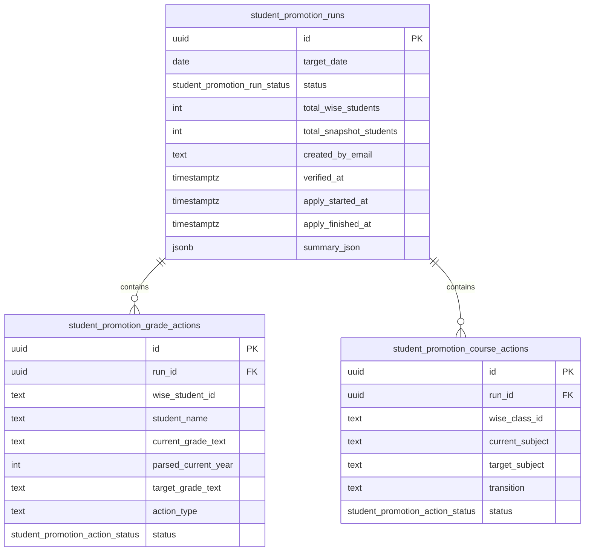

# Student Promotions ERD

Mechanical table reference for the July 1, 2026 Student Promotions workflow. Feature behavior and rules live in [docs/features/student-promotions.md](../../features/student-promotions.md).

The domain owns three snapshot-independent audit tables. They do not rotate with `snapshots` or `credit_control_snapshots`; a dry run records the website snapshot ids and Wise payloads it used for traceability.

## Tables

### `student_promotion_runs`

One dry-run/apply ledger row for the fixed target date `2026-07-01`.

| Column | Type | Notes |
|---|---|---|
| `id` | `uuid` | Primary key, default random UUID. |
| `target_date` | `date` | The promotion target date; current workflow uses `2026-07-01`. |
| `status` | `student_promotion_run_status` | `draft`, `verified`, `applying`, `applied`, `applied_with_errors`, `failed`; default `draft`. |
| `total_wise_students` | `integer` | Count of accepted Wise students fetched during audit. |
| `total_snapshot_students` | `integer` | Count of website snapshot students used for comparison. |
| `summary_json` | `jsonb` | Summary counts and review buckets shown in the UI. |
| `created_by_email`, `created_by_name` | `text` | Admin who ran the audit. |
| `verified_by_email`, `verified_by_name`, `verified_at` | `text`, `text`, `timestamptz` | Admin and time for verification. |
| `endpoint_verification_note` | `text` | Required note documenting approved Wise endpoint verification before the run can be verified. |
| `applied_by_email`, `applied_by_name` | `text` | Actor for apply (`cron` or admin). |
| `apply_started_at`, `apply_finished_at` | `timestamptz` | Apply lifecycle timestamps. |
| `error_summary`, `error_message` | `text` | Run-level failure or partial-apply summary. |
| `created_at`, `updated_at` | `timestamptz` | Audit timestamps. |

Indexes:

- `student_promotion_runs_target_status_idx` on `(target_date, status)`
- `student_promotion_runs_created_at_idx` on `created_at`
- `student_promotion_runs_verified_idx` on `verified_at`

### `student_promotion_grade_actions`

One potential Wise registration update per accepted Wise student in a run.

| Column | Type | Notes |
|---|---|---|
| `id` | `uuid` | Primary key. |
| `run_id` | `uuid` | FK to `student_promotion_runs.id`, cascade delete. |
| `wise_student_id` | `text` | Wise participant/student id. |
| `student_name` | `text` | Display name captured at audit time. |
| `current_grade_text` | `text` | Raw Wise registration value from `if89sblj`. |
| `parsed_current_year` | `integer` | Parsed current year, nullable for blank/unparseable rows. |
| `target_grade_text` | `text` | Canonical target, e.g. `Year 9 / Grade 8`. |
| `action_type` | `text` | `grade_increment_only`, `year8_course_and_grade`, or `year11_course_and_grade`. |
| `status` | `student_promotion_action_status` | `pending`, `skipped`, `applied`, `failed`; default `pending`. |
| `skip_reason` | `text` | Blank/unparseable/drift reason for skipped rows. |
| `wise_response_json`, `wise_error_json` | `jsonb` | Raw response/error payloads from Wise. |
| `applied_at`, `created_at`, `updated_at` | `timestamptz` | Lifecycle timestamps. |

Indexes:

- `student_promotion_grade_actions_run_idx` on `run_id`
- `student_promotion_grade_actions_student_idx` on `(run_id, wise_student_id)`
- `student_promotion_grade_actions_status_idx` on `(run_id, status)`

### `student_promotion_course_actions`

One potential class/course subject update per Wise class id in a run. The service dedupes by `wise_class_id`.

| Column | Type | Notes |
|---|---|---|
| `id` | `uuid` | Primary key. |
| `run_id` | `uuid` | FK to `student_promotion_runs.id`, cascade delete. |
| `wise_class_id` | `text` | Wise class/course id. |
| `class_name` | `text` | Captured class display name. |
| `current_subject` | `text` | Exact source subject captured at audit time. |
| `target_subject` | `text` | Exact target subject, nullable for review-only/unmapped variants. |
| `transition` | `text` | `year8_to_year9`, `year11_to_year12`, or skipped classification. |
| `student_ids` | `jsonb` | Student ids in the class at audit time. |
| `blocked_student_ids` | `jsonb` | Roster students that prevented auto-update. |
| `status` | `student_promotion_action_status` | `pending`, `skipped`, `applied`, `failed`; default `pending`. |
| `skip_reason` | `text` | Unmapped/mixed/drift reason for skipped rows. |
| `wise_response_json`, `wise_error_json` | `jsonb` | Raw response/error payloads from Wise. |
| `applied_at`, `created_at`, `updated_at` | `timestamptz` | Lifecycle timestamps. |

Indexes:

- `student_promotion_course_actions_run_idx` on `run_id`
- `student_promotion_course_actions_class_idx` on `(run_id, wise_class_id)`
- `student_promotion_course_actions_status_idx` on `(run_id, status)`

## Enums

`student_promotion_run_status`:

- `draft`
- `verified`
- `applying`
- `applied`
- `applied_with_errors`
- `failed`
`student_promotion_action_status`:

- `pending`
- `skipped`
- `applied`
- `failed`
